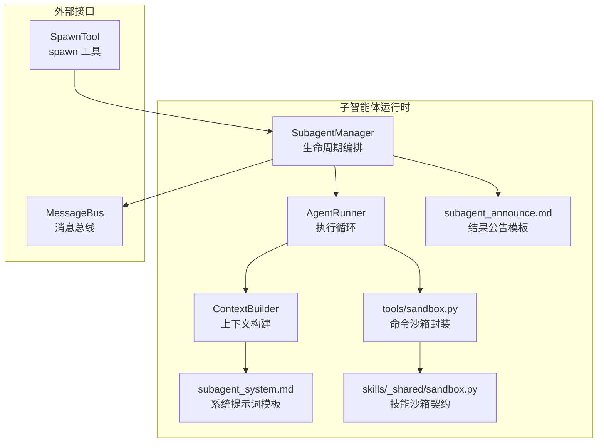
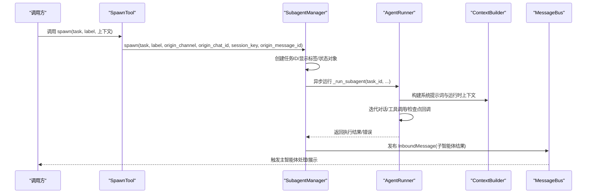
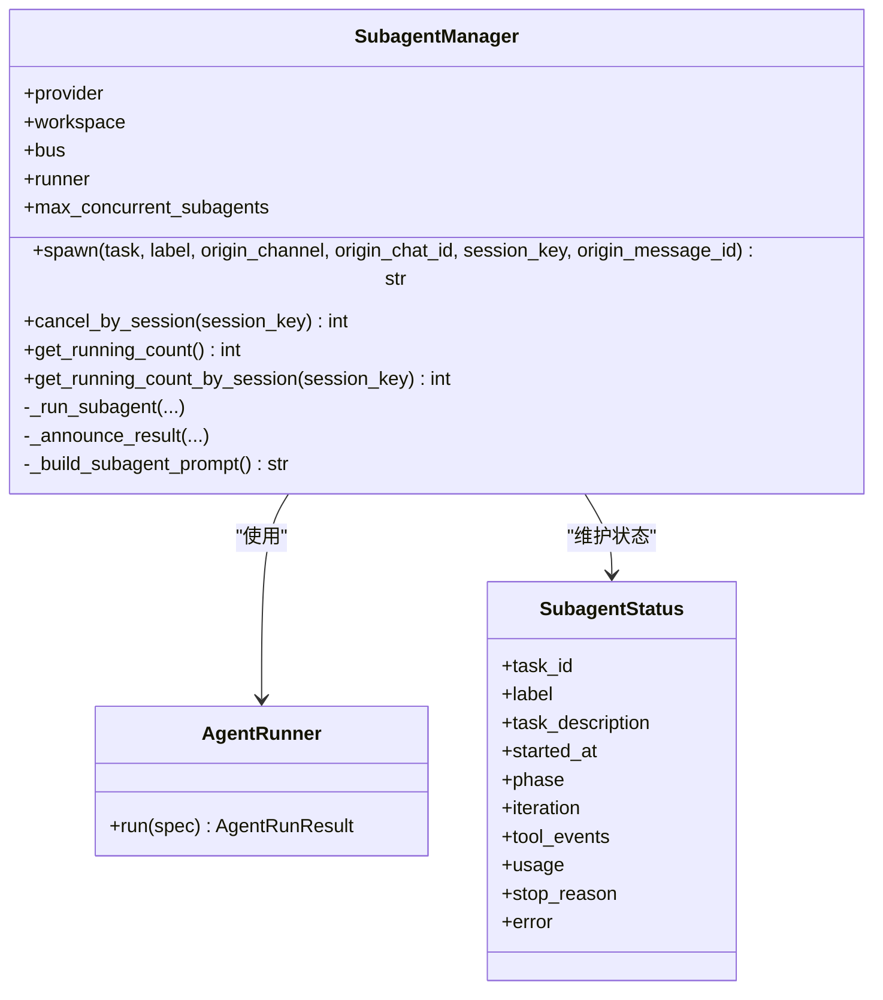
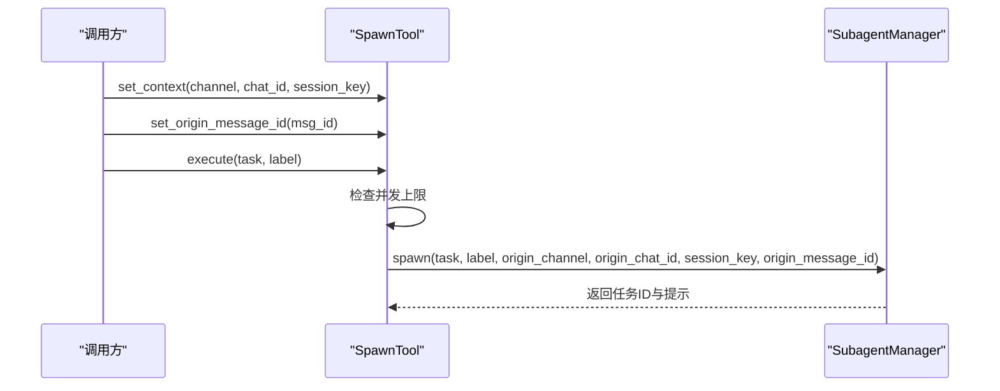
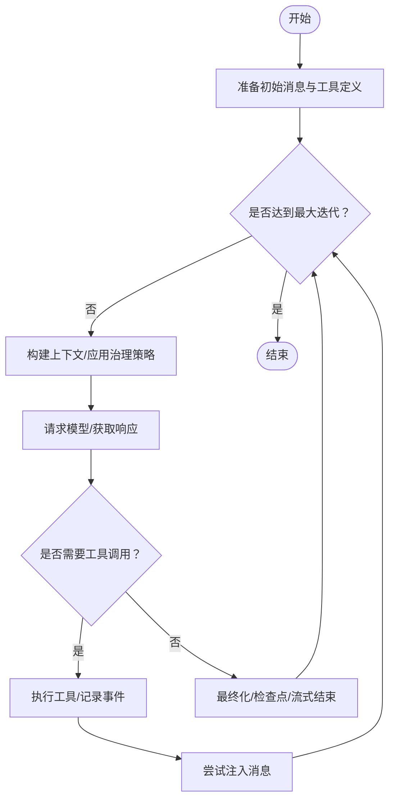
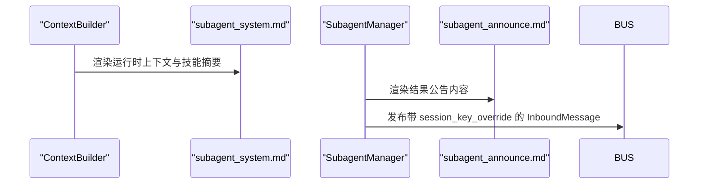
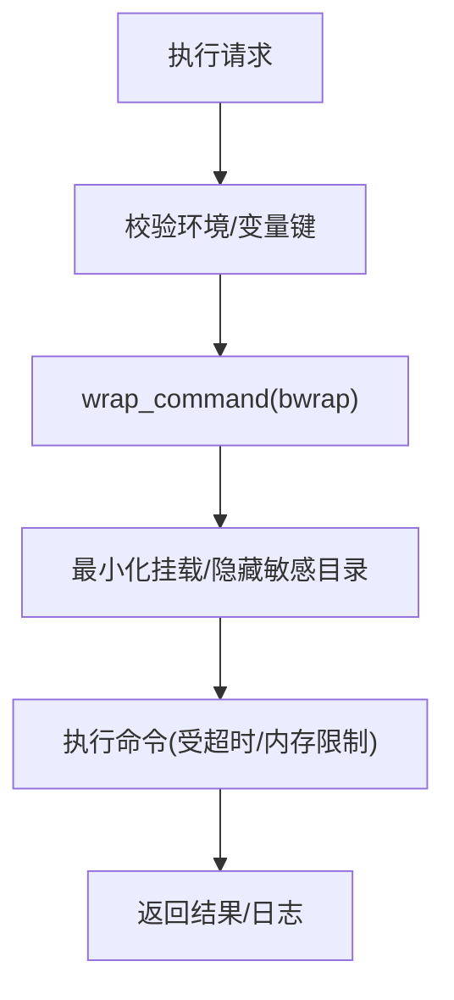
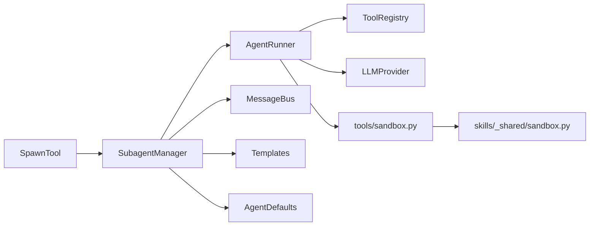

# 子智能体生命周期

<cite>
**本文引用的文件**
- [secbot/agent/subagent.py](file://secbot/agent/subagent.py)
- [secbot/agent/tools/spawn.py](file://secbot/agent/tools/spawn.py)
- [secbot/agent/runner.py](file://secbot/agent/runner.py)
- [secbot/agent/context.py](file://secbot/agent/context.py)
- [secbot/templates/agent/subagent_system.md](file://secbot/templates/agent/subagent_system.md)
- [secbot/templates/agent/subagent_announce.md](file://secbot/templates/agent/subagent_announce.md)
- [secbot/agent/tools/sandbox.py](file://secbot/agent/tools/sandbox.py)
- [secbot/skills/_shared/sandbox.py](file://secbot/skills/_shared/sandbox.py)
- [secbot/config/schema.py](file://secbot/config/schema.py)
- [tests/agent/tools/test_subagent_tools.py](file://tests/agent/tools/test_subagent_tools.py)
- [tests/test_tool_contextvars.py](file://tests/test_tool_contextvars.py)
- [tests/agent/test_task_cancel.py](file://tests/agent/test_task_cancel.py)
</cite>

## 目录
1. [简介](#简介)
2. [项目结构](#项目结构)
3. [核心组件](#核心组件)
4. [架构总览](#架构总览)
5. [详细组件分析](#详细组件分析)
6. [依赖分析](#依赖分析)
7. [性能考量](#性能考量)
8. [故障排查指南](#故障排查指南)
9. [结论](#结论)
10. [附录](#附录)

## 简介
本文件系统性阐述 VAPT3 中“子智能体生命周期管理”的设计与实现，重点围绕 SubagentManager 的全生命周期管理能力：创建、初始化、启动、监控、取消、统计与结果回传；解释子智能体与父智能体之间的上下文传递机制（状态继承、数据共享、通信协议）；说明隔离与安全控制（资源限制、权限控制、沙箱保护）；并提供子智能体开发的接口规范、配置要点、调试方法与性能优化建议。

## 项目结构
与子智能体生命周期相关的核心模块分布如下：
- 生命周期编排与状态管理：secbot/agent/subagent.py
- 启动入口与上下文注入：secbot/agent/tools/spawn.py
- 执行循环与工具调用：secbot/agent/runner.py
- 上下文构建与提示词模板：secbot/agent/context.py
- 模板：subagent_system.md、subagent_announce.md
- 沙箱与安全：secbot/agent/tools/sandbox.py、secbot/skills/_shared/sandbox.py
- 配置与默认值：secbot/config/schema.py
- 测试：tests/agent/tools/test_subagent_tools.py、tests/test_tool_contextvars.py、tests/agent/test_task_cancel.py

图表来源
- [secbot/agent/subagent.py:70-360](file://secbot/agent/subagent.py#L70-L360)
- [secbot/agent/tools/spawn.py:20-75](file://secbot/agent/tools/spawn.py#L20-L75)
- [secbot/agent/runner.py:100-567](file://secbot/agent/runner.py#L100-L567)
- [secbot/agent/context.py:17-215](file://secbot/agent/context.py#L17-L215)
- [secbot/templates/agent/subagent_system.md:1-20](file://secbot/templates/agent/subagent_system.md#L1-L20)
- [secbot/templates/agent/subagent_announce.md:1-9](file://secbot/templates/agent/subagent_announce.md#L1-L9)
- [secbot/agent/tools/sandbox.py:14-56](file://secbot/agent/tools/sandbox.py#L14-L56)
- [secbot/skills/_shared/sandbox.py:70-98](file://secbot/skills/_shared/sandbox.py#L70-L98)

章节来源
- [secbot/agent/subagent.py:70-360](file://secbot/agent/subagent.py#L70-L360)
- [secbot/agent/tools/spawn.py:20-75](file://secbot/agent/tools/spawn.py#L20-L75)
- [secbot/agent/runner.py:100-567](file://secbot/agent/runner.py#L100-L567)
- [secbot/agent/context.py:17-215](file://secbot/agent/context.py#L17-L215)
- [secbot/templates/agent/subagent_system.md:1-20](file://secbot/templates/agent/subagent_system.md#L1-L20)
- [secbot/templates/agent/subagent_announce.md:1-9](file://secbot/templates/agent/subagent_announce.md#L1-L9)
- [secbot/agent/tools/sandbox.py:14-56](file://secbot/agent/tools/sandbox.py#L14-L56)
- [secbot/skills/_shared/sandbox.py:70-98](file://secbot/skills/_shared/sandbox.py#L70-L98)

## 核心组件
- SubagentManager：负责子智能体的创建、并发控制、状态跟踪、取消与结果回传。
- SpawnTool：对外暴露的 spawn 工具，负责设置上下文并触发子智能体创建。
- AgentRunner：统一的工具型智能体执行循环，支持多轮对话、工具调用、注入消息、检查点回调等。
- ContextBuilder：构建系统提示词与用户消息，注入运行时上下文元数据。
- 模板：subagent_system.md 用于子智能体系统提示词，subagent_announce.md 用于结果公告格式。
- 沙箱：tools/sandbox.py 提供命令包装，skills/_shared/sandbox.py 提供技能执行的安全契约。
- 配置：AgentDefaults 提供并发、迭代次数、工具结果长度等默认值。

章节来源
- [secbot/agent/subagent.py:70-360](file://secbot/agent/subagent.py#L70-L360)
- [secbot/agent/tools/spawn.py:20-75](file://secbot/agent/tools/spawn.py#L20-L75)
- [secbot/agent/runner.py:100-567](file://secbot/agent/runner.py#L100-L567)
- [secbot/agent/context.py:17-215](file://secbot/agent/context.py#L17-L215)
- [secbot/templates/agent/subagent_system.md:1-20](file://secbot/templates/agent/subagent_system.md#L1-L20)
- [secbot/templates/agent/subagent_announce.md:1-9](file://secbot/templates/agent/subagent_announce.md#L1-L9)
- [secbot/agent/tools/sandbox.py:14-56](file://secbot/agent/tools/sandbox.py#L14-L56)
- [secbot/skills/_shared/sandbox.py:70-98](file://secbot/skills/_shared/sandbox.py#L70-L98)
- [secbot/config/schema.py:68-113](file://secbot/config/schema.py#L68-L113)

## 架构总览
子智能体生命周期由“工具入口 → 管理器 → 执行循环 → 结果公告”构成，贯穿上下文传递与安全控制。

图表来源
- [secbot/agent/tools/spawn.py:57-75](file://secbot/agent/tools/spawn.py#L57-L75)
- [secbot/agent/subagent.py:112-152](file://secbot/agent/subagent.py#L112-L152)
- [secbot/agent/subagent.py:154-255](file://secbot/agent/subagent.py#L154-L255)
- [secbot/agent/runner.py:234-567](file://secbot/agent/runner.py#L234-L567)
- [secbot/agent/context.py:84-96](file://secbot/agent/context.py#L84-L96)
- [secbot/agent/subagent.py:256-299](file://secbot/agent/subagent.py#L256-L299)

## 详细组件分析

### SubagentManager：生命周期编排与状态管理
- 创建与初始化
  - 接收 Provider、工作区、消息总线、最大工具结果长度等参数，并从 AgentDefaults 获取并发与迭代上限。
  - 初始化 AgentRunner，维护运行中任务字典、状态字典与按会话的任务集合。
- 启动与并发控制
  - spawn 方法生成任务ID与显示标签，构造 SubagentStatus 并创建后台任务。
  - 使用 done 回调清理运行中任务、状态与会话映射，确保资源回收。
  - 通过 max_concurrent_subagents 控制并发上限。
- 执行与监控
  - _run_subagent 构建工具集（文件系统、可选网络、可选执行），注册钩子以更新状态与工具事件。
  - 基于 AgentRunner.run 执行，支持检查点回调以更新 phase/iteration。
- 取消与统计
  - cancel_by_session 按会话批量取消运行中的子智能体任务。
  - 提供运行计数查询接口，支持按会话统计。
- 结果回传
  - _announce_result 将子智能体结果以系统消息形式注入到主智能体会话队列，使用 session_key_override 确保路由正确。

图表来源
- [secbot/agent/subagent.py:70-360](file://secbot/agent/subagent.py#L70-L360)
- [secbot/agent/runner.py:234-567](file://secbot/agent/runner.py#L234-L567)

章节来源
- [secbot/agent/subagent.py:70-152](file://secbot/agent/subagent.py#L70-L152)
- [secbot/agent/subagent.py:154-255](file://secbot/agent/subagent.py#L154-L255)
- [secbot/agent/subagent.py:256-360](file://secbot/agent/subagent.py#L256-L360)
- [secbot/config/schema.py:68-113](file://secbot/config/schema.py#L68-L113)

### SpawnTool：上下文注入与并发门控
- 上下文设置
  - set_context 设置来源渠道、聊天ID与有效会话键；set_origin_message_id 注入去重用的消息ID。
- 并发门控
  - 在执行前检查当前运行数与并发上限，超过则返回限流提示。
- 调用流程
  - execute 将上下文透传给 SubagentManager.spawn，完成子智能体创建。

图表来源
- [secbot/agent/tools/spawn.py:33-75](file://secbot/agent/tools/spawn.py#L33-L75)
- [secbot/agent/subagent.py:112-152](file://secbot/agent/subagent.py#L112-L152)

章节来源
- [secbot/agent/tools/spawn.py:20-75](file://secbot/agent/tools/spawn.py#L20-L75)

### AgentRunner：执行循环与工具调用
- 统一执行循环
  - 支持多轮对话、工具调用、注入消息、流式进度、超时控制、最大迭代次数、空响应恢复等。
- 工具执行
  - 分批执行工具调用，支持并发与串行模式；对重复外部查找、工作区违规等进行防护。
- 检查点与钩子
  - 提供 checkpoint_callback 与 hook（before_execute_tools/after_iteration）以更新状态与日志。

图表来源
- [secbot/agent/runner.py:234-567](file://secbot/agent/runner.py#L234-L567)

章节来源
- [secbot/agent/runner.py:100-567](file://secbot/agent/runner.py#L100-L567)

### 上下文传递与数据共享
- 运行时上下文注入
  - ContextBuilder._build_runtime_context 生成包含时间、渠道、聊天ID、发送者ID、会话摘要等元数据的块，注入到用户消息前部。
- 子智能体系统提示词
  - subagent_system.md 通过模板渲染，注入运行时上下文、工作区路径与技能摘要，确保子智能体具备一致的环境认知。
- 会话键与结果路由
  - _announce_result 使用 session_key_override 将子智能体结果注入到正确的会话队列，避免跨会话路由。

图表来源
- [secbot/agent/context.py:84-96](file://secbot/agent/context.py#L84-L96)
- [secbot/templates/agent/subagent_system.md:1-20](file://secbot/templates/agent/subagent_system.md#L1-L20)
- [secbot/templates/agent/subagent_announce.md:1-9](file://secbot/templates/agent/subagent_announce.md#L1-L9)
- [secbot/agent/subagent.py:256-299](file://secbot/agent/subagent.py#L256-L299)

章节来源
- [secbot/agent/context.py:17-215](file://secbot/agent/context.py#L17-L215)
- [secbot/templates/agent/subagent_system.md:1-20](file://secbot/templates/agent/subagent_system.md#L1-L20)
- [secbot/templates/agent/subagent_announce.md:1-9](file://secbot/templates/agent/subagent_announce.md#L1-L9)
- [secbot/agent/subagent.py:256-299](file://secbot/agent/subagent.py#L256-L299)

### 隔离与安全控制
- 文件系统与工作区隔离
  - 子智能体工具注册时根据 restrict_to_workspace 或 sandbox 参数限制允许目录，避免越权访问。
- 执行沙箱
  - tools/sandbox.py 使用 bubblewrap 对命令执行进行最小化挂载与隔离，隐藏配置目录，只读挂载媒体目录。
  - skills/_shared/sandbox.py 提供二进制白名单、禁止字符校验、超时与内存限制等安全契约。
- 网络与环境控制
  - 可选网络策略（required/optional/none）、受限环境变量键、允许/拒绝模式匹配等在执行配置中体现。

图表来源
- [secbot/agent/tools/sandbox.py:14-56](file://secbot/agent/tools/sandbox.py#L14-L56)
- [secbot/skills/_shared/sandbox.py:70-98](file://secbot/skills/_shared/sandbox.py#L70-L98)

章节来源
- [secbot/agent/subagent.py:171-210](file://secbot/agent/subagent.py#L171-L210)
- [secbot/agent/tools/sandbox.py:14-56](file://secbot/agent/tools/sandbox.py#L14-L56)
- [secbot/skills/_shared/sandbox.py:70-98](file://secbot/skills/_shared/sandbox.py#L70-L98)

### 开发指导与最佳实践
- 接口规范
  - 使用 SpawnTool 的 set_context/set_origin_message_id 明确来源渠道、聊天ID与会话键，确保结果正确路由。
  - 通过 SubagentManager 的 spawn 提交任务，遵循并发限制。
- 配置要求
  - 并发上限与最大迭代次数来自 AgentDefaults；可通过配置覆盖。
  - 执行与网络工具需在 ExecToolConfig/WebToolsConfig 中启用并合理配置。
- 调试方法
  - 利用 SubagentStatus 的 phase/iteration/tool_events/usage 等字段观察执行阶段与工具事件。
  - 通过 _format_partial_progress 快速定位最近成功/失败步骤。
- 性能优化
  - 合理设置 max_tool_result_chars，避免过长工具结果影响上下文预算。
  - 使用并发工具执行（concurrent_tools）加速多工具场景，但需注意资源竞争。
  - 适当缩短 max_iterations，防止长时间占用。

章节来源
- [secbot/agent/tools/spawn.py:33-75](file://secbot/agent/tools/spawn.py#L33-L75)
- [secbot/agent/subagent.py:256-321](file://secbot/agent/subagent.py#L256-L321)
- [secbot/agent/runner.py:57-84](file://secbot/agent/runner.py#L57-L84)
- [secbot/config/schema.py:68-113](file://secbot/config/schema.py#L68-L113)

## 依赖分析
- 组件耦合
  - SubagentManager 依赖 AgentRunner、ToolRegistry、MessageBus、模板与配置。
  - SpawnTool 仅依赖 SubagentManager 与上下文变量，耦合度低。
  - AgentRunner 独立于具体工具，通过 ToolRegistry 解耦。
- 外部依赖
  - bubblewrap（bwrap）用于命令执行沙箱。
  - LLMProvider 提供模型调用能力。
- 循环依赖
  - 未发现循环导入或运行时循环调用。

图表来源
- [secbot/agent/tools/spawn.py:20-75](file://secbot/agent/tools/spawn.py#L20-L75)
- [secbot/agent/subagent.py:70-360](file://secbot/agent/subagent.py#L70-L360)
- [secbot/agent/runner.py:100-567](file://secbot/agent/runner.py#L100-L567)
- [secbot/agent/tools/sandbox.py:14-56](file://secbot/agent/tools/sandbox.py#L14-L56)
- [secbot/skills/_shared/sandbox.py:70-98](file://secbot/skills/_shared/sandbox.py#L70-L98)

章节来源
- [secbot/agent/subagent.py:70-360](file://secbot/agent/subagent.py#L70-L360)
- [secbot/agent/runner.py:100-567](file://secbot/agent/runner.py#L100-L567)
- [secbot/agent/tools/sandbox.py:14-56](file://secbot/agent/tools/sandbox.py#L14-L56)
- [secbot/skills/_shared/sandbox.py:70-98](file://secbot/skills/_shared/sandbox.py#L70-L98)

## 性能考量
- 并发控制
  - 默认并发上限为 1，避免资源争用；可通过配置提升吞吐。
- 上下文治理
  - AgentRunner 内置历史压缩、截断与注入节流，减少 token 消耗。
- 工具执行
  - 对重复外部查找与工作区违规进行快速拦截，降低无效开销。
- 超时与稳定性
  - LLM 请求支持超时控制，防止阻塞导致的级联影响。

## 故障排查指南
- 并发限制被触发
  - 现象：spawn 返回“并发限制已达到”提示。
  - 处理：等待现有子智能体完成后重试，或调整并发上限。
- 工具执行失败
  - 现象：子智能体状态包含 tool_error，或最终结果为错误信息。
  - 处理：查看 tool_events 与 error 字段，确认失败工具与原因；必要时放宽限制或修正输入。
- 结果未到达预期会话
  - 现象：结果未在目标会话显示。
  - 处理：确认 session_key_override 是否与主智能体会话键一致；检查 set_context 的 session_key 参数。
- 上下文丢失或重复
  - 现象：运行时上下文缺失或注入消息过多。
  - 处理：检查 ContextBuilder 的运行时上下文生成逻辑与注入回调数量限制。

章节来源
- [tests/agent/tools/test_subagent_tools.py:126-168](file://tests/agent/tools/test_subagent_tools.py#L126-L168)
- [tests/test_tool_contextvars.py:51-96](file://tests/test_tool_contextvars.py#L51-L96)
- [tests/agent/test_task_cancel.py:235-269](file://tests/agent/test_task_cancel.py#L235-L269)
- [secbot/agent/subagent.py:256-299](file://secbot/agent/subagent.py#L256-L299)

## 结论
SubagentManager 将子智能体生命周期管理抽象为“创建—执行—监控—回传”的闭环，结合 AgentRunner 的稳健执行循环与上下文构建能力，实现了可控、可观测、可扩展的后台任务执行框架。通过并发门控、会话路由与沙箱隔离，系统在保证安全性的同时兼顾性能与易用性。开发者可基于 SpawnTool 与模板体系快速扩展子智能体能力，并通过配置与钩子实现精细化治理。

## 附录
- 关键配置项
  - 并发上限：max_concurrent_subagents
  - 最大迭代次数：max_tool_iterations
  - 工具结果长度上限：max_tool_result_chars
- 常用接口路径
  - 创建子智能体：[secbot/agent/subagent.py:112-152](file://secbot/agent/subagent.py#L112-L152)
  - 执行循环：[secbot/agent/runner.py:234-567](file://secbot/agent/runner.py#L234-L567)
  - 上下文构建：[secbot/agent/context.py:84-96](file://secbot/agent/context.py#L84-L96)
  - 沙箱封装：[secbot/agent/tools/sandbox.py:14-56](file://secbot/agent/tools/sandbox.py#L14-L56)
  - 技能沙箱契约：[secbot/skills/_shared/sandbox.py:70-98](file://secbot/skills/_shared/sandbox.py#L70-L98)