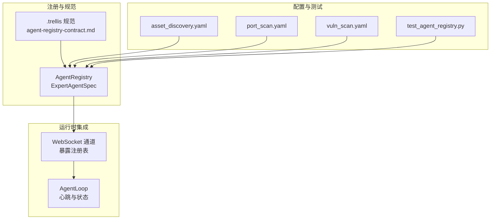
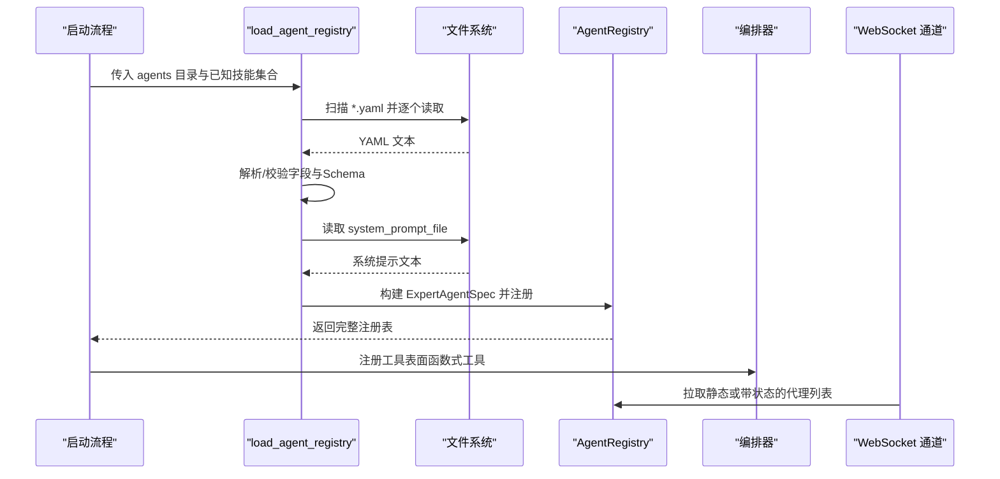
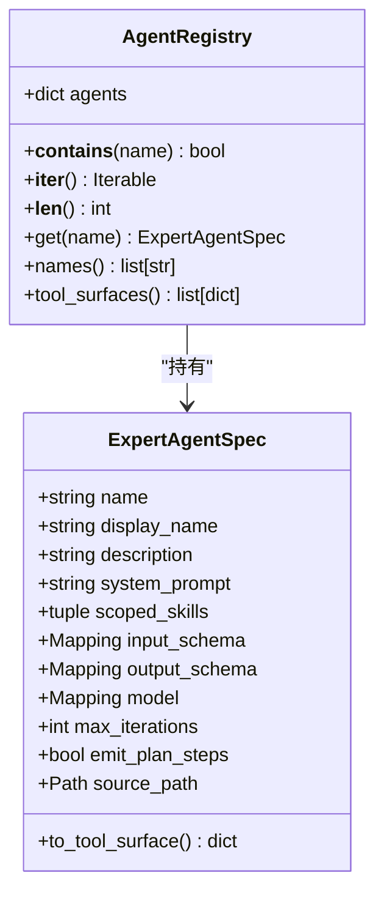
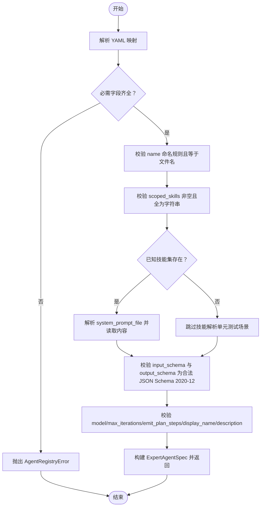
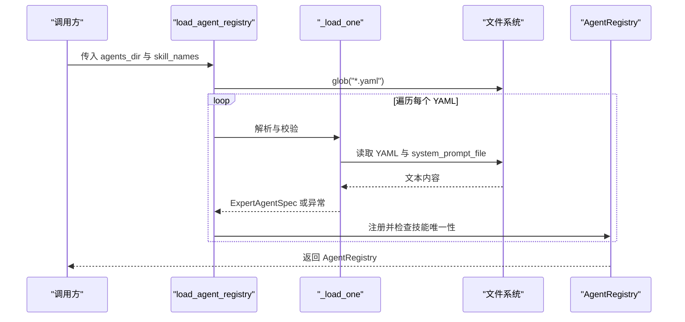
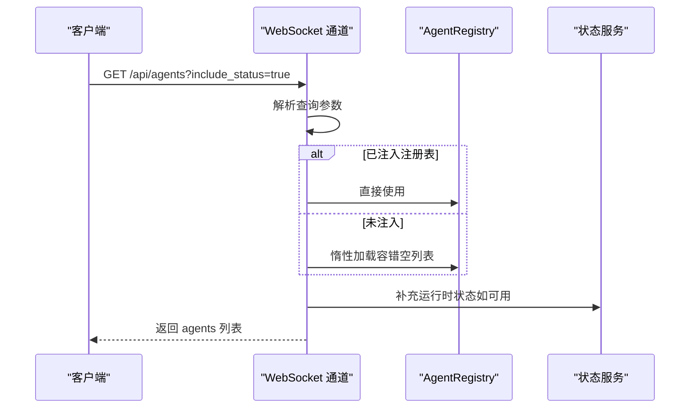
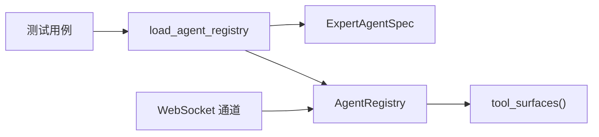

# 智能体注册管理

<cite>
**本文档引用的文件**
- [secbot/agents/registry.py](file://secbot/agents/registry.py)
- [secbot/agents/__init__.py](file://secbot/agents/__init__.py)
- [.trellis/spec/backend/agent-registry-contract.md](file://.trellis/spec/backend/agent-registry-contract.md)
- [secbot/agents/asset_discovery.yaml](file://secbot/agents/asset_discovery.yaml)
- [secbot/agents/port_scan.yaml](file://secbot/agents/port_scan.yaml)
- [secbot/agents/vuln_scan.yaml](file://secbot/agents/vuln_scan.yaml)
- [tests/agent/test_agent_registry.py](file://tests/agent/test_agent_registry.py)
- [secbot/channels/websocket.py](file://secbot/channels/websocket.py)
- [.trellis/spec/backend/dashboard-aggregation.md](file://.trellis/spec/backend/dashboard-aggregation.md)
- [secbot/agent/loop.py](file://secbot/agent/loop.py)
</cite>

## 目录
1. [简介](#简介)
2. [项目结构](#项目结构)
3. [核心组件](#核心组件)
4. [架构总览](#架构总览)
5. [详细组件分析](#详细组件分析)
6. [依赖关系分析](#依赖关系分析)
7. [性能考量](#性能考量)
8. [故障排查指南](#故障排查指南)
9. [结论](#结论)
10. [附录](#附录)

## 简介
本文件面向VAPT3平台的“智能体注册管理系统”，聚焦于专家智能体的注册、配置校验与生命周期管理。文档围绕以下目标展开：
- 解释AgentRegistry类的实现原理与职责边界
- 阐述ExpertAgentSpec的数据结构与字段语义
- 说明专家智能体的静态加载流程与热更新现状
- 提供最佳实践：配置文件格式、元数据规范、错误处理策略
- 给出可操作的排障建议与性能优化方向

## 项目结构
专家智能体注册能力由以下模块协同实现：
- 注册表与模型：secbot/agents/registry.py
- 包导出入口：secbot/agents/__init__.py
- 合约与规范：.trellis/spec/backend/agent-registry-contract.md
- 示例配置：secbot/agents/*.yaml
- 测试用例：tests/agent/test_agent_registry.py
- WebUI暴露：secbot/channels/websocket.py
- 运行时热更新参考：.trellis/tasks/archive/.../provider-hot-reload.md
- 运行时循环与心跳：secbot/agent/loop.py

**图表来源**
- [secbot/agents/registry.py:1-248](file://secbot/agents/registry.py#L1-L248)
- [.trellis/spec/backend/agent-registry-contract.md:1-140](file://.trellis/spec/backend/agent-registry-contract.md#L1-L140)
- [secbot/agents/asset_discovery.yaml:1-46](file://secbot/agents/asset_discovery.yaml#L1-L46)
- [secbot/agents/port_scan.yaml:1-50](file://secbot/agents/port_scan.yaml#L1-L50)
- [secbot/agents/vuln_scan.yaml:1-53](file://secbot/agents/vuln_scan.yaml#L1-L53)
- [tests/agent/test_agent_registry.py:1-173](file://tests/agent/test_agent_registry.py#L1-L173)
- [secbot/channels/websocket.py:1341-1394](file://secbot/channels/websocket.py#L1341-L1394)
- [secbot/agent/loop.py:1-200](file://secbot/agent/loop.py#L1-L200)

**章节来源**
- [secbot/agents/registry.py:1-248](file://secbot/agents/registry.py#L1-L248)
- [.trellis/spec/backend/agent-registry-contract.md:1-140](file://.trellis/spec/backend/agent-registry-contract.md#L1-L140)

## 核心组件
- AgentRegistry：内存中按名称索引的专家智能体注册表，提供查询、遍历、工具表面生成等能力。
- ExpertAgentSpec：对单个专家智能体YAML配置的规范化表示，包含名称、显示名、描述、系统提示、作用域技能、输入输出Schema、模型参数、最大迭代次数、是否渲染步骤等字段。
- 加载器：load_agent_registry负责扫描目录、解析YAML、执行字段与Schema校验、解析系统提示文件、构建注册表并返回。

关键职责与约束：
- 字段规则与Schema校验：严格遵循合约规范，缺失字段、非法命名、未知技能、无效JSON Schema均导致启动失败。
- 技能唯一性：同一技能不能被多个专家智能体共享，避免路由歧义。
- 工具表面：向编排器暴露统一的函数式工具接口，隐藏具体技能细节。

**章节来源**
- [secbot/agents/registry.py:37-92](file://secbot/agents/registry.py#L37-L92)
- [secbot/agents/registry.py:99-144](file://secbot/agents/registry.py#L99-L144)
- [.trellis/spec/backend/agent-registry-contract.md:76-119](file://.trellis/spec/backend/agent-registry-contract.md#L76-L119)

## 架构总览
专家智能体注册在系统中的位置与交互如下：

**图表来源**
- [secbot/agents/registry.py:99-144](file://secbot/agents/registry.py#L99-L144)
- [.trellis/spec/backend/agent-registry-contract.md:88-119](file://.trellis/spec/backend/agent-registry-contract.md#L88-L119)
- [secbot/channels/websocket.py:1341-1394](file://secbot/channels/websocket.py#L1341-L1394)

## 详细组件分析

### AgentRegistry 类
- 数据结构：以不可变字典存储 ExpertAgentSpec，键为智能体名称。
- 查询与遍历：提供 get/names/tool_surfaces 等方法，保证工具表面有序稳定。
- 错误处理：当查询不存在的智能体时抛出 AgentRegistryError，确保上层逻辑明确感知。

**图表来源**
- [secbot/agents/registry.py:65-92](file://secbot/agents/registry.py#L65-L92)
- [secbot/agents/registry.py:37-63](file://secbot/agents/registry.py#L37-L63)

**章节来源**
- [secbot/agents/registry.py:65-92](file://secbot/agents/registry.py#L65-L92)

### ExpertAgentSpec 数据结构
字段定义与语义（来自合约与实现）：
- name：智能体名称，必须与文件名（不含扩展）一致且满足命名规则
- display_name：展示名称，不能为空字符串
- description：描述文本，用于编排路由
- system_prompt：系统提示内容，来源于相对路径文件
- scoped_skills：作用域技能列表，必须非空且全部存在于已知技能集中
- input_schema/output_schema：JSON Schema 2020-12，分别用于编排器入参校验与循环后置校验
- model：可选模型覆盖映射
- max_iterations：最大迭代次数，正整数
- emit_plan_steps：是否在WebUI中渲染步骤
- source_path：源YAML路径

**图表来源**
- [secbot/agents/registry.py:147-236](file://secbot/agents/registry.py#L147-L236)
- [.trellis/spec/backend/agent-registry-contract.md:76-85](file://.trellis/spec/backend/agent-registry-contract.md#L76-L85)

**章节来源**
- [secbot/agents/registry.py:37-63](file://secbot/agents/registry.py#L37-L63)
- [secbot/agents/registry.py:147-236](file://secbot/agents/registry.py#L147-L236)
- [.trellis/spec/backend/agent-registry-contract.md:24-85](file://.trellis/spec/backend/agent-registry-contract.md#L24-L85)

### 加载与校验流程
- 目录扫描：按字母序遍历 *.yaml
- 字段与规则校验：缺失字段、非法命名、空技能列表、未知技能、文件不存在、Schema不合法
- 技能唯一性：同一技能仅允许被一个智能体声明
- 工具表面生成：将每个智能体转为编排器可见的函数式工具定义

**图表来源**
- [secbot/agents/registry.py:99-144](file://secbot/agents/registry.py#L99-L144)
- [secbot/agents/registry.py:147-236](file://secbot/agents/registry.py#L147-L236)

**章节来源**
- [secbot/agents/registry.py:99-144](file://secbot/agents/registry.py#L99-L144)
- [tests/agent/test_agent_registry.py:41-79](file://tests/agent/test_agent_registry.py#L41-L79)

### WebUI 暴露与状态
- GET /api/agents：默认返回静态注册表；带 include_status=true 时，为每个智能体补充运行状态、当前任务ID、进度与最后心跳时间
- 缓存策略：优先使用注入的注册表，否则惰性从文件系统加载；缺失/损坏目录返回空列表而非500

**图表来源**
- [secbot/channels/websocket.py:1341-1394](file://secbot/channels/websocket.py#L1341-L1394)
- [.trellis/spec/backend/dashboard-aggregation.md:135-162](file://.trellis/spec/backend/dashboard-aggregation.md#L135-L162)

**章节来源**
- [secbot/channels/websocket.py:1341-1394](file://secbot/channels/websocket.py#L1341-L1394)
- [.trellis/spec/backend/dashboard-aggregation.md:135-162](file://.trellis/spec/backend/dashboard-aggregation.md#L135-L162)

### 热更新与生命周期
- 启动期注册：注册表在系统启动时一次性加载，注册完成后不再变更
- 运行时热更新现状：专家智能体本身不支持热重载；平台其他组件（如Provider）具备运行时热刷新能力，但需通过其自身机制实现
- 建议：新增/修改专家智能体需重启服务以应用新配置

**章节来源**
- [.trellis/spec/backend/agent-registry-contract.md:101](file://.trellis/spec/backend/agent-registry-contract.md#L101)
- [secbot/agent/loop.py:1-200](file://secbot/agent/loop.py#L1-L200)

## 依赖关系分析
- AgentRegistry 与 ExpertAgentSpec：组合关系，前者持有后者实例
- 加载器依赖：YAML解析、JSON Schema校验、文件系统I/O
- WebUI依赖：注册表缓存加载与状态补全
- 测试依赖：真实示例配置与错误场景断言

**图表来源**
- [secbot/agents/registry.py:99-144](file://secbot/agents/registry.py#L99-L144)
- [secbot/agents/registry.py:37-92](file://secbot/agents/registry.py#L37-L92)
- [tests/agent/test_agent_registry.py:1-173](file://tests/agent/test_agent_registry.py#L1-173)
- [secbot/channels/websocket.py:1341-1394](file://secbot/channels/websocket.py#L1341-L1394)

**章节来源**
- [secbot/agents/registry.py:99-144](file://secbot/agents/registry.py#L99-L144)
- [tests/agent/test_agent_registry.py:1-173](file://tests/agent/test_agent_registry.py#L1-173)

## 性能考量
- 加载阶段：按字母序遍历YAML，逐个解析与校验，I/O与Schema校验为主要开销
- 工具表面生成：O(n)线性构建，排序保证提示稳定性
- WebUI：静态注册表返回为O(n)，带状态时需额外状态查询
- 建议：减少不必要的YAML数量与大型system_prompt文件大小；保持Schema简洁；在生产环境注入注册表避免重复文件系统扫描

[本节为通用性能讨论，不直接分析具体文件]

## 故障排查指南
常见错误与定位要点：
- YAML解析失败：检查YAML语法与顶层映射类型
- 必需字段缺失：确认 name/display_name/description/system_prompt_file/scoped_skills/input_schema/output_schema 均存在
- 名称不匹配：智能体名称需与文件名（不含扩展）一致且满足命名规则
- 未知技能：scoped_skills中的技能必须出现在已知技能集中
- system_prompt_file不存在：确认相对路径正确且文件存在
- JSON Schema不合法：修正 input_schema/output_schema 使其符合JSON Schema 2020-12
- 技能共享冲突：同一技能不能同时被多个智能体声明
- 最大迭代次数非法：必须为正整数

定位参考：
- 单元测试覆盖了上述典型失败场景，可作为行为基线
- WebUI端点在 include_status=false 时返回静态注册表，便于快速验证

**章节来源**
- [tests/agent/test_agent_registry.py:107-173](file://tests/agent/test_agent_registry.py#L107-L173)
- [secbot/channels/websocket.py:1341-1394](file://secbot/channels/websocket.py#L1341-L1394)

## 结论
VAPT3的专家智能体注册管理采用“启动期一次性加载”的设计，通过严格的字段与Schema校验、技能唯一性约束以及清晰的工具表面输出，确保编排器与WebUI的稳定交互。当前版本不支持专家智能体的热重载，新增/变更需重启生效。结合本文提供的最佳实践与排障建议，可高效地维护与扩展专家智能体生态。

[本节为总结性内容，不直接分析具体文件]

## 附录

### 配置文件格式与元数据规范
- 存储布局：secbot/agents/ 下每个YAML声明一个专家智能体，文件名即工具名称
- 必填字段：name、display_name、description、system_prompt_file、scoped_skills、input_schema、output_schema
- 字段规则：详见合约规范
- 工具表面：编排器看到的是函数式工具定义，隐藏具体技能细节

**章节来源**
- [.trellis/spec/backend/agent-registry-contract.md:8-21](file://.trellis/spec/backend/agent-registry-contract.md#L8-L21)
- [.trellis/spec/backend/agent-registry-contract.md:76-119](file://.trellis/spec/backend/agent-registry-contract.md#L76-L119)

### 示例配置参考
- 资产发现：包含多项CMDB与扫描技能，定义输入输出Schema
- 端口扫描：定义目标数组与可选参数，输出服务信息
- 漏洞扫描：定义服务集合与严重级别阈值，输出漏洞结果

**章节来源**
- [secbot/agents/asset_discovery.yaml:1-46](file://secbot/agents/asset_discovery.yaml#L1-L46)
- [secbot/agents/port_scan.yaml:1-50](file://secbot/agents/port_scan.yaml#L1-L50)
- [secbot/agents/vuln_scan.yaml:1-53](file://secbot/agents/vuln_scan.yaml#L1-L53)