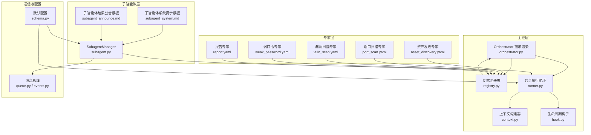
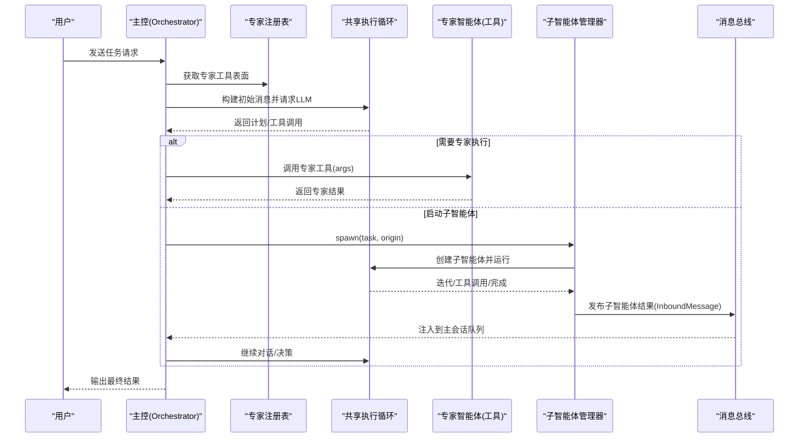
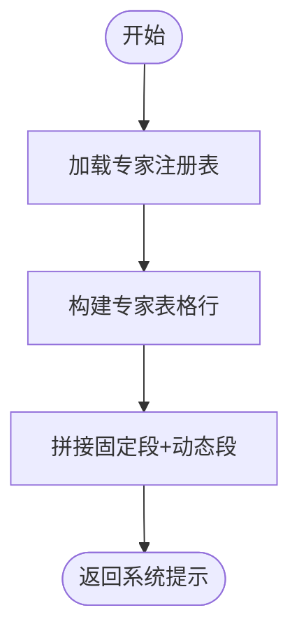
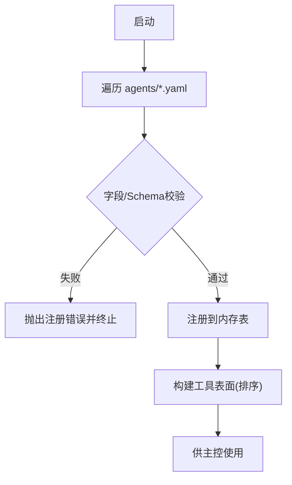
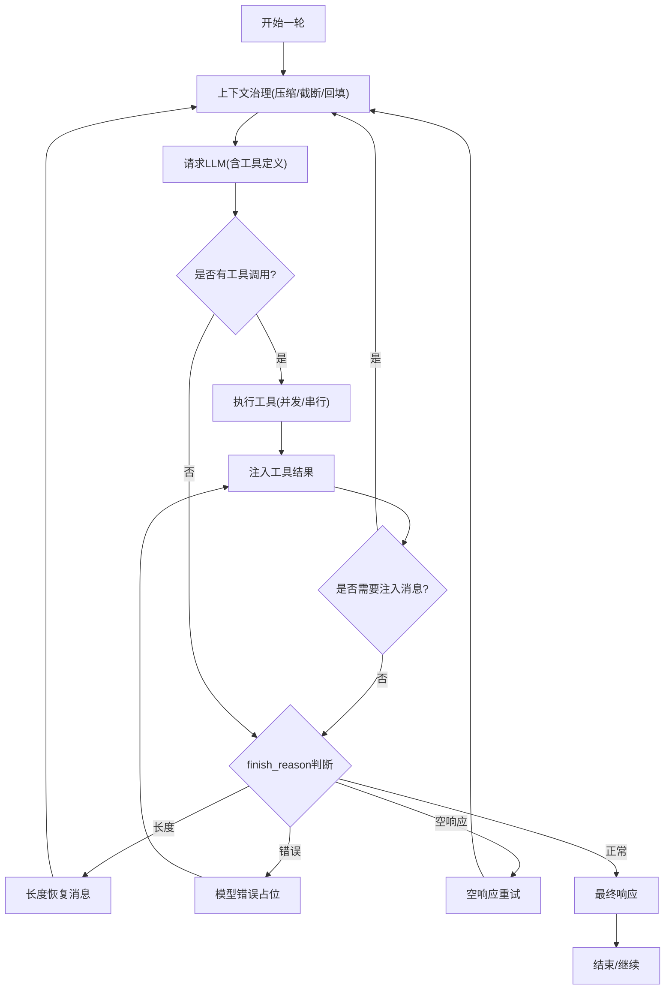
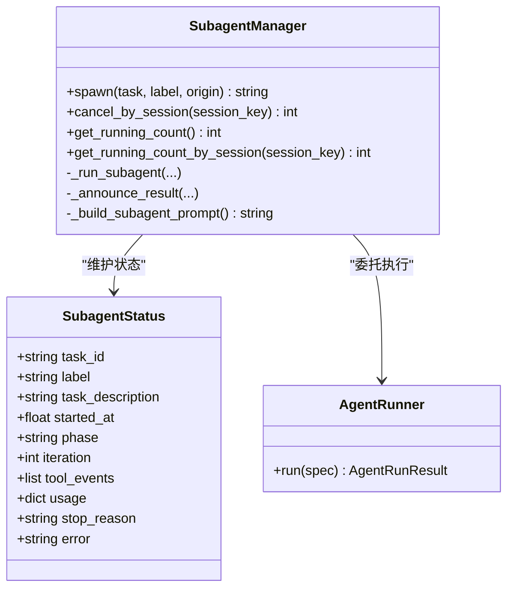
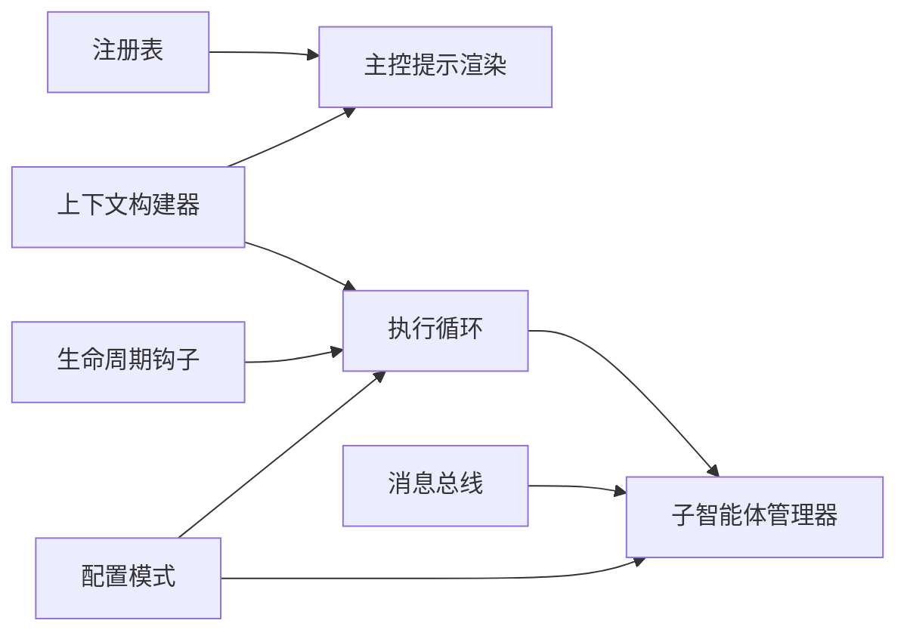

# 智能体编排系统

<cite>
**本文引用的文件**
- [orchestrator.py](file://secbot/agents/orchestrator.py)
- [registry.py](file://secbot/agents/registry.py)
- [subagent.py](file://secbot/agent/subagent.py)
- [runner.py](file://secbot/agent/runner.py)
- [context.py](file://secbot/agent/context.py)
- [hook.py](file://secbot/agent/hook.py)
- [events.py](file://secbot/bus/events.py)
- [queue.py](file://secbot/bus/queue.py)
- [subagent_system.md](file://secbot/templates/agent/subagent_system.md)
- [subagent_announce.md](file://secbot/templates/agent/subagent_announce.md)
- [schema.py](file://secbot/config/schema.py)
- [asset_discovery.yaml](file://secbot/agents/asset_discovery.yaml)
- [agent-registry-contract.md](file://.trellis/spec/backend/agent-registry-contract.md)
</cite>

## 目录
1. [简介](#简介)
2. [项目结构](#项目结构)
3. [核心组件](#核心组件)
4. [架构总览](#架构总览)
5. [详细组件分析](#详细组件分析)
6. [依赖关系分析](#依赖关系分析)
7. [性能考量](#性能考量)
8. [故障排查指南](#故障排查指南)
9. [结论](#结论)
10. [附录](#附录)

## 简介
本文件面向 VAPT3 的智能体编排系统，聚焦主控智能体（Orchestrator）的动态规划式任务调度、基于 LLM Function Calling 的 DAG 规划与执行、专家智能体池的设计与注册机制、以及 SubagentManager 的子智能体生命周期管理与通信协议。文档同时提供编排策略的配置项与最佳实践，涵盖任务分解、资源分配与错误处理。

## 项目结构
围绕“主控 + 专家 + 子智能体”的三层编排模型：
- 主控层：负责系统提示渲染、专家智能体注册表生成、LLM 函数调用解析与任务调度。
- 专家层：以工具形式暴露给主控，每个专家对应一个 YAML 描述与系统提示文件。
- 子智能体层：在后台异步执行具体任务，完成后通过消息总线回传结果，驱动主控继续决策。

图表来源
- [orchestrator.py:1-70](file://secbot/agents/orchestrator.py#L1-L70)
- [registry.py:1-248](file://secbot/agents/registry.py#L1-L248)
- [runner.py:1-800](file://secbot/agent/runner.py#L1-L800)
- [context.py:1-215](file://secbot/agent/context.py#L1-L215)
- [hook.py:1-124](file://secbot/agent/hook.py#L1-L124)
- [subagent.py:1-360](file://secbot/agent/subagent.py#L1-L360)
- [queue.py:1-45](file://secbot/bus/queue.py#L1-L45)
- [events.py:1-39](file://secbot/bus/events.py#L1-L39)
- [schema.py:1-200](file://secbot/config/schema.py#L1-L200)
- [asset_discovery.yaml:1-46](file://secbot/agents/asset_discovery.yaml#L1-L46)

章节来源
- [orchestrator.py:1-70](file://secbot/agents/orchestrator.py#L1-L70)
- [registry.py:1-248](file://secbot/agents/registry.py#L1-L248)
- [runner.py:1-800](file://secbot/agent/runner.py#L1-L800)
- [context.py:1-215](file://secbot/agent/context.py#L1-L215)
- [hook.py:1-124](file://secbot/agent/hook.py#L1-L124)
- [subagent.py:1-360](file://secbot/agent/subagent.py#L1-L360)
- [queue.py:1-45](file://secbot/bus/queue.py#L1-L45)
- [events.py:1-39](file://secbot/bus/events.py#L1-L39)
- [schema.py:1-200](file://secbot/config/schema.py#L1-L200)
- [asset_discovery.yaml:1-46](file://secbot/agents/asset_discovery.yaml#L1-L46)

## 核心组件
- 主控智能体提示渲染器：固定角色、硬规则、工作风格与动态专家表格，确保 LLM 在每次对话中获得稳定且可扩展的系统提示。
- 专家智能体注册表：从 YAML 加载与校验专家定义，生成工具表面（LLM 可见的函数签名），保证技能不重复、输入输出模式一致。
- 共享执行循环：统一处理 LLM 请求、工具调用、上下文治理、注入消息、流式回调与错误恢复，支持并发工具与最大迭代次数限制。
- 上下文构建器：聚合身份、引导文件、记忆、技能摘要与近期历史，形成系统提示与消息列表。
- 生命周期钩子：提供 before_iteration/on_stream/before_execute_tools/after_iteration 等扩展点，支持组合钩子与内容最终化。
- 子智能体管理器：异步创建与运行子智能体，隔离文件状态缓存，通过消息总线回传结果，支持按会话取消与并发上限控制。
- 消息总线：解耦聊天通道与主控，提供入站/出站队列与会话键覆盖能力。
- 配置模式：集中定义代理默认参数、工具提示长度、最大迭代次数、并发子智能体数等。

章节来源
- [orchestrator.py:52-70](file://secbot/agents/orchestrator.py#L52-L70)
- [registry.py:37-92](file://secbot/agents/registry.py#L37-L92)
- [runner.py:56-122](file://secbot/agent/runner.py#L56-L122)
- [context.py:17-97](file://secbot/agent/context.py#L17-L97)
- [hook.py:13-56](file://secbot/agent/hook.py#L13-L56)
- [subagent.py:70-153](file://secbot/agent/subagent.py#L70-L153)
- [queue.py:8-45](file://secbot/bus/queue.py#L8-L45)
- [schema.py:68-113](file://secbot/config/schema.py#L68-L113)

## 架构总览
主控通过注册表将专家智能体映射为 LLM 工具，结合上下文与工作风格提示进行计划与决策；当需要执行具体任务时，主控调用专家工具，或由子智能体管理器创建子智能体在后台执行，并通过消息总线回传结果，驱动主控继续下一步。

图表来源
- [orchestrator.py:52-70](file://secbot/agents/orchestrator.py#L52-L70)
- [registry.py:89-92](file://secbot/agents/registry.py#L89-L92)
- [runner.py:234-567](file://secbot/agent/runner.py#L234-L567)
- [subagent.py:112-153](file://secbot/agent/subagent.py#L112-L153)
- [events.py:8-25](file://secbot/bus/events.py#L8-L25)
- [queue.py:20-34](file://secbot/bus/queue.py#L20-L34)

## 详细组件分析

### 主控智能体提示渲染器
- 固定部分：角色、硬规则、工作风格，确保行为一致性与安全边界。
- 动态部分：专家表格，来源于注册表，包含工具名、用途与作用域技能集合。
- 渲染稳定性：同一注册表输出字节级稳定，便于快照与回归测试。

图表来源
- [orchestrator.py:43-70](file://secbot/agents/orchestrator.py#L43-L70)
- [registry.py:89-92](file://secbot/agents/registry.py#L89-L92)

章节来源
- [orchestrator.py:17-70](file://secbot/agents/orchestrator.py#L17-L70)
- [registry.py:89-92](file://secbot/agents/registry.py#L89-L92)

### 专家智能体注册表与触发条件匹配
- 注册流程：启动时扫描 agents 目录下的 YAML，逐个校验字段、系统提示文件存在性、JSON Schema 合法性、技能不重复等。
- 工具表面：将每个专家转换为 LLM 可见的函数工具，参数为 input_schema。
- 触发条件：主控根据用户意图与上下文选择合适的专家工具；专家内部再决定是否需要进一步工具调用或子任务。

图表来源
- [registry.py:99-144](file://secbot/agents/registry.py#L99-L144)
- [agent-registry-contract.md:76-119](file://.trellis/spec/backend/agent-registry-contract.md#L76-L119)

章节来源
- [registry.py:37-92](file://secbot/agents/registry.py#L37-L92)
- [registry.py:99-144](file://secbot/agents/registry.py#L99-L144)
- [agent-registry-contract.md:76-119](file://.trellis/spec/backend/agent-registry-contract.md#L76-L119)

### 共享执行循环与动态规划式调度
- 控制流：每轮迭代中，先治理上下文（压缩/截断/回填缺失结果），再请求 LLM；若返回工具调用，则执行工具并将结果注入消息；否则根据 finish_reason 决策是否继续或结束。
- 错误与恢复：空响应重试、长度截断恢复、模型错误占位、注入消息合并、并发工具批处理。
- 流式与进度：支持流式内容增量、进度回调与检查点通知，便于 UI 与可观测性。
- 最大迭代与超时：防止无限循环；可配置 LLM 超时避免阻塞。

图表来源
- [runner.py:234-567](file://secbot/agent/runner.py#L234-L567)

章节来源
- [runner.py:56-122](file://secbot/agent/runner.py#L56-L122)
- [runner.py:234-567](file://secbot/agent/runner.py#L234-L567)

### 上下文构建与工作风格
- 身份与引导：工作区路径、运行平台、渠道策略等作为不可信元数据块注入到用户消息前，避免连续相同角色消息。
- 记忆与历史：读取最近历史与记忆片段，限制字符与条目数量，避免越界。
- 技能摘要：动态汇总可用技能，供主控与子智能体参考。

章节来源
- [context.py:32-68](file://secbot/agent/context.py#L32-L68)
- [context.py:133-165](file://secbot/agent/context.py#L133-L165)

### 子智能体管理器与生命周期
- 创建与运行：生成唯一任务 ID，构建子智能体系统提示（含时间上下文、技能摘要），注册文件/网络/命令行等受限工具集，交由共享执行循环运行。
- 状态与回传：实时记录阶段、迭代次数、工具事件、用量与错误；通过模板化公告消息注入主会话，保持会话键一致以便正确路由。
- 并发与取消：受 AgentDefaults 中并发上限约束；支持按会话批量取消。
- 文件状态隔离：子智能体使用独立 FileStates，避免与父会话缓存互相污染。

图表来源
- [subagent.py:28-106](file://secbot/agent/subagent.py#L28-L106)
- [subagent.py:112-255](file://secbot/agent/subagent.py#L112-L255)
- [runner.py:234-567](file://secbot/agent/runner.py#L234-L567)

章节来源
- [subagent.py:70-153](file://secbot/agent/subagent.py#L70-L153)
- [subagent.py:154-300](file://secbot/agent/subagent.py#L154-L300)
- [subagent.py:322-337](file://secbot/agent/subagent.py#L322-L337)

### 模板与消息格式
- 子智能体系统提示模板：注入时间上下文、工作区路径、技能摘要，强调专注与最终汇报。
- 子智能体结果公告模板：标准化子智能体完成/失败的自然语言摘要，隐藏技术细节。

章节来源
- [subagent_system.md:1-20](file://secbot/templates/agent/subagent_system.md#L1-L20)
- [subagent_announce.md:1-9](file://secbot/templates/agent/subagent_announce.md#L1-L9)

### 通信协议与协调机制
- 消息总线：InboundMessage/OutboundMessage 解耦通道与主控；支持媒体、元数据与会话键覆盖。
- 注入与回传：子智能体通过发布 InboundMessage 将结果注入主会话，确保与当前会话上下文对齐。
- 会话键：优先使用 session_key_override，否则按 channel:chat_id 组合，保障多设备/多通道的一致性。

章节来源
- [events.py:8-39](file://secbot/bus/events.py#L8-L39)
- [queue.py:8-45](file://secbot/bus/queue.py#L8-L45)
- [subagent.py:256-299](file://secbot/agent/subagent.py#L256-L299)

### 编排策略配置与最佳实践
- 默认配置要点
  - 最大工具迭代次数、并发子智能体数、工具提示长度、推理强度、时区、统一会话、禁用技能列表、消息上限与记忆压缩比等。
- 任务分解建议
  - 明确阶段顺序与跳过条件（如已有前置数据或用户显式放弃）。
  - 对高风险步骤进行“高危确认”门控，避免越权操作。
- 资源分配
  - 通过并发上限与最大迭代限制控制资源占用；必要时启用工具并发批处理。
- 错误处理
  - 使用注入回调合并/追加用户消息；对空响应与长度截断进行恢复；对模型错误使用占位符并尝试最终化重试。
- 安全与隔离
  - 子智能体工作目录与环境变量白名单；网络/搜索/执行工具按需启用；文件状态隔离避免缓存污染。

章节来源
- [schema.py:68-113](file://secbot/config/schema.py#L68-L113)
- [runner.py:145-232](file://secbot/agent/runner.py#L145-L232)
- [runner.py:420-493](file://secbot/agent/runner.py#L420-L493)
- [subagent.py:171-210](file://secbot/agent/subagent.py#L171-L210)

## 依赖关系分析
- 主控依赖注册表生成工具表面，再交给共享执行循环；执行循环依赖钩子与上下文构建器。
- 子智能体管理器依赖共享执行循环与消息总线；其系统提示依赖上下文构建器与技能加载器。
- 配置模式贯穿于子智能体与执行循环，影响并发、迭代、超时与工具集。

图表来源
- [registry.py:89-92](file://secbot/agents/registry.py#L89-L92)
- [context.py:17-97](file://secbot/agent/context.py#L17-L97)
- [runner.py:234-567](file://secbot/agent/runner.py#L234-L567)
- [subagent.py:112-153](file://secbot/agent/subagent.py#L112-L153)
- [queue.py:20-34](file://secbot/bus/queue.py#L20-L34)
- [schema.py:68-113](file://secbot/config/schema.py#L68-L113)

章节来源
- [registry.py:89-92](file://secbot/agents/registry.py#L89-L92)
- [runner.py:234-567](file://secbot/agent/runner.py#L234-L567)
- [subagent.py:112-153](file://secbot/agent/subagent.py#L112-L153)
- [schema.py:68-113](file://secbot/config/schema.py#L68-L113)

## 性能考量
- 上下文治理：通过微压缩、预算裁剪与历史截断降低 token 使用，避免越界。
- 工具并发：在允许场景下并行执行工具，缩短端到端时延。
- 超时与重试：为 LLM 请求设置合理超时，采用渐进式重试与持久重试模式平衡可靠性。
- 并发控制：限制子智能体并发数与最大迭代次数，防止资源耗尽。
- 日志与可观测：利用钩子与检查点回调输出阶段性状态，辅助定位瓶颈。

## 故障排查指南
- 注册失败：检查 YAML 字段、系统提示文件是否存在、JSON Schema 是否合法、技能是否重复或未知。
- 执行循环卡住：查看最大迭代次数与注入消息是否过多；确认工具错误是否被 fail_on_tool_error 导致提前终止。
- 子智能体未回传：确认消息总线发布成功、会话键覆盖是否正确、主控是否处于注入窗口内。
- 结果为空或截断：启用空响应重试与长度恢复；适当提高上下文窗口与消息上限。
- 超时问题：调整 LLM 超时阈值或切换提供方；检查网络与网关状态。

章节来源
- [registry.py:147-248](file://secbot/agents/registry.py#L147-L248)
- [runner.py:591-666](file://secbot/agent/runner.py#L591-L666)
- [subagent.py:256-299](file://secbot/agent/subagent.py#L256-L299)

## 结论
该编排系统以“主控 + 专家 + 子智能体”三层结构实现灵活而可控的任务执行：主控通过稳定的系统提示与动态专家工具面进行计划与调度；共享执行循环提供健壮的上下文治理与错误恢复；子智能体管理器在后台隔离执行并以消息总线实现无缝回传。配合完善的配置与最佳实践，可在安全边界内高效完成复杂安全任务的分解与执行。

## 附录
- 示例专家定义：资产发现专家展示了典型的输入/输出模式与作用域技能集合，可作为新增专家的参考模板。
  
章节来源
- [asset_discovery.yaml:1-46](file://secbot/agents/asset_discovery.yaml#L1-L46)