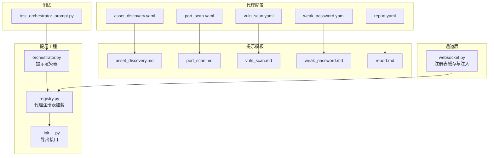
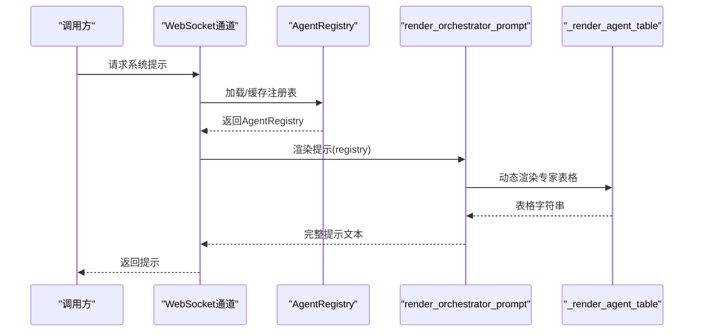
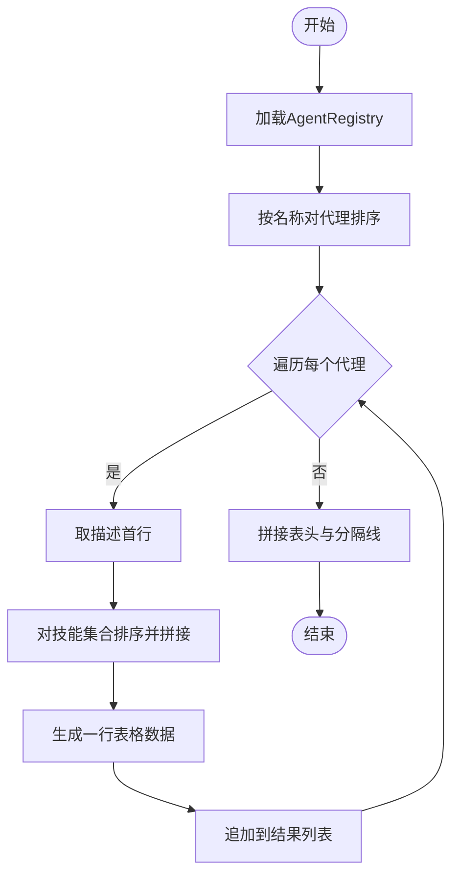
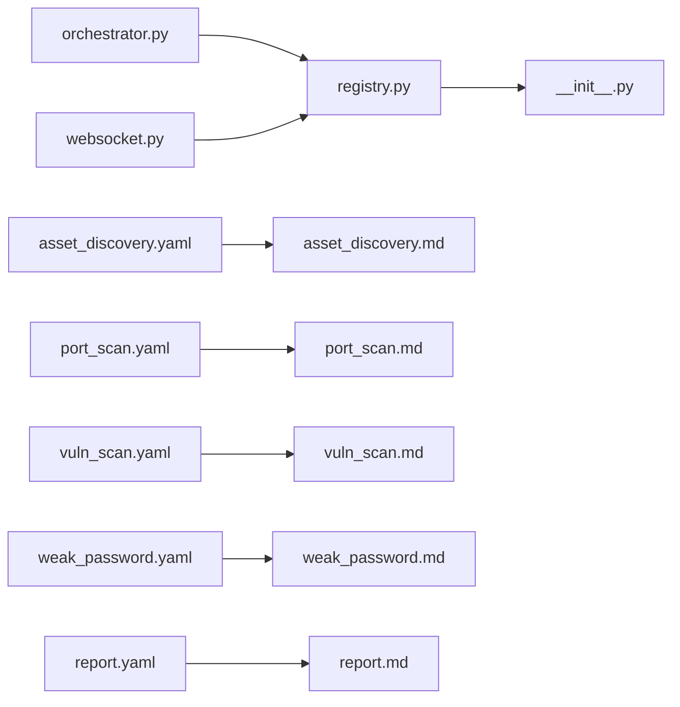

# 编排器提示工程

<cite>
**本文引用的文件**
- [secbot/agents/orchestrator.py](file://secbot/agents/orchestrator.py)
- [tests/agent/test_orchestrator_prompt.py](file://tests/agent/test_orchestrator_prompt.py)
- [secbot/agents/registry.py](file://secbot/agents/registry.py)
- [secbot/agents/__init__.py](file://secbot/agents/__init__.py)
- [secbot/agents/asset_discovery.yaml](file://secbot/agents/asset_discovery.yaml)
- [secbot/agents/port_scan.yaml](file://secbot/agents/port_scan.yaml)
- [secbot/agents/vuln_scan.yaml](file://secbot/agents/vuln_scan.yaml)
- [secbot/agents/weak_password.yaml](file://secbot/agents/weak_password.yaml)
- [secbot/agents/report.yaml](file://secbot/agents/report.yaml)
- [secbot/agents/prompts/asset_discovery.md](file://secbot/agents/prompts/asset_discovery.md)
- [secbot/agents/prompts/port_scan.md](file://secbot/agents/prompts/port_scan.md)
- [secbot/agents/prompts/vuln_scan.md](file://secbot/agents/prompts/vuln_scan.md)
- [secbot/agents/prompts/weak_password.md](file://secbot/agents/prompts/weak_password.md)
- [secbot/agents/prompts/report.md](file://secbot/agents/prompts/report.md)
- [secbot/channels/websocket.py](file://secbot/channels/websocket.py)
</cite>

## 目录
1. [简介](#简介)
2. [项目结构](#项目结构)
3. [核心组件](#核心组件)
4. [架构总览](#架构总览)
5. [详细组件分析](#详细组件分析)
6. [依赖分析](#依赖分析)
7. [性能考虑](#性能考虑)
8. [故障排查指南](#故障排查指南)
9. [结论](#结论)
10. [附录](#附录)

## 简介
本文件面向VAPT3的“编排器提示工程”，系统性阐述orchestrator-prompt.md规范的实现原理与工程化实践。重点覆盖以下方面：
- 四个锁定部分：Role角色定义、Hard rules硬规则、Available expert agents专家智能体列表、Working style工作风格
- 系统提示的动态生成机制：尤其是专家智能体表格的动态渲染流程
- 提示模板的稳定性保证（snapshot-stable）与版本控制策略
- 自定义提示模板的方法与最佳实践：如何修改规则、添加新的工作风格等

## 项目结构
围绕编排器提示工程的关键目录与文件如下：
- 提示渲染核心：secbot/agents/orchestrator.py
- 代理注册表与加载：secbot/agents/registry.py、secbot/agents/__init__.py
- 代理配置与提示模板：secbot/agents/*.yaml 及 secbot/agents/prompts/*.md
- 测试用例：tests/agent/test_orchestrator_prompt.py
- 通道层注入注册表：secbot/channels/websocket.py

图表来源
- [secbot/agents/orchestrator.py:1-70](file://secbot/agents/orchestrator.py#L1-L70)
- [secbot/agents/registry.py:99-170](file://secbot/agents/registry.py#L99-L170)
- [secbot/agents/__init__.py:1-21](file://secbot/agents/__init__.py#L1-L21)
- [secbot/agents/asset_discovery.yaml:1-46](file://secbot/agents/asset_discovery.yaml#L1-L46)
- [secbot/agents/port_scan.yaml:1-50](file://secbot/agents/port_scan.yaml#L1-L50)
- [secbot/agents/vuln_scan.yaml:1-53](file://secbot/agents/vuln_scan.yaml#L1-L53)
- [secbot/agents/weak_password.yaml:1-53](file://secbot/agents/weak_password.yaml#L1-L53)
- [secbot/agents/report.yaml:1-39](file://secbot/agents/report.yaml#L1-L39)
- [secbot/agents/prompts/asset_discovery.md:1-28](file://secbot/agents/prompts/asset_discovery.md#L1-L28)
- [secbot/agents/prompts/port_scan.md:1-24](file://secbot/agents/prompts/port_scan.md#L1-L24)
- [secbot/agents/prompts/vuln_scan.md:1-24](file://secbot/agents/prompts/vuln_scan.md#L1-L24)
- [secbot/agents/prompts/weak_password.md:1-28](file://secbot/agents/prompts/weak_password.md#L1-L28)
- [secbot/agents/prompts/report.md:1-19](file://secbot/agents/prompts/report.md#L1-L19)
- [tests/agent/test_orchestrator_prompt.py:1-83](file://tests/agent/test_orchestrator_prompt.py#L1-L83)
- [secbot/channels/websocket.py:1382-1394](file://secbot/channels/websocket.py#L1382-L1394)

章节来源
- [secbot/agents/orchestrator.py:1-70](file://secbot/agents/orchestrator.py#L1-L70)
- [secbot/agents/registry.py:99-170](file://secbot/agents/registry.py#L99-L170)
- [secbot/agents/__init__.py:1-21](file://secbot/agents/__init__.py#L1-L21)
- [tests/agent/test_orchestrator_prompt.py:1-83](file://tests/agent/test_orchestrator_prompt.py#L1-L83)
- [secbot/channels/websocket.py:1382-1394](file://secbot/channels/websocket.py#L1382-L1394)

## 核心组件
- 提示渲染器：负责将四个锁定部分拼接为最终系统提示，并确保输出在相同注册表下字节级稳定
- 代理注册表：从文件系统加载所有代理配置，校验字段与技能唯一性，提供稳定的工具表面
- 代理配置与提示模板：每个代理通过YAML声明元信息与技能集合，对应独立的提示模板文件
- 测试用例：验证提示包含四个标题段、动态专家表格、确定性输出、以及排序稳定性

章节来源
- [secbot/agents/orchestrator.py:52-69](file://secbot/agents/orchestrator.py#L52-L69)
- [secbot/agents/registry.py:99-170](file://secbot/agents/registry.py#L99-L170)
- [tests/agent/test_orchestrator_prompt.py:13-52](file://tests/agent/test_orchestrator_prompt.py#L13-L52)

## 架构总览
编排器提示工程的运行时流程如下：

图表来源
- [secbot/channels/websocket.py:1382-1394](file://secbot/channels/websocket.py#L1382-L1394)
- [secbot/agents/orchestrator.py:52-69](file://secbot/agents/orchestrator.py#L52-L69)
- [secbot/agents/orchestrator.py:43-49](file://secbot/agents/orchestrator.py#L43-L49)

## 详细组件分析

### 提示渲染器与四锁固定部分
- Role角色定义：固定常量，明确编排器的身份与职责
- Hard rules硬规则：固定常量，约束编排器行为（路由到专家、遵循阶段顺序、高风险确认、拒绝越权请求）
- Available expert agents专家智能体列表：动态生成，基于注册表中的代理信息
- Working style工作风格：固定常量，指导编排器的思考与汇报方式

章节来源
- [secbot/agents/orchestrator.py:17-40](file://secbot/agents/orchestrator.py#L17-L40)
- [secbot/agents/orchestrator.py:52-69](file://secbot/agents/orchestrator.py#L52-L69)

### 专家智能体表格的动态渲染机制
- 排序策略：按代理名称升序；技能列表按字典序升序
- 表头与分隔线：固定格式，便于解析与阅读
- 内容提取：使用代理描述首行作为“目的”摘要，技能集合拼接为“作用域技能”
- 输出稳定性：由于排序确定且仅依赖注册表，相同输入始终产生相同输出

图表来源
- [secbot/agents/orchestrator.py:43-49](file://secbot/agents/orchestrator.py#L43-L49)

章节来源
- [secbot/agents/orchestrator.py:43-49](file://secbot/agents/orchestrator.py#L43-L49)
- [tests/agent/test_orchestrator_prompt.py:54-82](file://tests/agent/test_orchestrator_prompt.py#L54-L82)

### 注册表加载与工具表面稳定性
- 文件发现：递归扫描agents目录下的所有YAML文件
- 字段校验：必需字段、名称格式、与文件名一致性
- 技能唯一性：同一技能不得被多个代理共享
- 工具表面：生成函数式工具表面，名称按字典序排序，确保提示装配稳定

章节来源
- [secbot/agents/registry.py:99-170](file://secbot/agents/registry.py#L99-L170)
- [tests/agent/test_agent_registry.py:41-69](file://tests/agent/test_agent_registry.py#L41-L69)

### 代理配置与提示模板
- 资产探测、端口扫描、漏洞扫描、弱口令检测、报告生成等代理均通过YAML声明：
  - 基本信息：name、display_name、description
  - 技能范围：scoped_skills
  - 输入/输出模式：input_schema、output_schema
  - 运行参数：max_iterations、emit_plan_steps
  - 系统提示文件：system_prompt_file
- 各代理的提示模板分别位于prompts目录，定义其职责、工具与流程

章节来源
- [secbot/agents/asset_discovery.yaml:1-46](file://secbot/agents/asset_discovery.yaml#L1-L46)
- [secbot/agents/port_scan.yaml:1-50](file://secbot/agents/port_scan.yaml#L1-L50)
- [secbot/agents/vuln_scan.yaml:1-53](file://secbot/agents/vuln_scan.yaml#L1-L53)
- [secbot/agents/weak_password.yaml:1-53](file://secbot/agents/weak_password.yaml#L1-L53)
- [secbot/agents/report.yaml:1-39](file://secbot/agents/report.yaml#L1-L39)
- [secbot/agents/prompts/asset_discovery.md:1-28](file://secbot/agents/prompts/asset_discovery.md#L1-L28)
- [secbot/agents/prompts/port_scan.md:1-24](file://secbot/agents/prompts/port_scan.md#L1-L24)
- [secbot/agents/prompts/vuln_scan.md:1-24](file://secbot/agents/prompts/vuln_scan.md#L1-L24)
- [secbot/agents/prompts/weak_password.md:1-28](file://secbot/agents/prompts/weak_password.md#L1-L28)
- [secbot/agents/prompts/report.md:1-19](file://secbot/agents/prompts/report.md#L1-L19)

### 测试验证要点
- 提示必须包含四个标题段，且Role片段需完全一致
- 专家代理名称与技能均应出现在提示中
- 硬规则提及高风险确认与阶段顺序
- 表格按代理名称字典序稳定输出
- 多次渲染结果一致

章节来源
- [tests/agent/test_orchestrator_prompt.py:13-52](file://tests/agent/test_orchestrator_prompt.py#L13-L52)
- [tests/agent/test_orchestrator_prompt.py:54-82](file://tests/agent/test_orchestrator_prompt.py#L54-L82)

## 依赖分析
- 提示渲染器依赖注册表，注册表负责加载与校验代理配置
- 通道层在初始化时注入或懒加载注册表，确保生产环境与测试环境的一致性
- 代理配置与提示模板解耦，便于独立演进与维护

图表来源
- [secbot/agents/orchestrator.py:14-14](file://secbot/agents/orchestrator.py#L14-L14)
- [secbot/agents/registry.py:99-170](file://secbot/agents/registry.py#L99-L170)
- [secbot/agents/__init__.py:9-21](file://secbot/agents/__init__.py#L9-L21)
- [secbot/channels/websocket.py:1382-1394](file://secbot/channels/websocket.py#L1382-L1394)

章节来源
- [secbot/agents/orchestrator.py:14-14](file://secbot/agents/orchestrator.py#L14-L14)
- [secbot/agents/registry.py:99-170](file://secbot/agents/registry.py#L99-L170)
- [secbot/agents/__init__.py:9-21](file://secbot/agents/__init__.py#L9-L21)
- [secbot/channels/websocket.py:1382-1394](file://secbot/channels/websocket.py#L1382-L1394)

## 性能考虑
- 提示渲染为纯内存操作，复杂度主要受代理数量影响，近似O(N log N)用于排序
- 注册表加载在首次访问时进行，后续通过通道层缓存复用，避免重复I/O
- 表格渲染采用简单拼接，开销极低

## 故障排查指南
- 提示不包含四个标题段：检查渲染器是否正确拼接各部分
- 专家代理未出现：确认注册表已加载且代理名称与文件名一致
- 表格顺序异常：检查代理名称大小写与排序键
- 硬规则缺失：核对常量定义与拼接逻辑
- 高风险确认与阶段顺序未体现：核对测试断言与规则文本

章节来源
- [tests/agent/test_orchestrator_prompt.py:13-52](file://tests/agent/test_orchestrator_prompt.py#L13-L52)
- [secbot/agents/orchestrator.py:52-69](file://secbot/agents/orchestrator.py#L52-L69)

## 结论
VAPT3的编排器提示工程通过“四锁固定部分 + 动态专家表格”的设计，在保证系统提示稳定性的同时，实现了对专家智能体集合的灵活扩展。注册表加载与工具表面的稳定性保障了提示装配的可预测性；测试用例覆盖关键行为，确保功能正确性。

## 附录

### 提示模板稳定性与版本控制策略
- snapshot-stable语义：给定相同的注册表，输出字节级一致，便于回归与审计
- 版本控制建议：
  - 将提示模板纳入仓库版本管理，随代理配置一起发布
  - 对硬规则与工作风格的变更采用小步快跑与明确注释，保持向后兼容
  - 在CI中加入提示渲染的确定性测试，防止意外破坏

章节来源
- [secbot/agents/orchestrator.py:52-56](file://secbot/agents/orchestrator.py#L52-L56)
- [tests/agent/test_orchestrator_prompt.py:39-44](file://tests/agent/test_orchestrator_prompt.py#L39-L44)

### 自定义提示模板与最佳实践
- 修改硬规则与工作风格：
  - 在渲染器中调整常量数组，确保与测试断言一致
  - 通过测试用例覆盖新增规则的行为
- 添加新的专家智能体：
  - 新建YAML文件，确保name与文件名一致，scoped_skills不与其他代理重复
  - 在prompts目录提供对应的提示模板
  - 更新注册表加载逻辑（如需），并在测试中验证表格渲染
- 维护工具表面稳定性：
  - 保持代理名称与技能集合的唯一性
  - 工具表面按名称排序，避免提示装配顺序波动

章节来源
- [secbot/agents/registry.py:125-144](file://secbot/agents/registry.py#L125-L144)
- [tests/agent/test_agent_registry.py:52-69](file://tests/agent/test_agent_registry.py#L52-L69)
- [secbot/agents/orchestrator.py:43-49](file://secbot/agents/orchestrator.py#L43-L49)