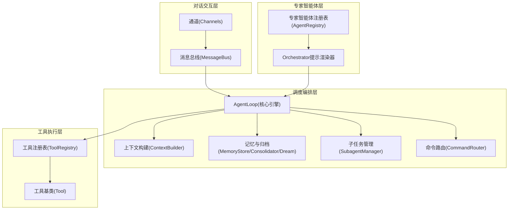
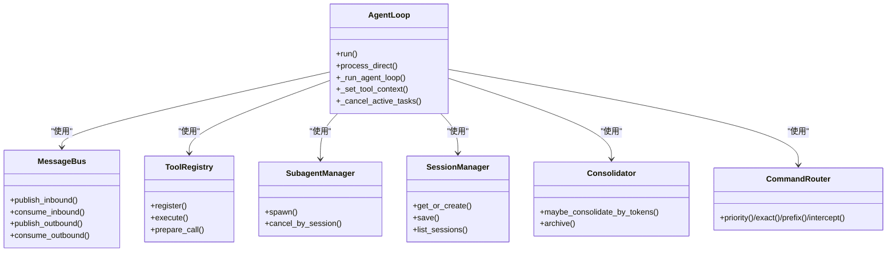
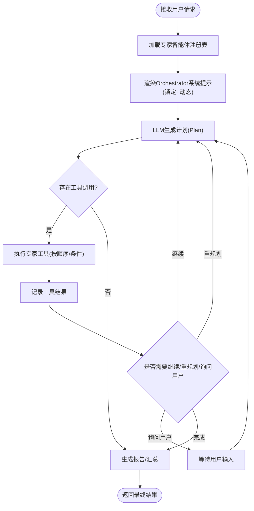
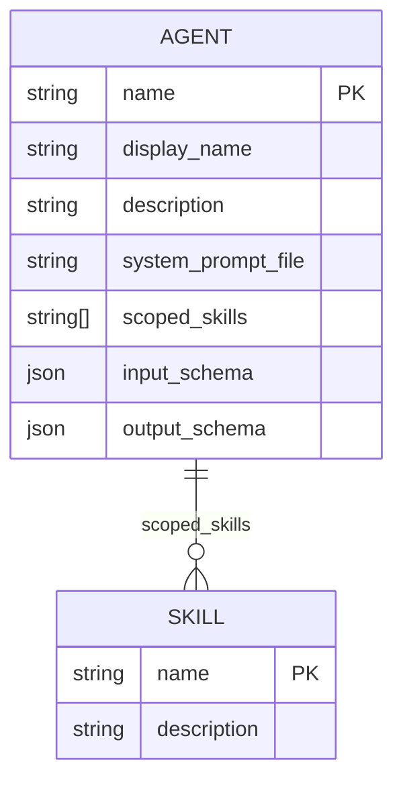
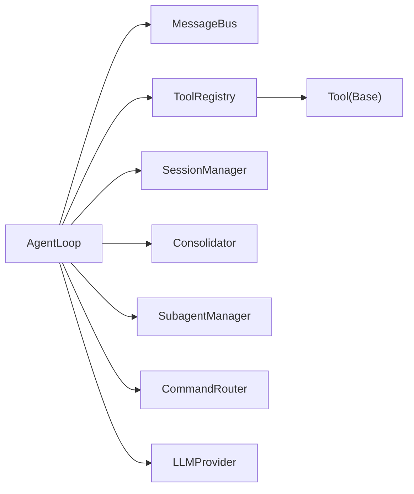

# 核心架构设计

<cite>
**本文引用的文件**
- [secbot.py](file://secbot/secbot.py)
- [loop.py](file://secbot/agent/loop.py)
- [orchestrator.py](file://secbot/agents/orchestrator.py)
- [events.py](file://secbot/bus/events.py)
- [queue.py](file://secbot/bus/queue.py)
- [registry.py](file://secbot/agents/registry.py)
- [manager.py](file://secbot/session/manager.py)
- [router.py](file://secbot/command/router.py)
- [base.py](file://secbot/agent/tools/base.py)
- [registry.py](file://secbot/agent/tools/registry.py)
- [subagent.py](file://secbot/agent/subagent.py)
- [context.py](file://secbot/agent/context.py)
- [memory.py](file://secbot/agent/memory.py)
- [asset_discovery.yaml](file://secbot/agents/asset_discovery.yaml)
</cite>

## 目录
1. [引言](#引言)
2. [项目结构](#项目结构)
3. [核心组件](#核心组件)
4. [架构总览](#架构总览)
5. [详细组件分析](#详细组件分析)
6. [依赖分析](#依赖分析)
7. [性能考量](#性能考量)
8. [故障排查指南](#故障排查指南)
9. [结论](#结论)
10. [附录](#附录)

## 引言
本设计文档面向VAPT3/secbot的四层架构与AgentLoop核心引擎，系统化阐述对话交互层、调度编排层、专家智能体层、工具执行层的职责边界与协作方式；详解AgentLoop生命周期管理、工具调用机制、会话管理；解析主控智能体(Orchestrator)的动态规划思路（基于LLM Function Calling实现DAG规划与任务调度）；说明专家智能体池的设计理念（注册、触发条件匹配、上下文接力）；分析消息总线与事件驱动架构；给出架构图与组件关系图，并总结扩展性与性能优化策略。

## 项目结构
secbot采用分层模块化组织：
- 对话交互层：通道与消息总线，负责入站/出站消息的解耦与路由
- 调度编排层：AgentLoop为核心引擎，协调上下文构建、LLM推理、工具执行、子任务管理
- 专家智能体层：专家智能体注册表与提示词渲染，支撑Orchestrator进行动态规划
- 工具执行层：工具注册表与具体工具实现，支持文件系统、网络、命令执行、MCP等



**图表来源**
- [queue.py:8-45](file://secbot/bus/queue.py#L8-L45)
- [loop.py:276-425](file://secbot/agent/loop.py#L276-L425)
- [context.py:17-215](file://secbot/agent/context.py#L17-L215)
- [memory.py:39-1009](file://secbot/agent/memory.py#L39-L1009)
- [subagent.py:70-360](file://secbot/agent/subagent.py#L70-L360)
- [router.py:27-99](file://secbot/command/router.py#L27-L99)
- [registry.py:66-248](file://secbot/agents/registry.py#L66-L248)
- [orchestrator.py:52-70](file://secbot/agents/orchestrator.py#L52-L70)
- [registry.py:8-126](file://secbot/agent/tools/registry.py#L8-L126)
- [base.py:117-280](file://secbot/agent/tools/base.py#L117-L280)

**章节来源**
- [queue.py:8-45](file://secbot/bus/queue.py#L8-L45)
- [loop.py:276-425](file://secbot/agent/loop.py#L276-L425)

## 核心组件
- Secbot门面：提供从配置创建AgentLoop与运行入口
- AgentLoop：核心引擎，负责消息消费、上下文构建、LLM调用、工具执行、会话管理、并发控制、进度回调、活动事件广播
- AgentRegistry：专家智能体注册表，加载与校验YAML，生成工具表面定义
- ToolRegistry：工具注册表，统一管理工具定义、参数校验与执行
- MessageBus：异步消息总线，解耦通道与核心引擎
- SubagentManager：后台子任务管理器，支持并发、状态跟踪、结果注入
- CommandRouter：斜杠命令路由，优先级/精确/前缀/拦截器四层
- MemoryStore/Consolidator/Dream：记忆存储、按令牌预算归档、周期性深度整理

**章节来源**
- [secbot.py:23-132](file://secbot/secbot.py#L23-L132)
- [loop.py:276-800](file://secbot/agent/loop.py#L276-L800)
- [registry.py:66-248](file://secbot/agents/registry.py#L66-L248)
- [registry.py:8-126](file://secbot/agent/tools/registry.py#L8-L126)
- [queue.py:8-45](file://secbot/bus/queue.py#L8-L45)
- [subagent.py:70-360](file://secbot/agent/subagent.py#L70-L360)
- [router.py:27-99](file://secbot/command/router.py#L27-L99)
- [memory.py:39-1009](file://secbot/agent/memory.py#L39-L1009)

## 架构总览
四层架构与AgentLoop核心引擎的关键交互如下：

```mermaid
sequenceDiagram
participant CH as "通道"
participant BUS as "消息总线"
participant LOOP as "AgentLoop"
participant CTX as "上下文构建"
participant RUN as "AgentRunner"
participant TREG as "工具注册表"
participant SUB as "子任务管理"
participant MEM as "记忆/归档"
CH->>BUS : 入站消息(InboundMessage)
BUS->>LOOP : 消费入站消息
LOOP->>CTX : 构建系统提示+历史+技能
LOOP->>RUN : LLM推理(含工具定义)
RUN-->>LOOP : 响应(内容/工具调用)
LOOP->>TREG : 解析工具调用
TREG-->>LOOP : 执行工具(并发/串行)
LOOP->>MEM : 写入/归档/摘要
LOOP->>SUB : 后台子任务(可选)
LOOP-->>BUS : 出站消息(OutboundMessage)
BUS-->>CH : 推送响应
```

**图表来源**
- [loop.py:644-787](file://secbot/agent/loop.py#L644-L787)
- [context.py:133-215](file://secbot/agent/context.py#L133-L215)
- [memory.py:442-692](file://secbot/agent/memory.py#L442-L692)
- [subagent.py:112-300](file://secbot/agent/subagent.py#L112-L300)
- [registry.py:100-126](file://secbot/agent/tools/registry.py#L100-L126)
- [queue.py:20-35](file://secbot/bus/queue.py#L20-L35)

## 详细组件分析

### AgentLoop核心引擎
- 生命周期管理
  - 初始化：注入MessageBus、LLMProvider、工作区、工具注册表、会话管理、子任务管理、记忆/归档组件
  - 运行循环：持续从MessageBus消费入站消息，按会话键路由，支持统一会话模式与线程/频道隔离
  - 并发与限流：全局并发信号量限制同时请求；每会话锁保证归档/写盘原子性；子任务按会话聚合
  - 中断与取消：支持/stop等命令优先处理，取消活跃任务与子任务
- 工具调用机制
  - Hook链：LoopHook在每次迭代前后注入进度、流式输出、工具事件广播
  - 参数校验与类型转换：Schema与Tool基类提供参数类型推断、枚举/范围/必填校验
  - 并发安全：只读且非独占工具可并发执行；独占/互斥工具串行
  - 结果注入：工具结果以“tool”角色消息回注入对话历史，保持消息边界合法
- 会话管理
  - Session/SessionManager：内存缓存+磁盘持久化(JSONL)，支持迁移、修复、硬上限裁剪
  - 历史切片：按消息数与令牌预算切片，避免中间态与孤儿tool结果
  - 统一会话：支持跨频道/线程的统一会话键，便于多路上下文接力
- 记忆与归档
  - Consolidator：按令牌预算触发归档，保留会话摘要到历史，降低输入成本
  - Dream：周期性深度整理，支持编辑文件与增量更新
- 命令与事件
  - CommandRouter：优先级/精确/前缀/拦截器四层，保障关键命令低延迟
  - 活动事件：WebSocket通道广播工具调用开始/结束，用于实时仪表盘



**图表来源**
- [loop.py:276-800](file://secbot/agent/loop.py#L276-L800)
- [queue.py:8-45](file://secbot/bus/queue.py#L8-L45)
- [registry.py:8-126](file://secbot/agent/tools/registry.py#L8-L126)
- [subagent.py:70-360](file://secbot/agent/subagent.py#L70-L360)
- [manager.py:239-659](file://secbot/session/manager.py#L239-L659)
- [memory.py:442-692](file://secbot/agent/memory.py#L442-L692)
- [router.py:27-99](file://secbot/command/router.py#L27-L99)

**章节来源**
- [loop.py:276-800](file://secbot/agent/loop.py#L276-L800)
- [manager.py:239-659](file://secbot/session/manager.py#L239-L659)
- [memory.py:442-692](file://secbot/agent/memory.py#L442-L692)
- [subagent.py:70-360](file://secbot/agent/subagent.py#L70-L360)
- [router.py:27-99](file://secbot/command/router.py#L27-L99)

### 主控智能体(Orchestrator)的动态规划
- 角色与规则
  - 固定角色与硬规则：不直接执行扫描，必须遵循资产发现→端口扫描→漏洞扫描→弱口令/渗透→报告的自然顺序
  - 高风险确认：对高危技能调用前要求显式确认
  - 作用域限制：拒绝越权或无关请求
- 动态规划思路
  - 专家智能体池：由AgentRegistry加载，每个专家具备独立系统提示、输入/输出Schema、限定技能集合
  - LLM Function Calling：将专家智能体作为函数工具暴露给Orchestrator，由LLM根据当前上下文选择下一步动作
  - DAG规划与调度：通过LLM的计划(Plan)与工具调用序列，形成阶段化的DAG；结合会话历史与工具结果，动态决定是否继续、重规划或询问用户
- 提示渲染
  - 锁定部分：Role、Hard rules、Working style
  - 动态部分：可用专家表格(名称、用途、限定技能)



**图表来源**
- [orchestrator.py:52-70](file://secbot/agents/orchestrator.py#L52-L70)
- [registry.py:66-248](file://secbot/agents/registry.py#L66-L248)
- [asset_discovery.yaml:1-46](file://secbot/agents/asset_discovery.yaml#L1-L46)

**章节来源**
- [orchestrator.py:17-70](file://secbot/agents/orchestrator.py#L17-L70)
- [registry.py:66-248](file://secbot/agents/registry.py#L66-L248)
- [asset_discovery.yaml:1-46](file://secbot/agents/asset_discovery.yaml#L1-L46)

### 专家智能体池设计
- 注册机制
  - YAML规范：name/display_name/description/system_prompt_file/scoped_skills/input_schema/output_schema等字段校验
  - 唯一性约束：技能名唯一、文件名与name一致、重复agent名禁止
  - Schema校验：JSON Schema 2020-12标准
- 触发条件匹配
  - scoped_skills限定：每个专家仅能处理其声明的技能集合
  - 输入Schema约束：LLM调用参数需满足专家输入Schema
- 上下文接力
  - 通过Session历史与记忆摘要，Orchestrator在各阶段间传递上下文
  - 子任务(Subagent)完成后，以系统消息形式注入主Agent，实现无缝接力



**图表来源**
- [registry.py:37-63](file://secbot/agents/registry.py#L37-L63)
- [asset_discovery.yaml:11-20](file://secbot/agents/asset_discovery.yaml#L11-L20)

**章节来源**
- [registry.py:99-248](file://secbot/agents/registry.py#L99-L248)
- [asset_discovery.yaml:1-46](file://secbot/agents/asset_discovery.yaml#L1-L46)

### 工具执行层与消息总线
- 工具注册与执行
  - ToolRegistry：集中注册、定义缓存、参数校验与类型转换、错误提示
  - Tool基类：统一的参数Schema、类型推断、只读/并发/独占属性
- 消息总线
  - InboundMessage/OutboundMessage：标准化消息结构，支持媒体、元数据、按钮等
  - 异步队列：解耦通道与核心引擎，支持高吞吐与弹性扩展

```mermaid
sequenceDiagram
participant BUS as "消息总线"
participant LOOP as "AgentLoop"
participant TREG as "工具注册表"
participant TOOL as "具体工具"
LOOP->>TREG : prepare_call(name, params)
TREG-->>LOOP : (tool, cast_params, error?)
LOOP->>TOOL : execute(**cast_params)
TOOL-->>LOOP : 结果/错误
LOOP-->>BUS : 发布出站消息
```

**图表来源**
- [registry.py:73-126](file://secbot/agent/tools/registry.py#L73-L126)
- [base.py:117-280](file://secbot/agent/tools/base.py#L117-L280)
- [events.py:8-39](file://secbot/bus/events.py#L8-L39)
- [queue.py:20-35](file://secbot/bus/queue.py#L20-L35)

**章节来源**
- [registry.py:8-126](file://secbot/agent/tools/registry.py#L8-L126)
- [base.py:117-280](file://secbot/agent/tools/base.py#L117-L280)
- [events.py:8-39](file://secbot/bus/events.py#L8-L39)
- [queue.py:8-45](file://secbot/bus/queue.py#L8-L45)

## 依赖分析
- 组件耦合
  - AgentLoop对MessageBus、ToolRegistry、SessionManager、Consolidator、SubagentManager、CommandRouter高度内聚
  - 工具层与LLM Provider解耦，通过Provider接口抽象
- 外部依赖
  - 异步运行时：asyncio
  - 序列化：json
  - 分词估算：tiktoken
  - 日志：loguru
- 循环依赖规避
  - WebSocket通道延迟导入，避免模块级循环



**图表来源**
- [loop.py:276-425](file://secbot/agent/loop.py#L276-L425)
- [registry.py:8-126](file://secbot/agent/tools/registry.py#L8-L126)
- [base.py:117-280](file://secbot/agent/tools/base.py#L117-L280)
- [queue.py:8-45](file://secbot/bus/queue.py#L8-L45)

**章节来源**
- [loop.py:276-425](file://secbot/agent/loop.py#L276-L425)

## 性能考量
- 令牌预算与归档
  - Consolidator按令牌预算触发归档，保留摘要，显著降低输入长度
  - 安全缓冲与最大归档轮次限制，避免过度归档
- 并发与限流
  - 全局并发信号量限制同时请求
  - 每会话锁避免归档/写盘竞争
- 流式输出与进度回调
  - 支持增量流式输出与工具事件上报，提升可观测性
- 磁盘I/O优化
  - 原子写与目录fsync，确保崩溃后一致性
  - 历史文件硬上限裁剪，防止无限增长

[本节为通用性能指导，无需特定文件引用]

## 故障排查指南
- 会话异常
  - Session文件损坏：自动修复与迁移，必要时重建
  - 历史越界：检查max_messages与令牌预算，调整context_window_tokens
- 工具执行失败
  - 参数校验错误：依据prepare_call返回的错误信息修正
  - 权限/沙箱限制：检查exec_config与workspace限制
- 记忆归档失败
  - LLM不可用：降级为raw-archive，保留线索
- 子任务卡住
  - 使用/stop取消，或按会话键取消所有子任务

**章节来源**
- [manager.py:338-451](file://secbot/session/manager.py#L338-L451)
- [registry.py:73-126](file://secbot/agent/tools/registry.py#L73-L126)
- [memory.py:554-692](file://secbot/agent/memory.py#L554-L692)
- [subagent.py:339-360](file://secbot/agent/subagent.py#L339-L360)

## 结论
VAPT3/secbot以AgentLoop为核心引擎，通过消息总线解耦通道与核心逻辑，借助专家智能体注册表与LLM Function Calling实现动态规划与DAG调度；工具层提供统一的参数校验与执行抽象；记忆与归档体系保障长上下文稳定性。整体架构在扩展性与性能之间取得平衡，适合复杂安全运营场景下的多阶段任务编排。

[本节为总结性内容，无需特定文件引用]

## 附录
- 关键配置项
  - AgentDefaults：最大迭代次数、上下文窗口、工具结果字符上限、工具提示长度、统一会话、会话TTL、合并比例等
  - Tools/Web/Exec配置：启用开关、超时、沙箱、路径追加、环境变量白名单、URL代理、用户代理等
- 命令体系
  - 优先级命令：如/stop、/restart
  - 精确命令：如/restart
  - 前缀命令：如/team
  - 拦截器：团队模式等前置条件

**章节来源**
- [loop.py:291-425](file://secbot/agent/loop.py#L291-L425)
- [router.py:27-99](file://secbot/command/router.py#L27-L99)