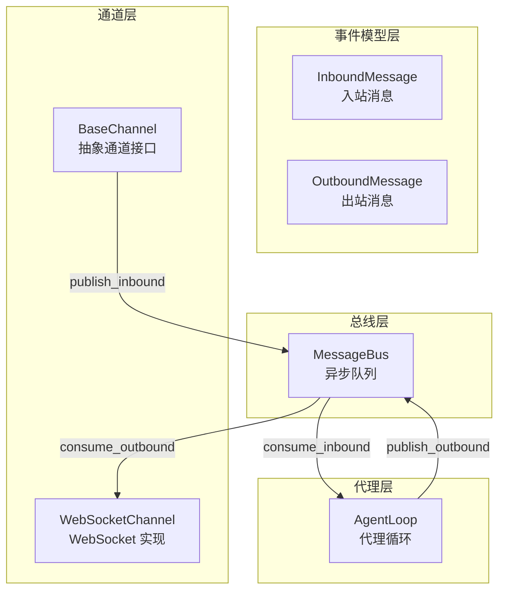
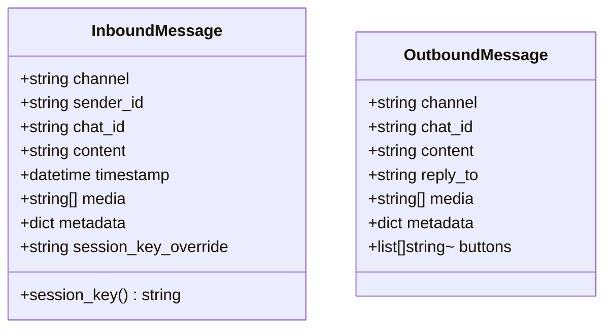
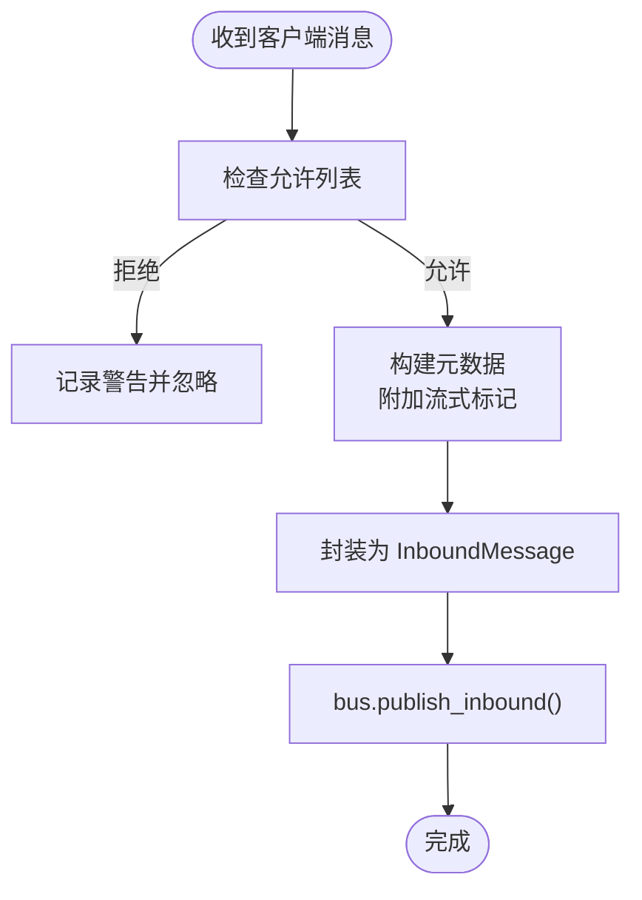
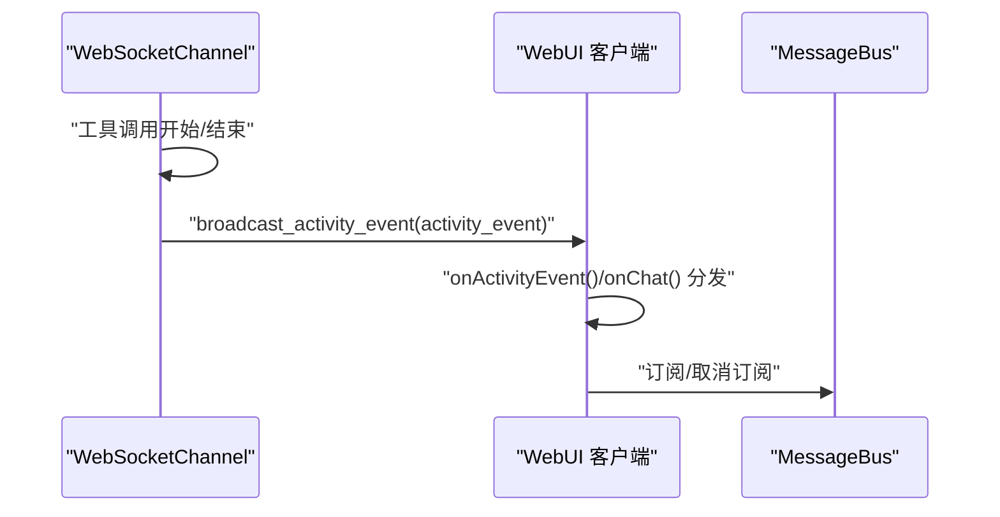
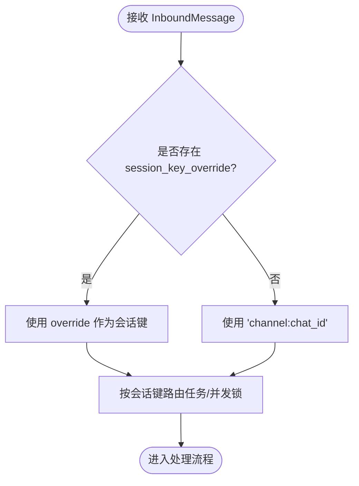
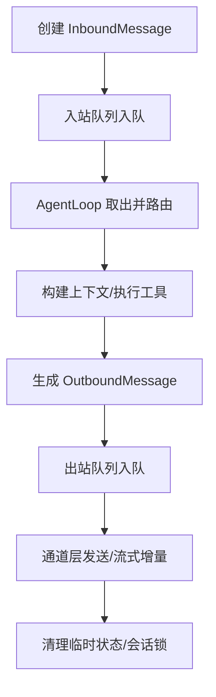
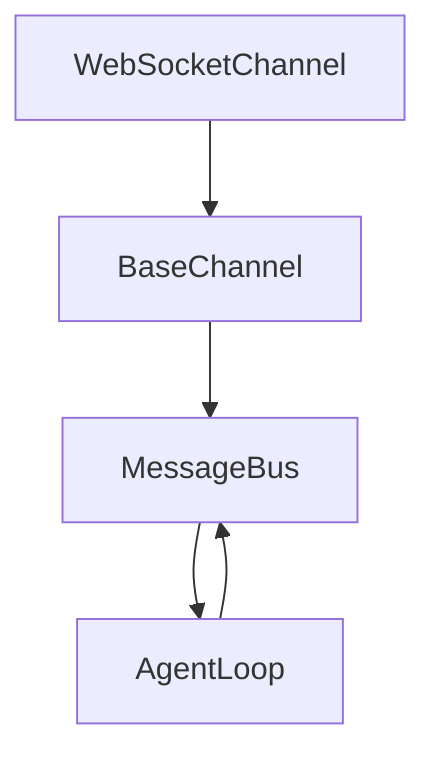

# 事件系统

<cite>
**本文引用的文件**
- [secbot/bus/events.py](file://secbot/bus/events.py)
- [secbot/bus/queue.py](file://secbot/bus/queue.py)
- [secbot/channels/base.py](file://secbot/channels/base.py)
- [secbot/channels/websocket.py](file://secbot/channels/websocket.py)
- [secbot/agent/loop.py](file://secbot/agent/loop.py)
- [tests/agent/test_task_cancel.py](file://tests/agent/test_task_cancel.py)
- [tests/channels/test_websocket_integration.py](file://tests/channels/test_websocket_integration.py)
- [tests/api/test_events.py](file://tests/api/test_events.py)
- [webui/src/lib/secbot-client.ts](file://webui/src/lib/secbot-client.ts)
</cite>

## 目录
1. [简介](#简介)
2. [项目结构](#项目结构)
3. [核心组件](#核心组件)
4. [架构总览](#架构总览)
5. [详细组件分析](#详细组件分析)
6. [依赖分析](#依赖分析)
7. [性能考虑](#性能考虑)
8. [故障排查指南](#故障排查指南)
9. [结论](#结论)
10. [附录](#附录)

## 简介
本文件系统性地阐述 VAPT3 的事件驱动架构与消息总线设计，重点覆盖以下主题：
- 事件类型定义：InboundMessage 与 OutboundMessage 的结构、字段语义与用途
- 事件处理器注册与事件传播机制：通道（Channel）如何将入站消息发布到总线，代理循环（AgentLoop）如何消费并处理消息
- 消息生命周期管理：从创建、分发、处理到清理的完整流程
- 消息会话键（session_key）的生成规则与作用机制
- 扩展接口与自定义事件类型的开发指南：消息格式规范、处理流程与错误处理策略

## 项目结构
事件系统围绕“消息总线”展开，主要由三部分组成：
- 事件模型层：定义 InboundMessage 与 OutboundMessage 数据结构
- 总线层：提供异步队列实现的消息总线，负责入站/出站消息的缓冲与传递
- 通道层：对接具体聊天平台（如 WebSocket），负责消息接入与发送，并通过总线进行解耦



图表来源
- [secbot/bus/events.py:8-39](file://secbot/bus/events.py#L8-L39)
- [secbot/bus/queue.py:8-45](file://secbot/bus/queue.py#L8-L45)
- [secbot/channels/base.py:15-201](file://secbot/channels/base.py#L15-L201)
- [secbot/channels/websocket.py:474-548](file://secbot/channels/websocket.py#L474-L548)
- [secbot/agent/loop.py:276-800](file://secbot/agent/loop.py#L276-L800)

章节来源
- [secbot/bus/events.py:1-39](file://secbot/bus/events.py#L1-L39)
- [secbot/bus/queue.py:1-45](file://secbot/bus/queue.py#L1-L45)
- [secbot/channels/base.py:1-201](file://secbot/channels/base.py#L1-L201)
- [secbot/channels/websocket.py:1-2376](file://secbot/channels/websocket.py#L1-L2376)
- [secbot/agent/loop.py:1-1528](file://secbot/agent/loop.py#L1-L1528)

## 核心组件
- InboundMessage：表示来自聊天通道的入站消息，包含渠道标识、发送者 ID、会话 ID、内容、时间戳、媒体列表、元数据与可选的会话键覆盖
- OutboundMessage：表示待发送给聊天通道的出站消息，包含渠道、会话 ID、内容、回复目标、媒体、元数据与按钮
- MessageBus：基于 asyncio.Queue 的异步消息总线，提供入站/出站消息的发布与消费能力
- BaseChannel：通道抽象基类，定义通道通用行为（启动/停止、发送、流式传输、权限校验等）
- WebSocketChannel：WebSocket 通道的具体实现，负责握手、鉴权、订阅管理、广播活动事件等
- AgentLoop：代理循环，负责从总线消费入站消息、构建上下文、调用模型与工具、生成出站消息并通过总线回传

章节来源
- [secbot/bus/events.py:8-39](file://secbot/bus/events.py#L8-L39)
- [secbot/bus/queue.py:8-45](file://secbot/bus/queue.py#L8-L45)
- [secbot/channels/base.py:15-201](file://secbot/channels/base.py#L15-L201)
- [secbot/channels/websocket.py:474-548](file://secbot/channels/websocket.py#L474-L548)
- [secbot/agent/loop.py:276-800](file://secbot/agent/loop.py#L276-L800)

## 架构总览
事件系统采用“事件驱动 + 解耦通道”的架构模式：
- 通道层仅负责接入与发送，不直接参与业务逻辑
- 代理循环仅关注消息处理与响应生成，不关心具体通道细节
- 总线作为唯一共享状态，屏蔽了通道与代理之间的耦合

```mermaid
sequenceDiagram
participant Client as "客户端"
participant WS as "WebSocketChannel"
participant Bus as "MessageBus"
participant Loop as "AgentLoop"
participant Handler as "工具/技能"
Client->>WS : "文本/JSON 消息"
WS->>WS : "权限校验/流式标记"
WS->>Bus : "publish_inbound(InboundMessage)"
Bus-->>Loop : "consume_inbound()"
Loop->>Loop : "构建上下文/执行工具"
Loop->>Handler : "调用工具/技能"
Handler-->>Loop : "返回结果"
Loop->>Bus : "publish_outbound(OutboundMessage)"
Bus-->>WS : "consume_outbound()"
WS-->>Client : "发送响应/流式增量"
```

图表来源
- [secbot/channels/websocket.py:146-190](file://secbot/channels/websocket.py#L146-L190)
- [secbot/bus/queue.py:20-34](file://secbot/bus/queue.py#L20-L34)
- [secbot/agent/loop.py:644-786](file://secbot/agent/loop.py#L644-L786)

章节来源
- [secbot/channels/websocket.py:146-190](file://secbot/channels/websocket.py#L146-L190)
- [secbot/bus/queue.py:20-34](file://secbot/bus/queue.py#L20-L34)
- [secbot/agent/loop.py:644-786](file://secbot/agent/loop.py#L644-L786)

## 详细组件分析

### InboundMessage 与 OutboundMessage 结构与用途
- InboundMessage 字段要点
  - 基础字段：channel、sender_id、chat_id、content、timestamp
  - 增强字段：media（媒体 URL 列表）、metadata（通道特定元数据）、session_key_override（会话键覆盖）
  - 计算属性：session_key，用于会话路由与并发控制
- OutboundMessage 字段要点
  - 基础字段：channel、chat_id、content
  - 增强字段：reply_to（回复目标消息 ID）、media（媒体列表）、metadata（通道特定元数据）、buttons（按钮列表）



图表来源
- [secbot/bus/events.py:8-39](file://secbot/bus/events.py#L8-L39)

章节来源
- [secbot/bus/events.py:8-39](file://secbot/bus/events.py#L8-L39)

### 通道与消息接入
- BaseChannel._handle_message 将原始输入封装为 InboundMessage，并根据是否支持流式传输在 metadata 中添加标记，随后通过 bus.publish_inbound 发布
- WebSocketChannel 在握手阶段进行鉴权与订阅管理，支持多路订阅与广播；同时提供 REST 接口以服务 WebUI



图表来源
- [secbot/channels/base.py:146-190](file://secbot/channels/base.py#L146-L190)
- [secbot/channels/websocket.py:780-787](file://secbot/channels/websocket.py#L780-L787)

章节来源
- [secbot/channels/base.py:146-190](file://secbot/channels/base.py#L146-L190)
- [secbot/channels/websocket.py:780-787](file://secbot/channels/websocket.py#L780-L787)

### 代理循环与消息处理
- AgentLoop.run 循环从总线消费入站消息，使用 _dispatch/_run_agent_loop 等方法组织处理流程
- 处理过程中通过钩子（Hook）支持进度回调、流式增量输出与活动事件广播
- 工具调用完成后，将 OutboundMessage 通过总线回传至通道层

```mermaid
sequenceDiagram
participant Bus as "MessageBus"
participant Loop as "AgentLoop"
participant Hook as "LoopHook"
participant Runner as "AgentRunner"
participant Tools as "工具集合"
Bus-->>Loop : "consume_inbound()"
Loop->>Hook : "before_iteration()"
Loop->>Runner : "run(AgentRunSpec)"
Runner->>Tools : "执行工具/技能"
Tools-->>Runner : "返回结果"
Runner-->>Loop : "最终内容/消息历史"
Loop->>Hook : "after_iteration()"
Loop->>Bus : "publish_outbound(OutboundMessage)"
```

图表来源
- [secbot/agent/loop.py:788-800](file://secbot/agent/loop.py#L788-L800)
- [secbot/agent/loop.py:644-786](file://secbot/agent/loop.py#L644-L786)
- [secbot/agent/loop.py:68-274](file://secbot/agent/loop.py#L68-L274)

章节来源
- [secbot/agent/loop.py:644-786](file://secbot/agent/loop.py#L644-L786)
- [secbot/agent/loop.py:68-274](file://secbot/agent/loop.py#L68-L274)

### 事件传播与 WebUI 订阅
- WebSocketChannel 提供活动事件广播能力，将工具调用与结果以 activity_event 形式推送给 WebUI
- WebUI 客户端通过 onChat/onActivityEvent 订阅指定会话或全局活动事件，实现仪表盘实时展示



图表来源
- [secbot/agent/loop.py:163-263](file://secbot/agent/loop.py#L163-L263)
- [webui/src/lib/secbot-client.ts:124-303](file://webui/src/lib/secbot-client.ts#L124-L303)

章节来源
- [secbot/agent/loop.py:163-263](file://secbot/agent/loop.py#L163-L263)
- [webui/src/lib/secbot-client.ts:124-303](file://webui/src/lib/secbot-client.ts#L124-L303)

### 会话键生成规则与作用
- 会话键计算
  - 若显式提供 session_key_override，则使用该值
  - 否则默认为 “channel:chat_id”
- 作用
  - 用于任务路由与并发控制：同一会话内的消息按序处理，避免并发冲突
  - 支持统一会话模式（unified:default）与线程级会话（thread-scoped）
  - 与工具上下文绑定，确保 spawn/message/cron 等工具能正确回注消息与会话信息



图表来源
- [secbot/bus/events.py:21-24](file://secbot/bus/events.py#L21-L24)
- [secbot/agent/loop.py:626-630](file://secbot/agent/loop.py#L626-L630)
- [secbot/agent/loop.py:536-565](file://secbot/agent/loop.py#L536-L565)

章节来源
- [secbot/bus/events.py:21-24](file://secbot/bus/events.py#L21-L24)
- [secbot/agent/loop.py:626-630](file://secbot/agent/loop.py#L626-L630)
- [secbot/agent/loop.py:536-565](file://secbot/agent/loop.py#L536-L565)

### 生命周期管理
- 创建：通道将外部输入封装为 InboundMessage 并发布到入站队列
- 分发：AgentLoop 从入站队列取出消息，按会话键进行并发控制与任务调度
- 处理：构建上下文、调用模型与工具、生成中间与最终响应
- 清理：工具执行完毕后，OutboundMessage 通过总线进入出站队列，通道层发送响应并释放资源



图表来源
- [secbot/bus/queue.py:20-34](file://secbot/bus/queue.py#L20-L34)
- [secbot/agent/loop.py:644-786](file://secbot/agent/loop.py#L644-L786)
- [secbot/channels/base.py:146-190](file://secbot/channels/base.py#L146-L190)

章节来源
- [secbot/bus/queue.py:20-34](file://secbot/bus/queue.py#L20-L34)
- [secbot/agent/loop.py:644-786](file://secbot/agent/loop.py#L644-L786)
- [secbot/channels/base.py:146-190](file://secbot/channels/base.py#L146-L190)

### 扩展接口与自定义事件类型开发指南
- 自定义通道
  - 继承 BaseChannel，实现 start/stop/send/send_delta 等方法
  - 使用 _handle_message 封装消息并调用 bus.publish_inbound
- 自定义消息格式
  - 入站：遵循 InboundMessage 字段约定，必要时在 metadata 中携带通道特定元数据
  - 出站：遵循 OutboundMessage 字段约定，若需流式输出，确保通道实现 send_delta 并在元数据中设置流式标记
- 处理流程
  - 通道负责权限校验与消息封装
  - 代理循环负责上下文构建、工具执行与响应生成
  - 错误处理：通道层在发送失败时抛出异常以便上层重试；代理循环捕获工具/模型错误并生成用户可读的错误响应
- 测试建议
  - 单元测试验证消息封装与元数据传递
  - 集成测试验证总线队列与并发控制
  - WebUI 端测试验证订阅与活动事件广播

章节来源
- [secbot/channels/base.py:81-129](file://secbot/channels/base.py#L81-L129)
- [secbot/bus/events.py:8-39](file://secbot/bus/events.py#L8-L39)
- [tests/agent/test_task_cancel.py:125-182](file://tests/agent/test_task_cancel.py#L125-L182)
- [tests/channels/test_websocket_integration.py:89-118](file://tests/channels/test_websocket_integration.py#L89-L118)

## 依赖分析
- 组件耦合
  - 通道与代理通过 MessageBus 解耦，降低模块间直接依赖
  - AgentLoop 依赖 MessageBus 与工具注册表，但不直接依赖具体通道实现
- 关键依赖链
  - WebSocketChannel -> BaseChannel -> MessageBus -> AgentLoop
  - AgentLoop -> MessageBus -> WebSocketChannel（出站）
- 潜在风险
  - 通道未实现 send_delta 时，流式传输能力受限
  - 会话键覆盖不当可能导致消息错投或并发冲突



图表来源
- [secbot/channels/websocket.py:474-548](file://secbot/channels/websocket.py#L474-L548)
- [secbot/channels/base.py:15-43](file://secbot/channels/base.py#L15-L43)
- [secbot/bus/queue.py:8-19](file://secbot/bus/queue.py#L8-L19)
- [secbot/agent/loop.py:276-320](file://secbot/agent/loop.py#L276-L320)

章节来源
- [secbot/channels/websocket.py:474-548](file://secbot/channels/websocket.py#L474-L548)
- [secbot/channels/base.py:15-43](file://secbot/channels/base.py#L15-L43)
- [secbot/bus/queue.py:8-19](file://secbot/bus/queue.py#L8-L19)
- [secbot/agent/loop.py:276-320](file://secbot/agent/loop.py#L276-L320)

## 性能考虑
- 并发与队列
  - 入站/出站队列采用 asyncio.Queue，具备异步非阻塞特性
  - 会话级并发锁与挂起队列（pending queue）保证同一会话内消息有序处理
- 流式传输
  - 通道层通过 send_delta 实现增量推送，减少端到端延迟
  - 元数据中流式标记用于保留原始上下文（如线程根事件 ID）
- 资源管理
  - 令牌预算与上下文压缩策略限制历史长度，避免内存膨胀
  - 活动事件缓冲区支持窗口裁剪与限长，保障仪表盘性能

## 故障排查指南
- 无法接收消息
  - 检查通道权限配置（allow_from）与握手参数（client_id/token）
  - 确认 bus.publish_inbound 是否被调用
- 无响应或延迟高
  - 检查是否启用流式传输及通道是否实现 send_delta
  - 观察总线入站/出站队列长度（inbound_size/outbound_size）
- 活动事件未显示
  - 确认 WebUI 客户端已订阅 onActivityEvent/onChat
  - 检查 WebSocketChannel 是否成功广播 activity_event
- 会话错乱或并发冲突
  - 核对 session_key 生成规则与覆盖逻辑
  - 确保同一会话键的消息按序处理

章节来源
- [tests/channels/test_websocket_integration.py:89-118](file://tests/channels/test_websocket_integration.py#L89-L118)
- [tests/api/test_events.py:236-371](file://tests/api/test_events.py#L236-L371)
- [webui/src/lib/secbot-client.ts:124-303](file://webui/src/lib/secbot-client.ts#L124-L303)
- [secbot/bus/queue.py:37-44](file://secbot/bus/queue.py#L37-L44)

## 结论
VAPT3 的事件系统通过清晰的事件模型、解耦的通道与代理、以及可靠的异步总线，实现了高扩展性与可维护性的消息驱动架构。InboundMessage/OutboundMessage 的标准化定义、会话键的路由与并发控制、以及活动事件的广播机制，共同构成了稳定且可扩展的事件基础设施。开发者可在此基础上快速扩展新的通道与处理流程，同时保持系统整体的一致性与可靠性。

## 附录
- 相关测试参考
  - WebSocket 消息集成测试：验证入站消息解析与总线发布
  - 任务取消与流式元数据保留测试：验证并发控制与元数据一致性
  - 活动事件 HTTP 接口测试：验证事件缓冲与过滤策略

章节来源
- [tests/channels/test_websocket_integration.py:89-118](file://tests/channels/test_websocket_integration.py#L89-L118)
- [tests/agent/test_task_cancel.py:125-182](file://tests/agent/test_task_cancel.py#L125-L182)
- [tests/api/test_events.py:236-371](file://tests/api/test_events.py#L236-L371)