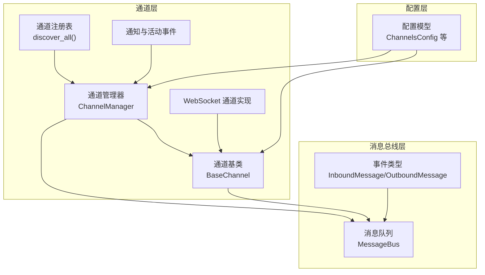
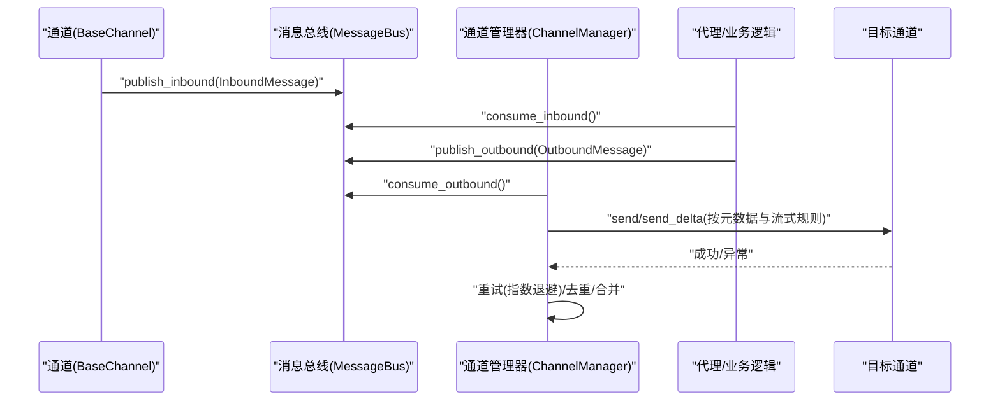
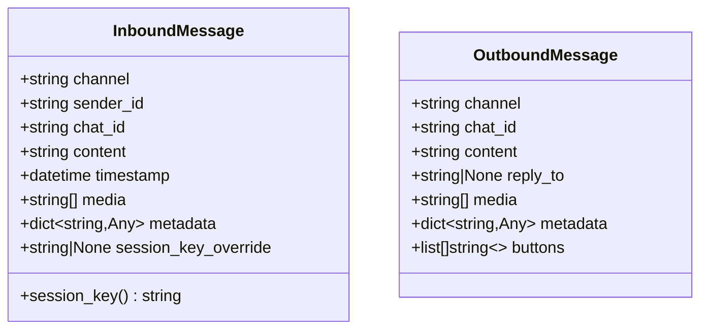
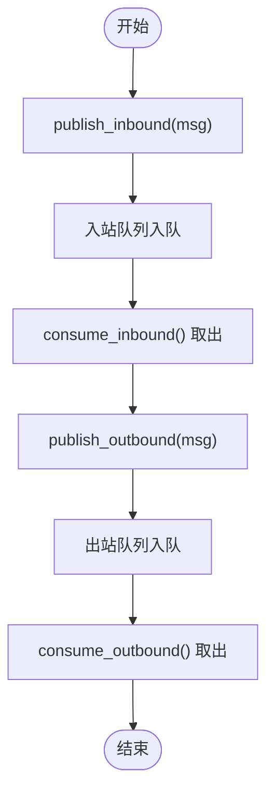
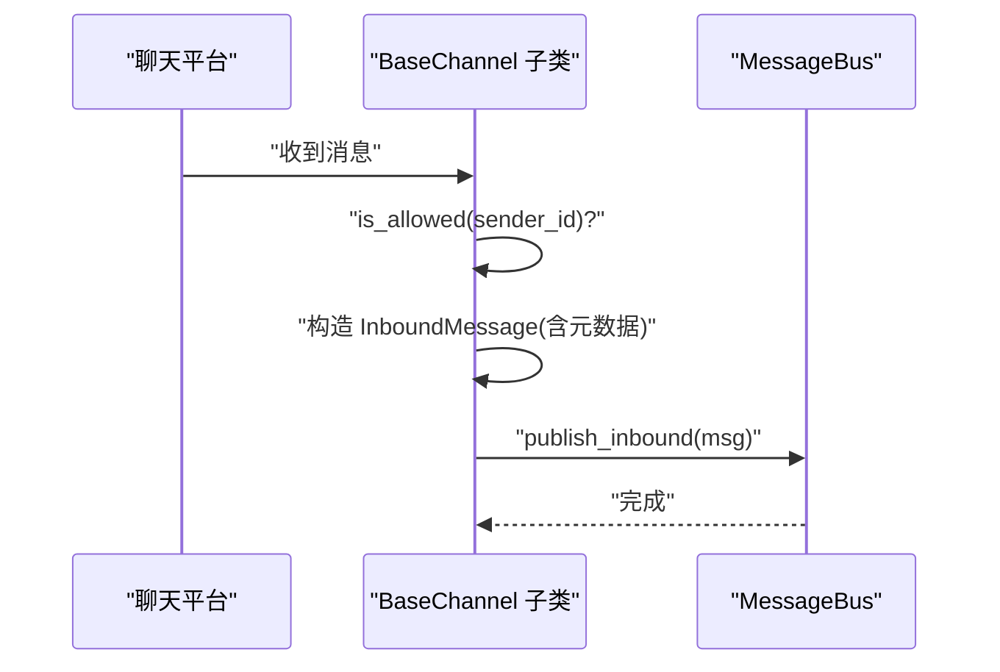
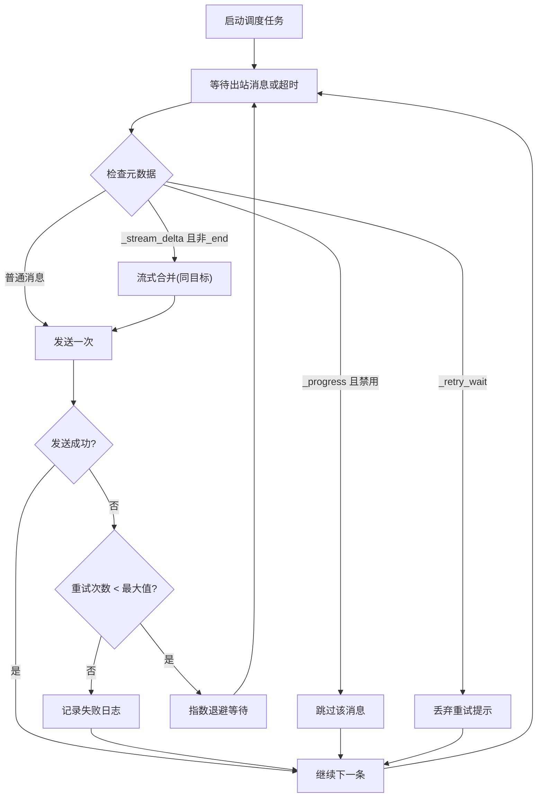
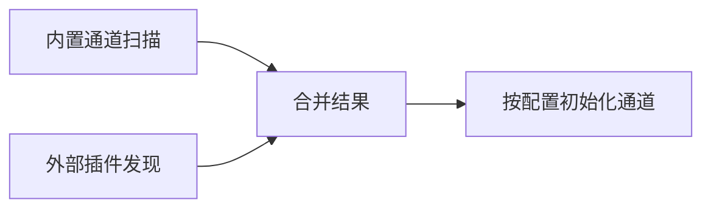
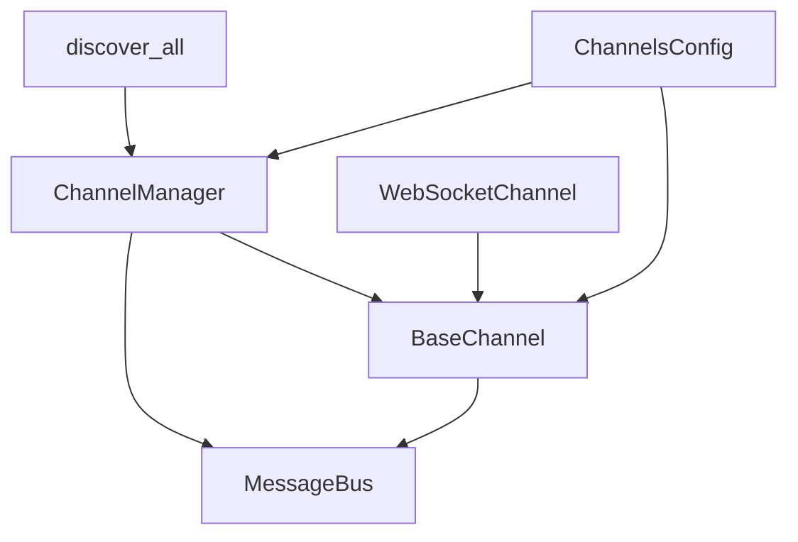

# 消息总线架构

<cite>
**本文档引用的文件**
- [bus/__init__.py](file://secbot/bus/__init__.py)
- [bus/events.py](file://secbot/bus/events.py)
- [bus/queue.py](file://secbot/bus/queue.py)
- [channels/__init__.py](file://secbot/channels/__init__.py)
- [channels/base.py](file://secbot/channels/base.py)
- [channels/manager.py](file://secbot/channels/manager.py)
- [channels/registry.py](file://secbot/channels/registry.py)
- [channels/websocket.py](file://secbot/channels/websocket.py)
- [channels/notifications.py](file://secbot/channels/notifications.py)
- [config/schema.py](file://secbot/config/schema.py)
- [test_channel_manager_delta_coalescing.py](file://tests/channels/test_channel_manager_delta_coalescing.py)
- [test_base_channel.py](file://tests/channels/test_base_channel.py)
- [channel-plugin-guide.md](file://docs/channel-plugin-guide.md)
</cite>

## 目录
1. [简介](#简介)
2. [项目结构](#项目结构)
3. [核心组件](#核心组件)
4. [架构概览](#架构概览)
5. [详细组件分析](#详细组件分析)
6. [依赖关系分析](#依赖关系分析)
7. [性能考量](#性能考量)
8. [故障排除指南](#故障排除指南)
9. [结论](#结论)
10. [附录](#附录)

## 简介
本文件系统性阐述 VAPT3 的消息总线架构，围绕事件驱动与异步解耦设计，详解消息路由机制、通道管理器、队列系统与扩展接口。重点覆盖以下主题：
- InboundMessage 与 OutboundMessage 的结构、用途与元数据管理
- 基于 asyncio.Queue 的消息队列实现（入站/出站）
- 通道管理器的多渠道支持、消息分发、重试与流式合并
- 插件化通道发现与注册机制
- 配置体系对消息总线行为的影响（发送策略、流式传输、重试次数）

## 项目结构
消息总线相关代码主要分布在以下模块：
- bus：事件类型与消息总线队列
- channels：通道抽象、管理器、插件发现与具体通道实现
- config：配置模型，影响通道行为与消息总线策略
- tests：验证消息总线行为的单元测试
- docs：通道插件开发指南

**图表来源**
- [bus/events.py:8-39](file://secbot/bus/events.py#L8-L39)
- [bus/queue.py:8-45](file://secbot/bus/queue.py#L8-L45)
- [channels/base.py:15-201](file://secbot/channels/base.py#L15-L201)
- [channels/manager.py:43-443](file://secbot/channels/manager.py#L43-L443)
- [channels/registry.py:54-72](file://secbot/channels/registry.py#L54-L72)
- [channels/websocket.py:474-549](file://secbot/channels/websocket.py#L474-L549)
- [channels/notifications.py:127-385](file://secbot/channels/notifications.py#L127-L385)
- [config/schema.py:18-33](file://secbot/config/schema.py#L18-L33)

**章节来源**
- [bus/__init__.py:1-7](file://secbot/bus/__init__.py#L1-L7)
- [channels/__init__.py:1-7](file://secbot/channels/__init__.py#L1-L7)

## 核心组件
- InboundMessage：来自聊天通道的入站消息，包含渠道标识、用户与会话标识、内容、时间戳、媒体列表、元数据与会话键覆盖等字段；提供 session_key 属性用于会话识别。
- OutboundMessage：待发送到聊天通道的出站消息，包含目标渠道、会话标识、内容、回复引用、媒体、元数据与按钮等字段；常用于携带流式标记与进度信息。
- MessageBus：基于 asyncio.Queue 的异步消息总线，提供入站/出站发布与消费接口，并暴露队列长度属性。

这些组件共同构成事件驱动与异步解耦的基础：通道将入站消息封装为 InboundMessage 并发布到入站队列；代理从队列消费并生成 OutboundMessage；通道管理器将 OutboundMessage 分发给对应通道。

**章节来源**
- [bus/events.py:8-39](file://secbot/bus/events.py#L8-L39)
- [bus/queue.py:8-45](file://secbot/bus/queue.py#L8-L45)

## 架构概览
消息总线采用“事件驱动 + 异步队列”的解耦架构：
- 通道通过 BaseChannel 接口接入，统一将入站消息封装为 InboundMessage 并发布到 MessageBus 的入站队列
- 代理或业务逻辑从入站队列消费消息，生成 OutboundMessage 并发布到出站队列
- ChannelManager 启动出站调度任务，从出站队列消费消息，进行流式合并、去重抑制、进度过滤与重试，最终调用各通道的 send/send_delta 发送

**图表来源**
- [bus/queue.py:20-34](file://secbot/bus/queue.py#L20-L34)
- [channels/base.py:146-191](file://secbot/channels/base.py#L146-L191)
- [channels/manager.py:278-424](file://secbot/channels/manager.py#L278-L424)

## 详细组件分析

### InboundMessage 与 OutboundMessage 数据模型
- InboundMessage 关键字段
  - channel：来源渠道名称
  - sender_id、chat_id：用户与会话标识
  - content：文本内容
  - timestamp：消息时间戳，默认当前时间
  - media：媒体 URL 列表
  - metadata：通道特定元数据
  - session_key_override：可选覆盖会话键
  - session_key：组合逻辑为 "channel:chat_id" 或显式覆盖
- OutboundMessage 关键字段
  - channel、chat_id：目标渠道与会话
  - content：文本内容
  - reply_to：回复引用
  - media：本地文件路径列表
  - metadata：控制标记如 _stream_delta/_stream_end/_progress/_tool_hint/_retry_wait 等
  - buttons：按钮列表

**图表来源**
- [bus/events.py:8-39](file://secbot/bus/events.py#L8-L39)

**章节来源**
- [bus/events.py:8-39](file://secbot/bus/events.py#L8-L39)

### MessageBus 队列系统
- 入站队列：接收来自通道的 InboundMessage
- 出站队列：承载代理生成的 OutboundMessage
- 提供异步发布/消费接口，以及队列长度查询
- 未实现优先级与持久化：基于内存队列，适合进程内解耦与高吞吐场景

**图表来源**
- [bus/queue.py:16-45](file://secbot/bus/queue.py#L16-L45)

**章节来源**
- [bus/queue.py:8-45](file://secbot/bus/queue.py#L8-L45)

### 通道基类与消息入口
- BaseChannel 抽象了所有通道的通用能力
- _handle_message 负责权限校验与消息封装，自动设置元数据（如 _wants_stream），并将 InboundMessage 发布到消息总线
- is_allowed 支持 allow_from/allowFrom 列表，空列表默认拒绝
- supports_streaming 基于配置与 send_delta 实现判断
- send/send_delta 由子类实现，分别处理一次性消息与流式增量

**图表来源**
- [channels/base.py:146-191](file://secbot/channels/base.py#L146-L191)

**章节来源**
- [channels/base.py:15-201](file://secbot/channels/base.py#L15-L201)

### 通道管理器与消息分发
- 初始化阶段扫描内置与外部插件，按配置启用通道，注入全局参数（如转写提供商、发送策略等）
- 启动出站调度任务，从出站队列消费消息
- 流式合并：对同一 (channel, chat_id) 的连续 _stream_delta 进行合并，减少 API 调用与延迟
- 去重抑制：基于指纹与 origin_message_id/message_id，避免重复消息
- 进度过滤：根据通道配置决定是否发送 _progress 或 _tool_hint
- 重试策略：指数退避（1s, 2s, 4s）+ 最大尝试次数，异常时记录日志并等待下次调度
- 未知通道：记录警告并跳过

**图表来源**
- [channels/manager.py:278-424](file://secbot/channels/manager.py#L278-L424)

**章节来源**
- [channels/manager.py:43-443](file://secbot/channels/manager.py#L43-L443)

### 通道注册与插件发现
- discover_all 合并内置通道与外部插件，内置优先，避免外部插件覆盖内置名称
- 外部插件通过 entry_points 注册，名称即配置段名
- 通道实例化时注入 MessageBus 与全局参数（如转写提供商、发送策略）

**图表来源**
- [channels/registry.py:54-72](file://secbot/channels/registry.py#L54-L72)

**章节来源**
- [channels/registry.py:17-72](file://secbot/channels/registry.py#L17-L72)

### WebSocket 通道实现要点
- 作为 WebSocket 服务器，负责握手、鉴权、订阅管理与事件广播
- 支持嵌入式 WebUI、REST 接口与活动事件流
- 将入站消息经 BaseChannel._handle_message 封装后发布到消息总线
- 出站消息通过 send/send_delta 发送，支持流式增量更新

**章节来源**
- [channels/websocket.py:474-549](file://secbot/channels/websocket.py#L474-L549)

### 通知与活动事件缓冲
- NotificationQueue：有界环形缓冲，支持读写锁保护，提供发布、标记已读、快照与未读计数
- EventBuffer：有界环形缓冲，按时间戳过滤与限制数量，支持窗口期查询
- 二者均采用单例访问器，便于跨模块共享

**章节来源**
- [channels/notifications.py:127-385](file://secbot/channels/notifications.py#L127-L385)

## 依赖关系分析
- 组件耦合
  - BaseChannel 依赖 MessageBus 与 InboundMessage/OutboundMessage
  - ChannelManager 依赖 MessageBus、BaseChannel 与配置模型
  - 通道实现（如 WebSocket）继承 BaseChannel 并注入额外服务
- 外部依赖
  - asyncio：异步队列与调度
  - loguru：日志记录
  - Pydantic：配置模型与别名兼容
  - websockets/aiohttp（通道实现）：网络通信

**图表来源**
- [channels/base.py:32-43](file://secbot/channels/base.py#L32-L43)
- [channels/manager.py:53-71](file://secbot/channels/manager.py#L53-L71)
- [channels/registry.py:54-72](file://secbot/channels/registry.py#L54-L72)
- [config/schema.py:18-33](file://secbot/config/schema.py#L18-L33)

**章节来源**
- [channels/base.py:15-201](file://secbot/channels/base.py#L15-L201)
- [channels/manager.py:43-127](file://secbot/channels/manager.py#L43-L127)
- [channels/registry.py:54-72](file://secbot/channels/registry.py#L54-L72)
- [config/schema.py:18-33](file://secbot/config/schema.py#L18-L33)

## 性能考量
- 队列模型
  - 使用 asyncio.Queue，具备异步阻塞与非阻塞操作，适合高并发 I/O 场景
  - 未实现优先级与持久化，内存队列保证低延迟但不跨进程/崩溃持久
- 流式优化
  - ChannelManager 对 _stream_delta 进行同目标合并，显著降低 API 调用次数与网络开销
  - 支持 _stream_end 标记，确保流结束信号正确传递
- 去重与过滤
  - 基于指纹与消息 ID 的去重抑制，避免重复内容刷屏
  - 进度与工具提示的按通道过滤，减少无关消息传输
- 重试策略
  - 指数退避 + 最大尝试次数，平衡可靠性与资源占用
- 并发模型
  - 通道与调度器并行运行，通道长生命周期任务与调度器异步消费解耦

[本节为通用性能讨论，无需特定文件引用]

## 故障排除指南
- 入站消息未到达代理
  - 检查通道是否正确调用 _handle_message 并发布到消息总线
  - 确认通道 is_allowed 配置允许该 sender_id
- 出站消息未送达
  - 查看 ChannelManager 日志中的发送失败与重试记录
  - 检查通道 send/send_delta 实现是否抛出异常
- 流式消息异常
  - 确认通道 supports_streaming 条件满足（配置 streaming 且实现 send_delta）
  - 检查 _stream_delta/_stream_end 元数据是否正确传递
- 重复消息
  - 检查去重指纹与 origin_message_id/message_id 是否一致
- 配置问题
  - ChannelsConfig.send_progress/send_tool_hints/send_max_retries 影响消息可见性与重试次数
  - allow_from/allowFrom 为空会导致全部拒绝

**章节来源**
- [channels/base.py:130-144](file://secbot/channels/base.py#L130-L144)
- [channels/manager.py:256-277](file://secbot/channels/manager.py#L256-L277)
- [config/schema.py:18-33](file://secbot/config/schema.py#L18-L33)

## 结论
VAPT3 的消息总线通过事件驱动与异步队列实现了通道与代理之间的松耦合，结合通道管理器的流式合并、去重抑制与重试策略，在保证可靠性的同时提升了交互体验。其插件化架构与清晰的配置模型使得新增通道与定制行为变得简单可控。

[本节为总结性内容，无需特定文件引用]

## 附录

### 扩展接口与自定义选项
- 自定义通道
  - 继承 BaseChannel，实现 start/stop/send/send_delta（可选）
  - 在 default_config 中声明配置项，支持 camelCase 与 snake_case 键
  - 通过 entry_points 注册，名称即配置段名
- 配置项
  - ChannelsConfig：send_progress、send_tool_hints、send_max_retries、transcription_provider/language
  - 通道配置：enabled、allow_from、streaming 等
- 行为定制
  - 通过通道属性（如 send_progress/send_tool_hints）控制消息可见性
  - 通过元数据（_stream_delta/_stream_end/_progress/_tool_hint/_retry_wait）控制流式与进度行为

**章节来源**
- [channels/base.py:192-201](file://secbot/channels/base.py#L192-L201)
- [channels/registry.py:40-51](file://secbot/channels/registry.py#L40-L51)
- [config/schema.py:18-33](file://secbot/config/schema.py#L18-L33)
- [channel-plugin-guide.md:353-442](file://docs/channel-plugin-guide.md#L353-L442)

### 测试参考
- 流式合并与边界条件
  - 验证相同目标连续 _stream_delta 合并、不同目标不合并、_stream_end 正确终止
- 进度过滤与通道覆盖
  - 根据通道配置决定是否发送 _progress 与 _tool_hint
- 重试等待消息过滤
  - 内部重试提示不应到达用户通道

**章节来源**
- [test_channel_manager_delta_coalescing.py:60-441](file://tests/channels/test_channel_manager_delta_coalescing.py#L60-L441)
- [test_base_channel.py:21-38](file://tests/channels/test_base_channel.py#L21-L38)