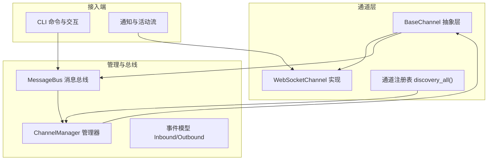
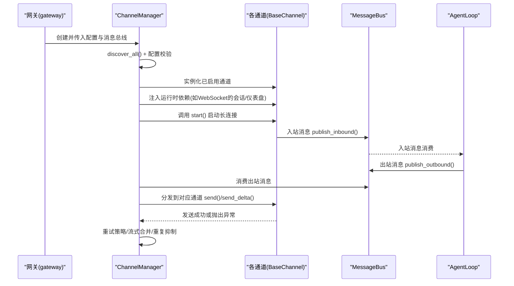
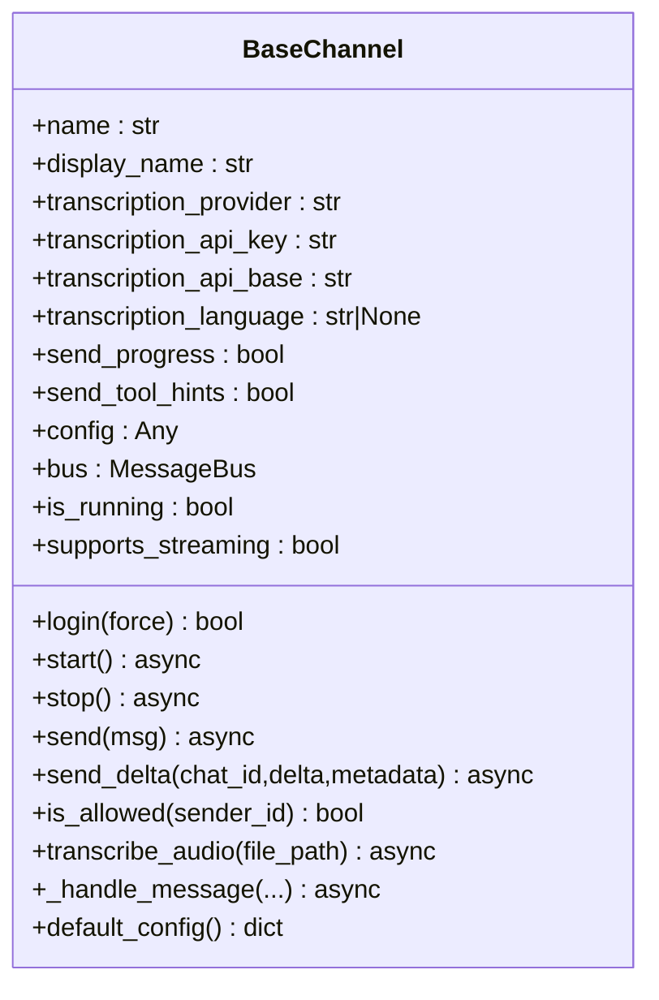
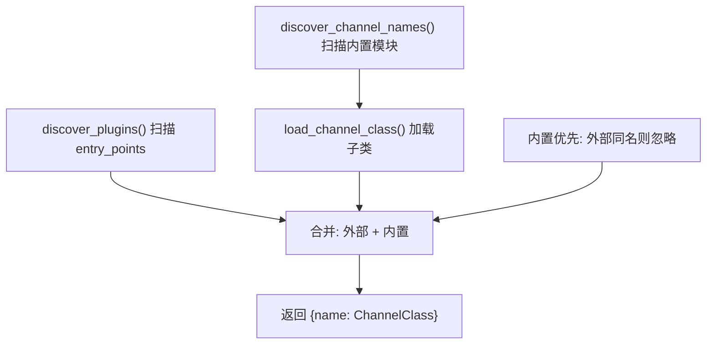
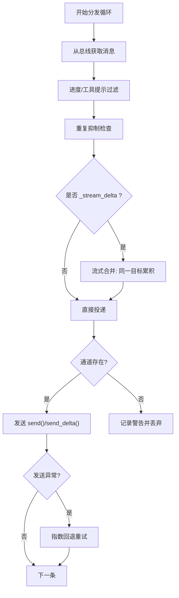
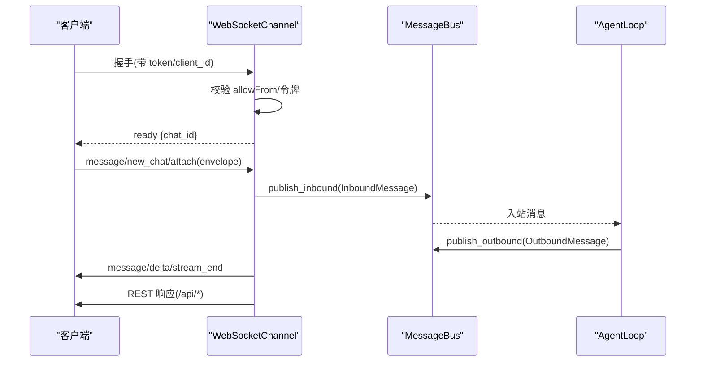
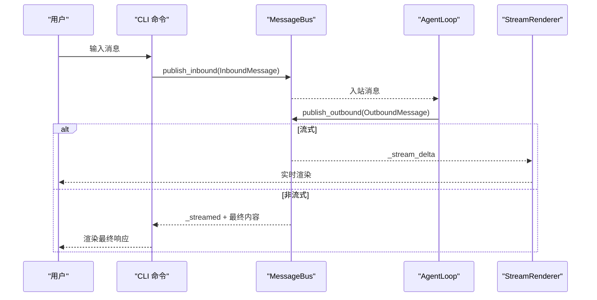
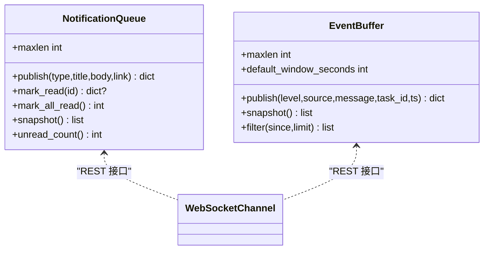
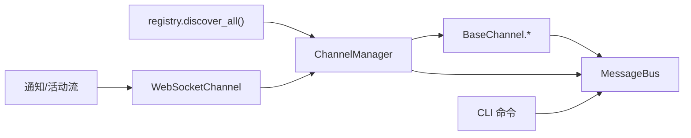

# 通道管理器

<cite>
**本文档引用的文件**
- [secbot/channels/__init__.py](file://secbot/channels/__init__.py)
- [secbot/channels/base.py](file://secbot/channels/base.py)
- [secbot/channels/manager.py](file://secbot/channels/manager.py)
- [secbot/channels/registry.py](file://secbot/channels/registry.py)
- [secbot/channels/websocket.py](file://secbot/channels/websocket.py)
- [secbot/channels/notifications.py](file://secbot/channels/notifications.py)
- [secbot/bus/events.py](file://secbot/bus/events.py)
- [secbot/bus/queue.py](file://secbot/bus/queue.py)
- [secbot/cli/commands.py](file://secbot/cli/commands.py)
- [secbot/cli/stream.py](file://secbot/cli/stream.py)
- [docs/channel-plugin-guide.md](file://docs/channel-plugin-guide.md)
- [docs/websocket.md](file://docs/websocket.md)
</cite>

## 目录
1. [简介](#简介)
2. [项目结构](#项目结构)
3. [核心组件](#核心组件)
4. [架构总览](#架构总览)
5. [详细组件分析](#详细组件分析)
6. [依赖关系分析](#依赖关系分析)
7. [性能考量](#性能考量)
8. [故障排查指南](#故障排查指南)
9. [结论](#结论)
10. [附录](#附录)

## 简介
本文件系统性阐述 VAPT3（原 Nanobot）的通道管理器（Channel Manager）设计与实现，覆盖多通道抽象层、消息路由机制、连接管理、通道间通信协议与数据格式转换、生命周期管理（连接建立、状态监控、断线重连）、以及新通道类型开发指南与集成示例。目标是帮助开发者在不深入底层代码的前提下，理解并扩展多渠道支持能力。

## 项目结构
通道相关的核心代码集中在 secbot/channels 包中，并通过消息总线与 CLI、WebSocket 等通道协同工作；同时提供插件式扩展机制，允许外部包以 entry_points 注册新的通道类型。

图示来源
- [secbot/channels/registry.py:54-72](file://secbot/channels/registry.py#L54-L72)
- [secbot/channels/manager.py:43-127](file://secbot/channels/manager.py#L43-L127)
- [secbot/channels/base.py:15-128](file://secbot/channels/base.py#L15-L128)
- [secbot/channels/websocket.py:474-548](file://secbot/channels/websocket.py#L474-L548)
- [secbot/bus/queue.py:8-45](file://secbot/bus/queue.py#L8-L45)
- [secbot/bus/events.py:8-39](file://secbot/bus/events.py#L8-L39)
- [secbot/cli/commands.py:608-1069](file://secbot/cli/commands.py#L608-L1069)

章节来源
- [secbot/channels/__init__.py:1-7](file://secbot/channels/__init__.py#L1-L7)
- [secbot/channels/registry.py:17-72](file://secbot/channels/registry.py#L17-L72)
- [secbot/channels/manager.py:73-127](file://secbot/channels/manager.py#L73-L127)
- [secbot/bus/queue.py:8-45](file://secbot/bus/queue.py#L8-L45)

## 核心组件
- 通道抽象层 BaseChannel：定义统一接口（start/stop/send/send_delta），内置权限校验、流式发送能力、音频转写等通用功能。
- 通道注册表 registry：扫描内置通道与外部插件，合并优先级与冲突处理。
- 通道管理器 ChannelManager：集中初始化、启动/停止通道，负责出站消息分发、重复抑制、流式合并与重试策略。
- 消息总线 MessageBus：解耦通道与代理内核，提供异步入站/出站队列。
- 事件模型：InboundMessage/OutboundMessage 定义跨通道的消息契约。
- WebSocket 通道：作为内置通道之一，提供实时双向通信、令牌鉴权、媒体签名下载、仪表盘聚合接口等。
- CLI 通道：通过命令行交互，使用消息总线与代理内核通信，支持流式渲染与进度提示。
- 通知与活动流：内存环形缓冲区，供 WebSocket 通道的前端界面消费。

章节来源
- [secbot/channels/base.py:15-201](file://secbot/channels/base.py#L15-L201)
- [secbot/channels/registry.py:40-72](file://secbot/channels/registry.py#L40-L72)
- [secbot/channels/manager.py:43-443](file://secbot/channels/manager.py#L43-L443)
- [secbot/bus/events.py:8-39](file://secbot/bus/events.py#L8-L39)
- [secbot/bus/queue.py:8-45](file://secbot/bus/queue.py#L8-L45)
- [secbot/channels/websocket.py:474-548](file://secbot/channels/websocket.py#L474-L548)
- [secbot/cli/commands.py:1077-1308](file://secbot/cli/commands.py#L1077-L1308)
- [secbot/channels/notifications.py:127-385](file://secbot/channels/notifications.py#L127-L385)

## 架构总览
通道管理器采用“插件化 + 统一抽象 + 消息总线”的架构模式：
- 插件发现：内置通道与外部 entry_points 插件合并，内置优先。
- 初始化：按配置启用通道，注入会话/子代理/代理注册器等运行时依赖。
- 运行期：通道各自 start() 长连接监听；管理器统一调度出站消息，执行去重、流式合并与重试。
- 生命周期：统一启动/停止，异常捕获与优雅关闭。

图示来源
- [secbot/channels/manager.py:195-232](file://secbot/channels/manager.py#L195-L232)
- [secbot/channels/manager.py:278-336](file://secbot/channels/manager.py#L278-L336)
- [secbot/channels/manager.py:395-424](file://secbot/channels/manager.py#L395-L424)
- [secbot/bus/queue.py:20-34](file://secbot/bus/queue.py#L20-L34)
- [secbot/channels/base.py:81-109](file://secbot/channels/base.py#L81-L109)

## 详细组件分析

### 通道抽象层 BaseChannel
- 角色定位：所有通道的统一抽象，屏蔽平台差异。
- 关键职责：
  - 权限控制：is_allowed(sender_id) 基于 allowFrom 列表。
  - 入站桥接：_handle_message() 将原始消息封装为 InboundMessage 并发布到总线。
  - 出站发送：send() 与 send_delta()（可选）。
  - 流式能力：supports_streaming 属性与 metadata 标记驱动。
  - 音频转写：transcribe_audio() 支持 OpenAI/Groq Whisper。
  - 登录流程：login(force) 支持二维码等交互式登录。
- 设计要点：
  - 通道名与显示名用于 UI 与日志标识。
  - 配置项 send_progress/send_tool_hints 控制进度/工具提示的发送。
  - is_running 便于上层状态查询。

图示来源
- [secbot/channels/base.py:15-201](file://secbot/channels/base.py#L15-L201)

章节来源
- [secbot/channels/base.py:15-201](file://secbot/channels/base.py#L15-L201)

### 通道注册表 registry
- 功能：扫描内置通道模块，加载 BaseChannel 子类；扫描 entry_points 插件；合并内置与外部插件，内置优先。
- 冲突处理：若外部插件名称与内置同名，忽略外部插件并告警。
- 返回：字典映射通道名到类对象，供管理器实例化。

图示来源
- [secbot/channels/registry.py:17-72](file://secbot/channels/registry.py#L17-L72)

章节来源
- [secbot/channels/registry.py:17-72](file://secbot/channels/registry.py#L17-L72)

### 通道管理器 ChannelManager
- 初始化：遍历 discover_all() 结果，读取配置 section，实例化通道并注入运行时依赖（如 WebSocket 的会话管理器、仪表盘所需对象）。
- 启停：start_all() 并发启动通道与出站分发任务；stop_all() 并发停止并清理。
- 出站分发：
  - 从总线消费 OutboundMessage。
  - 进度/工具提示过滤：根据通道配置决定是否发送。
  - 重复抑制：基于内容指纹与 origin_message_id/message_id 缓存去重。
  - 流式合并：对同一 (channel, chat_id) 的连续 _stream_delta 合并，减少调用次数。
  - 重试策略：指数回退重试，支持取消传播。
- 状态查询：get_status() 返回每个通道的启用与运行状态。
- 重启通知：消费环境变量中的重启完成消息并投递到指定通道。

图示来源
- [secbot/channels/manager.py:278-336](file://secbot/channels/manager.py#L278-L336)
- [secbot/channels/manager.py:345-394](file://secbot/channels/manager.py#L345-L394)
- [secbot/channels/manager.py:395-424](file://secbot/channels/manager.py#L395-L424)

章节来源
- [secbot/channels/manager.py:43-443](file://secbot/channels/manager.py#L43-L443)

### WebSocket 通道 WebSocketChannel
- 服务端角色：作为 WebSocket 服务器，承载实时双向通信、令牌鉴权、媒体签名下载、嵌入式 WebUI REST 接口。
- 认证与授权：
  - 静态 token 或短时 issued token。
  - allowFrom 客户端白名单。
  - 路径与 TLS 配置校验。
- 多聊天复用：一个连接可订阅多个 chat_id，支持 new_chat/attach/message 等 typed envelope。
- 事件与帧协议：ready/delta/stream_end/message/error 等事件；支持媒体字段与回复引用。
- REST 表面：会话列表、设置、命令、仪表盘聚合、报告元数据、通知中心、活动事件流、媒体签名下载等。
- 运行时注入：可注入会话管理器、子代理管理器、代理注册器，以支持仪表盘与运行时状态展示。

图示来源
- [secbot/channels/websocket.py:574-589](file://secbot/channels/websocket.py#L574-L589)
- [secbot/channels/websocket.py:657-795](file://secbot/channels/websocket.py#L657-L795)
- [secbot/channels/websocket.py:796-1200](file://secbot/channels/websocket.py#L796-L1200)

章节来源
- [secbot/channels/websocket.py:119-200](file://secbot/channels/websocket.py#L119-L200)
- [secbot/channels/websocket.py:474-548](file://secbot/channels/websocket.py#L474-L548)
- [secbot/channels/websocket.py:657-795](file://secbot/channels/websocket.py#L657-L795)
- [docs/websocket.md:1-397](file://docs/websocket.md#L1-L397)

### CLI 通道与交互
- 交互模式：通过 prompt_toolkit 提供历史、粘贴、编辑体验；Rich 渲染 Markdown；ThinkingSpinner 提示思考。
- 流式渲染：StreamRenderer 使用 Live 自刷新策略，避免竞态与闪烁。
- 消息总线：与 WebSocket 类似，将用户输入封装为 InboundMessage，消费出站消息并渲染。
- 进度与提示：根据 channels_config 控制是否显示进度/工具提示。

图示来源
- [secbot/cli/commands.py:1176-1308](file://secbot/cli/commands.py#L1176-L1308)
- [secbot/cli/stream.py:69-143](file://secbot/cli/stream.py#L69-L143)

章节来源
- [secbot/cli/commands.py:1077-1308](file://secbot/cli/commands.py#L1077-L1308)
- [secbot/cli/stream.py:1-143](file://secbot/cli/stream.py#L1-L143)

### 通知与活动流
- 通知队列：有界双端队列，支持并发安全访问；默认容量可通过环境变量调整；支持标记已读/全部已读。
- 活动事件流：按时间窗口与限制返回事件快照；支持 since 与 limit 查询。
- 与 WebSocket 通道集成：通过通道的 REST 接口提供前端消费。

图示来源
- [secbot/channels/notifications.py:127-385](file://secbot/channels/notifications.py#L127-L385)
- [secbot/channels/websocket.py:796-1200](file://secbot/channels/websocket.py#L796-L1200)

章节来源
- [secbot/channels/notifications.py:1-385](file://secbot/channels/notifications.py#L1-L385)

### 新通道类型开发指南
- 开发步骤：子类化 BaseChannel → 打包发布 → 通过 entry_points 注册 → 在配置中启用。
- 必需实现：start()/stop()/send()；如需流式，实现 send_delta()。
- 配置模型：建议使用 Pydantic Base 模型，自动兼容 camelCase 键；在 default_config() 中返回默认配置。
- 权限与流式：利用 _handle_message() 与 supports_streaming；allowFrom 由 is_allowed() 统一校验。
- 示例参考：官方插件指南提供了最小 webhook 通道的完整实现与打包方式。

章节来源
- [docs/channel-plugin-guide.md:1-442](file://docs/channel-plugin-guide.md#L1-L442)
- [secbot/channels/base.py:81-128](file://secbot/channels/base.py#L81-L128)

## 依赖关系分析
- 低耦合：通道仅依赖 BaseChannel 接口与 MessageBus；管理器通过注册表发现通道类，避免硬编码依赖。
- 可扩展：通过 entry_points 插件机制，第三方包可无缝集成。
- 运行时注入：WebSocket 通道可注入会话/仪表盘依赖，体现管理器对运行时上下文的灵活支持。

图示来源
- [secbot/channels/registry.py:54-72](file://secbot/channels/registry.py#L54-L72)
- [secbot/channels/manager.py:73-127](file://secbot/channels/manager.py#L73-L127)
- [secbot/channels/websocket.py:474-548](file://secbot/channels/websocket.py#L474-L548)
- [secbot/cli/commands.py:608-1069](file://secbot/cli/commands.py#L608-L1069)
- [secbot/channels/notifications.py:127-385](file://secbot/channels/notifications.py#L127-L385)

章节来源
- [secbot/channels/registry.py:40-72](file://secbot/channels/registry.py#L40-L72)
- [secbot/channels/manager.py:73-127](file://secbot/channels/manager.py#L73-L127)

## 性能考量
- 出站分发优化：
  - 流式合并：对同一目标连续 _stream_delta 合并，降低 API 调用频率，改善延迟。
  - 重复抑制：基于内容指纹与消息 ID 缓存，避免重复消息在网络与通道层反复传输。
- 重试策略：指数回退（1s/2s/4s）平衡可靠性与资源占用，支持取消传播保证优雅退出。
- 并发模型：通道 start() 与出站分发任务并发运行，充分利用异步 I/O。
- WebSocket 侧：广播节流（每事件每作用域至少 1 秒），防止前端风暴；媒体签名链接具备自过期特性，避免长期暴露。

章节来源
- [secbot/channels/manager.py:345-394](file://secbot/channels/manager.py#L345-L394)
- [secbot/channels/manager.py:256-277](file://secbot/channels/manager.py#L256-L277)
- [secbot/channels/manager.py:395-424](file://secbot/channels/manager.py#L395-L424)
- [secbot/channels/websocket.py:114-117](file://secbot/channels/websocket.py#L114-L117)

## 故障排查指南
- 通道未启用：确认配置 section.enabled 为 true；查看管理器初始化日志。
- 权限拒绝：allowFrom 为空会导致全部拒绝；设置 ["*"] 或具体用户 ID。
- 发送失败：管理器执行指数回退重试；若仍失败，检查通道实现的异常抛出策略与网络连通性。
- WebSocket 认证问题：静态 token 与 issued token 的校验路径；确保 tokenIssueSecret 设置正确且未过期。
- 重复消息：若出现重复，检查 origin_message_id/message_id 是否正确传递，或等待指纹缓存过期。
- CLI 流式渲染异常：确认 StreamRenderer 的 Live 更新节奏与终端输出模式；Windows 下 UTF-8 输出需特殊处理。

章节来源
- [secbot/channels/manager.py:147-162](file://secbot/channels/manager.py#L147-L162)
- [secbot/channels/manager.py:395-424](file://secbot/channels/manager.py#L395-L424)
- [secbot/channels/websocket.py:631-654](file://secbot/channels/websocket.py#L631-L654)
- [secbot/channels/websocket.py:114-117](file://secbot/channels/websocket.py#L114-L117)
- [secbot/cli/commands.py:1077-1308](file://secbot/cli/commands.py#L1077-L1308)

## 结论
通道管理器通过统一抽象、插件化发现、消息总线解耦与完善的生命周期管理，实现了对多通道的高效支持。WebSocket 通道提供丰富的实时能力与 REST 接口，CLI 通道提供一致的交互体验；管理器在性能与可靠性之间取得平衡，适合在生产环境中稳定运行。新通道的开发遵循官方指南即可快速集成。

## 附录

### 通道类型特性与配置要点
- CLI
  - 特性：交互式输入/输出、Markdown 渲染、流式增量渲染、进度提示。
  - 配置：通过 channels_config 控制进度/工具提示发送；支持统一会话或按通道/聊天隔离。
- WebSocket
  - 特性：实时双向、令牌鉴权、多聊天复用、媒体签名下载、仪表盘聚合、REST 接口。
  - 配置：host/port/path/token/tokenIssuePath/tokenTtlS/allowFrom/streaming/TLS 等。
- API（OpenAI 兼容）
  - 特性：HTTP API 服务，面向后端集成；与通道共享消息总线。
  - 配置：host/port/timeout 等。
- 通知与活动流
  - 特性：内存环形缓冲，支持前端订阅；可配置容量与窗口大小。

章节来源
- [secbot/cli/commands.py:1077-1308](file://secbot/cli/commands.py#L1077-L1308)
- [docs/websocket.md:1-397](file://docs/websocket.md#L1-L397)
- [secbot/channels/websocket.py:119-200](file://secbot/channels/websocket.py#L119-L200)
- [secbot/channels/notifications.py:127-385](file://secbot/channels/notifications.py#L127-L385)