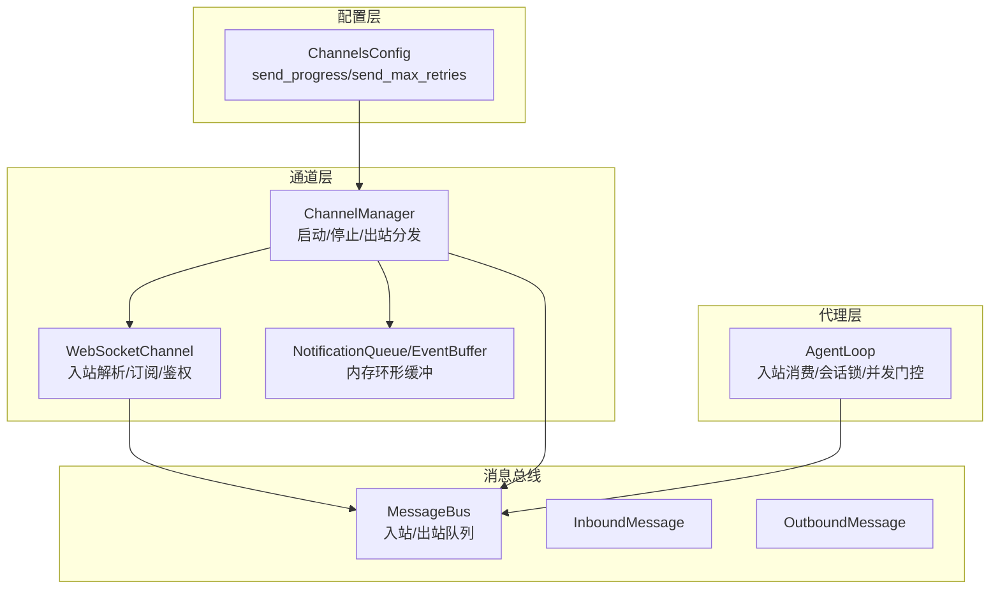
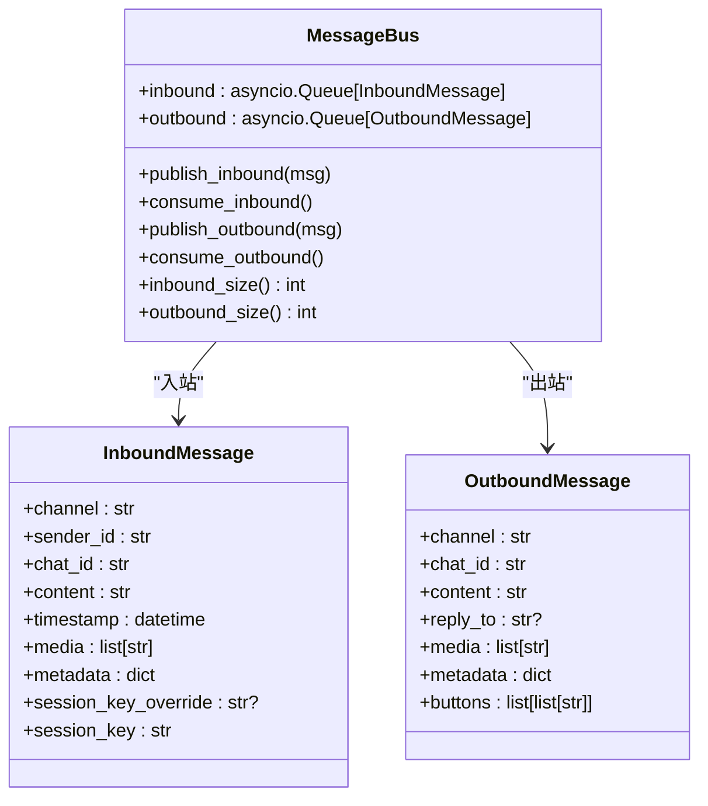
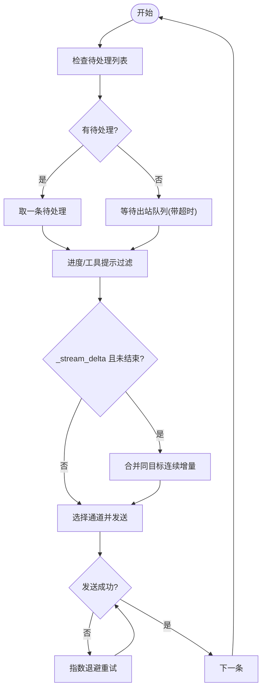
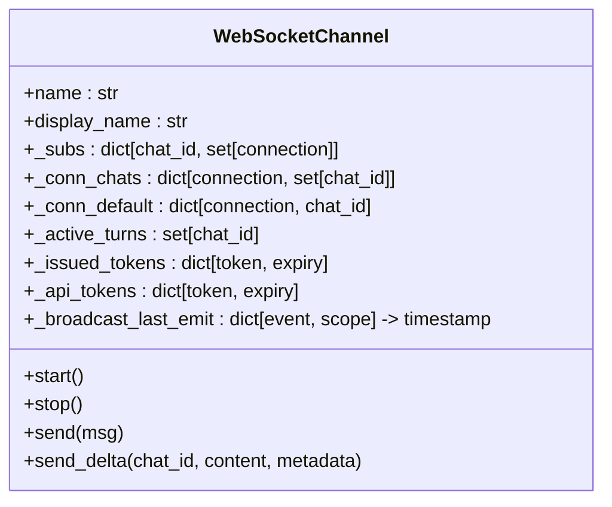
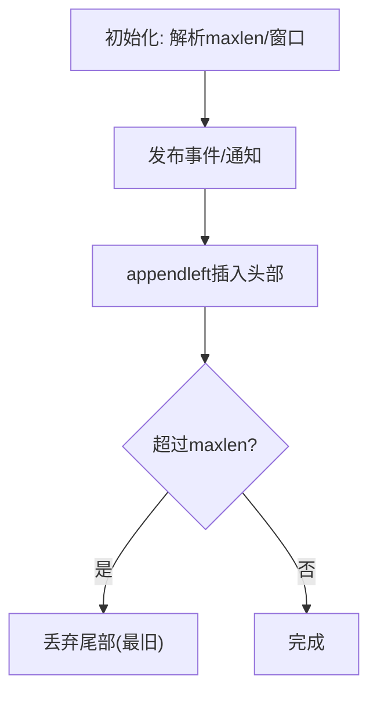
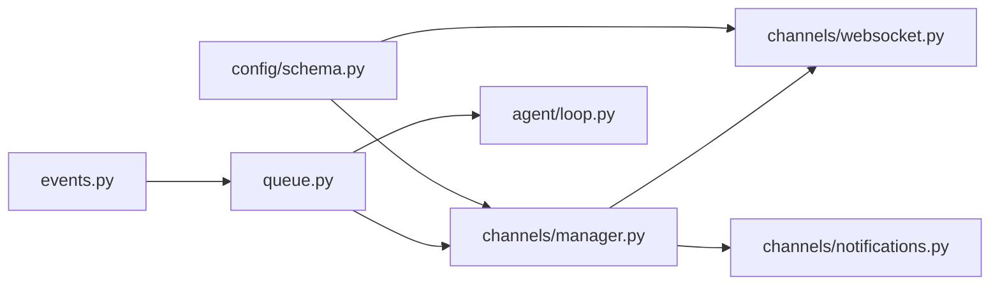

# 队列系统

<cite>
**本文档引用的文件**
- [secbot/bus/queue.py](file://secbot/bus/queue.py)
- [secbot/bus/events.py](file://secbot/bus/events.py)
- [secbot/bus/__init__.py](file://secbot/bus/__init__.py)
- [secbot/channels/manager.py](file://secbot/channels/manager.py)
- [secbot/channels/websocket.py](file://secbot/channels/websocket.py)
- [secbot/agent/loop.py](file://secbot/agent/loop.py)
- [secbot/config/schema.py](file://secbot/config/schema.py)
- [secbot/channels/notifications.py](file://secbot/channels/notifications.py)
</cite>

## 目录
1. [简介](#简介)
2. [项目结构](#项目结构)
3. [核心组件](#核心组件)
4. [架构总览](#架构总览)
5. [详细组件分析](#详细组件分析)
6. [依赖分析](#依赖分析)
7. [性能考虑](#性能考虑)
8. [故障排查指南](#故障排查指南)
9. [结论](#结论)
10. [附录](#附录)

## 简介
本文件针对 VAPT3 的消息队列系统进行深入技术文档化，覆盖以下主题：
- 消息队列实现原理：队列结构、消息存储、优先级管理、持久化策略
- 并发控制机制：生产者-消费者模式、锁机制、背压处理
- 性能优化策略：批量处理、缓存机制、内存管理
- 异步处理模式与错误恢复机制
- 配置选项与监控指标（队列长度、处理延迟、吞吐量等）

该系统以异步队列为核心，解耦聊天通道与代理内核，通过消息总线在入站/出站方向传递消息，并在代理循环中实现会话级串行、跨会话并发的调度策略。

## 项目结构
消息队列相关的核心模块分布如下：
- 总线层：定义消息类型与消息总线接口
- 通道层：负责消息的发送与接收，维护出站分发器与重试策略
- 代理层：消费入站消息，按会话串行处理，生成出站消息
- 配置层：提供通道与发送行为的配置项
- 通知与事件：提供内存环形缓冲区用于活动事件与通知流



**图表来源**
- [secbot/bus/queue.py:8-44](file://secbot/bus/queue.py#L8-L44)
- [secbot/bus/events.py:8-39](file://secbot/bus/events.py#L8-L39)
- [secbot/channels/manager.py:43-443](file://secbot/channels/manager.py#L43-L443)
- [secbot/channels/websocket.py:474-548](file://secbot/channels/websocket.py#L474-L548)
- [secbot/agent/loop.py:788-979](file://secbot/agent/loop.py#L788-L979)
- [secbot/config/schema.py:18-33](file://secbot/config/schema.py#L18-L33)

**章节来源**
- [secbot/bus/queue.py:1-45](file://secbot/bus/queue.py#L1-L45)
- [secbot/bus/events.py:1-39](file://secbot/bus/events.py#L1-L39)
- [secbot/bus/__init__.py:1-7](file://secbot/bus/__init__.py#L1-L7)

## 核心组件
- MessageBus：提供入站/出站异步队列，支持查询队列长度，作为通道与代理之间的解耦桥梁
- InboundMessage/OutboundMessage：消息载体，包含渠道、会话键、内容、元数据等字段
- ChannelManager：统一管理通道生命周期，启动出站分发任务；实现出站消息的去重、进度控制、流式合并与指数退避重试
- WebSocketChannel：作为 WebSocket 服务端，负责握手、鉴权、订阅管理、媒体签名、REST 接口与广播节流
- AgentLoop：消费入站消息，按会话串行处理，跨会话并发执行；支持流式输出、取消恢复、标题生成与会话更新
- 配置 ChannelsConfig：控制是否发送进度、工具提示、最大重试次数、转录提供商与语言等

**章节来源**
- [secbot/bus/queue.py:8-44](file://secbot/bus/queue.py#L8-L44)
- [secbot/bus/events.py:8-39](file://secbot/bus/events.py#L8-L39)
- [secbot/channels/manager.py:278-424](file://secbot/channels/manager.py#L278-L424)
- [secbot/channels/websocket.py:474-548](file://secbot/channels/websocket.py#L474-L548)
- [secbot/agent/loop.py:788-979](file://secbot/agent/loop.py#L788-L979)
- [secbot/config/schema.py:18-33](file://secbot/config/schema.py#L18-L33)

## 架构总览
消息从各聊天通道进入入站队列，代理循环按会话串行消费并处理，必要时生成流式片段，最终写入出站队列。出站分发器从出站队列取出消息，进行流式合并、重复抑制、进度过滤与重试，再调用具体通道发送。

```mermaid
sequenceDiagram
participant Ch as "通道(如WebSocket)"
participant Bus as "MessageBus"
participant Loop as "AgentLoop"
participant Disp as "ChannelManager._dispatch_outbound"
participant Chan as "具体通道"
Ch->>Bus : 入站消息(InboundMessage)
Loop->>Bus : 消费入站消息
Loop->>Loop : 会话串行处理/流式回调
Loop->>Bus : 发布出站消息(OutboundMessage)
Disp->>Bus : 消费出站消息
Disp->>Disp : 合并流式片段/去重/进度过滤
Disp->>Chan : 发送消息(带重试)
Chan-->>Disp : 成功/失败
Disp-->>Bus : 继续下一条
```

**图表来源**
- [secbot/bus/queue.py:20-34](file://secbot/bus/queue.py#L20-L34)
- [secbot/agent/loop.py:863-979](file://secbot/agent/loop.py#L863-L979)
- [secbot/channels/manager.py:278-424](file://secbot/channels/manager.py#L278-L424)

## 详细组件分析

### 消息总线与消息模型
- 入站队列：保存来自通道的消息，支持阻塞获取与非阻塞检查
- 出站队列：保存代理生成的响应，供通道层统一发送
- 队列长度：提供入站/出站队列长度属性，便于监控



**图表来源**
- [secbot/bus/queue.py:8-44](file://secbot/bus/queue.py#L8-L44)
- [secbot/bus/events.py:8-39](file://secbot/bus/events.py#L8-L39)

**章节来源**
- [secbot/bus/queue.py:8-44](file://secbot/bus/queue.py#L8-L44)
- [secbot/bus/events.py:8-39](file://secbot/bus/events.py#L8-L39)

### 通道管理与出站分发
- 出站分发器：周期性等待出站消息，支持超时退出；对流式增量消息进行同目标合并，减少 API 调用频率
- 去重与进度控制：根据指纹与来源消息 ID 抑制重复；根据通道配置决定是否发送进度或工具提示
- 指数退避重试：对发送失败进行最多 N 次重试，间隔逐步增长
- 通道选择：根据消息中的 channel 字段路由到对应通道实例



**图表来源**
- [secbot/channels/manager.py:278-424](file://secbot/channels/manager.py#L278-L424)

**章节来源**
- [secbot/channels/manager.py:278-424](file://secbot/channels/manager.py#L278-L424)

### 代理循环与并发控制
- 会话串行：同一会话内的消息按顺序处理，避免交叉污染
- 跨会话并发：不同会话可并行处理，提升整体吞吐
- 会话锁与并发门控：使用 asyncio.Lock 保证单会话串行；通过门控上下文限制并发度
- 流式输出：支持将长文本拆分为多个增量片段，逐段推送
- 取消与恢复：支持 /stop 取消当前任务，保留部分上下文并持久化检查点

```mermaid
sequenceDiagram
participant Bus as "MessageBus"
participant Loop as "AgentLoop"
participant Lock as "会话锁"
participant Gate as "并发门控"
participant Pending as "挂起队列(最大20)"
Loop->>Bus : 等待入站(带超时)
Bus-->>Loop : InboundMessage
Loop->>Loop : 计算有效会话键
alt 存在挂起队列
Loop->>Pending : 放入挂起队列(满则告警)
Loop-->>Loop : 继续下一条
else 创建新任务
Loop->>Lock : 获取会话锁
Loop->>Gate : 进入并发门控
Loop->>Loop : 处理消息(可能触发流式回调)
Loop->>Bus : 发布出站消息
Gate-->>Loop : 释放门控
Lock-->>Loop : 释放锁
end
```

**图表来源**
- [secbot/agent/loop.py:788-979](file://secbot/agent/loop.py#L788-L979)

**章节来源**
- [secbot/agent/loop.py:788-979](file://secbot/agent/loop.py#L788-L979)

### WebSocket 通道与广播节流
- 握手与鉴权：支持静态令牌、签发令牌与本地回环白名单
- 订阅管理：按 chat_id 维护连接集合，支持默认 chat_id
- 广播节流：每事件/每作用域最小间隔 1 秒，避免 UI 刷屏
- REST 接口：提供会话列表、设置、命令、仪表盘聚合、通知中心、活动事件流等



**图表来源**
- [secbot/channels/websocket.py:474-548](file://secbot/channels/websocket.py#L474-L548)

**章节来源**
- [secbot/channels/websocket.py:474-548](file://secbot/channels/websocket.py#L474-L548)

### 通知与活动事件缓冲
- 内存环形缓冲：基于双端队列，支持随机访问标记已读，新事件插入头部，溢出丢弃最旧项
- 环境变量配置：可通过环境变量调整缓冲大小与事件窗口
- 单例访问：提供进程内单例，测试可用重置函数



**图表来源**
- [secbot/channels/notifications.py:127-207](file://secbot/channels/notifications.py#L127-L207)

**章节来源**
- [secbot/channels/notifications.py:1-385](file://secbot/channels/notifications.py#L1-L385)

## 依赖分析
- 模块内聚与耦合
  - MessageBus 仅依赖事件类型，低耦合
  - ChannelManager 依赖 MessageBus 与通道基类，负责出站分发与重试
  - AgentLoop 依赖 MessageBus 与会话/工具链，负责入站消费与会话串行
  - WebSocketChannel 依赖 MessageBus 与通道基类，负责入站解析与出站发送
- 外部依赖
  - asyncio：异步队列、锁、任务与超时
  - loguru：日志记录
  - websockets：WebSocket 服务端
  - pydantic：配置校验与序列化



**图表来源**
- [secbot/bus/events.py:1-39](file://secbot/bus/events.py#L1-L39)
- [secbot/bus/queue.py:1-45](file://secbot/bus/queue.py#L1-L45)
- [secbot/channels/manager.py:1-443](file://secbot/channels/manager.py#L1-L443)
- [secbot/channels/websocket.py:1-2376](file://secbot/channels/websocket.py#L1-L2376)
- [secbot/agent/loop.py:1-1528](file://secbot/agent/loop.py#L1-L1528)
- [secbot/config/schema.py:1-376](file://secbot/config/schema.py#L1-L376)
- [secbot/channels/notifications.py:1-385](file://secbot/channels/notifications.py#L1-L385)

**章节来源**
- [secbot/bus/queue.py:1-45](file://secbot/bus/queue.py#L1-L45)
- [secbot/channels/manager.py:1-443](file://secbot/channels/manager.py#L1-L443)
- [secbot/agent/loop.py:1-1528](file://secbot/agent/loop.py#L1-L1528)
- [secbot/channels/websocket.py:1-2376](file://secbot/channels/websocket.py#L1-L2376)
- [secbot/config/schema.py:1-376](file://secbot/config/schema.py#L1-L376)
- [secbot/channels/notifications.py:1-385](file://secbot/channels/notifications.py#L1-L385)

## 性能考虑
- 批量与合并
  - 出站分发器对同目标的流式增量消息进行合并，降低 API 调用次数与网络开销
  - 合并边界：遇到不同目标、非增量或结束标记时停止合并
- 背压与限流
  - 入站/出站队列采用异步队列，天然具备背压能力
  - WebSocket 广播节流：每事件/每作用域最小间隔 1 秒，避免 UI 刷新过快
  - 会话挂起队列上限：防止同一会话堆积过多消息导致内存膨胀
- 缓存与内存
  - 通知与活动事件缓冲为环形队列，容量受环境变量控制，避免无限增长
  - 代理循环中的会话检查点在取消时持久化，减少重复工作
- 重试与稳定性
  - 出站发送采用指数退避重试，降低瞬时失败对用户体验的影响
  - 进度与工具提示发送可按通道配置开关，平衡实时性与带宽占用

[本节为通用性能讨论，不直接分析具体文件]

## 故障排查指南
- 入站/出站队列积压
  - 使用队列长度属性观察积压趋势，结合代理日志定位瓶颈
  - 关注超时路径与异常捕获，确保循环持续运行
- 出站发送失败
  - 查看重试日志与最大重试次数配置，确认通道可用性
  - 检查通道权限与令牌状态（WebSocket）
- 重复消息与进度风暴
  - 开启/关闭进度与工具提示，或调整通道配置
  - 检查去重指纹逻辑与来源消息 ID
- 取消与恢复
  - 观察取消日志与检查点保存，确认上下文恢复情况

**章节来源**
- [secbot/agent/loop.py:788-979](file://secbot/agent/loop.py#L788-L979)
- [secbot/channels/manager.py:278-424](file://secbot/channels/manager.py#L278-L424)
- [secbot/channels/websocket.py:474-548](file://secbot/channels/websocket.py#L474-L548)

## 结论
VAPT3 的队列系统通过异步消息总线实现了通道与代理的解耦，配合会话级串行与跨会话并发策略，在保证一致性的同时提升了吞吐。出站分发器的流式合并、去重与重试机制进一步增强了稳定性与效率。WebSocket 通道的广播节流与 REST 接口完善了前端交互体验。通过合理的配置与监控，可在高负载场景下保持稳定与可观的性能表现。

[本节为总结性内容，不直接分析具体文件]

## 附录

### 配置选项与监控指标
- 配置项
  - ChannelsConfig：send_progress、send_tool_hints、send_max_retries、transcription_provider、transcription_language
  - WebSocketConfig：host、port、path、token、token_issue_path、token_ttl_s、websocket_requires_token、max_message_bytes、ping_interval_s、ping_timeout_s、ssl_certfile、ssl_keyfile
- 监控指标
  - 队列长度：入站/出站队列长度
  - 处理延迟：从入站到达至出站发送的时间
  - 吞吐量：单位时间内处理的消息数量
  - 重试率：出站发送失败并重试的比例
  - 广播节流：事件广播的最小间隔与触发次数

**章节来源**
- [secbot/config/schema.py:18-33](file://secbot/config/schema.py#L18-L33)
- [secbot/channels/websocket.py:119-195](file://secbot/channels/websocket.py#L119-L195)
- [secbot/channels/manager.py:278-424](file://secbot/channels/manager.py#L278-L424)