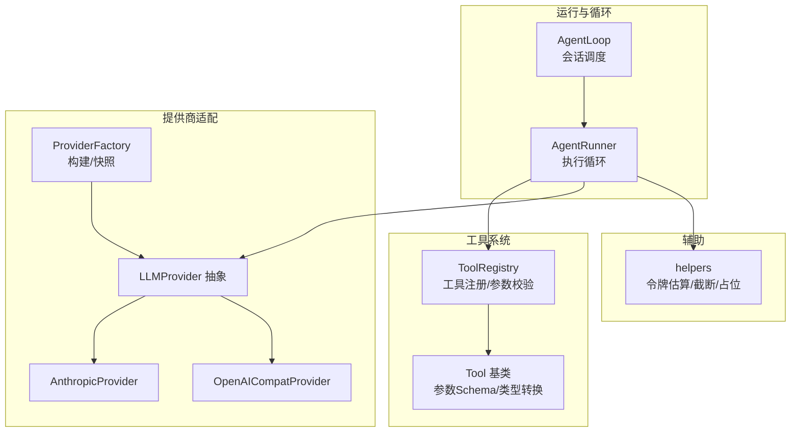
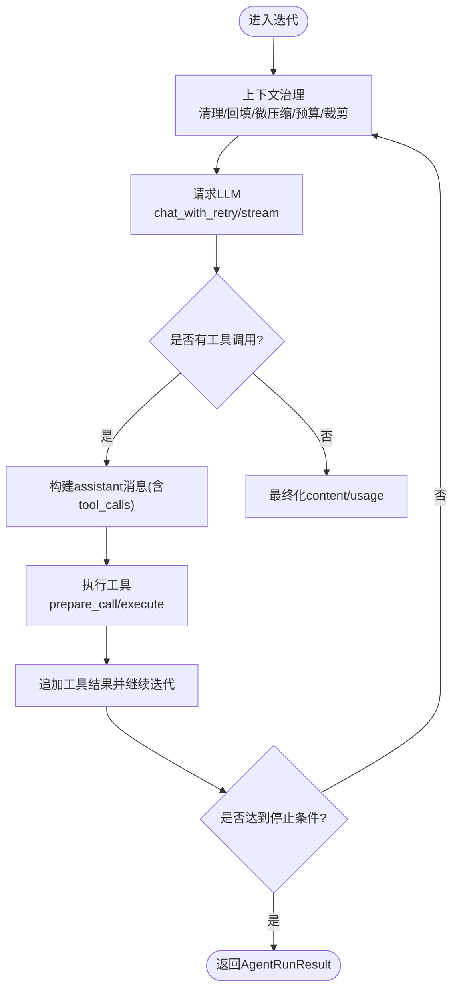
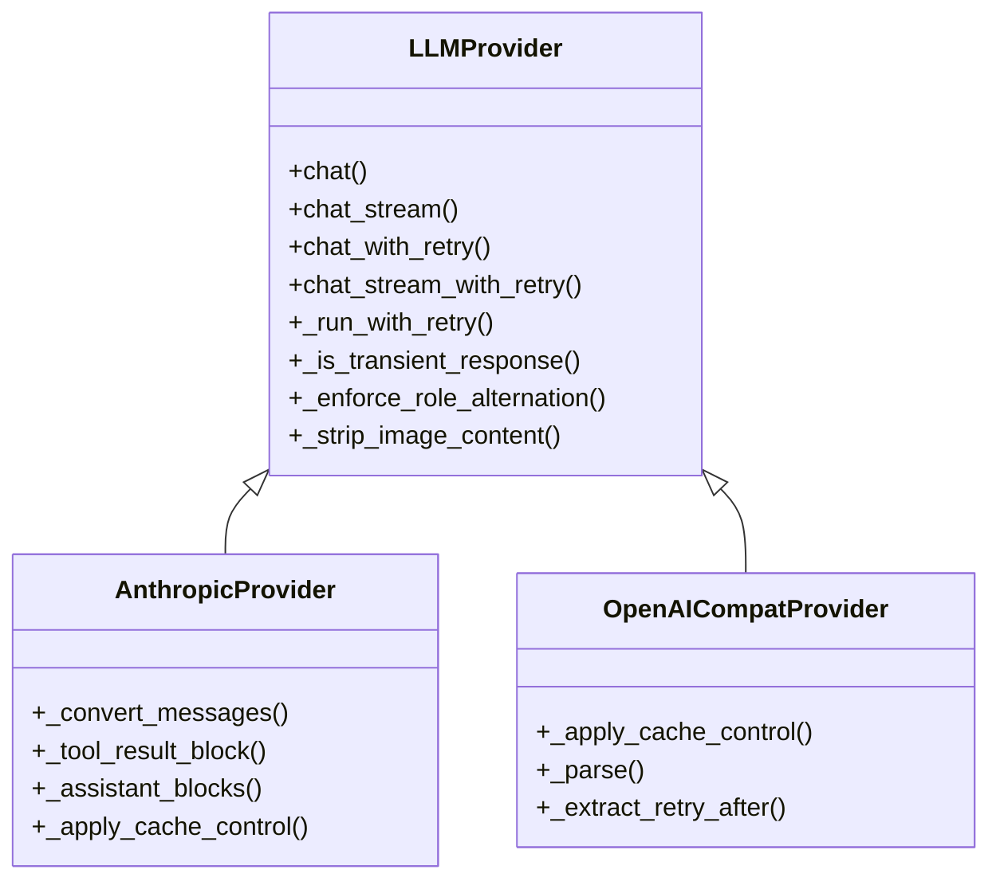
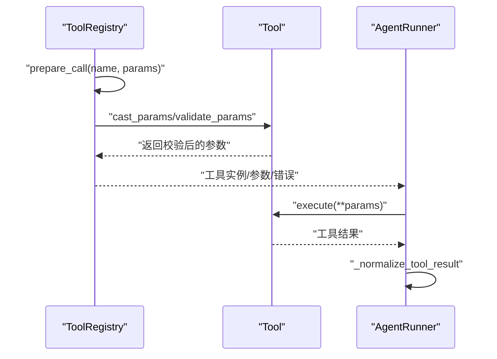
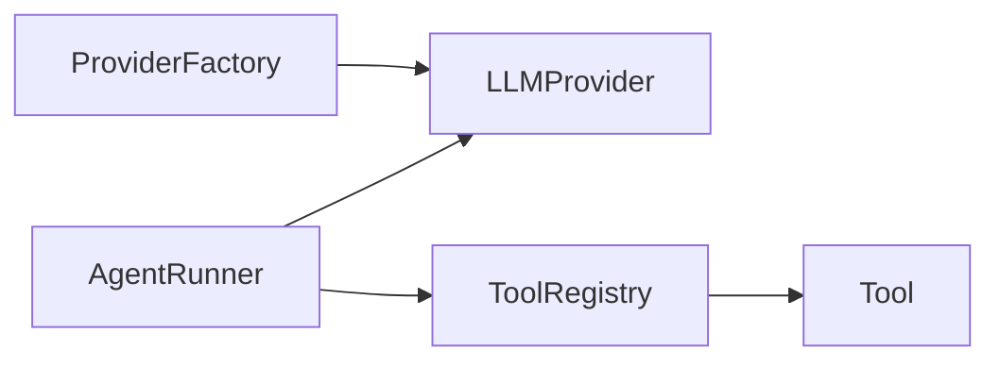

# LLM函数调用机制

<cite>
**本文档引用的文件**
- [runner.py](file://secbot/agent/runner.py)
- [base.py](file://secbot/providers/base.py)
- [factory.py](file://secbot/providers/factory.py)
- [anthropic_provider.py](file://secbot/providers/anthropic_provider.py)
- [openai_compat_provider.py](file://secbot/providers/openai_compat_provider.py)
- [registry.py](file://secbot/agent/tools/registry.py)
- [base.py](file://secbot/agent/tools/base.py)
- [helpers.py](file://secbot/utils/helpers.py)
- [loop.py](file://secbot/agent/loop.py)
- [test_runner.py](file://tests/agent/test_runner.py)
- [test_runner_progress_deltas.py](file://tests/agent/test_runner_progress_deltas.py)
- [test_tool_validation.py](file://tests/tools/test_tool_validation.py)
- [test_tool_registry.py](file://tests/tools/test_tool_registry.py)
- [test_openai_responses.py](file://tests/providers/test_openai_responses.py)
- [test_provider_retry.py](file://tests/providers/test_provider_retry.py)
</cite>

## 目录
1. [引言](#引言)
2. [项目结构](#项目结构)
3. [核心组件](#核心组件)
4. [架构总览](#架构总览)
5. [详细组件分析](#详细组件分析)
6. [依赖分析](#依赖分析)
7. [性能考虑](#性能考虑)
8. [故障排查指南](#故障排查指南)
9. [结论](#结论)
10. [附录](#附录)

## 引言
本文件面向nanobot VAPT3的LLM函数调用机制，系统性阐述动态规划中的函数调用生成、参数绑定与结果解析流程；AgentRunner如何在一次会话中协调LLM请求与工具执行（迭代控制、错误恢复、状态管理）；多AI提供商的适配机制（参数映射、响应处理、错误转换）；以及函数调用的优化策略（上下文压缩、批量处理、缓存）。同时提供配置项与性能调优建议（超时、重试、资源限制），帮助读者在生产环境中稳定、高效地使用函数调用能力。

## 项目结构
围绕LLM函数调用的关键模块分布如下：
- 运行器与循环：AgentRunner负责单次执行循环，AgentLoop负责会话级调度
- 工具体系：ToolRegistry与Tool基类定义工具注册、参数校验与Schema
- 提供商适配：LLMProvider抽象、各厂商实现（Anthropic、OpenAI兼容等）
- 工具与消息辅助：helpers提供令牌估算、内容截断、占位符等



**图表来源**
- [runner.py:234-567](file://secbot/agent/runner.py#L234-L567)
- [loop.py:639-665](file://secbot/agent/loop.py#L639-L665)
- [registry.py:48-126](file://secbot/agent/tools/registry.py#L48-L126)
- [base.py:117-280](file://secbot/agent/tools/base.py#L117-L280)
- [base.py:92-792](file://secbot/providers/base.py#L92-L792)
- [anthropic_provider.py:24-200](file://secbot/providers/anthropic_provider.py#L24-L200)
- [openai_compat_provider.py:1-200](file://secbot/providers/openai_compat_provider.py#L1-L200)
- [factory.py:21-92](file://secbot/providers/factory.py#L21-L92)
- [helpers.py:1-200](file://secbot/utils/helpers.py#L1-L200)

**章节来源**
- [runner.py:234-567](file://secbot/agent/runner.py#L234-L567)
- [loop.py:639-665](file://secbot/agent/loop.py#L639-L665)
- [registry.py:48-126](file://secbot/agent/tools/registry.py#L48-L126)
- [base.py:92-792](file://secbot/providers/base.py#L92-L792)

## 核心组件
- AgentRunner：统一的工具型LLM执行循环，负责上下文治理、LLM请求、工具执行、错误恢复与状态管理
- LLMProvider：LLM抽象接口，定义聊天、流式聊天、带重试的调用、错误分类与重试策略
- ToolRegistry：工具注册中心，提供工具Schema、参数类型转换与校验、准备调用
- ProviderFactory：根据配置选择并构建具体提供商实例，支持快照与签名
- 辅助工具：helpers提供令牌估算、历史裁剪、占位符替换等

**章节来源**
- [runner.py:100-1203](file://secbot/agent/runner.py#L100-L1203)
- [base.py:92-792](file://secbot/providers/base.py#L92-L792)
- [registry.py:8-126](file://secbot/agent/tools/registry.py#L8-L126)
- [factory.py:21-130](file://secbot/providers/factory.py#L21-L130)
- [helpers.py:1-200](file://secbot/utils/helpers.py#L1-L200)

## 架构总览
下图展示从AgentLoop到AgentRunner，再到LLMProvider与工具系统的端到端调用链路，以及函数调用的生成、绑定与解析过程。

```mermaid
sequenceDiagram
participant Loop as "AgentLoop"
participant Runner as "AgentRunner"
participant Prov as "LLMProvider"
participant Tools as "ToolRegistry"
participant Tool as "具体工具"
Loop->>Runner : "run(AgentRunSpec)"
Runner->>Runner : "上下文治理/裁剪/预算"
Runner->>Prov : "chat_with_retry / chat_stream_with_retry"
Prov-->>Runner : "LLMResponse(content, tool_calls, usage)"
alt "需要执行工具"
Runner->>Runner : "构建assistant消息(含tool_calls)"
Runner->>Tools : "prepare_call/execute"
Tools->>Tool : "cast_params/validate_params"
Tool-->>Tools : "执行结果"
Tools-->>Runner : "标准化工具结果"
Runner->>Prov : "再次请求(携带tool结果)"
Prov-->>Runner : "最终content/usage"
else "无需工具"
Runner->>Runner : "写入最终assistant消息"
end
Runner-->>Loop : "AgentRunResult"
```

**图表来源**
- [loop.py:639-665](file://secbot/agent/loop.py#L639-L665)
- [runner.py:234-567](file://secbot/agent/runner.py#L234-L567)
- [base.py:563-602](file://secbot/providers/base.py#L563-L602)
- [registry.py:73-126](file://secbot/agent/tools/registry.py#L73-L126)
- [base.py:170-244](file://secbot/agent/tools/base.py#L170-L244)

## 详细组件分析

### AgentRunner：函数调用执行循环
- 上下文治理
  - 清理孤儿工具结果、回填缺失结果、微压缩、应用工具结果预算、按上下文窗口裁剪
  - 通过令牌估算与安全缓冲确保不超过context_window_tokens
- LLM请求与流式处理
  - 支持标准聊天与流式聊天；支持进度增量回调（非流式通道）
  - 超时控制：可由配置或环境变量设定，避免会话阻塞
- 工具执行与批处理
  - 将tool_calls分批执行，支持并发安全工具并行
  - 对ask_user进行特殊处理（中断用户交互）
- 错误恢复与状态管理
  - 空响应重试、长度截断恢复、模型错误占位、最大迭代终止
  - 注入消息（injections）的合并与周期控制，防止无限注入
- 结果归档
  - 返回最终content、消息历史、工具使用统计、停止原因与错误信息



**图表来源**
- [runner.py:251-532](file://secbot/agent/runner.py#L251-L532)
- [runner.py:1110-1177](file://secbot/agent/runner.py#L1110-L1177)
- [runner.py:1179-1202](file://secbot/agent/runner.py#L1179-L1202)

**章节来源**
- [runner.py:234-567](file://secbot/agent/runner.py#L234-L567)
- [runner.py:1110-1202](file://secbot/agent/runner.py#L1110-L1202)

### LLMProvider与AI提供商适配
- LLMProvider抽象
  - 定义chat/chat_stream、带重试的封装chat_with_retry/chat_stream_with_retry
  - 统一错误分类与重试策略（瞬态/非瞬态、429语义、重试后延、心跳节拍）
  - 角色交替强制（_enforce_role_alternation）、图像内容剥离（_strip_image_content）
- AnthropicProvider
  - 使用原生SDK；消息格式转换（OpenAI→Messages API）、扩展思考块、工具结果块
  - 支持提示缓存标记（_apply_cache_control）
- OpenAICompatProvider
  - 兼容OpenAI生态（含OpenRouter、本地/私有部署）
  - 思维模式映射、超时控制、工具定义转换、响应解析与错误元数据提取



**图表来源**
- [base.py:92-792](file://secbot/providers/base.py#L92-L792)
- [anthropic_provider.py:24-200](file://secbot/providers/anthropic_provider.py#L24-L200)
- [openai_compat_provider.py:1-200](file://secbot/providers/openai_compat_provider.py#L1-L200)

**章节来源**
- [base.py:92-792](file://secbot/providers/base.py#L92-L792)
- [anthropic_provider.py:24-200](file://secbot/providers/anthropic_provider.py#L24-L200)
- [openai_compat_provider.py:1-200](file://secbot/providers/openai_compat_provider.py#L1-L200)

### 工具系统：定义生成、参数绑定与结果解析
- 工具定义生成
  - ToolRegistry维护工具Schema，按内置与MCP两类排序并缓存，保证稳定提示
  - Tool.to_schema输出OpenAI风格function schema
- 参数绑定与校验
  - ToolRegistry.prepare_call执行名称解析、类型转换与Schema校验
  - Tool.cast_params与Tool.validate_params保障参数类型安全
- 结果解析与持久化
  - AgentRunner._normalize_tool_result对结果进行非空化、持久化、截断
  - 工具结果以“tool”角色消息加入历史



**图表来源**
- [registry.py:73-126](file://secbot/agent/tools/registry.py#L73-L126)
- [base.py:170-244](file://secbot/agent/tools/base.py#L170-L244)
- [runner.py:969-994](file://secbot/agent/runner.py#L969-L994)

**章节来源**
- [registry.py:48-126](file://secbot/agent/tools/registry.py#L48-L126)
- [base.py:117-280](file://secbot/agent/tools/base.py#L117-L280)
- [runner.py:969-994](file://secbot/agent/runner.py#L969-L994)

### AgentLoop与AgentRunner协作
- AgentLoop负责会话级调度，构造AgentRunSpec并调用AgentRunner.run
- Runner返回usage、stop_reason、messages等，Loop据此更新状态并决定后续动作
- 注入消息（injections）在每轮迭代前后进行合并与节制，避免无限注入

**章节来源**
- [loop.py:639-665](file://secbot/agent/loop.py#L639-L665)
- [runner.py:234-567](file://secbot/agent/runner.py#L234-L567)

## 依赖分析
- 组件耦合
  - AgentRunner强依赖LLMProvider接口与ToolRegistry；弱依赖hooks与回调
  - ToolRegistry依赖具体Tool实现；Tool依赖Schema定义
  - ProviderFactory解耦配置与提供商实例创建
- 外部依赖
  - AnthropicProvider依赖官方Async SDK
  - OpenAICompatProvider依赖openai或langfuse追踪（可选）



**图表来源**
- [runner.py:100-1203](file://secbot/agent/runner.py#L100-L1203)
- [registry.py:8-126](file://secbot/agent/tools/registry.py#L8-L126)
- [factory.py:21-92](file://secbot/providers/factory.py#L21-L92)

**章节来源**
- [runner.py:100-1203](file://secbot/agent/runner.py#L100-L1203)
- [registry.py:8-126](file://secbot/agent/tools/registry.py#L8-L126)
- [factory.py:21-92](file://secbot/providers/factory.py#L21-L92)

## 性能考虑
- 上下文压缩
  - 令牌估算与安全缓冲裁剪历史，保留最近用户消息与合法起始点
  - 微压缩：对可压缩工具结果进行摘要替代，减少冗余
- 批量与并发
  - 并发安全工具并行执行，提升吞吐；独占工具强制串行
- 缓存与提示优化
  - 部分提供商支持提示缓存标记，降低重复计算成本
- 超时与重试
  - LLM请求超时默认有限值，避免会话阻塞；重试策略区分瞬态/非瞬态错误
- 资源限制
  - 工具结果字符上限、最大迭代次数、注入消息节流

**章节来源**
- [runner.py:1064-1177](file://secbot/agent/runner.py#L1064-L1177)
- [runner.py:1179-1202](file://secbot/agent/runner.py#L1179-L1202)
- [anthropic_provider.py:378-410](file://secbot/providers/anthropic_provider.py#L378-L410)
- [openai_compat_provider.py:332-364](file://secbot/providers/openai_compat_provider.py#L332-L364)
- [base.py:97-162](file://secbot/providers/base.py#L97-L162)

## 故障排查指南
- 函数调用被忽略
  - 当finish_reason非tool_calls/stop时，Runner会忽略工具调用
- 工具执行失败
  - 参数校验失败、工具抛出异常、SSRF/workspace边界违规
  - Runner对安全边界失败进行分类处理，必要时转为可恢复错误
- 流式与进度回调
  - 非流式通道可启用进度增量回调；测试覆盖了禁用与默认行为
- 重试与超时
  - Provider统一重试策略；Runner对超时返回错误响应并标注error_kind
- 参数类型转换
  - 字符串到整数/浮点/布尔的自动转换，数组元素类型转换

**章节来源**
- [base.py:66-78](file://secbot/providers/base.py#L66-L78)
- [runner.py:847-928](file://secbot/agent/runner.py#L847-L928)
- [test_runner_progress_deltas.py:14-79](file://tests/agent/test_runner_progress_deltas.py#L14-L79)
- [test_openai_responses.py:255-290](file://tests/providers/test_openai_responses.py#L255-L290)
- [test_provider_retry.py:284-308](file://tests/providers/test_provider_retry.py#L284-L308)
- [test_tool_validation.py:371-417](file://tests/tools/test_tool_validation.py#L371-L417)

## 结论
nanobot通过AgentRunner实现了稳定的函数调用循环，结合LLMProvider抽象与多提供商适配，提供了高可用的工具执行路径。配合上下文压缩、并发批处理与缓存优化，可在复杂VAPT任务中保持性能与可靠性。完善的错误分类与重试策略进一步增强了系统鲁棒性。

## 附录

### 配置选项与性能调优建议
- LLM超时
  - Runner层默认有限超时，可通过配置或环境变量调整；0表示禁用
- 重试策略
  - Provider统一瞬态/非瞬态错误分类；支持从响应头/文本提取retry-after
- 并发与批处理
  - 启用concurrent_tools并合理设计工具的read_only/exclusive属性
- 上下文窗口
  - 设置context_window_tokens与context_block_limit，结合安全缓冲裁剪历史
- 工具结果字符上限
  - 控制max_tool_result_chars，避免过长结果影响性能
- 注入消息节流
  - 限制每轮注入数量与周期，防止无限注入导致会话膨胀

**章节来源**
- [runner.py:591-665](file://secbot/agent/runner.py#L591-L665)
- [base.py:699-786](file://secbot/providers/base.py#L699-L786)
- [runner.py:1179-1202](file://secbot/agent/runner.py#L1179-L1202)