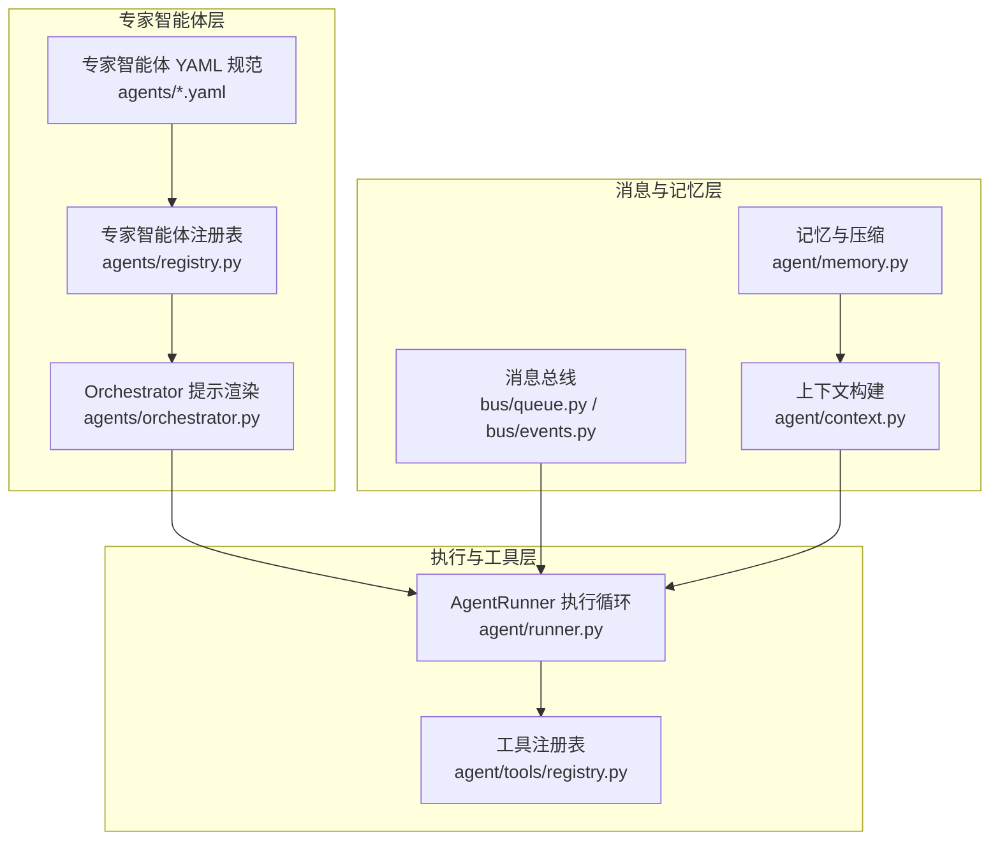
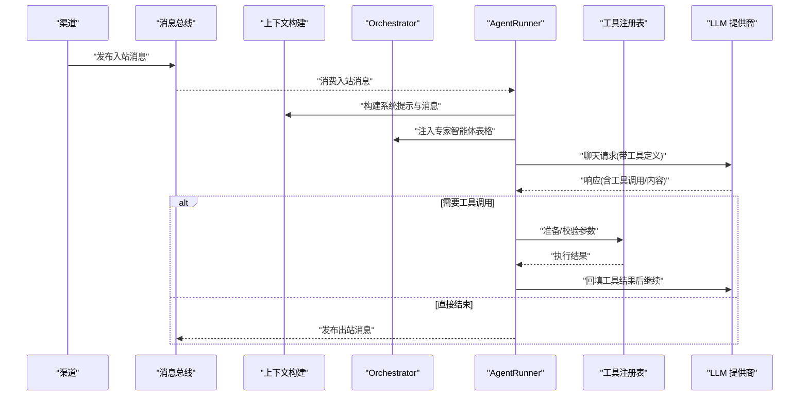
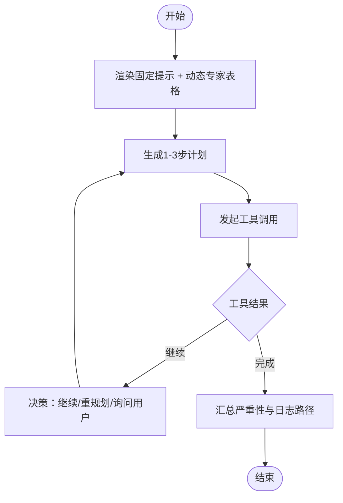
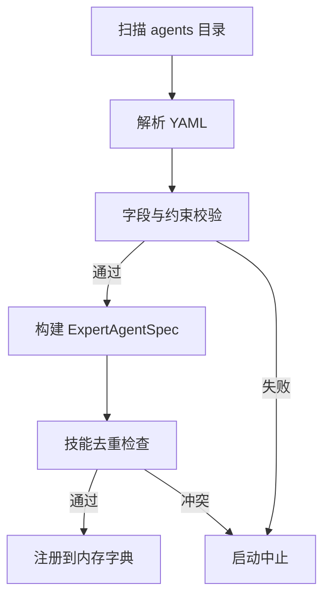
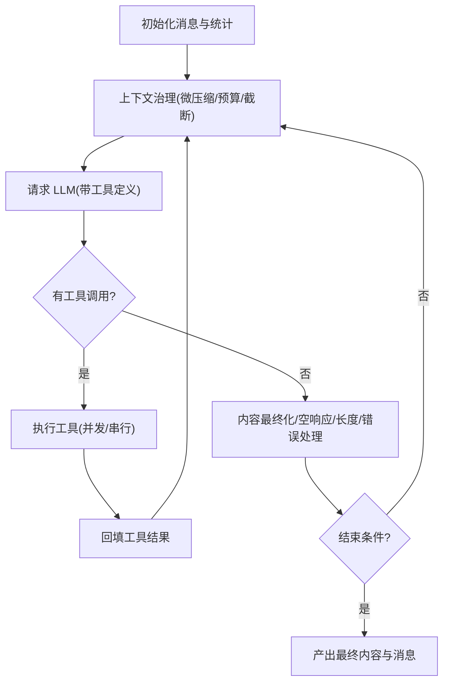
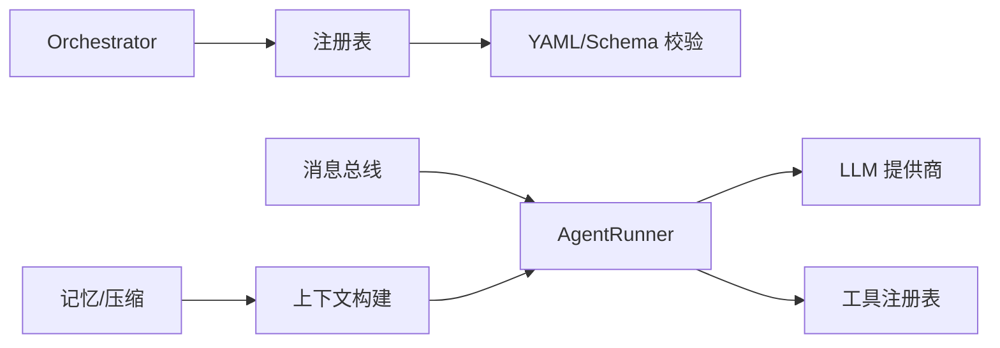

# 专家智能体系统

<cite>
**本文引用的文件**
- [secbot/agents/orchestrator.py](file://secbot/agents/orchestrator.py)
- [secbot/agents/registry.py](file://secbot/agents/registry.py)
- [secbot/agents/asset_discovery.yaml](file://secbot/agents/asset_discovery.yaml)
- [secbot/agents/port_scan.yaml](file://secbot/agents/port_scan.yaml)
- [secbot/agents/vuln_scan.yaml](file://secbot/agents/vuln_scan.yaml)
- [secbot/agents/report.yaml](file://secbot/agents/report.yaml)
- [secbot/agents/weak_password.yaml](file://secbot/agents/weak_password.yaml)
- [secbot/agent/tools/registry.py](file://secbot/agent/tools/registry.py)
- [secbot/bus/events.py](file://secbot/bus/events.py)
- [secbot/bus/queue.py](file://secbot/bus/queue.py)
- [secbot/agent/context.py](file://secbot/agent/context.py)
- [secbot/agent/memory.py](file://secbot/agent/memory.py)
- [secbot/agent/runner.py](file://secbot/agent/runner.py)
- [secbot/skills/metadata.py](file://secbot/skills/metadata.py)
- [secbot/skills/types.py](file://secbot/skills/types.py)
</cite>

## 目录
1. [引言](#引言)
2. [项目结构](#项目结构)
3. [核心组件](#核心组件)
4. [架构总览](#架构总览)
5. [详细组件分析](#详细组件分析)
6. [依赖分析](#依赖分析)
7. [性能考虑](#性能考虑)
8. [故障排查指南](#故障排查指南)
9. [结论](#结论)
10. [附录：专家智能体开发最佳实践](#附录专家智能体开发最佳实践)

## 引言
本文件面向 nanobot VAPT3 的专家智能体系统，系统性梳理专家智能体的设计理念、生命周期、触发机制与任务编排策略；深入解析 Orchestrator 调度器的任务规划、资源分配与执行监控；阐明专家智能体的注册与发现机制（配置文件格式、元数据管理与动态加载）；说明智能体间通信协议与协作模式（消息传递、状态同步与冲突解决）；并提供专家智能体开发的最佳实践与示例路径，帮助读者快速创建可复用的自定义专家智能体。

## 项目结构
专家智能体系统围绕“专家智能体注册表 + Orchestrator 提示渲染 + 执行循环 + 工具注册表 + 消息总线 + 记忆与上下文”展开，形成清晰的分层与职责边界：
- 专家智能体注册与规范：通过 YAML 描述专家智能体的能力、输入输出与约束，由注册表进行校验与工具表面生成。
- Orchestrator：根据注册表动态生成系统提示，锁定规则与工作风格，驱动多智能体协同。
- 执行循环：统一的工具调用循环，负责请求模型、调度工具、处理结果、注入中间态消息与错误恢复。
- 工具注册表：集中管理工具定义与执行，支持参数校验、类型转换与缓存优化。
- 消息总线：异步解耦通道与核心，实现入站/出站消息队列化处理。
- 记忆与上下文：构建系统提示、历史会话压缩、运行时上下文注入与会话摘要注入。

图表来源
- [secbot/agents/orchestrator.py:52-69](file://secbot/agents/orchestrator.py#L52-L69)
- [secbot/agents/registry.py:99-144](file://secbot/agents/registry.py#L99-L144)
- [secbot/agent/runner.py:234-567](file://secbot/agent/runner.py#L234-L567)
- [secbot/agent/tools/registry.py:48-71](file://secbot/agent/tools/registry.py#L48-L71)
- [secbot/bus/queue.py:8-34](file://secbot/bus/queue.py#L8-L34)
- [secbot/agent/context.py:32-67](file://secbot/agent/context.py#L32-L67)
- [secbot/agent/memory.py:434-488](file://secbot/agent/memory.py#L434-L488)

章节来源
- [secbot/agents/orchestrator.py:1-70](file://secbot/agents/orchestrator.py#L1-L70)
- [secbot/agents/registry.py:1-248](file://secbot/agents/registry.py#L1-L248)
- [secbot/agent/runner.py:1-800](file://secbot/agent/runner.py#L1-L800)
- [secbot/agent/tools/registry.py:1-126](file://secbot/agent/tools/registry.py#L1-L126)
- [secbot/bus/queue.py:1-45](file://secbot/bus/queue.py#L1-L45)
- [secbot/agent/context.py:1-215](file://secbot/agent/context.py#L1-L215)
- [secbot/agent/memory.py:1-800](file://secbot/agent/memory.py#L1-L800)

## 核心组件
- 专家智能体注册表与规范
  - 通过 YAML 定义专家智能体的名称、显示名、描述、系统提示文件、作用域技能集合、输入输出 JSON Schema、模型参数、最大迭代次数与是否输出计划等。
  - 注册表负责加载、校验与去重，确保技能不被多个智能体共享，保证职责单一。
- Orchestrator 提示渲染
  - 固定四段式系统提示：角色、硬规则、可用专家智能体表格、工作风格；其中“可用专家智能体表格”来自注册表动态生成。
- AgentRunner 执行循环
  - 统一的 LLM 请求与工具调用循环，支持流式输出、长度截断恢复、空响应重试、工具结果预算与历史压缩、注入回调等。
- 工具注册表
  - 动态注册/注销工具，按稳定顺序缓存工具定义，支持参数类型转换与校验、错误提示与异常包装。
- 消息总线
  - 入站/出站队列，解耦渠道与核心，支持媒体内容合并与会话键管理。
- 记忆与上下文
  - 构建系统提示（身份、引导文件、记忆、技能摘要、近期历史），注入运行时上下文，支持历史压缩与会话摘要注入。

章节来源
- [secbot/agents/registry.py:37-92](file://secbot/agents/registry.py#L37-L92)
- [secbot/agents/orchestrator.py:52-69](file://secbot/agents/orchestrator.py#L52-L69)
- [secbot/agent/runner.py:234-567](file://secbot/agent/runner.py#L234-L567)
- [secbot/agent/tools/registry.py:48-126](file://secbot/agent/tools/registry.py#L48-L126)
- [secbot/bus/queue.py:8-45](file://secbot/bus/queue.py#L8-L45)
- [secbot/agent/context.py:32-215](file://secbot/agent/context.py#L32-L215)
- [secbot/agent/memory.py:434-743](file://secbot/agent/memory.py#L434-L743)

## 架构总览
专家智能体系统采用“提示驱动 + 工具调用 + 循环编排”的模式：
- 启动阶段：加载技能元数据与专家智能体 YAML，构建注册表；渲染 Orchestrator 系统提示。
- 运行阶段：消息总线接收入站消息，上下文构建器组装系统提示与消息列表，AgentRunner 发起 LLM 请求；当返回工具调用时，执行工具并将结果回填到消息列表；循环直至结束条件（完成/超限/错误/用户介入）。
- 记忆与压缩：在每次迭代前后对历史进行治理与压缩，避免超出上下文窗口；Dream 两阶段处理器用于长期记忆的分析与编辑。

图表来源
- [secbot/bus/queue.py:20-34](file://secbot/bus/queue.py#L20-L34)
- [secbot/agent/context.py:133-165](file://secbot/agent/context.py#L133-L165)
- [secbot/agents/orchestrator.py:52-69](file://secbot/agents/orchestrator.py#L52-L69)
- [secbot/agent/runner.py:278-389](file://secbot/agent/runner.py#L278-L389)
- [secbot/agent/tools/registry.py:73-98](file://secbot/agent/tools/registry.py#L73-L98)

## 详细组件分析

### Orchestrator 调度器
- 设计理念
  - 固定提示的“角色/规则/风格”与动态“可用专家智能体表格”组合，确保行为一致且能力可扩展。
  - 严格遵循任务顺序：资产发现 → 端口扫描 → 漏洞扫描 → 弱口令/渗透 → 报告生成；跳过已提供的数据或显式放弃的阶段。
- 任务规划与执行监控
  - 在每次工具调用前要求计划步骤；工具结果后决定继续/重规划/询问用户；最终汇总严重性统计与原始日志路径。
  - 对高风险技能进行强确认，禁止绕过。
- 关键实现要点
  - 渲染固定段落与动态表格，表格按名称排序以保持提示稳定。
  - 表格内容来源于注册表中的专家智能体规范，包含名称、描述首行与作用域技能集合。

图表来源
- [secbot/agents/orchestrator.py:17-40](file://secbot/agents/orchestrator.py#L17-L40)
- [secbot/agents/orchestrator.py:43-49](file://secbot/agents/orchestrator.py#L43-L49)
- [secbot/agents/orchestrator.py:52-69](file://secbot/agents/orchestrator.py#L52-L69)

章节来源
- [secbot/agents/orchestrator.py:1-70](file://secbot/agents/orchestrator.py#L1-L70)

### 专家智能体注册与发现机制
- 配置文件格式与字段
  - 必填字段：name、display_name、description、system_prompt_file、scoped_skills、input_schema、output_schema。
  - 可选字段：model、max_iterations、emit_plan_steps、source_path。
  - 名称需匹配正则且与文件名一致；scoped_skills 非空且必须属于已注册技能集合。
- 元数据管理与动态加载
  - 注册表加载 agents 目录下所有 YAML，逐项校验；校验失败直接中止启动。
  - 生成 ExpertAgentSpec 并导出工具表面（OpenAI 函数签名），供 Orchestrator 注入提示。
- 冲突与一致性保障
  - 同一技能不能被多个专家智能体声明；重复名称禁止。
  - 输入/输出 Schema 使用 JSON Schema 2020-12 校验。

图表来源
- [secbot/agents/registry.py:99-144](file://secbot/agents/registry.py#L99-L144)
- [secbot/agents/registry.py:147-236](file://secbot/agents/registry.py#L147-L236)

章节来源
- [secbot/agents/registry.py:1-248](file://secbot/agents/registry.py#L1-L248)

### 专家智能体 YAML 示例与规范
- 资产发现、端口扫描、漏洞扫描、弱口令检测、报告生成均以 YAML 声明其作用域技能、输入输出 Schema 与最大迭代次数。
- 这些 YAML 作为注册表的输入，驱动 Orchestrator 的动态提示生成与工具表面暴露。

章节来源
- [secbot/agents/asset_discovery.yaml:1-46](file://secbot/agents/asset_discovery.yaml#L1-L46)
- [secbot/agents/port_scan.yaml:1-50](file://secbot/agents/port_scan.yaml#L1-L50)
- [secbot/agents/vuln_scan.yaml:1-53](file://secbot/agents/vuln_scan.yaml#L1-L53)
- [secbot/agents/weak_password.yaml:1-53](file://secbot/agents/weak_password.yaml#L1-L53)
- [secbot/agents/report.yaml:1-39](file://secbot/agents/report.yaml#L1-L39)

### AgentRunner 执行循环与任务编排
- 生命周期与控制流
  - 初始化消息列表与统计信息；每轮迭代进行上下文治理（去孤儿结果、回填缺失结果、微压缩、工具结果预算、截断历史）。
  - 请求 LLM，若返回工具调用则执行工具，回填结果；否则根据 finish_reason 处理空响应、长度截断、错误等。
  - 支持注入回调，允许在关键节点插入用户消息；支持并发工具批处理。
- 资源分配与监控
  - 通过 AgentRunSpec 控制模型、温度、最大迭代、工具结果字符上限、并发工具开关、上下文窗口等。
  - 使用钩子（AgentHook）在迭代前后注入逻辑，支持流式输出与进度回调。
- 错误处理与恢复
  - 空响应最多重试 N 次；长度截断最多恢复 M 次；模型错误时写占位消息并尝试最终化重试。
  - 对外部查找重复、工作区违规等进行防护与事件记录。

图表来源
- [secbot/agent/runner.py:234-567](file://secbot/agent/runner.py#L234-L567)
- [secbot/agent/runner.py:701-740](file://secbot/agent/runner.py#L701-L740)

章节来源
- [secbot/agent/runner.py:1-800](file://secbot/agent/runner.py#L1-L800)

### 工具注册表与参数校验
- 动态注册与缓存
  - 注册/注销会清空缓存，重新生成稳定排序的工具定义列表；内置工具与 MCP 工具分别排序并拼接。
- 参数准备与校验
  - 支持针对特定工具的参数类型修正与错误提示；未找到工具或参数非法时返回明确错误信息。
- 执行与异常包装
  - 执行过程中捕获异常并返回错误消息，附加提示建议；字符串型错误自动追加提示。

章节来源
- [secbot/agent/tools/registry.py:1-126](file://secbot/agent/tools/registry.py#L1-L126)

### 消息总线与通道解耦
- 结构
  - 入站/出站异步队列；消息类型包含渠道、会话键、文本、媒体、元数据与按钮等。
- 会话键
  - 默认使用“渠道:聊天ID”作为唯一会话标识；支持覆盖以实现线程级会话隔离。
- 解耦效果
  - 渠道与核心通过队列解耦，便于扩展多渠道与异步处理。

章节来源
- [secbot/bus/events.py:8-38](file://secbot/bus/events.py#L8-L38)
- [secbot/bus/queue.py:8-45](file://secbot/bus/queue.py#L8-L45)

### 记忆与上下文构建
- 上下文构建
  - 身份模板、引导文件、长期记忆、活跃技能、技能摘要、近期历史等模块化拼装；运行时上下文注入时间、渠道、会话摘要等元信息。
- 历史压缩与会话摘要
  - Consolidator 基于令牌预算选择用户回合边界进行归档；Dream 两阶段处理器分析并编辑文件。
- 文件 I/O 与 Git 追踪
  - 历史采用 JSONL 追加写入，游标持久化；支持迁移与压缩；部分文件纳入 Git 追踪。

章节来源
- [secbot/agent/context.py:17-215](file://secbot/agent/context.py#L17-L215)
- [secbot/agent/memory.py:434-743](file://secbot/agent/memory.py#L434-L743)

## 依赖分析
- 组件耦合与内聚
  - Orchestrator 仅依赖注册表；注册表仅依赖 YAML/Schema 校验；AgentRunner 依赖 Provider、工具注册表与钩子；消息总线独立于核心逻辑。
- 外部依赖点
  - LLM 提供商接口抽象（聊天/流式/重试）、JSON Schema 校验器、tiktoken 分词器、Git 存储等。
- 潜在循环依赖
  - 当前文件未见循环导入；注册表与执行循环通过接口契约解耦。

图表来源
- [secbot/agents/orchestrator.py:14-14](file://secbot/agents/orchestrator.py#L14-L14)
- [secbot/agents/registry.py:16-18](file://secbot/agents/registry.py#L16-L18)
- [secbot/agent/runner.py:15-28](file://secbot/agent/runner.py#L15-L28)
- [secbot/agent/tools/registry.py:5-5](file://secbot/agent/tools/registry.py#L5-L5)
- [secbot/bus/queue.py:5-5](file://secbot/bus/queue.py#L5-L5)
- [secbot/agent/context.py:11-14](file://secbot/agent/context.py#L11-L14)
- [secbot/agent/memory.py:18-28](file://secbot/agent/memory.py#L18-L28)

章节来源
- [secbot/agents/orchestrator.py:1-70](file://secbot/agents/orchestrator.py#L1-L70)
- [secbot/agents/registry.py:1-248](file://secbot/agents/registry.py#L1-L248)
- [secbot/agent/runner.py:1-800](file://secbot/agent/runner.py#L1-L800)
- [secbot/agent/tools/registry.py:1-126](file://secbot/agent/tools/registry.py#L1-L126)
- [secbot/bus/queue.py:1-45](file://secbot/bus/queue.py#L1-L45)
- [secbot/agent/context.py:1-215](file://secbot/agent/context.py#L1-L215)
- [secbot/agent/memory.py:1-800](file://secbot/agent/memory.py#L1-L800)

## 性能考虑
- 上下文治理
  - 在每轮迭代前进行微压缩与预算控制，避免历史膨胀导致的令牌估算偏差与超窗。
- 工具执行批处理
  - 支持并发工具批处理，减少等待时间；但需注意工具间资源竞争与幂等性。
- 流式输出与进度回调
  - 流式输出与进度增量回调可降低感知延迟；需权衡网络与计算开销。
- 历史压缩阈值
  - Consolidator 的目标预算与最大轮次限制，防止过度压缩与 LLM 负载过高。

[本节为通用指导，无需列出章节来源]

## 故障排查指南
- 启动期失败
  - YAML 无效、顶层非映射、缺少必填字段、name 不匹配文件名、scoped_skills 非法、技能重复或未知、Schema 非法、model 或迭代次数类型错误等，均会导致启动中止。
- 执行期问题
  - 工具未找到或参数非法：检查工具名称与参数结构；查看工具注册表的可用工具列表。
  - 模型错误：关注错误占位消息与最终化重试；检查环境变量与超时设置。
  - 空响应/长度截断：适当放宽迭代次数或调整上下文治理策略。
- 记忆与历史
  - 历史游标异常或条目损坏：系统会警告并丢弃非整数游标的条目；必要时手动修复或迁移。

章节来源
- [secbot/agents/registry.py:147-248](file://secbot/agents/registry.py#L147-L248)
- [secbot/agent/tools/registry.py:73-114](file://secbot/agent/tools/registry.py#L73-L114)
- [secbot/agent/runner.py:477-510](file://secbot/agent/runner.py#L477-L510)
- [secbot/agent/memory.py:276-300](file://secbot/agent/memory.py#L276-L300)

## 结论
专家智能体系统通过“提示驱动 + 工具调用 + 循环编排”的架构，实现了安全任务的自动化编排与执行。注册表与 Orchestrator 将能力与规则解耦，AgentRunner 提供稳健的执行与恢复机制，消息总线与记忆系统保障了跨渠道与长程任务的稳定性。该设计既满足 VAPT3 的严格流程约束，又具备良好的扩展性与可维护性。

[本节为总结，无需列出章节来源]

## 附录：专家智能体开发最佳实践
- 编写专家智能体 YAML
  - 明确 name、display_name、description、system_prompt_file、scoped_skills、input_schema、output_schema。
  - 保证 scoped_skills 与已注册技能一致，避免重复或未知技能。
  - 合理设置 max_iterations 与 emit_plan_steps，平衡准确性与成本。
- 设计系统提示
  - 使用固定段落表达角色与规则，动态表格展示可用能力；工作风格应与团队习惯一致。
- 实现工具与 Handler
  - 使用统一的 SkillResult/SkillContext 约束，确保摘要、原始日志路径、发现项与 CMDB 写入的一致性。
  - 对高风险技能标注风险等级并在 Orchestrator 中强制确认。
- 参数校验与错误处理
  - 在工具注册表中完善参数类型转换与校验；对常见错误提供明确提示与建议。
- 任务编排与监控
  - 在 AgentRunner 中合理设置迭代上限、并发工具与上下文窗口；利用钩子与进度回调提升可观测性。
- 示例参考路径
  - 专家智能体 YAML 示例：[资产发现:1-46](file://secbot/agents/asset_discovery.yaml#L1-L46)、[端口扫描:1-50](file://secbot/agents/port_scan.yaml#L1-L50)、[漏洞扫描:1-53](file://secbot/agents/vuln_scan.yaml#L1-L53)、[弱口令检测:1-53](file://secbot/agents/weak_password.yaml#L1-L53)、[报告生成:1-39](file://secbot/agents/report.yaml#L1-L39)
  - 注册表与规范：[注册表:37-92](file://secbot/agents/registry.py#L37-L92)、[加载与校验:99-144](file://secbot/agents/registry.py#L99-L144)
  - 执行循环与工具调用：[执行循环:234-567](file://secbot/agent/runner.py#L234-L567)、[工具注册表:48-126](file://secbot/agent/tools/registry.py#L48-L126)
  - 技能元数据与类型：[元数据加载:56-114](file://secbot/skills/metadata.py#L56-L114)、[类型定义:44-87](file://secbot/skills/types.py#L44-L87)