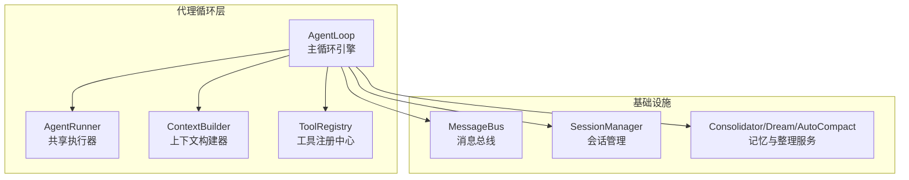
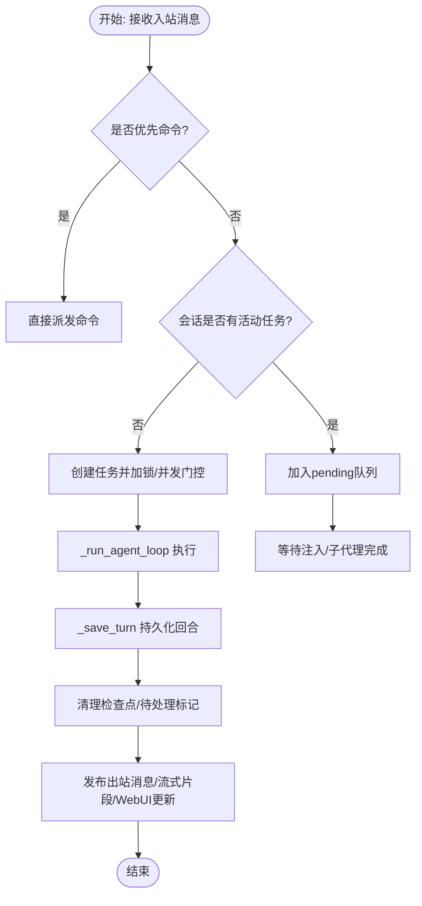
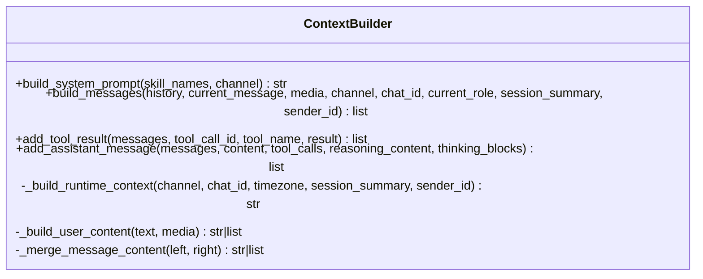
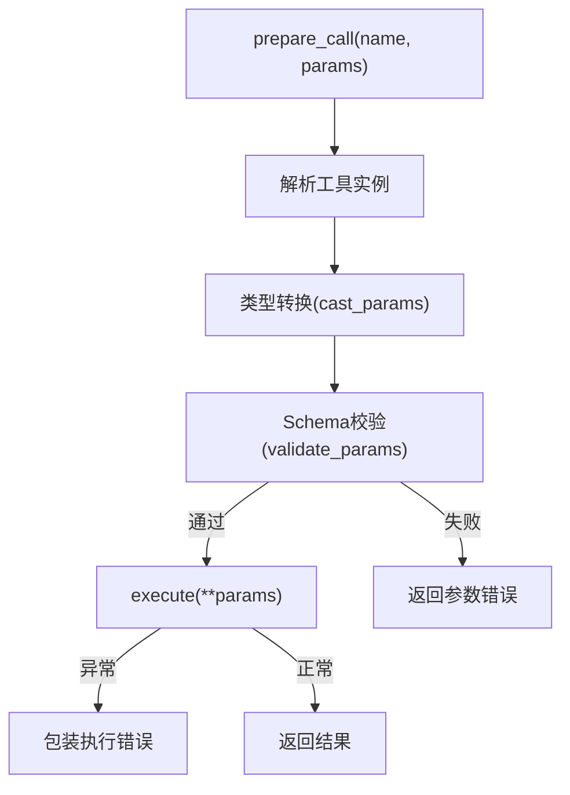
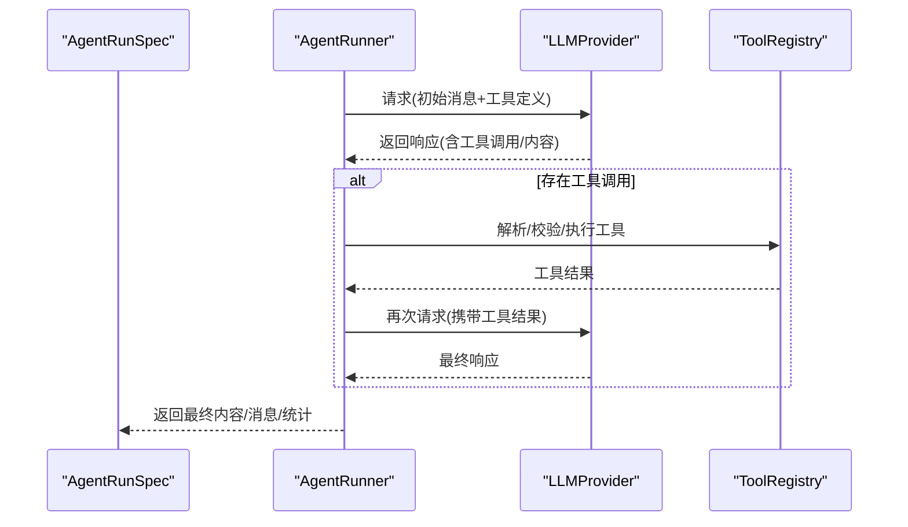
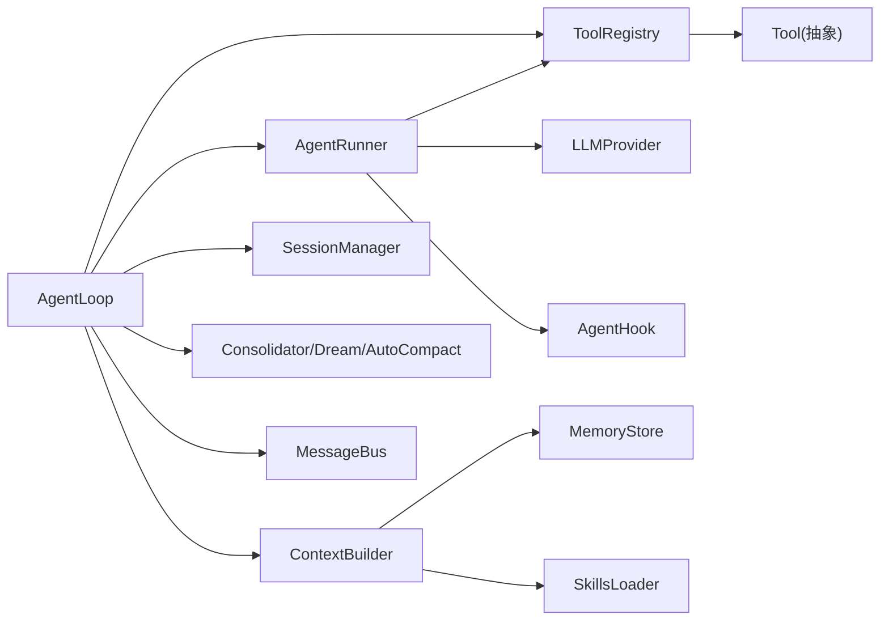

# 代理循环机制

<cite>
**本文引用的文件**
- [loop.py](file://secbot/agent/loop.py)
- [context.py](file://secbot/agent/context.py)
- [registry.py](file://secbot/agent/tools/registry.py)
- [base.py](file://secbot/agent/tools/base.py)
- [runner.py](file://secbot/agent/runner.py)
- [test_runner.py](file://tests/agent/test_runner.py)
- [test_loop_save_turn.py](file://tests/agent/test_loop_save_turn.py)
</cite>

## 目录
1. [简介](#简介)
2. [项目结构](#项目结构)
3. [核心组件](#核心组件)
4. [架构总览](#架构总览)
5. [详细组件分析](#详细组件分析)
6. [依赖关系分析](#依赖关系分析)
7. [性能考量](#性能考量)
8. [故障排查指南](#故障排查指南)
9. [结论](#结论)
10. [附录](#附录)

## 简介
本文件面向 nanobot VAPT3 的代理循环机制，系统性阐述 AgentLoop 的核心工作原理与生命周期管理，覆盖消息接收、上下文构建、LLM 调用、工具执行与响应发送的完整流程；同时深入解析 ContextBuilder 的上下文整合策略、工具注册与执行的参数验证与错误处理、以及并发控制与任务调度机制。文档以循序渐进的方式组织内容，既适合初学者快速上手，也满足资深工程师对实现细节与性能优化的深度需求。

## 项目结构
围绕代理循环的关键模块如下：
- AgentLoop：代理主循环引擎，负责消息分发、会话管理、并发控制、任务调度与运行时检查点。
- ContextBuilder：上下文构建器，整合历史消息、内存信息、技能定义与运行时元数据，生成系统提示与消息列表。
- ToolRegistry：工具注册中心，统一管理工具注册、参数校验、类型转换与执行。
- AgentRunner：共享的工具型 LLM 循环执行器，封装迭代、工具调用、注入与检查点逻辑。
- 测试用例：覆盖消息处理、状态持久化、中断恢复、工具回填等关键场景。



图表来源
- [loop.py:176-325](file://secbot/agent/loop.py#L176-L325)
- [context.py:17-31](file://secbot/agent/context.py#L17-L31)
- [runner.py:100-105](file://secbot/agent/runner.py#L100-L105)

章节来源
- [loop.py:176-325](file://secbot/agent/loop.py#L176-L325)
- [context.py:17-31](file://secbot/agent/context.py#L17-L31)
- [runner.py:100-105](file://secbot/agent/runner.py#L100-L105)

## 核心组件
- AgentLoop：代理主循环，负责消息消费、会话锁与并发门控、任务队列、运行时检查点、子代理管理、自动整理与记忆压缩、WebUI 标题生成等。
- ContextBuilder：构建系统提示与消息列表，整合身份、引导文件、内存、技能、最近历史与运行时上下文，确保消息角色交替与多模态内容安全持久化。
- ToolRegistry：动态注册工具，提供参数类型转换、JSON Schema 验证、执行与缓存工具定义，支持 MCP 工具与内置工具的稳定排序。
- AgentRunner：共享的 LLM 迭代执行器，处理工具调用、注入用户消息、检查点回调、最大迭代次数、空响应恢复与长度恢复等。

章节来源
- [loop.py:176-325](file://secbot/agent/loop.py#L176-L325)
- [context.py:17-215](file://secbot/agent/context.py#L17-L215)
- [registry.py:8-126](file://secbot/agent/tools/registry.py#L8-L126)
- [runner.py:56-200](file://secbot/agent/runner.py#L56-L200)

## 架构总览
下图展示了从消息入站到响应出站的端到端流程，以及 AgentLoop 如何协调各子系统完成一次完整的“消息-上下文-LLM-工具-响应”闭环。

```mermaid
sequenceDiagram
participant Bus as "消息总线"
participant Loop as "AgentLoop"
participant Ctx as "ContextBuilder"
participant Runner as "AgentRunner"
participant Tools as "ToolRegistry"
participant LLM as "LLMProvider"
participant Out as "消息总线(出站)"
Bus->>Loop : 入站消息(InboundMessage)
Loop->>Loop : 获取会话键/加锁/并发门控
Loop->>Ctx : 构建系统提示与消息列表
Loop->>Runner : 启动迭代循环(run)
Runner->>LLM : 请求模型(带工具定义)
LLM-->>Runner : 返回响应(含工具调用/内容)
alt 存在工具调用
Runner->>Tools : 解析/校验/执行工具
Tools-->>Runner : 工具结果
Runner->>LLM : 再次请求(携带工具结果)
LLM-->>Runner : 最终响应
end
Runner-->>Loop : 返回最终内容/消息/停止原因
Loop->>Loop : 持久化回合(save_turn)/清理检查点
Loop->>Out : 出站消息(响应/进度/流式片段)
```

图表来源
- [loop.py:676-818](file://secbot/agent/loop.py#L676-L818)
- [loop.py:912-1183](file://secbot/agent/loop.py#L912-L1183)
- [runner.py:100-200](file://secbot/agent/runner.py#L100-L200)

## 详细组件分析

### AgentLoop：消息处理与生命周期管理
- 消息接收与分发
  - run() 主循环持续从消息总线消费入站消息，优先处理命令，否则按会话键路由至 pending 队列或新建任务。
  - 对于已存在活动任务的会话，新消息进入 pending 队列，实现“中段注入”而非并发竞争。
- 并发控制与任务调度
  - 使用会话级锁保证同一会话串行处理，避免竞态。
  - 使用信号量作为全局并发门控，默认最多 3 个并发请求，可通过环境变量调整。
  - 活跃任务字典跟踪每个会话的任务列表，支持 /stop 命令取消任务。
- 生命周期与状态管理
  - 运行时检查点：在工具执行过程中定期保存“未完成回合”的中间状态到会话元数据，中断后可恢复。
  - 待处理用户回合标记：若用户消息已持久化但响应尚未生成，重启后自动补全“中断前未生成响应”的占位消息。
  - 回合保存：_save_turn 将新消息写入会话历史，裁剪过长工具结果，过滤运行时上下文块，确保历史可读且不污染上下文。
- 上下文与工具上下文
  - _set_tool_context 根据会话键、通道与聊天 ID 设置工具路由上下文，确保 spawn/message/cron/my 等工具能正确回注到原线程或统一会话。
- 流式输出与 WebUI
  - 支持按流式片段发布，WebSocket 通道在回合结束时发送结束标记，WebUI 在回合后自动生成标题并通知更新。



图表来源
- [loop.py:676-818](file://secbot/agent/loop.py#L676-L818)
- [loop.py:912-1183](file://secbot/agent/loop.py#L912-L1183)
- [loop.py:1225-1293](file://secbot/agent/loop.py#L1225-L1293)

章节来源
- [loop.py:676-818](file://secbot/agent/loop.py#L676-L818)
- [loop.py:912-1183](file://secbot/agent/loop.py#L912-L1183)
- [loop.py:1225-1293](file://secbot/agent/loop.py#L1225-L1293)

### ContextBuilder：上下文构建与历史整合
- 系统提示构建
  - 身份信息、引导文件(AGENTS/SOUL/USER/TOOLS)、内存(MEMORY/SOUL/USER)、总是技能(always skills)与技能索引。
  - 最近历史截断上限与字符上限，避免上下文膨胀。
- 消息列表构建
  - 将运行时上下文(时间、通道、聊天 ID、发送者 ID、会话摘要)与用户内容合并，避免连续相同角色消息。
  - 支持多模态图片内容(base64)，并在持久化前替换为占位文本。
- 工具结果与助手消息追加
  - 提供便捷方法向消息列表追加工具结果与助手消息，保持格式一致性。



图表来源
- [context.py:17-215](file://secbot/agent/context.py#L17-L215)

章节来源
- [context.py:17-215](file://secbot/agent/context.py#L17-L215)

### 工具注册与执行：参数验证、错误处理与结果返回
- 注册与定义
  - ToolRegistry 维护工具映射，提供 get_definitions 缓存与稳定排序(内置优先，MCP 次之)。
- 参数解析与校验
  - prepare_call 解析工具名与参数，进行类型转换与 JSON Schema 验证，返回错误信息。
  - Schema.validate_json_schema_value 实现字符串/整数/数字/布尔/数组/对象等类型的严格校验。
- 执行与错误处理
  - execute 包装异常，统一返回错误提示与建议，避免崩溃传播。
  - 对工具返回字符串开头包含“Error”的情况附加提示。
- 工具基类
  - Tool 抽象类定义名称、描述、参数模式与执行接口；提供类型转换与验证能力。



图表来源
- [registry.py:73-115](file://secbot/agent/tools/registry.py#L73-L115)
- [base.py:21-115](file://secbot/agent/tools/base.py#L21-L115)

章节来源
- [registry.py:8-126](file://secbot/agent/tools/registry.py#L8-L126)
- [base.py:117-280](file://secbot/agent/tools/base.py#L117-L280)

### AgentRunner：共享执行器与工具循环
- 迭代循环
  - run 接受初始消息、工具注册表、模型与限制参数，驱动 LLM 与工具交互。
- 工具调用与注入
  - 处理工具调用列表，按并发策略执行；支持“中段注入”用户消息，保持角色交替。
- 检查点与恢复
  - checkpoint_callback 在工具执行期间保存中间状态；当出现孤儿工具调用时，向模型注入回填内容，修复上下文。
- 最大迭代与恢复策略
  - 达到最大迭代次数时发出提示；对空响应与超长内容提供恢复策略。



图表来源
- [runner.py:56-200](file://secbot/agent/runner.py#L56-L200)

章节来源
- [runner.py:100-200](file://secbot/agent/runner.py#L100-L200)

## 依赖关系分析
- AgentLoop 依赖
  - ContextBuilder：构建系统提示与消息列表。
  - ToolRegistry：提供工具定义与执行。
  - AgentRunner：执行 LLM 与工具循环。
  - SessionManager：会话持久化与历史管理。
  - Consolidator/Dream/AutoCompact：记忆整理与压缩。
  - MessageBus：入/出站消息总线。
- AgentRunner 依赖
  - LLMProvider：模型调用。
  - ToolRegistry：工具解析与执行。
  - AgentHook：钩子扩展点(进度、流式、工具事件)。
- ContextBuilder 依赖
  - MemoryStore：内存与历史读取。
  - SkillsLoader：技能加载与摘要。
- ToolRegistry 依赖
  - Tool：工具抽象与参数 Schema。



图表来源
- [loop.py:176-325](file://secbot/agent/loop.py#L176-L325)
- [runner.py:100-105](file://secbot/agent/runner.py#L100-L105)
- [context.py:17-31](file://secbot/agent/context.py#L17-L31)
- [registry.py:8-126](file://secbot/agent/tools/registry.py#L8-L126)

章节来源
- [loop.py:176-325](file://secbot/agent/loop.py#L176-L325)
- [runner.py:100-105](file://secbot/agent/runner.py#L100-L105)
- [context.py:17-31](file://secbot/agent/context.py#L17-L31)
- [registry.py:8-126](file://secbot/agent/tools/registry.py#L8-L126)

## 性能考量
- 上下文窗口预算
  - _replay_token_budget 基于上下文窗口与最大输出估算保留的重放预算，避免历史过长导致 OOM。
- 并发与资源控制
  - 会话级锁避免竞态；全局并发门控限制同时处理的消息数量；子代理取消与后台任务清理保障资源回收。
- 记忆与压缩
  - Consolidator 与 AutoCompact 在后台异步执行，减少主线程阻塞；记忆压缩与微紧凑策略降低工具结果对上下文的影响。
- 流式输出
  - 流式分片发布减少首屏延迟，WebSocket 结束标记帮助客户端正确收尾。

[本节为通用指导，无需特定文件来源]

## 故障排查指南
- 中断恢复
  - 检查点保存：工具执行期间定期保存中间状态；任务被 /stop 取消时，恢复检查点到会话历史，确保用户不会丢失已完成的工具结果。
  - 待处理用户回合：若仅持久化了用户消息而未生成响应，重启后自动补全占位消息。
- 工具回填
  - 当模型返回孤儿工具调用时，Runner 注入回填内容修复上下文，避免模型因缺少工具结果而报错。
- 会话历史截断
  - _save_turn 对过长工具结果进行裁剪，多模态图片替换为占位文本，确保历史可读且不污染上下文。
- 测试参考
  - 单元测试覆盖了检查点恢复、待处理回合关闭、孤儿工具调用回填、回合保存与流式发布等关键路径。

章节来源
- [loop.py:1294-1393](file://secbot/agent/loop.py#L1294-L1393)
- [runner.py:189-200](file://secbot/agent/runner.py#L189-L200)
- [test_runner.py:1798-1873](file://tests/agent/test_runner.py#L1798-L1873)
- [test_loop_save_turn.py:262-586](file://tests/agent/test_loop_save_turn.py#L262-L586)

## 结论
AgentLoop 通过严格的会话串行、并发门控与运行时检查点机制，实现了高可靠的消息处理与工具执行闭环；ContextBuilder 将历史、内存与技能整合为稳定的上下文；ToolRegistry 提供强健的参数校验与执行容错；AgentRunner 则将 LLM 与工具调用解耦为可复用的执行器。整体设计兼顾可用性、可扩展性与可维护性，适用于复杂的安全自动化场景。

[本节为总结，无需特定文件来源]

## 附录

### 代码示例路径（用于定位实现）
- 代理循环初始化与运行
  - [loop.py:191-325](file://secbot/agent/loop.py#L191-L325)
- 消息处理与回合保存
  - [loop.py:912-1183](file://secbot/agent/loop.py#L912-L1183)
  - [loop.py:1225-1293](file://secbot/agent/loop.py#L1225-L1293)
- 上下文构建
  - [context.py:133-165](file://secbot/agent/context.py#L133-L165)
- 工具注册与执行
  - [registry.py:73-115](file://secbot/agent/tools/registry.py#L73-L115)
  - [base.py:225-233](file://secbot/agent/tools/base.py#L225-L233)
- LLM 循环与工具调用
  - [runner.py:100-200](file://secbot/agent/runner.py#L100-L200)
- 测试用例参考
  - [test_runner.py:1798-1873](file://tests/agent/test_runner.py#L1798-L1873)
  - [test_loop_save_turn.py:387-586](file://tests/agent/test_loop_save_turn.py#L387-L586)