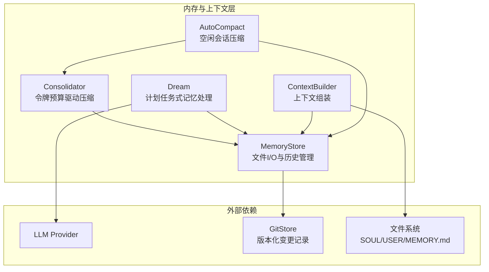
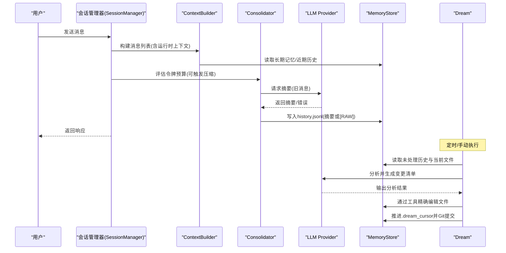
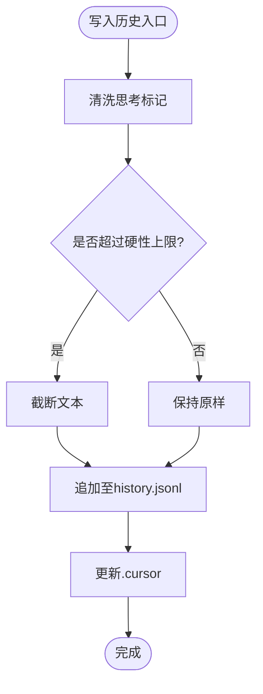
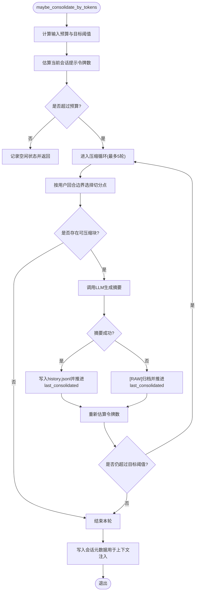
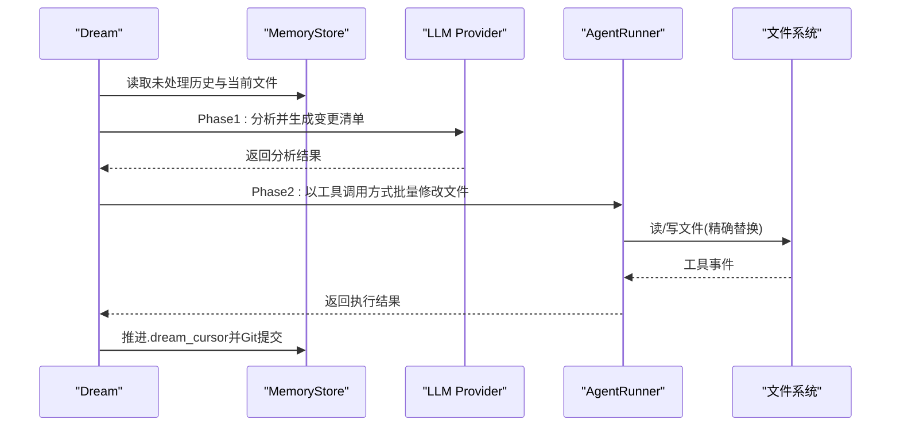
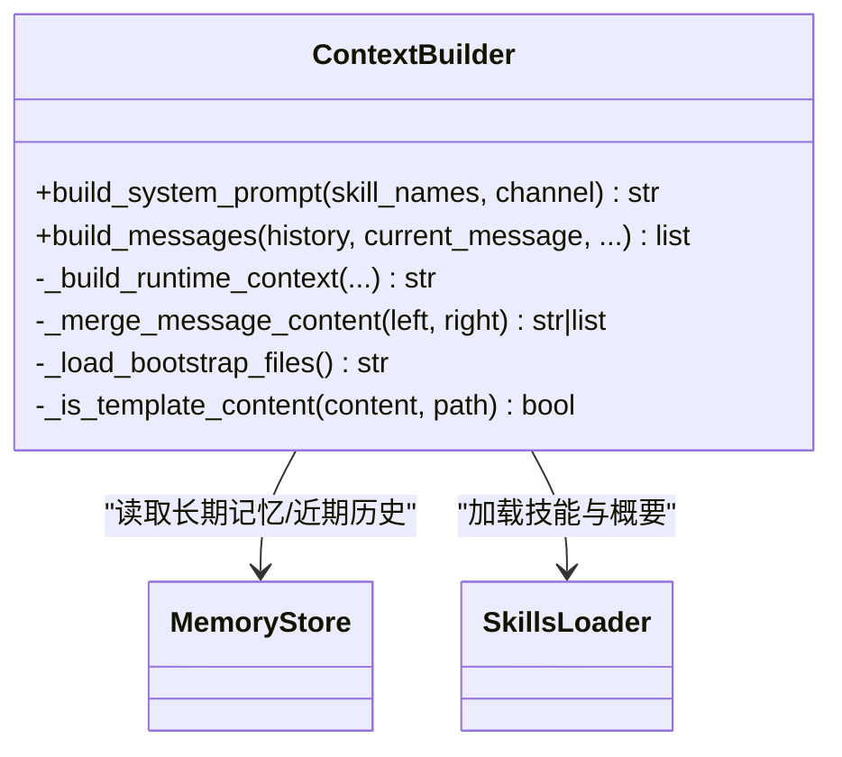
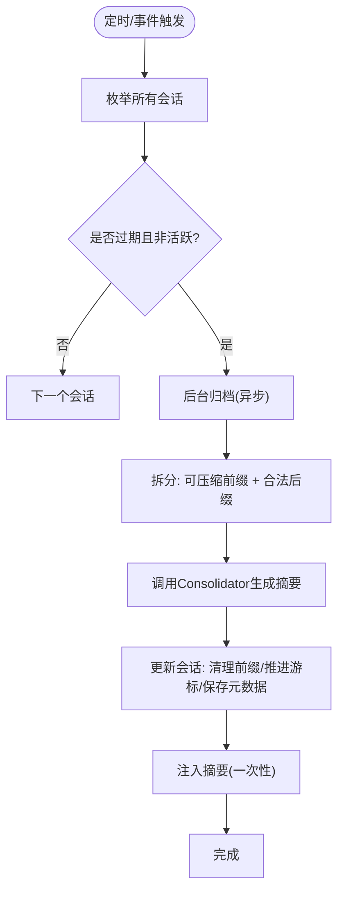
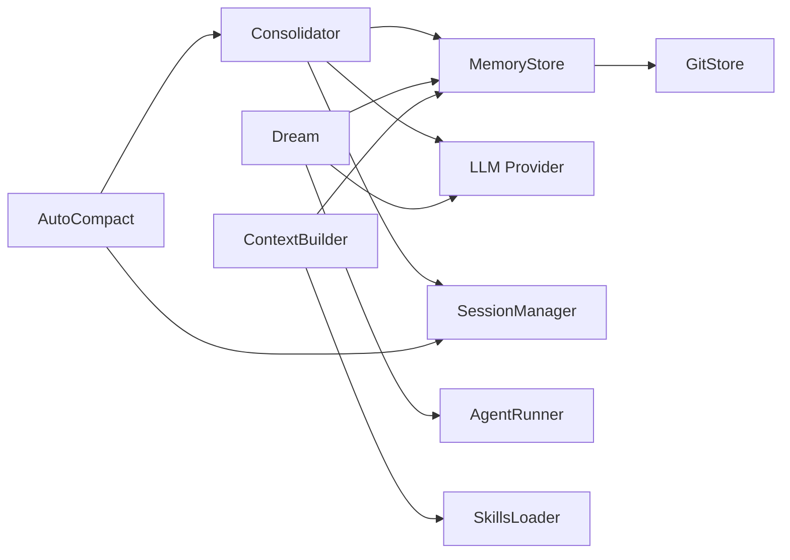

# 内存与上下文管理

<cite>
**本文引用的文件**
- [memory.py](file://secbot/agent/memory.py)
- [context.py](file://secbot/agent/context.py)
- [autocompact.py](file://secbot/agent/autocompact.py)
- [memory.md](file://docs/memory.md)
- [MEMORY.md](file://secbot/templates/memory/MEMORY.md)
- [consolidator_archive.md](file://secbot/templates/agent/consolidator_archive.md)
- [dream_phase1.md](file://secbot/templates/agent/dream_phase1.md)
- [dream_phase2.md](file://secbot/templates/agent/dream_phase2.md)
- [test_consolidator.py](file://tests/agent/test_consolidator.py)
- [test_auto_compact.py](file://tests/agent/test_auto_compact.py)
- [test_memory_store.py](file://tests/agent/test_memory_store.py)
</cite>

## 目录
1. [简介](#简介)
2. [项目结构](#项目结构)
3. [核心组件](#核心组件)
4. [架构总览](#架构总览)
5. [详细组件分析](#详细组件分析)
6. [依赖关系分析](#依赖关系分析)
7. [性能考量](#性能考量)
8. [故障排查指南](#故障排查指南)
9. [结论](#结论)
10. [附录](#附录)

## 简介
本文件面向 nanobot VAPT3 的内存与上下文管理系统，聚焦以下目标：
- 深入解析内存管理器（Consolidator）的工作原理：记忆片段的存储、检索与压缩机制。
- 解释上下文构建器（ContextBuilder）如何整合多源信息：历史对话、技能定义、工具描述与外部文档。
- 阐述自动压缩（AutoCompact）功能：会话空闲清理策略、阈值设置与性能优化。
- 描述上下文窗口管理与令牌预算分配机制。
- 提供内存配置的最佳实践与性能调优建议，包含监控与故障排除方法。

## 项目结构
围绕内存与上下文管理的核心代码位于 secbot/agent 目录，配套文档与模板位于 docs 与 secbot/templates 下。关键模块如下：
- MemoryStore：纯文件 I/O 层，负责 MEMORY.md、HISTORY.md 迁移、history.jsonl 的追加写入与游标管理。
- Consolidator：轻量级令牌预算驱动的压缩器，按用户回合边界安全地摘要旧消息并写入历史。
- Dream：重型计划任务式记忆处理器，分两阶段对长时记忆进行审阅与精炼编辑。
- ContextBuilder：上下文组装器，聚合身份、引导文件、长期记忆、技能、近期历史等。
- AutoCompact：基于 TTL 的会话空闲压缩器，保留最近合法后缀，定期归档过期会话。

图表来源
- [memory.py:39-1009](file://secbot/agent/memory.py#L39-L1009)
- [context.py:17-215](file://secbot/agent/context.py#L17-L215)
- [autocompact.py:16-124](file://secbot/agent/autocompact.py#L16-L124)

章节来源
- [memory.py:39-1009](file://secbot/agent/memory.py#L39-L1009)
- [context.py:17-215](file://secbot/agent/context.py#L17-L215)
- [autocompact.py:16-124](file://secbot/agent/autocompact.py#L16-L124)
- [memory.md:1-190](file://docs/memory.md#L1-L190)

## 核心组件
- MemoryStore
  - 负责 MEMORY.md、SOUL.md、USER.md 与 history.jsonl 的读写与游标维护。
  - 支持从旧版 HISTORY.md 的一次性迁移，保证历史连续性。
  - 历史条目上限压缩与原子写入，确保数据一致性。
- Consolidator
  - 基于令牌预算与“用户回合”边界选择可安全压缩的前缀。
  - 使用 LLM 将旧消息摘要为简洁要点，写入 history.jsonl；失败时回退到 [RAW] 归档。
  - 通过安全缓冲区避免请求超过模型上下文窗口。
- Dream
  - 分两阶段处理：先由 LLM 分析新旧内容并输出“变更清单”，再通过工具链精确修改文件。
  - 对 MEMORY.md 可选添加行级年龄注记，辅助判断冗余与陈旧内容。
  - 成功后推进 .dream_cursor 并通过 GitStore 自动提交。
- ContextBuilder
  - 组装系统提示词：身份、引导文件、长期记忆、活跃技能、近期历史等。
  - 合并运行时上下文（时间、通道、发送者、会话摘要）到用户消息中，避免同角色连续消息。
- AutoCompact
  - 基于会话最后更新时间（TTL）触发后台归档，保留最近合法后缀，避免重复压缩。
  - 将最新摘要注入下一次会话准备阶段的运行时上下文中，实现“恢复会话”的一次性提示。

章节来源
- [memory.py:39-1009](file://secbot/agent/memory.py#L39-L1009)
- [context.py:17-215](file://secbot/agent/context.py#L17-L215)
- [autocompact.py:16-124](file://secbot/agent/autocompact.py#L16-L124)

## 架构总览
下面的序列图展示了典型的一次对话在内存与上下文系统中的流转路径：

图表来源
- [memory.py:442-692](file://secbot/agent/memory.py#L442-L692)
- [context.py:133-165](file://secbot/agent/context.py#L133-L165)
- [autocompact.py:75-108](file://secbot/agent/autocompact.py#L75-L108)

## 详细组件分析

### 内存存储层（MemoryStore）
- 文件与游标
  - MEMORY.md：长期事实与决策。
  - SOUL.md：机器人声音与沟通风格。
  - USER.md：用户稳定知识。
  - history.jsonl：追加只读的历史摘要，带游标与时间戳。
  - .cursor 与 .dream_cursor：分别记录 Consolidator 与 Dream 的消费进度。
- 历史迁移
  - 从 HISTORY.md 到 history.jsonl 的一次性迁移，保留尽可能多的内容并生成备份。
- 历史压缩
  - 当历史条目数量超过上限时，仅保留最近 N 条，其余丢弃。
- 原子写入
  - 通过临时文件 + 替换的方式实现历史文件的原子重写，降低损坏风险。
- 追加写入与截断
  - 追加历史时先清洗思考类标记，再按硬性上限截断，防止异常超大条目污染。

图表来源
- [memory.py:233-273](file://secbot/agent/memory.py#L233-L273)

章节来源
- [memory.py:39-427](file://secbot/agent/memory.py#L39-L427)
- [test_memory_store.py:1-422](file://tests/agent/test_memory_store.py#L1-L422)

### 记忆压缩器（Consolidator）
- 目标
  - 在不超出上下文窗口的前提下，将旧消息压缩为摘要，持续释放输入空间。
- 边界选择
  - 严格按“用户回合”作为安全边界，避免在中间工具调用或模型回复中切分。
- 令牌预算
  - 输入预算 = 上下文窗口 - 最大补全长度 - 安全缓冲区。
  - 若预算为负，采用字符级截断；正预算则使用分词器精确控制。
- 压缩循环
  - 多轮迭代，每轮根据目标阈值（预算比例）选择边界并调用 LLM 摘要。
  - 失败回退到 [RAW] 归档，并推进 last_consolidated，避免重复压缩同一段。
- 会话摘要注入
  - 将最后一次摘要写入会话元数据，供后续上下文注入使用。

图表来源
- [memory.py:589-692](file://secbot/agent/memory.py#L589-L692)

章节来源
- [memory.py:442-692](file://secbot/agent/memory.py#L442-L692)
- [consolidator_archive.md:1-14](file://secbot/templates/agent/consolidator_archive.md#L1-L14)
- [test_consolidator.py:113-318](file://tests/agent/test_consolidator.py#L113-L318)

### 计划任务式记忆处理器（Dream）
- 两阶段流程
  - Phase 1：分析历史与当前文件，输出“新增事实、去重建议、技能发现”等变更清单。
  - Phase 2：通过 AgentRunner 与工具集精确修改文件，避免整文件替换。
- 文件与限制
  - 限定各文件预览的最大字符数，避免单次请求越界。
  - MEMORY.md 可选添加行级年龄注记，辅助识别陈旧内容。
- 执行与提交
  - 成功完成后推进 .dream_cursor，并通过 GitStore 自动提交变更。

图表来源
- [memory.py:699-1009](file://secbot/agent/memory.py#L699-L1009)
- [dream_phase1.md:1-41](file://secbot/templates/agent/dream_phase1.md#L1-L41)
- [dream_phase2.md:1-38](file://secbot/templates/agent/dream_phase2.md#L1-L38)

章节来源
- [memory.py:699-1009](file://secbot/agent/memory.py#L699-L1009)
- [memory.md:46-128](file://docs/memory.md#L46-L128)

### 上下文构建器（ContextBuilder）
- 组装顺序
  - 身份信息（平台、运行环境、渠道）→ 引导文件（AGENTS/SOUL/USER/TOOLS）→ 长期记忆 → 活跃技能 → 技能概要 → 近期历史。
- 运行时上下文
  - 将当前时间、通道/聊天ID、发送者ID、会话摘要等注入到用户消息前，避免同角色连续消息。
- 合并策略
  - 将运行时上下文与用户内容合并为单一用户消息，减少角色切换带来的兼容性问题。
- 近期历史截断
  - 限制近期历史的条数与字符数，避免过长导致预算不足。

图表来源
- [context.py:17-215](file://secbot/agent/context.py#L17-L215)

章节来源
- [context.py:17-215](file://secbot/agent/context.py#L17-L215)
- [MEMORY.md:1-24](file://secbot/templates/memory/MEMORY.md#L1-L24)

### 自动压缩（AutoCompact）
- TTL 触发
  - 基于会话最后更新时间（分钟），超过阈值即触发后台归档。
- 合法后缀保留
  - 保留最近若干条合法回合（默认8条），避免丢失上下文连续性。
- 压缩与摘要
  - 调用 Consolidator 对可压缩前缀进行摘要，将摘要注入下一次会话准备阶段的运行时上下文。
- 并发与幂等
  - 使用集合跟踪正在归档的会话键，避免重复调度；异常捕获不阻塞后续周期。

图表来源
- [autocompact.py:61-124](file://secbot/agent/autocompact.py#L61-L124)

章节来源
- [autocompact.py:16-124](file://secbot/agent/autocompact.py#L16-L124)
- [test_auto_compact.py:167-800](file://tests/agent/test_auto_compact.py#L167-L800)

## 依赖关系分析
- 组件耦合
  - Consolidator 依赖 MemoryStore（写入历史）、LLM Provider（摘要）、SessionManager（持久化会话）。
  - Dream 依赖 MemoryStore（读取/写入）、LLM Provider（分析/编辑）、AgentRunner（工具执行）。
  - ContextBuilder 依赖 MemoryStore（长期记忆/近期历史）、SkillsLoader（技能内容）。
  - AutoCompact 依赖 SessionManager（会话生命周期）、Consolidator（摘要）、弱锁字典（并发控制）。
- 外部依赖
  - GitStore：对长期记忆文件进行版本化记录，支持审计与回滚。
  - tiktoken：在预算充足时进行精确分词截断，否则采用字符级截断。

图表来源
- [memory.py:442-1009](file://secbot/agent/memory.py#L442-L1009)
- [context.py:17-215](file://secbot/agent/context.py#L17-L215)
- [autocompact.py:16-124](file://secbot/agent/autocompact.py#L16-L124)

章节来源
- [memory.py:442-1009](file://secbot/agent/memory.py#L442-L1009)
- [context.py:17-215](file://secbot/agent/context.py#L17-L215)
- [autocompact.py:16-124](file://secbot/agent/autocompact.py#L16-L124)

## 性能考量
- 令牌预算与安全缓冲
  - 输入预算 = 上下文窗口 - 补全长度 - 安全缓冲区。当预算为负时采用字符级截断，确保请求不会越界。
- 分词器与字符截断
  - 正预算时使用分词器精确控制长度；负预算时按字符数乘以粗略系数截断，兼顾速度与安全。
- 历史压缩与上限
  - 历史文件按条目上限进行压缩，避免无限增长；同时保留最近合法后缀，维持上下文连贯。
- 并发与锁
  - Consolidator 使用弱引用字典为每个会话键维护共享锁，避免并发冲突；AutoCompact 使用集合跟踪归档中会话键，避免重复调度。
- 日志与告警
  - 对超大条目与游标异常进行限频告警，便于定位上游调用方的容量控制问题。

章节来源
- [memory.py:535-553](file://secbot/agent/memory.py#L535-L553)
- [test_consolidator.py:256-318](file://tests/agent/test_consolidator.py#L256-L318)
- [test_memory_store.py:188-230](file://tests/agent/test_memory_store.py#L188-L230)

## 故障排查指南
- 历史条目过大
  - 现象：日志出现“超过硬性上限”的警告，且历史被截断。
  - 措施：检查上游调用方是否设置了更紧的 max_chars；确认 Consolidator 的 _HISTORY_ENTRY_HARD_CAP 是否被绕过。
  - 参考
    - [test_memory_store.py:188-230](file://tests/agent/test_memory_store.py#L188-L230)
- LLM 摘要失败
  - 现象：Consolidator 回退到 [RAW] 归档，且不再重复压缩同一段。
  - 措施：检查网络/配额/模型可用性；确认 finish_reason 不为 error。
  - 参考
    - [test_consolidator.py:73-111](file://tests/agent/test_consolidator.py#L73-L111)
- 令牌估算失败
  - 现象：Consolidator 记录估算失败并跳过本轮压缩。
  - 措施：检查 LLM Provider 的令牌估算实现；必要时放宽安全缓冲或调整模型。
  - 参考
    - [memory.py:612-614](file://secbot/agent/memory.py#L612-L614)
- 近期历史过长
  - 现象：上下文构建时近期历史被截断，导致部分信息丢失。
  - 措施：适当提高上下文窗口或减少近期历史字符上限。
  - 参考
    - [context.py:22-24](file://secbot/agent/context.py#L22-L24)
- AutoCompact 未生效
  - 现象：会话长时间空闲但未被归档。
  - 措施：检查 session_ttl_minutes 是否大于 0；确认会话未处于活跃任务中；查看 _archiving 集合是否阻塞。
  - 参考
    - [test_auto_compact.py:635-800](file://tests/agent/test_auto_compact.py#L635-L800)
- Git 提交失败
  - 现象：Dream 成功但未看到 Git 提交。
  - 措施：确认 GitStore 初始化与权限；检查工具事件与提交消息格式。
  - 参考
    - [memory.py:999-1007](file://secbot/agent/memory.py#L999-L1007)

章节来源
- [test_consolidator.py:73-201](file://tests/agent/test_consolidator.py#L73-L201)
- [test_auto_compact.py:635-800](file://tests/agent/test_auto_compact.py#L635-L800)
- [test_memory_store.py:188-230](file://tests/agent/test_memory_store.py#L188-L230)

## 结论
nanobot 的内存与上下文管理通过“轻压缩 + 重审阅”的双层设计，在保证实时对话流畅的同时，持续提炼与净化长期记忆。Consolidator 以令牌预算与用户回合边界为核心，确保压缩的安全与高效；Dream 以两阶段处理实现对长期文件的精准编辑与版本化记录；AutoCompact 则在空闲状态下主动回收资源，提升整体性能与稳定性。配合合理的配置与监控，可在不同规模与负载场景下取得良好平衡。

## 附录
- 配置参考（摘自文档）
  - Dream 默认配置项：间隔小时、模型覆盖、最大批大小、最大迭代次数。
  - 参考
    - [memory.md:141-178](file://docs/memory.md#L141-L178)