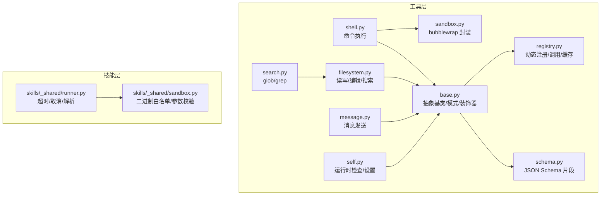
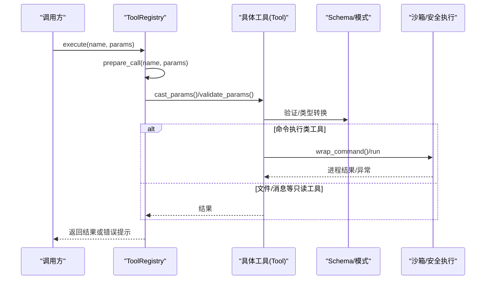
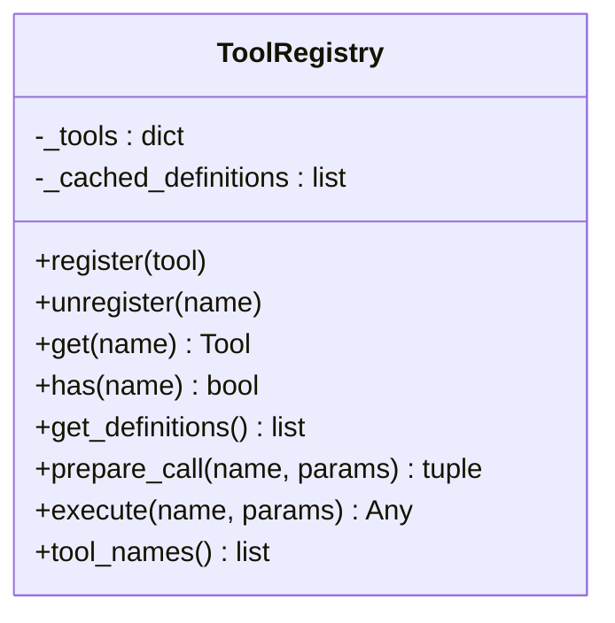
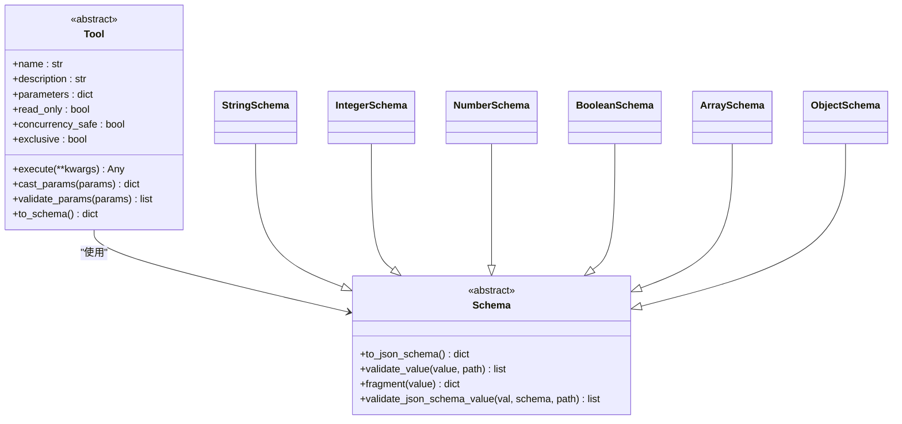
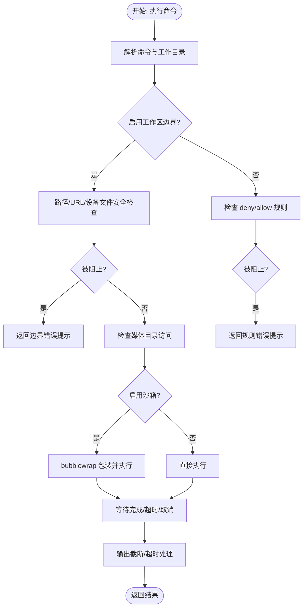
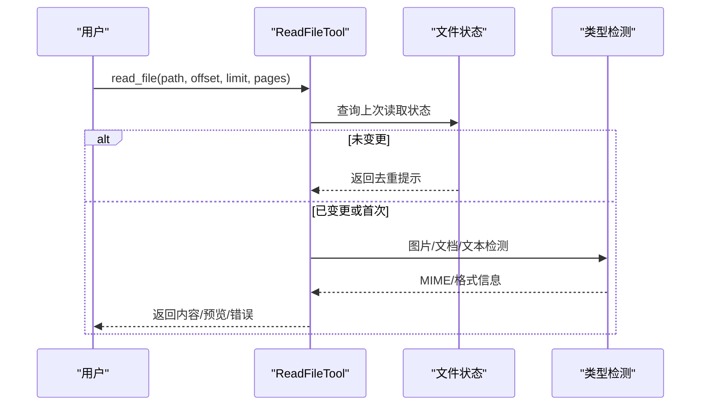
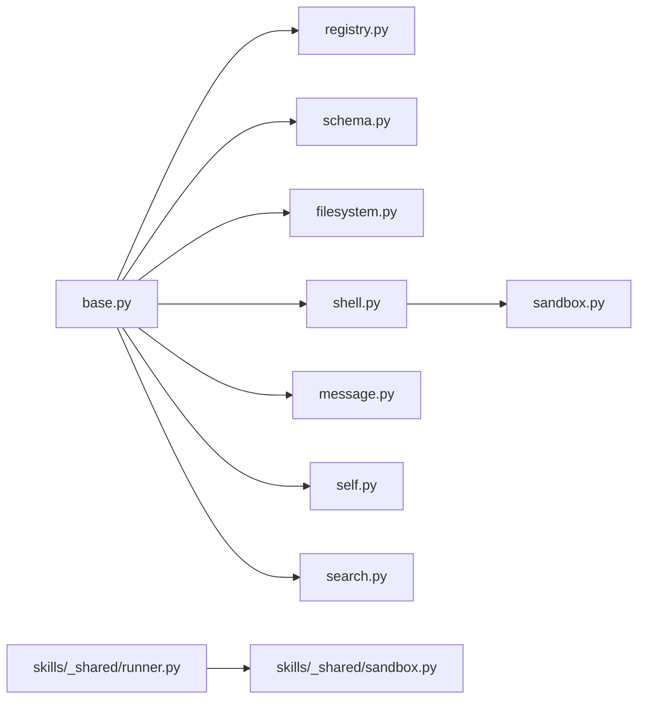

# 工具系统架构

<cite>
**本文档引用的文件**
- [secbot/agent/tools/base.py](file://secbot/agent/tools/base.py)
- [secbot/agent/tools/registry.py](file://secbot/agent/tools/registry.py)
- [secbot/agent/tools/schema.py](file://secbot/agent/tools/schema.py)
- [secbot/agent/tools/sandbox.py](file://secbot/agent/tools/sandbox.py)
- [secbot/agent/tools/shell.py](file://secbot/agent/tools/shell.py)
- [secbot/agent/tools/filesystem.py](file://secbot/agent/tools/filesystem.py)
- [secbot/agent/tools/self.py](file://secbot/agent/tools/self.py)
- [secbot/agent/tools/message.py](file://secbot/agent/tools/message.py)
- [secbot/agent/tools/search.py](file://secbot/agent/tools/search.py)
- [tests/tools/test_tool_registry.py](file://tests/tools/test_tool_registry.py)
- [tests/tools/test_tool_validation.py](file://tests/tools/test_tool_validation.py)
- [tests/tools/test_sandbox.py](file://tests/tools/test_sandbox.py)
- [docs/my-tool.md](file://docs/my-tool.md)
- [secbot/skills/_shared/sandbox.py](file://secbot/skills/_shared/sandbox.py)
- [secbot/skills/_shared/runner.py](file://secbot/skills/_shared/runner.py)
</cite>

## 目录
1. [简介](#简介)
2. [项目结构](#项目结构)
3. [核心组件](#核心组件)
4. [架构总览](#架构总览)
5. [详细组件分析](#详细组件分析)
6. [依赖关系分析](#依赖关系分析)
7. [性能考量](#性能考量)
8. [故障排查指南](#故障排查指南)
9. [结论](#结论)
10. [附录：工具开发指南](#附录工具开发指南)

## 简介
本文件面向 nanobot VAPT3 的工具系统，系统性阐述工具注册表（ToolRegistry）的设计模式、工具基类（BaseTool）的抽象设计、工具模式（Schema）系统、安全执行机制（沙箱隔离、路径限制、资源配额），并提供完整的工具开发指南与常见工具实现示例。

## 项目结构
工具系统位于 secbot/agent/tools 下，围绕“抽象基类 + 注册表 + 模式系统 + 安全执行”组织代码；同时在 secbot/skills/_shared 提供技能层的统一沙箱与执行器，确保外部二进制调用的安全可控。

图示来源
- [secbot/agent/tools/base.py:1-280](file://secbot/agent/tools/base.py#L1-L280)
- [secbot/agent/tools/registry.py:1-126](file://secbot/agent/tools/registry.py#L1-L126)
- [secbot/agent/tools/schema.py:1-233](file://secbot/agent/tools/schema.py#L1-L233)
- [secbot/agent/tools/sandbox.py:1-56](file://secbot/agent/tools/sandbox.py#L1-L56)
- [secbot/agent/tools/filesystem.py:1-930](file://secbot/agent/tools/filesystem.py#L1-L930)
- [secbot/agent/tools/shell.py:1-380](file://secbot/agent/tools/shell.py#L1-L380)
- [secbot/agent/tools/message.py:1-182](file://secbot/agent/tools/message.py#L1-L182)
- [secbot/agent/tools/self.py:1-452](file://secbot/agent/tools/self.py#L1-L452)
- [secbot/agent/tools/search.py:1-555](file://secbot/agent/tools/search.py#L1-L555)
- [secbot/skills/_shared/sandbox.py:1-192](file://secbot/skills/_shared/sandbox.py#L1-L192)
- [secbot/skills/_shared/runner.py:1-83](file://secbot/skills/_shared/runner.py#L1-L83)

章节来源
- [secbot/agent/tools/base.py:1-280](file://secbot/agent/tools/base.py#L1-L280)
- [secbot/agent/tools/registry.py:1-126](file://secbot/agent/tools/registry.py#L1-L126)
- [secbot/agent/tools/schema.py:1-233](file://secbot/agent/tools/schema.py#L1-L233)
- [secbot/agent/tools/sandbox.py:1-56](file://secbot/agent/tools/sandbox.py#L1-L56)
- [secbot/agent/tools/filesystem.py:1-930](file://secbot/agent/tools/filesystem.py#L1-L930)
- [secbot/agent/tools/shell.py:1-380](file://secbot/agent/tools/shell.py#L1-L380)
- [secbot/agent/tools/message.py:1-182](file://secbot/agent/tools/message.py#L1-L182)
- [secbot/agent/tools/self.py:1-452](file://secbot/agent/tools/self.py#L1-L452)
- [secbot/agent/tools/search.py:1-555](file://secbot/agent/tools/search.py#L1-L555)
- [secbot/skills/_shared/sandbox.py:1-192](file://secbot/skills/_shared/sandbox.py#L1-L192)
- [secbot/skills/_shared/runner.py:1-83](file://secbot/skills/_shared/runner.py#L1-L83)

## 核心组件
- 抽象基类与模式系统：定义工具接口、参数模式、类型转换与验证。
- 工具注册表：动态注册、缓存、排序、参数准备与执行。
- 安全执行：命令执行沙箱封装、路径边界保护、资源配额与超时。
- 文件系统工具：读取、写入、编辑、差异匹配与去重。
- 搜索工具：glob 与 grep，支持过滤、分页、上下文输出。
- 自检工具：运行时状态检查与受控设置。
- 消息工具：向用户通道发送消息与附件。
- 技能层沙箱：统一的二进制白名单、参数校验与执行器。

章节来源
- [secbot/agent/tools/base.py:117-280](file://secbot/agent/tools/base.py#L117-L280)
- [secbot/agent/tools/schema.py:20-233](file://secbot/agent/tools/schema.py#L20-L233)
- [secbot/agent/tools/registry.py:8-126](file://secbot/agent/tools/registry.py#L8-L126)
- [secbot/agent/tools/sandbox.py:14-56](file://secbot/agent/tools/sandbox.py#L14-L56)
- [secbot/agent/tools/shell.py:48-380](file://secbot/agent/tools/shell.py#L48-L380)
- [secbot/agent/tools/filesystem.py:148-930](file://secbot/agent/tools/filesystem.py#L148-L930)
- [secbot/agent/tools/search.py:134-555](file://secbot/agent/tools/search.py#L134-L555)
- [secbot/agent/tools/self.py:30-452](file://secbot/agent/tools/self.py#L30-L452)
- [secbot/agent/tools/message.py:30-182](file://secbot/agent/tools/message.py#L30-L182)
- [secbot/skills/_shared/sandbox.py:23-192](file://secbot/skills/_shared/sandbox.py#L23-L192)
- [secbot/skills/_shared/runner.py:38-83](file://secbot/skills/_shared/runner.py#L38-L83)

## 架构总览
工具系统采用“模式驱动 + 注册表调度 + 沙箱执行”的分层架构。模式系统负责参数定义与验证；注册表负责工具生命周期管理与调用；安全执行模块在命令执行与外部二进制调用中实施边界保护与资源约束。

图示来源
- [secbot/agent/tools/registry.py:73-115](file://secbot/agent/tools/registry.py#L73-L115)
- [secbot/agent/tools/base.py:180-233](file://secbot/agent/tools/base.py#L180-L233)
- [secbot/agent/tools/shell.py:123-216](file://secbot/agent/tools/shell.py#L123-L216)
- [secbot/agent/tools/sandbox.py:51-56](file://secbot/agent/tools/sandbox.py#L51-L56)

## 详细组件分析

### 工具注册表（ToolRegistry）
- 设计要点
  - 动态注册/注销工具，维护名称到实例映射。
  - 缓存工具函数定义列表，按内置工具优先、MCP 工具次序稳定排序，提升提示缓存命中率。
  - 调用前准备：类型转换、参数验证、错误提示拼接。
  - 统一执行入口：捕获异常、返回可读错误信息，并在必要时追加分析提示。

图示来源
- [secbot/agent/tools/registry.py:8-126](file://secbot/agent/tools/registry.py#L8-L126)

章节来源
- [secbot/agent/tools/registry.py:19-126](file://secbot/agent/tools/registry.py#L19-L126)
- [tests/tools/test_tool_registry.py:37-104](file://tests/tools/test_tool_registry.py#L37-L104)

### 工具基类与模式系统（Schema/Tool）
- 抽象基类（Tool）
  - 参数模式：通过 parameters 属性提供 JSON Schema。
  - 类型转换：cast_params 在验证前进行安全类型转换（字符串到整数/浮点/布尔/数组/对象）。
  - 参数验证：validate_params 使用 Schema.validate_json_schema_value 对参数进行深度校验。
  - 函数模式导出：to_schema 输出 OpenAI 函数调用格式。
  - 可选属性：read_only、concurrency_safe、exclusive 控制并发与安全性。
- 模式系统（Schema）
  - 支持 string/integer/number/boolean/array/object 等 JSON Schema 片段。
  - 提供 fragment 归一化与 validate_value 统一校验入口。
  - 支持 nullable、enum、min/max、minLength/maxLength、required 等约束。
- 装饰器（tool_parameters）
  - 将 JSON Schema 注入到 Tool 子类，保证每次访问返回深拷贝，避免共享状态问题。

图示来源
- [secbot/agent/tools/base.py:117-280](file://secbot/agent/tools/base.py#L117-L280)
- [secbot/agent/tools/schema.py:20-233](file://secbot/agent/tools/schema.py#L20-L233)

章节来源
- [secbot/agent/tools/base.py:117-280](file://secbot/agent/tools/base.py#L117-L280)
- [secbot/agent/tools/schema.py:20-233](file://secbot/agent/tools/schema.py#L20-L233)
- [tests/tools/test_tool_validation.py:76-200](file://tests/tools/test_tool_validation.py#L76-L200)

### 安全执行与沙箱（Shell/技能层）
- Shell 工具安全机制
  - 路径边界保护：当启用 restrict_to_workspace 时，拒绝工作目录之外的绝对路径与波浪号路径，允许媒体目录只读访问。
  - 命令过滤：内置 deny_patterns 与 allow_patterns，支持正则匹配；允许显式白名单覆盖。
  - 设备文件保护：拒绝读取 /dev/random/zero/full 等可能阻塞或产生无限输出的设备文件。
  - 输出截断：超过阈值时保留首尾，避免大输出污染。
  - 超时与僵尸进程处理：统一超时与进程清理。
  - 沙箱封装：通过 bubblewrap 将工作区挂载为读写、父目录以 tmpfs 掩盖、系统目录只读挂载、媒体目录只读挂载。
- 技能层沙箱
  - 二进制白名单：仅允许受控二进制执行。
  - 参数字符过滤：禁止危险字符进入 argv。
  - 执行器：支持超时、取消、内存上限、文件/内存捕获等策略。

图示来源
- [secbot/agent/tools/shell.py:303-363](file://secbot/agent/tools/shell.py#L303-L363)
- [secbot/agent/tools/sandbox.py:14-56](file://secbot/agent/tools/sandbox.py#L14-L56)
- [secbot/skills/_shared/sandbox.py:70-192](file://secbot/skills/_shared/sandbox.py#L70-L192)

章节来源
- [secbot/agent/tools/shell.py:48-380](file://secbot/agent/tools/shell.py#L48-L380)
- [secbot/agent/tools/sandbox.py:14-56](file://secbot/agent/tools/sandbox.py#L14-L56)
- [tests/tools/test_tool_validation.py:201-338](file://tests/tools/test_tool_validation.py#L201-L338)
- [tests/tools/test_sandbox.py:15-122](file://tests/tools/test_sandbox.py#L15-L122)
- [secbot/skills/_shared/sandbox.py:23-192](file://secbot/skills/_shared/sandbox.py#L23-L192)
- [secbot/skills/_shared/runner.py:38-83](file://secbot/skills/_shared/runner.py#L38-L83)

### 文件系统工具（读取/写入/编辑/搜索）
- 读取工具（ReadFileTool）
  - 支持文本、图片、PDF、Office 文档；行号编号输出；支持偏移与限制；设备文件黑名单；内容去重与哈希校验。
- 写入工具（WriteFileTool）
  - 创建父目录、UTF-8 写入；记录写入状态。
- 编辑工具（EditFileTool）
  - 多级匹配策略（精确/修剪/智能引号/引号规范化）；支持替换全部；保持缩进与引号风格；大小限制与 CRLF 处理。
- 搜索工具（GlobTool/GrepTool）
  - glob：按修改时间排序、忽略噪声目录、支持分页与偏移。
  - grep：支持正则/纯文本、上下文行、二进制跳过、大文件跳过、结果字符上限与分页注记。

图示来源
- [secbot/agent/tools/filesystem.py:148-351](file://secbot/agent/tools/filesystem.py#L148-L351)

章节来源
- [secbot/agent/tools/filesystem.py:148-930](file://secbot/agent/tools/filesystem.py#L148-L930)
- [secbot/agent/tools/search.py:134-555](file://secbot/agent/tools/search.py#L134-L555)

### 自检工具（MyTool）
- 能力概述：检查与设置自身运行时配置，支持受控写入（仅内存态）。
- 安全机制：敏感字段名屏蔽、受限参数范围校验、只读/隐藏属性保护、Python 内部属性屏蔽。
- 使用场景：模型切换、上下文窗口调整、子代理状态监控、会话内记忆（scratchpad）。

章节来源
- [secbot/agent/tools/self.py:30-452](file://secbot/agent/tools/self.py#L30-L452)
- [docs/my-tool.md:1-208](file://docs/my-tool.md#L1-L208)

### 消息工具（MessageTool）
- 能力概述：向指定通道与聊天发送消息，支持附件、按钮、元数据与默认上下文。
- 安全与约束：按钮格式校验、默认消息 ID 仅在同一目标时继承、发送回调可插拔。

章节来源
- [secbot/agent/tools/message.py:30-182](file://secbot/agent/tools/message.py#L30-L182)

## 依赖关系分析
- 工具层内部依赖
  - 所有工具均依赖 base.py 的 Tool/Schema 抽象与装饰器。
  - 文件系统工具共享 _FsTool 基类与路径解析逻辑。
  - 搜索工具复用 ListDirTool 的忽略目录集合。
- 安全依赖
  - Shell 工具依赖 sandbox.py 的 bubblewrap 包装。
  - 技能层二进制调用依赖 _shared/sandbox.py 的白名单与参数校验。
- 测试依赖
  - 注册表与参数验证测试覆盖装饰器、缓存、错误提示与安全边界。

图示来源
- [secbot/agent/tools/base.py:1-280](file://secbot/agent/tools/base.py#L1-L280)
- [secbot/agent/tools/registry.py:1-126](file://secbot/agent/tools/registry.py#L1-L126)
- [secbot/agent/tools/schema.py:1-233](file://secbot/agent/tools/schema.py#L1-L233)
- [secbot/agent/tools/sandbox.py:1-56](file://secbot/agent/tools/sandbox.py#L1-L56)
- [secbot/agent/tools/filesystem.py:1-930](file://secbot/agent/tools/filesystem.py#L1-L930)
- [secbot/agent/tools/shell.py:1-380](file://secbot/agent/tools/shell.py#L1-L380)
- [secbot/agent/tools/message.py:1-182](file://secbot/agent/tools/message.py#L1-L182)
- [secbot/agent/tools/self.py:1-452](file://secbot/agent/tools/self.py#L1-L452)
- [secbot/agent/tools/search.py:1-555](file://secbot/agent/tools/search.py#L1-L555)
- [secbot/skills/_shared/runner.py:1-83](file://secbot/skills/_shared/runner.py#L1-L83)
- [secbot/skills/_shared/sandbox.py:1-192](file://secbot/skills/_shared/sandbox.py#L1-L192)

章节来源
- [secbot/agent/tools/filesystem.py:91-110](file://secbot/agent/tools/filesystem.py#L91-L110)
- [tests/tools/test_tool_registry.py:29-49](file://tests/tools/test_tool_registry.py#L29-L49)
- [tests/tools/test_tool_validation.py:142-151](file://tests/tools/test_tool_validation.py#L142-L151)

## 性能考量
- 参数验证与类型转换
  - cast_params 与 validate_params 在调用前执行，避免无效参数进入工具内部逻辑。
  - 模式系统对嵌套对象与数组递归校验，建议在工具参数设计上尽量扁平化，减少深度层级。
- 输出截断与分页
  - 文件读取与 grep 输出存在最大字符限制与分页注记，建议配合 offset/head_limit 实现增量获取。
- 并发与独占
  - read_only 与 exclusive 属性用于并发控制，避免高风险工具串行执行。
- 沙箱开销
  - bubblewrap 启动与挂载带来额外开销，建议在频繁小命令场景评估是否启用沙箱。

## 故障排查指南
- 参数错误
  - 现象：返回“Invalid parameters”及具体错误列表。
  - 排查：核对必填字段、类型、枚举值、长度范围、嵌套对象 required 字段。
- 命令被阻断
  - 现象：返回“Command blocked by safety guard”。
  - 排查：检查 deny_patterns/allow_patterns、路径越界、内部 URL 检测、设备文件访问。
- 超时与僵尸进程
  - 现象：返回“timed out”或异常堆栈。
  - 排查：缩短 timeout、检查命令是否卡死、确认进程清理逻辑。
- 沙箱不可用
  - 现象：Windows 不支持沙箱或后端未知。
  - 排查：确认平台支持与后端名称正确。

章节来源
- [secbot/agent/tools/registry.py:100-115](file://secbot/agent/tools/registry.py#L100-L115)
- [secbot/agent/tools/shell.py:303-363](file://secbot/agent/tools/shell.py#L303-L363)
- [tests/tools/test_tool_validation.py:580-628](file://tests/tools/test_tool_validation.py#L580-L628)
- [tests/tools/test_sandbox.py:112-122](file://tests/tools/test_sandbox.py#L112-L122)

## 结论
nanobot 的工具系统以模式驱动为核心，结合注册表的动态管理与统一执行流程，辅以严格的沙箱与路径边界保护，实现了安全、可扩展且易测试的工具生态。通过清晰的抽象与分层设计，开发者可以快速创建符合规范的新工具，并在不破坏系统安全的前提下进行功能扩展。

## 附录：工具开发指南

### 1. 创建自定义工具
- 步骤
  - 继承 Tool，实现 name/description/parameters/execute。
  - 使用 @tool_parameters 装饰器注入 JSON Schema，或在类中实现 parameters 属性。
  - 在 execute 中进行业务逻辑与错误处理，返回字符串或内容块。
- 最佳实践
  - 明确 read_only/exclusive/concurrency_safe 属性，避免并发冲突。
  - 使用 Schema 子类定义参数约束，确保可读性与一致性。
  - 对外部输入进行 cast_params/validate_params 校验，提前失败。

章节来源
- [secbot/agent/tools/base.py:246-280](file://secbot/agent/tools/base.py#L246-L280)
- [secbot/agent/tools/schema.py:221-233](file://secbot/agent/tools/schema.py#L221-L233)
- [tests/tools/test_tool_validation.py:142-151](file://tests/tools/test_tool_validation.py#L142-L151)

### 2. 参数验证与类型转换
- 使用 tool_parameters_schema/ObjectSchema/StringSchema/IntegerSchema 等构建参数模式。
- 利用 cast_params 在验证前进行安全转换，避免类型不匹配导致的运行时错误。
- 对嵌套对象与数组逐层校验，确保 required 字段齐全。

章节来源
- [secbot/agent/tools/base.py:180-233](file://secbot/agent/tools/base.py#L180-L233)
- [tests/tools/test_tool_validation.py:371-575](file://tests/tools/test_tool_validation.py#L371-L575)

### 3. 安全执行与沙箱
- Shell 工具
  - 启用 restrict_to_workspace，严格限制工作区外路径访问。
  - 配置 deny_patterns/allow_patterns，必要时使用 allow_patterns 白名单放行。
  - 使用 sandbox 参数启用 bubblewrap，注意平台兼容性。
- 技能层
  - 仅使用白名单二进制，严格校验 argv 字符集。
  - 设置合理 timeout_sec 与内存上限，避免资源滥用。

章节来源
- [secbot/agent/tools/shell.py:303-363](file://secbot/agent/tools/shell.py#L303-L363)
- [secbot/agent/tools/sandbox.py:51-56](file://secbot/agent/tools/sandbox.py#L51-L56)
- [secbot/skills/_shared/sandbox.py:70-192](file://secbot/skills/_shared/sandbox.py#L70-L192)

### 4. 集成与测试
- 注册工具
  - 通过 ToolRegistry.register 注册，随后可通过 get_definitions 获取函数定义列表。
- 单元测试
  - 使用测试用例覆盖参数验证、类型转换、安全边界与沙箱包装。
- 常用工具参考
  - 文件系统：read_file/write_file/edit_file
  - 搜索：glob/grep
  - 自检：my
  - 消息：message

章节来源
- [secbot/agent/tools/registry.py:48-71](file://secbot/agent/tools/registry.py#L48-L71)
- [tests/tools/test_tool_registry.py:37-104](file://tests/tools/test_tool_registry.py#L37-L104)
- [tests/tools/test_tool_validation.py:142-151](file://tests/tools/test_tool_validation.py#L142-L151)
- [tests/tools/test_sandbox.py:15-122](file://tests/tools/test_sandbox.py#L15-L122)