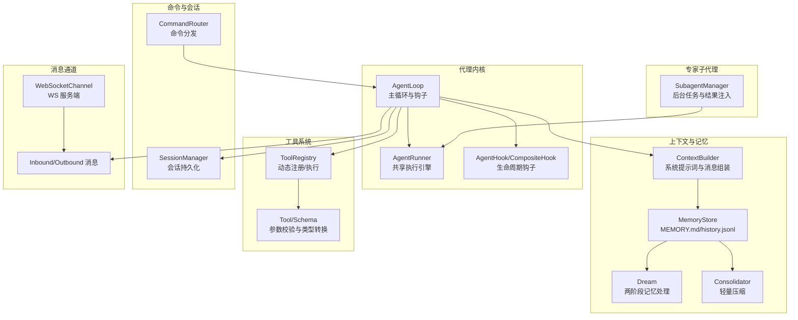
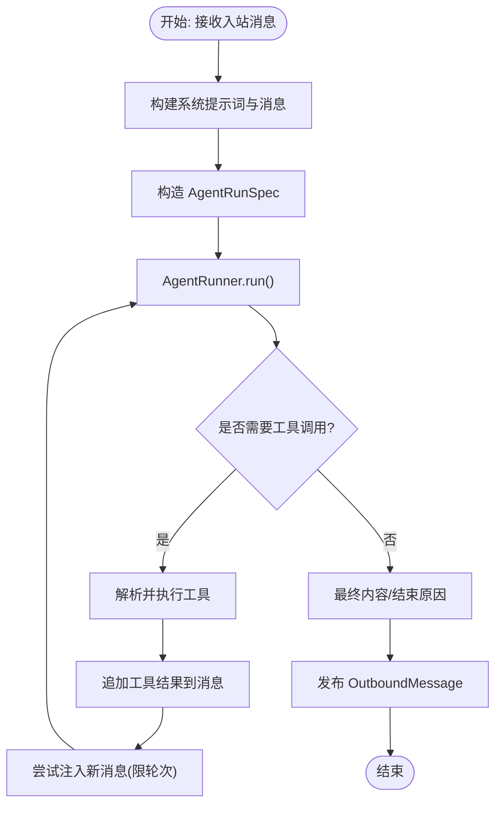
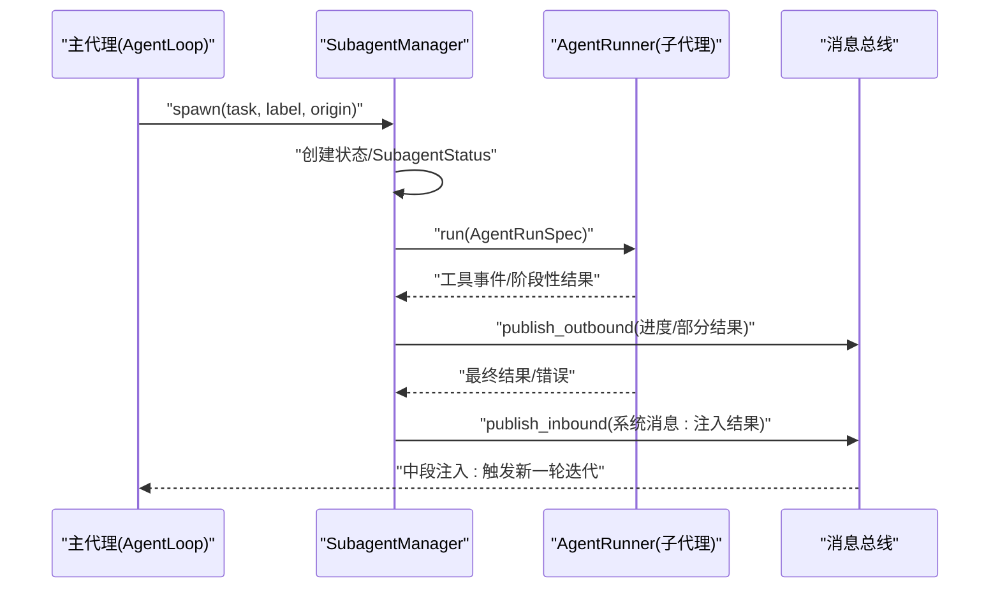
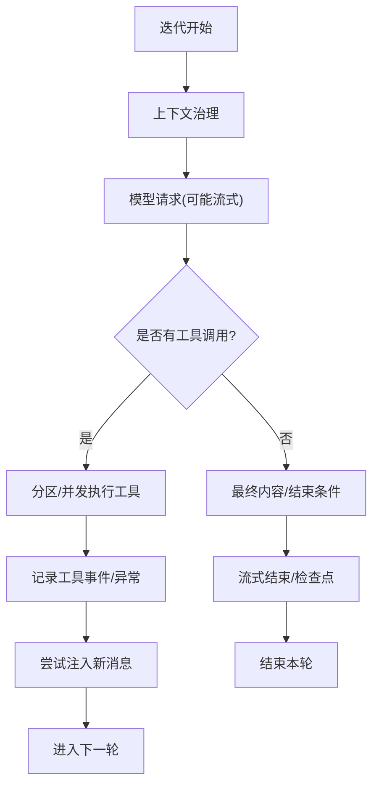
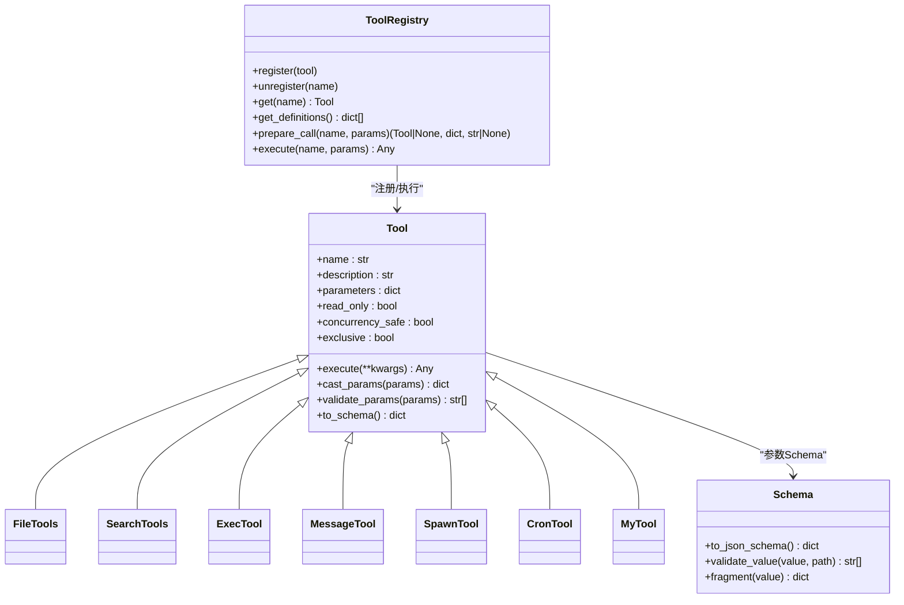
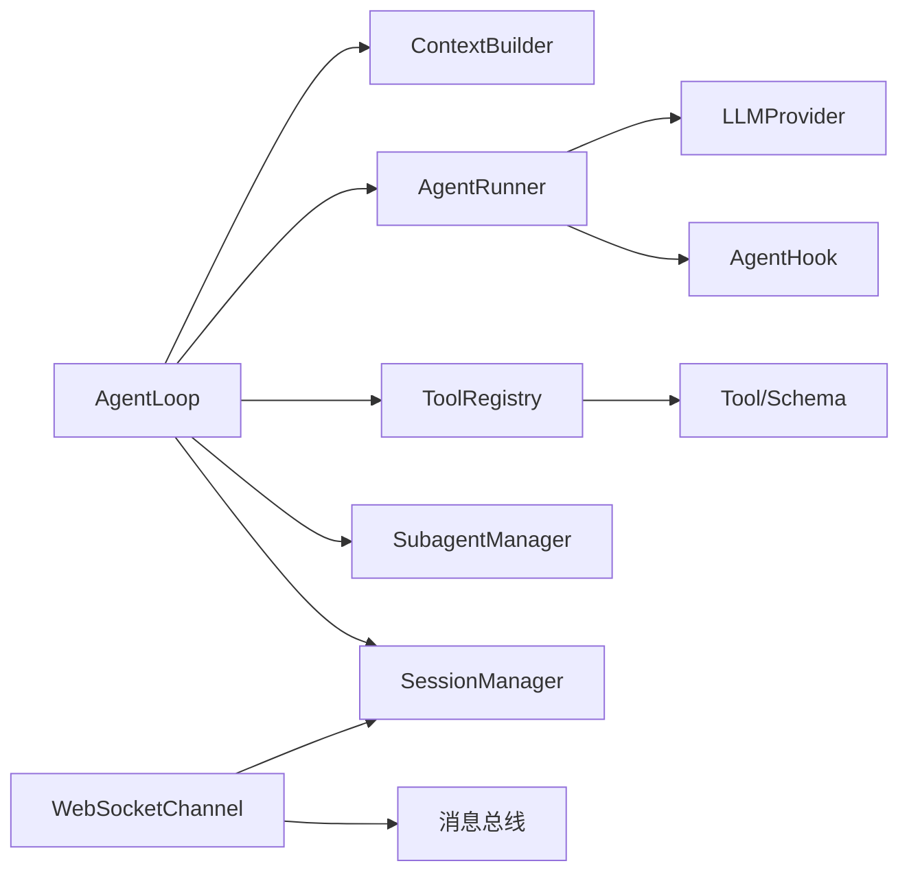

# 核心概念

<cite>
**本文引用的文件**
- [secbot/agent/loop.py](file://secbot/agent/loop.py)
- [secbot/agent/context.py](file://secbot/agent/context.py)
- [secbot/agent/memory.py](file://secbot/agent/memory.py)
- [secbot/agent/tools/registry.py](file://secbot/agent/tools/registry.py)
- [secbot/agent/tools/base.py](file://secbot/agent/tools/base.py)
- [secbot/agent/tools/schema.py](file://secbot/agent/tools/schema.py)
- [secbot/agent/skills.py](file://secbot/agent/skills.py)
- [secbot/agent/subagent.py](file://secbot/agent/subagent.py)
- [secbot/agent/runner.py](file://secbot/agent/runner.py)
- [secbot/agent/hook.py](file://secbot/agent/hook.py)
- [secbot/command/router.py](file://secbot/command/router.py)
- [secbot/bus/events.py](file://secbot/bus/events.py)
- [secbot/session/manager.py](file://secbot/session/manager.py)
- [secbot/channels/websocket.py](file://secbot/channels/websocket.py)
</cite>

## 目录
1. [引言](#引言)
2. [项目结构](#项目结构)
3. [核心组件](#核心组件)
4. [架构总览](#架构总览)
5. [详细组件分析](#详细组件分析)
6. [依赖分析](#依赖分析)
7. [性能考量](#性能考量)
8. [故障排查指南](#故障排查指南)
9. [结论](#结论)
10. [附录](#附录)

## 引言
本文件面向 nanobot VAPT3 的开发者与使用者，系统化阐述“代理循环（Agent Loop）”的工作机制、专家智能体系统的设计理念、LLM Function Calling 在动态规划中的作用、工具系统的架构、以及消息通道系统（含 WebSocket 与多 IM 平台集成）。文档以循序渐进的方式，从高层到代码级细节，帮助读者建立对各模块交互关系的清晰认知，并提供可操作的使用模式与排障建议。

## 项目结构
- 代理内核：围绕 AgentLoop 展开，负责消息接收、上下文构建、LLM 调用、工具执行、响应发送与状态维护。
- 上下文与记忆：ContextBuilder 组装系统提示词与历史；MemoryStore/Consolidator/Dream 管理长期记忆、会话历史与压缩。
- 工具体系：ToolRegistry 动态注册与执行工具；Schema/Schema 参数校验；具体工具实现位于 tools 子包。
- 专家子代理：SubagentManager 支持后台子任务执行与结果注入，实现专家级任务编排。
- 命令路由：CommandRouter 提供优先命令、精确命令与前缀命令的分发。
- 消息总线与会话：Inbound/Outbound 消息事件模型；SessionManager 管理会话持久化与恢复。
- 通道系统：WebSocketChannel 作为 WebSocket 服务器，统一接入多 IM 平台。



图表来源
- [secbot/agent/loop.py](file://secbot/agent/loop.py)
- [secbot/agent/runner.py](file://secbot/agent/runner.py)
- [secbot/agent/context.py](file://secbot/agent/context.py)
- [secbot/agent/memory.py](file://secbot/agent/memory.py)
- [secbot/agent/tools/registry.py](file://secbot/agent/tools/registry.py)
- [secbot/agent/tools/base.py](file://secbot/agent/tools/base.py)
- [secbot/agent/subagent.py](file://secbot/agent/subagent.py)
- [secbot/command/router.py](file://secbot/command/router.py)
- [secbot/session/manager.py](file://secbot/session/manager.py)
- [secbot/bus/events.py](file://secbot/bus/events.py)
- [secbot/channels/websocket.py](file://secbot/channels/websocket.py)

章节来源
- [secbot/agent/loop.py](file://secbot/agent/loop.py)
- [secbot/agent/context.py](file://secbot/agent/context.py)
- [secbot/agent/memory.py](file://secbot/agent/memory.py)
- [secbot/agent/tools/registry.py](file://secbot/agent/tools/registry.py)
- [secbot/agent/tools/base.py](file://secbot/agent/tools/base.py)
- [secbot/agent/tools/schema.py](file://secbot/agent/tools/schema.py)
- [secbot/agent/skills.py](file://secbot/agent/skills.py)
- [secbot/agent/subagent.py](file://secbot/agent/subagent.py)
- [secbot/agent/runner.py](file://secbot/agent/runner.py)
- [secbot/agent/hook.py](file://secbot/agent/hook.py)
- [secbot/command/router.py](file://secbot/command/router.py)
- [secbot/bus/events.py](file://secbot/bus/events.py)
- [secbot/session/manager.py](file://secbot/session/manager.py)
- [secbot/channels/websocket.py](file://secbot/channels/websocket.py)

## 核心组件
- 代理循环（AgentLoop）
  - 负责消息消费、上下文构建、LLM 请求、工具执行、响应发布与状态维护。
  - 支持统一会话、并发控制、MCP 连接延迟初始化、运行时模型切换等能力。
- 执行引擎（AgentRunner）
  - 封装迭代式对话循环：上下文治理、模型请求、工具批处理、注入消息、流式输出与错误恢复。
- 上下文构建（ContextBuilder）
  - 组合身份、引导文件、记忆、技能摘要、近期历史与运行时元信息，生成最终消息列表。
- 记忆与压缩（MemoryStore/Consolidator/Dream）
  - 文件化存储长期记忆与历史；按令牌预算进行压缩；两阶段处理历史以支持编辑型总结。
- 工具系统（ToolRegistry/Tool/Schema）
  - 动态注册与执行；参数类型转换与 JSON Schema 校验；支持并发安全与独占工具。
- 专家子代理（SubagentManager）
  - 后台子任务执行，实时进度上报，完成结果注入主循环，实现专家级任务编排。
- 命令路由（CommandRouter）
  - 优先命令、精确命令、前缀命令与拦截器，支持 /stop、/restart 等控制命令。
- 会话管理（SessionManager）
  - 会话持久化、迁移修复、文件上限与裁剪策略。
- 消息通道（WebSocketChannel）
  - 作为 WebSocket 服务器，提供鉴权、令牌签发、媒体文件签名下载、REST 辅助接口。

章节来源
- [secbot/agent/loop.py](file://secbot/agent/loop.py)
- [secbot/agent/runner.py](file://secbot/agent/runner.py)
- [secbot/agent/context.py](file://secbot/agent/context.py)
- [secbot/agent/memory.py](file://secbot/agent/memory.py)
- [secbot/agent/tools/registry.py](file://secbot/agent/tools/registry.py)
- [secbot/agent/tools/base.py](file://secbot/agent/tools/base.py)
- [secbot/agent/tools/schema.py](file://secbot/agent/tools/schema.py)
- [secbot/agent/subagent.py](file://secbot/agent/subagent.py)
- [secbot/command/router.py](file://secbot/command/router.py)
- [secbot/session/manager.py](file://secbot/session/manager.py)
- [secbot/channels/websocket.py](file://secbot/channels/websocket.py)

## 架构总览
下图展示 AgentLoop 如何串联上下文、记忆、工具、子代理与通道系统，形成“输入消息 → 上下文构建 → LLM 请求 → 工具执行 → 结果注入 → 输出响应”的闭环。

```mermaid
sequenceDiagram
participant CH as "通道/客户端"
participant BUS as "消息总线"
participant LOOP as "AgentLoop"
participant CTX as "ContextBuilder"
participant RUN as "AgentRunner"
participant TOOLS as "ToolRegistry"
participant SUB as "SubagentManager"
participant MEM as "MemoryStore/Consolidator/Dream"
CH->>BUS : "InboundMessage"
BUS-->>LOOP : "入站消息"
LOOP->>CTX : "构建系统提示词与消息"
LOOP->>RUN : "AgentRunSpec(初始消息, 工具定义, 配置)"
RUN->>RUN : "上下文治理/压缩/截断"
RUN->>RUN : "模型请求(支持流式/进度)"
alt "需要工具调用"
RUN->>TOOLS : "解析工具调用"
TOOLS-->>RUN : "执行结果"
RUN->>MEM : "写入历史/记忆"
end
RUN-->>LOOP : "最终内容/工具事件"
LOOP->>SUB : "spawn 子代理(可选)"
LOOP->>BUS : "OutboundMessage"
BUS-->>CH : "响应/流式片段"
```

图表来源
- [secbot/agent/loop.py](file://secbot/agent/loop.py)
- [secbot/agent/runner.py](file://secbot/agent/runner.py)
- [secbot/agent/context.py](file://secbot/agent/context.py)
- [secbot/agent/memory.py](file://secbot/agent/memory.py)
- [secbot/agent/tools/registry.py](file://secbot/agent/tools/registry.py)
- [secbot/agent/subagent.py](file://secbot/agent/subagent.py)
- [secbot/bus/events.py](file://secbot/bus/events.py)

## 详细组件分析

### 代理循环（AgentLoop）工作机制
- 控制流
  - run() 主循环：持续消费入站消息，按会话键串行处理，支持统一会话与并发门控。
  - _dispatch()：基于会话锁与并发门控，将消息派发至 _process_message()。
  - _process_message()：构建运行时上下文，设置工具路由上下文，调用 _run_agent_loop()。
  - _run_agent_loop()：封装 AgentRunner.run()，注入钩子、进度回调、流式回调、检查点与注入回调。
- 上下文构建
  - ContextBuilder.build_system_prompt() 组合身份、引导文件、记忆、技能摘要与近期历史。
  - build_messages() 将用户内容与运行时元信息合并为单条用户消息，避免角色连续性问题。
- 工具调用与内存管理
  - _set_tool_context() 为 message/spawn/cron/my 等工具设置路由上下文，确保跨会话/线程正确回注。
  - MemoryStore/Consolidator/Dream 负责历史压缩与长期记忆写入，避免上下文溢出。
- 状态维护
  - 通过 SessionManager 保存/加载会话；AutoCompact 定期清理过期会话；_pending_queues 实现中段注入。
- 流式与进度
  - _LoopHook 支持增量流式输出与工具事件上报；on_progress/on_stream/on_stream_end 生命周期钩子。



图表来源
- [secbot/agent/loop.py](file://secbot/agent/loop.py)
- [secbot/agent/runner.py](file://secbot/agent/runner.py)
- [secbot/agent/context.py](file://secbot/agent/context.py)
- [secbot/agent/memory.py](file://secbot/agent/memory.py)

章节来源
- [secbot/agent/loop.py](file://secbot/agent/loop.py)
- [secbot/agent/context.py](file://secbot/agent/context.py)
- [secbot/agent/memory.py](file://secbot/agent/memory.py)
- [secbot/session/manager.py](file://secbot/session/manager.py)

### 专家智能体系统（SubagentManager）
- 设计理念
  - 通过 spawn 创建后台子代理，隔离工具集与权限，独立执行复杂任务。
  - 使用 _SubagentHook 实时上报工具事件与进度，主代理在中段注入子代理结果。
- 生命周期与触发
  - spawn() 创建任务、状态对象与后台任务；_run_subagent() 构建子代理系统提示词与工具集，调用 AgentRunner.run()。
  - _announce_result() 以系统消息形式注入主代理的 _pending_queues，实现无缝衔接。
- 任务编排
  - 支持取消指定会话的所有子代理；统计运行中的子代理数量；限制并发数。



图表来源
- [secbot/agent/subagent.py](file://secbot/agent/subagent.py)
- [secbot/agent/runner.py](file://secbot/agent/runner.py)
- [secbot/bus/events.py](file://secbot/bus/events.py)

章节来源
- [secbot/agent/subagent.py](file://secbot/agent/subagent.py)
- [secbot/agent/runner.py](file://secbot/agent/runner.py)

### LLM Function Calling 在动态规划中的作用
- 动态规划思路
  - AgentRunner.run() 在每轮迭代中：
    - 上下文治理：丢弃孤儿工具结果、回填缺失结果、微压缩、应用工具结果预算、截断历史。
    - 模型请求：根据配置选择流式或非流式；支持超时保护与重试等待回调。
    - 工具执行：按批分区，支持并发与独占工具；记录工具事件；处理 AskUser 中断。
    - 注入与恢复：在工具后、最终回复后尝试注入新消息；空内容/长度截断/模型错误时进行恢复。
- 无流程图的智能调度
  - 通过“工具调用 + 注入 + 流式输出”的组合，无需预设流程图即可实现自适应调度。
  - 注入机制允许在一轮内多次插入用户消息，保持主代理对上下文的掌控。



图表来源
- [secbot/agent/runner.py](file://secbot/agent/runner.py)

章节来源
- [secbot/agent/runner.py](file://secbot/agent/runner.py)

### 工具系统架构（注册、参数验证与执行）
- 注册与执行
  - ToolRegistry.register/unregister：动态注册/注销工具；缓存工具定义，稳定顺序。
  - execute()/prepare_call()：参数类型转换与 JSON Schema 校验；错误包装与提示。
- 参数验证
  - Tool.parameters 由 JSON Schema 描述；Schema.validate_json_schema_value 提供通用校验。
  - Tool.cast_params() 进行安全类型转换（字符串数字/布尔/数组/对象）。
- 典型工具
  - 文件系统类（Read/Write/Edit/List/Glob/Grep）、搜索类（WebSearch/WebFetch）、执行类（Exec）、消息类（Message）、Spawn、Cron、My 等。
- MCP 集成
  - AgentLoop._connect_mcp() 延迟连接 MCP 服务器并将工具注册到 ToolRegistry。



图表来源
- [secbot/agent/tools/base.py](file://secbot/agent/tools/base.py)
- [secbot/agent/tools/schema.py](file://secbot/agent/tools/schema.py)
- [secbot/agent/tools/registry.py](file://secbot/agent/tools/registry.py)

章节来源
- [secbot/agent/tools/registry.py](file://secbot/agent/tools/registry.py)
- [secbot/agent/tools/base.py](file://secbot/agent/tools/base.py)
- [secbot/agent/tools/schema.py](file://secbot/agent/tools/schema.py)
- [secbot/agent/loop.py](file://secbot/agent/loop.py)

### 消息通道系统（WebSocket 与多 IM 平台集成）
- WebSocketChannel
  - 作为 WebSocket 服务器，提供握手鉴权、令牌签发/校验、订阅管理、媒体签名下载、REST 辅助接口。
  - 支持多路复用：每个连接可订阅多个 chat_id；默认 chat_id 用于兼容旧帧。
- 多 IM 平台接入
  - 通过 channel 字段区分平台（如 telegram/discord/slack），chat_id 表示群组/私聊标识。
  - InboundMessage.session_key 统一会话键，支持统一会话与线程会话。
- 传输与安全
  - 支持 WSS；令牌有效期与最大未决令牌数限制；媒体路径签名访问；静态资源托管。

```mermaid
sequenceDiagram
participant Client as "客户端"
participant WS as "WebSocketChannel"
participant Bus as "消息总线"
participant Loop as "AgentLoop"
Client->>WS : "GET /api/token_issue_path 或 /webui/bootstrap"
WS-->>Client : "返回令牌/WS路径"
Client->>WS : "WebSocket 升级(携带令牌/客户端ID)"
WS-->>Client : "握手鉴权/订阅管理"
Client->>WS : "文本/JSON 消息"
WS->>Bus : "InboundMessage"
Bus-->>Loop : "入站消息"
Loop-->>Bus : "OutboundMessage"
Bus-->>WS : "出站消息"
WS-->>Client : "推送消息/流式片段"
```

图表来源
- [secbot/channels/websocket.py](file://secbot/channels/websocket.py)
- [secbot/bus/events.py](file://secbot/bus/events.py)
- [secbot/agent/loop.py](file://secbot/agent/loop.py)

章节来源
- [secbot/channels/websocket.py](file://secbot/channels/websocket.py)
- [secbot/bus/events.py](file://secbot/bus/events.py)
- [secbot/agent/loop.py](file://secbot/agent/loop.py)

### 技能系统与上下文注入
- SkillsLoader
  - 列举工作区与内置技能，过滤不可用技能；加载技能内容并去除 YAML frontmatter；构建技能摘要。
- ContextBuilder
  - build_system_prompt() 组合身份、引导文件、记忆、技能摘要与近期历史。
  - build_messages() 合并运行时元信息与用户内容，避免角色连续性问题。
- 记忆与历史
  - MemoryStore 提供 MEMORY.md、SOUL.md、USER.md 与 history.jsonl 的读写；支持游标与压缩。
  - Consolidator 按令牌预算选择用户回合边界进行压缩；Dream 两阶段处理历史并可编辑文件。

章节来源
- [secbot/agent/skills.py](file://secbot/agent/skills.py)
- [secbot/agent/context.py](file://secbot/agent/context.py)
- [secbot/agent/memory.py](file://secbot/agent/memory.py)

### 命令路由与控制
- CommandRouter
  - 三段式匹配：优先命令（/stop、/restart）、精确命令、前缀命令；支持拦截器。
  - is_priority()/is_dispatchable_command() 用于快速判定；dispatch_priority()/dispatch() 分发处理。
- AgentLoop 中的应用
  - run() 对入站消息先判定优先命令，再进入会话派发；支持直接在循环内执行命令并发布结果。

章节来源
- [secbot/command/router.py](file://secbot/command/router.py)
- [secbot/agent/loop.py](file://secbot/agent/loop.py)

## 依赖分析
- 组件耦合
  - AgentLoop 依赖 ContextBuilder、ToolRegistry、SessionManager、AgentRunner、SubagentManager、MessageBus。
  - AgentRunner 依赖 LLMProvider、ToolRegistry、AgentHook；内部包含上下文治理与注入逻辑。
  - ToolRegistry 依赖具体 Tool 实现与 Schema；支持并发工具批处理。
  - WebSocketChannel 依赖消息总线与会话管理，提供 REST 辅助接口。
- 外部依赖
  - LLMProvider：抽象模型调用接口，支持流式与重试。
  - tiktoken：令牌估算与截断。
  - websockets：WebSocket 服务端库。
- 循环依赖
  - 未发现直接循环依赖；模块间通过接口与数据类解耦。



图表来源
- [secbot/agent/loop.py](file://secbot/agent/loop.py)
- [secbot/agent/runner.py](file://secbot/agent/runner.py)
- [secbot/agent/context.py](file://secbot/agent/context.py)
- [secbot/agent/tools/registry.py](file://secbot/agent/tools/registry.py)
- [secbot/agent/tools/base.py](file://secbot/agent/tools/base.py)
- [secbot/agent/subagent.py](file://secbot/agent/subagent.py)
- [secbot/session/manager.py](file://secbot/session/manager.py)
- [secbot/channels/websocket.py](file://secbot/channels/websocket.py)

章节来源
- [secbot/agent/loop.py](file://secbot/agent/loop.py)
- [secbot/agent/runner.py](file://secbot/agent/runner.py)
- [secbot/agent/tools/registry.py](file://secbot/agent/tools/registry.py)
- [secbot/agent/tools/base.py](file://secbot/agent/tools/base.py)
- [secbot/agent/subagent.py](file://secbot/agent/subagent.py)
- [secbot/session/manager.py](file://secbot/session/manager.py)
- [secbot/channels/websocket.py](file://secbot/channels/websocket.py)

## 性能考量
- 上下文治理
  - Consolidator 依据令牌预算与安全缓冲进行压缩，避免超出模型上下文窗口。
  - _replay_token_budget() 动态计算可用输入令牌预算，平衡输出与历史。
- 并发与节流
  - SECBOT_MAX_CONCURRENT_REQUESTS 控制并发请求数；SubagentManager 限制子代理并发。
  - 工具批处理支持并发安全工具并行执行。
- I/O 与持久化
  - SessionManager 采用原子写入与目录 fsync，保证崩溃后的数据一致性。
  - MemoryStore 历史文件写入采用临时文件替换，减少损坏风险。
- 流式与进度
  - 流式输出与进度回调降低首字延迟；WebSocketChannel 支持分段流式与结束标记。

## 故障排查指南
- 常见问题
  - 模型错误/超时：AgentRunner._request_model() 支持超时与错误恢复；检查 SECBOT_LLM_TIMEOUT_S。
  - 空响应/截断：AgentRunner 对空内容与长度截断进行恢复尝试；必要时调整 max_tokens。
  - 工具参数错误：ToolRegistry.prepare_call() 返回参数校验错误；检查 Tool.parameters。
  - 注入丢失：_try_drain_injections() 限制每轮注入数量；确认 injection_callback 正常。
  - WebSocket 鉴权失败：检查 token_issue_secret、token 与 allow_from 配置。
- 关键日志
  - AgentLoop/_LoopHook：工具调用、流式增量、进度事件。
  - MemoryStore：历史写入、游标更新、压缩与降级归档。
  - SubagentManager：子代理启动、进度上报、结果注入与错误状态。

章节来源
- [secbot/agent/runner.py](file://secbot/agent/runner.py)
- [secbot/agent/loop.py](file://secbot/agent/loop.py)
- [secbot/agent/memory.py](file://secbot/agent/memory.py)
- [secbot/agent/subagent.py](file://secbot/agent/subagent.py)
- [secbot/channels/websocket.py](file://secbot/channels/websocket.py)

## 结论
nanobot VAPT3 通过“代理循环 + 执行引擎 + 上下文/记忆 + 工具系统 + 专家子代理 + 命令路由 + 通道系统”的协同，实现了无需流程图的智能调度与多平台接入。其核心优势在于：
- 动态规划的 Function Calling 与注入机制，使调度灵活且可控；
- 工具注册与参数校验保障了扩展性与安全性；
- 记忆压缩与会话持久化兼顾性能与可靠性；
- WebSocket 通道统一接入多 IM 平台，便于部署与运维。

## 附录
- 使用模式建议
  - 自定义工具：基于 Tool/Schema 编写参数 Schema，注册到 ToolRegistry；在 AgentLoop 中启用。
  - 子代理编排：通过 SubagentManager.spawn 创建后台任务，利用进度回调与结果注入实现专家级任务。
  - 通道集成：在 WebSocketChannel 中配置令牌与鉴权，结合消息总线实现跨平台消息流转。
- 参考路径
  - 代理循环入口：[secbot/agent/loop.py](file://secbot/agent/loop.py)
  - 执行引擎：[secbot/agent/runner.py](file://secbot/agent/runner.py)
  - 工具注册与执行：[secbot/agent/tools/registry.py](file://secbot/agent/tools/registry.py)
  - 参数校验与类型转换：[secbot/agent/tools/base.py](file://secbot/agent/tools/base.py)、[secbot/agent/tools/schema.py](file://secbot/agent/tools/schema.py)
  - 记忆与压缩：[secbot/agent/memory.py](file://secbot/agent/memory.py)
  - 技能加载：[secbot/agent/skills.py](file://secbot/agent/skills.py)
  - 子代理管理：[secbot/agent/subagent.py](file://secbot/agent/subagent.py)
  - 命令路由：[secbot/command/router.py](file://secbot/command/router.py)
  - 会话管理：[secbot/session/manager.py](file://secbot/session/manager.py)
  - 消息事件：[secbot/bus/events.py](file://secbot/bus/events.py)
  - WebSocket 通道：[secbot/channels/websocket.py](file://secbot/channels/websocket.py)