# WebSocket通道实现

<cite>
**本文档引用的文件**
- [websocket.md](file://docs/websocket.md)
- [websocket.py](file://secbot/channels/websocket.py)
- [base.py](file://secbot/channels/base.py)
- [manager.py](file://secbot/channels/manager.py)
- [registry.py](file://secbot/channels/registry.py)
- [test_websocket_channel.py](file://tests/channels/test_websocket_channel.py)
- [test_websocket_integration.py](file://tests/channels/test_websocket_integration.py)
</cite>

## 目录
1. [简介](#简介)
2. [项目结构](#项目结构)
3. [核心组件](#核心组件)
4. [架构概览](#架构概览)
5. [详细组件分析](#详细组件分析)
6. [依赖关系分析](#依赖关系分析)
7. [性能考虑](#性能考虑)
8. [故障排除指南](#故障排除指南)
9. [结论](#结论)

## 简介

WebSocket通道实现是Nanobot项目中的一个关键组件，它允许外部客户端通过持久连接与代理进行实时双向通信。该实现提供了完整的WebSocket服务器功能，包括SSL/TLS支持、连接参数配置、安全认证机制、消息序列化和反序列化、订阅管理、媒体文件处理等功能。

## 项目结构

WebSocket通道实现位于`secbot/channels/`目录下，主要包含以下文件：

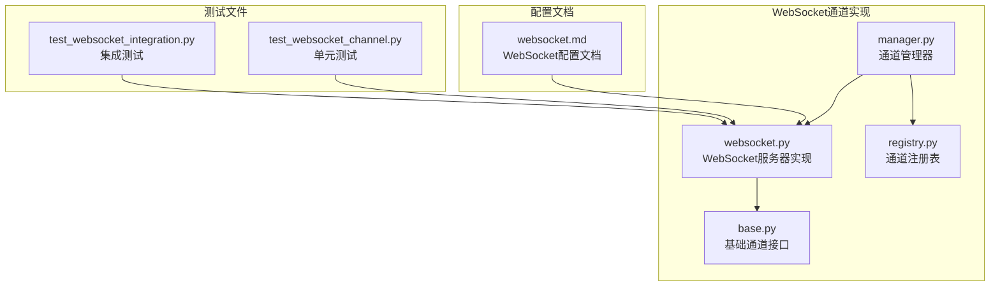

**图表来源**
- [websocket.py:1-1473](file://secbot/channels/websocket.py#L1-L1473)
- [base.py:1-201](file://secbot/channels/base.py#L1-L201)
- [manager.py:1-428](file://secbot/channels/manager.py#L1-L428)
- [registry.py:1-72](file://secbot/channels/registry.py#L1-L72)

**章节来源**
- [websocket.py:1-1473](file://secbot/channels/websocket.py#L1-L1473)
- [base.py:1-201](file://secbot/channels/base.py#L1-L201)
- [manager.py:1-428](file://secbot/channels/manager.py#L1-L428)
- [registry.py:1-72](file://secbot/channels/registry.py#L1-L72)

## 核心组件

WebSocket通道实现的核心组件包括：

### WebSocketConfig配置类
负责WebSocket服务器的配置管理，包括连接参数、认证设置、安全选项等。

### WebSocketChannel主类
实现WebSocket服务器的主要逻辑，包括连接处理、消息路由、订阅管理等。

### 认证系统
支持静态令牌、临时令牌和API令牌三种认证方式。

### 媒体文件处理
支持图片上传、视频处理和安全的媒体文件访问。

**章节来源**
- [websocket.py:66-142](file://secbot/channels/websocket.py#L66-L142)
- [websocket.py:414-453](file://secbot/channels/websocket.py#L414-L453)
- [websocket.py:1088-1107](file://secbot/channels/websocket.py#L1088-L1107)

## 架构概览

WebSocket通道实现采用模块化设计，遵循基础通道接口规范：

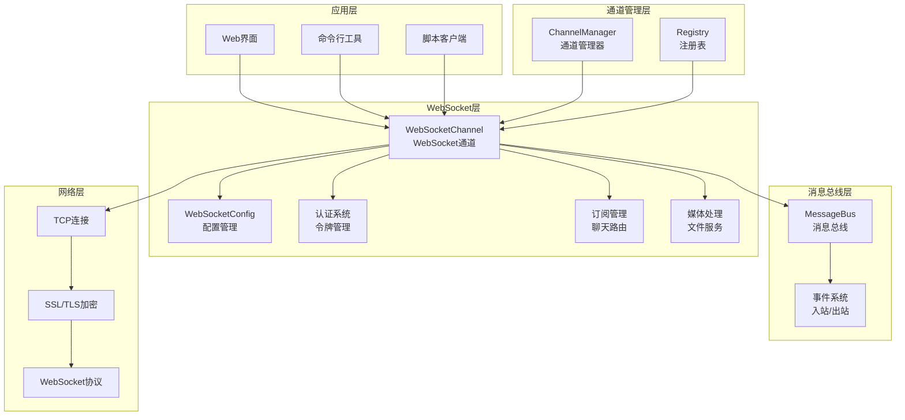

**图表来源**
- [manager.py:41-112](file://secbot/channels/manager.py#L41-L112)
- [websocket.py:414-453](file://secbot/channels/websocket.py#L414-L453)
- [base.py:15-44](file://secbot/channels/base.py#L15-L44)

## 详细组件分析

### WebSocket服务器启动和配置

WebSocket服务器的启动过程包括配置验证、SSL上下文构建、服务器实例化和监听端口绑定：

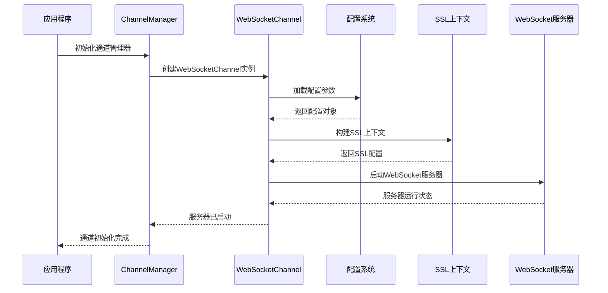

**图表来源**
- [websocket.py:1108-1155](file://secbot/channels/websocket.py#L1108-L1155)
- [manager.py:173-198](file://secbot/channels/manager.py#L173-L198)

服务器启动的关键配置参数包括：
- **连接参数**：主机地址、端口、路径、最大消息大小
- **认证设置**：静态令牌、令牌颁发路径、令牌TTL
- **安全选项**：SSL证书、密钥文件、最小TLS版本
- **性能参数**：ping间隔、ping超时、流式传输

**章节来源**
- [websocket.py:86-106](file://secbot/channels/websocket.py#L86-L106)
- [websocket.py:1108-1155](file://secbot/channels/websocket.py#L1108-L1155)

### SSL/TLS支持实现

SSL/TLS支持通过标准Python ssl模块实现，确保WebSocket连接的安全性：

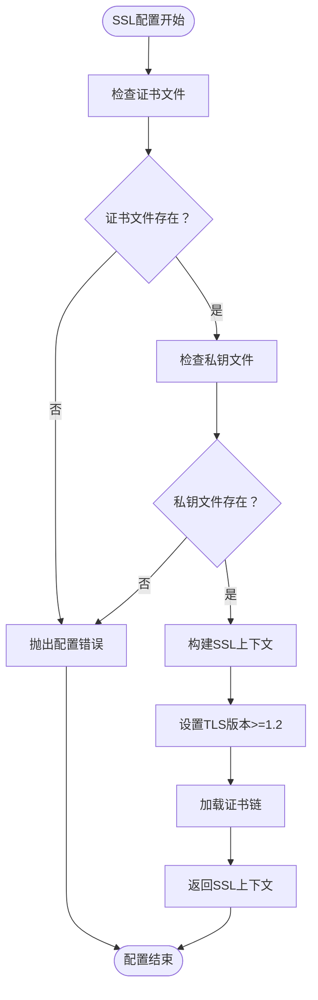

**图表来源**
- [websocket.py:492-504](file://secbot/channels/websocket.py#L492-L504)

SSL配置的关键特性：
- 强制TLSv1.2及以上版本
- 支持PEM格式证书和私钥
- 自动证书链验证
- 安全的密码套件选择

**章节来源**
- [websocket.py:492-504](file://secbot/channels/websocket.py#L492-L504)

### 连接参数设置

WebSocket连接参数通过配置类统一管理，支持灵活的参数定制：

| 参数名称 | 类型 | 默认值 | 描述 |
|---------|------|--------|------|
| enabled | bool | False | 是否启用WebSocket服务器 |
| host | string | "127.0.0.1" | 绑定地址，支持0.0.0.0接受外网连接 |
| port | int | 8765 | 监听端口 |
| path | string | "/" | WebSocket升级路径，尾部斜杠规范化 |
| maxMessageBytes | int | 37,748,736 | 最大入站消息大小（1KB-40MB） |
| streaming | bool | True | 是否启用流式传输模式 |

**章节来源**
- [websocket.py:86-101](file://secbot/channels/websocket.py#L86-L101)

### 安全认证机制

WebSocket通道实现支持三种认证方式，提供多层次的安全保护：

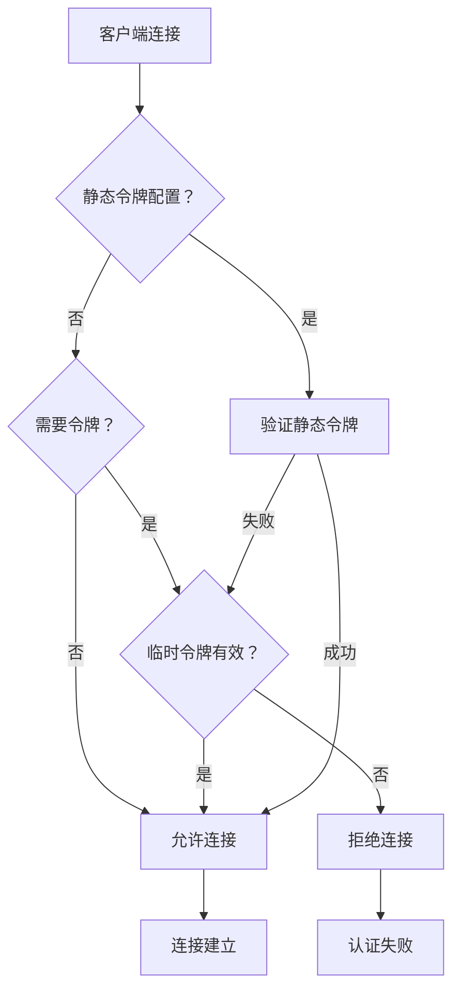

**图表来源**
- [websocket.py:1088-1107](file://secbot/channels/websocket.py#L1088-L1107)

#### 静态令牌（Static Tokens）
- 配置在配置文件中的共享密钥
- 用于简单部署场景
- 使用时间安全比较防止时序攻击

#### 临时令牌（Issued Tokens）
- 通过专用API动态生成的一次性令牌
- 支持TTL过期机制
- 推荐用于生产环境

#### API令牌（API Tokens）
- 用于嵌入式WebUI的REST接口访问
- 多次使用但有TTL限制
- 与临时令牌共享相同的令牌池

**章节来源**
- [websocket.py:1088-1107](file://secbot/channels/websocket.py#L1088-L1107)
- [websocket.py:438-442](file://secbot/channels/websocket.py#L438-L442)

### 消息序列化和反序列化

WebSocket通道实现了完整的消息序列化和反序列化机制，支持新旧两种消息格式：

#### 兼容性处理流程

```mermaid
flowchart TD
Input[输入消息] --> ParseType{"解析消息类型"}
ParseType --> |新格式(JSON)| ParseEnvelope["解析类型化信封"]
ParseType --> |旧格式(字符串)| ParsePayload["解析负载内容"]
ParseEnvelope --> ValidateChatID{"验证chat_id"}
ValidateChatID --> |有效| RouteMessage["路由到目标聊天"]
ValidateChatID --> |无效| SendError["发送错误响应"]
ParsePayload --> RouteLegacy["路由到默认聊天"]
RouteLegacy --> PublishBus["发布到消息总线"]
RouteMessage --> PublishBus
PublishBus --> Output[输出消息]
SendError --> Output
```

**图表来源**
- [websocket.py:1186-1207](file://secbot/channels/websocket.py#L1186-L1207)
- [websocket.py:241-261](file://secbot/channels/websocket.py#L241-L261)
- [websocket.py:212-230](file://secbot/channels/websocket.py#L212-L230)

#### 新消息格式（Typed Envelopes）

新格式支持复杂的聊天管理操作：

| 类型 | 字段 | 效果 |
|------|------|------|
| new_chat | - | 服务器生成新的chat_id，订阅连接，回复attached |
| attach | chat_id | 订阅现有chat_id（页面刷新后）回复attached |
| message | chat_id, content | 在chat_id上发送content，首次使用自动附加 |

#### 旧消息格式（向后兼容）

保持对传统文本帧和简单JSON对象的兼容：
- 纯文本帧：直接作为消息内容
- `{"content": "..."}`：提取content字段
- 支持`text`和`message`字段别名

**章节来源**
- [websocket.py:1281-1347](file://secbot/channels/websocket.py#L1281-L1347)
- [websocket.py:212-230](file://secbot/channels/websocket.py#L212-L230)

### 订阅管理系统

WebSocket通道实现了高效的订阅管理系统，支持多聊天会话的并发管理：

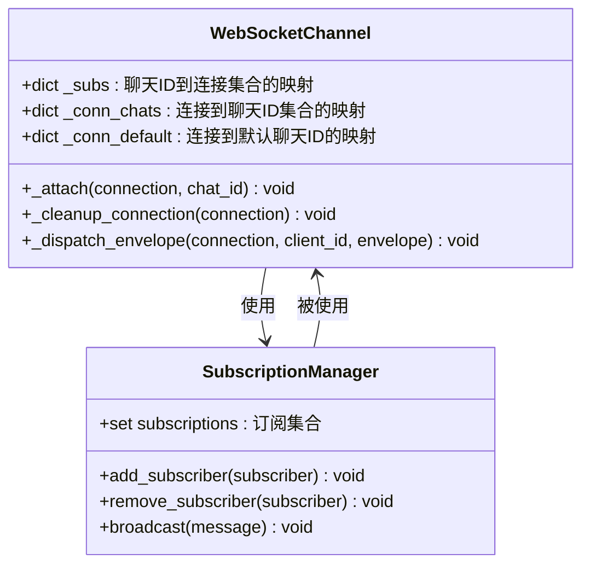

**图表来源**
- [websocket.py:454-472](file://secbot/channels/websocket.py#L454-L472)

#### 路由机制

订阅管理基于chat_id进行消息路由，实现一对多的消息分发：

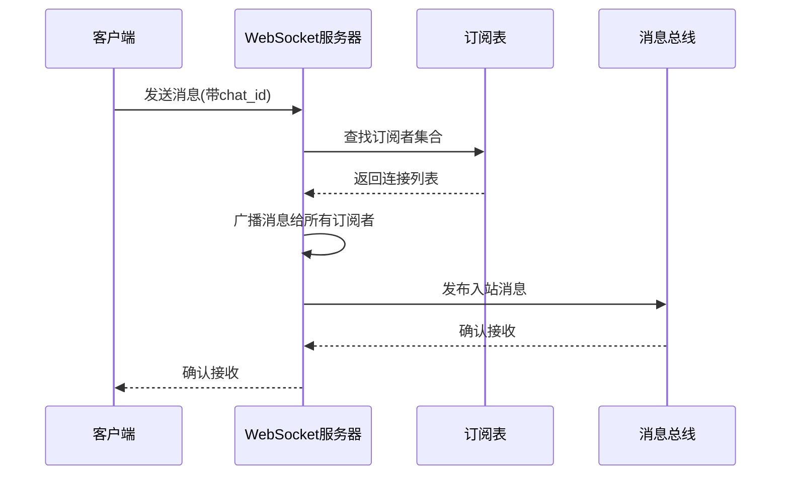

**图表来源**
- [websocket.py:1378-1429](file://secbot/channels/websocket.py#L1378-L1429)

#### 连接生命周期管理

连接生命周期包括连接建立、消息处理、异常处理和清理阶段：

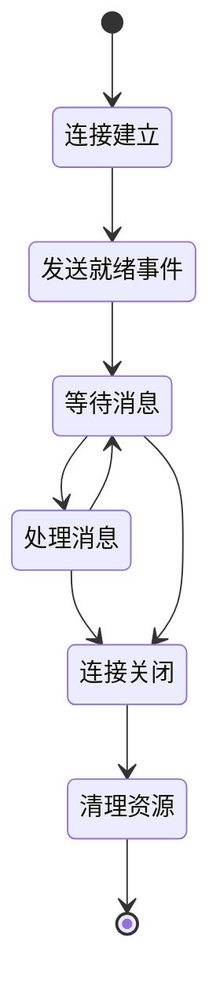

**图表来源**
- [websocket.py:1157-1212](file://secbot/channels/websocket.py#L1157-L1212)

**章节来源**
- [websocket.py:454-472](file://secbot/channels/websocket.py#L454-L472)
- [websocket.py:1157-1212](file://secbot/channels/websocket.py#L1157-L1212)

### 断线重连机制

WebSocket通道实现了智能的断线重连机制，确保连接的稳定性和可靠性：

#### 重连策略

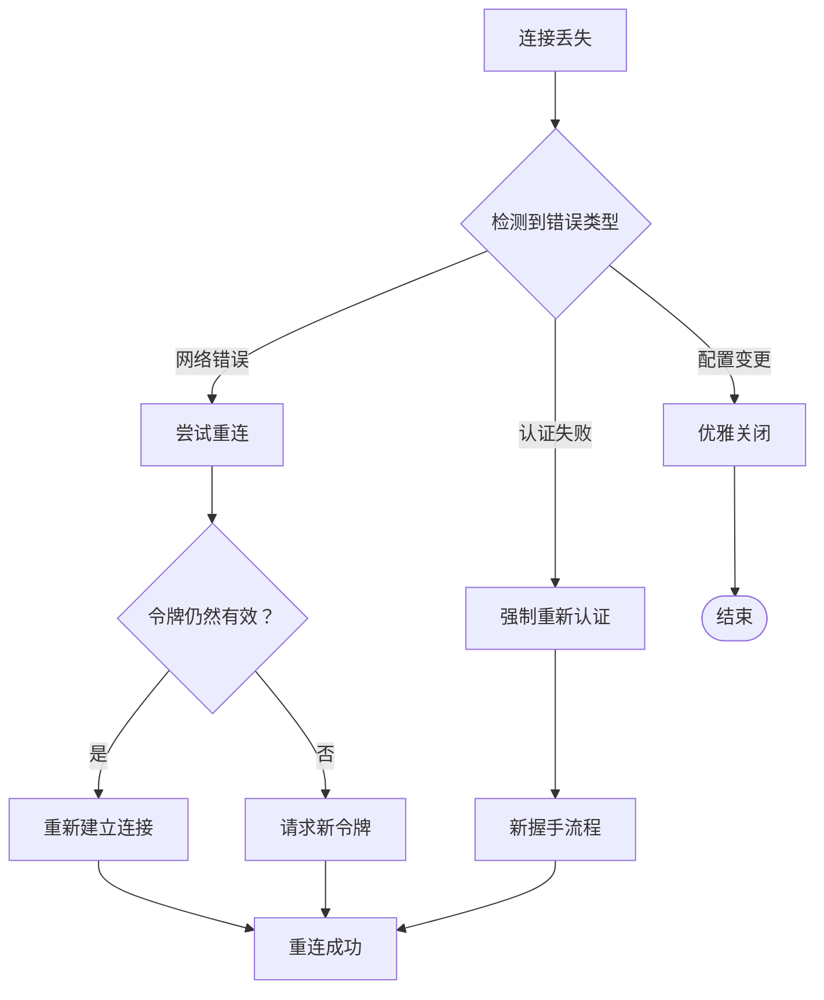

**图表来源**
- [websocket.py:1349-1366](file://secbot/channels/websocket.py#L1349-L1366)

#### Ping/Pong机制

服务器内置了心跳检测机制，确保连接的活跃状态：

- **Ping间隔**：可配置的ping发送间隔（5-300秒）
- **Ping超时**：等待pong响应的超时时间（5-300秒）
- **自动清理**：超时未响应的连接会被自动关闭

**章节来源**
- [websocket.py:102-103](file://secbot/channels/websocket.py#L102-L103)
- [websocket.py:1146-1149](file://secbot/channels/websocket.py#L1146-L1149)

### 媒体文件处理功能

WebSocket通道提供了完整的媒体文件处理能力，支持图片上传、视频处理和安全访问：

#### 媒体文件限制

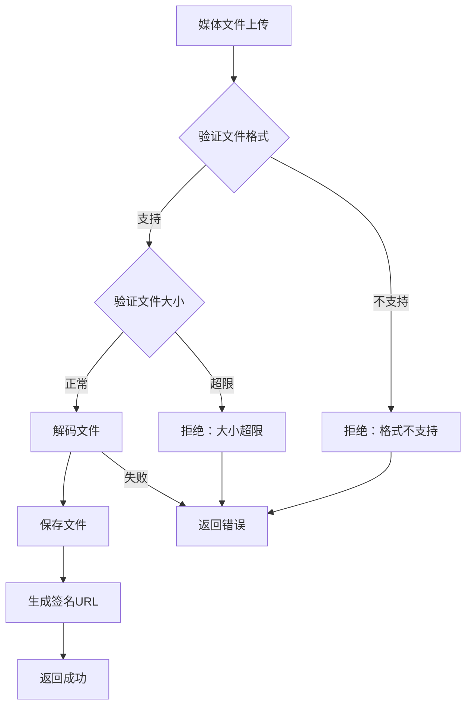

**图表来源**
- [websocket.py:1214-1279](file://secbot/channels/websocket.py#L1214-L1279)

#### 文件格式支持

| 文件类型 | 支持格式 | 大小限制 |
|----------|----------|----------|
| 图片 | PNG, JPEG, WEBP, GIF | 8MB每张 |
| 视频 | MP4, WebM, QuickTime | 20MB每个 |
| 数量限制 | 最多4张图片 | 最多1个视频 |

#### 安全访问控制

媒体文件通过签名URL进行安全访问，防止直接文件系统访问：

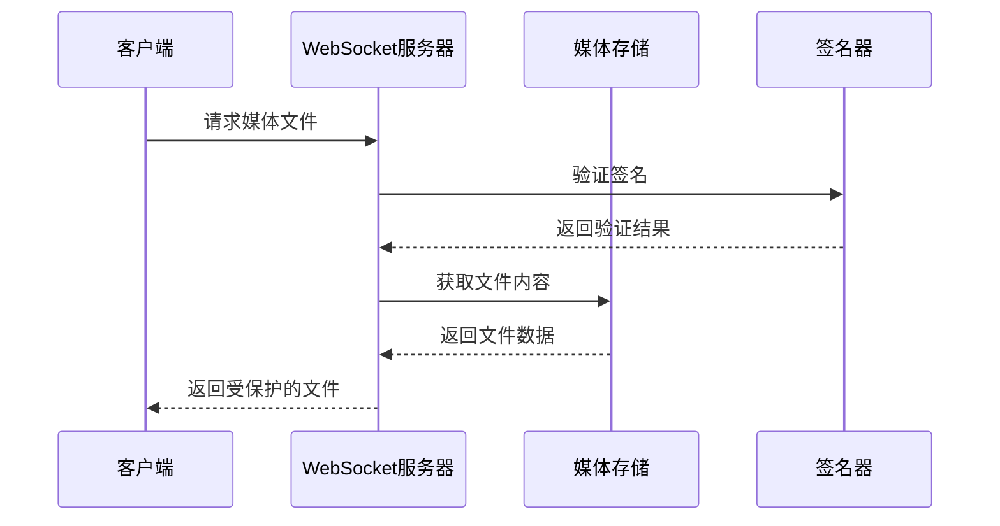

**图表来源**
- [websocket.py:980-1026](file://secbot/channels/websocket.py#L980-L1026)

**章节来源**
- [websocket.py:267-287](file://secbot/channels/websocket.py#L267-L287)
- [websocket.py:1214-1279](file://secbot/channels/websocket.py#L1214-L1279)

### 性能优化建议

WebSocket通道实现包含了多项性能优化措施：

#### 消息大小限制
- **默认限制**：36MB（支持最多4张8MB图片）
- **可配置范围**：1KB-40MB
- **动态调整**：根据使用场景调整限制值

#### 流式传输优化
- **增量合并**：合并连续的delta消息减少网络开销
- **流式结束标记**：明确的stream_end信号
- **多流并发**：支持多个流同时传输

#### 资源清理策略
- **连接超时**：自动清理长时间无响应的连接
- **令牌过期**：定期清理过期的临时令牌
- **内存管理**：及时释放不再使用的资源

**章节来源**
- [websocket.py:97-101](file://secbot/channels/websocket.py#L97-L101)
- [manager.py:330-378](file://secbot/channels/manager.py#L330-L378)

## 依赖关系分析

WebSocket通道实现的依赖关系清晰且模块化：

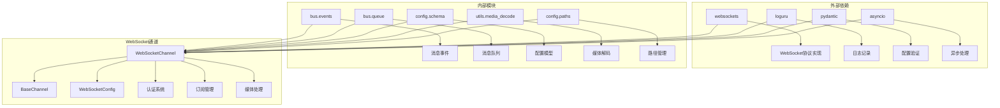

**图表来源**
- [websocket.py:32-43](file://secbot/channels/websocket.py#L32-L43)
- [base.py:11-12](file://secbot/channels/base.py#L11-L12)

**章节来源**
- [websocket.py:32-43](file://secbot/channels/websocket.py#L32-L43)
- [base.py:11-12](file://secbot/channels/base.py#L11-L12)

## 性能考虑

WebSocket通道实现采用了多项性能优化策略：

### 网络性能优化
- **连接复用**：单个连接支持多聊天会话
- **消息合并**：连续delta消息自动合并
- **流式传输**：实时响应减少延迟
- **心跳检测**：保持连接活跃状态

### 内存管理
- **按需分配**：只在需要时分配资源
- **及时清理**：连接断开时立即清理资源
- **令牌缓存**：临时令牌的高效管理
- **媒体缓存**：签名URL的短期缓存

### 安全性能平衡
- **时间安全比较**：防止时序攻击的开销
- **文件大小限制**：防止内存溢出攻击
- **路径遍历防护**：防止文件系统攻击
- **速率限制**：防止滥用和DDoS攻击

## 故障排除指南

### 常见问题诊断

#### 连接认证问题
- **401 Unauthorized**：检查令牌配置和有效性
- **403 Forbidden**：验证client_id是否在allowFrom列表中
- **429 Too Many Requests**：临时令牌数量达到上限

#### SSL/TLS配置问题
- **证书加载失败**：确认证书和私钥文件路径正确
- **TLS版本不兼容**：客户端需要支持TLSv1.2+
- **证书链不完整**：确保包含完整的证书链

#### 媒体文件问题
- **文件格式不支持**：检查文件MIME类型
- **文件大小超限**：调整maxMessageBytes配置
- **签名URL失效**：重新生成令牌或刷新页面

**章节来源**
- [websocket.py:508-552](file://secbot/channels/websocket.py#L508-L552)
- [websocket.py:980-1026](file://secbot/channels/websocket.py#L980-L1026)

### 调试技巧

#### 日志分析
- 启用详细日志级别查看连接建立过程
- 监控令牌使用情况和过期时间
- 分析媒体文件处理的性能指标

#### 性能监控
- 监控连接数和消息吞吐量
- 分析内存使用和垃圾回收
- 跟踪错误率和重连次数

## 结论

WebSocket通道实现提供了完整、安全、高性能的实时通信解决方案。通过模块化的架构设计、多层次的安全保护、智能化的资源管理，该实现能够满足各种应用场景的需求。

关键优势包括：
- **安全性**：支持多种认证方式和SSL/TLS加密
- **灵活性**：可配置的参数和扩展点
- **性能**：优化的消息处理和资源管理
- **可靠性**：完善的错误处理和恢复机制

该实现为Nanobot项目提供了强大的实时通信能力，支持Web界面、CLI工具和自定义脚本等多种客户端接入方式。