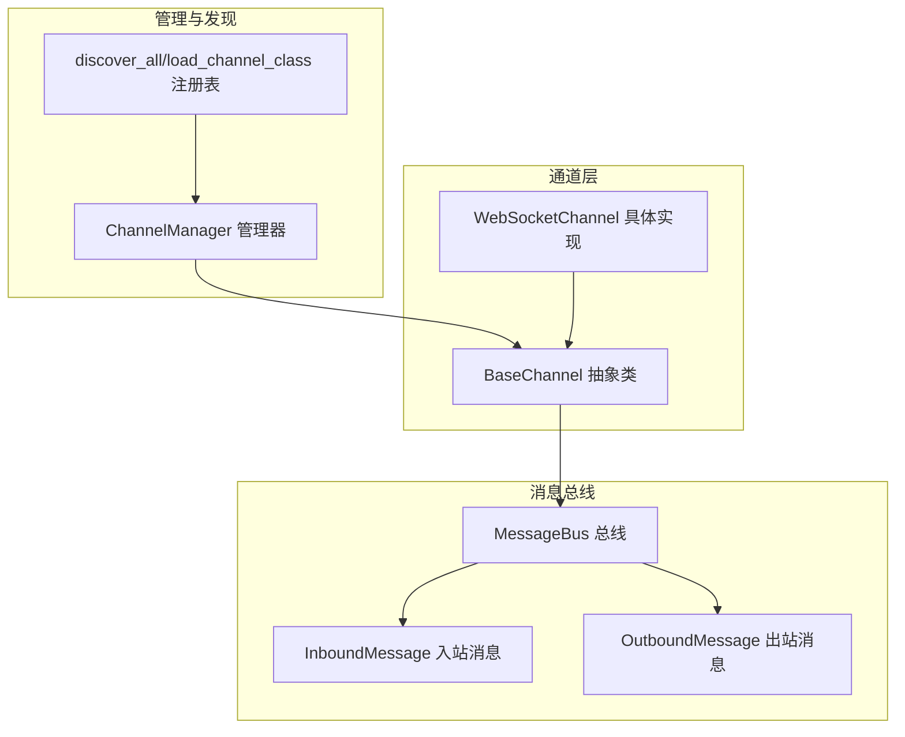
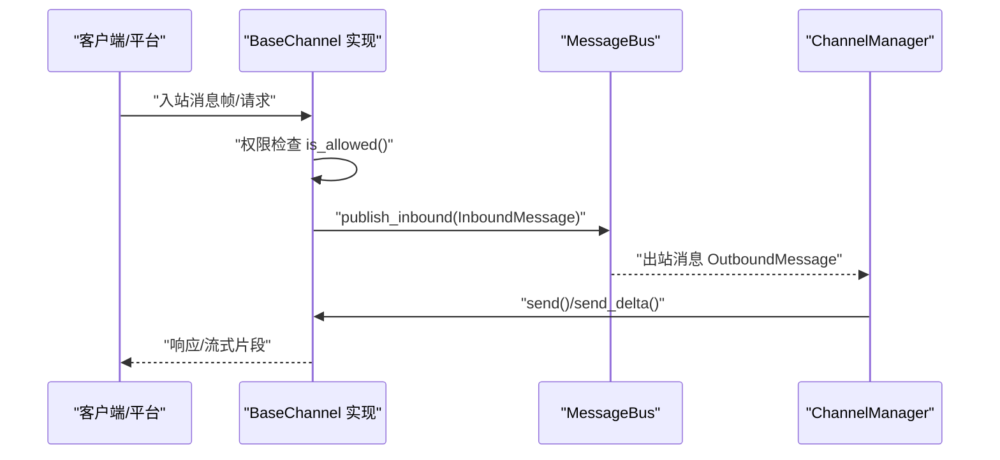
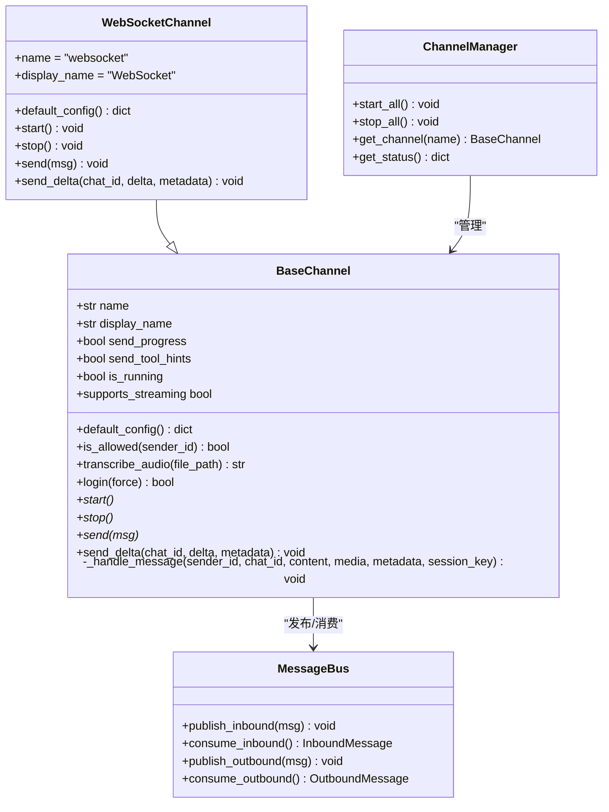
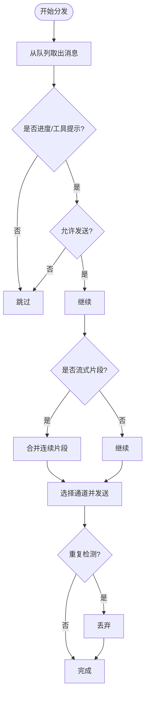
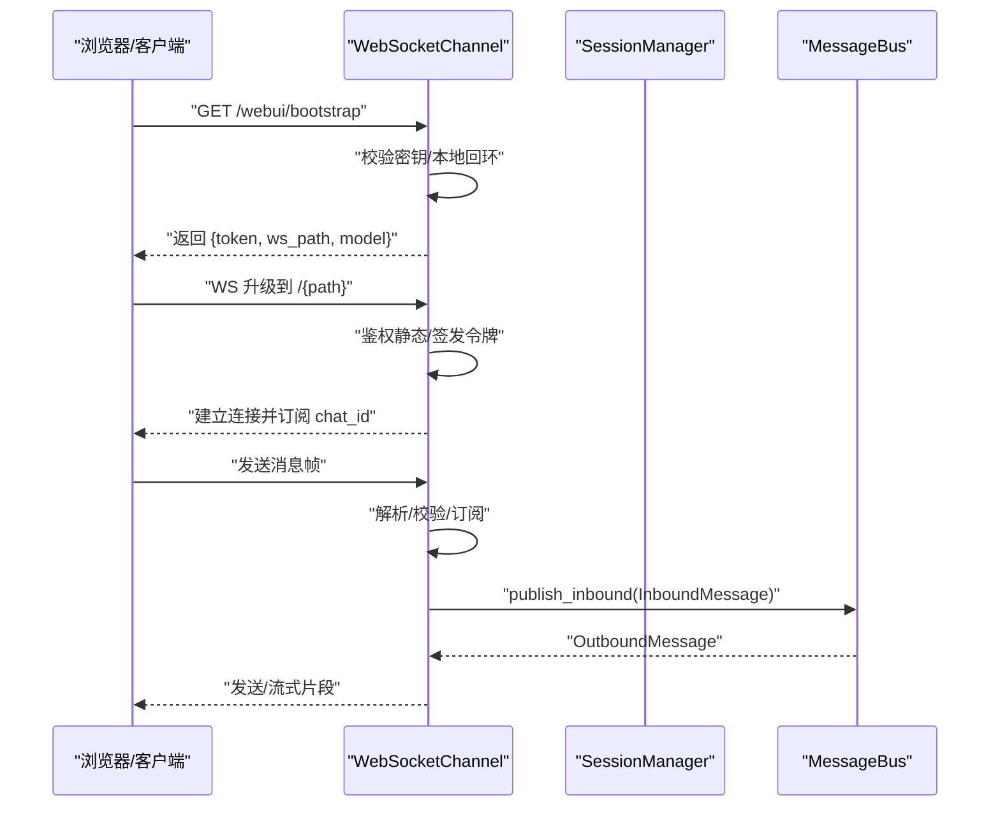
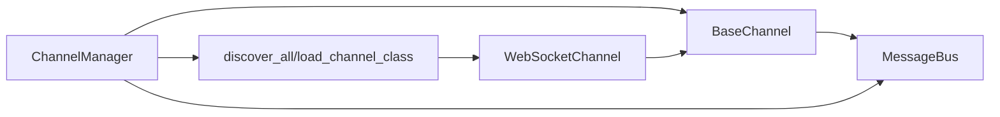

# 基础通道抽象

<cite>
**本文引用的文件**
- [secbot/channels/base.py](file://secbot/channels/base.py)
- [secbot/channels/manager.py](file://secbot/channels/manager.py)
- [secbot/channels/registry.py](file://secbot/channels/registry.py)
- [secbot/channels/websocket.py](file://secbot/channels/websocket.py)
- [secbot/bus/events.py](file://secbot/bus/events.py)
- [secbot/bus/queue.py](file://secbot/bus/queue.py)
- [docs/channel-plugin-guide.md](file://docs/channel-plugin-guide.md)
- [tests/channels/test_base_channel.py](file://tests/channels/test_base_channel.py)
</cite>

## 目录
1. [简介](#简介)
2. [项目结构](#项目结构)
3. [核心组件](#核心组件)
4. [架构总览](#架构总览)
5. [详细组件分析](#详细组件分析)
6. [依赖分析](#依赖分析)
7. [性能考虑](#性能考虑)
8. [故障排查指南](#故障排查指南)
9. [结论](#结论)
10. [附录](#附录)

## 简介
本文件围绕基础通道抽象类 BaseChannel 的设计与使用进行系统化说明，覆盖以下主题：
- 设计理念与接口规范：必须实现方法、可选功能与扩展点
- 生命周期管理：初始化、启动、停止与清理
- 消息处理接口：入站消息接收、出站消息发送、流式传输与错误处理
- 配置系统：配置验证、默认值、类型转换与权限控制
- 通道间通信协议：事件通知、状态同步与握手流程
- 扩展指南：如何实现自定义通道类型的最佳实践与常见陷阱

## 项目结构
与基础通道抽象直接相关的核心模块如下：
- 基础抽象与通用能力：BaseChannel（抽象基类）
- 通道管理器：ChannelManager（负责发现、实例化、启动/停止、消息分发与重试）
- 通道注册表：discover_all/load_channel_class（内置与插件通道自动发现）
- WebSocket 通道示例：WebSocketChannel（展示如何实现具体通道）
- 消息总线：MessageBus（入站/出站队列）
- 文档与测试：channel-plugin-guide（插件开发指南）、test_base_channel（基础行为测试）

图表来源
- [secbot/channels/base.py:15-201](file://secbot/channels/base.py#L15-L201)
- [secbot/channels/manager.py:41-428](file://secbot/channels/manager.py#L41-L428)
- [secbot/channels/registry.py:17-72](file://secbot/channels/registry.py#L17-L72)
- [secbot/channels/websocket.py:414-800](file://secbot/channels/websocket.py#L414-L800)
- [secbot/bus/events.py:8-39](file://secbot/bus/events.py#L8-L39)
- [secbot/bus/queue.py:8-45](file://secbot/bus/queue.py#L8-L45)

章节来源
- [secbot/channels/base.py:15-201](file://secbot/channels/base.py#L15-L201)
- [secbot/channels/manager.py:41-428](file://secbot/channels/manager.py#L41-L428)
- [secbot/channels/registry.py:17-72](file://secbot/channels/registry.py#L17-L72)
- [secbot/channels/websocket.py:414-800](file://secbot/channels/websocket.py#L414-L800)
- [secbot/bus/events.py:8-39](file://secbot/bus/events.py#L8-L39)
- [secbot/bus/queue.py:8-45](file://secbot/bus/queue.py#L8-L45)

## 核心组件
- BaseChannel 抽象类
  - 必须实现：start、stop、send
  - 可选增强：send_delta（流式传输）、login（交互式登录）
  - 提供能力：权限检查 is_allowed、入站消息封装 _handle_message、默认配置 default_config、音频转写 transcribe_audio、运行状态 is_running
- ChannelManager 管理器
  - 负责：通道发现与实例化、启动/停止、出站消息分发与重试、去重与合并、进度/工具提示开关
- 通道注册表
  - 负责：内置通道扫描与外部插件入口点发现，内置优先策略
- WebSocketChannel 示例
  - 展示：HTTP/WS 握手、令牌签发与校验、媒体签名下载、会话列表与设置接口、订阅管理等
- MessageBus 消息总线
  - 提供：入站/出站异步队列，发布/消费接口

章节来源
- [secbot/channels/base.py:15-201](file://secbot/channels/base.py#L15-L201)
- [secbot/channels/manager.py:41-428](file://secbot/channels/manager.py#L41-L428)
- [secbot/channels/registry.py:17-72](file://secbot/channels/registry.py#L17-L72)
- [secbot/channels/websocket.py:414-800](file://secbot/channels/websocket.py#L414-L800)
- [secbot/bus/events.py:8-39](file://secbot/bus/events.py#L8-L39)
- [secbot/bus/queue.py:8-45](file://secbot/bus/queue.py#L8-L45)

## 架构总览
下图展示了从“通道”到“消息总线”的数据流向，以及“管理器”对通道的协调作用。

图表来源
- [secbot/channels/base.py:146-191](file://secbot/channels/base.py#L146-L191)
- [secbot/bus/events.py:8-39](file://secbot/bus/events.py#L8-L39)
- [secbot/bus/queue.py:20-34](file://secbot/bus/queue.py#L20-L34)
- [secbot/channels/manager.py:263-321](file://secbot/channels/manager.py#L263-L321)

## 详细组件分析

### BaseChannel 抽象类
- 设计理念
  - 通过抽象方法约束通道实现的关键行为，统一生命周期与消息契约
  - 通过属性与工具方法提供通用能力（权限、转写、流式支持、默认配置）
- 接口规范
  - 必须实现
    - start：长时运行任务，连接平台、监听消息、调用 _handle_message
    - stop：清理资源、关闭连接
    - send：投递完整消息
  - 可选实现
    - send_delta：流式文本片段交付；需配合配置开启流式
    - login：交互式认证（如扫码），默认返回 True
- 生命周期
  - 初始化：构造函数接收配置与消息总线，绑定日志上下文，标记运行状态
  - 启动：ChannelManager 并行启动各通道
  - 运行：通道在 start 中保持活跃；is_running 反映当前状态
  - 停止：ChannelManager 统一调用 stop 清理
- 消息处理
  - 入站：_handle_message 完成权限校验与元数据注入，封装为 InboundMessage 发布到总线
  - 出站：ChannelManager 从总线消费 OutboundMessage，按策略重试、合并、去重后调用 send/send_delta
  - 流式：supports_streaming 由配置与是否覆写 send_delta 决定；管理器合并连续 _stream_delta
- 配置与权限
  - default_config 返回默认配置字典，便于 onboarding 自动填充
  - is_allowed 支持 allow_from 与 allowFrom（驼峰别名）两种键名
  - transcribe_audio 支持 openai/groq 两种转写提供商
- 错误处理
  - start/stop 异常由 ChannelManager 记录日志
  - send/send_delta 失败由 ChannelManager 重试（指数退避）
  - _handle_message 对未授权访问发出警告并丢弃

图表来源
- [secbot/channels/base.py:15-201](file://secbot/channels/base.py#L15-L201)
- [secbot/channels/websocket.py:414-800](file://secbot/channels/websocket.py#L414-L800)
- [secbot/bus/queue.py:8-45](file://secbot/bus/queue.py#L8-L45)
- [secbot/channels/manager.py:41-428](file://secbot/channels/manager.py#L41-L428)

章节来源
- [secbot/channels/base.py:15-201](file://secbot/channels/base.py#L15-L201)
- [secbot/bus/events.py:8-39](file://secbot/bus/events.py#L8-L39)
- [secbot/bus/queue.py:8-45](file://secbot/bus/queue.py#L8-L45)
- [secbot/channels/manager.py:41-428](file://secbot/channels/manager.py#L41-L428)

### ChannelManager：通道生命周期与消息分发
- 通道发现与实例化
  - discover_all 合并内置通道与外部插件，内置优先
  - 仅启用 enabled 的通道；注入全局转写参数与布尔覆盖项
- 启动与停止
  - start_all 并行启动通道；stop_all 顺序停止并取消分发任务
- 出站分发与重试
  - _dispatch_outbound 循环消费出站消息，支持：
    - 进度/工具提示开关（基于通道属性）
    - 流式片段合并（_coalesce_stream_deltas）
    - 去重（基于指纹与来源消息 ID）
    - 重试（指数退避，CancelledError 透传）
- 状态查询
  - get_status 返回每个通道的启用与运行状态

图表来源
- [secbot/channels/manager.py:263-321](file://secbot/channels/manager.py#L263-L321)
- [secbot/channels/manager.py:330-379](file://secbot/channels/manager.py#L330-L379)
- [secbot/channels/manager.py:241-262](file://secbot/channels/manager.py#L241-L262)

章节来源
- [secbot/channels/manager.py:41-428](file://secbot/channels/manager.py#L41-L428)

### 通道注册表：自动发现与插件加载
- discover_channel_names：扫描内置通道模块（排除内部保留名称）
- load_channel_class：导入模块并查找首个 BaseChannel 子类
- discover_plugins：通过入口点 group="secbot.channels" 加载外部插件
- discover_all：合并内置与插件，内置优先，忽略被内置遮蔽的插件

章节来源
- [secbot/channels/registry.py:17-72](file://secbot/channels/registry.py#L17-L72)

### WebSocketChannel：示例实现与握手流程
- 配置模型 WebSocketConfig：host/port/path/token/令牌签发/SSL/媒体限制/心跳等
- 握手与鉴权：支持静态 token、签发路由、本地回环白名单、令牌过期清理
- HTTP 路由：/api/sessions、/api/settings、/api/commands、/api/media 签名下载、/webui/bootstrap
- 订阅与广播：按 chat_id 扇出消息，连接断开自动清理
- 与管理器集成：作为 BaseChannel 的具体实现，参与统一生命周期与消息分发

图表来源
- [secbot/channels/websocket.py:556-624](file://secbot/channels/websocket.py#L556-L624)
- [secbot/channels/websocket.py:647-683](file://secbot/channels/websocket.py#L647-L683)
- [secbot/channels/websocket.py:414-800](file://secbot/channels/websocket.py#L414-L800)

章节来源
- [secbot/channels/websocket.py:414-800](file://secbot/channels/websocket.py#L414-L800)

### 消息类型与总线
- InboundMessage：来自通道的入站消息，包含渠道、发送者、会话键、内容、媒体与元数据
- OutboundMessage：待发送的出站消息，包含回复目标、媒体、按钮与元数据（含流式标记）
- MessageBus：提供异步队列与发布/消费接口，解耦通道与代理核心

章节来源
- [secbot/bus/events.py:8-39](file://secbot/bus/events.py#L8-L39)
- [secbot/bus/queue.py:8-45](file://secbot/bus/queue.py#L8-L45)

### 配置系统与验证
- 默认配置：BaseChannel.default_config 返回 {"enabled": false}，插件可覆写以提供字段
- 权限控制：is_allowed 支持 allow_from/allowFrom 两种键名；空列表拒绝所有
- 布尔覆盖：ChannelManager._resolve_bool_override 支持 camelCase 别名（如 sendProgress）
- 转写配置：ChannelManager 解析 providers.openai/groq 的 api_key/api_base/language
- 测试验证：测试用例覆盖 allow_from 行为与别名支持

章节来源
- [secbot/channels/base.py:193-201](file://secbot/channels/base.py#L193-L201)
- [secbot/channels/manager.py:156-171](file://secbot/channels/manager.py#L156-L171)
- [tests/channels/test_base_channel.py:21-38](file://tests/channels/test_base_channel.py#L21-L38)

### 通道间通信协议与握手
- 事件通知：WebSocketChannel 通过控制事件向客户端广播连接状态与错误
- 状态同步：ChannelManager.get_status 提供通道启用与运行状态
- 握手流程：/webui/bootstrap 返回 token 与 ws_path；WS 升级时鉴权；令牌签发路由受 secret 保护

章节来源
- [secbot/channels/websocket.py:473-484](file://secbot/channels/websocket.py#L473-L484)
- [secbot/channels/websocket.py:647-683](file://secbot/channels/websocket.py#L647-L683)
- [secbot/channels/manager.py:414-422](file://secbot/channels/manager.py#L414-L422)

### 扩展指南：实现自定义通道
- 开发步骤
  - 子类化 BaseChannel，实现 start/stop/send；如需流式则覆写 send_delta
  - 定义 Pydantic 配置模型，构造函数中将 dict 转换为模型
  - 实现 default_config，返回配置字典用于 onboarding
  - 通过入口点注册（group="secbot.channels"），命名即配置段名
- 最佳实践
  - start 必须阻塞或在停止时退出；避免提前返回
  - 使用 _handle_message 封装入站消息，交由总线处理
  - 正确处理异常：send/send_delta 失败由管理器统一重试
  - 权限检查遵循 allow_from/allowFrom；空列表拒绝所有
- 常见陷阱
  - 使用 dict 配置时未转换为 Pydantic 模型，导致 is_allowed 无法读取 allow_from
  - 忘记开启配置中的 streaming 或未覆写 send_delta 导致流式不生效
  - 未正确设置 session_key_override 导致会话隔离问题

章节来源
- [docs/channel-plugin-guide.md:1-442](file://docs/channel-plugin-guide.md#L1-L442)
- [secbot/channels/base.py:193-201](file://secbot/channels/base.py#L193-L201)
- [secbot/channels/manager.py:156-171](file://secbot/channels/manager.py#L156-L171)

## 依赖分析
- BaseChannel 依赖消息总线事件类型与队列
- ChannelManager 依赖 BaseChannel 抽象、消息总线、配置模式与会话管理器
- WebSocketChannel 继承 BaseChannel，并引入 HTTP/WS 路由与令牌机制
- 注册表依赖 pkgutil 与 importlib.metadata 实现自动发现

图表来源
- [secbot/channels/base.py:15-201](file://secbot/channels/base.py#L15-L201)
- [secbot/channels/manager.py:41-428](file://secbot/channels/manager.py#L41-L428)
- [secbot/channels/registry.py:17-72](file://secbot/channels/registry.py#L17-L72)
- [secbot/channels/websocket.py:414-800](file://secbot/channels/websocket.py#L414-L800)

章节来源
- [secbot/channels/base.py:15-201](file://secbot/channels/base.py#L15-L201)
- [secbot/channels/manager.py:41-428](file://secbot/channels/manager.py#L41-L428)
- [secbot/channels/registry.py:17-72](file://secbot/channels/registry.py#L17-L72)
- [secbot/channels/websocket.py:414-800](file://secbot/channels/websocket.py#L414-L800)

## 性能考虑
- 流式传输合并：ChannelManager 在同一 (channel, chat_id) 上合并连续 _stream_delta，降低 API 调用频率，改善延迟
- 出站去重：基于指纹与来源消息 ID 的重复抑制，减少冗余消息
- 重试策略：指数退避（1s/2s/4s）在失败时自动重试，提升可靠性
- 并发启动：ChannelManager 并行启动通道，缩短整体启动时间

章节来源
- [secbot/channels/manager.py:295-300](file://secbot/channels/manager.py#L295-L300)
- [secbot/channels/manager.py:330-379](file://secbot/channels/manager.py#L330-L379)
- [secbot/channels/manager.py:380-409](file://secbot/channels/manager.py#L380-L409)

## 故障排查指南
- 通道无法启动
  - 检查配置 enabled 是否为 true；查看管理器日志中的异常堆栈
  - 确认 start 是否阻塞；返回即视为“已死”
- 出站消息未送达
  - 查看重试日志与最大尝试次数；确认 send/send_delta 是否抛出异常
  - 检查流式合并逻辑是否导致片段丢失（确保 _stream_end 正确传递）
- 权限被拒
  - allow_from 为空会导致全部拒绝；设置 ["*"] 或添加具体用户 ID
  - 确保使用 camelCase 或 snake_case 键名之一（allowFrom/allow_from）
- WebSocket 握手失败
  - 校验 token/签发路由/本地回环限制；确认 SSL 证书与密钥配对
  - 检查路径规范化与 token 过期清理

章节来源
- [secbot/channels/manager.py:173-179](file://secbot/channels/manager.py#L173-L179)
- [secbot/channels/manager.py:380-409](file://secbot/channels/manager.py#L380-L409)
- [tests/channels/test_base_channel.py:34-38](file://tests/channels/test_base_channel.py#L34-L38)
- [secbot/channels/websocket.py:530-553](file://secbot/channels/websocket.py#L530-L553)

## 结论
BaseChannel 通过清晰的抽象与完善的工具方法，为多平台通道提供了统一的接入范式。结合 ChannelManager 的发现、启动、分发与重试机制，以及 WebSocketChannel 的示例实现，开发者可以快速构建稳定、可扩展的自定义通道。遵循配置与权限约定、正确处理流式与错误、利用去重与合并优化性能，是实现高质量通道的关键。

## 附录
- 插件开发参考：[插件开发指南:1-442](file://docs/channel-plugin-guide.md#L1-L442)
- 基础行为测试：[基础通道测试:1-38](file://tests/channels/test_base_channel.py#L1-L38)