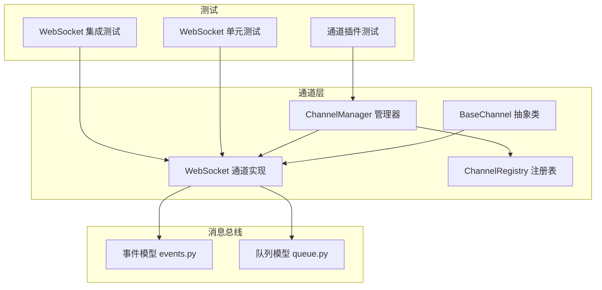
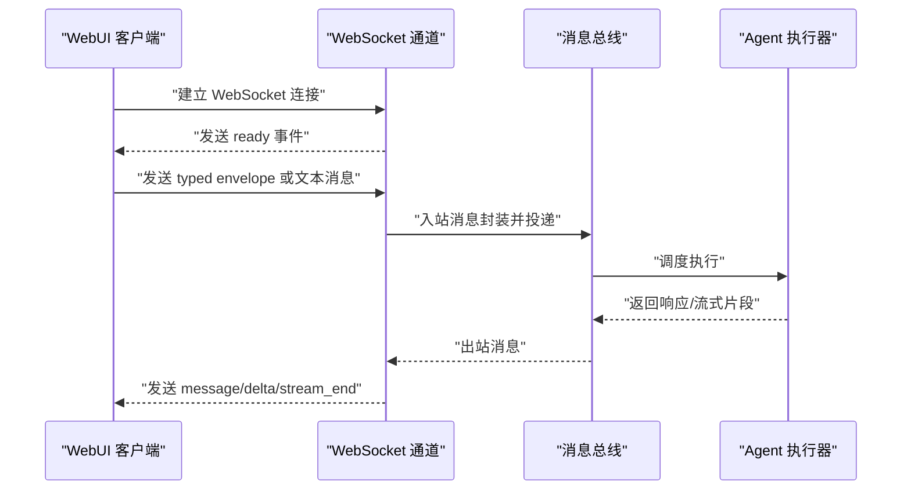
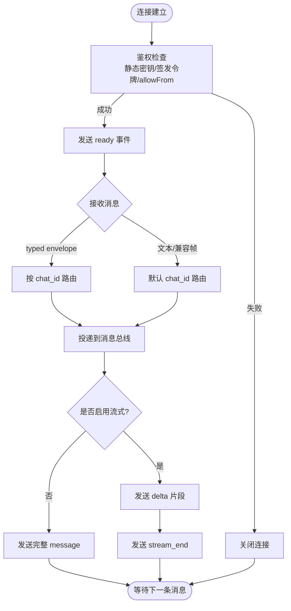
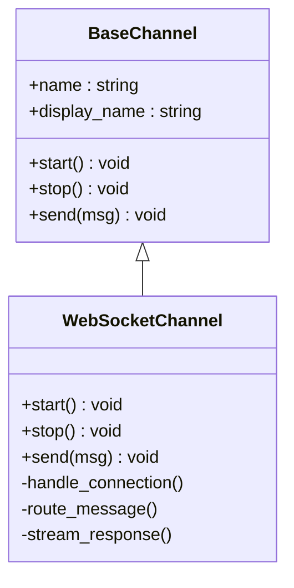
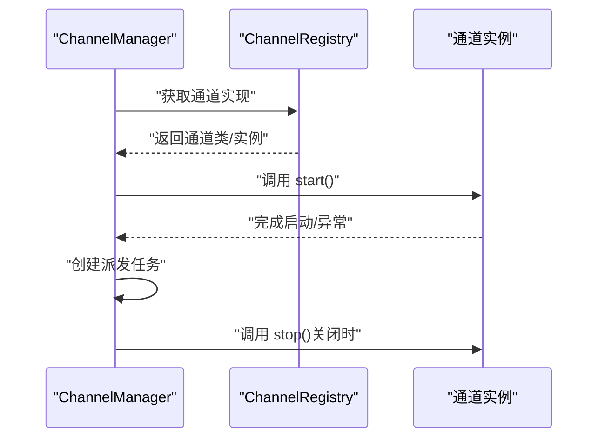
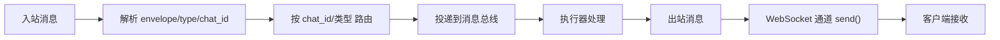
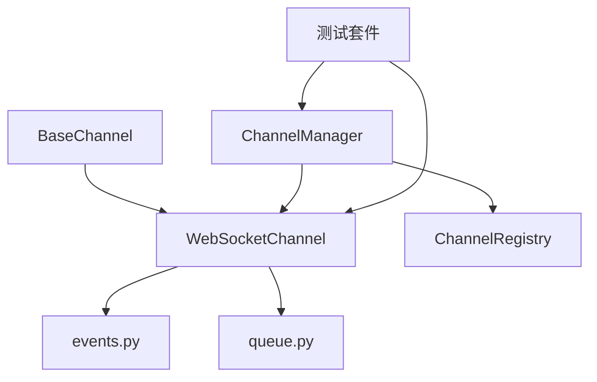

# 消息通道系统

<cite>
**本文引用的文件**
- [websocket.md](file://docs/websocket.md)
- [websocket.py](file://secbot/channels/websocket.py)
- [base.py](file://secbot/channels/base.py)
- [manager.py](file://secbot/channels/manager.py)
- [registry.py](file://secbot/channels/registry.py)
- [events.py](file://secbot/bus/events.py)
- [queue.py](file://secbot/bus/queue.py)
- [test_websocket_channel.py](file://tests/channels/test_websocket_channel.py)
- [test_websocket_integration.py](file://tests/channels/test_websocket_integration.py)
- [test_channel_plugins.py](file://tests/channels/test_channel_plugins.py)
- [removed-im-channels.md](file://.trellis/spec/backend/removed-im-channels.md)
</cite>

## 目录
1. [简介](#简介)
2. [项目结构](#项目结构)
3. [核心组件](#核心组件)
4. [架构总览](#架构总览)
5. [详细组件分析](#详细组件分析)
6. [依赖关系分析](#依赖关系分析)
7. [性能考虑](#性能考虑)
8. [故障排查指南](#故障排查指南)
9. [结论](#结论)
10. [附录](#附录)

## 简介
本文件为消息通道系统的全面技术文档，聚焦于WebSocket通道的实现与使用，涵盖连接建立、消息序列化、状态同步与断线重连策略；同时说明多IM平台在当前版本中的集成现状（已移除）及替代方案；并提供消息路由与分发机制、通道配置与管理、自定义通道开发指南、监控与调试工具使用方法以及常见问题排查步骤。

## 项目结构
消息通道系统位于 secbot/channels 子模块，围绕 BaseChannel 抽象类、ChannelManager 管理器、ChannelRegistry 注册表以及消息总线（bus）进行组织。WebSocket 作为唯一的保留通道表面用于 WebUI 交互，其他IM通道已在重构中移除。

图表来源
- [base.py](file://secbot/channels/base.py)
- [websocket.py](file://secbot/channels/websocket.py)
- [manager.py](file://secbot/channels/manager.py)
- [registry.py](file://secbot/channels/registry.py)
- [events.py](file://secbot/bus/events.py)
- [queue.py](file://secbot/bus/queue.py)
- [test_websocket_channel.py](file://tests/channels/test_websocket_channel.py)
- [test_channel_plugins.py](file://tests/channels/test_channel_plugins.py)
- [test_websocket_integration.py](file://tests/channels/test_websocket_integration.py)

章节来源
- [base.py](file://secbot/channels/base.py)
- [websocket.py](file://secbot/channels/websocket.py)
- [manager.py](file://secbot/channels/manager.py)
- [registry.py](file://secbot/channels/registry.py)
- [events.py](file://secbot/bus/events.py)
- [queue.py](file://secbot/bus/queue.py)

## 核心组件
- BaseChannel：定义通道生命周期（start/stop）、发送接口（send）与通用配置注入，是所有通道实现的基类。
- WebSocket 通道：实现 WebSocket 升级、鉴权、多聊天会话复用、流式传输、媒体附件处理、心跳保活与错误处理。
- ChannelManager：负责通道注册、启动/停止、状态维护与派发任务管理。
- ChannelRegistry：通道插件注册映射，供外部或UI适配器接入。
- 消息总线：事件与队列模型，承载通道与业务之间的解耦通信。

章节来源
- [base.py](file://secbot/channels/base.py)
- [websocket.py](file://secbot/channels/websocket.py)
- [manager.py](file://secbot/channels/manager.py)
- [registry.py](file://secbot/channels/registry.py)
- [events.py](file://secbot/bus/events.py)
- [queue.py](file://secbot/bus/queue.py)

## 架构总览
WebSocket 通道作为 WebUI 的唯一交付面，通过 ChannelManager 统一管理，消息经由消息总线进行路由与分发。通道插件体系通过 ChannelRegistry 进行注册与发现。

图表来源
- [websocket.py](file://secbot/channels/websocket.py)
- [events.py](file://secbot/bus/events.py)
- [queue.py](file://secbot/bus/queue.py)

## 详细组件分析

### WebSocket 通道实现
- 连接建立与升级：支持 ws/wss，路径可配置，支持 TLSv1.2+。
- 鉴权与访问控制：支持静态密钥与签发令牌两种模式，支持 client_id 白名单。
- 多聊天复用：单连接可承载多个 chat_id，支持 new_chat/attach/message 三类 typed envelope。
- 流式传输：当启用时，以 delta + stream_end 形式推送增量文本。
- 媒体附件：消息可携带本地路径，客户端需通过共享文件系统或HTTP服务访问。
- 心跳与保活：可配置 ping 间隔与超时，自动清理无效连接。
- 错误处理：对非法 envelope 返回 error 事件，保持连接不中断。

图表来源
- [websocket.py](file://secbot/channels/websocket.py)
- [websocket.md](file://docs/websocket.md)

章节来源
- [websocket.py](file://secbot/channels/websocket.py)
- [websocket.md](file://docs/websocket.md)

### BaseChannel 抽象类与自定义通道开发
- 生命周期：start()/stop() 由子类实现具体逻辑（如网络连接、资源释放）。
- 发送接口：send(outbound) 由子类实现消息发送与序列化。
- 配置注入：构造函数接收 config 与 bus，便于读取通道配置与接入消息总线。
- 开发步骤建议：继承 BaseChannel，实现 start/stop/send，注册到 ChannelRegistry，交由 ChannelManager 管理。

图表来源
- [base.py](file://secbot/channels/base.py)
- [websocket.py](file://secbot/channels/websocket.py)

章节来源
- [base.py](file://secbot/channels/base.py)
- [websocket.py](file://secbot/channels/websocket.py)

### ChannelManager 与通道管理
- 启动/停止：start_all()/stop_all() 管理通道生命周期，记录派发任务。
- 状态维护：跟踪通道启停状态，异常时记录日志并优雅处理。
- 允许列表校验：对 allowFrom 进行验证，空列表触发系统退出保护。
- 插件发现：从 ChannelRegistry 获取通道实现并注册。

图表来源
- [manager.py](file://secbot/channels/manager.py)
- [registry.py](file://secbot/channels/registry.py)

章节来源
- [manager.py](file://secbot/channels/manager.py)
- [registry.py](file://secbot/channels/registry.py)
- [test_channel_plugins.py](file://tests/channels/test_channel_plugins.py)

### 消息路由与分发机制
- 入站路由：WebSocket 通道根据 typed envelope 的 type 字段与 chat_id 将消息路由至对应会话。
- 出站分发：消息总线将响应通过通道 send 接口回传给客户端。
- 事件模型：事件与队列模型支撑异步与解耦的消息传递。

图表来源
- [websocket.py](file://secbot/channels/websocket.py)
- [events.py](file://secbot/bus/events.py)
- [queue.py](file://secbot/bus/queue.py)

章节来源
- [websocket.py](file://secbot/channels/websocket.py)
- [events.py](file://secbot/bus/events.py)
- [queue.py](file://secbot/bus/queue.py)

### 多IM平台集成现状与替代方案
- 已移除：IM 通道（如 Telegram、Slack、Discord 等）在重构中被移除，仅保留 WebSocket 表面用于 WebUI。
- 替代方案：若需对外通知或告警，可在新目录（如 notifiers/）下以新的非通道命名空间扩展，遵循高风险确认契约与合规要求。

章节来源
- [removed-im-channels.md](file://.trellis/spec/backend/removed-im-channels.md)

## 依赖关系分析
- 通道层依赖：WebSocket 通道依赖 BaseChannel 抽象；ChannelManager 依赖 ChannelRegistry 与通道实例；消息总线提供事件与队列能力。
- 测试覆盖：单元测试覆盖 WebSocket 协议、集成场景与通道插件生命周期。

图表来源
- [base.py](file://secbot/channels/base.py)
- [websocket.py](file://secbot/channels/websocket.py)
- [manager.py](file://secbot/channels/manager.py)
- [registry.py](file://secbot/channels/registry.py)
- [events.py](file://secbot/bus/events.py)
- [queue.py](file://secbot/bus/queue.py)
- [test_websocket_channel.py](file://tests/channels/test_websocket_channel.py)
- [test_websocket_integration.py](file://tests/channels/test_websocket_integration.py)
- [test_channel_plugins.py](file://tests/channels/test_channel_plugins.py)

章节来源
- [base.py](file://secbot/channels/base.py)
- [websocket.py](file://secbot/channels/websocket.py)
- [manager.py](file://secbot/channels/manager.py)
- [registry.py](file://secbot/channels/registry.py)
- [events.py](file://secbot/bus/events.py)
- [queue.py](file://secbot/bus/queue.py)
- [test_websocket_channel.py](file://tests/channels/test_websocket_channel.py)
- [test_websocket_integration.py](file://tests/channels/test_websocket_integration.py)
- [test_channel_plugins.py](file://tests/channels/test_channel_plugins.py)

## 性能考虑
- 连接保活：合理设置 ping 间隔与超时，避免频繁的心跳导致额外开销。
- 流式传输：启用流式可降低首字节延迟，但需注意客户端缓冲与渲染压力。
- 媒体传输：大文件建议通过共享文件系统或独立HTTP服务，避免在WebSocket中传输大块数据。
- 并发与队列：消息总线应具备背压与限流能力，防止突发流量冲击。
- TLS 加密：在公网部署时启用 WSS，确保最小 TLS 版本为 1.2。

## 故障排查指南
- 连接失败
  - 检查 host/port/path 与防火墙设置。
  - 确认 allowFrom 是否允许该 client_id。
  - 若启用鉴权，确认 token 是否正确且未过期。
- 无法接收消息
  - 确认客户端是否订阅了正确的 chat_id（使用 attach/new_chat）。
  - 检查消息总线是否正常运行。
- 流式传输异常
  - 确认 streaming 配置与客户端渲染逻辑。
  - 检查 delta/stream_end 是否成对出现。
- 断线重连
  - 客户端应在连接断开后主动重试，使用 attach 重新绑定 chat_id。
  - 服务端会自动清理无效连接，重连后需重新鉴权与订阅。

章节来源
- [websocket.md](file://docs/websocket.md)
- [test_websocket_channel.py](file://tests/channels/test_websocket_channel.py)
- [test_websocket_integration.py](file://tests/channels/test_websocket_integration.py)

## 结论
消息通道系统以 WebSocket 为核心交付面，结合 BaseChannel 抽象、ChannelManager 管理与消息总线，实现了稳定、可扩展的实时通信能力。多IM平台集成已在当前版本中移除，未来可通过新的非通道命名空间扩展通知能力。建议在生产环境启用鉴权与TLS，合理配置流式传输与媒体处理，并通过测试与监控保障稳定性。

## 附录

### 通道配置与管理指南
- 连接参数：host、port、path、maxMessageBytes。
- 认证方式：静态密钥或签发令牌，支持 allowFrom 白名单。
- 流式传输：streaming 开关与 ping/超时配置。
- TLS/SSL：证书与私钥路径，强制 TLSv1.2+。
- 签发令牌：tokenIssuePath、tokenIssueSecret、tokenTtlS。

章节来源
- [websocket.md](file://docs/websocket.md)

### 自定义通道开发指南
- 继承 BaseChannel，实现 start/stop/send。
- 在 ChannelRegistry 中注册通道名称与实现。
- 通过 ChannelManager 管理通道生命周期与状态。
- 使用消息总线进行入/出站消息路由。

章节来源
- [base.py](file://secbot/channels/base.py)
- [registry.py](file://secbot/channels/registry.py)
- [manager.py](file://secbot/channels/manager.py)

### 监控与调试工具
- 单元测试：覆盖 WebSocket 协议、集成场景与通道插件生命周期。
- 日志与状态：ChannelManager 记录通道启停与异常，便于定位问题。
- 客户端侧：使用标准 WebSocket 工具（如 websocat）与浏览器开发者工具观察帧与事件。

章节来源
- [test_websocket_channel.py](file://tests/channels/test_websocket_channel.py)
- [test_websocket_integration.py](file://tests/channels/test_websocket_integration.py)
- [test_channel_plugins.py](file://tests/channels/test_channel_plugins.py)