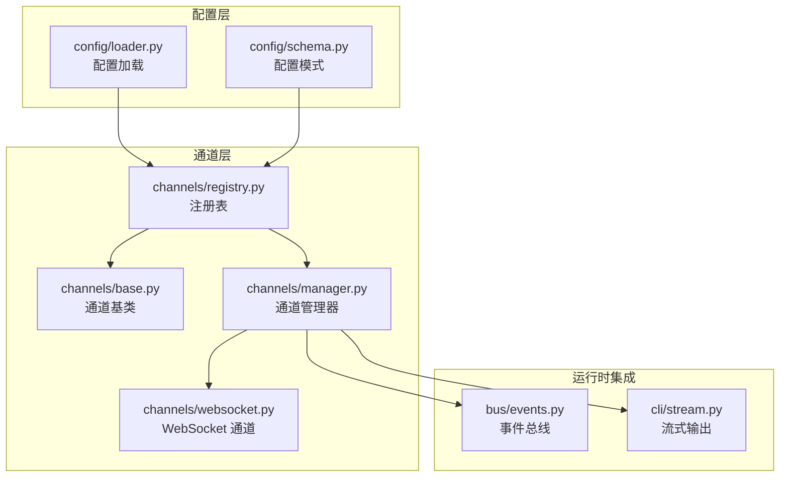
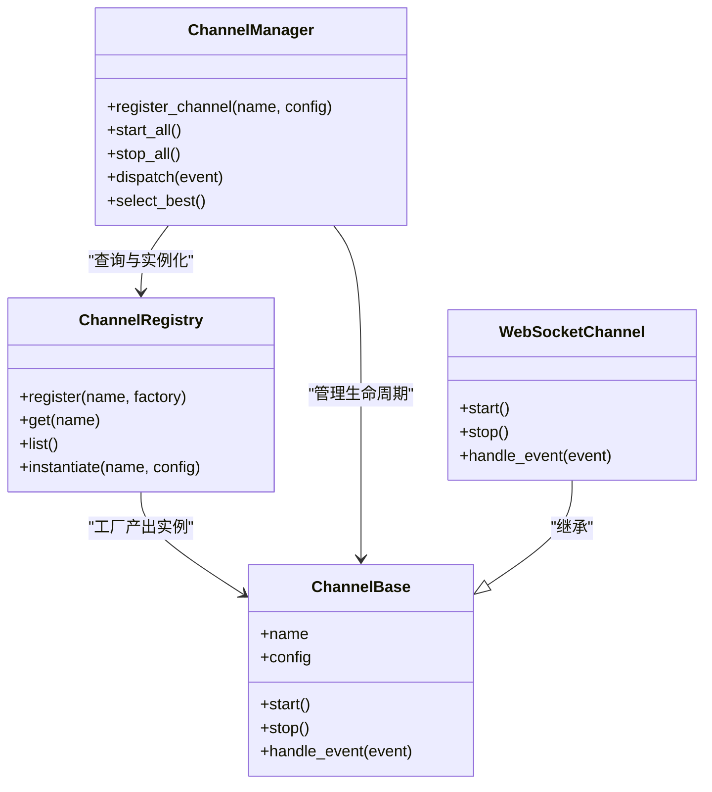
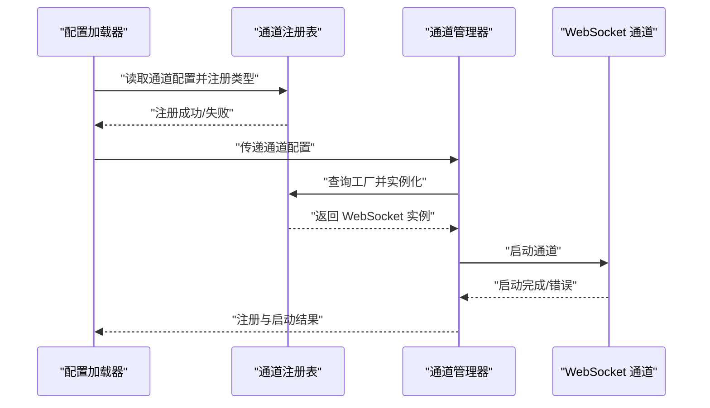
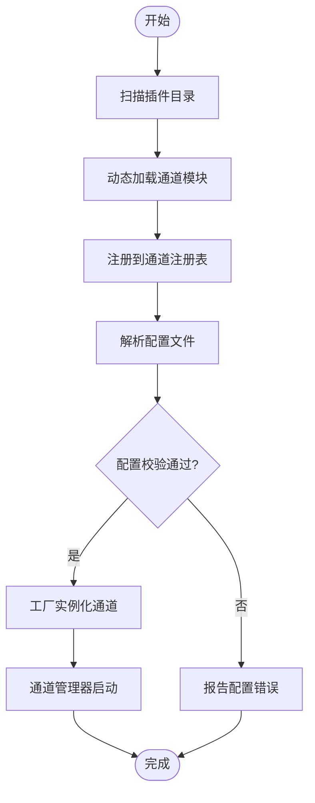
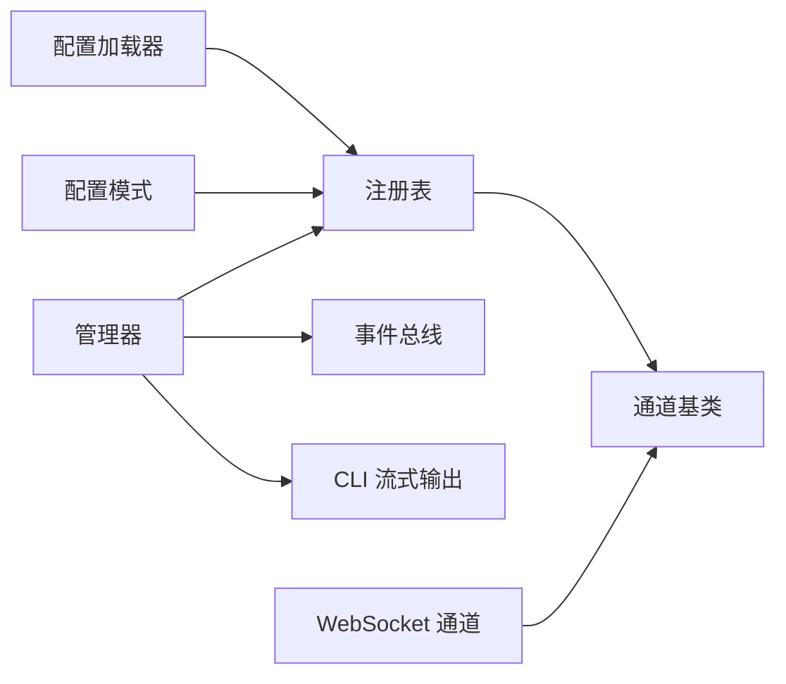

# 通道注册表

<cite>
**本文引用的文件**
- [channels/registry.py](file://secbot/channels/registry.py)
- [channels/base.py](file://secbot/channels/base.py)
- [channels/manager.py](file://secbot/channels/manager.py)
- [channels/websocket.py](file://secbot/channels/websocket.py)
- [config/loader.py](file://secbot/config/loader.py)
- [config/schema.py](file://secbot/config/schema.py)
- [bus/events.py](file://secbot/bus/events.py)
- [cli/stream.py](file://secbot/cli/stream.py)
- [tests/channels/test_channel_plugins.py](file://tests/channels/test_channel_plugins.py)
- [tests/channels/test_websocket_channel.py](file://tests/channels/test_websocket_channel.py)
- [docs/channel-plugin-guide.md](file://docs/channel-plugin-guide.md)
- [docs/websocket.md](file://docs/websocket.md)
</cite>

## 目录
1. [引言](#引言)
2. [项目结构](#项目结构)
3. [核心组件](#核心组件)
4. [架构总览](#架构总览)
5. [详细组件分析](#详细组件分析)
6. [依赖关系分析](#依赖关系分析)
7. [性能考量](#性能考量)
8. [故障排查指南](#故障排查指南)
9. [结论](#结论)
10. [附录](#附录)

## 引言
本文件系统化阐述通道注册表的设计与实现，覆盖以下关键主题：
- 设计目的：统一管理不同来源的通道（如 WebSocket、Slack、Discord 等），提供一致的生命周期与接口抽象。
- 实现机制：基于注册表与工厂模式，支持内置通道与插件通道的动态加载。
- 内置通道注册：重点说明 WebSocket 通道的初始化流程与配置要点。
- 发现与自动注册：通道插件扫描与配置解析的协作机制。
- 配置验证与冲突检测：确保通道配置的正确性与唯一性。
- 优先级与选择策略：多通道可用时的选择逻辑。
- 调试与诊断：辅助开发者定位通道相关问题。

## 项目结构
通道相关代码主要位于 secbot/channels 目录，并与配置系统、事件总线、CLI 流式输出等模块协同工作。

图表来源
- [channels/registry.py](file://secbot/channels/registry.py)
- [channels/base.py](file://secbot/channels/base.py)
- [channels/manager.py](file://secbot/channels/manager.py)
- [channels/websocket.py](file://secbot/channels/websocket.py)
- [config/loader.py](file://secbot/config/loader.py)
- [config/schema.py](file://secbot/config/schema.py)
- [bus/events.py](file://secbot/bus/events.py)
- [cli/stream.py](file://secbot/cli/stream.py)

章节来源
- [channels/registry.py](file://secbot/channels/registry.py)
- [channels/base.py](file://secbot/channels/base.py)
- [channels/manager.py](file://secbot/channels/manager.py)
- [channels/websocket.py](file://secbot/channels/websocket.py)
- [config/loader.py](file://secbot/config/loader.py)
- [config/schema.py](file://secbot/config/schema.py)
- [bus/events.py](file://secbot/bus/events.py)
- [cli/stream.py](file://secbot/cli/stream.py)

## 核心组件
- 通道注册表：集中登记通道类型与工厂，提供查询、注册、实例化能力。
- 通道基类：定义通道的公共接口与生命周期钩子，约束插件通道实现。
- 通道管理器：负责通道的启动、停止、事件分发与状态管理。
- WebSocket 通道：内置通道示例，展示如何通过工厂模式接入注册表。
- 配置系统：加载与校验通道配置，为注册表提供输入数据。
- 事件总线与 CLI：作为通道事件的下游消费者，用于调试与可观测性。

章节来源
- [channels/registry.py](file://secbot/channels/registry.py)
- [channels/base.py](file://secbot/channels/base.py)
- [channels/manager.py](file://secbot/channels/manager.py)
- [channels/websocket.py](file://secbot/channels/websocket.py)
- [config/loader.py](file://secbot/config/loader.py)
- [config/schema.py](file://secbot/config/schema.py)
- [bus/events.py](file://secbot/bus/events.py)
- [cli/stream.py](file://secbot/cli/stream.py)

## 架构总览
通道注册表采用“注册表 + 工厂 + 管理器”的分层设计：
- 注册表：维护通道类型到工厂的映射，提供注册、查找与实例化方法。
- 工厂：根据配置生成具体通道实例，封装通道构造细节。
- 管理器：协调通道生命周期、事件路由与错误处理。
- 插件与内置通道：通过统一接口接入，实现动态扩展。

图表来源
- [channels/registry.py](file://secbot/channels/registry.py)
- [channels/base.py](file://secbot/channels/base.py)
- [channels/manager.py](file://secbot/channels/manager.py)
- [channels/websocket.py](file://secbot/channels/websocket.py)

## 详细组件分析

### 通道注册表（ChannelRegistry）
职责与特性
- 维护通道类型名称到工厂函数的映射。
- 提供注册、查询、枚举与实例化能力。
- 支持内置通道与插件通道的统一入口。

关键行为
- 注册：将通道类型名与工厂绑定，用于后续实例化。
- 查找：按类型名检索工厂，若不存在返回空或抛错。
- 实例化：根据配置调用工厂创建通道实例。
- 列表：返回已注册的通道类型清单，便于调试与文档生成。

复杂度与性能
- 注册/查找/列表均为哈希表操作，时间复杂度 O(1) 平均。
- 实例化涉及工厂调用与配置解析，开销取决于具体通道实现。

错误处理
- 类型名重复注册应触发冲突检测与告警。
- 未知类型查找返回空或抛出异常，避免静默失败。

章节来源
- [channels/registry.py](file://secbot/channels/registry.py)

### 通道基类（ChannelBase）
职责与特性
- 定义通道通用接口：名称、配置、启动、停止、事件处理。
- 作为所有通道（内置与插件）的抽象基类，确保一致性。

关键行为
- 启动/停止：建立连接、监听事件、释放资源。
- 事件处理：接收并处理来自上游或内部产生的事件。
- 生命周期钩子：可扩展的回调点，供子类覆盖。

复杂度与性能
- 接口调用为常数时间；事件处理由子类实现决定。

错误处理
- 基类不直接处理业务错误，但可通过异常传播与日志记录辅助诊断。

章节来源
- [channels/base.py](file://secbot/channels/base.py)

### 通道管理器（ChannelManager）
职责与特性
- 协调通道的注册、启动、停止与事件分发。
- 提供通道选择策略（如优先级、可用性、健康检查）。

关键行为
- 注册通道：从配置加载通道，交由注册表完成类型解析与实例化。
- 启动/停止：批量启动或优雅关闭所有通道。
- 事件分发：将事件路由到目标通道或广播到多个通道。
- 选择策略：在多通道可用时，依据优先级、可用性与负载情况选择最佳通道。

复杂度与性能
- 批量操作为 O(n)；事件分发取决于路由策略与订阅者数量。

错误处理
- 捕获通道启动/停止异常，记录并继续处理其他通道。
- 对不可恢复错误进行隔离，避免影响其他通道。

章节来源
- [channels/manager.py](file://secbot/channels/manager.py)

### WebSocket 通道（WebSocketChannel）
职责与特性
- 内置通道示例，展示如何通过工厂模式接入注册表。
- 处理 WebSocket 连接、消息编解码与媒体附件传输。

关键行为
- 启动：建立 WebSocket 连接，设置心跳与重连策略。
- 停止：断开连接，清理资源。
- 事件处理：解析消息、转发到事件总线或 CLI 流式输出。

复杂度与性能
- 事件处理受网络与消息大小影响；建议异步处理与背压控制。

错误处理
- 连接异常、协议错误、超时等场景需有明确的重试与降级策略。

章节来源
- [channels/websocket.py](file://secbot/channels/websocket.py)

### 配置加载与模式（Config Loader & Schema）
职责与特性
- 加载用户配置，解析通道段落，校验字段完整性与类型正确性。
- 与注册表协作，为通道实例化提供参数。

关键行为
- 加载：读取配置文件，合并默认值与环境变量。
- 校验：依据模式对通道配置进行强类型校验。
- 解析：将配置转换为通道工厂所需的参数字典。

复杂度与性能
- 配置解析通常为线性复杂度，受配置项数量影响。

错误处理
- 非法字段、缺失必填项、类型不匹配等应抛出清晰的错误信息。

章节来源
- [config/loader.py](file://secbot/config/loader.py)
- [config/schema.py](file://secbot/config/schema.py)

### 事件总线与 CLI 集成
职责与特性
- 事件总线：聚合通道产生的事件，供其他模块订阅与消费。
- CLI 流式输出：将通道事件以流式方式输出，便于调试与监控。

关键行为
- 事件发布：通道在启动、消息到达、错误发生时发布事件。
- 事件订阅：CLI 与测试模块订阅事件，进行断言与可视化。

复杂度与性能
- 事件分发为 O(k)，k 为订阅者数量；应避免阻塞发布线程。

错误处理
- 订阅者异常不应影响主事件循环；建议隔离与记录。

章节来源
- [bus/events.py](file://secbot/bus/events.py)
- [cli/stream.py](file://secbot/cli/stream.py)

### 内置通道注册流程（以 WebSocket 为例）

图表来源
- [config/loader.py](file://secbot/config/loader.py)
- [channels/registry.py](file://secbot/channels/registry.py)
- [channels/manager.py](file://secbot/channels/manager.py)
- [channels/websocket.py](file://secbot/channels/websocket.py)

章节来源
- [config/loader.py](file://secbot/config/loader.py)
- [channels/registry.py](file://secbot/channels/registry.py)
- [channels/manager.py](file://secbot/channels/manager.py)
- [channels/websocket.py](file://secbot/channels/websocket.py)

### 通道发现与自动注册机制
- 插件扫描：遍历插件目录，识别符合规范的通道模块，提取类型名与工厂函数。
- 动态加载：使用导入机制加载模块，调用注册表的注册方法。
- 配置解析：读取配置中的通道段落，结合模式校验后交由管理器启动。

图表来源
- [channels/registry.py](file://secbot/channels/registry.py)
- [config/loader.py](file://secbot/config/loader.py)
- [config/schema.py](file://secbot/config/schema.py)

章节来源
- [channels/registry.py](file://secbot/channels/registry.py)
- [config/loader.py](file://secbot/config/loader.py)
- [config/schema.py](file://secbot/config/schema.py)

### 通道配置验证与冲突检测
- 字段完整性：必填字段缺失时拒绝注册。
- 类型校验：字段类型与期望不符时报错。
- 唯一性约束：通道名称全局唯一，重复注册应报冲突。
- 冲突检测：当多个通道指向同一目标（如端口、令牌）时发出警告或阻止启动。

章节来源
- [config/schema.py](file://secbot/config/schema.py)
- [channels/registry.py](file://secbot/channels/registry.py)

### 通道优先级与选择策略
- 优先级：配置中可指定通道优先级，数值越大优先级越高。
- 可用性：健康检查与可用性指标（如连接状态、延迟）参与选择。
- 负载均衡：在多实例或多副本场景下，按策略分配请求。
- 回退策略：首选通道失败时，按顺序尝试备选通道。

章节来源
- [channels/manager.py](file://secbot/channels/manager.py)

### 调试与诊断工具
- 事件订阅：CLI 与测试模块订阅通道事件，进行断言与可视化。
- 日志与追踪：通道启动/停止、错误事件应有详细日志。
- 单元测试：覆盖通道注册、实例化、事件分发与错误路径。
- 文档参考：通道插件开发指南与 WebSocket 使用说明。

章节来源
- [bus/events.py](file://secbot/bus/events.py)
- [cli/stream.py](file://secbot/cli/stream.py)
- [tests/channels/test_channel_plugins.py](file://tests/channels/test_channel_plugins.py)
- [tests/channels/test_websocket_channel.py](file://tests/channels/test_websocket_channel.py)
- [docs/channel-plugin-guide.md](file://docs/channel-plugin-guide.md)
- [docs/websocket.md](file://docs/websocket.md)

## 依赖关系分析
- 注册表依赖配置模式进行类型校验，依赖通道基类定义接口契约。
- 管理器依赖注册表进行实例化，依赖事件总线进行事件路由。
- WebSocket 通道依赖基类接口，实现具体协议细节。
- CLI 与测试模块依赖事件总线进行可观测性与断言。

图表来源
- [channels/registry.py](file://secbot/channels/registry.py)
- [channels/base.py](file://secbot/channels/base.py)
- [channels/manager.py](file://secbot/channels/manager.py)
- [channels/websocket.py](file://secbot/channels/websocket.py)
- [bus/events.py](file://secbot/bus/events.py)
- [cli/stream.py](file://secbot/cli/stream.py)
- [config/loader.py](file://secbot/config/loader.py)
- [config/schema.py](file://secbot/config/schema.py)

章节来源
- [channels/registry.py](file://secbot/channels/registry.py)
- [channels/base.py](file://secbot/channels/base.py)
- [channels/manager.py](file://secbot/channels/manager.py)
- [channels/websocket.py](file://secbot/channels/websocket.py)
- [bus/events.py](file://secbot/bus/events.py)
- [cli/stream.py](file://secbot/cli/stream.py)
- [config/loader.py](file://secbot/config/loader.py)
- [config/schema.py](file://secbot/config/schema.py)

## 性能考量
- 注册表查询与实例化为常数时间，整体开销低。
- 事件分发与网络 I/O 是主要性能瓶颈，建议异步化与背压控制。
- 配置解析与校验应在启动阶段完成，避免运行时重复计算。
- 通道选择策略应尽量减少决策成本，必要时引入缓存与预计算。

## 故障排查指南
- 启动失败：检查配置文件是否符合模式定义，确认必填字段与类型。
- 重复注册：核对通道名称是否唯一，避免命名冲突。
- 事件未达：确认事件总线订阅链路，检查 CLI 是否正确订阅。
- WebSocket 连接异常：查看网络连通性、认证令牌与握手日志。
- 单元测试失败：参考测试用例定位问题，关注事件断言与错误路径。

章节来源
- [tests/channels/test_channel_plugins.py](file://tests/channels/test_channel_plugins.py)
- [tests/channels/test_websocket_channel.py](file://tests/channels/test_websocket_channel.py)
- [bus/events.py](file://secbot/bus/events.py)
- [cli/stream.py](file://secbot/cli/stream.py)

## 结论
通道注册表通过注册表、工厂与管理器的协作，实现了通道类型的统一管理与动态扩展。结合配置系统与事件总线，提供了可观察、可诊断、可扩展的通道基础设施。内置 WebSocket 通道展示了完整的接入流程，而插件扫描与配置解析则保证了系统的灵活性与可维护性。

## 附录
- 开发指南：参见通道插件开发指南与 WebSocket 使用说明。
- 测试参考：单元测试覆盖了通道注册、实例化与事件分发的关键路径。

章节来源
- [docs/channel-plugin-guide.md](file://docs/channel-plugin-guide.md)
- [docs/websocket.md](file://docs/websocket.md)