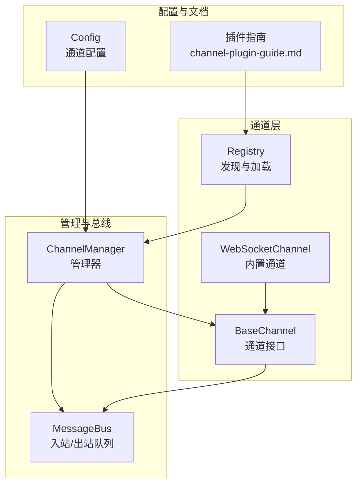
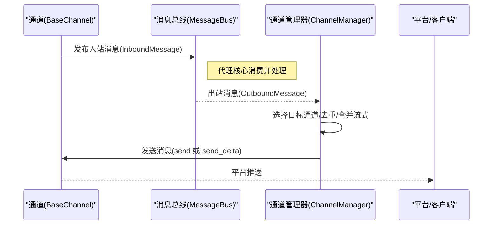
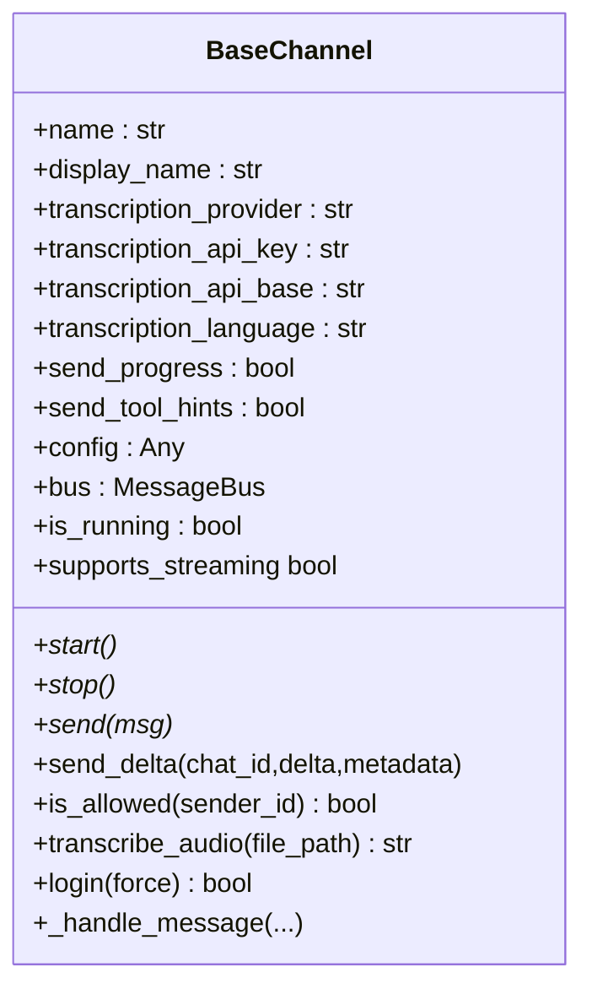
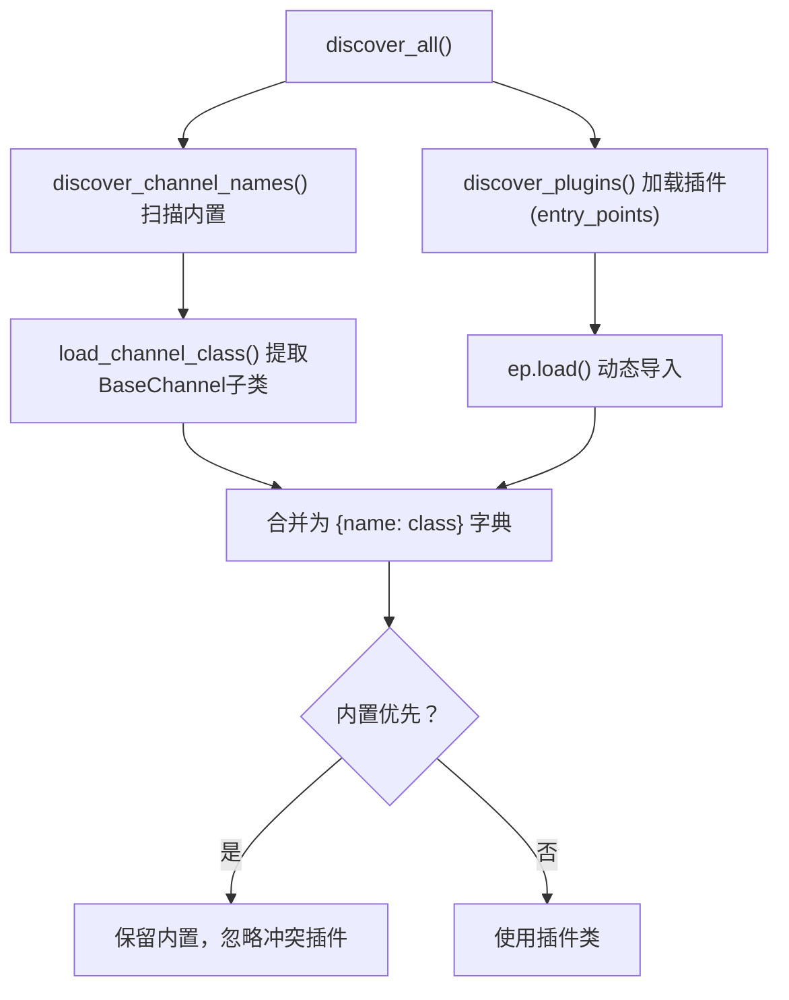
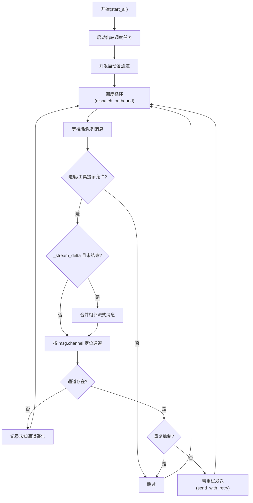
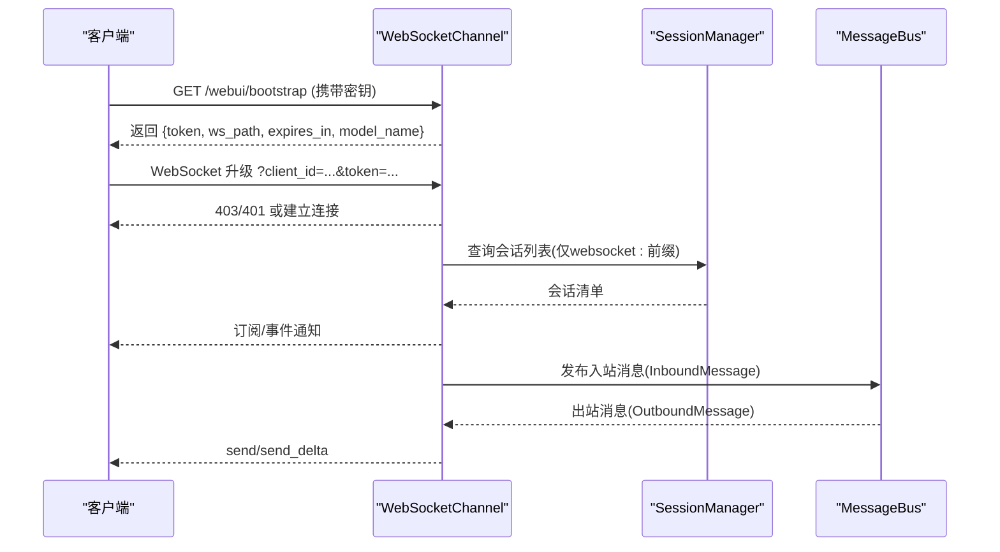
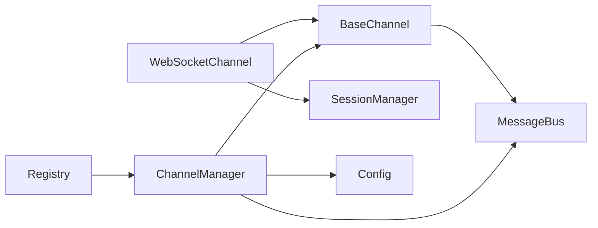

# 通道管理器

<cite>
**本文引用的文件**
- [secbot/channels/manager.py](file://secbot/channels/manager.py)
- [secbot/channels/base.py](file://secbot/channels/base.py)
- [secbot/channels/registry.py](file://secbot/channels/registry.py)
- [secbot/channels/websocket.py](file://secbot/channels/websocket.py)
- [secbot/bus/events.py](file://secbot/bus/events.py)
- [secbot/bus/queue.py](file://secbot/bus/queue.py)
- [docs/channel-plugin-guide.md](file://docs/channel-plugin-guide.md)
</cite>

## 目录
1. [简介](#简介)
2. [项目结构](#项目结构)
3. [核心组件](#核心组件)
4. [架构总览](#架构总览)
5. [详细组件分析](#详细组件分析)
6. [依赖关系分析](#依赖关系分析)
7. [性能考量](#性能考量)
8. [故障排查指南](#故障排查指南)
9. [结论](#结论)
10. [附录](#附录)

## 简介
本文件系统性阐述通道管理器的设计与实现，覆盖以下关键主题：
- 多通道实例的协调、消息路由与负载均衡
- 通道注册与注销机制（含动态插件发现）
- 消息分发策略（广播、单播、条件路由）
- 通道状态监控与健康检查
- 错误处理与故障转移
- 配置管理与运行时调整（热重载与动态更新）

通道管理器通过统一的消息总线解耦各聊天通道与代理核心，支持内置与外部插件式通道扩展，并提供可配置的发送重试、流式传输合并、重复抑制等能力，确保在部分通道失效时系统仍可稳定运行。

## 项目结构
围绕通道管理器的关键模块如下：
- 通道接口与基类：定义通道抽象与通用行为
- 通道注册与发现：内置模块扫描与外部插件入口点
- 通道管理器：初始化、启动/停止、出站消息调度与重试
- 消息总线：入站/出站队列解耦
- WebSocket 通道：作为内置通道示例，展示订阅、鉴权、媒体签名与嵌入式 WebUI 能力
- 插件开发指南：如何编写自定义通道插件

图表来源
- [secbot/channels/manager.py](file://secbot/channels/manager.py)
- [secbot/channels/base.py](file://secbot/channels/base.py)
- [secbot/channels/registry.py](file://secbot/channels/registry.py)
- [secbot/channels/websocket.py](file://secbot/channels/websocket.py)
- [secbot/bus/queue.py](file://secbot/bus/queue.py)
- [docs/channel-plugin-guide.md](file://docs/channel-plugin-guide.md)

章节来源
- [secbot/channels/manager.py](file://secbot/channels/manager.py)
- [secbot/channels/base.py](file://secbot/channels/base.py)
- [secbot/channels/registry.py](file://secbot/channels/registry.py)
- [secbot/channels/websocket.py](file://secbot/channels/websocket.py)
- [secbot/bus/queue.py](file://secbot/bus/queue.py)
- [docs/channel-plugin-guide.md](file://docs/channel-plugin-guide.md)

## 核心组件
- 通道接口 BaseChannel：定义通道生命周期（start/stop）、消息发送（send/send_delta）、权限校验（is_allowed）、音频转写（transcribe_audio）等通用能力。
- 通道注册与发现 Registry：扫描内置通道模块，加载外部 entry_points 插件，优先内置、忽略冲突的插件重名。
- 通道管理器 ChannelManager：初始化通道、启动/停止所有通道、出站消息调度、重试与流式合并、重复抑制、状态查询。
- 消息总线 MessageBus：提供异步入站/出站队列，解耦通道与代理核心。
- WebSocket 通道 WebSocketChannel：内置通道示例，实现订阅管理、鉴权、HTTP 路由、媒体签名、嵌入式 WebUI 能力。

章节来源
- [secbot/channels/base.py](file://secbot/channels/base.py)
- [secbot/channels/registry.py](file://secbot/channels/registry.py)
- [secbot/channels/manager.py](file://secbot/channels/manager.py)
- [secbot/bus/queue.py](file://secbot/bus/queue.py)
- [secbot/channels/websocket.py](file://secbot/channels/websocket.py)

## 架构总览
通道管理器采用“通道插件 + 总线解耦”的架构。通道通过总线发布入站消息，代理核心处理后通过总线发布出站消息；管理器负责将出站消息路由到目标通道并执行重试与流式优化。

图表来源
- [secbot/bus/events.py](file://secbot/bus/events.py)
- [secbot/bus/queue.py](file://secbot/bus/queue.py)
- [secbot/channels/manager.py](file://secbot/channels/manager.py)

## 详细组件分析

### 通道接口与基类（BaseChannel）
- 抽象方法：start/stop/send/send_delta（可选），用于连接平台、监听消息、发送文本或流式增量。
- 权限控制：is_allowed 基于 allow_from 列表，支持通配符与空列表拒绝。
- 流式支持：supports_streaming 属性根据配置与是否重写 send_delta 决定。
- 入站封装：_handle_message 统一调用，完成权限校验、元数据注入（如 _wants_stream）并发布到总线。
- 音频转写：transcribe_audio 支持 OpenAI/Groq Whisper，失败返回空字符串。
- 运行状态：is_running 反映通道是否处于运行中。

图表来源
- [secbot/channels/base.py](file://secbot/channels/base.py)

章节来源
- [secbot/channels/base.py](file://secbot/channels/base.py)

### 通道注册与发现（Registry）
- 内置通道扫描：通过 pkgutil 遍历包内模块，过滤内部保留名称，返回可用通道类。
- 外部插件加载：通过 importlib.metadata 的 entry_points(group="secbot.channels") 加载插件，异常记录但不中断。
- 合并策略：内置通道优先，外部插件若与内置同名则被忽略并告警。

图表来源
- [secbot/channels/registry.py](file://secbot/channels/registry.py)

章节来源
- [secbot/channels/registry.py](file://secbot/channels/registry.py)

### 通道管理器（ChannelManager）
- 初始化：扫描并按配置启用通道，注入会话管理器与静态资源路径（仅 WebSocket），设置转写参数与进度开关。
- 启动：启动出站调度任务与所有通道；通道启动异常被记录但不影响其他通道。
- 停止：取消调度任务并逐个停止通道，异常记录。
- 出站调度：
  - 从总线消费 OutboundMessage
  - 进度/工具提示开关过滤
  - 忽略 _retry_wait 控制消息
  - 合并连续 _stream_delta（同通道+chat_id）以降低 API 调用与提升延迟
  - 去重：基于指纹与 origin_message_id/message_id 缓存，抑制重复内容
  - 发送：按消息类型调用 send 或 send_delta
  - 重试：指数退避重试，支持最大尝试次数
- 状态查询：返回每个通道的启用与运行状态。
- 运行时重启通知：检测环境中的重启标记，向目标通道发送重启完成消息。

图表来源
- [secbot/channels/manager.py](file://secbot/channels/manager.py)
- [secbot/bus/queue.py](file://secbot/bus/queue.py)
- [secbot/bus/events.py](file://secbot/bus/events.py)

章节来源
- [secbot/channels/manager.py](file://secbot/channels/manager.py)
- [secbot/bus/queue.py](file://secbot/bus/queue.py)
- [secbot/bus/events.py](file://secbot/bus/events.py)

### WebSocket 通道（内置通道示例）
- 配置模型：WebSocketConfig，支持主机、端口、路径、令牌签发、超时、SSL、媒体大小限制、流式等。
- 订阅管理：维护 chat_id 到连接集合的映射，以及连接到 chat_id 的反向映射，断连时清理。
- 鉴权与握手：支持静态令牌与签发令牌（单次/多用），校验客户端 ID 与 allow_from。
- HTTP 路由：提供令牌签发、WebUI 引导、会话列表、命令、设置、模型、媒体签名等 REST 接口。
- 媒体签名：生成带 HMAC 的短期访问令牌，限制 MIME 类型，防止越权下载。
- 会话管理：与 SessionManager 协作，仅暴露 WebSocket 会话键前缀的会话。
- 流式支持：结合通道管理器的流式合并策略，减少 API 调用与提升交互体验。

图表来源
- [secbot/channels/websocket.py](file://secbot/channels/websocket.py)

章节来源
- [secbot/channels/websocket.py](file://secbot/channels/websocket.py)

### 消息总线（MessageBus）
- 入站/出站队列：分别承载通道到代理与代理到通道的消息。
- 尺寸查询：提供入站/出站队列长度，便于监控与背压感知。

章节来源
- [secbot/bus/queue.py](file://secbot/bus/queue.py)

### 插件开发指南（Channel Plugin Guide）
- 开发三步：子类化、打包、安装；通过 entry_points 注册到组 "secbot.channels"。
- 配置模型：建议使用 Pydantic Base 模型，支持驼峰/下划线兼容。
- 生命周期：start 必须长期运行；stop 清理资源；send/send_delta 实现消息发送。
- 默认配置：default_config 供 onboarding 自动填充。

章节来源
- [docs/channel-plugin-guide.md](file://docs/channel-plugin-guide.md)

## 依赖关系分析
- ChannelManager 依赖：
  - Registry：发现与加载通道类
  - BaseChannel：实例化具体通道
  - MessageBus：入站/出站队列
  - Config：通道配置与发送重试上限
- BaseChannel 依赖：
  - MessageBus：发布入站消息
  - 配置对象：权限、流式、转写参数
- WebSocketChannel 依赖：
  - BaseChannel：继承接口
  - SessionManager：会话列表
  - 配置模型：路径、令牌、SSL、媒体限制
- 插件指南：描述通道插件的开发与注册流程

图表来源
- [secbot/channels/registry.py](file://secbot/channels/registry.py)
- [secbot/channels/manager.py](file://secbot/channels/manager.py)
- [secbot/channels/base.py](file://secbot/channels/base.py)
- [secbot/channels/websocket.py](file://secbot/channels/websocket.py)

章节来源
- [secbot/channels/registry.py](file://secbot/channels/registry.py)
- [secbot/channels/manager.py](file://secbot/channels/manager.py)
- [secbot/channels/base.py](file://secbot/channels/base.py)
- [secbot/channels/websocket.py](file://secbot/channels/websocket.py)

## 性能考量
- 流式消息合并：对同一 (channel, chat_id) 的连续 _stream_delta 合并，显著降低平台调用频率与网络开销，改善端到端延迟。
- 去重抑制：基于指纹与消息关联键的缓存，避免重复内容多次投递，减少平台压力与噪声。
- 异步并发：通道启动与消息调度均采用 asyncio 并发，充分利用 I/O 密集场景。
- 重试策略：指数退避重试，避免雪崩效应；达到最大尝试次数后记录异常并继续处理后续消息。
- 背压监控：通过队列尺寸观察积压情况，辅助容量规划与限流策略。

## 故障排查指南
- 通道无法启动
  - 检查通道配置 section.enabled 是否为 true
  - 查看启动日志中的异常堆栈
  - 确认权限 allow_from 设置，空列表会导致全部拒绝
- 出站消息未送达
  - 检查通道是否存在（未知通道会记录警告）
  - 查看重试日志与最大尝试次数
  - 确认流式开关与 send_delta 实现是否匹配
- 重复消息/抖动
  - 关注去重日志，确认指纹计算与 origin_message_id/message_id 是否正确传递
- WebSocket 问题
  - 校验路径、令牌、SSL 配置
  - 检查媒体签名与 MIME 白名单
  - 确认会话管理器可用与会话键前缀过滤
- 运行时重启通知
  - 确认环境标记与目标通道存在，重启完成后会自动发送完成消息

章节来源
- [secbot/channels/manager.py](file://secbot/channels/manager.py)
- [secbot/channels/websocket.py](file://secbot/channels/websocket.py)

## 结论
通道管理器通过清晰的接口、灵活的插件发现与统一的总线解耦，实现了多通道的高效协调与稳健运行。其流式合并、重复抑制与指数退避重试等机制，有效提升了用户体验与系统韧性。配合完善的插件开发指南，用户可快速扩展新的通道类型，满足多样化的接入需求。

## 附录

### 消息分发策略与路由
- 单播：按 OutboundMessage.channel 与 chat_id 路由至对应通道与会话
- 广播：WebSocket 通道支持订阅管理，可将消息广播给同一 chat_id 的多个连接
- 条件路由：基于 metadata（如 _stream_delta/_stream_end/_progress/_tool_hint/_retry_wait）进行策略控制

章节来源
- [secbot/channels/manager.py](file://secbot/channels/manager.py)
- [secbot/channels/websocket.py](file://secbot/channels/websocket.py)
- [secbot/bus/events.py](file://secbot/bus/events.py)

### 通道状态监控与健康检查
- 管理器状态：get_status 返回每个通道的启用与运行状态
- 队列监控：MessageBus 提供入站/出站队列长度，用于观察积压
- 日志监控：通道启动/停止、发送异常、鉴权失败、令牌过期等均有日志输出

章节来源
- [secbot/channels/manager.py](file://secbot/channels/manager.py)
- [secbot/bus/queue.py](file://secbot/bus/queue.py)

### 错误处理与故障转移
- 通道启动异常：捕获并记录，不影响其他通道
- 发送失败：指数退避重试，达到上限后记录异常并继续
- 未知通道：记录警告并丢弃消息，避免崩溃
- WebSocket 令牌与鉴权：严格校验，拒绝无效请求

章节来源
- [secbot/channels/manager.py](file://secbot/channels/manager.py)
- [secbot/channels/websocket.py](file://secbot/channels/websocket.py)

### 配置管理与运行时调整
- 插件式通道：通过 entry_points 动态加载，无需重启即可启用/禁用
- WebSocket 设置：令牌签发、模型名称、会话列表等可通过 REST 接口查看与更新
- 热重载：WebUI 设置更新后，AgentLoop 在下一轮对话中读取最新配置，无需重启
- 通道配置：支持驼峰/下划线键名兼容，便于 JSON/TOML 与 Pydantic 混用

章节来源
- [docs/channel-plugin-guide.md](file://docs/channel-plugin-guide.md)
- [secbot/channels/websocket.py](file://secbot/channels/websocket.py)
- [secbot/channels/registry.py](file://secbot/channels/registry.py)