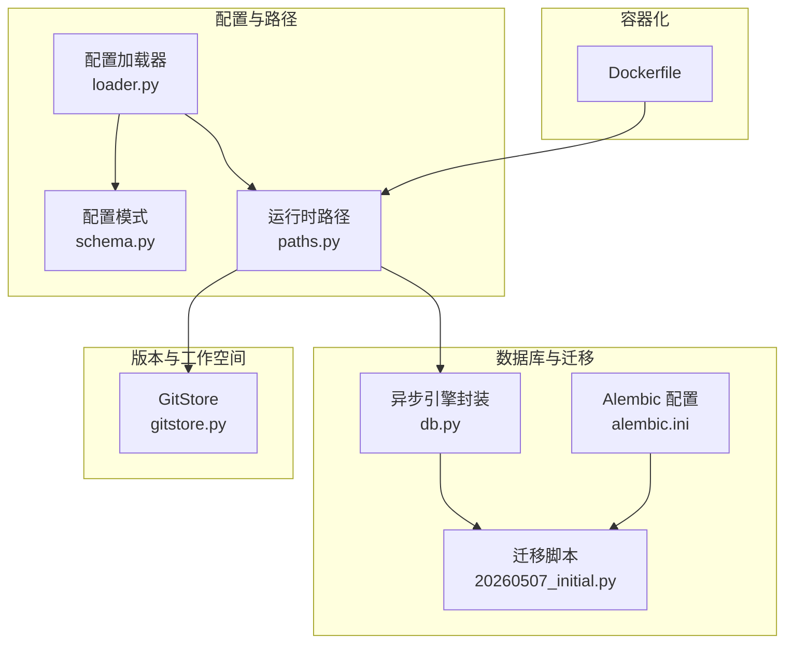
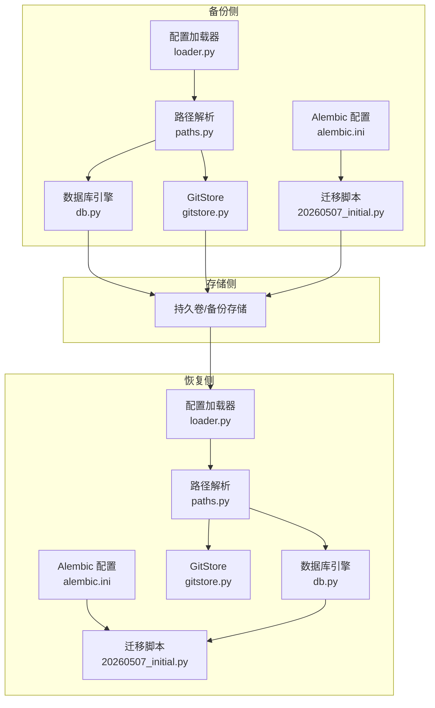
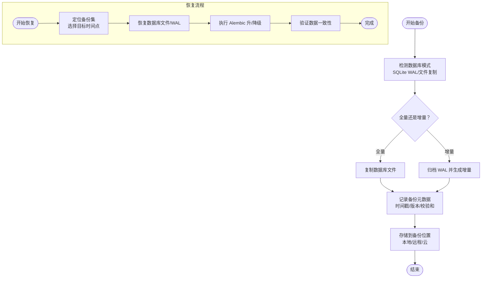
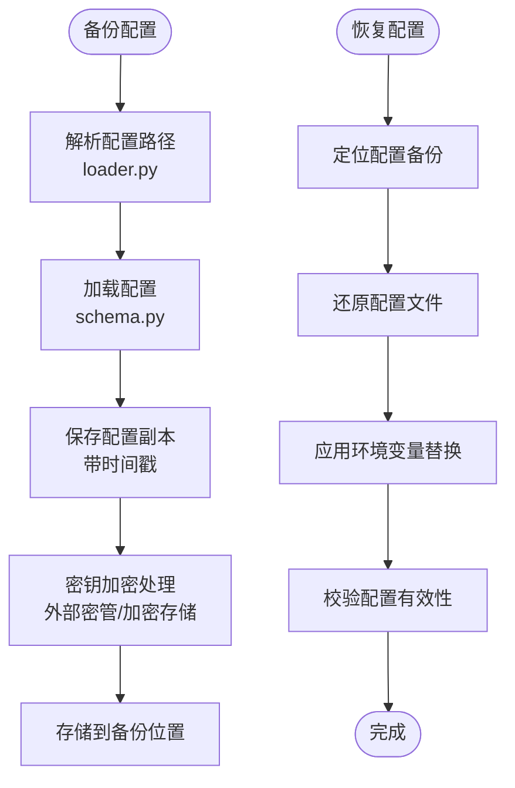
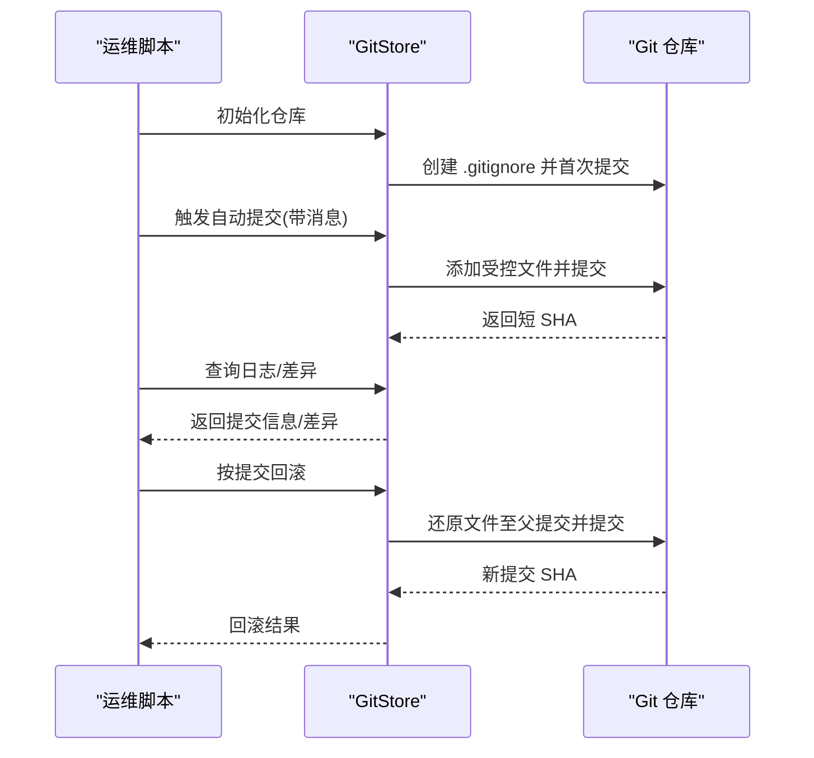
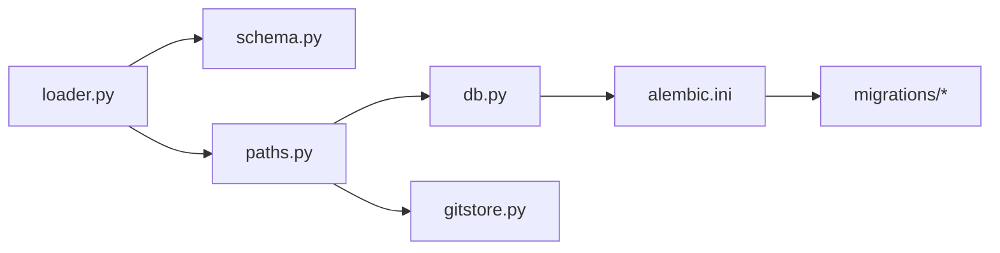

# 备份与恢复

<cite>
**本文引用的文件**
- [secbot/cmdb/migrations/versions/20260507_initial.py](file://secbot/cmdb/migrations/versions/20260507_initial.py)
- [secbot/cmdb/alembic.ini](file://secbot/cmdb/alembic.ini)
- [secbot/cmdb/db.py](file://secbot/cmdb/db.py)
- [secbot/utils/gitstore.py](file://secbot/utils/gitstore.py)
- [secbot/config/loader.py](file://secbot/config/loader.py)
- [secbot/config/schema.py](file://secbot/config/schema.py)
- [secbot/config/paths.py](file://secbot/config/paths.py)
- [Dockerfile](file://Dockerfile)
</cite>

## 目录
1. [简介](#简介)
2. [项目结构](#项目结构)
3. [核心组件](#核心组件)
4. [架构总览](#架构总览)
5. [详细组件分析](#详细组件分析)
6. [依赖分析](#依赖分析)
7. [性能考虑](#性能考虑)
8. [故障排查指南](#故障排查指南)
9. [结论](#结论)
10. [附录](#附录)

## 简介
本指南面向运维与开发团队，提供一套可落地的“备份与恢复”流程，覆盖以下方面：
- 数据库备份策略：全量备份、增量备份与时间点恢复（基于 SQLite WAL 模式与 Alembic 迁移）。
- 配置文件与版本管理：环境配置、密钥文件与工作空间数据的备份与回滚。
- 存储策略：本地备份、远程备份与云存储集成建议。
- 验证与测试：备份完整性与可用性校验流程。
- 灾难恢复：RTO/RPO 目标、恢复步骤与业务连续性保障。
- 自动化与监控：备份脚本与告警建议。
- 演练与预案：定期恢复演练与应急预案。

## 项目结构
围绕备份与恢复的关键目录与文件如下：
- 数据库与迁移：cmdb 目录下的 Alembic 配置与迁移脚本，以及异步 SQLAlchemy 引擎封装。
- 版本控制与工作空间：GitStore 提供对受控文件的版本记录、自动提交与回滚能力。
- 配置与路径：配置加载器、模式定义与运行时路径解析，用于定位数据目录与工作空间。
- 容器化部署：Dockerfile 描述了镜像构建与运行用户，为备份卷挂载与持久化提供基础。

图表来源
- [secbot/config/loader.py:32-81](file://secbot/config/loader.py#L32-L81)
- [secbot/config/schema.py:267-376](file://secbot/config/schema.py#L267-L376)
- [secbot/config/paths.py:11-47](file://secbot/config/paths.py#L11-L47)
- [secbot/cmdb/db.py:64-133](file://secbot/cmdb/db.py#L64-L133)
- [secbot/cmdb/alembic.ini:4-8](file://secbot/cmdb/alembic.ini#L4-L8)
- [secbot/cmdb/migrations/versions/20260507_initial.py:23-159](file://secbot/cmdb/migrations/versions/20260507_initial.py#L23-L159)
- [secbot/utils/gitstore.py:45-391](file://secbot/utils/gitstore.py#L45-L391)
- [Dockerfile:15-49](file://Dockerfile#L15-L49)

章节来源
- [secbot/config/loader.py:32-81](file://secbot/config/loader.py#L32-L81)
- [secbot/config/schema.py:267-376](file://secbot/config/schema.py#L267-L376)
- [secbot/config/paths.py:11-47](file://secbot/config/paths.py#L11-L47)
- [secbot/cmdb/db.py:64-133](file://secbot/cmdb/db.py#L64-L133)
- [secbot/cmdb/alembic.ini:4-8](file://secbot/cmdb/alembic.ini#L4-L8)
- [secbot/cmdb/migrations/versions/20260507_initial.py:23-159](file://secbot/cmdb/migrations/versions/20260507_initial.py#L23-L159)
- [secbot/utils/gitstore.py:45-391](file://secbot/utils/gitstore.py#L45-L391)
- [Dockerfile:15-49](file://Dockerfile#L15-L49)

## 核心组件
- 数据库引擎与 WAL 模式：通过异步 SQLAlchemy 引擎初始化、连接事件注入 SQLite PRAGMAs（WAL、同步级别、外键、超时），支持单写多读并发，降低锁冲突风险。
- Alembic 迁移：集中管理数据库模式演进，提供升级/降级能力，便于在恢复后进行版本对齐。
- GitStore：对工作空间中受控文件进行 Git 版本管理，支持自动提交、日志查询、差异比较与按提交回滚。
- 配置加载与路径：统一解析配置文件路径、数据目录与工作空间路径，确保备份范围与恢复路径一致。
- 容器化运行：非 root 用户运行，暴露网关端口，便于在容器环境中进行备份卷挂载与恢复。

章节来源
- [secbot/cmdb/db.py:64-133](file://secbot/cmdb/db.py#L64-L133)
- [secbot/cmdb/migrations/versions/20260507_initial.py:23-159](file://secbot/cmdb/migrations/versions/20260507_initial.py#L23-L159)
- [secbot/utils/gitstore.py:45-391](file://secbot/utils/gitstore.py#L45-L391)
- [secbot/config/loader.py:32-81](file://secbot/config/loader.py#L32-L81)
- [secbot/config/paths.py:11-47](file://secbot/config/paths.py#L11-L47)
- [Dockerfile:35-49](file://Dockerfile#L35-L49)

## 架构总览
下图展示备份与恢复涉及的数据流与组件交互：

图表来源
- [secbot/config/loader.py:32-81](file://secbot/config/loader.py#L32-L81)
- [secbot/config/paths.py:11-47](file://secbot/config/paths.py#L11-L47)
- [secbot/cmdb/db.py:64-133](file://secbot/cmdb/db.py#L64-L133)
- [secbot/utils/gitstore.py:45-391](file://secbot/utils/gitstore.py#L45-L391)
- [secbot/cmdb/alembic.ini:4-8](file://secbot/cmdb/alembic.ini#L4-L8)
- [secbot/cmdb/migrations/versions/20260507_initial.py:23-159](file://secbot/cmdb/migrations/versions/20260507_initial.py#L23-L159)

## 详细组件分析

### 数据库备份与恢复（SQLite + Alembic）
- 全量备份
  - 基于 WAL 模式的 SQLite 文件直接复制即可视为一致性快照；结合 Alembic 迁移历史，可在恢复后执行升级以对齐目标版本。
  - 推荐在空闲时段或应用停止时进行复制，避免 WAL 切换导致的不一致。
- 增量备份
  - SQLite 的 WAL 模式允许在事务期间持续写入，但增量备份需结合 WAL 文件与检查点机制；通常采用“文件级增量”策略（如 rsync 差分）配合 WAL 归档。
- 时间点恢复（PITR）
  - 由于 SQLite 不原生支持二进制日志，PITR 需要 WAL 归档与手动重放；建议在生产环境启用 WAL 归档与周期性 checkpoint，并结合 Alembic 记录的迁移时间线进行版本回退。
- 迁移与版本对齐
  - 使用 Alembic 升级/降级确保数据库模式与应用版本匹配；恢复后优先执行升级，必要时再执行降级以回到目标版本。

图表来源
- [secbot/cmdb/db.py:51-93](file://secbot/cmdb/db.py#L51-L93)
- [secbot/cmdb/migrations/versions/20260507_initial.py:23-159](file://secbot/cmdb/migrations/versions/20260507_initial.py#L23-L159)
- [secbot/cmdb/alembic.ini:4-8](file://secbot/cmdb/alembic.ini#L4-L8)

章节来源
- [secbot/cmdb/db.py:51-93](file://secbot/cmdb/db.py#L51-L93)
- [secbot/cmdb/migrations/versions/20260507_initial.py:23-159](file://secbot/cmdb/migrations/versions/20260507_initial.py#L23-L159)
- [secbot/cmdb/alembic.ini:4-8](file://secbot/cmdb/alembic.ini#L4-L8)

### 配置文件与密钥备份与版本管理
- 配置文件
  - 默认配置路径位于用户主目录下的特定子目录；可通过环境变量覆盖；支持 JSON 格式与 Pydantic 校验。
  - 建议将配置文件纳入版本控制或备份策略，确保恢复后能快速还原运行参数。
- 密钥文件
  - 配置中包含各类提供商的密钥字段；建议使用外部密管系统（如 KMS、Vault）或加密存储，并不在仓库中保存明文密钥。
- 工作空间数据
  - 工作空间路径由配置决定；GitStore 可对受控文件进行版本管理，支持自动提交与回滚。

图表来源
- [secbot/config/loader.py:32-81](file://secbot/config/loader.py#L32-L81)
- [secbot/config/schema.py:267-376](file://secbot/config/schema.py#L267-L376)
- [secbot/config/paths.py:11-47](file://secbot/config/paths.py#L11-L47)

章节来源
- [secbot/config/loader.py:32-81](file://secbot/config/loader.py#L32-L81)
- [secbot/config/schema.py:267-376](file://secbot/config/schema.py#L267-L376)
- [secbot/config/paths.py:11-47](file://secbot/config/paths.py#L11-L47)

### 工作空间版本管理与回滚
- GitStore 能力
  - 初始化仓库、写入 .gitignore、首次提交。
  - 自动提交：检测受控文件变更并提交。
  - 查询：查看提交日志、差异、按短 SHA 查找提交。
  - 回滚：根据指定提交还原受控文件至父提交状态并生成新提交。
- 使用建议
  - 将工作空间中的关键文件加入受控列表，确保重要变更可追溯。
  - 结合定时任务触发自动提交，形成每日快照。

图表来源
- [secbot/utils/gitstore.py:58-153](file://secbot/utils/gitstore.py#L58-L153)
- [secbot/utils/gitstore.py:212-320](file://secbot/utils/gitstore.py#L212-L320)
- [secbot/utils/gitstore.py:323-371](file://secbot/utils/gitstore.py#L323-L371)

章节来源
- [secbot/utils/gitstore.py:45-391](file://secbot/utils/gitstore.py#L45-L391)

### 存储策略（本地、远程、云）
- 本地备份
  - 在主机上创建独立备份分区或目录，定期复制数据库文件、配置文件与工作空间受控文件。
- 远程备份
  - 通过网络存储（NAS/SAN）或 SSH/SFTP 同步到远端，建议开启压缩与校验。
- 云存储集成
  - 支持对象存储（如 S3、OSS）作为长期归档；建议启用版本化与跨区域复制。
- 卷与持久化
  - 容器化部署时，将数据目录映射到持久卷，便于备份与恢复。

章节来源
- [Dockerfile:35-49](file://Dockerfile#L35-L49)
- [secbot/config/paths.py:11-47](file://secbot/config/paths.py#L11-L47)

### 备份验证与测试
- 数据库
  - 校验 WAL 与主库文件一致性；在隔离环境执行 Alembic 升/降级，验证模式对齐。
- 配置
  - 加载备份配置，执行最小化启动流程，确认各服务可达。
- 工作空间
  - 恢复受控文件，比对差异；执行关键任务验证功能正常。
- 测试清单
  - 定期进行“只读恢复演练”，验证备份可用性与恢复时间；记录 RTO/RPO 指标。

章节来源
- [secbot/cmdb/migrations/versions/20260507_initial.py:23-159](file://secbot/cmdb/migrations/versions/20260507_initial.py#L23-L159)
- [secbot/utils/gitstore.py:212-320](file://secbot/utils/gitstore.py#L212-L320)

### 灾难恢复计划（RTO/RPO 与步骤）
- RTO/RPO 目标
  - 全量备份：RPO=当日，RTO=数小时（取决于存储与传输）。
  - 增量+WAL：RPO=分钟级，RTO=数分钟至数十分钟。
- 恢复步骤
  - 快速评估：确定故障类型与影响范围。
  - 数据恢复：恢复数据库文件/WAL、配置与工作空间受控文件。
  - 版本对齐：执行 Alembic 升/降级，确保模式匹配。
  - 功能验证：启动服务，执行健康检查与关键路径测试。
  - 业务回归：逐步放量，监控指标与告警。
- 业务连续性
  - 多活/异地容灾：结合云存储与多地域部署，缩短 RTO。
  - 自动化：将恢复流程脚本化，减少人工干预。

章节来源
- [secbot/cmdb/db.py:51-93](file://secbot/cmdb/db.py#L51-L93)
- [secbot/cmdb/migrations/versions/20260507_initial.py:23-159](file://secbot/cmdb/migrations/versions/20260507_initial.py#L23-L159)

### 自动化备份脚本与监控告警
- 自动化脚本建议
  - 数据库：定时复制 SQLite 文件与 WAL，生成校验和；推送元数据到监控系统。
  - 配置：备份配置文件与密钥副本，加密存储。
  - 工作空间：定时触发 GitStore 自动提交，保留最近 N 天快照。
- 监控与告警
  - 备份成功率、耗时、校验失败、存储容量阈值。
  - 恢复演练失败告警与人工确认流程。

章节来源
- [secbot/utils/gitstore.py:121-153](file://secbot/utils/gitstore.py#L121-L153)
- [secbot/config/loader.py:66-81](file://secbot/config/loader.py#L66-L81)

### 恢复演练与应急预案
- 演练频率
  - 至少每季度进行一次“只读恢复演练”，覆盖数据库、配置与工作空间。
- 应急预案
  - 明确角色与职责、通信渠道、回退策略与升级流程。
  - 准备应急包：恢复脚本、密钥访问凭证、联系人清单。

章节来源
- [secbot/cmdb/alembic.ini:4-8](file://secbot/cmdb/alembic.ini#L4-L8)
- [secbot/utils/gitstore.py:323-371](file://secbot/utils/gitstore.py#L323-L371)

## 依赖分析
- 组件耦合
  - 配置模块为路径与数据库/GitStore 提供统一入口，耦合度低、内聚性强。
  - 数据库层仅依赖 SQLAlchemy 与 Alembic，迁移脚本与引擎解耦。
- 外部依赖
  - GitStore 依赖 dulwich；数据库依赖 SQLAlchemy/aiosqlite；容器运行依赖非 root 用户与持久卷。

图表来源
- [secbot/config/loader.py:32-81](file://secbot/config/loader.py#L32-L81)
- [secbot/config/schema.py:267-376](file://secbot/config/schema.py#L267-L376)
- [secbot/config/paths.py:11-47](file://secbot/config/paths.py#L11-L47)
- [secbot/cmdb/db.py:64-133](file://secbot/cmdb/db.py#L64-L133)
- [secbot/utils/gitstore.py:45-391](file://secbot/utils/gitstore.py#L45-L391)
- [secbot/cmdb/alembic.ini:4-8](file://secbot/cmdb/alembic.ini#L4-L8)

章节来源
- [secbot/config/loader.py:32-81](file://secbot/config/loader.py#L32-L81)
- [secbot/config/schema.py:267-376](file://secbot/config/schema.py#L267-L376)
- [secbot/config/paths.py:11-47](file://secbot/config/paths.py#L11-L47)
- [secbot/cmdb/db.py:64-133](file://secbot/cmdb/db.py#L64-L133)
- [secbot/utils/gitstore.py:45-391](file://secbot/utils/gitstore.py#L45-L391)
- [secbot/cmdb/alembic.ini:4-8](file://secbot/cmdb/alembic.ini#L4-L8)

## 性能考虑
- 数据库
  - WAL 模式提升并发写入性能，但在高写入场景下建议缩短 checkpoint 周期与优化磁盘 IO。
- 版本管理
  - GitStore 对频繁小变更会增加提交数量，建议合并提交或设置合理的提交间隔。
- 存储
  - 本地直连 SSD 优于机械盘；远程/云存储建议启用压缩与去重。

## 故障排查指南
- 数据库无法启动
  - 检查 WAL 文件完整性与权限；确认 Alembic 迁移是否成功。
- 配置加载失败
  - 校验 JSON 格式与必填字段；确认环境变量替换是否正确。
- 工作空间回滚无效
  - 确认受控文件列表与 .gitignore；检查提交是否存在父提交。

章节来源
- [secbot/cmdb/db.py:51-93](file://secbot/cmdb/db.py#L51-L93)
- [secbot/config/loader.py:51-56](file://secbot/config/loader.py#L51-L56)
- [secbot/utils/gitstore.py:323-371](file://secbot/utils/gitstore.py#L323-L371)

## 结论
通过将 SQLite 的 WAL 模式、Alembic 迁移、GitStore 版本管理与统一的配置/路径体系相结合，可构建一套覆盖全量、增量与时间点恢复的完整备份与恢复方案。建议配合自动化脚本与监控告警，定期开展恢复演练，明确 RTO/RPO 目标，确保业务连续性。

## 附录
- 关键路径参考
  - 配置文件默认路径与加载逻辑：[配置加载器:32-81](file://secbot/config/loader.py#L32-L81)
  - 数据库默认路径与引擎初始化：[数据库引擎:29-93](file://secbot/cmdb/db.py#L29-L93)
  - 工作空间路径解析：[运行时路径:37-47](file://secbot/config/paths.py#L37-L47)
  - GitStore 初始化与回滚：[GitStore:58-153](file://secbot/utils/gitstore.py#L58-L153), [GitStore:323-371](file://secbot/utils/gitstore.py#L323-L371)
  - Alembic 配置与迁移：[Alembic 配置:4-8](file://secbot/cmdb/alembic.ini#L4-L8), [迁移脚本:23-159](file://secbot/cmdb/migrations/versions/20260507_initial.py#L23-L159)
  - 容器化运行与持久化：[Dockerfile:35-49](file://Dockerfile#L35-L49)