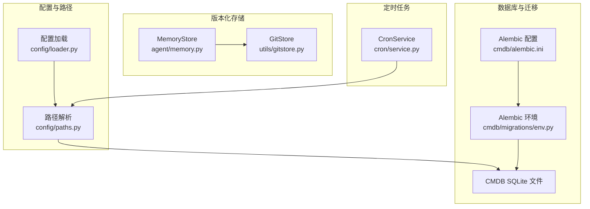
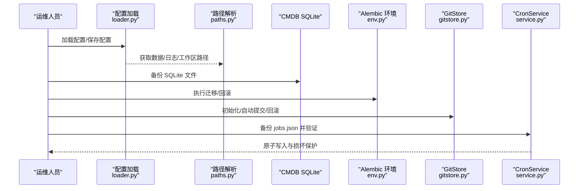
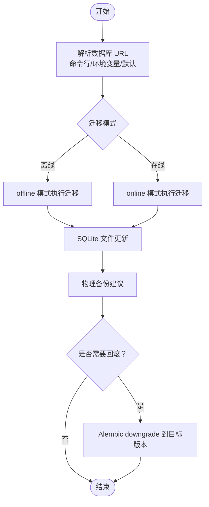
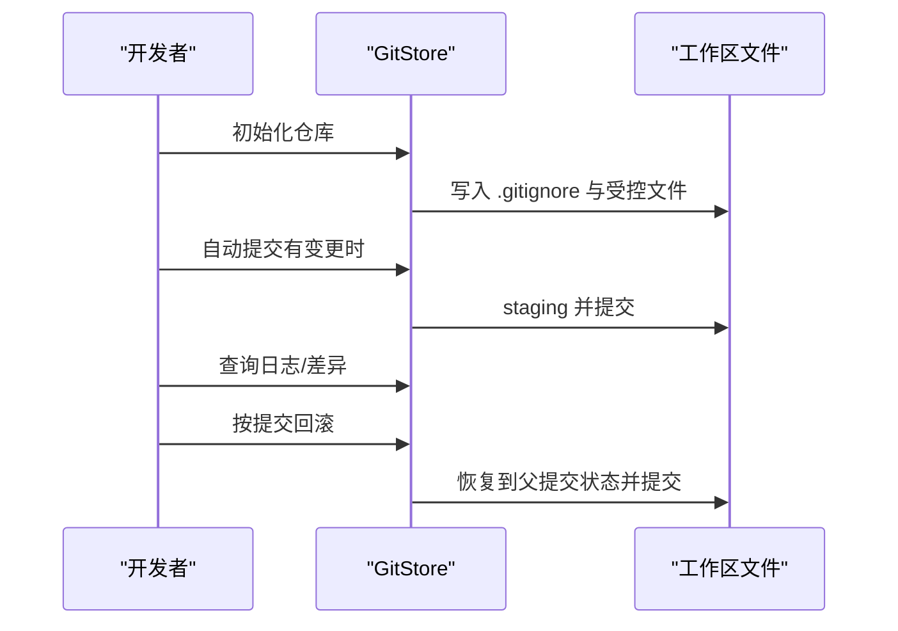
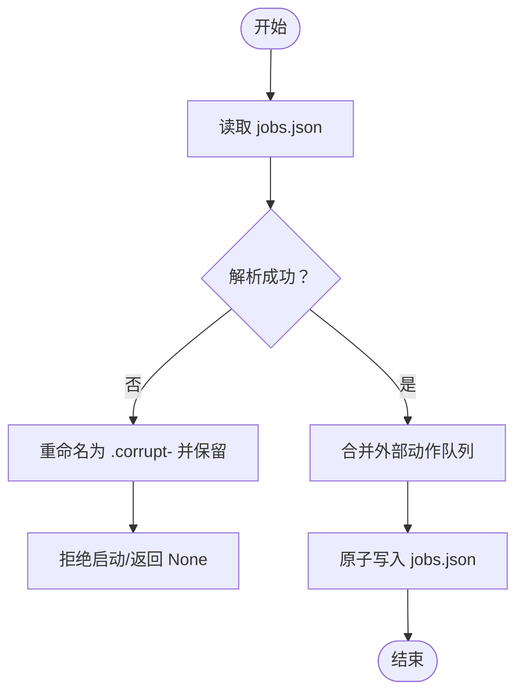
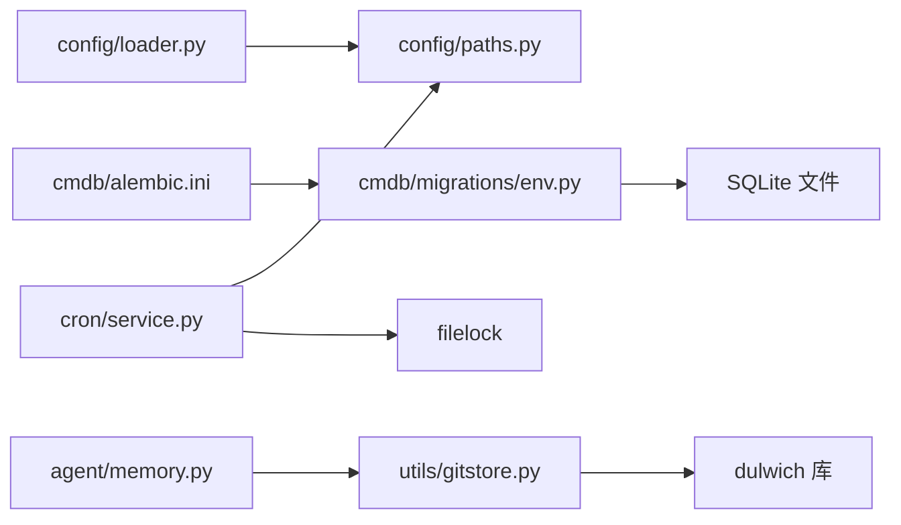

# 备份恢复

<cite>
**本文引用的文件**
- [secbot/cmdb/migrations/env.py](file://secbot/cmdb/migrations/env.py)
- [secbot/cmdb/alembic.ini](file://secbot/cmdb/alembic.ini)
- [secbot/config/loader.py](file://secbot/config/loader.py)
- [secbot/config/paths.py](file://secbot/config/paths.py)
- [secbot/utils/helpers.py](file://secbot/utils/helpers.py)
- [secbot/utils/gitstore.py](file://secbot/utils/gitstore.py)
- [secbot/agent/memory.py](file://secbot/agent/memory.py)
- [secbot/cron/service.py](file://secbot/cron/service.py)
- [tests/cron/test_cron_persistence.py](file://tests/cron/test_cron_persistence.py)
- [tests/agent/test_memory_store.py](file://tests/agent/test_memory_store.py)
- [Dockerfile](file://Dockerfile)
</cite>

## 目录
1. [简介](#简介)
2. [项目结构](#项目结构)
3. [核心组件](#核心组件)
4. [架构总览](#架构总览)
5. [详细组件分析](#详细组件分析)
6. [依赖分析](#依赖分析)
7. [性能考量](#性能考量)
8. [故障排查指南](#故障排查指南)
9. [结论](#结论)
10. [附录](#附录)

## 简介
本文件面向 VAPT3/secbot 的运维与开发团队，提供一套系统化的备份与恢复方案。内容覆盖数据库（CMDB）备份与 Alembic 迁移的备份/回滚策略、配置文件与运行时数据备份、日志与工作区数据备份、自动化备份脚本与定时任务建议、灾难恢复计划（RTO/RPO）、数据迁移与升级最佳实践，以及备份验证与恢复测试操作指南。

## 项目结构
围绕备份与恢复的关键路径与模块如下：
- 配置与路径：配置文件位置、数据目录、日志目录、工作区路径解析
- 数据库与迁移：SQLite 本地 CMDB、Alembic 环境与配置、离线/在线迁移
- 版本化内存与工作区：Git 存储用于记忆文件与工作区变更追踪
- 定时任务持久化：Cron 服务的原子写入与损坏保护
- 日志桥接：标准库日志到 loguru 的桥接，便于统一采集

图表来源
- [secbot/config/loader.py:1-173](file://secbot/config/loader.py#L1-L173)
- [secbot/config/paths.py:1-63](file://secbot/config/paths.py#L1-L63)
- [secbot/cmdb/migrations/env.py:1-78](file://secbot/cmdb/migrations/env.py#L1-L78)
- [secbot/cmdb/alembic.ini:1-45](file://secbot/cmdb/alembic.ini#L1-L45)
- [secbot/utils/gitstore.py:1-391](file://secbot/utils/gitstore.py#L1-L391)
- [secbot/agent/memory.py:39-69](file://secbot/agent/memory.py#L39-L69)
- [secbot/cron/service.py:1-665](file://secbot/cron/service.py#L1-L665)

章节来源
- [secbot/config/loader.py:1-173](file://secbot/config/loader.py#L1-L173)
- [secbot/config/paths.py:1-63](file://secbot/config/paths.py#L1-L63)
- [secbot/cmdb/migrations/env.py:1-78](file://secbot/cmdb/migrations/env.py#L1-L78)
- [secbot/cmdb/alembic.ini:1-45](file://secbot/cmdb/alembic.ini#L1-L45)
- [secbot/utils/gitstore.py:1-391](file://secbot/utils/gitstore.py#L1-L391)
- [secbot/agent/memory.py:39-69](file://secbot/agent/memory.py#L39-L69)
- [secbot/cron/service.py:1-665](file://secbot/cron/service.py#L1-L665)

## 核心组件
- 配置与路径
  - 配置文件默认位于用户主目录下的 secbot 配置文件，支持环境变量与内嵌占位符解析，并提供保存与迁移逻辑
  - 路径解析提供数据目录、日志目录、媒体目录、工作区路径等运行时子目录定位
- 数据库与迁移
  - Alembic 环境根据命令行参数、环境变量或默认用户目录生成数据库 URL，支持离线/在线迁移
  - 默认使用 SQLite，路径位于用户家目录 secbot 子目录下
- 版本化存储
  - MemoryStore 将关键记忆文件纳入 Git 管理，提供自动提交与回滚能力
  - GitStore 提供初始化、自动提交、日志查询、差异展示、按提交回滚等能力
- 定时任务持久化
  - CronService 使用原子写入与损坏保护，避免容器崩溃导致的任务列表损坏
  - 对损坏文件进行重命名并保留，避免覆盖造成数据丢失

章节来源
- [secbot/config/loader.py:32-81](file://secbot/config/loader.py#L32-L81)
- [secbot/config/paths.py:11-63](file://secbot/config/paths.py#L11-L63)
- [secbot/cmdb/migrations/env.py:33-44](file://secbot/cmdb/migrations/env.py#L33-L44)
- [secbot/utils/gitstore.py:58-153](file://secbot/utils/gitstore.py#L58-L153)
- [secbot/agent/memory.py:39-69](file://secbot/agent/memory.py#L39-L69)
- [secbot/cron/service.py:296-327](file://secbot/cron/service.py#L296-L327)

## 架构总览
备份与恢复涉及以下关键流程：
- 数据备份策略
  - 数据库：SQLite 文件作为 CMDB 原子单位，结合 Alembic 迁移历史进行版本化备份
  - 配置文件：config.json 及其依赖的环境变量解析结果
  - 日志文件：统一输出至运行时日志目录
  - 工作区数据：记忆文件与工作区内容通过 Git 管理，具备回滚能力
  - 定时任务：jobs.json 采用原子写入与损坏保护
- Alembic 迁移系统的备份与回滚
  - 迁移脚本与版本记录随代码仓库版本演进；回滚通过指定目标版本实现
- 自动化备份脚本与定时任务
  - 建议基于系统定时器或容器编排工具执行周期性打包与归档
- 灾难恢复计划
  - 明确 RTO/RPO 目标，定义恢复流程与验证步骤
- 数据迁移与升级
  - 保持迁移脚本幂等与可逆，提供回滚策略与数据转换校验

图表来源
- [secbot/config/loader.py:32-81](file://secbot/config/loader.py#L32-L81)
- [secbot/config/paths.py:11-63](file://secbot/config/paths.py#L11-L63)
- [secbot/cmdb/migrations/env.py:47-77](file://secbot/cmdb/migrations/env.py#L47-L77)
- [secbot/utils/gitstore.py:121-153](file://secbot/utils/gitstore.py#L121-L153)
- [secbot/cron/service.py:296-327](file://secbot/cron/service.py#L296-L327)

## 详细组件分析

### 数据库备份与 Alembic 迁移备份/回滚
- 数据库定位与 URL 解析
  - 支持命令行参数、环境变量、默认用户目录三种方式解析数据库 URL
  - 默认使用 SQLite，路径在用户家目录 secbot 子目录下
- 迁移执行模式
  - 离线/在线两种模式，均通过 Alembic 环境配置
- 回滚策略
  - 通过 Alembic 指定目标版本进行升级/降级
  - 建议在回滚前对当前数据库进行物理备份

图表来源
- [secbot/cmdb/migrations/env.py:33-44](file://secbot/cmdb/migrations/env.py#L33-L44)
- [secbot/cmdb/migrations/env.py:47-77](file://secbot/cmdb/migrations/env.py#L47-L77)
- [secbot/cmdb/alembic.ini:1-45](file://secbot/cmdb/alembic.ini#L1-L45)

章节来源
- [secbot/cmdb/migrations/env.py:1-78](file://secbot/cmdb/migrations/env.py#L1-L78)
- [secbot/cmdb/alembic.ini:1-45](file://secbot/cmdb/alembic.ini#L1-L45)

### 配置文件备份
- 配置文件位置与加载
  - 默认位于用户家目录 secbot 子目录下的配置文件
  - 支持环境变量占位符解析，解析失败会抛出异常
- 备份建议
  - 在修改配置后执行保存，备份保存后的最终配置状态
  - 结合版本控制系统对配置变更进行审计

章节来源
- [secbot/config/loader.py:25-81](file://secbot/config/loader.py#L25-L81)

### 日志文件备份
- 日志目录定位
  - 日志目录位于运行时数据目录下的 logs 子目录
- 建议
  - 将日志目录纳入定期备份范围
  - 使用集中式日志收集（如 filebeat、rsyslog）以提升可靠性

章节来源
- [secbot/config/paths.py:32-34](file://secbot/config/paths.py#L32-L34)

### 工作区数据备份与恢复
- 记忆文件与工作区版本化
  - MemoryStore 将关键记忆文件纳入 Git 管理，提供自动提交与回滚
  - GitStore 提供初始化、自动提交、日志查询、差异展示、按提交回滚
- 恢复流程
  - 通过 GitStore 的回滚功能恢复到指定提交
  - 验证恢复后的文件一致性

图表来源
- [secbot/utils/gitstore.py:58-153](file://secbot/utils/gitstore.py#L58-L153)
- [secbot/utils/gitstore.py:323-371](file://secbot/utils/gitstore.py#L323-L371)
- [secbot/agent/memory.py:39-69](file://secbot/agent/memory.py#L39-L69)

章节来源
- [secbot/utils/gitstore.py:1-391](file://secbot/utils/gitstore.py#L1-L391)
- [secbot/agent/memory.py:39-69](file://secbot/agent/memory.py#L39-L69)

### 定时任务持久化与损坏保护
- 原子写入与损坏保护
  - 采用临时文件 + 替换 + 同步写盘的方式，避免容器崩溃导致的任务列表损坏
  - 对损坏文件进行重命名并保留，避免覆盖造成数据丢失
- 恢复流程
  - 若损坏文件存在，应先检查损坏备份，再决定是否恢复或重建

图表来源
- [secbot/cron/service.py:95-175](file://secbot/cron/service.py#L95-L175)
- [secbot/cron/service.py:296-327](file://secbot/cron/service.py#L296-L327)

章节来源
- [secbot/cron/service.py:95-175](file://secbot/cron/service.py#L95-L175)
- [secbot/cron/service.py:296-327](file://secbot/cron/service.py#L296-L327)
- [tests/cron/test_cron_persistence.py:86-103](file://tests/cron/test_cron_persistence.py#L86-L103)

### 数据迁移与升级最佳实践
- 迁移脚本管理
  - 保持迁移脚本幂等，避免重复执行产生副作用
  - 在生产环境执行前进行充分测试与预演
- 数据转换与回滚
  - 对关键字段进行数据类型与格式校验
  - 提供回滚到上一版本的明确步骤与验证清单
- 版本兼容性
  - 通过 Alembic 版本号与迁移脚本名称管理版本演进
  - 在升级过程中确保数据库连接字符串与驱动兼容

章节来源
- [secbot/cmdb/migrations/env.py:33-44](file://secbot/cmdb/migrations/env.py#L33-L44)

## 依赖分析
- 组件耦合
  - 配置与路径：配置加载依赖路径解析，路径解析依赖配置文件位置
  - 数据库与迁移：Alembic 环境依赖数据库 URL 解析，迁移脚本与版本记录随代码仓库演进
  - 版本化存储：MemoryStore 依赖 GitStore，GitStore 依赖 dulwich 库
  - 定时任务：CronService 依赖路径解析与文件锁，保障并发安全
- 外部依赖
  - Alembic 与 SQLAlchemy 用于数据库迁移
  - dulwich 用于 Git 操作
  - filelock 用于跨实例并发控制

图表来源
- [secbot/config/loader.py:32-81](file://secbot/config/loader.py#L32-L81)
- [secbot/config/paths.py:11-63](file://secbot/config/paths.py#L11-L63)
- [secbot/cmdb/migrations/env.py:33-44](file://secbot/cmdb/migrations/env.py#L33-L44)
- [secbot/cmdb/alembic.ini:1-45](file://secbot/cmdb/alembic.ini#L1-45)
- [secbot/agent/memory.py:39-69](file://secbot/agent/memory.py#L39-L69)
- [secbot/utils/gitstore.py:58-153](file://secbot/utils/gitstore.py#L58-L153)
- [secbot/cron/service.py:14-87](file://secbot/cron/service.py#L14-L87)

章节来源
- [secbot/config/loader.py:1-173](file://secbot/config/loader.py#L1-L173)
- [secbot/config/paths.py:1-63](file://secbot/config/paths.py#L1-L63)
- [secbot/cmdb/migrations/env.py:1-78](file://secbot/cmdb/migrations/env.py#L1-L78)
- [secbot/cmdb/alembic.ini:1-45](file://secbot/cmdb/alembic.ini#L1-L45)
- [secbot/utils/gitstore.py:1-391](file://secbot/utils/gitstore.py#L1-L391)
- [secbot/cron/service.py:1-665](file://secbot/cron/service.py#L1-L665)

## 性能考量
- 原子写入与同步
  - CronService 的原子写入减少磁盘碎片与部分写入风险，提高稳定性
- 日志与 I/O
  - 将日志输出到独立目录，避免与数据目录争用 I/O
- Git 操作
  - GitStore 的自动提交仅在有变更时触发，降低频繁提交带来的开销

## 故障排查指南
- 配置加载失败
  - 检查配置文件 JSON 格式与字段合法性，确认环境变量已设置
- 数据库迁移失败
  - 确认数据库 URL 解析正确，检查 Alembic 配置文件与迁移脚本
- Cron 任务损坏
  - 查看损坏备份文件，确认是否需要恢复或重建
- Git 回滚失败
  - 检查提交是否存在、是否为根提交、工作区是否被其他 Git 管理

章节来源
- [secbot/config/loader.py:51-56](file://secbot/config/loader.py#L51-L56)
- [secbot/cron/service.py:167-173](file://secbot/cron/service.py#L167-L173)
- [tests/cron/test_cron_persistence.py:86-103](file://tests/cron/test_cron_persistence.py#L86-L103)
- [secbot/utils/gitstore.py:347-350](file://secbot/utils/gitstore.py#L347-L350)

## 结论
通过将配置、数据库、日志、工作区与定时任务纳入统一的备份与恢复体系，并结合 Alembic 的版本化迁移与 Git 的回滚能力，可以有效降低数据丢失风险并提升系统可维护性。建议在生产环境中严格执行备份策略、定期演练恢复流程，并持续优化自动化脚本与监控告警。

## 附录

### 自动化备份脚本与定时任务建议
- 备份范围
  - 配置文件：config.json 及其依赖的环境变量解析结果
  - 数据库：CMDB SQLite 文件
  - 日志：运行时日志目录
  - 工作区：记忆文件与工作区内容（由 Git 管理）
  - 定时任务：jobs.json 及其损坏备份
- 建议
  - 使用系统定时器或容器编排工具定期执行打包与归档
  - 将备份文件上传至远程存储（对象存储或网络存储），并启用生命周期管理
  - 对备份文件进行完整性校验与解压验证

### 灾难恢复计划（RTO/RPO）
- RTO（恢复时间目标）
  - 通过预热镜像与快速恢复脚本缩短恢复时间
- RPO（恢复点目标）
  - 采用增量备份与事务一致快照，结合版本化迁移与 Git 回滚实现细粒度恢复
- 流程与验证
  - 制定恢复流程清单，定期进行恢复演练与验证

### 备份验证与恢复测试操作指南
- 验证步骤
  - 校验备份文件完整性与可用性
  - 在隔离环境中执行恢复测试，验证关键数据一致性
- 恢复测试
  - 对配置、数据库、日志、工作区与定时任务分别进行恢复测试
  - 记录测试结果与改进项