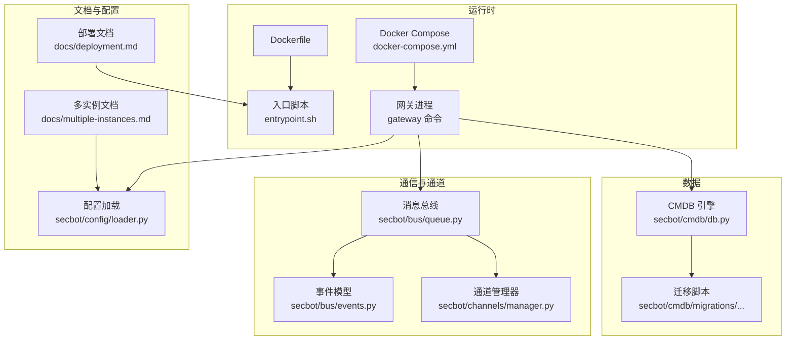
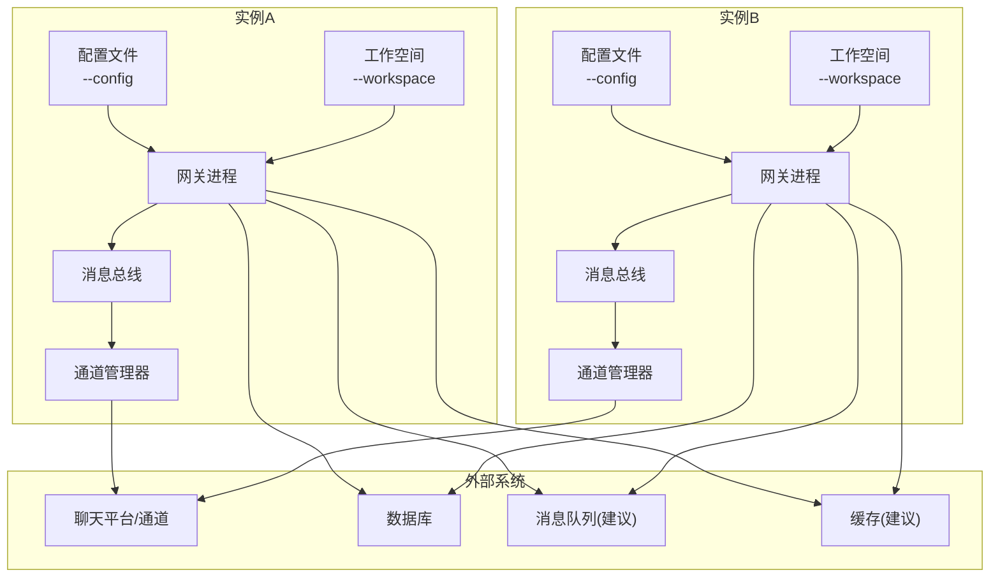
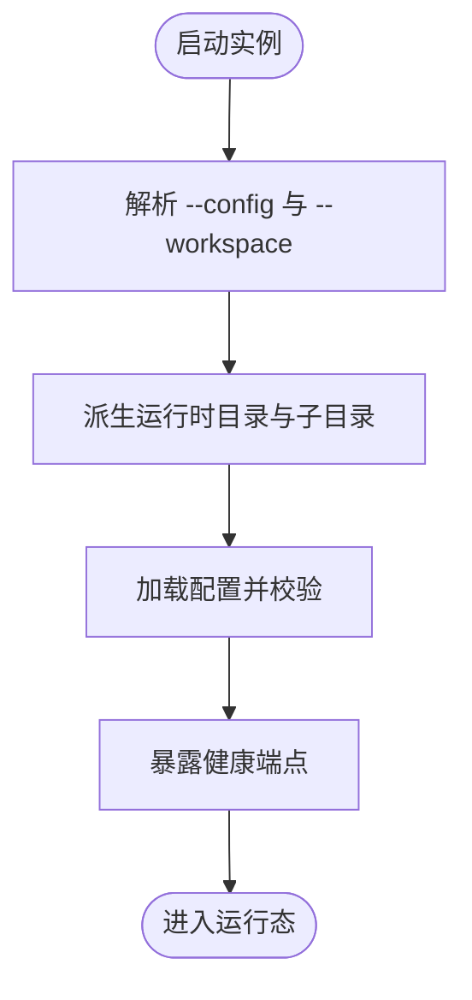
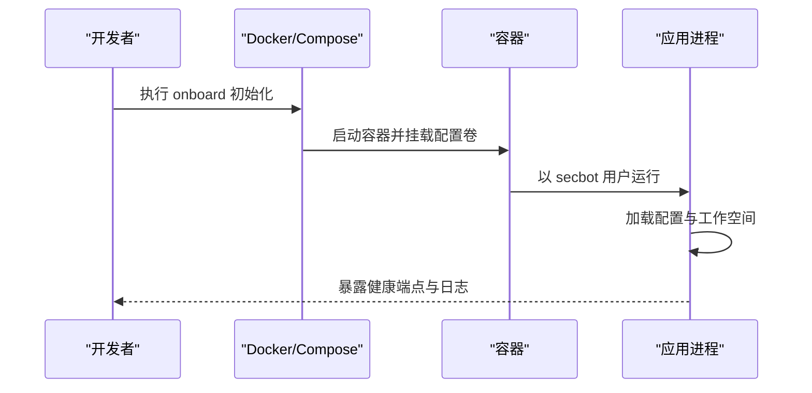
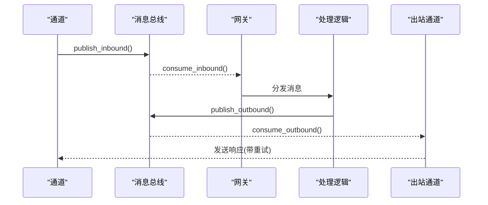
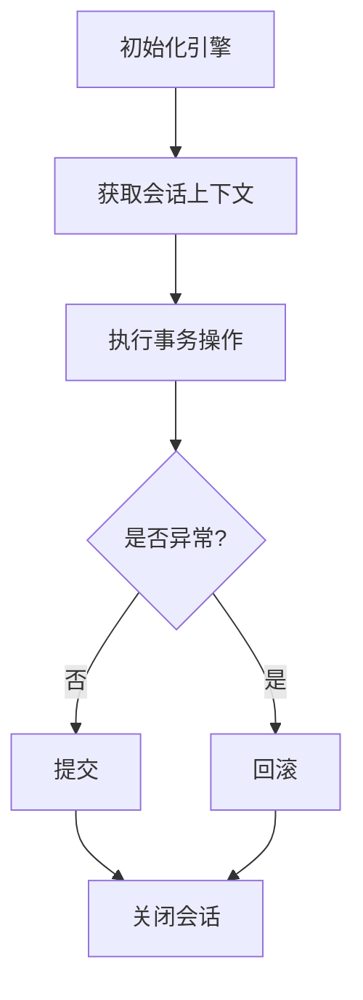
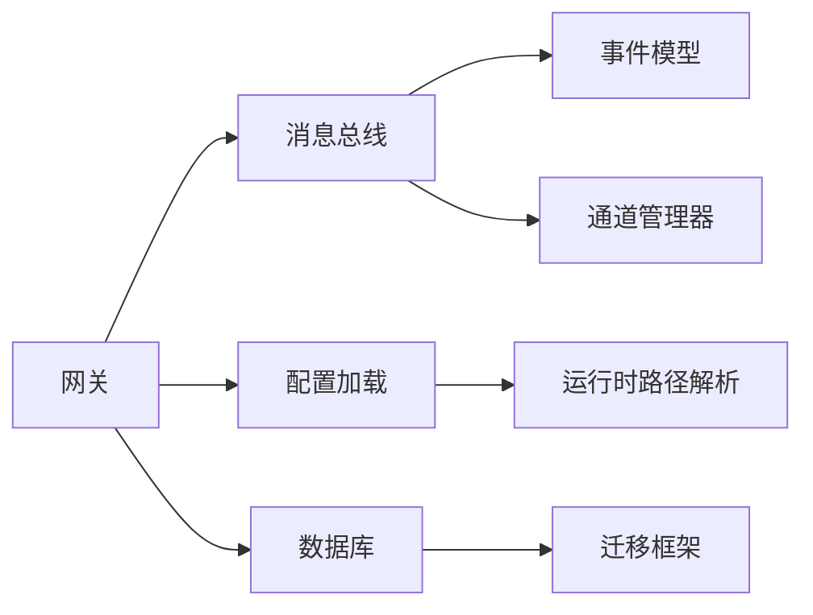

# 多实例部署

<cite>
**本文引用的文件**
- [multiple-instances.md](file://docs/multiple-instances.md)
- [deployment.md](file://docs/deployment.md)
- [docker-compose.yml](file://docker-compose.yml)
- [Dockerfile](file://Dockerfile)
- [entrypoint.sh](file://entrypoint.sh)
- [pyproject.toml](file://pyproject.toml)
- [loader.py](file://secbot/config/loader.py)
- [manager.py](file://secbot/channels/manager.py)
- [events.py](file://secbot/bus/events.py)
- [queue.py](file://secbot/bus/queue.py)
- [db.py](file://secbot/cmdb/db.py)
- [20260507_initial.py](file://secbot/cmdb/migrations/versions/20260507_initial.py)
</cite>

## 目录
1. [简介](#简介)
2. [项目结构](#项目结构)
3. [核心组件](#核心组件)
4. [架构总览](#架构总览)
5. [详细组件分析](#详细组件分析)
6. [依赖分析](#依赖分析)
7. [性能考虑](#性能考虑)
8. [故障排查指南](#故障排查指南)
9. [结论](#结论)
10. [附录](#附录)

## 简介
本方案围绕多实例部署展开，目标是实现水平扩展与高可用：通过独立配置与工作空间隔离多个实例；在容器与系统服务层面提供可重复的启动流程；结合消息总线与通道管理器实现跨实例的消息解耦；并通过资源限制与健康检查保障运行稳定性。当前仓库已提供多实例运行方式、Docker 容器化与编排示例、以及消息总线与通道管理的基础能力，本文在此基础上补充数据库、缓存与消息队列的集群化建议，并给出 Kubernetes 部署与运维自动化思路。

## 项目结构
- 文档层：多实例运行、部署与容器化说明位于 docs 目录
- 运行时层：通过命令入口与配置加载模块支持多实例路径解析
- 通信层：消息总线与通道管理器实现入站/出站消息解耦
- 数据层：CMDB 使用异步 SQLAlchemy 引擎与会话管理

**图表来源**
- [multiple-instances.md:1-127](file://docs/multiple-instances.md#L1-L127)
- [deployment.md:1-171](file://docs/deployment.md#L1-L171)
- [loader.py:1-173](file://secbot/config/loader.py#L1-L173)
- [queue.py:1-45](file://secbot/bus/queue.py#L1-L45)
- [events.py:1-39](file://secbot/bus/events.py#L1-L39)
- [manager.py:1-428](file://secbot/channels/manager.py#L1-L428)
- [db.py:87-132](file://secbot/cmdb/db.py#L87-L132)
- [20260507_initial.py:76-107](file://secbot/cmdb/migrations/versions/20260507_initial.py#L76-L107)

**章节来源**
- [multiple-instances.md:1-127](file://docs/multiple-instances.md#L1-L127)
- [deployment.md:1-171](file://docs/deployment.md#L1-L171)
- [docker-compose.yml:1-56](file://docker-compose.yml#L1-L56)
- [Dockerfile:1-51](file://Dockerfile#L1-L51)
- [entrypoint.sh:1-16](file://entrypoint.sh#L1-L16)
- [pyproject.toml:1-169](file://pyproject.toml#L1-L169)

## 核心组件
- 多实例路径解析与配置加载
  - 通过命令行参数选择配置文件，派生运行时目录与工作空间
  - 支持独立工作空间与 Cron、媒体等运行态目录
- 消息总线与通道管理
  - 入站/出站队列解耦通道与处理逻辑
  - 通道管理器统一初始化与启停，具备重试与去重能力
- 数据访问层
  - 异步引擎与上下文会话管理，确保事务安全与优雅关闭

**章节来源**
- [multiple-instances.md:35-127](file://docs/multiple-instances.md#L35-L127)
- [loader.py:15-81](file://secbot/config/loader.py#L15-L81)
- [queue.py:8-45](file://secbot/bus/queue.py#L8-L45)
- [manager.py:41-235](file://secbot/channels/manager.py#L41-L235)
- [db.py:103-132](file://secbot/cmdb/db.py#L103-L132)

## 架构总览
下图展示多实例部署的端到端交互：每个实例拥有独立配置与工作空间；容器或系统服务负责生命周期管理；消息总线在实例内部解耦通道与处理；数据库提供持久化能力。

**图表来源**
- [multiple-instances.md:11-33](file://docs/multiple-instances.md#L11-L33)
- [deployment.md:13-45](file://docs/deployment.md#L13-L45)
- [loader.py:19-30](file://secbot/config/loader.py#L19-L30)
- [queue.py:8-45](file://secbot/bus/queue.py#L8-L45)
- [manager.py:41-111](file://secbot/channels/manager.py#L41-L111)

## 详细组件分析

### 多实例运行与隔离
- 独立配置与工作空间
  - 通过命令行参数指定配置文件与工作空间，避免实例间共享状态
  - 默认派生运行时目录与 Cron、媒体等子目录
- 健康检查
  - 网关实例暴露轻量 HTTP 健康端点，便于外部探测
- 最小化设置
  - 复制基础配置，修改工作空间后即可启动

**图表来源**
- [multiple-instances.md:35-107](file://docs/multiple-instances.md#L35-L107)

**章节来源**
- [multiple-instances.md:11-127](file://docs/multiple-instances.md#L11-L127)

### 容器化与编排（Docker）
- 非 Root 用户与挂载策略
  - 容器以非 Root 用户运行，需正确挂载宿主机配置目录
- Compose 示例
  - 提供一键初始化、启动网关与查看日志的流程
- 资源限制
  - Compose 中为服务设置 CPU 与内存上限与预留

**图表来源**
- [deployment.md:13-45](file://docs/deployment.md#L13-L45)
- [docker-compose.yml:15-56](file://docker-compose.yml#L15-L56)
- [Dockerfile:35-49](file://Dockerfile#L35-L49)
- [entrypoint.sh:1-16](file://entrypoint.sh#L1-L16)

**章节来源**
- [deployment.md:1-171](file://docs/deployment.md#L1-L171)
- [docker-compose.yml:1-56](file://docker-compose.yml#L1-L56)
- [Dockerfile:1-51](file://Dockerfile#L1-L51)
- [entrypoint.sh:1-16](file://entrypoint.sh#L1-L16)

### 消息总线与通道管理
- 总线设计
  - 入站/出站队列解耦通道与处理逻辑，支持统计队列长度
- 通道管理
  - 自动发现与初始化启用的通道，统一启停与错误处理
  - 发送重试采用指数退避，降低瞬时失败影响
  - 出站消息去重与流式增量合并，减少 API 调用与延迟

**图表来源**
- [queue.py:8-45](file://secbot/bus/queue.py#L8-L45)
- [events.py:8-39](file://secbot/bus/events.py#L8-L39)
- [manager.py:173-409](file://secbot/channels/manager.py#L173-L409)

**章节来源**
- [queue.py:1-45](file://secbot/bus/queue.py#L1-L45)
- [events.py:1-39](file://secbot/bus/events.py#L1-L39)
- [manager.py:41-428](file://secbot/channels/manager.py#L41-L428)

### 数据库与迁移
- 引擎与会话
  - 异步引擎与上下文会话管理，提供提交/回滚与关闭语义
- 迁移脚本
  - 初始迁移定义资产与服务表结构，含唯一约束与默认值

**图表来源**
- [db.py:103-132](file://secbot/cmdb/db.py#L103-L132)
- [20260507_initial.py:76-107](file://secbot/cmdb/migrations/versions/20260507_initial.py#L76-L107)

**章节来源**
- [db.py:87-132](file://secbot/cmdb/db.py#L87-L132)
- [20260507_initial.py:76-107](file://secbot/cmdb/migrations/versions/20260507_initial.py#L76-L107)

## 依赖分析
- 组件内聚与耦合
  - 配置加载模块与运行时路径解析紧密耦合，但对外仅暴露路径设置与读取接口
  - 消息总线与通道管理器通过事件类型解耦，便于横向扩展
  - 数据访问层通过上下文会话管理器集中控制事务与连接生命周期
- 外部依赖
  - 容器镜像基于 Python 3.12，安装 Node.js 用于桥接组件
  - 依赖项覆盖网络、并发、序列化、数据库与第三方 SDK

**图表来源**
- [loader.py:19-81](file://secbot/config/loader.py#L19-L81)
- [queue.py:8-45](file://secbot/bus/queue.py#L8-L45)
- [events.py:8-39](file://secbot/bus/events.py#L8-L39)
- [manager.py:41-111](file://secbot/channels/manager.py#L41-L111)
- [db.py:87-132](file://secbot/cmdb/db.py#L87-L132)

**章节来源**
- [pyproject.toml:25-68](file://pyproject.toml#L25-L68)

## 性能考虑
- 并发与队列
  - 入站/出站队列支持统计长度，便于观察积压情况
  - 通道发送采用指数退避重试，避免雪崩效应
- I/O 与持久化
  - 异步引擎与会话管理减少阻塞，配合迁移脚本确保结构稳定
- 资源限制
  - Compose 中对 CPU 与内存进行上限与预留，保障多实例共存时的资源公平性

**章节来源**
- [queue.py:36-44](file://secbot/bus/queue.py#L36-L44)
- [manager.py:380-409](file://secbot/channels/manager.py#L380-L409)
- [docker-compose.yml:23-47](file://docker-compose.yml#L23-L47)

## 故障排查指南
- 权限问题（容器）
  - 当宿主机配置目录不可写时，入口脚本会提示修复方法（变更属主或使用特定用户运行）
- 端口占用（系统服务）
  - macOS/LaunchAgent 或 Linux systemd 服务若提示“地址已被占用”，先停止手动运行的实例再启动
- 健康检查
  - 网关实例提供健康端点，用于外部探测运行状态

**章节来源**
- [entrypoint.sh:1-16](file://entrypoint.sh#L1-L16)
- [deployment.md:170-171](file://docs/deployment.md#L170-L171)
- [multiple-instances.md:100-107](file://docs/multiple-instances.md#L100-L107)

## 结论
本方案基于现有仓库能力，提供了多实例运行、容器化与编排、消息总线与通道管理的实施路径。对于数据库、缓存与消息队列的集群化，建议在不改变现有模块接口的前提下，通过环境变量与配置注入的方式接入外部集群服务，并结合 Kubernetes 的服务发现与自动扩缩容能力实现弹性伸缩与高可用。

## 附录

### 多实例部署实施方案（建议）
- 负载均衡与会话共享
  - 使用反向代理或云负载均衡分发请求至各实例
  - 会话与状态建议通过共享存储或外部缓存实现（如 Redis 集群），避免单点状态丢失
- 数据库集群
  - 主从复制与只读副本：将查询流量导向只读副本，写操作集中在主库
  - 读写分离：应用侧根据 SQL 类型路由至不同连接
  - 故障转移：通过心跳检测与自动切换实现主从切换
- 缓存与消息队列
  - Redis 集群：提供高可用与水平扩展的键值存储
  - 消息中间件：Kafka/RabbitMQ 等实现异步解耦与削峰填谷
- 容器编排与运维
  - Kubernetes：Deployment/Service/HPA/Ingress 实现多副本、服务发现与自动扩缩容
  - 监控与日志：Prometheus/Grafana + Loki/ELK 观测指标与日志
  - 自动化：CI/CD 流水线与 GitOps 管理配置与发布
- 一致性与分布式锁
  - 通过 Redis/ZooKeeper 等实现分布式锁，保障跨实例的幂等与顺序
- 性能测试与容量规划
  - 压测工具：JMeter/Locust/K6 等模拟并发场景
  - 观察指标：QPS、P95/P99 延迟、CPU/内存/IO、队列长度、数据库连接池利用率
  - 规划：以峰值 QPS 与 SLA 为目标，按副本数与资源配额进行容量评估
- 灾备与故障转移
  - 多机房/多可用区部署，结合异地多活与数据同步
  - 定期演练：故障注入与切换演练，验证恢复时间与数据一致性