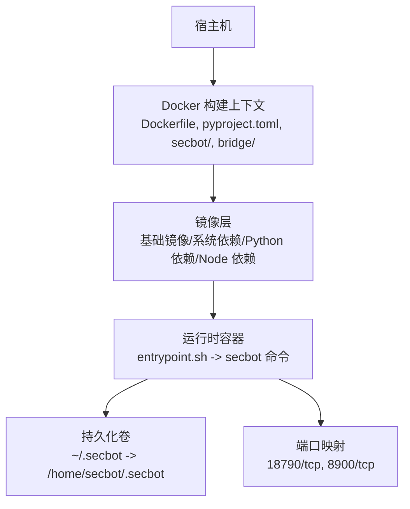
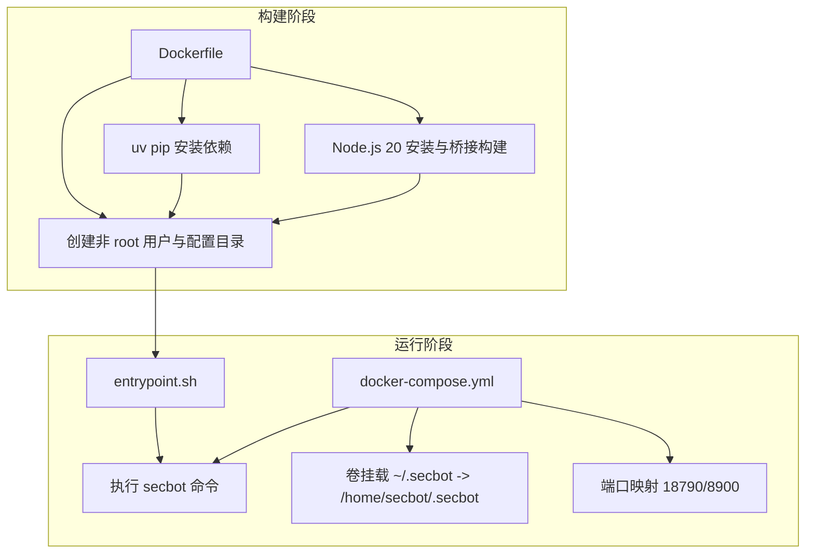
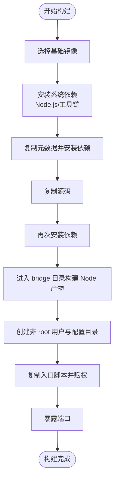
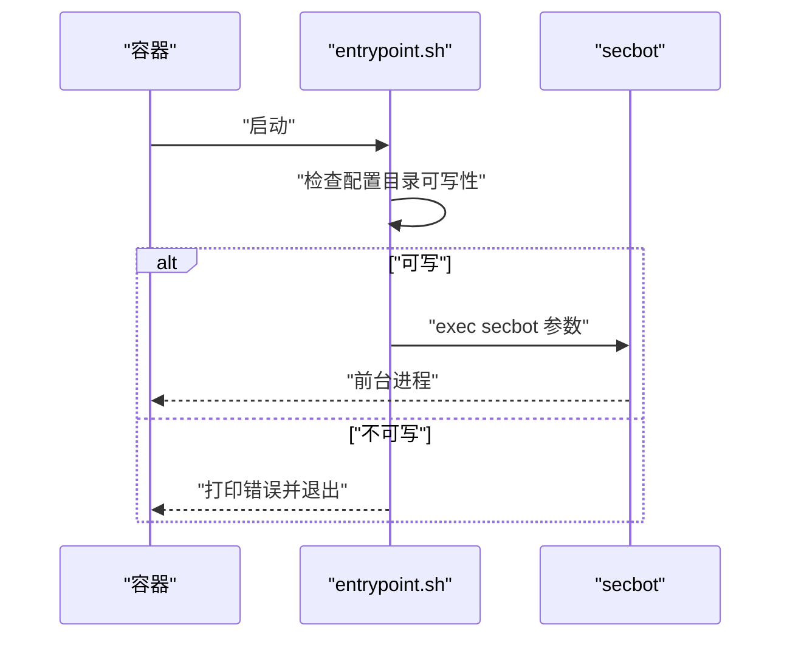
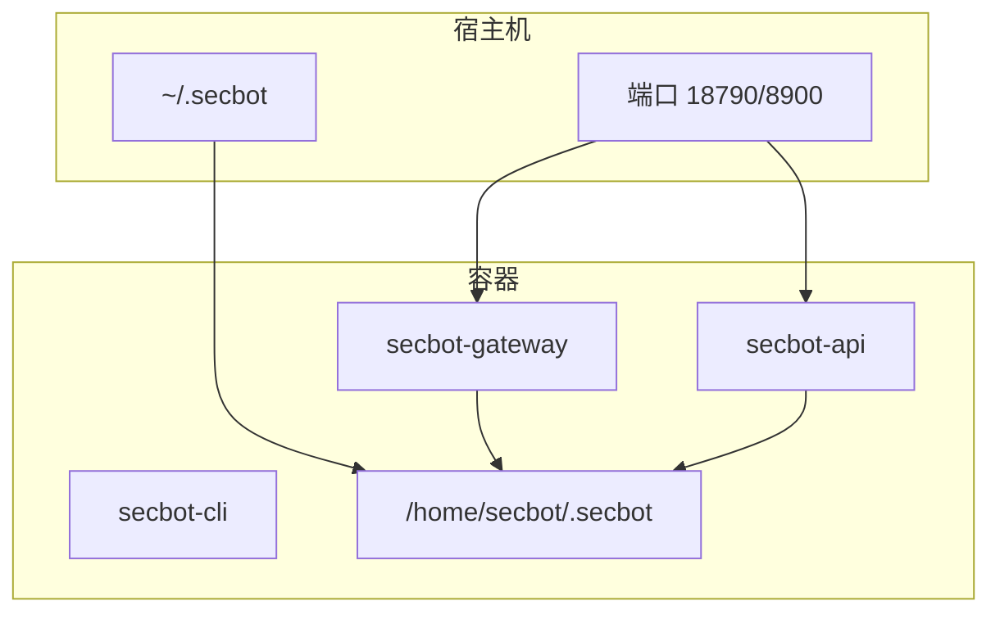
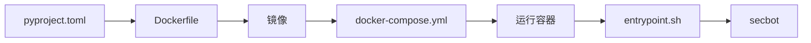

# 容器化部署

<cite>
**本文引用的文件**
- [Dockerfile](file://Dockerfile)
- [entrypoint.sh](file://entrypoint.sh)
- [docker-compose.yml](file://docker-compose.yml)
- [.dockerignore](file://.dockerignore)
- [pyproject.toml](file://pyproject.toml)
- [docs/deployment.md](file://docs/deployment.md)
- [README.md](file://README.md)
- [secbot/security/network.py](file://secbot/security/network.py)
- [secbot/heartbeat/service.py](file://secbot/heartbeat/service.py)
</cite>

## 目录
1. [简介](#简介)
2. [项目结构](#项目结构)
3. [核心组件](#核心组件)
4. [架构总览](#架构总览)
5. [详细组件分析](#详细组件分析)
6. [依赖关系分析](#依赖关系分析)
7. [性能考量](#性能考量)
8. [故障排除指南](#故障排除指南)
9. [结论](#结论)
10. [附录](#附录)

## 简介
本文件为 VAPT3/secbot 提供完整的容器化部署指南，聚焦于 Dockerfile 的多阶段构建策略、非 root 用户运行的安全策略与权限配置、Entrypoint 脚本的功能与启动流程、容器镜像构建最佳实践、运行时配置（资源限制、网络、卷挂载）、以及部署示例与故障排除。内容严格基于仓库中的实际文件与实现，帮助读者在生产环境中安全、稳定地运行 secbot。

## 项目结构
与容器化部署直接相关的文件与目录如下：
- 构建与运行
  - Dockerfile：多阶段构建、基础镜像、依赖安装顺序、缓存层优化、非 root 用户与权限、暴露端口、入口点
  - entrypoint.sh：容器启动入口脚本，负责配置目录可写性检查与执行 secbot 命令
  - docker-compose.yml：服务编排，包含网关、API、CLI 三种模式，资源限制、卷挂载、安全选项
  - .dockerignore：构建与运行时排除项，减少镜像体积与构建时间
- 项目元数据与依赖
  - pyproject.toml：项目版本、依赖声明、脚本入口
  - docs/deployment.md：官方部署说明（Docker 使用要点、权限与挂载）
  - README.md：应用入口与端口说明（网关、API、CLI）

**图表来源**
- [Dockerfile:1-51](file://Dockerfile#L1-L51)
- [docker-compose.yml:15-56](file://docker-compose.yml#L15-L56)
- [entrypoint.sh:1-16](file://entrypoint.sh#L1-L16)

**章节来源**
- [Dockerfile:1-51](file://Dockerfile#L1-L51)
- [docker-compose.yml:1-56](file://docker-compose.yml#L1-L56)
- [.dockerignore:1-14](file://.dockerignore#L1-L14)
- [pyproject.toml:1-169](file://pyproject.toml#L1-L169)
- [docs/deployment.md:1-171](file://docs/deployment.md#L1-L171)
- [README.md:113-120](file://README.md#L113-L120)

## 核心组件
- Dockerfile 多阶段构建策略
  - 基础镜像：选用带 uv 的 Python 3.12 slim 镜像，兼顾体积与包管理效率
  - 系统依赖：安装 Node.js 20、git、bubblewrap、openssh-client 等，满足 WhatsApp 桥与工具链需求
  - 依赖安装顺序：先复制 pyproject.toml 与 README 等元数据，利用 uv 的系统安装与缓存机制；再复制源码并二次安装，确保依赖锁定与增量构建
  - 缓存层优化：将依赖安装与源码复制分离，最大化利用 Docker 缓存
  - 构建桥接：进入 bridge 目录，配置 git 重写 URL、安装与构建 Node 产物
  - 非 root 用户：创建 UID 1000 的非 root 用户，创建配置目录并设置属主，切换运行用户
  - 入口与默认命令：设置入口脚本与默认命令（status）
  - 端口暴露：暴露网关默认端口
- Entrypoint 脚本
  - 检查配置目录可写性，若不可写则打印修复建议并退出
  - 最终 exec secbot 并透传参数
- docker-compose 编排
  - 三种服务：网关、API、CLI
  - 卷挂载：~/.secbot -> /home/secbot/.secbot
  - 安全选项：丢弃默认能力、添加必要能力、禁用 AppArmor/Seccomp 以支持沙箱
  - 资源限制：CPU 与内存上限与预留
  - 端口映射：网关 18790，API 127.0.0.1:8900
- .dockerignore
  - 排除 Python 编译产物、构建产物、Git、Node 模块、桥接产物与工作区，降低镜像体积
- 项目与依赖
  - 版本与脚本入口：pyproject.toml 中定义版本与 secbot 脚本入口
  - 官方部署说明：docs/deployment.md 强调非 root 用户、挂载路径与权限修复方法
  - 应用入口与端口：README.md 列出 gateway、serve、agent 三种入口与默认端口

**章节来源**
- [Dockerfile:1-51](file://Dockerfile#L1-L51)
- [entrypoint.sh:1-16](file://entrypoint.sh#L1-L16)
- [docker-compose.yml:15-56](file://docker-compose.yml#L15-L56)
- [.dockerignore:1-14](file://.dockerignore#L1-L14)
- [pyproject.toml:112-114](file://pyproject.toml#L112-L114)
- [docs/deployment.md:5-11](file://docs/deployment.md#L5-L11)
- [README.md:113-120](file://README.md#L113-L120)

## 架构总览
容器运行时架构围绕“非 root 用户 + 持久化配置 + 明确端口 + 安全选项 + 资源限制”展开。下图展示从构建到运行的关键交互：

**图表来源**
- [Dockerfile:1-51](file://Dockerfile#L1-L51)
- [entrypoint.sh:1-16](file://entrypoint.sh#L1-L16)
- [docker-compose.yml:15-56](file://docker-compose.yml#L15-L56)

## 详细组件分析

### Dockerfile 多阶段构建策略
- 基础镜像选择
  - 采用带 uv 的 Python 3.12 slim 镜像，有利于后续使用 uv pip 加速安装与缓存
- 依赖安装顺序与缓存层优化
  - 先复制 pyproject.toml、README、LICENSE 等元数据，执行 uv pip 安装，形成稳定缓存层
  - 再复制源码目录，再次 uv pip 安装，确保依赖锁定与增量构建
- Node.js 与桥接构建
  - 安装 Node.js 20，配置桥接工程的 git URL 替换，执行 npm install 与 npm run build
- 非 root 用户与权限
  - 创建 UID 1000 的非 root 用户，创建配置目录并设置属主，随后切换运行用户
- 入口与默认命令
  - 设置入口脚本与默认命令（status），便于容器启动后直接查看状态
- 端口暴露
  - 暴露网关默认端口，便于外部访问

**图表来源**
- [Dockerfile:1-51](file://Dockerfile#L1-L51)

**章节来源**
- [Dockerfile:1-51](file://Dockerfile#L1-L51)

### Entrypoint 脚本功能与启动流程
- 功能概述
  - 检查配置目录可写性：若宿主机挂载的目录不可写或属主不匹配，打印错误与修复建议并退出
  - 执行 secbot：成功后 exec secbot 并透传参数
- 启动流程
  - 容器启动 -> 运行入口脚本 -> 校验配置目录 -> 执行 secbot 命令 -> 作为前台进程运行

**图表来源**
- [entrypoint.sh:1-16](file://entrypoint.sh#L1-L16)

**章节来源**
- [entrypoint.sh:1-16](file://entrypoint.sh#L1-L16)

### docker-compose 运行时配置
- 服务编排
  - 网关服务：默认命令为 gateway，端口映射 18790:18790，资源限制 CPU 与内存
  - API 服务：默认命令为 serve，绑定 127.0.0.1:8900:8900，资源限制
  - CLI 服务：交互式终端，便于首次初始化与调试
- 卷挂载
  - 将宿主机的 ~/.secbot 挂载到容器内 /home/secbot/.secbot，保证配置与工作区持久化
- 安全选项
  - 丢弃默认能力，按需添加必要能力，禁用 AppArmor/Seccomp 以支持沙箱
- 端口与网络
  - 网关对外暴露 18790，API 仅本地回环 127.0.0.1:8900，避免不必要的外网暴露

**图表来源**
- [docker-compose.yml:15-56](file://docker-compose.yml#L15-L56)

**章节来源**
- [docker-compose.yml:15-56](file://docker-compose.yml#L15-L56)

### 非 root 用户运行的安全策略与权限配置
- 用户与目录
  - 创建 UID 1000 的非 root 用户，创建配置目录并设置属主，确保容器内以非 root 身份运行
- 权限修复
  - 若宿主机挂载目录不可写，入口脚本会提示修复方式（修改属主、使用 --user、Podman 的 --userns=keep-id）
- 安全选项
  - docker-compose 中丢弃默认能力、禁用 AppArmor/Seccomp，按需添加 SYS_ADMIN，提升运行灵活性同时保持最小权限原则

**章节来源**
- [Dockerfile:35-43](file://Dockerfile#L35-L43)
- [entrypoint.sh:3-14](file://entrypoint.sh#L3-L14)
- [docker-compose.yml:7-13](file://docker-compose.yml#L7-L13)
- [docs/deployment.md:5-11](file://docs/deployment.md#L5-L11)

### 容器镜像构建最佳实践
- 镜像大小优化
  - 使用 .dockerignore 排除 __pycache__、*.pyc、node_modules、bridge/dist、workspace 等，减少镜像体积
  - 依赖安装与源码复制分层，最大化缓存命中率
- 安全扫描
  - 建议在 CI 中集成镜像安全扫描（例如 trivy、clair），在推送前发现高危漏洞
- 版本管理
  - pyproject.toml 中维护版本号，建议在 CI 中根据标签打 tag 并推送到镜像仓库
- 构建缓存
  - 将元数据与依赖安装放在前面，源码复制放在后面，避免无关变更导致缓存失效

**章节来源**
- [.dockerignore:1-14](file://.dockerignore#L1-L14)
- [Dockerfile:17-26](file://Dockerfile#L17-L26)
- [pyproject.toml:3-4](file://pyproject.toml#L3-L4)

### 容器运行时配置（资源限制、网络、卷挂载）
- 资源限制
  - docker-compose 中为网关与 API 服务分别设置了 CPU 与内存的 limits 与 reservations，避免资源争用
- 网络配置
  - 网关对外暴露 18790，API 仅本地回环 127.0.0.1:8900，减少暴露面
- 卷挂载策略
  - 将宿主机 ~/.secbot 挂载到 /home/secbot/.secbot，持久化配置与工作区；遵循官方文档建议的非 root 用户与挂载路径

**章节来源**
- [docker-compose.yml:23-31](file://docker-compose.yml#L23-L31)
- [docker-compose.yml:40-47](file://docker-compose.yml#L40-L47)
- [docker-compose.yml:5-6](file://docker-compose.yml#L5-L6)
- [docs/deployment.md:5-8](file://docs/deployment.md#L5-L8)

### 应用入口与健康检查
- 应用入口
  - README.md 列出三种入口：CLI 直连、OpenAI 兼容 API、WebUI/网关；网关默认端口为 18790（健康检查）+ 8765（WebSocket 通道）
- 健康检查
  - 网关服务暴露 18790 端口，可用于健康检查；心跳服务在内部周期性检查任务，保障后台任务执行

**章节来源**
- [README.md:113-120](file://README.md#L113-L120)
- [secbot/heartbeat/service.py:118-129](file://secbot/heartbeat/service.py#L118-L129)

## 依赖关系分析
- 构建期依赖
  - Dockerfile 依赖 pyproject.toml 中的依赖声明，确保安装顺序与缓存层优化
- 运行期依赖
  - entrypoint.sh 依赖 secbot 脚本入口（pyproject.toml 中定义）
  - docker-compose 依赖 Dockerfile 产出的镜像与卷挂载策略

**图表来源**
- [pyproject.toml:112-114](file://pyproject.toml#L112-L114)
- [Dockerfile:1-51](file://Dockerfile#L1-L51)
- [docker-compose.yml:15-56](file://docker-compose.yml#L15-L56)
- [entrypoint.sh:1-16](file://entrypoint.sh#L1-L16)

**章节来源**
- [pyproject.toml:112-114](file://pyproject.toml#L112-L114)
- [Dockerfile:1-51](file://Dockerfile#L1-L51)
- [docker-compose.yml:15-56](file://docker-compose.yml#L15-L56)
- [entrypoint.sh:1-16](file://entrypoint.sh#L1-L16)

## 性能考量
- 构建性能
  - 分层策略与缓存：将依赖安装与源码复制分离，最大化缓存命中
  - 依赖安装工具：使用 uv pip，提升安装速度与缓存效率
- 运行性能
  - 资源限制：为服务设置 CPU 与内存上限与预留，避免资源争用
  - 端口与网络：API 仅本地回环暴露，减少网络开销与潜在攻击面
- 安全与稳定性
  - 非 root 用户运行、最小权限能力、禁用 AppArmor/Seccomp 以支持沙箱，平衡安全与可用性

[本节为通用指导，不直接分析具体文件]

## 故障排除指南
- 配置目录不可写
  - 现象：容器启动时报错，提示配置目录不可写且属主不匹配
  - 解决：修改宿主机目录属主为 UID 1000，或使用 --user $(id -u):$(id -g) 运行，或使用 Podman 的 --userns=keep-id
- 端口冲突
  - 现象：启动失败提示端口已被占用
  - 解决：停止宿主机上已占用的进程，或调整映射端口
- API 不可访问
  - 现象：无法访问 API 端口
  - 解决：确认 API 服务仅绑定 127.0.0.1:8900，若需外网访问，请在 docker-compose 中调整端口映射
- 权限与挂载
  - 现象：权限不足或挂载路径错误
  - 解决：遵循官方文档建议，将宿主机配置目录挂载到 /home/secbot/.secbot，并确保属主为 UID 1000

**章节来源**
- [entrypoint.sh:3-14](file://entrypoint.sh#L3-L14)
- [docs/deployment.md:5-11](file://docs/deployment.md#L5-L11)
- [docker-compose.yml:21-22](file://docker-compose.yml#L21-L22)
- [docker-compose.yml:38-39](file://docker-compose.yml#L38-L39)

## 结论
通过 Dockerfile 的多阶段构建策略、非 root 用户运行、严格的权限与安全选项、以及 docker-compose 的资源与网络配置，secbot 能够在生产环境中以最小权限、可控资源与稳定持久化的方式运行。配合官方部署文档与入口说明，可快速完成从构建到上线的全流程。

[本节为总结性内容，不直接分析具体文件]

## 附录
- 官方部署参考
  - docs/deployment.md 提供了 Docker 使用要点、权限与挂载建议
- 应用入口参考
  - README.md 列出三种入口与默认端口，便于选择合适的运行模式

**章节来源**
- [docs/deployment.md:1-171](file://docs/deployment.md#L1-L171)
- [README.md:113-120](file://README.md#L113-L120)