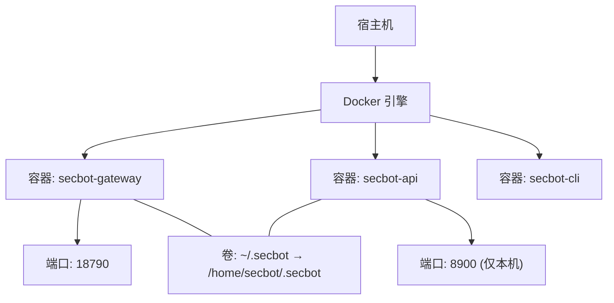
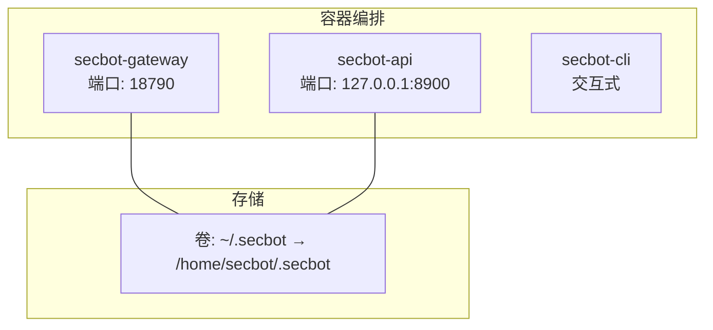
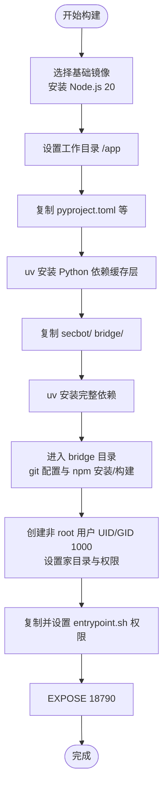
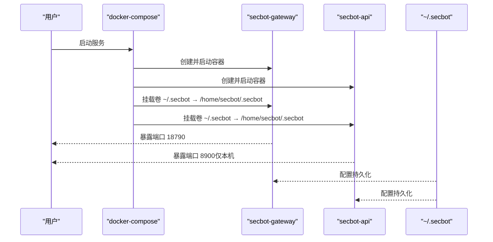
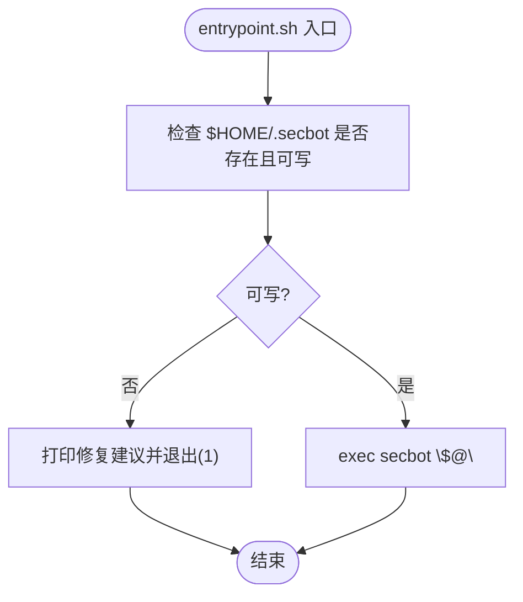
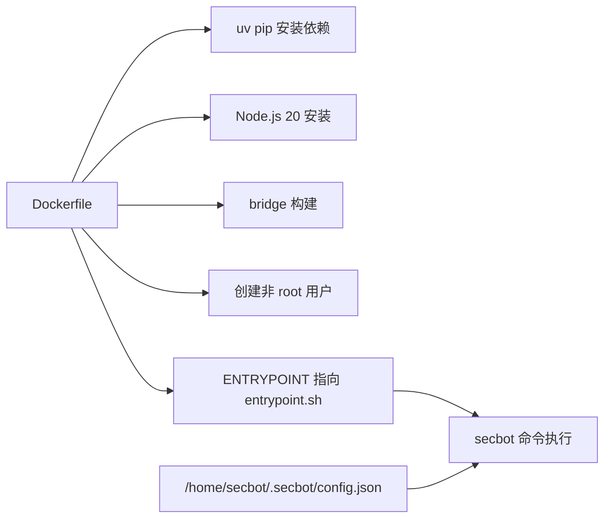

# 容器化部署

<cite>
**本文引用的文件**   
- [Dockerfile](file://Dockerfile)
- [docker-compose.yml](file://docker-compose.yml)
- [entrypoint.sh](file://entrypoint.sh)
- [.dockerignore](file://.dockerignore)
- [docs/deployment.md](file://docs/deployment.md)
- [pyproject.toml](file://pyproject.toml)
- [secbot/config/loader.py](file://secbot/config/loader.py)
- [README.md](file://README.md)
</cite>

## 目录
1. [简介](#简介)
2. [项目结构](#项目结构)
3. [核心组件](#核心组件)
4. [架构总览](#架构总览)
5. [组件详解](#组件详解)
6. [依赖关系分析](#依赖关系分析)
7. [性能与资源优化](#性能与资源优化)
8. [故障排查指南](#故障排查指南)
9. [结论](#结论)
10. [附录](#附录)

## 简介
本指南围绕本仓库的容器化部署展开，覆盖 Dockerfile 构建流程、docker-compose.yml 服务编排、entrypoint.sh 启动脚本行为、不同部署场景（开发/测试/生产）的配置要点，以及容器间通信、数据持久化、安全加固、健康检查、资源限制与性能优化建议。目标是帮助读者在本地或生产环境中稳定、安全地运行 secbot 的网关、API 与 CLI 服务。

## 项目结构
与容器化部署直接相关的关键文件如下：
- Dockerfile：定义基础镜像、依赖安装、用户与权限、端口暴露与入口命令
- docker-compose.yml：定义服务、网络、卷、资源限制与安全选项
- entrypoint.sh：启动前校验配置目录可写性，再委托给 secbot 命令
- .dockerignore：排除构建缓存与无关文件，减少镜像体积
- docs/deployment.md：官方部署说明与示例命令
- pyproject.toml：Python 依赖清单，影响镜像构建顺序与体积
- secbot/config/loader.py：配置加载与环境变量占位符解析逻辑
- README.md：应用入口与端口说明，辅助理解容器映射

图表来源
- [docker-compose.yml:15-56](file://docker-compose.yml#L15-L56)
- [Dockerfile:46-49](file://Dockerfile#L46-L49)

章节来源
- [Dockerfile:1-51](file://Dockerfile#L1-L51)
- [docker-compose.yml:1-56](file://docker-compose.yml#L1-L56)
- [.dockerignore:1-14](file://.dockerignore#L1-L14)
- [docs/deployment.md:13-45](file://docs/deployment.md#L13-L45)
- [README.md:113-120](file://README.md#L113-L120)

## 核心组件
- 基础镜像与运行时
  - 使用带 uv 的 Debian slim 基础镜像，预装 Node.js 20 以支持 WhatsApp 桥接构建
  - Python 依赖通过 uv pip 安装，先复制 pyproject.toml 以利用缓存层
- 依赖安装与构建
  - 先安装 Python 依赖，再复制源码并二次安装，最后构建 bridge 子项目
- 用户与权限
  - 创建非 root 用户（UID/GID 1000），配置家目录与权限，ENTRYPOINT 以该用户运行
- 端口与入口
  - 暴露网关默认端口；ENTRYPOINT 指向 entrypoint.sh，默认 CMD 为 status
- 启动脚本
  - 在执行 secbot 前检查配置目录可写性，若不可写则打印修复建议并退出

章节来源
- [Dockerfile:1-51](file://Dockerfile#L1-L51)
- [entrypoint.sh:1-16](file://entrypoint.sh#L1-L16)

## 架构总览
容器化部署采用多服务编排：
- secbot-gateway：对外提供网关服务，监听 18790 端口
- secbot-api：可选的 API 服务，监听 8900 端口（仅本机回环）
- secbot-cli：交互式 CLI，配合 -it 运行，便于调试与初始化

图表来源
- [docker-compose.yml:15-56](file://docker-compose.yml#L15-L56)

章节来源
- [docker-compose.yml:15-56](file://docker-compose.yml#L15-L56)

## 组件详解

### Dockerfile 构建流程
- 基础镜像与系统依赖
  - 选用带 uv 的 Python 3.12 Debian slim 基础镜像
  - 安装 NodeSource 的 Node.js 20，用于构建 WhatsApp 桥接
- 工作目录与依赖安装
  - 复制 pyproject.toml 与 README/LICENSE，先进行依赖安装以利用缓存层
  - 复制 secbot/ 与 bridge/，再次安装完整依赖
  - 切换到 bridge 目录，配置 git remote 替换为 https，安装并构建
- 用户与权限
  - 创建 UID/GID 1000 的非 root 用户，建立家目录，修改属主
  - 设置 HOME 环境变量，ENTRYPOINT 以该用户运行
- 端口与入口
  - EXPOSE 18790；ENTRYPOINT 指向 entrypoint.sh；CMD 默认 status

图表来源
- [Dockerfile:1-51](file://Dockerfile#L1-L51)

章节来源
- [Dockerfile:1-51](file://Dockerfile#L1-L51)

### docker-compose.yml 服务编排
- 通用配置
  - build 指向当前 Dockerfile；volumes 将宿主 ~/.secbot 映射到容器 /home/secbot/.secbot
  - 安全强化：cap_drop: ALL，cap_add: SYS_ADMIN，security_opt: apparmor/seccomp unconfined
- 服务定义
  - secbot-gateway：命令为 gateway，端口映射 18790:18790，CPU/内存资源限制与预留
  - secbot-api：命令为 serve（绑定 0.0.0.0 并指定工作空间），端口映射 127.0.0.1:8900:8900，资源限制同上
  - secbot-cli：profiles: cli，命令 status，stdin_open/tty 为调试准备
- 网络与卷
  - 默认使用 Compose 默认网络；通过卷实现配置与工作区持久化
- 环境变量
  - 文档未显式声明环境变量，但 secbot 支持通过环境变量占位符注入敏感配置

图表来源
- [docker-compose.yml:15-56](file://docker-compose.yml#L15-L56)

章节来源
- [docker-compose.yml:1-56](file://docker-compose.yml#L1-L56)

### entrypoint.sh 启动脚本
- 功能
  - 启动前检查 /home/secbot/.secbot 是否存在且可写
  - 若不可写，打印错误与三种修复建议（宿主 chown、Docker --user、Podman --userns=keep-id），并退出
  - 成功后 exec secbot "$@" 将控制权交给 secbot 主程序
- 参数
  - 通过 docker-compose 的 command 或 docker run 的参数传入 secbot 子命令（如 gateway、serve、status）

图表来源
- [entrypoint.sh:1-16](file://entrypoint.sh#L1-L16)

章节来源
- [entrypoint.sh:1-16](file://entrypoint.sh#L1-L16)

### 配置与环境变量
- 配置文件位置
  - 容器内默认读取 /home/secbot/.secbot/config.json
  - 通过卷将宿主 ~/.secbot 挂载到容器内，实现跨重启持久化
- 环境变量注入
  - 支持在配置中使用 ${VAR_NAME} 占位符，启动时从进程环境解析
  - 缺失的变量会导致启动失败，避免静默错误
- 官方部署建议
  - 使用 onboard 初始化配置，随后在宿主编辑 config.json 添加密钥
  - Docker 与 Docker Compose 的示例命令见官方文档

章节来源
- [docs/deployment.md:3-45](file://docs/deployment.md#L3-L45)
- [secbot/config/loader.py:86-147](file://secbot/config/loader.py#L86-L147)

### 不同部署场景的配置示例

- 开发环境
  - 使用 docker-compose 启动 gateway 与 API，映射必要端口
  - 将 ~/.secbot 挂载到容器，便于热更新配置
  - CLI 服务可按需启用（profiles: cli），用于交互式调试
- 测试环境
  - 与开发类似，但建议：
    - 限制资源（CPU/内存）防止资源争用
    - 仅映射必要端口，避免暴露到公网
    - 使用只读卷策略（如可能）保护配置
- 生产环境
  - 与测试类似，额外建议：
    - 使用更严格的 seccomp/apparmor 策略（当前为 unconfined）
    - 限制 CAP 能力，仅保留必需项
    - 为 API 服务添加反向代理与 TLS 终止
    - 使用独立的非 root 用户与最小权限原则

章节来源
- [docker-compose.yml:15-56](file://docker-compose.yml#L15-L56)
- [docs/deployment.md:13-45](file://docs/deployment.md#L13-L45)

### 容器间通信、数据持久化与安全配置
- 容器间通信
  - 默认使用 Docker 网络，服务之间可通过服务名访问（本项目未定义额外网络）
  - API 服务绑定 0.0.0.0，需谨慎控制访问范围（已通过端口映射限制为 127.0.0.1）
- 数据持久化
  - 通过卷将 ~/.secbot 挂载到 /home/secbot/.secbot，确保配置与工作区持久化
  - .dockerignore 排除了 Python 缓存、node_modules、bridge 构建产物等，降低镜像体积
- 安全配置
  - cap_drop: ALL，cap_add: SYS_ADMIN，security_opt: unconfined（当前宽松策略）
  - 建议在生产收紧：移除 SYS_ADMIN，限制 seccomp/apparmor，仅保留最小权限

章节来源
- [docker-compose.yml:1-14](file://docker-compose.yml#L1-L14)
- [.dockerignore:1-14](file://.dockerignore#L1-L14)

### 健康检查、资源限制与性能优化
- 健康检查
  - 网关默认端口 18790 可作为健康检查端点（README 中给出健康检查端口）
  - 建议在生产为 gateway 添加 healthcheck（例如 GET /health）
- 资源限制
  - docker-compose.yml 已为两个服务设置 CPU/内存上限与预留
  - 建议根据实际负载调整 limits/reservations
- 性能优化
  - 优先安装 pyproject.toml 中的依赖，利用层缓存
  - 减少不必要的系统包与构建工具，保持镜像精简
  - 使用 uv 加速 Python 依赖安装

章节来源
- [README.md:113-120](file://README.md#L113-L120)
- [docker-compose.yml:23-47](file://docker-compose.yml#L23-L47)
- [Dockerfile:17-26](file://Dockerfile#L17-L26)

## 依赖关系分析
- 构建阶段依赖
  - Node.js 20 用于 bridge 构建
  - uv pip 用于 Python 依赖安装
- 运行时依赖
  - Python 版本要求与依赖清单见 pyproject.toml
  - secbot 通过配置加载器解析环境变量占位符
- 容器内路径与权限
  - 配置目录 /home/secbot/.secbot，非 root 用户运行
  - entrypoint.sh 在执行 secbot 前进行可写性检查

图表来源
- [Dockerfile:1-51](file://Dockerfile#L1-L51)
- [pyproject.toml:25-68](file://pyproject.toml#L25-L68)
- [secbot/config/loader.py:86-147](file://secbot/config/loader.py#L86-L147)

章节来源
- [Dockerfile:1-51](file://Dockerfile#L1-L51)
- [pyproject.toml:1-169](file://pyproject.toml#L1-L169)
- [secbot/config/loader.py:1-173](file://secbot/config/loader.py#L1-L173)

## 性能与资源优化
- 镜像构建优化
  - 先复制 pyproject.toml 并安装依赖，利用 Docker 缓存层
  - bridge 构建前配置 git remote 为 https，避免 SSH 认证问题
- 运行时优化
  - 限制资源，避免与其他服务争抢
  - 仅暴露必要端口，API 仅监听 127.0.0.1
  - 使用非 root 用户运行，降低攻击面

章节来源
- [Dockerfile:17-33](file://Dockerfile#L17-L33)
- [docker-compose.yml:23-47](file://docker-compose.yml#L23-L47)

## 故障排查指南
- 权限问题
  - 症状：启动时报错提示配置目录不可写
  - 解决：在宿主执行 chown -R 1000:1000 ~/.secbot，或在容器运行时使用 --user $(id -u):$(id -g)，Podman 使用 --userns=keep-id
- 环境变量缺失
  - 症状：启动时报错提示某变量未设置
  - 解决：在宿主或 Compose 中设置对应环境变量，或在 config.json 中使用占位符并确保变量存在
- 端口冲突
  - 症状：端口被占用导致服务无法启动
  - 解决：更换映射端口或停止占用进程
- 网络访问异常
  - 症状：WebUI 无法连接到 WebSocket 或 API
  - 解决：确认 gateway 正在运行，且 channels.websocket 已启用；确认前端代理指向正确的后端地址

章节来源
- [entrypoint.sh:1-16](file://entrypoint.sh#L1-L16)
- [docs/deployment.md:3-45](file://docs/deployment.md#L3-L45)
- [README.md:113-170](file://README.md#L113-L170)

## 结论
本指南梳理了基于 Docker 与 docker-compose 的容器化部署方案，覆盖镜像构建、服务编排、启动脚本、配置与环境变量、不同场景的实践建议，以及健康检查、资源限制与性能优化方向。建议在生产环境中收紧安全策略与资源限制，并结合健康检查与日志监控保障稳定性。

## 附录
- 常用命令参考（来自官方文档）
  - 使用 docker-compose 运行 CLI 初始化与启动服务
  - 使用 docker run 构建镜像、初始化配置与运行单个命令
- 端口说明（来自 README）
  - 网关默认端口 18790（健康检查）
  - WebSocket 通道默认端口 8765（WebUI 依赖）
  - OpenAI 兼容 API 默认端口 8000（本项目未在 compose 中默认暴露）

章节来源
- [docs/deployment.md:13-45](file://docs/deployment.md#L13-L45)
- [README.md:113-170](file://README.md#L113-L170)