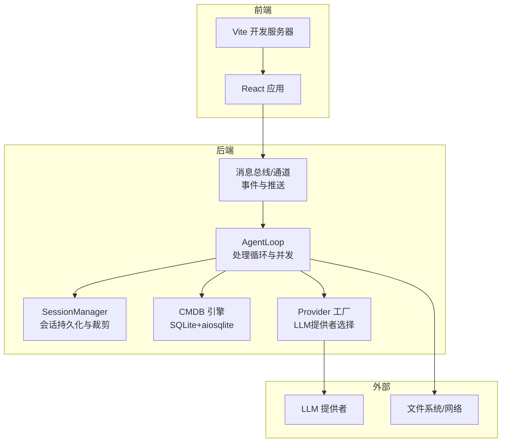
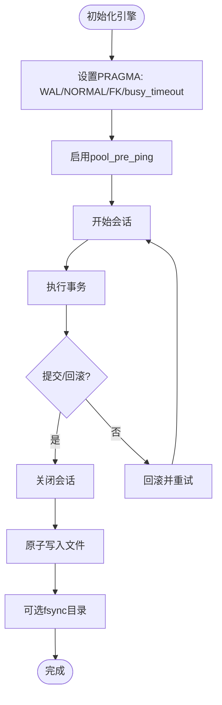
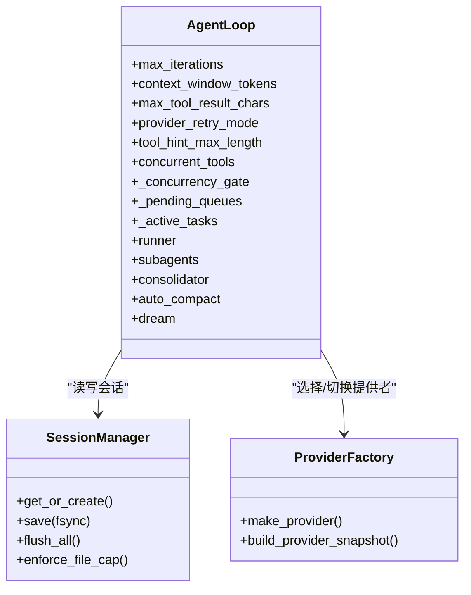
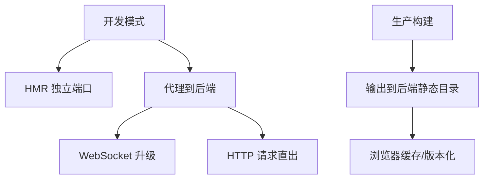
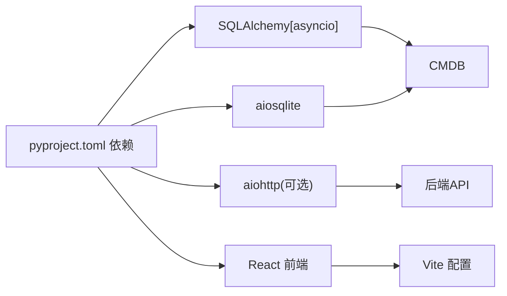

# 性能优化

<cite>
**本文引用的文件**
- [secbot/agent/loop.py](file://secbot/agent/loop.py)
- [secbot/secbot.py](file://secbot/secbot.py)
- [secbot/cmdb/db.py](file://secbot/cmdb/db.py)
- [secbot/config/schema.py](file://secbot/config/schema.py)
- [secbot/providers/factory.py](file://secbot/providers/factory.py)
- [secbot/providers/anthropic_provider.py](file://secbot/providers/anthropic_provider.py)
- [secbot/providers/openai_compat_provider.py](file://secbot/providers/openai_compat_provider.py)
- [secbot/session/manager.py](file://secbot/session/manager.py)
- [secbot/utils/runtime.py](file://secbot/utils/runtime.py)
- [webui/vite.config.ts](file://webui/vite.config.ts)
- [webui/package.json](file://webui/package.json)
- [pyproject.toml](file://pyproject.toml)
</cite>

## 目录
1. [简介](#简介)
2. [项目结构](#项目结构)
3. [核心组件](#核心组件)
4. [架构总览](#架构总览)
5. [详细组件分析](#详细组件分析)
6. [依赖分析](#依赖分析)
7. [性能考虑](#性能考虑)
8. [故障排查指南](#故障排查指南)
9. [结论](#结论)
10. [附录](#附录)

## 简介
本文件面向VAPT3/secbot项目的性能优化，围绕数据库、AgentLoop、前端与系统级层面给出可操作的优化策略与调优建议，并提供监控与基准测试方法及不同部署规模的最佳实践。

## 项目结构
- 后端核心：Python异步应用，包含消息总线、会话管理、工具执行、LLM提供者工厂、CMDB数据库等。
- 前端：React + Vite，提供仪表盘与聊天界面，通过代理转发到后端网关。
- 配置：基于Pydantic的配置模型，支持环境变量注入与运行时快照切换。



图示来源
- [secbot/agent/loop.py:276-425](file://secbot/agent/loop.py#L276-L425)
- [secbot/session/manager.py:239-470](file://secbot/session/manager.py#L239-L470)
- [secbot/cmdb/db.py:64-93](file://secbot/cmdb/db.py#L64-L93)
- [secbot/providers/factory.py:21-92](file://secbot/providers/factory.py#L21-L92)
- [webui/vite.config.ts:1-66](file://webui/vite.config.ts#L1-L66)

章节来源
- [secbot/agent/loop.py:276-425](file://secbot/agent/loop.py#L276-L425)
- [secbot/session/manager.py:239-470](file://secbot/session/manager.py#L239-L470)
- [secbot/cmdb/db.py:64-93](file://secbot/cmdb/db.py#L64-L93)
- [secbot/providers/factory.py:21-92](file://secbot/providers/factory.py#L21-L92)
- [webui/vite.config.ts:1-66](file://webui/vite.config.ts#L1-L66)

## 核心组件
- AgentLoop：核心处理引擎，负责上下文构建、LLM调用、工具执行、并发控制、会话与任务管理。
- SessionManager：会话持久化、历史裁剪、文件容量控制、原子写入与fsync保障。
- CMDB数据库：SQLite+aiosqlite，WAL模式、连接池预检、PRAGMA优化。
- Provider工厂：按配置动态选择LLM提供者，支持运行时快照切换。
- 前端Vite：开发与构建配置、代理与HMR分离、输出目录与源码映射策略。

章节来源
- [secbot/agent/loop.py:276-425](file://secbot/agent/loop.py#L276-L425)
- [secbot/session/manager.py:239-470](file://secbot/session/manager.py#L239-L470)
- [secbot/cmdb/db.py:64-93](file://secbot/cmdb/db.py#L64-L93)
- [secbot/providers/factory.py:21-92](file://secbot/providers/factory.py#L21-L92)
- [webui/vite.config.ts:1-66](file://webui/vite.config.ts#L1-L66)

## 架构总览
AgentLoop作为中枢，接收消息总线事件，构建上下文，调用Provider，执行工具，同时维护会话与并发控制；CMDB提供本地持久化能力；前端通过Vite代理访问后端服务。

```mermaid
sequenceDiagram
participant UI as "前端"
participant Bus as "消息总线"
participant Loop as "AgentLoop"
participant Prov as "Provider工厂"
participant DB as "CMDB"
participant Sess as "SessionManager"
UI->>Bus : 发送消息
Bus-->>Loop : 入站消息
Loop->>Sess : 获取/创建会话
Loop->>Prov : 选择Provider并生成请求
Prov-->>Loop : LLM响应
Loop->>Loop : 执行工具调用并发
Loop->>DB : 写入/更新报告/元数据
Loop->>Sess : 保存会话原子写入
Loop-->>UI : 流式/最终结果
```

图示来源
- [secbot/agent/loop.py:644-786](file://secbot/agent/loop.py#L644-L786)
- [secbot/providers/factory.py:21-92](file://secbot/providers/factory.py#L21-L92)
- [secbot/cmdb/db.py:103-122](file://secbot/cmdb/db.py#L103-L122)
- [secbot/session/manager.py:403-450](file://secbot/session/manager.py#L403-L450)

## 详细组件分析

### 数据库性能优化（CMDB/SQLite）
- 连接与引擎
  - 使用异步引擎，启用pool_pre_ping提升连接可用性。
  - 默认URL解析支持SECBOT_CMDB_URL环境变量，便于容器化与多实例隔离。
- PRAGMA优化
  - WAL模式提升读多写少场景下的并发能力。
  - NORMAL同步级别平衡可靠性与性能。
  - 外键约束开启，busy_timeout设置缓解短事务锁等待。
- 事务与持久化
  - 会话保存采用原子替换与可选fsync，确保崩溃后的数据一致性。
  - flush_all在优雅关闭时强制落盘，避免缓存丢失。
- 建议
  - 对高写入场景评估journal_mode与synchronous参数权衡。
  - 使用连接池大小与超时参数配合业务QPS调整。
  - 定期归档旧会话，控制单文件大小，减少IO碎片。



图示来源
- [secbot/cmdb/db.py:51-93](file://secbot/cmdb/db.py#L51-L93)
- [secbot/session/manager.py:403-450](file://secbot/session/manager.py#L403-L450)

章节来源
- [secbot/cmdb/db.py:64-133](file://secbot/cmdb/db.py#L64-L133)
- [secbot/session/manager.py:403-470](file://secbot/session/manager.py#L403-L470)

### AgentLoop性能调优
- 并发控制
  - 通过SECBOT_MAX_CONCURRENT_REQUESTS环境变量限制并发请求数量，默认3；超过阈值的任务排队或拒绝。
  - 工具执行支持并发工具调用，结合信号量与队列实现有序注入与取消。
- 内存与会话
  - 会话历史按消息数与token预算裁剪，避免无界增长。
  - 文件容量上限触发归档与前缀丢弃，保留合法边界。
  - 原子写入与fsync保障持久化可靠性。
- 缓存与提示
  - Provider层支持prompt缓存标记，减少重复计算。
  - 工具提示长度受tool_hint_max_length限制，避免过长提示影响吞吐。
- 事务与重试
  - Provider重试模式可配置，结合流式进度回调降低等待时间。
- 建议
  - 根据硬件与LLM成本平衡max_iterations、context_window_tokens与max_concurrent_subagents。
  - 对高延迟工具增加超时与取消机制，防止阻塞主循环。
  - 使用统一会话模式（unified_session）减少上下文切换开销。



图示来源
- [secbot/agent/loop.py:291-425](file://secbot/agent/loop.py#L291-L425)
- [secbot/session/manager.py:239-470](file://secbot/session/manager.py#L239-L470)
- [secbot/providers/factory.py:21-92](file://secbot/providers/factory.py#L21-L92)

章节来源
- [secbot/agent/loop.py:392-425](file://secbot/agent/loop.py#L392-L425)
- [secbot/agent/loop.py:644-786](file://secbot/agent/loop.py#L644-L786)
- [secbot/session/manager.py:239-470](file://secbot/session/manager.py#L239-L470)
- [secbot/providers/factory.py:21-92](file://secbot/providers/factory.py#L21-L92)

### 前端性能优化（Vite/React）
- 构建优化
  - 生产构建关闭sourcemap以减小包体与解析开销。
  - 输出目录指向后端静态资源位置，减少跨域与额外代理。
- 懒加载与代码分割
  - 组件按需引入，路由级拆分，减少首屏体积。
- 缓存策略
  - 静态资源版本化，浏览器缓存与ETag配合。
  - 图片转Worker编码，避免主线程阻塞。
- 代理与HMR
  - 将HMR套接字迁移到独立端口，避免与WebSocket升级冲突。
  - 仅WebSocket升级走代理，HTTP GET由Vite直出SPA，降低耦合。
- 建议
  - 使用React.lazy与Suspense进行页面级懒加载。
  - 对图表与Markdown渲染组件做二次分割与SSR（如适用）。
  - 在CI中启用压缩与Tree-shaking，保持依赖精简。



图示来源
- [webui/vite.config.ts:24-58](file://webui/vite.config.ts#L24-L58)
- [webui/package.json:1-67](file://webui/package.json#L1-L67)

章节来源
- [webui/vite.config.ts:1-66](file://webui/vite.config.ts#L1-L66)
- [webui/package.json:1-67](file://webui/package.json#L1-L67)

### 系统级性能优化
- 进程与线程
  - 使用异步I/O与事件循环，避免阻塞型调用；对CPU密集型任务考虑子进程或工作线程池。
- 文件系统
  - 会话保存采用原子替换与目录fsync，降低部分文件系统写回缓存导致的数据丢失风险。
  - 控制单文件消息上限，定期归档，减少大文件IO压力。
- 网络
  - Web工具支持代理与用户代理配置，合理设置超时与重试。
  - Provider层支持缓存标记，减少重复请求。
- 安全加固
  - 严格的工作区限制与路径规范化，防止越界访问。
  - 重复外部查找与越界尝试的节流与拦截，避免滥用与资源浪费。

章节来源
- [secbot/session/manager.py:403-450](file://secbot/session/manager.py#L403-L450)
- [secbot/utils/runtime.py:68-171](file://secbot/utils/runtime.py#L68-L171)
- [secbot/config/schema.py:214-265](file://secbot/config/schema.py#L214-L265)

## 依赖分析
- 后端依赖
  - SQLAlchemy[asyncio] + aiosqlite用于异步数据库访问。
  - aiohttp（可选）用于API服务。
  - 多平台SDK与工具链（Slack、Telegram、Matrix等）按需安装。
- 前端依赖
  - React、Radix UI、Tailwind、图表库等，按功能模块拆分。
- 关键耦合点
  - AgentLoop与Provider工厂强耦合，运行时可热切换模型与上下文窗口。
  - SessionManager与CMDB引擎耦合，保证会话持久化一致性。



图示来源
- [pyproject.toml:25-68](file://pyproject.toml#L25-L68)
- [webui/vite.config.ts:1-66](file://webui/vite.config.ts#L1-L66)

章节来源
- [pyproject.toml:25-68](file://pyproject.toml#L25-L68)
- [webui/vite.config.ts:1-66](file://webui/vite.config.ts#L1-L66)

## 性能考虑
- 数据库
  - WAL与NORMAL同步适合大多数场景；高写入可考虑更激进的PRAGMA组合。
  - 连接池大小与busy_timeout需结合并发与延迟调优。
- AgentLoop
  - 并发门控与工具并发需与LLM速率限制匹配，避免超卖。
  - 上下文窗口与消息裁剪直接影响token预算与响应时间。
- 前端
  - 构建关闭sourcemap、按需懒加载、静态资源缓存是关键。
  - HMR与WebSocket代理分离减少冲突与抖动。
- 系统
  - 文件系统fsync与原子写入在可靠性与性能间取舍。
  - 网络代理与超时、缓存标记减少重复请求。

## 故障排查指南
- 数据库
  - 若出现“database is locked”，检查WAL是否生效与busy_timeout设置。
  - 事务异常自动回滚并抛出，确认异常捕获与重试逻辑。
- AgentLoop
  - 并发过高导致任务堆积，检查SECBOT_MAX_CONCURRENT_REQUESTS与工具超时。
  - 会话过大导致内存与IO压力，启用文件容量上限与归档。
- Provider
  - 缓存标记未生效时，确认系统消息与工具定义的缓存注入逻辑。
- 前端
  - HMR与WebSocket冲突导致连接失败，确认独立端口与代理规则。
  - 构建后静态资源无法加载，核对输出目录与代理目标。

章节来源
- [secbot/cmdb/db.py:51-93](file://secbot/cmdb/db.py#L51-L93)
- [secbot/agent/loop.py:392-425](file://secbot/agent/loop.py#L392-L425)
- [secbot/providers/anthropic_provider.py:378-410](file://secbot/providers/anthropic_provider.py#L378-L410)
- [secbot/providers/openai_compat_provider.py:332-364](file://secbot/providers/openai_compat_provider.py#L332-L364)
- [webui/vite.config.ts:37-58](file://webui/vite.config.ts#L37-L58)

## 结论
通过对数据库PRAGMA、AgentLoop并发与会话管理、前端构建与代理策略以及系统级文件与网络配置的综合优化，可在保证可靠性的同时显著提升整体吞吐与响应速度。建议在不同部署规模下分别验证并固化调优参数，形成可复用的性能基线。

## 附录
- 性能监控与基准测试
  - 指标：每轮迭代耗时、并发请求数、会话文件大小、数据库事务耗时、Provider请求延迟与缓存命中率。
  - 工具：aiohttp客户端压测、日志采样、Prometheus+Grafana（可选）、前端性能面板。
  - 方法：逐步加压，观察瓶颈（CPU/IO/网络/LLM），定位后针对性优化。
- 不同部署规模建议
  - 小规模（单机/单实例）：默认并发与上下文窗口，启用WAL与NORMAL同步，按需开启fsync。
  - 中规模（多实例/多租户）：拆分CMDB实例或使用外部数据库，增加连接池与超时，启用会话归档。
  - 大规模（多区域/高并发）：引入负载均衡与限流，Provider侧启用缓存标记与批量接口，前端CDN与缓存策略强化。