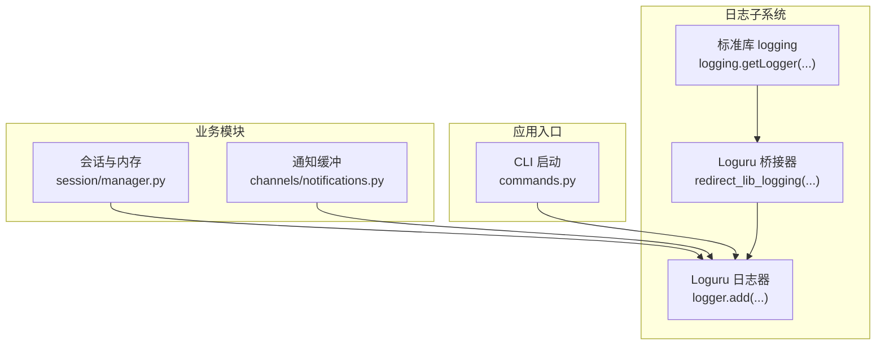
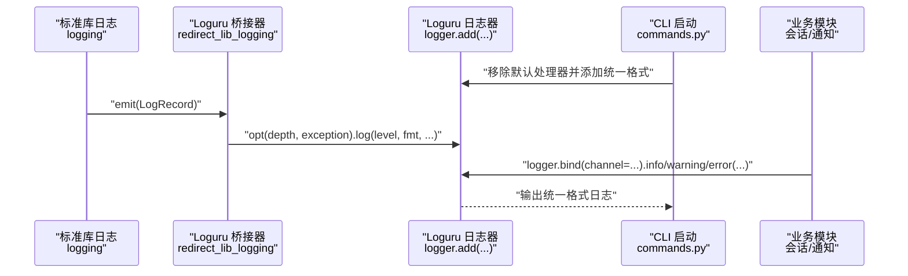
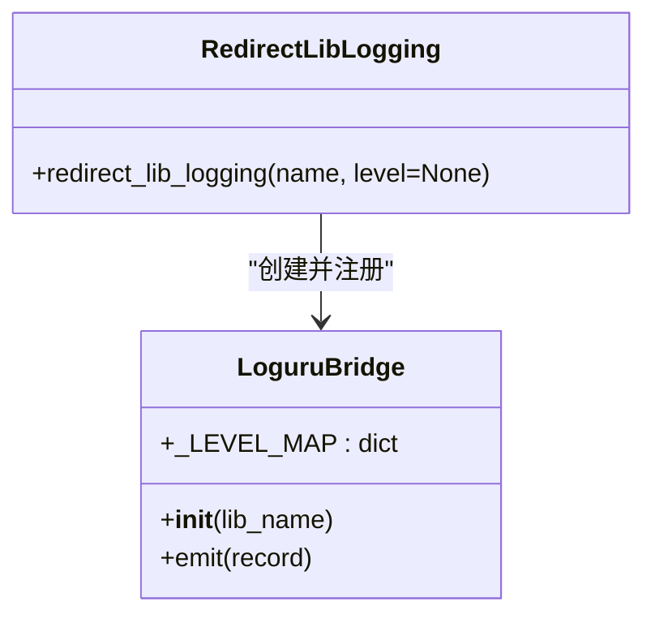
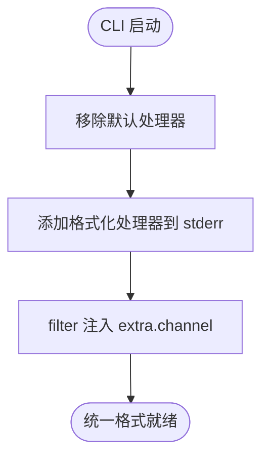
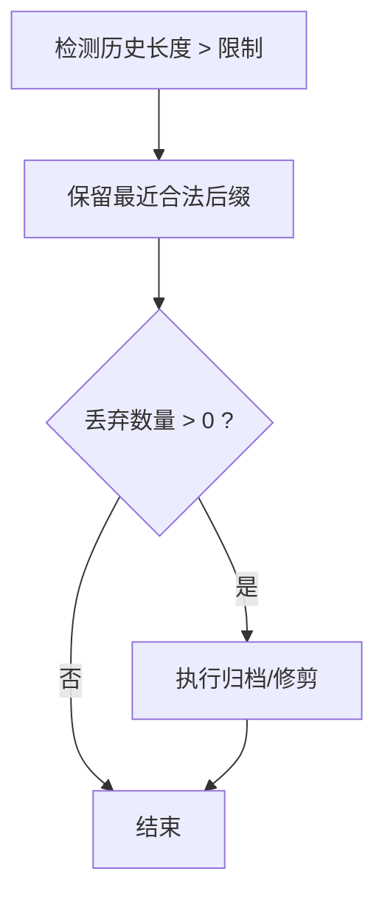
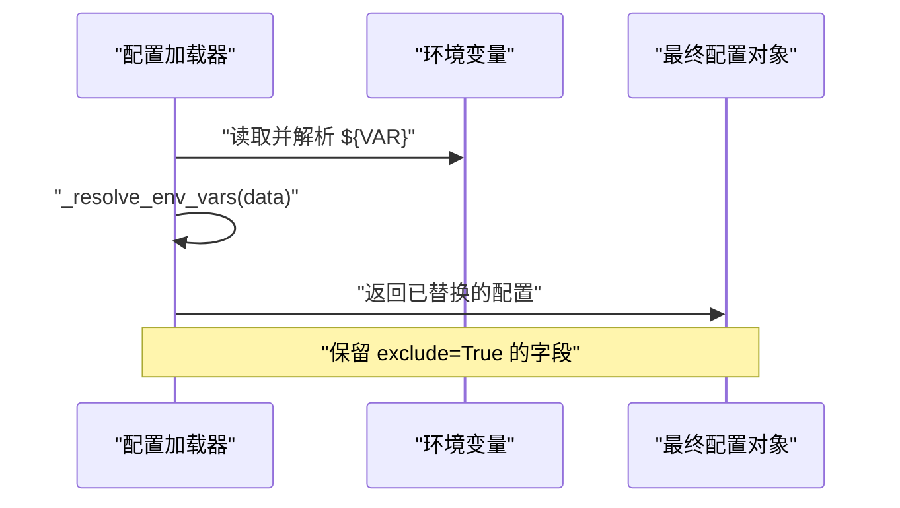
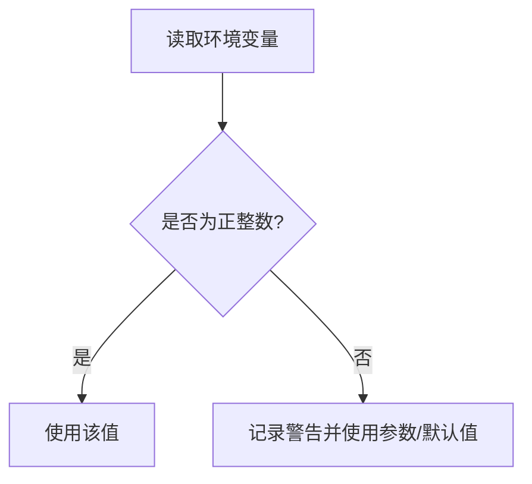
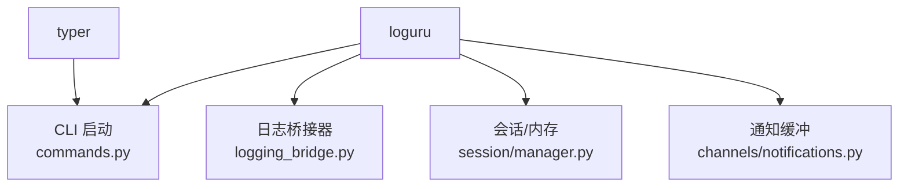

# 日志管理

<cite>
**本文引用的文件**
- [logging_bridge.py](file://secbot/utils/logging_bridge.py)
- [commands.py](file://secbot/cli/commands.py)
- [pyproject.toml](file://pyproject.toml)
- [logging-guidelines.md](file://.trellis/spec/backend/logging-guidelines.md)
- [manager.py](file://secbot/session/manager.py)
- [test_memory_store.py](file://tests/agent/test_memory_store.py)
- [test_consolidator.py](file://tests/agent/test_consolidator.py)
- [test_env_interpolation.py](file://tests/config/test_env_interpolation.py)
- [notifications.py](file://secbot/channels/notifications.py)
</cite>

## 目录
1. [简介](#简介)
2. [项目结构](#项目结构)
3. [核心组件](#核心组件)
4. [架构总览](#架构总览)
5. [详细组件分析](#详细组件分析)
6. [依赖分析](#依赖分析)
7. [性能考虑](#性能考虑)
8. [故障排查指南](#故障排查指南)
9. [结论](#结论)
10. [附录](#附录)

## 简介
本文件为 VAPT3/secbot 的日志管理文档，聚焦于日志系统的设计与实现，涵盖以下主题：
- 日志级别与格式规范
- 输出目标与控制台统一格式
- Python 标准日志库与自定义日志系统的桥接机制
- 日志配置（环境变量、配置文件、动态更新）
- 日志轮转与存储管理（文件大小限制、保留周期、压缩归档）
- 日志分析与查询最佳实践（ELK Stack 集成、日志聚合、实时监控）
- 常见日志问题的诊断与解决

## 项目结构
围绕日志管理的关键代码分布在以下模块：
- 日志桥接：将标准库 logging 的消息重定向到 loguru
- CLI 初始化：统一控制台日志格式与级别
- 会话与内存：历史消息截断与告警，避免日志膨胀
- 配置与环境变量：配置加载时对 ${VAR} 的解析与保留策略
- 通知缓冲：环境变量驱动的缓冲区大小与容错处理

图表来源
- [logging_bridge.py:1-48](file://secbot/utils/logging_bridge.py#L1-L48)
- [commands.py:22-38](file://secbot/cli/commands.py#L22-L38)
- [manager.py:208-223](file://secbot/session/manager.py#L208-L223)
- [notifications.py:71-94](file://secbot/channels/notifications.py#L71-L94)

章节来源
- [logging_bridge.py:1-48](file://secbot/utils/logging_bridge.py#L1-L48)
- [commands.py:22-38](file://secbot/cli/commands.py#L22-L38)
- [manager.py:208-223](file://secbot/session/manager.py#L208-L223)
- [notifications.py:71-94](file://secbot/channels/notifications.py#L71-L94)

## 核心组件
- 日志桥接器：将第三方库或遗留模块通过标准库 logging 输出的消息，统一重定向至 loguru，并保持一致的格式与层级映射。
- CLI 统一日志格式：移除默认处理器，添加统一格式化器，支持时间、级别、通道名与消息体。
- 会话与内存截断：在历史消息增长时进行截断与归档，避免日志体积无限膨胀。
- 环境变量解析：配置加载阶段对 ${VAR} 进行替换，同时保留被排除字段。
- 通知缓冲容错：从环境变量读取缓冲大小，非法值给出警告并回退默认。

章节来源
- [logging_bridge.py:9-47](file://secbot/utils/logging_bridge.py#L9-L47)
- [commands.py:25-38](file://secbot/cli/commands.py#L25-L38)
- [manager.py:208-223](file://secbot/session/manager.py#L208-L223)
- [test_env_interpolation.py:13-41](file://tests/config/test_env_interpolation.py#L13-L41)
- [notifications.py:71-94](file://secbot/channels/notifications.py#L71-L94)

## 架构总览
下图展示日志系统在进程内的交互路径：标准库日志经桥接器进入 loguru；CLI 初始化时设置统一格式；业务模块按需绑定额外上下文（如 channel）；会话与通知模块在运行期产生日志并受统一格式约束。

图表来源
- [logging_bridge.py:24-31](file://secbot/utils/logging_bridge.py#L24-L31)
- [commands.py:25-38](file://secbot/cli/commands.py#L25-L38)
- [manager.py:208-223](file://secbot/session/manager.py#L208-L223)
- [notifications.py:71-94](file://secbot/channels/notifications.py#L71-L94)

## 详细组件分析

### 日志桥接机制（Python 标准库 → Loguru）
- 设计要点
  - 将第三方库的日志通过 logging.getLogger(name) 注入到自定义 Handler 中，避免重复传播。
  - 映射标准库级别到 loguru 字符串级别，保证一致性。
  - 使用深度追踪以正确显示调用源文件与行号。
- 关键行为
  - 若未发现桥接器实例，则新增桥接器并设置过滤级别（若传入）。
  - 禁止 propagate，防止重复输出。
- 使用建议
  - 在应用启动早期调用 redirect_lib_logging，确保第三方库日志被接管。
  - 对关键第三方库（如 HTTP 客户端、数据库驱动）分别建立桥接器，便于区分来源。

图表来源
- [logging_bridge.py:9-47](file://secbot/utils/logging_bridge.py#L9-L47)

章节来源
- [logging_bridge.py:9-47](file://secbot/utils/logging_bridge.py#L9-L47)

### CLI 日志格式与输出目标
- 控制台统一格式
  - 移除默认处理器后，重新添加到 stderr，格式包含时间、级别、通道名与消息体。
  - 通过 filter 为每条记录注入 extra.channel，默认“-”，便于区分来源。
- 动态切换
  - 支持在运行中移除旧处理器并添加新处理器，以实现动态调整格式或目标。
- 最佳实践
  - 生产环境建议输出到 stderr 或专用日志文件，避免与业务输出混杂。
  - 结合外部日志收集器（如 systemd/journald、rsyslog、Fluent Bit）集中采集。

图表来源
- [commands.py:25-38](file://secbot/cli/commands.py#L25-L38)

章节来源
- [commands.py:25-38](file://secbot/cli/commands.py#L25-L38)

### 会话与内存的历史消息截断与告警
- 截断策略
  - 当历史消息超过阈值时，保留最近合法后缀并丢弃旧前缀，避免无限增长。
  - 存在硬上限保护，确保不会超过最大消息数。
- 告警机制
  - 对超限写入仅发出一次警告，避免噪声。
  - 原始归档内容存在最大字符限制，超出则截断并标记。
- 配置项
  - 文件级最大消息数（FILE_MAX_MESSAGES）用于强制归档与修剪。
  - 自定义 max_chars 可覆盖默认截断阈值。

图表来源
- [manager.py:208-223](file://secbot/session/manager.py#L208-L223)
- [test_memory_store.py:200-215](file://tests/agent/test_memory_store.py#L200-L215)
- [test_consolidator.py:227-257](file://tests/agent/test_consolidator.py#L227-L257)

章节来源
- [manager.py:208-223](file://secbot/session/manager.py#L208-L223)
- [test_memory_store.py:200-215](file://tests/agent/test_memory_store.py#L200-L215)
- [test_consolidator.py:227-257](file://tests/agent/test_consolidator.py#L227-L257)

### 配置与环境变量解析
- 环境变量替换
  - 在配置加载阶段对字符串中的 ${VAR} 进行替换，支持嵌套字典与列表。
  - 非字符串类型保持不变。
- 保留策略
  - 对 exclude=True 的字段，在无 ${VAR} 引用时也应保留，避免回写时丢失。
- 实践建议
  - 将敏感信息（如令牌、密钥）置于环境变量中，避免直接写入配置文件。
  - 使用分层配置（默认值、用户配置、环境变量）以增强灵活性。

图表来源
- [test_env_interpolation.py:13-41](file://tests/config/test_env_interpolation.py#L13-L41)
- [test_env_interpolation.py:84-104](file://tests/config/test_env_interpolation.py#L84-L104)

章节来源
- [test_env_interpolation.py:13-41](file://tests/config/test_env_interpolation.py#L13-L41)
- [test_env_interpolation.py:84-104](file://tests/config/test_env_interpolation.py#L84-L104)

### 通知缓冲的环境变量配置与容错
- 缓冲大小来源优先级：环境变量 > 构造函数参数 > 默认值。
- 容错策略：非整数或非正数的环境变量值会发出警告并回退默认值。
- 适用场景：在高并发或瞬时峰值情况下，通过增大缓冲提升稳定性。

图表来源
- [notifications.py:71-94](file://secbot/channels/notifications.py#L71-L94)

章节来源
- [notifications.py:71-94](file://secbot/channels/notifications.py#L71-L94)

## 依赖分析
- 外部依赖
  - loguru：提供高性能、结构化日志能力，支持多处理器、过滤器与格式化。
  - typer：CLI 框架，配合 loguru 实现统一日志输出。
- 内部耦合
  - logging_bridge 与 CLI 初始化相互独立，但共同服务于统一日志体验。
  - 会话与通知模块通过 loguru 记录运行状态，受 CLI 统一格式影响。

图表来源
- [pyproject.toml:35](file://pyproject.toml#L35)
- [commands.py:22-38](file://secbot/cli/commands.py#L22-L38)
- [logging_bridge.py:6](file://secbot/utils/logging_bridge.py#L6)

章节来源
- [pyproject.toml:35](file://pyproject.toml#L35)
- [commands.py:22-38](file://secbot/cli/commands.py#L22-L38)
- [logging_bridge.py:6](file://secbot/utils/logging_bridge.py#L6)

## 性能考虑
- 日志级别与过滤
  - 在生产环境建议使用 INFO 或更高级别，减少低价值日志对 IO 的压力。
  - 使用 filter 仅输出必要字段，降低序列化开销。
- 输出目标
  - 控制台输出适合开发调试；生产环境建议落盘或通过管道转发至日志收集器。
- 截断与归档
  - 通过会话与内存的截断策略，避免历史数据无限增长导致的 IO 与存储压力。
- 并发与缓冲
  - 通知缓冲的合理配置可缓解瞬时高峰，避免阻塞主流程。

## 故障排查指南
- 症状：第三方库日志未出现在统一格式输出中
  - 排查：确认是否已调用 redirect_lib_logging(name) 并禁用了 propagate。
  - 参考：[logging_bridge.py:34-47](file://secbot/utils/logging_bridge.py#L34-L47)
- 症状：日志体积过大或磁盘占用异常
  - 排查：检查会话历史截断阈值与归档策略，确认是否存在超长消息未被截断。
  - 参考：[manager.py:208-223](file://secbot/session/manager.py#L208-L223)、[test_consolidator.py:227-257](file://tests/agent/test_consolidator.py#L227-L257)
- 症状：配置中的 ${VAR} 未生效或字段丢失
  - 排查：确认环境变量是否正确设置，以及 exclude=True 的字段是否被保留。
  - 参考：[test_env_interpolation.py:13-41](file://tests/config/test_env_interpolation.py#L13-L41)、[test_env_interpolation.py:84-104](file://tests/config/test_env_interpolation.py#L84-L104)
- 症状：通知缓冲频繁失败或阻塞
  - 排查：检查环境变量 BUFFER_SIZE 是否为正整数，非整数或非正数将触发回退。
  - 参考：[notifications.py:71-94](file://secbot/channels/notifications.py#L71-L94)

章节来源
- [logging_bridge.py:34-47](file://secbot/utils/logging_bridge.py#L34-L47)
- [manager.py:208-223](file://secbot/session/manager.py#L208-L223)
- [test_consolidator.py:227-257](file://tests/agent/test_consolidator.py#L227-L257)
- [test_env_interpolation.py:13-41](file://tests/config/test_env_interpolation.py#L13-L41)
- [test_env_interpolation.py:84-104](file://tests/config/test_env_interpolation.py#L84-L104)
- [notifications.py:71-94](file://secbot/channels/notifications.py#L71-L94)

## 结论
本项目采用 loguru 作为统一日志后端，结合标准库桥接器实现第三方库日志的无缝接入；CLI 层面提供统一格式与动态处理器切换能力；业务层面通过会话与内存的截断策略控制日志规模；配置层面支持环境变量替换与字段保留策略。整体方案兼顾易用性、性能与可维护性，适用于安全运营平台的复杂日志需求。

## 附录
- 日志级别建议
  - DEBUG：调试细节，仅在开发或问题定位时启用
  - INFO：常规运行状态与关键事件
  - WARNING：潜在问题或异常情况
  - ERROR：错误事件，需人工干预
  - CRITICAL：严重故障，需立即处理
- 日志格式建议
  - 包含时间戳、级别、来源模块/通道、消息体
  - 可选：请求 ID、会话 ID、用户标识等上下文字段
- 轮转与存储管理
  - 文件大小限制：建议按 MB/GB 级别滚动
  - 保留周期：按天/周/月滚动并清理过期日志
  - 压缩归档：启用 gzip 压缩以节省空间
- ELK/日志聚合与实时监控
  - 使用 Filebeat/Fluent Bit 收集日志并发送至 Logstash/Elasticsearch
  - Kibana 可视化与告警规则配置
  - Prometheus/Grafana 实时监控日志量与错误率