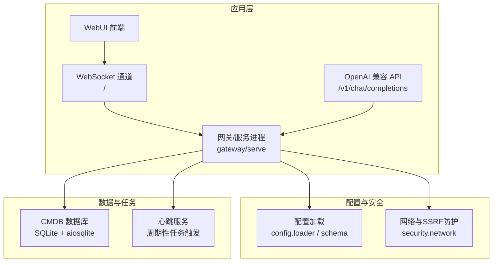
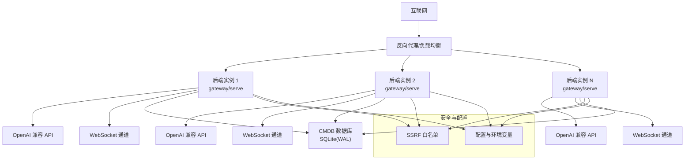
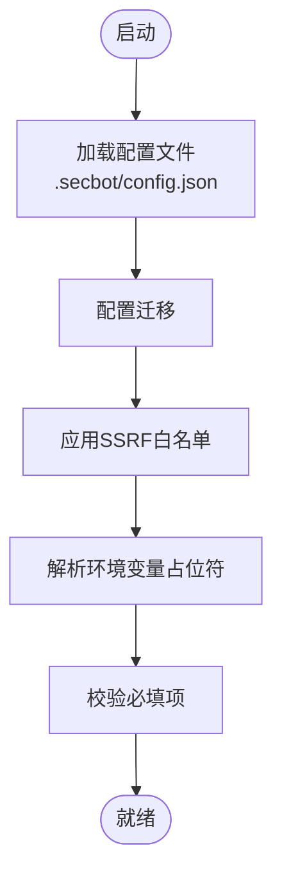
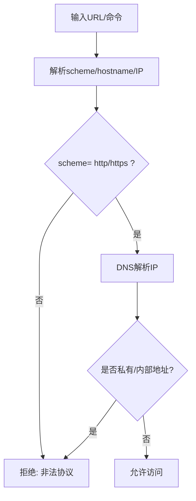
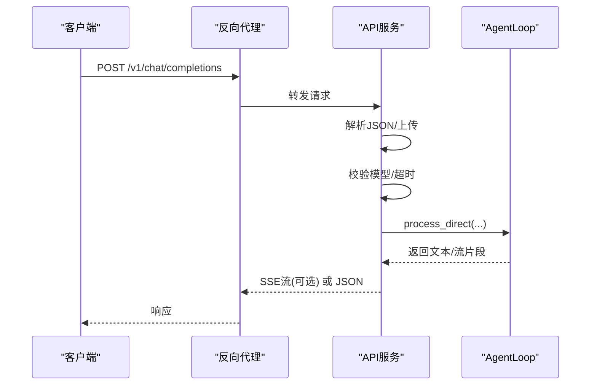
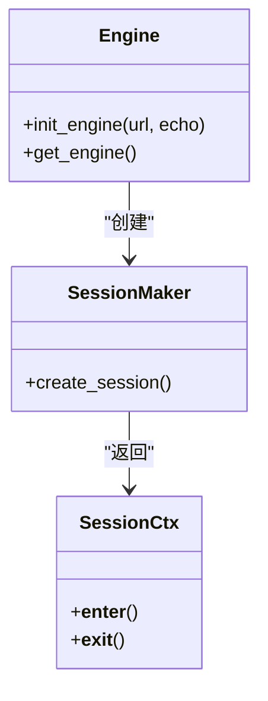
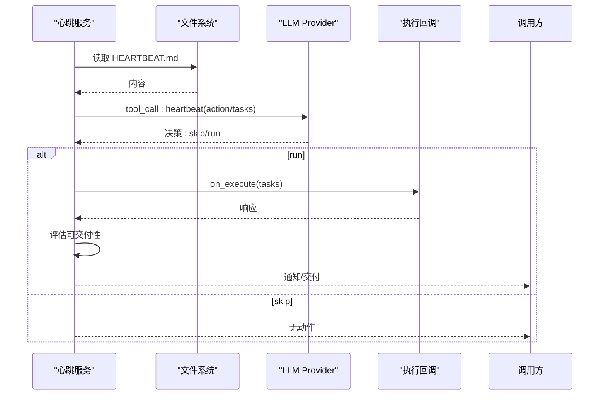
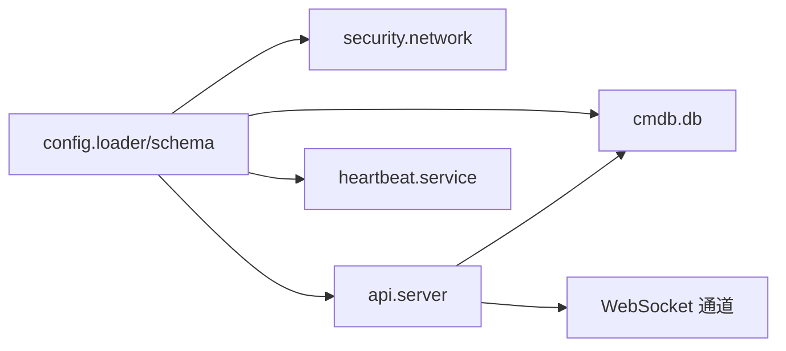

# 生产环境配置

<cite>
**本文引用的文件**
- [README.md](file://README.md)
- [docs/deployment.md](file://docs/deployment.md)
- [Dockerfile](file://Dockerfile)
- [docker-compose.yml](file://docker-compose.yml)
- [entrypoint.sh](file://entrypoint.sh)
- [pyproject.toml](file://pyproject.toml)
- [secbot/config/schema.py](file://secbot/config/schema.py)
- [secbot/config/loader.py](file://secbot/config/loader.py)
- [secbot/security/network.py](file://secbot/security/network.py)
- [secbot/api/server.py](file://secbot/api/server.py)
- [secbot/cmdb/db.py](file://secbot/cmdb/db.py)
- [secbot/heartbeat/service.py](file://secbot/heartbeat/service.py)
</cite>

## 目录
1. [简介](#简介)
2. [项目结构](#项目结构)
3. [核心组件](#核心组件)
4. [架构总览](#架构总览)
5. [详细组件分析](#详细组件分析)
6. [依赖关系分析](#依赖关系分析)
7. [性能考虑](#性能考虑)
8. [故障排查指南](#故障排查指南)
9. [结论](#结论)
10. [附录](#附录)

## 简介
本指南面向生产环境部署，围绕服务器硬件与操作系统、网络与安全、负载均衡与反向代理、数据库与存储、环境变量与密钥管理、性能调优与监控、以及上线流程与检查清单，结合代码库中的配置与实现，给出可落地的实践建议。内容覆盖：
- 服务器硬件与系统要求
- 操作系统与容器/服务配置
- 网络与安全加固（防火墙、SSRF 白名单、访问控制）
- 反向代理与健康检查
- 数据库优化与备份策略
- 环境变量与密钥管理
- 性能调优与容量规划
- 部署前检查清单与上线流程

## 项目结构
该项目采用模块化分层设计，后端以 FastAPI/AIOHTTP 提供 OpenAI 兼容 API，同时提供 WebSocket 网关与 WebUI；配置通过 JSON 文件与环境变量加载，安全控制通过网络白名单与沙箱策略实现；数据库采用 SQLite（异步 SQLAlchemy）并内置 WAL 模式优化。

图表来源
- [docs/deployment.md:13-45](file://docs/deployment.md#L13-L45)
- [secbot/api/server.py:381-401](file://secbot/api/server.py#L381-L401)
- [secbot/config/schema.py:267-376](file://secbot/config/schema.py#L267-L376)
- [secbot/security/network.py:29-37](file://secbot/security/network.py#L29-L37)
- [secbot/cmdb/db.py:64-93](file://secbot/cmdb/db.py#L64-L93)
- [secbot/heartbeat/service.py:118-137](file://secbot/heartbeat/service.py#L118-L137)

章节来源
- [README.md:29-75](file://README.md#L29-L75)
- [docs/deployment.md:13-45](file://docs/deployment.md#L13-L45)

## 核心组件
- 配置系统：支持 JSON 文件与环境变量（前缀 SECBOT_），含通道、代理、工具、API、网关等配置项，具备环境变量占位符解析与迁移逻辑。
- 安全网络：内置 SSRF 白名单配置接口，阻断私有/内部地址访问，支持通过配置豁免特定 CIDR。
- API 服务：提供 OpenAI 兼容的 /v1/chat/completions 与 /v1/models，支持 JSON 与 multipart 两种请求体，SSE 流式响应。
- 数据库：SQLite（aiosqlite），默认启用 WAL、foreign_keys、busy_timeout 等参数，提供异步会话工厂。
- 心跳服务：周期性读取工作区内的 HEARTBEAT.md，通过 LLM 判断是否有任务需要执行，支持回调执行与通知。

章节来源
- [secbot/config/schema.py:18-376](file://secbot/config/schema.py#L18-L376)
- [secbot/config/loader.py:32-127](file://secbot/config/loader.py#L32-L127)
- [secbot/security/network.py:29-120](file://secbot/security/network.py#L29-L120)
- [secbot/api/server.py:194-401](file://secbot/api/server.py#L194-L401)
- [secbot/cmdb/db.py:64-133](file://secbot/cmdb/db.py#L64-L133)
- [secbot/heartbeat/service.py:118-237](file://secbot/heartbeat/service.py#L118-L237)

## 架构总览
生产部署可采用“反向代理 + 多实例 + 数据库”模式：
- 反向代理（Nginx/Traefik/Caddy）监听公网，做 TLS 终止、健康检查与路由。
- 后端服务以容器或 systemd 用户服务方式运行，暴露健康端点与 WebSocket/API 端口。
- 数据库存储于持久卷，开启 WAL 与只读副本策略，配合定时备份。
- 配置通过挂载目录与环境变量注入，密钥与敏感信息通过外部密管或环境变量管理。

图表来源
- [docs/deployment.md:13-45](file://docs/deployment.md#L13-L45)
- [secbot/api/server.py:381-401](file://secbot/api/server.py#L381-L401)
- [secbot/cmdb/db.py:51-62](file://secbot/cmdb/db.py#L51-L62)
- [secbot/security/network.py:29-37](file://secbot/security/network.py#L29-L37)

## 详细组件分析

### 配置与环境变量
- 配置文件路径与加载：默认位于用户主目录下的 .secbot/config.json，支持迁移与错误回退。
- 环境变量解析：支持 ${VAR} 形式的占位符，未设置时报错；配置对象支持 SECBOT_ 前缀的嵌套键映射。
- 关键配置项：
  - 通道（channels.websocket）：启用与绑定地址、端口。
  - 代理（providers.*）：各 LLM 供应商的 apiKey/base/headers。
  - 工具（tools.*）：web/exec/my/mcp_servers/ssrf_whitelist。
  - API（api.host/port/timeout）、网关（gateway.host/port/heartbeat）。
- 密钥与敏感信息：通过环境变量注入，避免硬编码在配置文件中。

图表来源
- [secbot/config/loader.py:32-127](file://secbot/config/loader.py#L32-L127)
- [secbot/config/schema.py:267-376](file://secbot/config/schema.py#L267-L376)

章节来源
- [secbot/config/loader.py:32-127](file://secbot/config/loader.py#L32-L127)
- [secbot/config/schema.py:18-376](file://secbot/config/schema.py#L18-L376)

### 安全与网络
- SSRF 白名单：通过 tools.ssrf_whitelist 配置允许的 CIDR，绕过默认私有/内部地址拦截。
- URL 校验：对 http/https URL 解析域名并解析 IP，拒绝私有/内部地址；支持重定向后的二次校验。
- 命令内 URL 检测：扫描命令字符串中的 URL 并进行拦截。

图表来源
- [secbot/security/network.py:45-120](file://secbot/security/network.py#L45-L120)

章节来源
- [secbot/security/network.py:29-120](file://secbot/security/network.py#L29-L120)

### OpenAI 兼容 API
- 端点：/v1/chat/completions（JSON 与 multipart 支持）、/v1/models、/health。
- 请求处理：支持流式（SSE）与非流式；限制单请求超时；会话锁保证并发安全。
- 上传与媒体：支持 base64 data URL 与 multipart 文件上传，带大小限制。

图表来源
- [secbot/api/server.py:194-401](file://secbot/api/server.py#L194-L401)

章节来源
- [secbot/api/server.py:194-401](file://secbot/api/server.py#L194-L401)

### 数据库与 CMDB
- 默认 SQLite 路径：~/.secbot/cmdb.sqlite3，可通过环境变量覆盖。
- 连接与会话：异步引擎，启用 WAL、foreign_keys、busy_timeout；pre_ping 保持连接可用。
- 事务：上下文管理器确保提交/回滚与关闭。

图表来源
- [secbot/cmdb/db.py:64-133](file://secbot/cmdb/db.py#L64-L133)

章节来源
- [secbot/cmdb/db.py:64-133](file://secbot/cmdb/db.py#L64-L133)

### 心跳服务与任务触发
- 周期性检查工作区内的 HEARTBEAT.md，通过 LLM 判断是否执行任务。
- 可配置执行回调与通知回调，过滤不可交付的响应。

图表来源
- [secbot/heartbeat/service.py:118-237](file://secbot/heartbeat/service.py#L118-L237)

章节来源
- [secbot/heartbeat/service.py:118-237](file://secbot/heartbeat/service.py#L118-L237)

## 依赖关系分析
- 配置依赖：配置加载依赖 schema 定义与环境变量解析；网络安全模块依赖配置中的白名单。
- API 依赖：API 服务依赖 AgentLoop 与会话锁；媒体上传依赖媒体目录与大小限制。
- 数据库依赖：CMDB 依赖 SQLAlchemy/aiosqlite，初始化时应用 SQLite 拉链参数。
- 心跳服务依赖：LLM Provider 与工作区文件。

图表来源
- [secbot/config/loader.py:32-127](file://secbot/config/loader.py#L32-L127)
- [secbot/config/schema.py:267-376](file://secbot/config/schema.py#L267-L376)
- [secbot/security/network.py:29-37](file://secbot/security/network.py#L29-L37)
- [secbot/api/server.py:381-401](file://secbot/api/server.py#L381-L401)
- [secbot/cmdb/db.py:64-93](file://secbot/cmdb/db.py#L64-L93)
- [secbot/heartbeat/service.py:118-137](file://secbot/heartbeat/service.py#L118-L137)

章节来源
- [secbot/config/loader.py:32-127](file://secbot/config/loader.py#L32-L127)
- [secbot/config/schema.py:267-376](file://secbot/config/schema.py#L267-L376)
- [secbot/api/server.py:381-401](file://secbot/api/server.py#L381-L401)
- [secbot/cmdb/db.py:64-93](file://secbot/cmdb/db.py#L64-L93)
- [secbot/heartbeat/service.py:118-137](file://secbot/heartbeat/service.py#L118-L137)

## 性能考虑
- 连接池与并发
  - API 服务对每个会话使用独立锁，避免竞态；建议在反向代理侧做连接数与队列长度限制。
  - 数据库启用 pre_ping 与 WAL，减少“数据库被锁定”问题；根据并发写入量调整 busy_timeout。
- 超时与资源限制
  - API 默认请求超时可配置；建议在反向代理与服务端均设置合理超时。
  - 容器/服务资源限制：CPU/内存上限与预留，避免单实例资源争用。
- I/O 与磁盘
  - SQLite WAL 模式适合单写多读；若写入频繁，建议使用 SSD 并评估只读副本/读写分离。
- 网络与安全
  - SSRF 白名单减少无效请求；对外部搜索/抓取建议配置代理与超时。
- LLM 与工具
  - 通过配置选择合适的模型与供应商；对高延迟供应商启用重试策略。

[本节为通用性能建议，不直接分析具体文件]

## 故障排查指南
- 权限与挂载
  - 容器内配置目录不可写：检查宿主机目录属主与权限，或使用 --user/--userns 参数。
- 端口占用
  - 启动失败提示端口占用：先停止手动运行的进程，再启动服务。
- API 健康与超时
  - 使用 /health 检查服务状态；确认反向代理与上游端口映射一致。
- 配置与密钥
  - 环境变量占位符未设置导致解析失败：补齐环境变量或在配置文件中显式填写。
- 数据库异常
  - “数据库被锁定”：检查 WAL 是否生效、并发写入是否过高、是否使用 SSD。

章节来源
- [entrypoint.sh:1-16](file://entrypoint.sh#L1-L16)
- [docs/deployment.md:84-93](file://docs/deployment.md#L84-L93)
- [secbot/api/server.py:371-374](file://secbot/api/server.py#L371-L374)
- [secbot/config/loader.py:140-147](file://secbot/config/loader.py#L140-L147)
- [secbot/cmdb/db.py:51-62](file://secbot/cmdb/db.py#L51-L62)

## 结论
本指南基于代码库中的配置、API、数据库与安全模块，给出了生产环境部署的系统性建议。通过合理的硬件与系统配置、严格的网络与安全策略、可靠的负载均衡与健康检查、稳健的数据库优化与备份、规范的环境变量与密钥管理，以及持续的性能调优与监控，可确保系统在生产环境中的稳定性与安全性。

[本节为总结性内容，不直接分析具体文件]

## 附录

### 服务器硬件与操作系统要求
- CPU：至少 2 核，推荐 4 核以上，视并发与 LLM 推理负载而定。
- 内存：建议 4GB 起步，高并发与多模型推理场景建议 8GB+。
- 存储：SSD 为主，SQLite WAL 模式提升并发读写；为 CMDB 预留足够空间。
- 操作系统：Linux（Ubuntu/CentOS/RHEL）或 macOS；容器优先时使用支持 Docker/Podman 的发行版。
- 网络：开放反向代理端口（如 443/80），后端服务端口（如 18790、8900）仅内网可达。

[本节为通用建议，不直接分析具体文件]

### 网络与安全加固
- 防火墙：仅开放反向代理端口，后端服务端口仅允许内网访问。
- SSL/TLS：反向代理终止 TLS，证书由外部 CA 管理；禁用弱加密套件。
- SSRF 白名单：在配置中添加受信 CIDR；默认阻断私有/内部地址。
- 访问控制：API 网关接入鉴权（如 API Key/OAuth），WebSocket 通道限制来源 IP。
- 日志与审计：记录 API 请求、错误与安全事件，保留审计日志。

章节来源
- [secbot/security/network.py:29-37](file://secbot/security/network.py#L29-L37)
- [secbot/config/schema.py:264-265](file://secbot/config/schema.py#L264-L265)

### 负载均衡与反向代理
- 反向代理：Nginx/Traefik/Caddy，启用健康检查 /health。
- 负载均衡：轮询或最少连接，会话粘性按需开启。
- 健康检查：探针访问 /health，失败自动摘除。
- 故障转移：多实例部署，实例间无状态；必要时使用只读副本。

章节来源
- [docs/deployment.md:13-45](file://docs/deployment.md#L13-L45)
- [secbot/api/server.py:371-374](file://secbot/api/server.py#L371-L374)

### 数据库配置与备份策略
- 连接池：启用 pre_ping；根据并发写入量调整 busy_timeout。
- 索引优化：针对查询热点字段建立索引（如资产表的 ip、任务表的 status）。
- 备份策略：定时快照/物理备份；生产环境建议异地备份与恢复演练。
- 只读副本：高读负载场景启用只读副本，分流查询。

章节来源
- [secbot/cmdb/db.py:51-62](file://secbot/cmdb/db.py#L51-L62)
- [secbot/cmdb/db.py:84-93](file://secbot/cmdb/db.py#L84-L93)

### 环境变量与密钥管理
- 环境变量前缀：SECBOT_，支持嵌套键；例如 SECBOT__PROVIDERS__OPENROUTER__APIKEY。
- 密钥注入：通过外部密管（如 Vault/KMS）或编排平台注入；避免明文落盘。
- 配置文件：仅存放非敏感配置；敏感项通过环境变量覆盖。

章节来源
- [secbot/config/schema.py:375](file://secbot/config/schema.py#L375)
- [secbot/config/loader.py:86-127](file://secbot/config/loader.py#L86-L127)

### 容器与服务部署
- 容器镜像：基于 Python 3.12 slim，非 root 用户运行，暴露 18790。
- Docker Compose：定义网关/API/CLI 服务，设置资源限制与卷挂载。
- systemd/macOS：用户服务自动重启，守护进程日志与状态管理。

章节来源
- [Dockerfile:1-51](file://Dockerfile#L1-L51)
- [docker-compose.yml:15-56](file://docker-compose.yml#L15-L56)
- [docs/deployment.md:47-93](file://docs/deployment.md#L47-L93)
- [docs/deployment.md:100-171](file://docs/deployment.md#L100-L171)

### 部署前检查清单
- 硬件与系统：核数、内存、磁盘、网络连通性。
- 配置与密钥：配置文件完整、环境变量齐全、API Key 正确。
- 安全：防火墙规则、TLS 证书、SSRF 白名单、访问控制。
- 负载均衡：反向代理健康检查、实例加入、故障转移。
- 数据库：WAL 启用、只读副本（可选）、备份策略。
- 监控与日志：指标采集、日志聚合、告警阈值。
- 回滚预案：镜像版本、配置快照、数据库备份。

[本节为通用检查清单，不直接分析具体文件]

### 上线流程规范
- 准备阶段：完成硬件与系统准备、镜像构建、配置与密钥注入。
- 预热阶段：单实例上线、健康检查、基础功能验证。
- 扩容阶段：多实例部署、负载均衡接入、只读副本（可选）。
- 监控阶段：指标与日志监控、告警与值班机制。
- 回滚阶段：版本标记、配置回滚、数据库回滚演练。

[本节为通用流程规范，不直接分析具体文件]