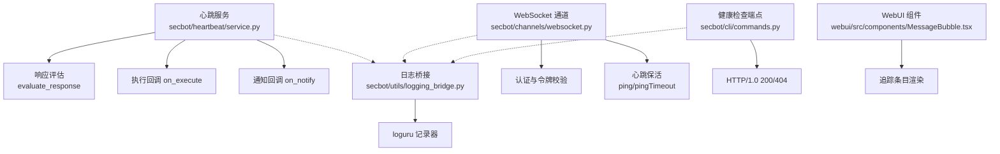
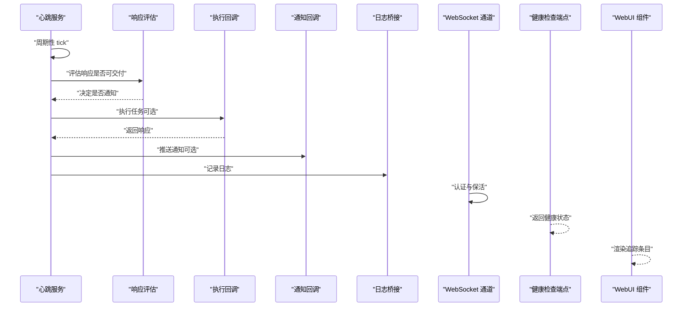
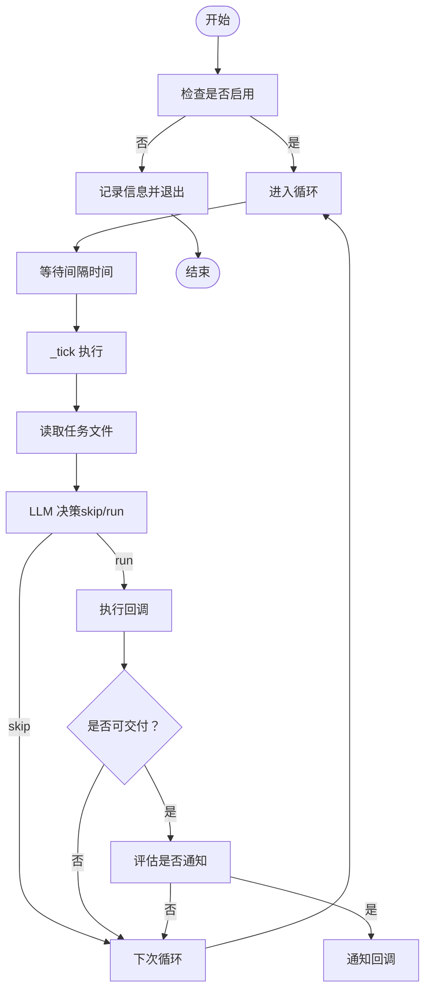
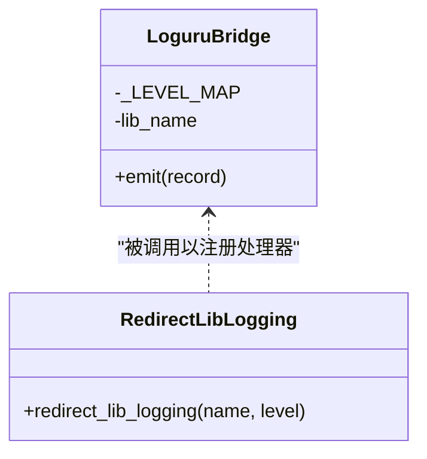
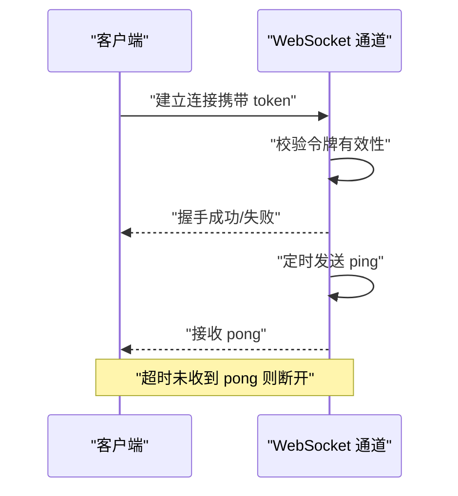
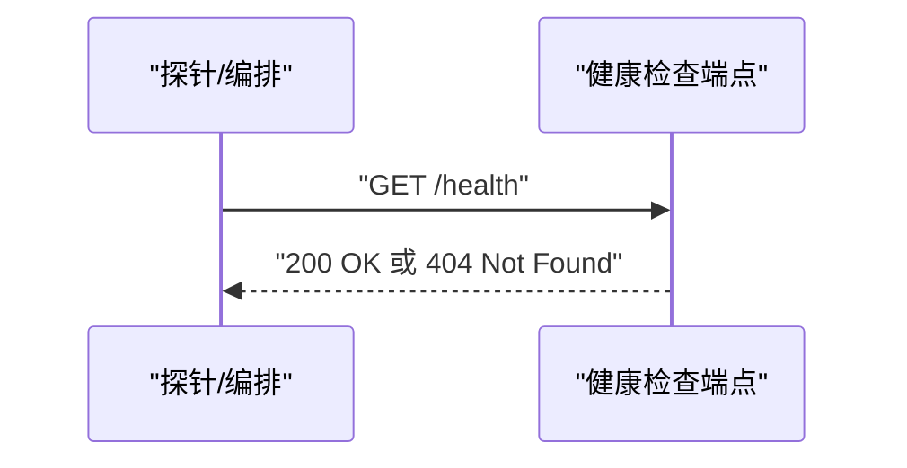
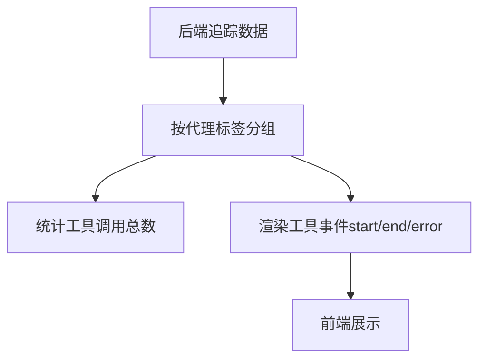
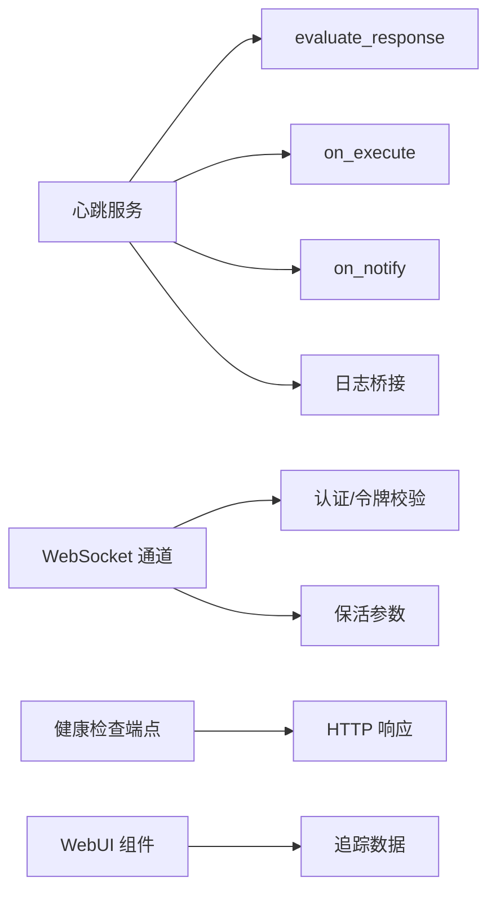

# 监控与日志

<cite>
**本文引用的文件**   
- [secbot/heartbeat/service.py](file://secbot/heartbeat/service.py)
- [secbot/utils/logging_bridge.py](file://secbot/utils/logging_bridge.py)
- [tests/heartbeat/test_heartbeat_deliverability.py](file://tests/heartbeat/test_heartbeat_deliverability.py)
- [docs/websocket.md](file://docs/websocket.md)
- [secbot/channels/websocket.py](file://secbot/channels/websocket.py)
- [secbot/cli/commands.py](file://secbot/cli/commands.py)
- [.trellis/spec/backend/logging-guidelines.md](file://.trellis/spec/backend/logging-guidelines.md)
- [webui/src/components/MessageBubble.tsx](file://webui/src/components/MessageBubble.tsx)
</cite>

## 目录
1. [简介](#简介)
2. [项目结构](#项目结构)
3. [核心组件](#核心组件)
4. [架构总览](#架构总览)
5. [详细组件分析](#详细组件分析)
6. [依赖分析](#依赖分析)
7. [性能考虑](#性能考虑)
8. [故障排查指南](#故障排查指南)
9. [结论](#结论)
10. [附录](#附录)

## 简介
本方案围绕“监控与日志”主题，结合代码库中已有的心跳服务、日志桥接、WebSocket 通道与健康检查端点等能力，构建一套可落地的监控与日志管理方案。内容涵盖：
- 系统监控指标：CPU、内存、磁盘、网络（基于现有能力扩展建议）
- 应用性能监控：请求延迟、错误率、吞吐量（基于现有能力扩展建议）
- 日志收集与聚合：结构化日志、日志轮转与存储策略
- 告警配置：阈值、通知渠道与升级策略
- 分布式追踪与链路监控：前端展示与后端事件模型
- 监控仪表板：可视化方案与数据来源
- 日志分析与故障诊断：结合心跳过滤与日志桥接
- 心跳服务与健康检查：自动触发与手动触发、健康状态暴露

## 项目结构
本项目在“secbot”子模块中提供了心跳服务、日志桥接、WebSocket 通道以及 CLI 健康检查端点；前端 WebUI 提供了消息与追踪的可视化组件。下图给出与监控和日志相关的关键文件与交互关系。

**图表来源**
- [secbot/heartbeat/service.py:118-154](file://secbot/heartbeat/service.py#L118-L154)
- [secbot/utils/logging_bridge.py:34-48](file://secbot/utils/logging_bridge.py#L34-L48)
- [secbot/channels/websocket.py:627-645](file://secbot/channels/websocket.py#L627-L645)
- [docs/websocket.md:181-208](file://docs/websocket.md#L181-L208)
- [secbot/cli/commands.py:922-947](file://secbot/cli/commands.py#L922-L947)
- [webui/src/components/MessageBubble.tsx:377-495](file://webui/src/components/MessageBubble.tsx#L377-L495)

**章节来源**
- [secbot/heartbeat/service.py:118-154](file://secbot/heartbeat/service.py#L118-L154)
- [secbot/utils/logging_bridge.py:34-48](file://secbot/utils/logging_bridge.py#L34-L48)
- [secbot/channels/websocket.py:627-645](file://secbot/channels/websocket.py#L627-L645)
- [docs/websocket.md:181-208](file://docs/websocket.md#L181-L208)
- [secbot/cli/commands.py:922-947](file://secbot/cli/commands.py#L922-L947)
- [webui/src/components/MessageBubble.tsx:377-495](file://webui/src/components/MessageBubble.tsx#L377-L495)

## 核心组件
- 心跳服务：周期性读取工作区中的任务文件，通过 LLM 判定是否需要执行，并在满足条件时触发执行与通知回调。支持手动触发与异常处理记录。
- 日志桥接：将标准库日志重定向到 loguru，统一级别与格式，便于集中采集与检索。
- WebSocket 通道：提供认证、令牌校验与保活参数，作为前端与后端通信通道，可用于推送通知或状态更新。
- 健康检查端点：CLI 中内置简单 HTTP 健康检查路由，返回 200/OK 或 404/Not Found。
- WebUI 追踪组件：前端组件负责渲染消息与工具调用追踪条目，支持按代理分组与去重计数。

**章节来源**
- [secbot/heartbeat/service.py:40-78](file://secbot/heartbeat/service.py#L40-L78)
- [secbot/heartbeat/service.py:184-237](file://secbot/heartbeat/service.py#L184-L237)
- [secbot/utils/logging_bridge.py:9-48](file://secbot/utils/logging_bridge.py#L9-L48)
- [secbot/channels/websocket.py:627-645](file://secbot/channels/websocket.py#L627-L645)
- [secbot/cli/commands.py:922-947](file://secbot/cli/commands.py#L922-L947)
- [webui/src/components/MessageBubble.tsx:377-495](file://webui/src/components/MessageBubble.tsx#L377-L495)

## 架构总览
下图展示了监控与日志相关的关键交互路径：心跳服务驱动任务执行与通知；日志桥接统一输出；WebSocket 通道承载实时通信；健康检查端点提供运行状态；前端组件用于可视化追踪。

**图表来源**
- [secbot/heartbeat/service.py:184-237](file://secbot/heartbeat/service.py#L184-L237)
- [secbot/utils/logging_bridge.py:34-48](file://secbot/utils/logging_bridge.py#L34-L48)
- [secbot/channels/websocket.py:627-645](file://secbot/channels/websocket.py#L627-L645)
- [secbot/cli/commands.py:922-947](file://secbot/cli/commands.py#L922-L947)
- [webui/src/components/MessageBubble.tsx:377-495](file://webui/src/components/MessageBubble.tsx#L377-L495)

## 详细组件分析

### 心跳服务（HeartbeatService）
- 角色与职责：周期性检查任务文件，通过 LLM 判定是否执行任务；在满足条件时触发执行与通知；具备手动触发与异常处理。
- 关键流程：
  - 启动/停止：启动时创建后台任务循环，停止时取消任务。
  - Tick 循环：按间隔睡眠后执行一次 tick。
  - Deliverability 过滤：过滤掉不符合交付条件的响应，避免泄露内部信息或空响应。
  - 执行与通知：根据判定结果调用执行回调与通知回调。
- 异常处理：捕获异常并记录日志，保证服务稳定性。

**图表来源**
- [secbot/heartbeat/service.py:118-154](file://secbot/heartbeat/service.py#L118-L154)
- [secbot/heartbeat/service.py:184-237](file://secbot/heartbeat/service.py#L184-L237)

**章节来源**
- [secbot/heartbeat/service.py:40-78](file://secbot/heartbeat/service.py#L40-L78)
- [secbot/heartbeat/service.py:118-154](file://secbot/heartbeat/service.py#L118-L154)
- [secbot/heartbeat/service.py:184-237](file://secbot/heartbeat/service.py#L184-L237)
- [tests/heartbeat/test_heartbeat_deliverability.py:13-79](file://tests/heartbeat/test_heartbeat_deliverability.py#L13-L79)

### 日志桥接（logging_bridge）
- 角色与职责：将标准库日志重定向至 loguru，统一级别映射与格式，避免重复输出。
- 关键点：
  - 级别映射：DEBUG/INFO/WARNING/ERROR/CRITICAL 映射为 loguru 对应级别。
  - 深度控制：通过帧深度控制堆栈位置，确保日志来源正确。
  - 防重复：关闭传播，仅由桥接处理器输出。

**图表来源**
- [secbot/utils/logging_bridge.py:9-48](file://secbot/utils/logging_bridge.py#L9-L48)

**章节来源**
- [secbot/utils/logging_bridge.py:9-48](file://secbot/utils/logging_bridge.py#L9-L48)

### WebSocket 通道与保活
- 角色与职责：提供认证与令牌校验，支持保活参数（ping 间隔与超时），作为前端与后端通信通道。
- 关键点：
  - 认证：支持 Bearer Token 与查询参数 token，过期清理。
  - 保活：ping 间隔与超时范围配置，保障连接稳定。

**图表来源**
- [secbot/channels/websocket.py:627-645](file://secbot/channels/websocket.py#L627-L645)
- [docs/websocket.md:181-208](file://docs/websocket.md#L181-L208)

**章节来源**
- [secbot/channels/websocket.py:627-645](file://secbot/channels/websocket.py#L627-L645)
- [docs/websocket.md:181-208](file://docs/websocket.md#L181-L208)

### 健康检查端点
- 角色与职责：在 CLI 中提供简单 HTTP 健康检查路由，返回 200/OK 或 404/Not Found。
- 关键点：用于外部探针或容器编排健康检查。

**图表来源**
- [secbot/cli/commands.py:922-947](file://secbot/cli/commands.py#L922-L947)

**章节来源**
- [secbot/cli/commands.py:922-947](file://secbot/cli/commands.py#L922-L947)

### WebUI 追踪组件
- 角色与职责：渲染消息与工具调用追踪条目，支持按代理分组、去重计数与状态更新。
- 关键点：将后端事件转换为前端可视化的追踪视图。

**图表来源**
- [webui/src/components/MessageBubble.tsx:377-495](file://webui/src/components/MessageBubble.tsx#L377-L495)

**章节来源**
- [webui/src/components/MessageBubble.tsx:377-495](file://webui/src/components/MessageBubble.tsx#L377-L495)

## 依赖分析
- 心跳服务依赖：
  - LLM 提供者接口（聊天与工具调用）
  - 工作区路径与任务文件（HEARTBEAT.md）
  - 评估函数（evaluate_response）
  - 回调：on_execute、on_notify
- 日志桥接依赖：
  - 标准库 logging 与 loguru
- WebSocket 通道依赖：
  - 请求解析与令牌校验
  - 保活参数配置
- 健康检查端点依赖：
  - 简单 HTTP 路由与响应构造
- WebUI 组件依赖：
  - 前端状态与事件数据结构

**图表来源**
- [secbot/heartbeat/service.py:118-154](file://secbot/heartbeat/service.py#L118-L154)
- [secbot/utils/logging_bridge.py:34-48](file://secbot/utils/logging_bridge.py#L34-L48)
- [secbot/channels/websocket.py:627-645](file://secbot/channels/websocket.py#L627-L645)
- [secbot/cli/commands.py:922-947](file://secbot/cli/commands.py#L922-L947)
- [webui/src/components/MessageBubble.tsx:377-495](file://webui/src/components/MessageBubble.tsx#L377-L495)

**章节来源**
- [secbot/heartbeat/service.py:118-154](file://secbot/heartbeat/service.py#L118-L154)
- [secbot/utils/logging_bridge.py:34-48](file://secbot/utils/logging_bridge.py#L34-L48)
- [secbot/channels/websocket.py:627-645](file://secbot/channels/websocket.py#L627-L645)
- [secbot/cli/commands.py:922-947](file://secbot/cli/commands.py#L922-L947)
- [webui/src/components/MessageBubble.tsx:377-495](file://webui/src/components/MessageBubble.tsx#L377-L495)

## 性能考虑
- 心跳服务：
  - 间隔时间与并发：合理设置间隔，避免过于频繁导致资源消耗；在执行回调中注意异步与超时控制。
  - 日志频率：高频 tick 可能产生大量日志，建议在生产环境降低日志级别或采用采样。
- WebSocket 通道：
  - 保活参数：根据网络质量调整 ping 间隔与超时，避免误断连。
  - 并发连接：限制最大连接数与消息速率，防止资源耗尽。
- 健康检查端点：
  - 轻量实现：保持简单逻辑，避免阻塞；可结合外部探针进行多维度探测。
- 日志桥接：
  - 输出目标：统一输出到 stdout/stderr，便于容器日志收集；避免磁盘写入瓶颈。
  - 级别控制：通过 loguru 的全局级别控制输出量。

[本节为通用指导，不直接分析具体文件]

## 故障排查指南
- 心跳服务不可达或无响应：
  - 检查是否启用、是否已在运行；查看日志中“心跳错误”异常记录。
  - 确认任务文件是否存在且可读；确认 LLM 提供者可用。
  - 使用手动触发接口验证执行回调是否正常。
- 交付抑制问题：
  - 若心跳响应被抑制，检查是否包含泄露模式关键词；确认评估逻辑与回调链路。
- 日志缺失或重复：
  - 确认标准库日志已通过桥接注册；检查传播开关与级别映射。
- WebSocket 断连：
  - 检查令牌是否过期、保活参数是否合理；观察 ping/pong 是否正常。
- 健康检查失败：
  - 确认路由路径与响应状态；检查外部探针访问权限。

**章节来源**
- [secbot/heartbeat/service.py:147-149](file://secbot/heartbeat/service.py#L147-L149)
- [tests/heartbeat/test_heartbeat_deliverability.py:13-79](file://tests/heartbeat/test_heartbeat_deliverability.py#L13-L79)
- [secbot/utils/logging_bridge.py:34-48](file://secbot/utils/logging_bridge.py#L34-L48)
- [secbot/channels/websocket.py:627-645](file://secbot/channels/websocket.py#L627-L645)
- [secbot/cli/commands.py:922-947](file://secbot/cli/commands.py#L922-L947)

## 结论
本方案基于现有心跳服务、日志桥接、WebSocket 通道与健康检查端点，给出了监控与日志管理的实施路径。建议在现有基础上补充系统指标采集、APM 指标与告警策略、结构化日志规范与轮转策略，并完善分布式追踪与仪表板可视化，以形成完整的可观测性体系。

[本节为总结性内容，不直接分析具体文件]

## 附录

### 监控指标与采集建议
- 系统指标（CPU/内存/磁盘/网络）：
  - 建议通过系统级采集器（如 Prometheus Node Exporter、Telegraf）或语言运行时指标库（如 Python psutil/metrics）上报。
  - 指标命名与标签规范化，便于聚合与告警。
- 应用性能指标（延迟/错误率/吞吐量）：
  - 在执行回调与通知回调处埋点，记录开始/结束时间、状态码与错误信息。
  - 通过直方图/计数器/摘要指标计算 P50/P95 延迟与错误率。

[本节为通用指导，不直接分析具体文件]

### 日志收集与聚合方案
- 结构化日志：
  - 统一 JSON 格式，包含时间戳、级别、服务名、实例 ID、模块、消息体、异常堆栈等字段。
  - 使用日志桥接将标准库日志统一输出到 stdout/stderr。
- 日志轮转与存储：
  - 容器环境使用日志驱动轮转；集中式日志平台（如 ELK/Vector/Fluent Bit）收集与索引。
  - 设置保留策略与压缩归档，避免磁盘占用过高。
- 日志分析与故障诊断：
  - 基于心跳过滤规则，排除泄露与空响应；结合日志关键字与上下文定位问题根因。

**章节来源**
- [.trellis/spec/backend/logging-guidelines.md:1-52](file://.trellis/spec/backend/logging-guidelines.md#L1-L52)
- [secbot/utils/logging_bridge.py:34-48](file://secbot/utils/logging_bridge.py#L34-L48)

### 告警配置
- 阈值设置：心跳失败次数、执行回调超时、WebSocket 连接断线率、健康检查失败比例等。
- 通知渠道：邮件、Webhook、IM（受约束通道，见平台决策）。
- 升级策略：首次告警静默、二次告警升级、三次告警自动冻结高风险操作。

[本节为通用指导，不直接分析具体文件]

### 分布式追踪与链路监控
- 后端事件模型：心跳 tick、执行回调、通知回调、日志事件等。
- 前端可视化：按代理分组、工具调用去重计数、状态更新（start/end/error）。
- 建议：为关键路径生成 traceId/spanId，跨服务传递并在日志中关联。

**章节来源**
- [webui/src/components/MessageBubble.tsx:377-495](file://webui/src/components/MessageBubble.tsx#L377-L495)

### 监控仪表板配置与可视化
- 建议使用时序数据库（Prometheus/InfluxDB）与可视化工具（Grafana/Tremor Raw 组件）。
- 关注面板：心跳成功率、执行耗时分布、WebSocket 连接数与断线率、健康检查成功率、日志错误趋势。

[本节为通用指导，不直接分析具体文件]