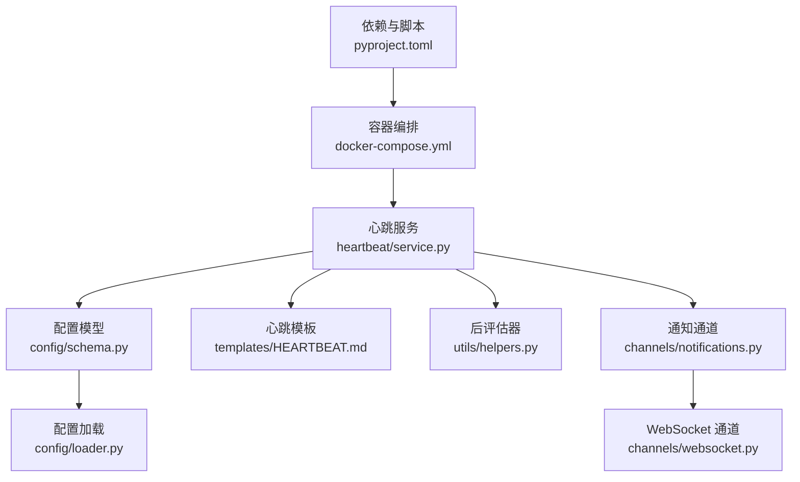
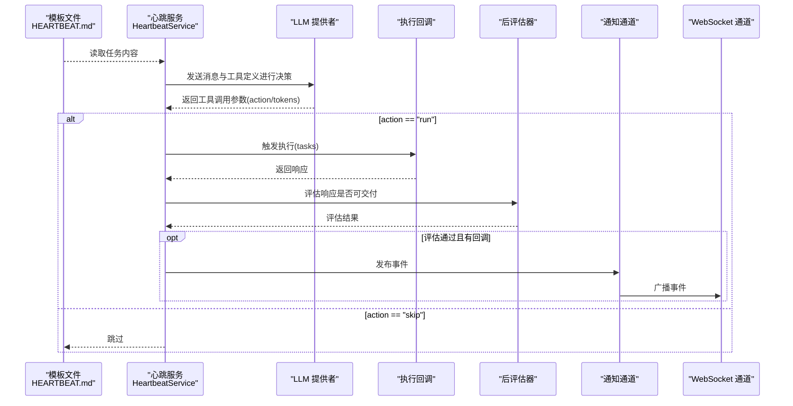
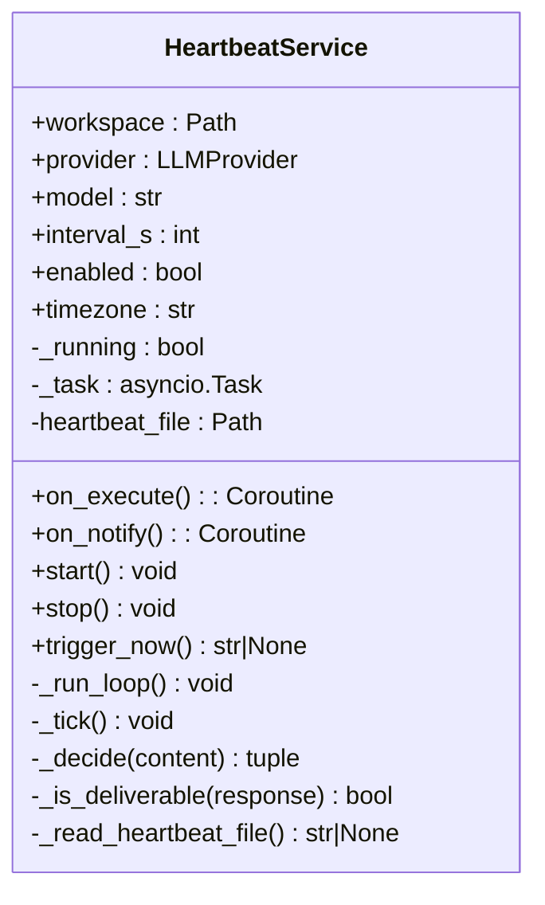
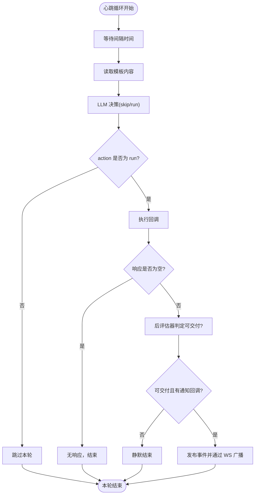
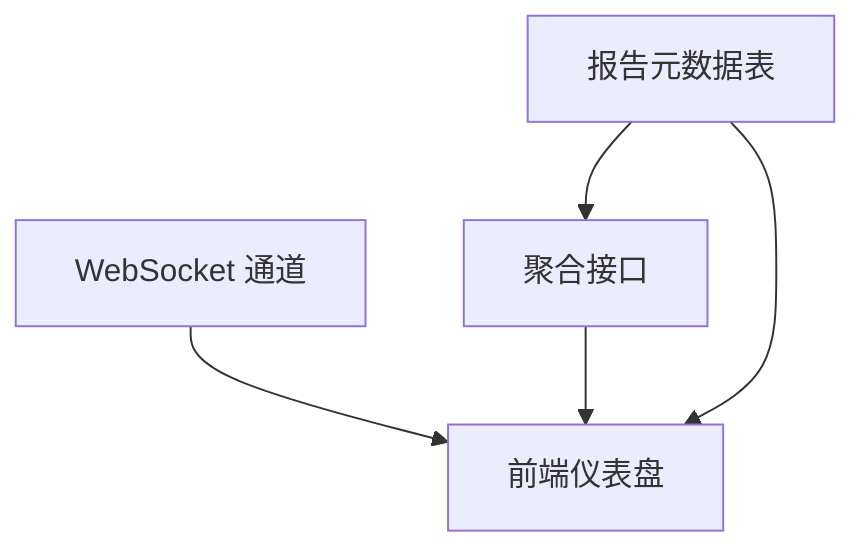
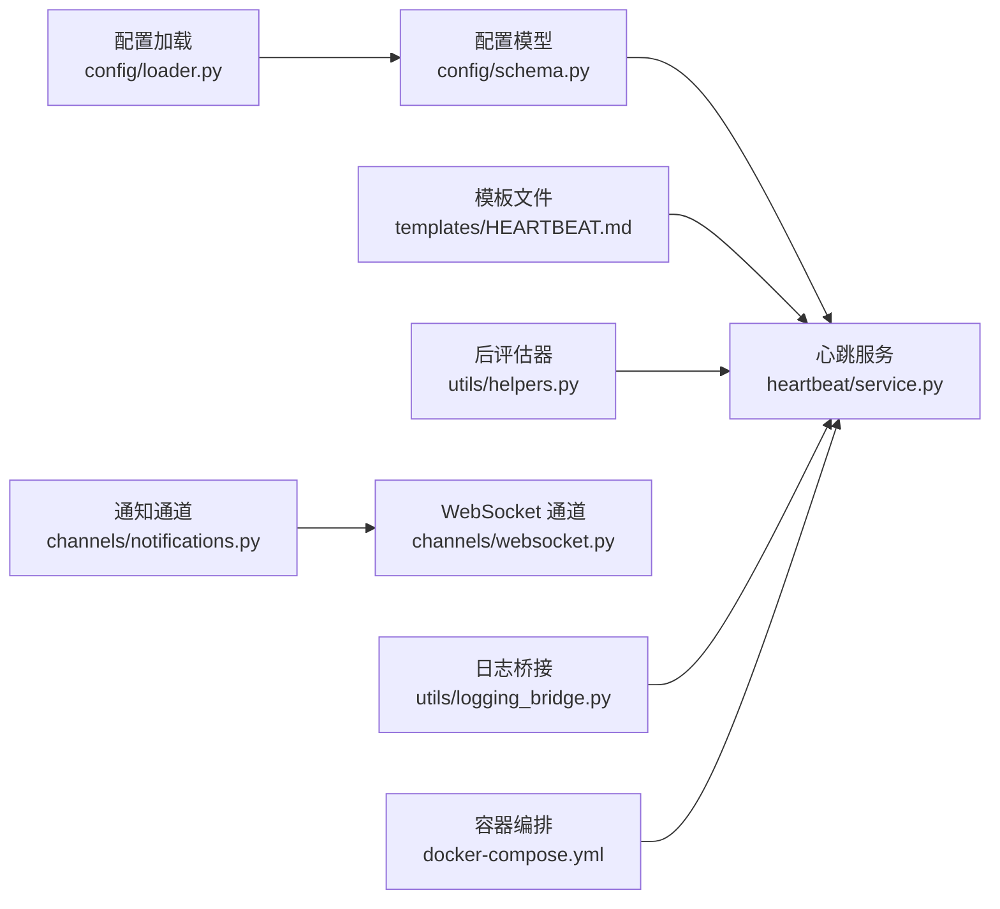

# 监控告警

<cite>
**本文引用的文件**   
- [secbot/heartbeat/service.py](file://secbot/heartbeat/service.py)
- [secbot/templates/HEARTBEAT.md](file://secbot/templates/HEARTBEAT.md)
- [secbot/config/schema.py](file://secbot/config/schema.py)
- [secbot/config/loader.py](file://secbot/config/loader.py)
- [secbot/utils/helpers.py](file://secbot/utils/helpers.py)
- [secbot/utils/logging_bridge.py](file://secbot/utils/logging_bridge.py)
- [secbot/channels/notifications.py](file://secbot/channels/notifications.py)
- [secbot/channels/websocket.py](file://secbot/channels/websocket.py)
- [docker-compose.yml](file://docker-compose.yml)
- [pyproject.toml](file://pyproject.toml)
- [docs/websocket.md](file://docs/websocket.md)
- [.trellis/tasks/05-09-uiux-template-refactor/prototypes/04-task-detail.html](file://.trellis/tasks/05-09-uiux-template-refactor/prototypes/04-task-detail.html)
- [tests/heartbeat/test_heartbeat_deliverability.py](file://tests/heartbeat/test_heartbeat_deliverability.py)
- [tests/heartbeat/test_heartbeat_context_bridge.py](file://tests/heartbeat/test_heartbeat_context_bridge.py)
</cite>

## 目录
1. [简介](#简介)
2. [项目结构](#项目结构)
3. [核心组件](#核心组件)
4. [架构总览](#架构总览)
5. [详细组件分析](#详细组件分析)
6. [依赖关系分析](#依赖关系分析)
7. [性能考虑](#性能考虑)
8. [故障排查指南](#故障排查指南)
9. [结论](#结论)
10. [附录](#附录)

## 简介
本文件面向 VAPT3/secbot 的监控与告警体系，围绕“心跳服务”展开，系统性阐述其健康检查机制、故障检测与自动恢复策略，并给出系统性能监控指标的定义与采集建议、Prometheus/Grafana/Alertmanager 组件的搭建与集成方案、告警规则设计与阈值设定思路，以及监控数据可视化与报表生成实践。文档同时结合仓库中的配置、模板与通道能力，帮助读者在不直接阅读源码的前提下完成部署与运维。

## 项目结构
与监控告警相关的关键目录与文件：
- 心跳服务与模板：secbot/heartbeat/service.py、secbot/templates/HEARTBEAT.md
- 配置与加载：secbot/config/schema.py、secbot/config/loader.py
- 工具与日志桥接：secbot/utils/helpers.py、secbot/utils/logging_bridge.py
- 通知与事件缓冲：secbot/channels/notifications.py、secbot/channels/websocket.py
- 运行时与容器编排：docker-compose.yml、pyproject.toml
- 文档与原型：docs/websocket.md、.trellis/tasks/05-09-uiux-template-refactor/prototypes/04-task-detail.html
- 测试：tests/heartbeat/test_heartbeat_deliverability.py、tests/heartbeat/test_heartbeat_context_bridge.py

**图表来源**
- [secbot/heartbeat/service.py:1-237](file://secbot/heartbeat/service.py#L1-L237)
- [secbot/templates/HEARTBEAT.md:1-17](file://secbot/templates/HEARTBEAT.md#L1-L17)
- [secbot/config/schema.py:174-196](file://secbot/config/schema.py#L174-L196)
- [secbot/config/loader.py:32-56](file://secbot/config/loader.py#L32-L56)
- [secbot/utils/helpers.py:440-494](file://secbot/utils/helpers.py#L440-L494)
- [secbot/channels/notifications.py:279-314](file://secbot/channels/notifications.py#L279-L314)
- [secbot/channels/websocket.py:119-120](file://secbot/channels/websocket.py#L119-L120)
- [docker-compose.yml:15-56](file://docker-compose.yml#L15-L56)
- [pyproject.toml:112-114](file://pyproject.toml#L112-L114)

**章节来源**
- [secbot/heartbeat/service.py:118-137](file://secbot/heartbeat/service.py#L118-L137)
- [secbot/config/schema.py:174-196](file://secbot/config/schema.py#L174-L196)
- [docker-compose.yml:15-56](file://docker-compose.yml#L15-L56)

## 核心组件
- 心跳服务：周期性读取模板文件并基于 LLM 判定是否执行任务，支持手动触发与回调执行。
- 配置模型：包含心跳间隔、启用状态等参数，支持环境变量前缀映射。
- 模板文件：定义心跳任务清单，驱动心跳决策。
- 通知通道：统一事件缓冲与发布，支持级别与来源白名单，具备广播节流与窗口控制。
- WebSocket 通道：提供实时事件流与仪表盘聚合接口，支撑可视化与告警推送。
- 日志桥接：将标准库日志重定向至 loguru，便于集中采集与分析。
- 容器编排：通过 docker-compose 提供服务边界与资源限制，便于 Prometheus 抓取指标。

**章节来源**
- [secbot/heartbeat/service.py:40-74](file://secbot/heartbeat/service.py#L40-L74)
- [secbot/config/schema.py:174-196](file://secbot/config/schema.py#L174-L196)
- [secbot/templates/HEARTBEAT.md:1-17](file://secbot/templates/HEARTBEAT.md#L1-L17)
- [secbot/channels/notifications.py:40-61](file://secbot/channels/notifications.py#L40-L61)
- [secbot/channels/websocket.py:114-116](file://secbot/channels/websocket.py#L114-L116)
- [secbot/utils/logging_bridge.py:34-47](file://secbot/utils/logging_bridge.py#L34-L47)
- [docker-compose.yml:15-56](file://docker-compose.yml#L15-L56)

## 架构总览
下图展示了从“心跳触发—LLM 决策—执行—评估—通知”的闭环流程，以及与配置、模板、通道的关系。

**图表来源**
- [secbot/heartbeat/service.py:87-117](file://secbot/heartbeat/service.py#L87-L117)
- [secbot/heartbeat/service.py:184-227](file://secbot/heartbeat/service.py#L184-L227)
- [secbot/utils/helpers.py:440-494](file://secbot/utils/helpers.py#L440-L494)
- [secbot/channels/notifications.py:279-314](file://secbot/channels/notifications.py#L279-L314)
- [secbot/channels/websocket.py:114-116](file://secbot/channels/websocket.py#L114-L116)

## 详细组件分析

### 心跳服务实现原理与配置
- 周期循环：基于异步任务定时睡眠，按配置间隔触发一次心跳。
- 决策阶段：读取模板内容，构造系统提示词与用户消息，调用 LLM 并声明虚拟工具函数，解析返回的工具参数决定“skip/run”。
- 执行阶段：当 action 为“run”时，调用 on_execute 回调执行任务，获取响应。
- 交付判定：通过后评估器判断响应是否可交付，避免泄露内部信息或空响应。
- 通知阶段：若可交付且评估通过，则调用 on_notify 回调进行通知，最终由通知通道与 WebSocket 推送到前端。
- 配置项：enabled、interval_s、keep_recent_messages 等，均来自配置模型与加载逻辑。

**图表来源**
- [secbot/heartbeat/service.py:40-74](file://secbot/heartbeat/service.py#L40-L74)
- [secbot/heartbeat/service.py:118-137](file://secbot/heartbeat/service.py#L118-L137)
- [secbot/heartbeat/service.py:184-227](file://secbot/heartbeat/service.py#L184-L227)

**章节来源**
- [secbot/heartbeat/service.py:40-74](file://secbot/heartbeat/service.py#L40-L74)
- [secbot/heartbeat/service.py:118-137](file://secbot/heartbeat/service.py#L118-L137)
- [secbot/heartbeat/service.py:184-227](file://secbot/heartbeat/service.py#L184-L227)
- [secbot/config/schema.py:174-180](file://secbot/config/schema.py#L174-L180)
- [secbot/config/loader.py:32-56](file://secbot/config/loader.py#L32-L56)

### 健康检查机制与故障检测
- 健康检查：心跳服务自身具备启动/停止状态管理，异常捕获与日志记录，便于外部探针感知运行状态。
- 故障检测：
  - 心跳循环异常：捕获异常并记录，避免进程退出。
  - LLM 调用失败：通过 provider 的重试机制与 finish_reason 判断，避免错误输出。
  - 交付抑制：过滤“最终化回退”与“内部推理模式泄露”等不可交付响应。
- 自动恢复：心跳服务通过异步任务与取消机制管理生命周期，配合容器编排的重启策略实现自愈。

**图表来源**
- [secbot/heartbeat/service.py:138-149](file://secbot/heartbeat/service.py#L138-L149)
- [secbot/heartbeat/service.py:184-227](file://secbot/heartbeat/service.py#L184-L227)
- [secbot/heartbeat/service.py:150-183](file://secbot/heartbeat/service.py#L150-L183)

**章节来源**
- [secbot/heartbeat/service.py:138-149](file://secbot/heartbeat/service.py#L138-L149)
- [secbot/heartbeat/service.py:150-183](file://secbot/heartbeat/service.py#L150-L183)

### 系统性能监控指标定义与采集
- CPU 使用率：可通过容器资源限制与 cgroup 统计采集，结合 Prometheus Exporter 暴露。
- 内存占用：容器内存限制与使用量，结合应用侧日志桥接统一采集。
- 磁盘空间：宿主机磁盘监控与工作区卷配额，结合告警阈值。
- 网络流量：容器出口/入口统计与 API/WebSocket 连接数，结合网关与通道配置。
- 应用层指标：心跳间隔、执行耗时、评估通过率、通知缓冲容量与事件速率等。

采集建议：
- 在 docker-compose 中为各服务设置资源限制与标签，便于 Prometheus 抓取。
- 使用标准日志格式与日志桥接，统一输出到 stdout/stderr，结合日志收集器（如 Promtail/Fluent Bit）归集。
- 对关键路径增加埋点（如执行耗时、评估耗时），通过 metrics 指标暴露。

**章节来源**
- [docker-compose.yml:23-47](file://docker-compose.yml#L23-L47)
- [secbot/utils/logging_bridge.py:34-47](file://secbot/utils/logging_bridge.py#L34-L47)

### 监控系统搭建指南（Prometheus/Grafana/Alertmanager）
- Prometheus：
  - 静态目标：针对 secbot-api、secbot-gateway 与 secbot-cli 的指标端点。
  - 容器发现：结合标签与服务名自动发现。
- Grafana：
  - 数据源：添加 Prometheus 数据源。
  - 仪表盘：基于心跳间隔、执行耗时、评估通过率、通知缓冲容量、事件速率等构建 KPI 卡片。
- Alertmanager：
  - 告警路由：按级别（critical/warning/info）与来源（资产发现/端口扫描/弱口令/报告/编排器）分发。
  - 通知渠道：与企业微信/钉钉/Slack 等集成。

[本节为通用实践指导，不直接分析具体文件，故无“章节来源”]

### 告警规则设计与阈值设置
- 业务指标告警：
  - 心跳未按时执行：超过 N 倍心跳间隔未产出有效响应。
  - 扫描任务失败率：端口扫描/资产发现/漏洞扫描失败次数占比超过阈值。
  - 报告生成延迟：报告渲染耗时超过阈值。
- 系统资源告警：
  - CPU 使用率持续高于阈值（例如 80%）超过窗口时间。
  - 内存占用接近容器内存限制（例如 90%）。
  - 磁盘剩余空间低于阈值（例如 10%）。
- 安全事件告警：
  - 未知事件级别或来源：触发“未知事件”告警。
  - WebSocket 连接异常：连接断开率或 ping 超时率上升。

[本节为通用实践指导，不直接分析具体文件，故无“章节来源”]

### 监控数据可视化与报表生成
- 实时事件流：WebSocket 通道提供事件广播与节流控制，前端可订阅并展示。
- 聚合接口：参考仪表盘聚合规范，提供 KPI 与趋势数据。
- 报表元数据：报告生成后写入元数据表，支持按时间范围查询与导出。

**图表来源**
- [secbot/channels/websocket.py:114-116](file://secbot/channels/websocket.py#L114-L116)
- [.trellis/tasks/05-09-uiux-template-refactor/prototypes/04-task-detail.html:211-227](file://.trellis/tasks/05-09-uiux-template-refactor/prototypes/04-task-detail.html#L211-L227)

**章节来源**
- [secbot/channels/websocket.py:114-116](file://secbot/channels/websocket.py#L114-L116)
- [.trellis/tasks/05-09-uiux-template-refactor/prototypes/04-task-detail.html:211-227](file://.trellis/tasks/05-09-uiux-template-refactor/prototypes/04-task-detail.html#L211-L227)

## 依赖关系分析
- 心跳服务依赖配置模型与加载模块，确保启用状态与间隔正确生效。
- 通知通道与 WebSocket 通道共同构成事件发布与订阅链路。
- 日志桥接统一底层日志输出，便于集中采集与分析。
- 容器编排为监控与告警提供稳定的运行环境与资源边界。

**图表来源**
- [secbot/config/schema.py:174-196](file://secbot/config/schema.py#L174-L196)
- [secbot/config/loader.py:32-56](file://secbot/config/loader.py#L32-L56)
- [secbot/heartbeat/service.py:40-74](file://secbot/heartbeat/service.py#L40-L74)
- [secbot/utils/helpers.py:440-494](file://secbot/utils/helpers.py#L440-L494)
- [secbot/channels/notifications.py:279-314](file://secbot/channels/notifications.py#L279-L314)
- [secbot/channels/websocket.py:114-116](file://secbot/channels/websocket.py#L114-L116)
- [secbot/utils/logging_bridge.py:34-47](file://secbot/utils/logging_bridge.py#L34-L47)
- [docker-compose.yml:15-56](file://docker-compose.yml#L15-L56)

**章节来源**
- [secbot/config/schema.py:174-196](file://secbot/config/schema.py#L174-L196)
- [secbot/config/loader.py:32-56](file://secbot/config/loader.py#L32-L56)
- [secbot/heartbeat/service.py:40-74](file://secbot/heartbeat/service.py#L40-L74)
- [secbot/utils/helpers.py:440-494](file://secbot/utils/helpers.py#L440-L494)
- [secbot/channels/notifications.py:279-314](file://secbot/channels/notifications.py#L279-L314)
- [secbot/channels/websocket.py:114-116](file://secbot/channels/websocket.py#L114-L116)
- [secbot/utils/logging_bridge.py:34-47](file://secbot/utils/logging_bridge.py#L34-L47)
- [docker-compose.yml:15-56](file://docker-compose.yml#L15-L56)

## 性能考虑
- 心跳间隔：默认 30 分钟，可根据业务负载调整，避免过于频繁导致资源压力。
- 通知缓冲：支持环境变量与参数配置缓冲大小与窗口，避免瞬时洪峰。
- 广播节流：WebSocket 层面对事件广播进行最小间隔控制，降低前端压力。
- 日志桥接：统一日志格式，减少解析成本，提升采集效率。

**章节来源**
- [secbot/config/schema.py:174-180](file://secbot/config/schema.py#L174-L180)
- [secbot/channels/notifications.py:63-94](file://secbot/channels/notifications.py#L63-L94)
- [secbot/channels/websocket.py:114-116](file://secbot/channels/websocket.py#L114-L116)
- [secbot/utils/logging_bridge.py:34-47](file://secbot/utils/logging_bridge.py#L34-L47)

## 故障排查指南
- 心跳未触发：检查配置 enabled 与 interval_s，确认模板文件存在且非空。
- LLM 决策异常：关注 finish_reason 与工具调用参数，必要时调整提示词或模型。
- 交付被抑制：检查响应是否包含“最终化回退”或内部推理模式泄露关键词。
- 通知未送达：核对通知级别与来源白名单，检查缓冲容量与窗口设置。
- WebSocket 断连：检查 ping/pong 配置与令牌校验，确认前端订阅正常。

**章节来源**
- [secbot/heartbeat/service.py:118-137](file://secbot/heartbeat/service.py#L118-L137)
- [secbot/heartbeat/service.py:150-183](file://secbot/heartbeat/service.py#L150-L183)
- [secbot/channels/notifications.py:40-61](file://secbot/channels/notifications.py#L40-L61)
- [docs/websocket.md:181-208](file://docs/websocket.md#L181-L208)

## 结论
心跳服务作为 secbot 的“自我诊断与执行”中枢，通过模板驱动的 LLM 决策、严格的交付判定与统一的通知通道，形成了闭环的监控与告警基础。结合容器编排与标准日志桥接，可快速落地 Prometheus/Grafana/Alertmanager 的监控体系。建议在生产环境中合理设置心跳间隔、通知缓冲与 WebSocket 节流参数，并根据业务场景细化告警规则与阈值，以获得稳定可靠的可观测性保障。

## 附录
- 配置示例与环境变量映射：参见配置模型与加载模块。
- 事件字段与来源：参见通知通道与测试用例。
- WebSocket 认证与令牌：参见文档说明。

**章节来源**
- [secbot/config/schema.py:375-376](file://secbot/config/schema.py#L375-L376)
- [secbot/channels/notifications.py:40-61](file://secbot/channels/notifications.py#L40-L61)
- [tests/api/test_events.py:346-370](file://tests/api/test_events.py#L346-L370)
- [docs/websocket.md:181-208](file://docs/websocket.md#L181-L208)