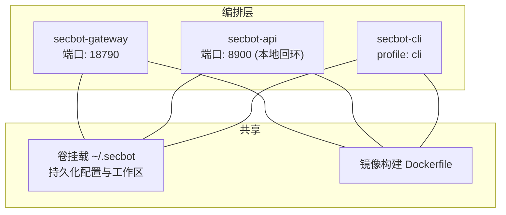
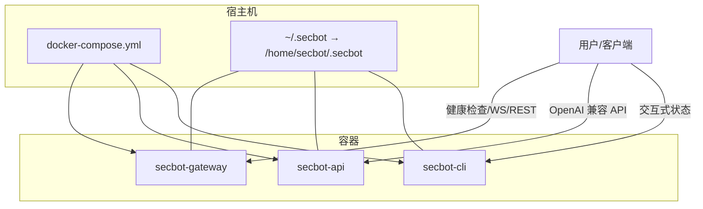
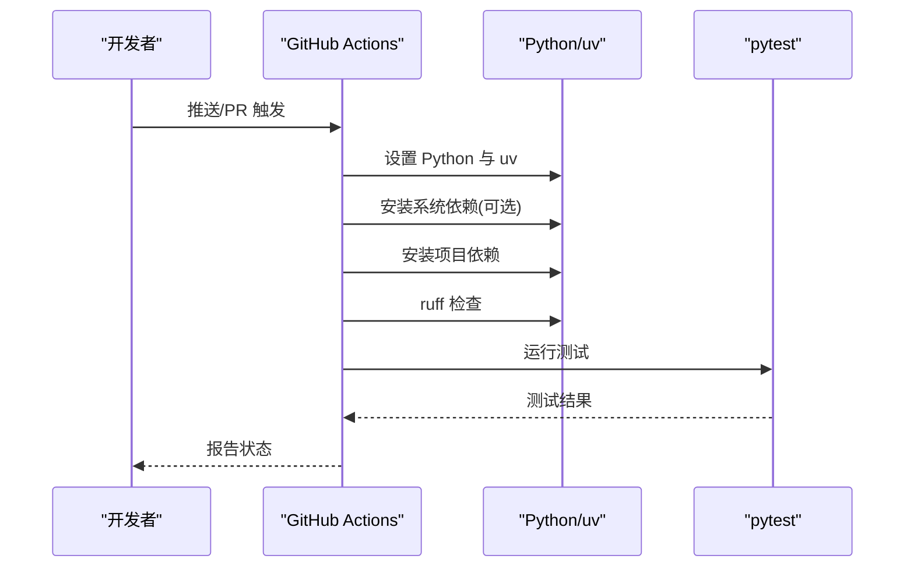
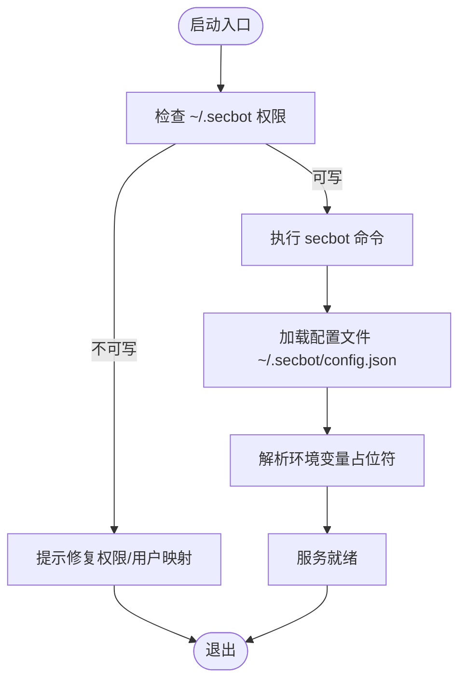

# 编排配置

<cite>
**本文引用的文件**   
- [docker-compose.yml](file://docker-compose.yml)
- [Dockerfile](file://Dockerfile)
- [entrypoint.sh](file://entrypoint.sh)
- [ci.yml](file://.github/workflows/ci.yml)
- [deployment.md](file://docs/deployment.md)
- [README.md](file://README.md)
- [pyproject.toml](file://pyproject.toml)
- [loader.py](file://secbot/config/loader.py)
- [schema.py](file://secbot/config/schema.py)
- [commands.py](file://secbot/cli/commands.py)
- [bootstrap.ts](file://webui/src/lib/bootstrap.ts)
- [App.tsx](file://webui/src/App.tsx)
</cite>

## 目录
1. [简介](#简介)
2. [项目结构](#项目结构)
3. [核心组件](#核心组件)
4. [架构总览](#架构总览)
5. [详细组件分析](#详细组件分析)
6. [依赖分析](#依赖分析)
7. [性能考虑](#性能考虑)
8. [故障排查指南](#故障排查指南)
9. [结论](#结论)
10. [附录](#附录)

## 简介
本文件为 VAPT3/secbot 的编排配置文档，围绕以下目标展开：
- 解释 docker-compose.yml 的服务定义、服务间依赖、网络与卷挂载、环境变量与安全配置
- 阐述多容器服务的协调机制（启动顺序、健康检查、重启策略）
- 提供生产环境编排模板（负载均衡、高可用、服务发现）
- 解释 GitHub Actions CI/CD 流水线（构建触发器、测试矩阵、部署策略）
- 提供不同部署场景的配置示例（单机、集群、云平台）

## 项目结构
本仓库采用“多容器 + 多入口”的编排模式，核心包含：
- 网关服务：对外提供健康检查与 WebSocket/REST 通道
- API 服务：OpenAI 兼容 API（可选）
- CLI 服务：交互式状态查询（受 profiles 控制）

图表来源
- [docker-compose.yml:15-56](file://docker-compose.yml#L15-L56)
- [Dockerfile:1-51](file://Dockerfile#L1-L51)

章节来源
- [docker-compose.yml:1-56](file://docker-compose.yml#L1-L56)
- [Dockerfile:1-51](file://Dockerfile#L1-L51)

## 核心组件
- 网关服务（secbot-gateway）
  - 命令入口：gateway
  - 端口映射：18790 → 18790
  - 资源限制：CPU 1 核、内存 1GiB；预留 CPU 0.25 核、内存 256MiB
  - 重启策略：unless-stopped
- API 服务（secbot-api）
  - 命令入口：serve，绑定 0.0.0.0 并指定工作区路径
  - 端口映射：127.0.0.1:8900:8900（仅本地访问）
  - 资源限制与重启策略同上
- CLI 服务（secbot-cli）
  - 命令入口：status
  - 交互模式：stdin_open=true、tty=true
  - profile: cli（需显式启用）

章节来源
- [docker-compose.yml:16-56](file://docker-compose.yml#L16-L56)

## 架构总览
下图展示容器编排、端口暴露、卷挂载与启动顺序的关系。

图表来源
- [docker-compose.yml:15-56](file://docker-compose.yml#L15-L56)
- [entrypoint.sh:1-16](file://entrypoint.sh#L1-L16)

## 详细组件分析

### 服务定义与依赖
- 公共配置片段
  - 构建上下文与 Dockerfile
  - 卷挂载 ~/.secbot → /home/secbot/.secbot
  - 安全能力：cap_drop、cap_add、security_opt（解除 AppArmor/Seccomp 限制）
- 服务间依赖
  - 网关服务负责对外通道与健康检查
  - API 服务作为 OpenAI 兼容 API 提供者
  - CLI 服务用于诊断与状态查看（需启用 profile: cli）

章节来源
- [docker-compose.yml:1-14](file://docker-compose.yml#L1-L14)
- [docker-compose.yml:15-56](file://docker-compose.yml#L15-L56)

### 网络与端口
- secbot-gateway
  - 暴露端口：18790（健康检查与通道）
- secbot-api
  - 暴露端口：8900（仅本地回环 127.0.0.1:8900:8900）
- secbot-cli
  - 无公开端口映射，通过交互模式运行

章节来源
- [docker-compose.yml:21-39](file://docker-compose.yml#L21-L39)

### 卷挂载与持久化
- 卷挂载 ~/.secbot → /home/secbot/.secbot
- 容器内非 root 用户 secbot（UID 1000）读写配置目录
- 启动前需确保宿主机目录可写或使用 --user 参数匹配 UID/GID

章节来源
- [docker-compose.yml:5-6](file://docker-compose.yml#L5-L6)
- [Dockerfile:35-38](file://Dockerfile#L35-L38)
- [entrypoint.sh:1-16](file://entrypoint.sh#L1-L16)

### 安全与隔离
- 容器能力
  - cap_drop: 全部能力被丢弃
  - cap_add: SYS_ADMIN（用于特定工具/沙箱）
  - security_opt: apparmor=unconfined、seccomp=unconfined（解除安全模块限制）
- 用户与权限
  - 非 root 用户 secbot（UID 1000）
  - 首次运行需修正宿主机目录权限

章节来源
- [docker-compose.yml:7-13](file://docker-compose.yml#L7-L13)
- [Dockerfile:35-44](file://Dockerfile#L35-L44)
- [entrypoint.sh:1-16](file://entrypoint.sh#L1-L16)

### 启动顺序与协调
- 服务启动顺序
  - 通过 docker-compose up 启动时，compose 会根据依赖关系并行启动
  - 由于未声明 depends_on，建议在应用层面通过健康检查或重试策略保证依赖服务就绪
- 健康检查
  - compose 中未定义 healthcheck
  - secbot-gateway 默认端口 18790 可作为外部健康检查目标
- 重启策略
  - unless-stopped：容器退出后自动重启，除非被手动停止

章节来源
- [docker-compose.yml:16-56](file://docker-compose.yml#L16-L56)

### 生产环境编排模板（概念性）
以下为生产级编排的通用模板思路（概念性，非代码映射）：
- 负载均衡
  - 使用反向代理（如 Nginx/Traefik）将请求分发至多个 secbot-gateway 实例
- 高可用
  - 多副本 secbot-gateway，结合外部健康检查与自动故障转移
  - API 服务可横向扩展，配合本地回环端口与内部服务网格
- 服务发现
  - 使用服务注册中心（Consul/DNSSD）或容器编排平台内置服务发现
- 存储
  - 将 ~/.secbot 挂载到共享存储（NFS/CephFS）或使用配置管理工具集中管理
- 安全
  - 限制 capabilities，启用只读根文件系统，最小权限原则
  - 使用 secrets 管理敏感信息，避免明文注入

[本节为概念性说明，不直接分析具体文件，故无章节来源]

### GitHub Actions CI/CD 流水线
- 触发条件
  - 推送至 main、nightly 分支；拉取请求同样触发
- 测试矩阵
  - 操作系统：ubuntu-latest、windows-latest
  - Python 版本：3.11、3.12、3.13、3.14
- 步骤概要
  - 检出代码
  - 设置 Python 与 uv
  - 安装系统依赖（Linux）
  - 安装项目依赖
  - 代码风格检查（ruff）
  - 运行测试（pytest）

图表来源
- [.github/workflows/ci.yml:1-40](file://.github/workflows/ci.yml#L1-L40)

章节来源
- [.github/workflows/ci.yml:1-40](file://.github/workflows/ci.yml#L1-L40)

### 不同部署场景示例

#### 单机部署（docker-compose）
- 启动步骤
  - 初始化配置：docker compose run --rm secbot-cli onboard
  - 编辑 ~/.secbot/config.json 添加密钥
  - 启动网关：docker compose up -d secbot-gateway
  - 可选：启动 API：docker compose up -d secbot-api
- 访问方式
  - 网关健康检查与通道：http://127.0.0.1:18790
  - OpenAI 兼容 API：http://127.0.0.1:8900（本地回环）

章节来源
- [docker-compose.yml:13-25](file://docker-compose.yml#L13-L25)
- [docs/deployment.md:13-25](file://docs/deployment.md#L13-L25)

#### 集群部署（概念性）
- 多副本 secbot-gateway
  - 使用反向代理或 Ingress 将流量分发至多个实例
  - 利用健康检查与自动扩缩容
- 数据一致性
  - 将 ~/.secbot 挂载到共享存储，或通过配置中心集中管理

[本节为概念性说明，不直接分析具体文件，故无章节来源]

#### 云平台部署（概念性）
- 容器编排平台（如 Kubernetes/ECS）
  - 使用 Deployment/StatefulSet 管理副本
  - 使用 ConfigMap/Secret 管理配置与密钥
  - 使用 Service/Ingress 暴露网关与 API
- 监控与日志
  - 集成 Prometheus/Grafana 与日志收集管道

[本节为概念性说明，不直接分析具体文件，故无章节来源]

## 依赖分析
- 镜像与构建
  - 基于 Dockerfile 构建，包含 Node.js 与 Python 依赖安装
- 运行时入口
  - entrypoint.sh 校验 ~/.secbot 权限，再执行 secbot 命令
- 配置加载
  - 配置文件默认位于 ~/.secbot/config.json
  - 支持环境变量占位符 ${VAR} 的解析与校验
- WebUI 交互
  - WebUI 通过 /webui/bootstrap 获取短期 token 与 WS 路径
  - App.tsx 在加载阶段等待引导完成

图表来源
- [entrypoint.sh:1-16](file://entrypoint.sh#L1-L16)
- [loader.py:32-56](file://secbot/config/loader.py#L32-L56)
- [loader.py:86-126](file://secbot/config/loader.py#L86-L126)

章节来源
- [Dockerfile:1-51](file://Dockerfile#L1-L51)
- [entrypoint.sh:1-16](file://entrypoint.sh#L1-L16)
- [loader.py:32-56](file://secbot/config/loader.py#L32-L56)
- [loader.py:86-126](file://secbot/config/loader.py#L86-L126)
- [schema.py:267-376](file://secbot/config/schema.py#L267-L376)

## 性能考虑
- 资源限制
  - secbot-gateway 与 secbot-api 均设置了 CPU 与内存上限与预留，有助于资源公平分配
- 端口绑定
  - API 服务绑定 127.0.0.1，避免不必要的外网暴露
- 容器能力
  - cap_add: SYS_ADMIN 与解除安全模块限制可能带来性能与安全权衡，建议仅在必要时启用

章节来源
- [docker-compose.yml:23-47](file://docker-compose.yml#L23-L47)

## 故障排查指南
- 权限问题
  - 若宿主机 ~/.secbot 不可写，entrypoint.sh 会打印错误并指导修复（修改属主或使用 --user 映射）
- 配置加载失败
  - 加载配置时若 JSON 或字段校验失败，将回退到默认配置并记录警告
- 环境变量未设置
  - 配置中的 ${VAR} 若未在环境中提供，解析会抛出异常
- WebUI 无法连接
  - 确认网关已启动且端口 18790 可达；检查 WebSocket 通道是否启用

章节来源
- [entrypoint.sh:1-16](file://entrypoint.sh#L1-L16)
- [loader.py:32-56](file://secbot/config/loader.py#L32-L56)
- [loader.py:86-126](file://secbot/config/loader.py#L86-L126)
- [README.md:129-170](file://README.md#L129-L170)

## 结论
本编排文档梳理了 secbot 的多容器服务定义、启动与协调机制，并提供了生产级模板思路与 CI/CD 流水线说明。实际部署时应结合业务规模选择合适的编排平台与安全策略，确保配置与密钥的安全管理与可观测性。

## 附录

### 配置文件与环境变量
- 配置文件位置
  - 默认：~/.secbot/config.json
- 环境变量占位符
  - 支持 ${VAR_NAME} 形式，在启动时解析
- CLI 入口
  - secbot 命令行工具提供 agent、serve、gateway 等子命令

章节来源
- [loader.py:25-30](file://secbot/config/loader.py#L25-L30)
- [loader.py:86-126](file://secbot/config/loader.py#L86-L126)
- [commands.py:74-82](file://secbot/cli/commands.py#L74-L82)

### WebUI 引导流程
- WebUI 通过 fetchBootstrap 获取 token 与 ws_path
- App.tsx 在引导完成后进入路由页面

章节来源
- [bootstrap.ts:37-58](file://webui/src/lib/bootstrap.ts#L37-L58)
- [App.tsx:54-185](file://webui/src/App.tsx#L54-L185)