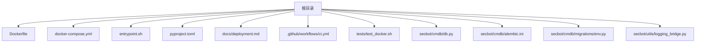
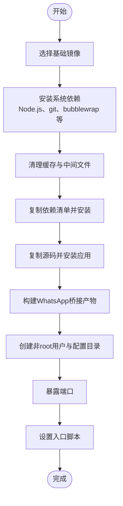
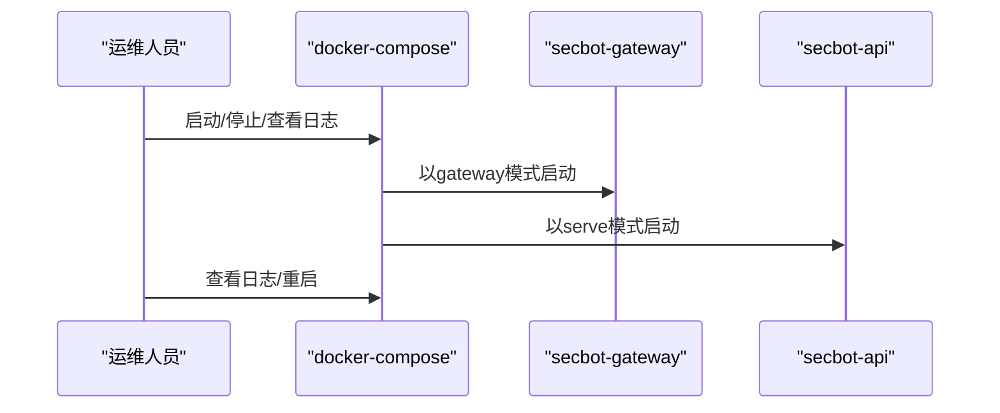
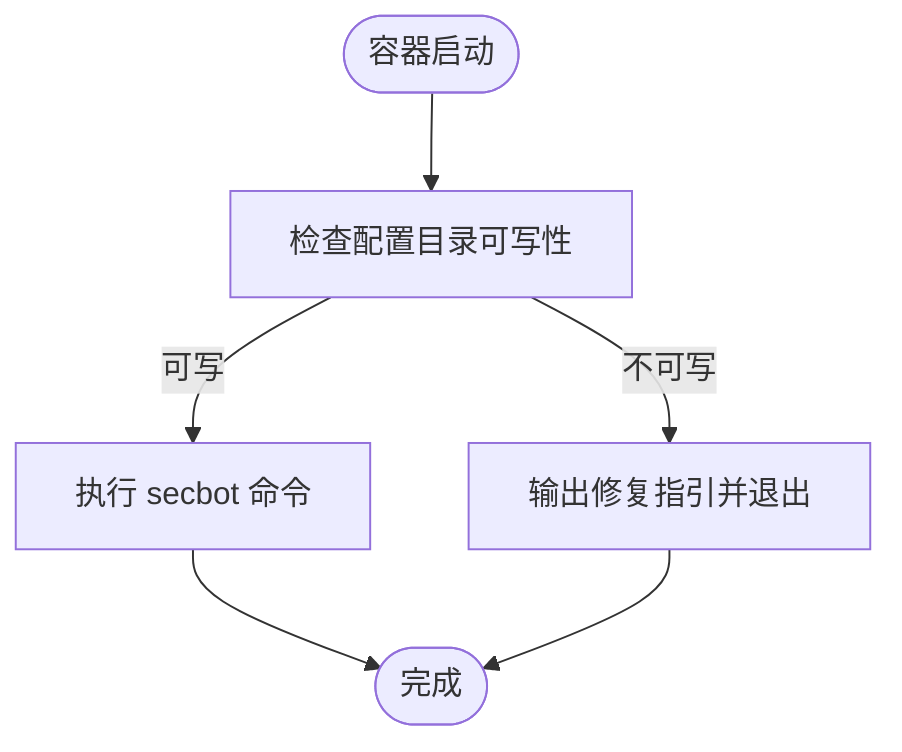
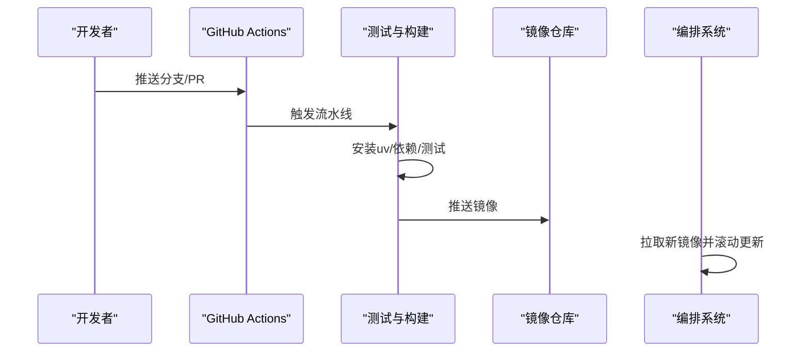
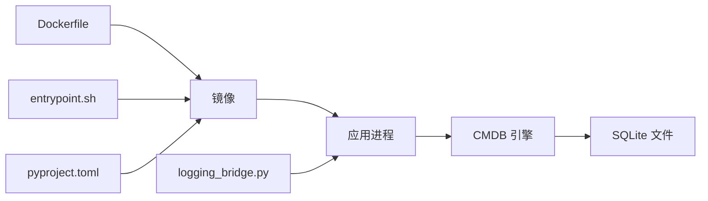

# 部署与运维

<cite>
**本文引用的文件**
- [Dockerfile](file://Dockerfile)
- [docker-compose.yml](file://docker-compose.yml)
- [entrypoint.sh](file://entrypoint.sh)
- [pyproject.toml](file://pyproject.toml)
- [docs/deployment.md](file://docs/deployment.md)
- [.github/workflows/ci.yml](file://.github/workflows/ci.yml)
- [tests/test_docker.sh](file://tests/test_docker.sh)
- [secbot/utils/logging_bridge.py](file://secbot/utils/logging_bridge.py)
- [secbot/cmdb/db.py](file://secbot/cmdb/db.py)
- [secbot/cmdb/alembic.ini](file://secbot/cmdb/alembic.ini)
- [secbot/cmdb/migrations/env.py](file://secbot/cmdb/migrations/env.py)
</cite>

## 目录
1. [简介](#简介)
2. [项目结构](#项目结构)
3. [核心组件](#核心组件)
4. [架构总览](#架构总览)
5. [详细组件分析](#详细组件分析)
6. [依赖分析](#依赖分析)
7. [性能考虑](#性能考虑)
8. [故障排查指南](#故障排查指南)
9. [结论](#结论)
10. [附录](#附录)

## 简介
本文件面向VAPT3/secbot项目的部署与运维团队，提供从容器化到生产级运维的完整指南。内容覆盖Docker镜像构建策略与优化、docker-compose编排配置、生产环境最佳实践、监控告警与日志管理、性能优化、备份恢复与灾难恢复、CI/CD流水线以及运维工具脚本的使用方法。

## 项目结构
本仓库采用“根目录即应用入口”的组织方式，核心部署相关文件集中在根目录：
- 容器化：Dockerfile、docker-compose.yml、entrypoint.sh
- 包管理与依赖：pyproject.toml
- 文档：docs/deployment.md（部署与运行方式）
- CI/CD：.github/workflows/ci.yml
- 测试：tests/test_docker.sh（容器构建与基础功能验证）



图表来源
- [Dockerfile](file://Dockerfile)
- [docker-compose.yml](file://docker-compose.yml)
- [entrypoint.sh](file://entrypoint.sh)
- [pyproject.toml](file://pyproject.toml)
- [docs/deployment.md](file://docs/deployment.md)
- [.github/workflows/ci.yml](file://.github/workflows/ci.yml)
- [tests/test_docker.sh](file://tests/test_docker.sh)
- [secbot/cmdb/db.py](file://secbot/cmdb/db.py)
- [secbot/cmdb/alembic.ini](file://secbot/cmdb/alembic.ini)
- [secbot/cmdb/migrations/env.py](file://secbot/cmdb/migrations/env.py)
- [secbot/utils/logging_bridge.py](file://secbot/utils/logging_bridge.py)

章节来源
- [Dockerfile](file://Dockerfile)
- [docker-compose.yml](file://docker-compose.yml)
- [entrypoint.sh](file://entrypoint.sh)
- [pyproject.toml](file://pyproject.toml)
- [docs/deployment.md](file://docs/deployment.md)
- [.github/workflows/ci.yml](file://.github/workflows/ci.yml)
- [tests/test_docker.sh](file://tests/test_docker.sh)
- [secbot/cmdb/db.py](file://secbot/cmdb/db.py)
- [secbot/cmdb/alembic.ini](file://secbot/cmdb/alembic.ini)
- [secbot/cmdb/migrations/env.py](file://secbot/cmdb/migrations/env.py)
- [secbot/utils/logging_bridge.py](file://secbot/utils/logging_bridge.py)

## 核心组件
- 容器镜像与入口
  - Dockerfile基于轻量基础镜像，分层安装系统依赖与Python依赖，构建后端服务与WhatsApp桥接产物，并以非root用户运行。
  - entrypoint.sh负责宿主机权限校验与执行secbot命令。
- 编排与服务
  - docker-compose定义了网关、API与CLI三个服务，统一挂载配置目录、设置资源限制与安全选项。
- 配置与包管理
  - pyproject.toml声明依赖生态与可选特性，支持多种渠道与提供商。
- 数据库与迁移
  - 内置CMDB使用SQLite（异步SQLAlchemy），默认路径位于用户家目录下的配置目录中，支持WAL模式与连接级PRAGMA优化；通过Alembic进行迁移管理。
- 日志桥接
  - 将标准库logging重定向至loguru，统一格式与层级。

章节来源
- [Dockerfile](file://Dockerfile)
- [docker-compose.yml](file://docker-compose.yml)
- [entrypoint.sh](file://entrypoint.sh)
- [pyproject.toml](file://pyproject.toml)
- [secbot/cmdb/db.py](file://secbot/cmdb/db.py)
- [secbot/utils/logging_bridge.py](file://secbot/utils/logging_bridge.py)

## 架构总览
下图展示容器化部署的高层架构与交互关系。

```mermaid
graph TB
subgraph "宿主机"
U["用户配置目录 ~/.secbot"]
end
subgraph "容器编排"
GW["服务 secbot-gateway"]
API["服务 secbot-api"]
CLI["服务 secbot-cli"]
end
subgraph "容器内部"
IMG["镜像: 基于 uv + Node.js"]
APP["应用进程: secbot"]
DB["CMDB: SQLite (aiosqlite)"]
end
U <- --> GW
U <- --> API
U <- --> CLI
GW --> APP
API --> APP
CLI --> APP
APP --> DB
```

图表来源
- [docker-compose.yml](file://docker-compose.yml)
- [Dockerfile](file://Dockerfile)
- [secbot/cmdb/db.py](file://secbot/cmdb/db.py)

## 详细组件分析

### Dockerfile 构建策略与镜像优化
- 基础镜像与系统依赖
  - 使用轻量基础镜像，先安装Node.js用于WhatsApp桥接，再清理包管理器缓存，减少镜像体积。
- 分层优化
  - 先复制并安装Python依赖（利用pip缓存层），再复制源码，避免无关变更触发重建。
  - 构建桥接产物后清理临时目录，保持最终镜像精简。
- 用户与权限
  - 创建非root用户并设置HOME，确保以非特权身份运行。
- 端口与入口
  - 暴露网关端口，设置默认入口命令为状态检查。
- 多阶段构建建议
  - 当前未使用多阶段构建。若需进一步减小镜像体积，可在构建阶段使用更精简的基础镜像或仅在最终镜像中保留运行时所需二进制与依赖。



图表来源
- [Dockerfile](file://Dockerfile)

章节来源
- [Dockerfile](file://Dockerfile)

### docker-compose 编排配置
- 通用配置
  - 统一使用根目录Dockerfile构建，挂载宿主机配置目录至容器内用户主目录，提升可维护性。
  - 默认丢弃多余能力、启用必要能力并关闭AppArmor/Seccomp限制，便于运行沙箱与桥接功能。
- 服务定义
  - secbot-gateway：对外提供网关服务，映射端口，设置CPU与内存资源上限与预留。
  - secbot-api：本地API服务，绑定回环地址，映射端口，资源配额同上。
  - secbot-cli：可选CLI服务，启用TTY与stdin以便交互式操作。
- 运行与调试
  - 通过命令参数切换运行模式（如gateway、serve、status），便于快速验证。



图表来源
- [docker-compose.yml](file://docker-compose.yml)

章节来源
- [docker-compose.yml](file://docker-compose.yml)

### 入口脚本与权限校验
- 功能要点
  - 在容器启动时检查配置目录是否可写，若不可写则输出修复建议（修改宿主机权限、传入用户映射、或使用Podman的用户命名空间策略）。
  - 成功后执行secbot命令。
- 运维提示
  - 若出现权限错误，优先确认宿主机目录归属与权限，再调整容器运行参数。



图表来源
- [entrypoint.sh](file://entrypoint.sh)

章节来源
- [entrypoint.sh](file://entrypoint.sh)

### 生产环境部署最佳实践
- 资源配置
  - 为各服务设置合理的CPU与内存上限与预留，避免资源争抢导致抖动。
- 网络与安全
  - API服务仅绑定回环地址，避免直接暴露；如需外网访问，建议通过反向代理或Ingress。
  - 安全选项按需收紧，结合最小权限原则。
- 高可用与扩展
  - 可通过编排工具实现副本数与滚动更新策略；对有状态数据（配置与CMDB）确保持久化与一致性。
- 环境隔离
  - 不同环境使用独立的配置目录与环境变量，避免交叉污染。

章节来源
- [docker-compose.yml](file://docker-compose.yml)

### 监控告警系统搭建
- 健康检查
  - 在编排中加入健康检查探针，定期探测服务端口或内部健康端点，失败时自动重启。
- 性能指标
  - 结合系统监控采集CPU/内存/磁盘IO/网络等指标，关注容器粒度与节点粒度的异常波动。
- 日志与异常告警
  - 将容器标准输出接入集中式日志系统；基于日志关键字与阈值触发告警。
- 建议
  - 对关键服务增加就绪探针，确保流量只在服务完全启动后进入。

（本节为通用运维建议，不直接分析具体文件）

### 日志管理策略
- 日志级别与格式
  - 应用侧使用loguru统一格式与层级；可通过环境变量或配置调整全局日志级别。
- 日志轮转
  - 使用系统自带的日志轮转工具（如logrotate）或容器平台内置机制，避免单文件过大。
- 集中式存储与分析
  - 将容器stdout/stderr采集至集中式日志平台，建立索引与查询界面，支持按时间、服务、级别过滤。
- 关键事件追踪
  - 对认证、鉴权、敏感操作与错误堆栈进行标记与聚合，便于事后审计。

章节来源
- [secbot/utils/logging_bridge.py](file://secbot/utils/logging_bridge.py)

### 性能优化指南
- 数据库优化
  - 使用WAL模式与连接级PRAGMA（外键、同步级别、busy_timeout）降低锁竞争与超时。
  - 控制会话生命周期，避免长事务与频繁写放大。
- 缓存策略
  - 对热点查询结果与静态资源进行缓存，合理设置TTL与失效策略。
- 并发控制
  - 限制并发任务数量与队列深度，防止资源耗尽；对阻塞型操作使用异步或限流。
- 资源调优
  - 基于压测结果调整CPU/内存配额与启动参数，平衡吞吐与延迟。

章节来源
- [secbot/cmdb/db.py](file://secbot/cmdb/db.py)

### 备份恢复与灾难恢复
- 备份范围
  - 配置目录（含密钥与工作区）、CMDB数据库文件、桥接产物与日志。
- 备份策略
  - 定期快照或归档，加密传输与存储；验证备份完整性与可恢复性。
- 恢复流程
  - 按顺序恢复配置、数据库、应用，逐项验证服务可用性。
- 灾难恢复
  - 制定RTO/RPO目标，演练跨机房/跨云恢复场景，确保业务连续性。

章节来源
- [secbot/cmdb/db.py](file://secbot/cmdb/db.py)

### CI/CD 流水线与自动化部署
- 测试矩阵
  - 覆盖多个操作系统与Python版本，确保兼容性。
- 依赖安装
  - 使用uv安装系统依赖与Python依赖，加速构建。
- 质量门禁
  - 集成代码风格检查与测试，失败则阻止合并。
- 自动化部署
  - 建议在CI完成后触发镜像构建与推送，再由编排系统拉取新镜像并滚动更新。



图表来源
- [.github/workflows/ci.yml](file://.github/workflows/ci.yml)

章节来源
- [.github/workflows/ci.yml](file://.github/workflows/ci.yml)

### 运维工具与脚本使用
- 容器构建与验证
  - 使用提供的脚本进行镜像构建与基础功能验证，确保镜像可用性。
- 配置与密钥管理
  - 通过环境变量注入密钥，避免硬编码；在系统服务中使用专用环境文件。
- 日志与状态
  - 使用编排工具查看日志与状态，结合入口脚本的权限提示快速定位问题。

章节来源
- [tests/test_docker.sh](file://tests/test_docker.sh)
- [entrypoint.sh](file://entrypoint.sh)

## 依赖分析
- 容器镜像与应用
  - Dockerfile定义了系统依赖与Python依赖安装顺序，entrypoint.sh负责运行时权限校验。
- 数据库与迁移
  - db.py负责引擎初始化、会话管理与PRAGMA设置；alembic.ini与migrations/env.py提供迁移配置与URL解析。
- 日志桥接
  - logging_bridge.py将标准库日志重定向至loguru，统一格式与层级。



图表来源
- [Dockerfile](file://Dockerfile)
- [entrypoint.sh](file://entrypoint.sh)
- [pyproject.toml](file://pyproject.toml)
- [secbot/cmdb/db.py](file://secbot/cmdb/db.py)
- [secbot/utils/logging_bridge.py](file://secbot/utils/logging_bridge.py)

章节来源
- [Dockerfile](file://Dockerfile)
- [entrypoint.sh](file://entrypoint.sh)
- [pyproject.toml](file://pyproject.toml)
- [secbot/cmdb/db.py](file://secbot/cmdb/db.py)
- [secbot/utils/logging_bridge.py](file://secbot/utils/logging_bridge.py)

## 性能考虑
- 数据库层面
  - WAL模式与连接级PRAGMA显著改善并发读写稳定性；建议结合业务峰值评估连接池大小与超时。
- 容器资源
  - 合理设置CPU/内存配额，避免过度分配导致调度抖动；对I/O密集型任务适当放宽磁盘限制。
- 应用日志
  - 控制日志级别与频率，避免I/O成为瓶颈；对高频事件采用采样或批量上报。

章节来源
- [secbot/cmdb/db.py](file://secbot/cmdb/db.py)

## 故障排查指南
- 权限问题
  - 若入口脚本报错提示配置目录不可写，请根据提示修正宿主机权限或容器用户映射。
- 容器启动失败
  - 查看容器日志与健康检查状态，确认端口占用与资源配额是否合理。
- 数据库异常
  - 检查CMDB文件是否存在、权限是否正确；必要时迁移至外部数据库以提升可靠性。
- 日志缺失
  - 确认日志输出到标准输出/错误，且已被采集系统接收；检查日志级别与过滤规则。

章节来源
- [entrypoint.sh](file://entrypoint.sh)
- [docker-compose.yml](file://docker-compose.yml)
- [secbot/cmdb/db.py](file://secbot/cmdb/db.py)

## 结论
本文提供了从容器化构建、编排配置到生产运维、监控告警、性能优化与灾备恢复的完整实践指南。建议在生产环境中结合自身规模与合规要求，进一步完善安全策略、可观测性与自动化流程，持续迭代以获得稳定高效的运行体验。

## 附录
- 快速参考
  - 首次运行：使用编排工具初始化配置与启动网关。
  - 日常运维：通过编排工具查看日志、重启服务、更新镜像。
  - CI/CD：在流水线中集成测试与镜像推送，实现自动化发布。

章节来源
- [docs/deployment.md](file://docs/deployment.md)
- [.github/workflows/ci.yml](file://.github/workflows/ci.yml)
- [docker-compose.yml](file://docker-compose.yml)