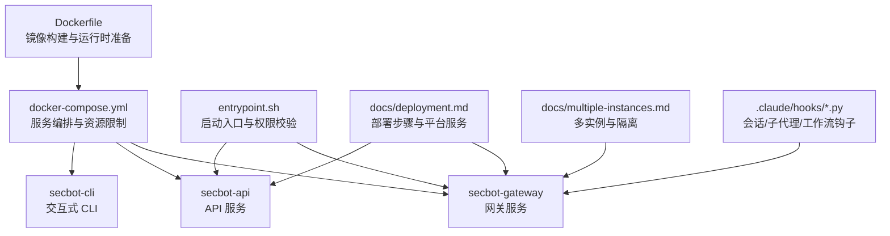
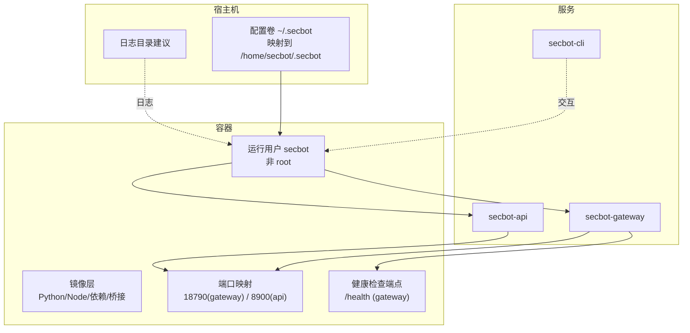
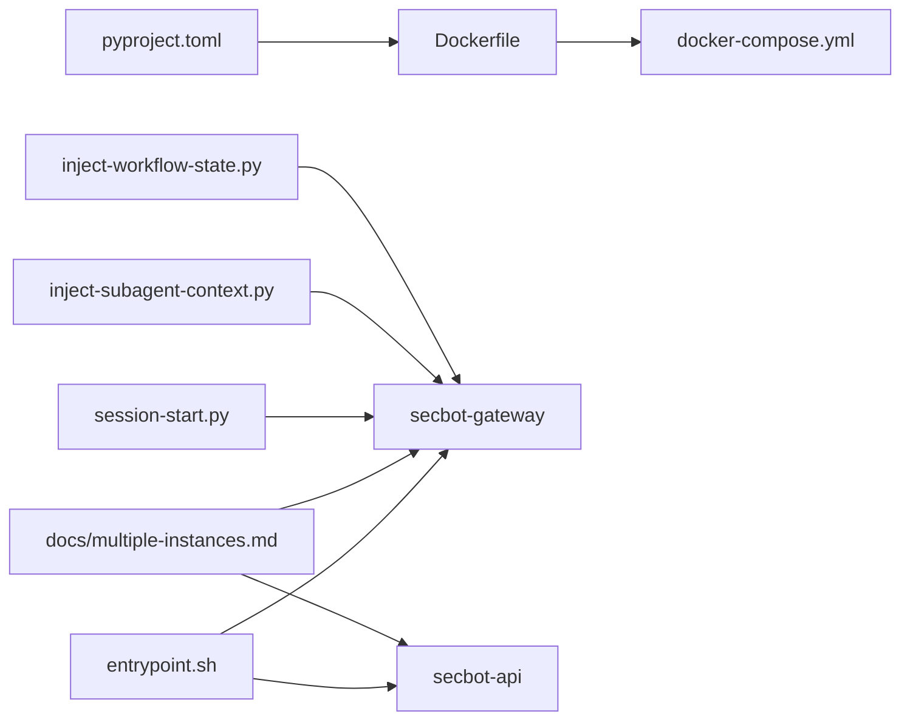

# 部署与运维

<cite>
**本文引用的文件**
- [Dockerfile](file://Dockerfile)
- [docker-compose.yml](file://docker-compose.yml)
- [entrypoint.sh](file://entrypoint.sh)
- [deployment.md](file://docs/deployment.md)
- [multiple-instances.md](file://docs/multiple-instances.md)
- [pyproject.toml](file://pyproject.toml)
- [.claude/settings.json](file://.claude/settings.json)
- [.claude/settings.local.json](file://.claude/settings.local.json)
- [.claude/hooks/session-start.py](file://.claude/hooks/session-start.py)
- [.claude/hooks/inject-subagent-context.py](file://.claude/hooks/inject-subagent-context.py)
- [.claude/hooks/inject-workflow-state.py](file://.claude/hooks/inject-workflow-state.py)
</cite>

## 目录
1. [简介](#简介)
2. [项目结构](#项目结构)
3. [核心组件](#核心组件)
4. [架构总览](#架构总览)
5. [详细组件分析](#详细组件分析)
6. [依赖关系分析](#依赖关系分析)
7. [性能考量](#性能考量)
8. [故障排查指南](#故障排查指南)
9. [结论](#结论)
10. [附录](#附录)

## 简介
本指南面向生产环境的部署与运维，覆盖容器化（Docker）与编排（docker-compose）、多实例部署策略、健康检查与端口暴露、权限与安全加固、日志与监控建议、备份与恢复流程，以及运维自动化与 CI/CD 集成思路。文档中的所有技术细节均以仓库内现有文件为依据，并通过“章节来源”与“图表来源”进行精确溯源。

## 项目结构
围绕部署与运维的关键文件分布如下：
- 容器与编排：Dockerfile、docker-compose.yml、entrypoint.sh
- 文档与使用说明：docs/deployment.md、docs/multiple-instances.md
- 依赖与打包：pyproject.toml
- 平台钩子与会话上下文：.claude/hooks 下的三个脚本
- 平台配置：.claude/settings.json、.claude/settings.local.json

图表来源
- [Dockerfile:1-51](file://Dockerfile#L1-L51)
- [docker-compose.yml:1-56](file://docker-compose.yml#L1-L56)
- [entrypoint.sh:1-16](file://entrypoint.sh#L1-L16)
- [deployment.md:1-171](file://docs/deployment.md#L1-L171)
- [multiple-instances.md:1-127](file://docs/multiple-instances.md#L1-L127)
- [.claude/hooks/session-start.py:1-770](file://.claude/hooks/session-start.py#L1-L770)
- [.claude/hooks/inject-subagent-context.py:1-747](file://.claude/hooks/inject-subagent-context.py#L1-L747)
- [.claude/hooks/inject-workflow-state.py:1-241](file://.claude/hooks/inject-workflow-state.py#L1-L241)

章节来源
- [Dockerfile:1-51](file://Dockerfile#L1-L51)
- [docker-compose.yml:1-56](file://docker-compose.yml#L1-L56)
- [entrypoint.sh:1-16](file://entrypoint.sh#L1-L16)
- [deployment.md:1-171](file://docs/deployment.md#L1-L171)
- [multiple-instances.md:1-127](file://docs/multiple-instances.md#L1-L127)
- [.claude/hooks/session-start.py:1-770](file://.claude/hooks/session-start.py#L1-L770)
- [.claude/hooks/inject-subagent-context.py:1-747](file://.claude/hooks/inject-subagent-context.py#L1-L747)
- [.claude/hooks/inject-workflow-state.py:1-241](file://.claude/hooks/inject-workflow-state.py#L1-L241)

## 核心组件
- 容器镜像与运行时
  - 基于官方 uv 镜像，安装 Node.js 用于 WhatsApp 桥接；分层安装 Python 依赖；构建 WhatsApp 桥接；创建非 root 用户与配置目录；暴露默认端口；通过 entrypoint 启动 secbot 子命令。
- 编排与服务
  - docker-compose 定义网关、API、CLI 三类服务；统一挂载宿主机配置目录到 /home/secbot/.secbot；限制 CPU 与内存；启用 SYS_ADMIN 能力并放宽安全选项。
- 启动入口与权限
  - entrypoint 在启动前检测宿主机配置目录可写性，若 UID 不匹配则输出修复指引并退出。
- 多实例与隔离
  - 支持通过 --config 与 --workspace 参数为不同实例指定独立配置与工作区；不同实例需使用不同端口；支持健康检查端点。
- 平台钩子与上下文
  - 会话开始注入、子代理上下文注入、每轮工作流状态注入，确保多平台一致性与上下文完整性。

章节来源
- [Dockerfile:1-51](file://Dockerfile#L1-L51)
- [docker-compose.yml:1-56](file://docker-compose.yml#L1-L56)
- [entrypoint.sh:1-16](file://entrypoint.sh#L1-L16)
- [multiple-instances.md:1-127](file://docs/multiple-instances.md#L1-L127)
- [.claude/hooks/session-start.py:1-770](file://.claude/hooks/session-start.py#L1-L770)
- [.claude/hooks/inject-subagent-context.py:1-747](file://.claude/hooks/inject-subagent-context.py#L1-L747)
- [.claude/hooks/inject-workflow-state.py:1-241](file://.claude/hooks/inject-workflow-state.py#L1-L241)

## 架构总览
下图展示容器化部署与多实例运行的整体视图，包括镜像构建、卷挂载、服务编排、健康检查与外部访问路径。

图表来源
- [Dockerfile:1-51](file://Dockerfile#L1-L51)
- [docker-compose.yml:1-56](file://docker-compose.yml#L1-L56)
- [entrypoint.sh:1-16](file://entrypoint.sh#L1-L16)
- [multiple-instances.md:100-107](file://docs/multiple-instances.md#L100-L107)

## 详细组件分析

### 容器镜像与构建（Dockerfile）
- 分层策略
  - 先复制 pyproject.toml 与 README，安装依赖缓存层；
  - 再复制 secbot/ 与 bridge/，安装应用依赖；
  - 构建 WhatsApp 桥接；
  - 创建非 root 用户与配置目录；
  - 设置 HOME 与默认入口命令。
- 运行时安全
  - 使用非 root 用户执行；
  - 暴露默认端口；
  - 安全选项在 docker-compose 中放宽（开发/演示场景），生产应收紧。
- 依赖与工具链
  - Python 3.12，Node.js 20，构建桥接所需工具链。

章节来源
- [Dockerfile:1-51](file://Dockerfile#L1-L51)

### 编排与服务（docker-compose）
- 通用配置
  - build 上下文指向仓库根；
  - 卷挂载 ~/.secbot 到 /home/secbot/.secbot；
  - 安全能力：cap_drop: ALL，cap_add: SYS_ADMIN；
  - 安全选项：apparmor=unconfined，seccomp=unconfined。
- 服务定义
  - secbot-gateway：对外暴露 18790 端口，CPU/内存限制与预留；
  - secbot-api：仅本地回环 127.0.0.1:8900 映射至容器 8900；
  - secbot-cli：交互式终端，profiles: cli。
- 建议
  - 生产中建议将 API 端口也绑定到受信接口或通过反向代理暴露；
  - 为每个服务配置健康检查与重启策略。

章节来源
- [docker-compose.yml:1-56](file://docker-compose.yml#L1-L56)

### 启动入口与权限校验（entrypoint.sh）
- 功能
  - 检查 /home/secbot/.secbot 是否可写；
  - 若宿主机 UID 与容器内 UID 不一致，打印修复建议并退出；
  - 成功后执行 secbot 子命令。
- 运维要点
  - 首次初始化需确保宿主机目录归属正确；
  - 使用 --user 或等效方式保持 UID/GID 一致。

章节来源
- [entrypoint.sh:1-16](file://entrypoint.sh#L1-L16)

### 多实例部署与隔离（docs/multiple-instances.md）
- 实例隔离
  - 通过 --config 指定不同配置文件；
  - 可通过 --workspace 为实例指定独立工作区；
  - 不同实例必须使用不同端口。
- 健康检查
  - 网关默认绑定到 127.0.0.1，可通过 gateway.host 暴露到公网或局域网；
  - 提供 /health 健康端点。
- 常见用例
  - Telegram、Discord、Feishu 等平台独立实例；
  - 测试与生产隔离；
  - 团队间租户隔离。

章节来源
- [multiple-instances.md:1-127](file://docs/multiple-instances.md#L1-L127)

### 平台钩子与上下文注入（.claude/hooks/*.py）
- 会话开始注入（session-start.py）
  - 注入工作流概览、当前状态、规范索引、任务状态与指导；
  - 跨平台兼容，输出结构化上下文。
- 子代理上下文注入（inject-subagent-context.py）
  - 根据 implement.jsonl/check.jsonl/prd.md/info.md 等生成子代理专用上下文；
  - 支持 implement/check/research 三种子代理类型。
- 每轮工作流状态注入（inject-workflow-state.py）
  - 从 workflow.md 解析 [workflow-state:STATUS] 标签块；
  - 针对不同平台选择事件名（UserPromptSubmit/BeforeAgent）。

章节来源
- [.claude/hooks/session-start.py:1-770](file://.claude/hooks/session-start.py#L1-L770)
- [.claude/hooks/inject-subagent-context.py:1-747](file://.claude/hooks/inject-subagent-context.py#L1-L747)
- [.claude/hooks/inject-workflow-state.py:1-241](file://.claude/hooks/inject-workflow-state.py#L1-L241)

### 平台配置（.claude/settings.json、.claude/settings.local.json）
- settings.json
  - 定义 Hooks 触发与命令调用，如 SessionStart、PreToolUse、UserPromptSubmit；
  - 指定插件启用与超时控制。
- settings.local.json
  - 权限白名单，允许特定 Bash 命令执行。

章节来源
- [.claude/settings.json:1-74](file://.claude/settings.json#L1-L74)
- [.claude/settings.local.json:1-8](file://.claude/settings.local.json#L1-L8)

## 依赖关系分析
- 组件耦合
  - docker-compose 依赖 Dockerfile 的镜像构建产物；
  - entrypoint.sh 作为 secbot 主入口，负责权限校验与命令转发；
  - 多实例通过 --config/--workspace 与配置文件解耦；
  - 平台钩子与工作流文档共同决定上下文注入行为。
- 外部依赖
  - Node.js 20 用于 WhatsApp 桥接；
  - Python 依赖由 pyproject.toml 管理，构建阶段通过 uv 安装。

图表来源
- [Dockerfile:1-51](file://Dockerfile#L1-L51)
- [docker-compose.yml:1-56](file://docker-compose.yml#L1-L56)
- [entrypoint.sh:1-16](file://entrypoint.sh#L1-L16)
- [multiple-instances.md:1-127](file://docs/multiple-instances.md#L1-L127)
- [.claude/hooks/session-start.py:1-770](file://.claude/hooks/session-start.py#L1-L770)
- [.claude/hooks/inject-subagent-context.py:1-747](file://.claude/hooks/inject-subagent-context.py#L1-L747)
- [.claude/hooks/inject-workflow-state.py:1-241](file://.claude/hooks/inject-workflow-state.py#L1-L241)
- [pyproject.toml:1-169](file://pyproject.toml#L1-L169)

章节来源
- [pyproject.toml:1-169](file://pyproject.toml#L1-L169)

## 性能考量
- 资源限制
  - docker-compose 对 CPU 与内存设置了上限与预留，建议根据实际负载调整。
- I/O 与卷
  - 配置与工作区通过卷挂载，建议使用高性能存储并开启同步策略。
- 端口与网络
  - 网关默认绑定 127.0.0.1，生产建议改为受信接口或通过反向代理暴露。
- 依赖安装
  - 分层安装依赖可利用缓存，减少重复安装时间。

章节来源
- [docker-compose.yml:23-47](file://docker-compose.yml#L23-L47)
- [Dockerfile:17-26](file://Dockerfile#L17-L26)

## 故障排查指南
- 权限与卷挂载
  - 症状：容器启动即退出并提示不可写；
  - 排查：确认宿主机 ~/.secbot 目录归属与权限，按 entrypoint 提示修复 UID/GID。
- 端口冲突
  - 症状：端口占用导致服务无法启动；
  - 排查：检查宿主机端口占用，修改 docker-compose 端口映射或停止冲突进程。
- 健康检查
  - 症状：外部无法访问 /health；
  - 排查：确认 gateway.host 是否绑定到 0.0.0.0 或受信接口；检查防火墙规则。
- 多实例冲突
  - 症状：多个实例端口相同导致冲突；
  - 排查：为每个实例设置唯一端口，确保 --workspace 与 --config 正确分离。

章节来源
- [entrypoint.sh:1-16](file://entrypoint.sh#L1-L16)
- [multiple-instances.md:121-127](file://docs/multiple-instances.md#L121-L127)

## 结论
本指南基于仓库现有文件，提供了从镜像构建、容器编排、多实例隔离到健康检查与故障排查的完整运维路径。生产部署建议在安全、网络与资源方面进一步加固与优化，并结合日志与监控体系完善可观测性。

## 附录

### A. 生产环境部署清单
- 镜像与构建
  - 使用仓库 Dockerfile 构建镜像；
  - 确保依赖安装分层合理，便于缓存复用。
- 卷与权限
  - 将宿主机 ~/.secbot 挂载到 /home/secbot/.secbot；
  - 确保宿主机目录归属与容器内 UID 一致。
- 网络与安全
  - 网关端口 18790 按需对外暴露；
  - API 端口 8900 仅在受信网络内可达；
  - 生产中建议收紧安全选项与 capabilities。
- 多实例
  - 为每个实例设置独立 --config 与 --workspace；
  - 使用不同端口避免冲突。

章节来源
- [Dockerfile:1-51](file://Dockerfile#L1-L51)
- [docker-compose.yml:1-56](file://docker-compose.yml#L1-L56)
- [multiple-instances.md:1-127](file://docs/multiple-instances.md#L1-L127)

### B. 监控与日志建议
- 日志
  - 建议将容器标准输出接入集中日志系统；
  - 将配置与工作区卷纳入备份范围。
- 健康检查
  - 使用 /health 端点进行探活；
  - 结合编排重启策略实现自愈。

章节来源
- [multiple-instances.md:100-107](file://docs/multiple-instances.md#L100-L107)

### C. 备份与恢复流程
- 备份对象
  - 配置目录 ~/.secbot；
  - 各实例的工作区（--workspace）。
- 恢复步骤
  - 停止服务；
  - 恢复备份到对应路径；
  - 重新启动容器并验证 /health。

章节来源
- [deployment.md:3-45](file://docs/deployment.md#L3-L45)
- [multiple-instances.md:1-127](file://docs/multiple-instances.md#L1-L127)

### D. 运维自动化与 CI/CD 集成
- 自动化脚本
  - 使用 docker-compose 管理服务生命周期；
  - 通过钩子与 CLI 命令完成初始化与日常维护。
- CI/CD
  - 在流水线中执行镜像构建与推送；
  - 使用 docker-compose 部署到目标环境；
  - 将日志与健康检查纳入告警。

章节来源
- [deployment.md:13-45](file://docs/deployment.md#L13-L45)
- [.claude/hooks/session-start.py:1-770](file://.claude/hooks/session-start.py#L1-L770)
- [.claude/hooks/inject-subagent-context.py:1-747](file://.claude/hooks/inject-subagent-context.py#L1-L747)
- [.claude/hooks/inject-workflow-state.py:1-241](file://.claude/hooks/inject-workflow-state.py#L1-L241)