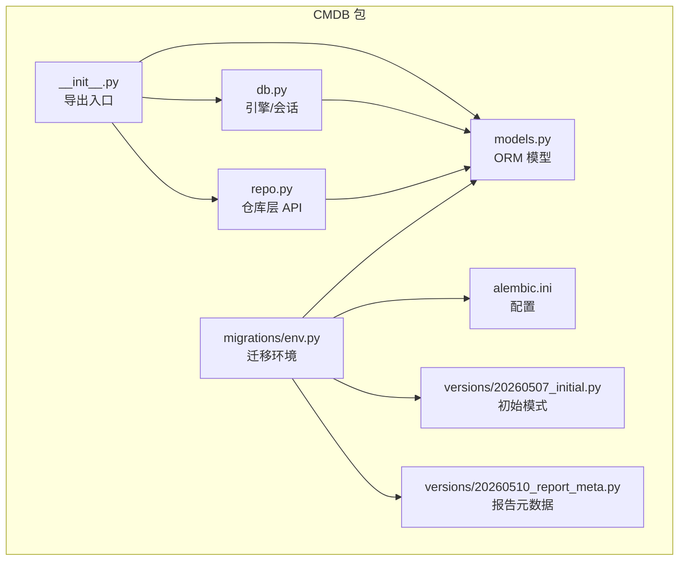
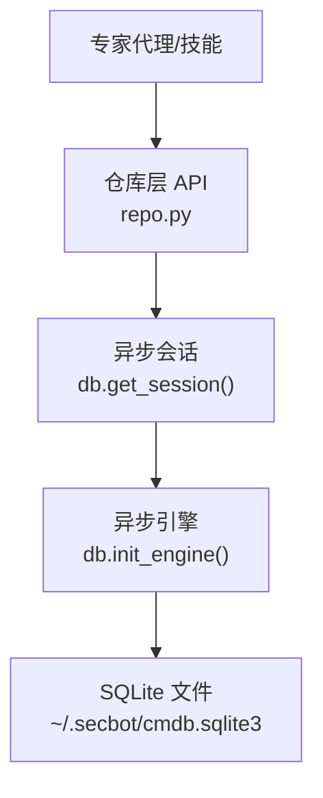
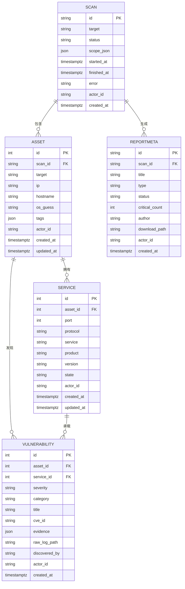
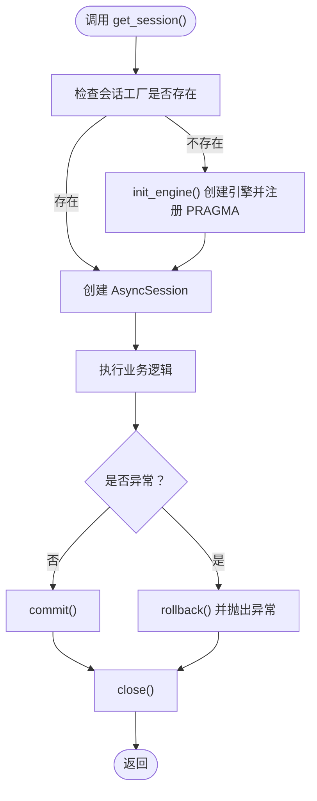
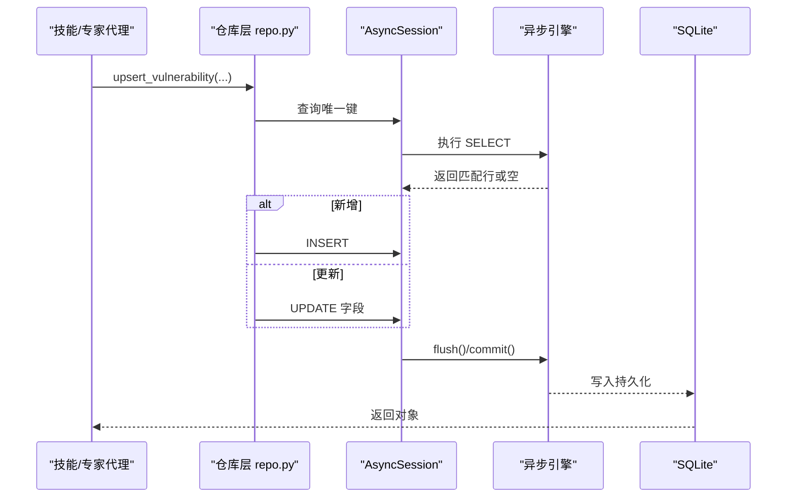
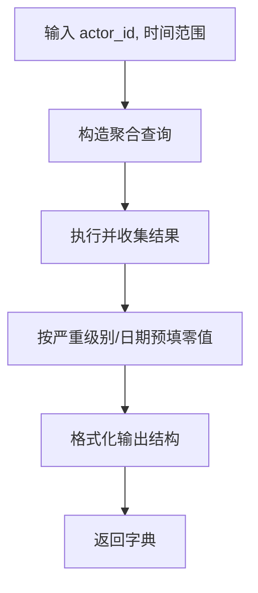
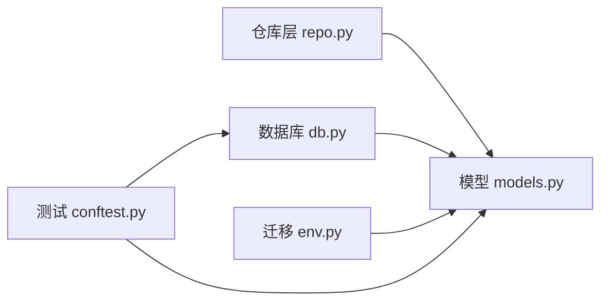
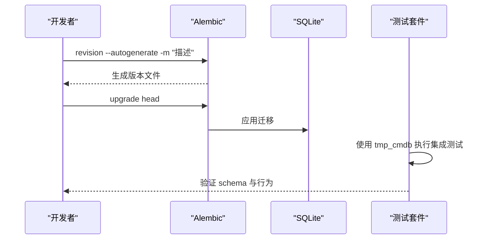

# CMDB资产库

<cite>
**本文引用的文件**
- [secbot/cmdb/__init__.py](file://secbot/cmdb/__init__.py)
- [secbot/cmdb/db.py](file://secbot/cmdb/db.py)
- [secbot/cmdb/models.py](file://secbot/cmdb/models.py)
- [secbot/cmdb/repo.py](file://secbot/cmdb/repo.py)
- [secbot/cmdb/alembic.ini](file://secbot/cmdb/alembic.ini)
- [secbot/cmdb/migrations/env.py](file://secbot/cmdb/migrations/env.py)
- [secbot/cmdb/migrations/versions/20260507_initial.py](file://secbot/cmdb/migrations/versions/20260507_initial.py)
- [secbot/cmdb/migrations/versions/20260510_report_meta.py](file://secbot/cmdb/migrations/versions/20260510_report_meta.py)
- [tests/cmdb/test_repo.py](file://tests/cmdb/test_repo.py)
- [tests/cmdb/conftest.py](file://tests/cmdb/conftest.py)
- [.trellis/spec/backend/cmdb-schema.md](file://.trellis/spec/backend/cmdb-schema.md)
</cite>

## 目录
1. [简介](#简介)
2. [项目结构](#项目结构)
3. [核心组件](#核心组件)
4. [架构总览](#架构总览)
5. [详细组件分析](#详细组件分析)
6. [依赖关系分析](#依赖关系分析)
7. [性能与查询优化](#性能与查询优化)
8. [数据库操作命令](#数据库操作命令)
9. [数据模型演进与版本管理](#数据模型演进与版本管理)
10. [故障排查指南](#故障排查指南)
11. [结论](#结论)

## 简介
本节介绍 VAPT3/secbot 项目中的本地 CMDB（资产库）设计与实现。该资产库以 SQLite 为基础，结合 SQLAlchemy 2.x 的异步 ORM 能力与 Alembic 迁移工具，构建了面向“资产、服务、漏洞、扫描任务”的统一数据模型，并通过严格的多租户隔离、UPSERT 原则与索引策略，支撑安全扫描与仪表盘聚合等场景。

## 项目结构
CMDB 子系统位于 secbot/cmdb 目录，包含以下关键模块：
- 初始化入口：对外暴露模型与会话工厂，限制外部直接使用 sqlite3/原生 SQL。
- 数据库引擎与会话：封装异步 SQLAlchemy 引擎、连接参数与会话生命周期。
- 数据模型：定义资产、服务、漏洞、扫描与报告元数据等表及约束。
- 仓库层：提供 upsert/list 等高层 API，保证幂等性与多租户隔离。
- 迁移与配置：Alembic 配置与初始版本迁移脚本；环境变量解析与离线迁移支持。

**图表来源**
- [secbot/cmdb/__init__.py:1-26](file://secbot/cmdb/__init__.py#L1-L26)
- [secbot/cmdb/db.py:1-133](file://secbot/cmdb/db.py#L1-L133)
- [secbot/cmdb/models.py:1-263](file://secbot/cmdb/models.py#L1-L263)
- [secbot/cmdb/repo.py:1-994](file://secbot/cmdb/repo.py#L1-L994)
- [secbot/cmdb/alembic.ini:1-45](file://secbot/cmdb/alembic.ini#L1-L45)
- [secbot/cmdb/migrations/env.py:1-78](file://secbot/cmdb/migrations/env.py#L1-L78)
- [secbot/cmdb/migrations/versions/20260507_initial.py:1-159](file://secbot/cmdb/migrations/versions/20260507_initial.py#L1-L159)
- [secbot/cmdb/migrations/versions/20260510_report_meta.py:1-72](file://secbot/cmdb/migrations/versions/20260510_report_meta.py#L1-L72)

**章节来源**
- [secbot/cmdb/__init__.py:1-26](file://secbot/cmdb/__init__.py#L1-L26)
- [secbot/cmdb/db.py:1-133](file://secbot/cmdb/db.py#L1-L133)
- [secbot/cmdb/models.py:1-263](file://secbot/cmdb/models.py#L1-L263)
- [secbot/cmdb/repo.py:1-994](file://secbot/cmdb/repo.py#L1-L994)
- [secbot/cmdb/alembic.ini:1-45](file://secbot/cmdb/alembic.ini#L1-L45)
- [secbot/cmdb/migrations/env.py:1-78](file://secbot/cmdb/migrations/env.py#L1-L78)
- [secbot/cmdb/migrations/versions/20260507_initial.py:1-159](file://secbot/cmdb/migrations/versions/20260507_initial.py#L1-L159)
- [secbot/cmdb/migrations/versions/20260510_report_meta.py:1-72](file://secbot/cmdb/migrations/versions/20260510_report_meta.py#L1-L72)

## 核心组件
- 异步引擎与会话工厂：负责默认数据库路径解析、WAL 模式与连接参数设置、会话生命周期管理。
- ORM 模型：定义 Scan/Asset/Service/Vulnerability/ReportMeta 表及其索引、外键与默认值。
- 仓库层 API：提供 create_scan/upsert_asset/upsert_service/upsert_vulnerability/list_* 等幂等写入与查询接口。
- 迁移系统：Alembic 配置与版本化迁移脚本，支持在线变更与离线迁移。

**章节来源**
- [secbot/cmdb/db.py:64-133](file://secbot/cmdb/db.py#L64-L133)
- [secbot/cmdb/models.py:34-263](file://secbot/cmdb/models.py#L34-L263)
- [secbot/cmdb/repo.py:76-406](file://secbot/cmdb/repo.py#L76-L406)
- [secbot/cmdb/alembic.ini:1-45](file://secbot/cmdb/alembic.ini#L1-L45)
- [secbot/cmdb/migrations/env.py:33-78](file://secbot/cmdb/migrations/env.py#L33-L78)

## 架构总览
CMDB 的数据流从“专家代理”或“技能”产生扫描结果，经由仓库层的 upsert 接口写入数据库；仪表盘与报告模块通过只读查询与聚合函数进行统计展示。

**图表来源**
- [secbot/cmdb/repo.py:76-142](file://secbot/cmdb/repo.py#L76-L142)
- [secbot/cmdb/db.py:103-122](file://secbot/cmdb/db.py#L103-L122)
- [secbot/cmdb/db.py:64-93](file://secbot/cmdb/db.py#L64-L93)

## 详细组件分析

### 数据模型与关系
- Scan：扫描任务，主键为 ULID，记录目标、状态、时间戳与错误信息。
- Asset：资产，关联 Scan，包含 IP/主机名/操作系统猜测与标签 JSON；支持按 actor_id 与 ip/hostname 索引。
- Service：服务，属于资产，唯一约束为 (asset_id, port, protocol)，支持协议 tcp/udp。
- Vulnerability：漏洞，可选关联具体服务；按 actor_id/severity/created_at 与 asset_id 建有索引。
- ReportMeta：报告元数据，记录报告标题、类型、状态、作者与下载路径等。

**图表来源**
- [secbot/cmdb/models.py:38-175](file://secbot/cmdb/models.py#L38-L175)
- [secbot/cmdb/models.py:177-219](file://secbot/cmdb/models.py#L177-L219)

**章节来源**
- [secbot/cmdb/models.py:38-175](file://secbot/cmdb/models.py#L38-L175)
- [secbot/cmdb/models.py:177-219](file://secbot/cmdb/models.py#L177-L219)

### 异步引擎与会话
- 默认数据库路径：优先 SECBOT_HOME，其次 ~/.secbot，最终落盘到 ~/.secbot/cmdb.sqlite3。
- 连接参数：启用 WAL、同步级别 NORMAL、外键检查、busy_timeout，以及连接级 PRAGMA 注入。
- 会话管理：上下文管理器自动提交或回滚，关闭时释放资源；支持多次初始化并替换旧引擎。

**图表来源**
- [secbot/cmdb/db.py:103-122](file://secbot/cmdb/db.py#L103-L122)
- [secbot/cmdb/db.py:64-93](file://secbot/cmdb/db.py#L64-L93)
- [secbot/cmdb/db.py:51-61](file://secbot/cmdb/db.py#L51-L61)

**章节来源**
- [secbot/cmdb/db.py:29-48](file://secbot/cmdb/db.py#L29-L48)
- [secbot/cmdb/db.py:51-61](file://secbot/cmdb/db.py#L51-L61)
- [secbot/cmdb/db.py:64-122](file://secbot/cmdb/db.py#L64-L122)

### 仓库层 API 与幂等写入
- Scan：创建时分配 ULID，更新状态时自动填充时间戳，校验状态枚举。
- Asset：按 (actor_id, scan_id, target) 唯一键 upsert，支持标签字段更新。
- Service：按 (asset_id, port, protocol) 唯一键 upsert，校验协议。
- Vulnerability：按 (asset_id, service_id, title, cve_id) 唯一键 upsert，校验严重级别与类别。
- 报告元数据：提供插入与状态流转控制，确保状态转换合法。

**图表来源**
- [secbot/cmdb/repo.py:297-384](file://secbot/cmdb/repo.py#L297-L384)
- [secbot/cmdb/db.py:103-122](file://secbot/cmdb/db.py#L103-L122)

**章节来源**
- [secbot/cmdb/repo.py:76-142](file://secbot/cmdb/repo.py#L76-L142)
- [secbot/cmdb/repo.py:149-206](file://secbot/cmdb/repo.py#L149-L206)
- [secbot/cmdb/repo.py:227-290](file://secbot/cmdb/repo.py#L227-L290)
- [secbot/cmdb/repo.py:297-384](file://secbot/cmdb/repo.py#L297-L384)

### 仪表盘聚合与只读查询
- summary_counts：计算活跃任务、完成扫描、高危漏洞、资产总数与待处理告警的当前值与24小时增量。
- vuln_trend：按严重级别与日期分组统计漏洞趋势，按本地时区对齐。
- vuln_distribution：按类别统计漏洞分布。
- asset_type_distribution：按资产类型统计。
- asset_cluster：按业务系统聚合高/中/低风险计数，critical 归并至 high。

**图表来源**
- [secbot/cmdb/repo.py:456-552](file://secbot/cmdb/repo.py#L456-L552)
- [secbot/cmdb/repo.py:568-631](file://secbot/cmdb/repo.py#L568-L631)
- [secbot/cmdb/repo.py:634-682](file://secbot/cmdb/repo.py#L634-L682)
- [secbot/cmdb/repo.py:684-758](file://secbot/cmdb/repo.py#L684-L758)

**章节来源**
- [secbot/cmdb/repo.py:456-758](file://secbot/cmdb/repo.py#L456-L758)

## 依赖关系分析
- 外部依赖：SQLAlchemy 2.x（异步）、Alembic（迁移）、aiosqlite（异步驱动）。
- 内部耦合：仓库层依赖模型层；会话工厂独立于模型与仓库；迁移环境仅依赖模型元数据。
- 多租户隔离：所有读写均以 actor_id 作为首要过滤条件，避免跨用户数据泄露。

**图表来源**
- [secbot/cmdb/repo.py:26-40](file://secbot/cmdb/repo.py#L26-L40)
- [secbot/cmdb/db.py:17-23](file://secbot/cmdb/db.py#L17-L23)
- [secbot/cmdb/migrations/env.py:20-30](file://secbot/cmdb/migrations/env.py#L20-L30)
- [tests/cmdb/conftest.py:19-35](file://tests/cmdb/conftest.py#L19-L35)

**章节来源**
- [secbot/cmdb/repo.py:26-40](file://secbot/cmdb/repo.py#L26-L40)
- [secbot/cmdb/db.py:17-23](file://secbot/cmdb/db.py#L17-L23)
- [secbot/cmdb/migrations/env.py:20-30](file://secbot/cmdb/migrations/env.py#L20-L30)
- [tests/cmdb/conftest.py:19-35](file://tests/cmdb/conftest.py#L19-L35)

## 性能与查询优化
- WAL 模式：提升单写多读并发能力，减少“数据库被锁定”问题。
- 索引策略：
  - scan：actor_id+status、actor_id+created_at
  - asset：actor_id+ip、actor_id+hostname、scan_id
  - vulnerability：actor_id+severity+created_at、asset_id
  - report_meta：actor_id+status+created_at、scan_id
- JSON 字段查询：利用 JSON 函数（如 json_extract）在 SQLite 中进行标签字段检索。
- 聚合查询：使用分组与 CASE WHEN 将 critical 归并至 high，避免重复扫描导致的重复计数。

**章节来源**
- [secbot/cmdb/db.py:51-61](file://secbot/cmdb/db.py#L51-L61)
- [secbot/cmdb/models.py:56-59](file://secbot/cmdb/models.py#L56-L59)
- [secbot/cmdb/models.py:100-104](file://secbot/cmdb/models.py#L100-L104)
- [secbot/cmdb/models.py:171-174](file://secbot/cmdb/models.py#L171-L174)
- [secbot/cmdb/models.py:210-218](file://secbot/cmdb/models.py#L210-L218)
- [secbot/cmdb/repo.py:684-758](file://secbot/cmdb/repo.py#L684-L758)

## 数据库操作命令
以下命令基于 Alembic 与项目约定的环境变量使用方式。请根据实际部署环境调整路径与权限。

- 查看数据库位置
  - 默认路径：~/.secbot/cmdb.sqlite3
  - 可通过环境变量覆盖：SECBOT_HOME 或 SECBOT_CMDB_URL
  - 示例：查看文件是否存在
    - Linux/macOS: ls -la ~/.secbot/cmdb.sqlite3
    - Windows: dir %USERPROFILE%\.secbot\cmdb.sqlite3

- 运行迁移（升级到最新版本）
  - 在线迁移（推荐）
    - alembic -c secbot/cmdb/alembic.ini upgrade head
  - 离线迁移（无异步驱动时）
    - alembic -c secbot/cmdb/alembic.ini -x url=sqlite:///~/.secbot/cmdb.sqlite3 upgrade head
  - 使用环境变量
    - SECBOT_CMDB_URL=sqlite+aiosqlite:///your/path/to/cmdb.sqlite3 alembic -c secbot/cmdb/alembic.ini upgrade head

- 回滚迁移（谨慎使用）
  - alembic -c secbot/cmdb/alembic.ini downgrade -1
  - 或指定版本：alembic -c secbot/cmdb/alembic.ini downgrade <revision-id>

- 查看迁移状态
  - alembic -c secbot/cmdb/alembic.ini current
  - alembic -c secbot/cmdb/alembic.ini history

- 生成新迁移（开发流程）
  - 新建迁移：alembic -c secbot/cmdb/alembic.ini revision --autogenerate -m "<描述>"
  - 注意：每次 schema 变更应对应一个独立 Alembic 版本文件

- 测试迁移（使用临时数据库）
  - 使用测试夹具 tmp_cmdb 自动应用全部迁移，确保迁移脚本可重复执行且无破坏性变更

**章节来源**
- [secbot/cmdb/db.py:29-48](file://secbot/cmdb/db.py#L29-L48)
- [secbot/cmdb/alembic.ini:1-45](file://secbot/cmdb/alembic.ini#L1-L45)
- [secbot/cmdb/migrations/env.py:33-78](file://secbot/cmdb/migrations/env.py#L33-L78)
- [tests/cmdb/conftest.py:23-35](file://tests/cmdb/conftest.py#L23-L35)

## 数据模型演进与版本管理
- 版本命名：YYYYMMDD_<slug>.py，每个 PR 对应一个迁移版本。
- 在线变更原则：仅允许添加列与索引等非破坏性变更；需要删除列或收缩类型的变更需分两步：先弃用再删除。
- 多租户保留：所有业务表均包含 actor_id 列，保证未来 RBAC 迁移不破坏现有数据。
- 测试要求：所有涉及 CMDB 的测试必须使用 tmp_cmdb 夹具，确保每次测试都在完整迁移后的数据库上执行。

**图表来源**
- [secbot/cmdb/migrations/versions/20260507_initial.py:1-159](file://secbot/cmdb/migrations/versions/20260507_initial.py#L1-L159)
- [secbot/cmdb/migrations/versions/20260510_report_meta.py:1-72](file://secbot/cmdb/migrations/versions/20260510_report_meta.py#L1-L72)
- [.trellis/spec/backend/cmdb-schema.md:174-180](file://.trellis/spec/backend/cmdb-schema.md#L174-L180)
- [tests/cmdb/conftest.py:23-35](file://tests/cmdb/conftest.py#L23-L35)

**章节来源**
- [.trellis/spec/backend/cmdb-schema.md:174-180](file://.trellis/spec/backend/cmdb-schema.md#L174-L180)
- [tests/cmdb/conftest.py:23-35](file://tests/cmdb/conftest.py#L23-L35)

## 故障排查指南
- 数据库被锁定（database is locked）
  - 确认已启用 WAL 模式与合适的 busy_timeout 设置。
  - 避免长时间持有事务；使用 get_session 上下文管理器确保及时提交/回滚。
- 迁移失败
  - 检查 SECBOT_CMDB_URL 是否正确（注意异步驱动与同步驱动的区别）。
  - 确保目标目录存在且具备写权限。
- 查询结果异常
  - 确认 actor_id 过滤条件是否正确传入。
  - 对 JSON 字段查询使用 json_extract，避免全表扫描。
- 通知中心未触发
  - critical_vuln 通知仅在首次发现或升级为 critical 时触发，重复扫描不会重复通知。

**章节来源**
- [secbot/cmdb/db.py:51-61](file://secbot/cmdb/db.py#L51-L61)
- [secbot/cmdb/repo.py:372-382](file://secbot/cmdb/repo.py#L372-L382)
- [tests/cmdb/test_repo.py:1-200](file://tests/cmdb/test_repo.py#L1-L200)

## 结论
本 CMDB 以 SQLite + SQLAlchemy + Alembic 构建，围绕“资产、服务、漏洞、扫描任务”形成清晰的数据模型与严格的多租户隔离策略。通过幂等写入、索引优化与只读聚合查询，满足安全扫描与可视化仪表盘的需求。迁移策略遵循在线变更与双步弃用原则，配合测试夹具保障演进过程的稳定性与可追溯性。