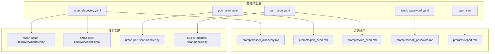
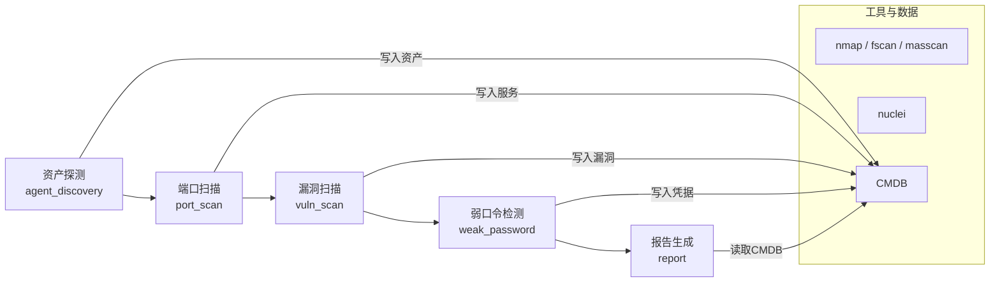
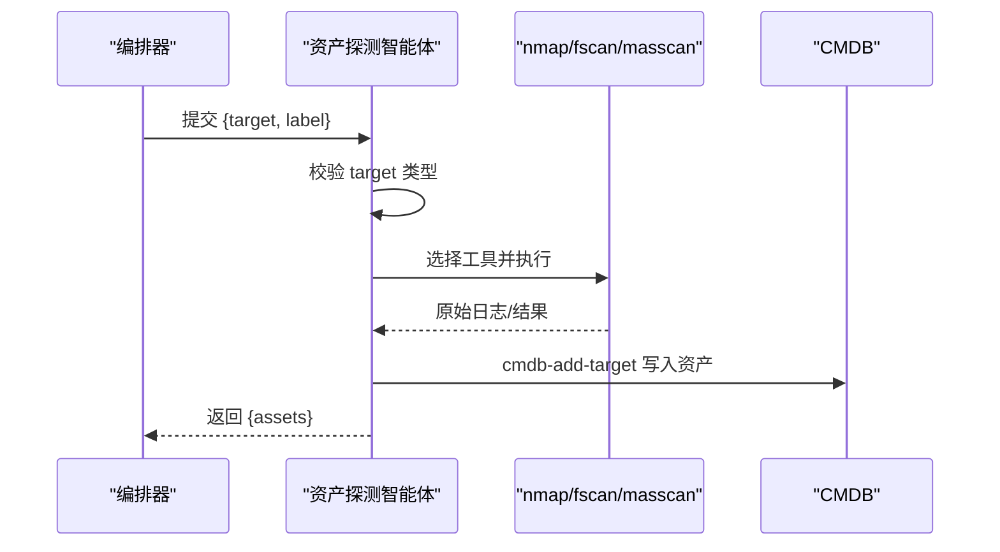
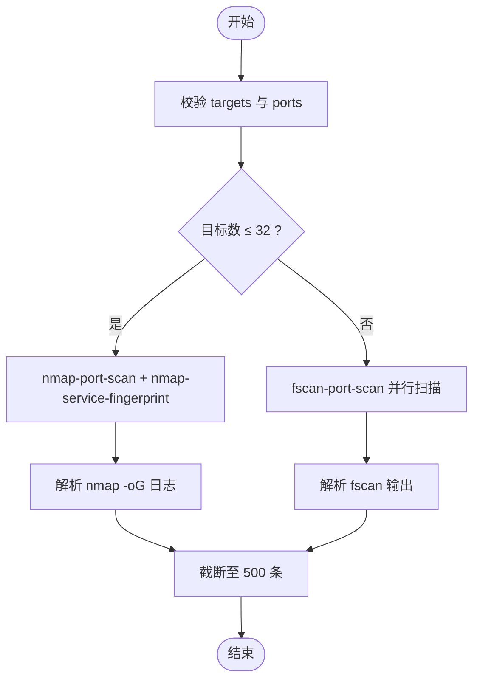
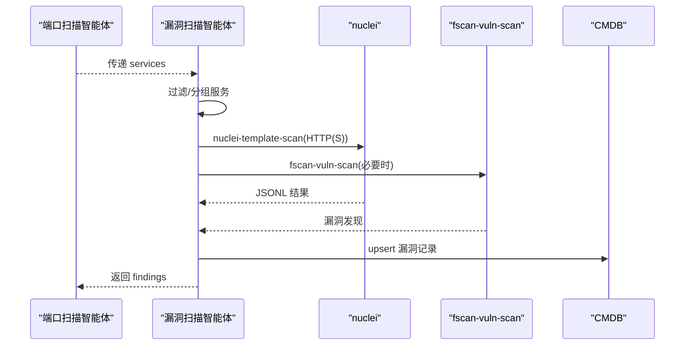
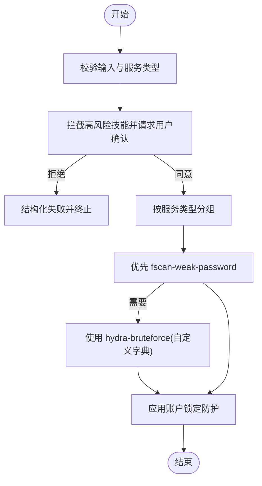
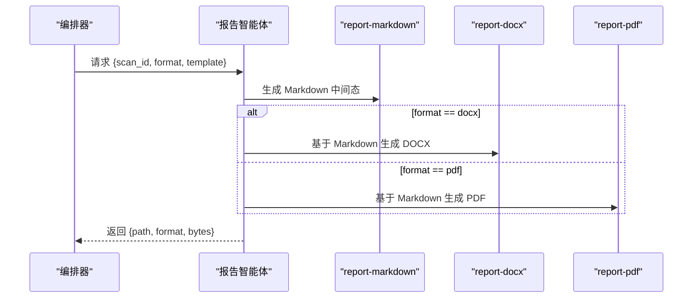
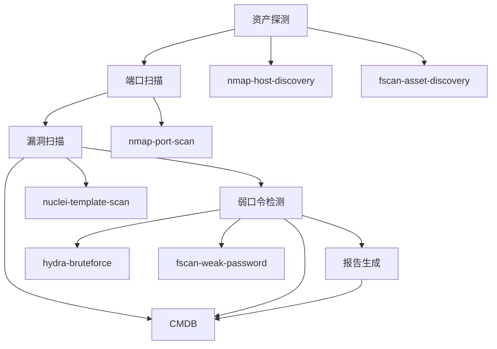

# 内置专家智能体

<cite>
**本文引用的文件**
- [secbot/agents/asset_discovery.yaml](file://secbot/agents/asset_discovery.yaml)
- [secbot/agents/port_scan.yaml](file://secbot/agents/port_scan.yaml)
- [secbot/agents/vuln_scan.yaml](file://secbot/agents/vuln_scan.yaml)
- [secbot/agents/weak_password.yaml](file://secbot/agents/weak_password.yaml)
- [secbot/agents/report.yaml](file://secbot/agents/report.yaml)
- [secbot/agents/prompts/asset_discovery.md](file://secbot/agents/prompts/asset_discovery.md)
- [secbot/agents/prompts/port_scan.md](file://secbot/agents/prompts/port_scan.md)
- [secbot/agents/prompts/vuln_scan.md](file://secbot/agents/prompts/vuln_scan.md)
- [secbot/agents/prompts/weak_password.md](file://secbot/agents/prompts/weak_password.md)
- [secbot/agents/prompts/report.md](file://secbot/agents/prompts/report.md)
- [secbot/skills/fscan-asset-discovery/handler.py](file://secbot/skills/fscan-asset-discovery/handler.py)
- [secbot/skills/nmap-host-discovery/handler.py](file://secbot/skills/nmap-host-discovery/handler.py)
- [secbot/skills/nmap-port-scan/handler.py](file://secbot/skills/nmap-port-scan/handler.py)
- [secbot/skills/nuclei-template-scan/handler.py](file://secbot/skills/nuclei-template-scan/handler.py)
</cite>

## 目录
1. [简介](#简介)
2. [项目结构](#项目结构)
3. [核心组件](#核心组件)
4. [架构总览](#架构总览)
5. [详细组件分析](#详细组件分析)
6. [依赖关系分析](#依赖关系分析)
7. [性能考量](#性能考量)
8. [故障排查指南](#故障排查指南)
9. [结论](#结论)
10. [附录](#附录)

## 简介
本文件系统性介绍 VAPT3/secbot 的五个内置“专家智能体”，覆盖从资产发现、端口与服务识别、漏洞扫描、弱口令检测到报告生成的完整安全评估闭环。每个智能体均定义了明确的输入输出模式、可选的底层工具链、执行流程与适用场景，并给出扩展新智能体的指导原则与最佳实践，帮助读者快速理解并安全地定制化使用。

## 项目结构
五个专家智能体由独立的 YAML 配置文件定义，包含名称、显示名、描述、系统提示文件、可用技能集合、最大迭代次数、输入/输出模式等；配套的系统提示文件定义了工具使用规则、流程步骤与输出约束；底层工具通过技能（skill）实现，如 nmap、fscan、nuclei 等，以 handler.py 执行并解析结果。

图示来源
- [secbot/agents/asset_discovery.yaml:1-46](file://secbot/agents/asset_discovery.yaml#L1-L46)
- [secbot/agents/port_scan.yaml:1-50](file://secbot/agents/port_scan.yaml#L1-L50)
- [secbot/agents/vuln_scan.yaml:1-53](file://secbot/agents/vuln_scan.yaml#L1-L53)
- [secbot/agents/weak_password.yaml:1-53](file://secbot/agents/weak_password.yaml#L1-L53)
- [secbot/agents/report.yaml:1-39](file://secbot/agents/report.yaml#L1-L39)
- [secbot/agents/prompts/asset_discovery.md:1-28](file://secbot/agents/prompts/asset_discovery.md#L1-L28)
- [secbot/agents/prompts/port_scan.md:1-24](file://secbot/agents/prompts/port_scan.md#L1-L24)
- [secbot/agents/prompts/vuln_scan.md:1-24](file://secbot/agents/prompts/vuln_scan.md#L1-L24)
- [secbot/agents/prompts/weak_password.md:1-28](file://secbot/agents/prompts/weak_password.md#L1-L28)
- [secbot/agents/prompts/report.md:1-19](file://secbot/agents/prompts/report.md#L1-L19)
- [secbot/skills/fscan-asset-discovery/handler.py:1-36](file://secbot/skills/fscan-asset-discovery/handler.py#L1-L36)
- [secbot/skills/nmap-host-discovery/handler.py:1-81](file://secbot/skills/nmap-host-discovery/handler.py#L1-L81)
- [secbot/skills/nmap-port-scan/handler.py:1-48](file://secbot/skills/nmap-port-scan/handler.py#L1-L48)
- [secbot/skills/nuclei-template-scan/handler.py:1-154](file://secbot/skills/nuclei-template-scan/handler.py#L1-L154)

章节来源
- [secbot/agents/asset_discovery.yaml:1-46](file://secbot/agents/asset_discovery.yaml#L1-L46)
- [secbot/agents/port_scan.yaml:1-50](file://secbot/agents/port_scan.yaml#L1-L50)
- [secbot/agents/vuln_scan.yaml:1-53](file://secbot/agents/vuln_scan.yaml#L1-L53)
- [secbot/agents/weak_password.yaml:1-53](file://secbot/agents/weak_password.yaml#L1-L53)
- [secbot/agents/report.yaml:1-39](file://secbot/agents/report.yaml#L1-L39)

## 核心组件
- 资产探测（agent_discovery）
  - 功能要点：对目标（CIDR/IP/域名）进行存活扫描与网段探测，产出资产清单并写入本地 CMDB；支持历史查询与增量记录。
  - 输入：target（必填）、label（可选）。
  - 输出：assets 数组，包含 target、kind（cidr/ip/domain）、label。
  - 底层工具：nmap-host-discovery、fscan-asset-discovery、masscan-discovery；CMDB 辅助：cmdb-add-target、cmdb-list-assets、cmdb-history-query。
  - 场景：作为后续端口扫描与漏洞扫描的前置步骤，确保目标范围稳定且可审计。
  
- 端口扫描（port_scan）
  - 功能要点：枚举主机开放端口并识别服务与 banner；支持按目标规模选择不同工具策略。
  - 输入：targets（必填，列表）、ports（可选，默认 top-1000）、rate（slow/normal/fast）。
  - 输出：services 数组，包含 host、port、protocol（tcp/udp）、service、version。
  - 底层工具：nmap-port-scan、nmap-service-fingerprint、fscan-port-scan。
  - 场景：在资产发现后，对候选主机进行端口与服务识别，为漏洞扫描与弱口令检测提供基础数据。
  
- 漏洞扫描（vuln_scan）
  - 功能要点：基于模板（nuclei）与指纹（fscan）进行漏洞扫描，按严重度阈值过滤并写入 CMDB。
  - 输入：services（必填，列表，含 host/port/protocol/service）、severity_floor（info/low/medium/high/critical）。
  - 输出：findings 数组，包含 host、port、severity、title、cve_id、template。
  - 底层工具：nuclei-template-scan、fscan-vuln-scan。
  - 场景：对已识别的服务进行漏洞检测，形成可追溯的漏洞清单。
  
- 弱口令检测（weak_password）
  - 功能要点：针对认证类服务（SSH/FTP/RDP/数据库等）进行弱口令或默认凭证检测；所有技能均为高风险，需用户确认。
  - 输入：services（必填，列表，含 host/port/service）、user_list/pass_list（可选）。
  - 输出：findings 数组，包含 host、port、service、username、password。
  - 底层工具：hydra-bruteforce、fscan-weak-password。
  - 场景：在获得认证服务信息后，进行弱口令验证，注意账户锁定与合规审批。
  
- 报告生成（report）
  - 功能要点：从 CMDB 数据渲染交付报告，优先生成 Markdown 中间态，再派生 DOCX/PDF。
  - 输入：scan_id（必填，ULID）、format（markdown/pdf/docx）、template（可选）。
  - 输出：path、format、bytes。
  - 底层工具：report-markdown、report-pdf、report-docx。
  - 场景：将扫描结果标准化输出，便于归档与审阅。

章节来源
- [secbot/agents/asset_discovery.yaml:1-46](file://secbot/agents/asset_discovery.yaml#L1-L46)
- [secbot/agents/port_scan.yaml:1-50](file://secbot/agents/port_scan.yaml#L1-L50)
- [secbot/agents/vuln_scan.yaml:1-53](file://secbot/agents/vuln_scan.yaml#L1-L53)
- [secbot/agents/weak_password.yaml:1-53](file://secbot/agents/weak_password.yaml#L1-L53)
- [secbot/agents/report.yaml:1-39](file://secbot/agents/report.yaml#L1-L39)

## 架构总览
五个智能体构成一条自上而下的安全评估流水线：资产探测 → 端口扫描 → 漏洞扫描 → 弱口令检测 → 报告生成。每个智能体通过系统提示文件约束工具调用与流程步骤，输出结构化数据供下游使用；CMDB 作为统一数据源贯穿全链路。

图示来源
- [secbot/agents/asset_discovery.yaml:1-46](file://secbot/agents/asset_discovery.yaml#L1-L46)
- [secbot/agents/port_scan.yaml:1-50](file://secbot/agents/port_scan.yaml#L1-L50)
- [secbot/agents/vuln_scan.yaml:1-53](file://secbot/agents/vuln_scan.yaml#L1-L53)
- [secbot/agents/weak_password.yaml:1-53](file://secbot/agents/weak_password.yaml#L1-L53)
- [secbot/agents/report.yaml:1-39](file://secbot/agents/report.yaml#L1-L39)

## 详细组件分析

### 资产探测（agent_discovery）分析
- 执行流程
  - 输入校验：target 类型（CIDR/IP/域名）合法性检查。
  - 工具选择：根据目标规模选择 nmap-host-discovery（/24 或更小）、masscan-discovery（大范围）、fscan-asset-discovery（混合场景）。
  - 结果处理：解析存活主机，调用 cmdb-add-target 记录资产，限制返回数量并分页。
- 关键输入输出
  - 输入：target（必填）、label（可选）。
  - 输出：assets 数组，每项含 target、kind、label。
- 底层工具与实现
  - nmap-host-discovery：通过 nmap -sn 扫描存活主机，解析文本日志提取主机列表。
  - fscan-asset-discovery：调用 fscan 扫描并解析“Target ... is alive”模式。
  - CMDB 辅助：cmdb-add-target、cmdb-list-assets、cmdb-history-query。
- 安全与合规
  - 对速率与超时有严格控制，避免过度扫描。
  - 返回列表上限与分页机制，降低一次性输出压力。

图示来源
- [secbot/agents/asset_discovery.yaml:1-46](file://secbot/agents/asset_discovery.yaml#L1-L46)
- [secbot/agents/prompts/asset_discovery.md:1-28](file://secbot/agents/prompts/asset_discovery.md#L1-L28)
- [secbot/skills/nmap-host-discovery/handler.py:1-81](file://secbot/skills/nmap-host-discovery/handler.py#L1-L81)
- [secbot/skills/fscan-asset-discovery/handler.py:1-36](file://secbot/skills/fscan-asset-discovery/handler.py#L1-L36)

章节来源
- [secbot/agents/asset_discovery.yaml:1-46](file://secbot/agents/asset_discovery.yaml#L1-L46)
- [secbot/agents/prompts/asset_discovery.md:1-28](file://secbot/agents/prompts/asset_discovery.md#L1-L28)
- [secbot/skills/nmap-host-discovery/handler.py:1-81](file://secbot/skills/nmap-host-discovery/handler.py#L1-L81)
- [secbot/skills/fscan-asset-discovery/handler.py:1-36](file://secbot/skills/fscan-asset-discovery/handler.py#L1-L36)

### 端口扫描（port_scan）分析
- 执行流程
  - 输入：targets 列表、ports 规范（默认 top-1000）、rate（slow/normal/fast）。
  - 工具选择：小目标集（≤32）先 nmap-port-scan 再 nmap-service-fingerprint；大目标集直接 fscan-port-scan。
  - 速率控制：slow→-T2，normal→-T3，fast→-T4。
- 关键输入输出
  - 输入：targets（≥1）、ports（可选）、rate（可选）。
  - 输出：services 数组，含 host、port、protocol、service、version。
- 底层工具与实现
  - nmap-port-scan：解析 nmap -oG 文本日志，抽取主机与开放端口信息。
  - nmap-service-fingerprint：对开放端口进行服务指纹识别。
  - fscan-port-scan：并行扫描，适合大规模目标。
- 性能与限制
  - 输出上限 500 条，原始日志保存在扫描目录供编排器参考。

图示来源
- [secbot/agents/port_scan.yaml:1-50](file://secbot/agents/port_scan.yaml#L1-L50)
- [secbot/agents/prompts/port_scan.md:1-24](file://secbot/agents/prompts/port_scan.md#L1-L24)
- [secbot/skills/nmap-port-scan/handler.py:1-48](file://secbot/skills/nmap-port-scan/handler.py#L1-L48)

章节来源
- [secbot/agents/port_scan.yaml:1-50](file://secbot/agents/port_scan.yaml#L1-L50)
- [secbot/agents/prompts/port_scan.md:1-24](file://secbot/agents/prompts/port_scan.md#L1-L24)
- [secbot/skills/nmap-port-scan/handler.py:1-48](file://secbot/skills/nmap-port-scan/handler.py#L1-L48)

### 漏洞扫描（vuln_scan）分析
- 执行流程
  - 过滤：仅对 HTTP/HTTPS 或易受攻击协议进行扫描，跳过无模板覆盖的原始 TCP banner。
  - 工具策略：默认 nuclei-template-scan（HTTP(S)），当服务列表包含 nuclei 覆盖不足的协议时叠加 fscan-vuln-scan。
  - 严重度：按 severity_floor（默认 medium）过滤，避免噪声。
  - 数据持久化：通过 CMDB 技能写入漏洞记录，不直接在该智能体内写库。
- 关键输入输出
  - 输入：services（≥1）、severity_floor（可选）。
  - 输出：findings 数组，含 host、port、severity、title、cve_id、template。
- 底层工具与实现
  - nuclei-template-scan：读取目标列表，调用 nuclei -jsonl 输出，解析 JSONL 并生成 CMDB 写入指令。
- 安全与合规
  - 严格的目标与标签校验，防止注入与越权。
  - 超时与取消处理，保证稳定性。

图示来源
- [secbot/agents/vuln_scan.yaml:1-53](file://secbot/agents/vuln_scan.yaml#L1-L53)
- [secbot/agents/prompts/vuln_scan.md:1-24](file://secbot/agents/prompts/vuln_scan.md#L1-L24)
- [secbot/skills/nuclei-template-scan/handler.py:1-154](file://secbot/skills/nuclei-template-scan/handler.py#L1-L154)

章节来源
- [secbot/agents/vuln_scan.yaml:1-53](file://secbot/agents/vuln_scan.yaml#L1-L53)
- [secbot/agents/prompts/vuln_scan.md:1-24](file://secbot/agents/prompts/vuln_scan.md#L1-L24)
- [secbot/skills/nuclei-template-scan/handler.py:1-154](file://secbot/skills/nuclei-template-scan/handler.py#L1-L154)

### 弱口令检测（weak_password）分析
- 执行流程
  - 风险控制：所有技能均为高风险，每次调用前需用户确认；拒绝后必须结构化失败，不得重试或改换其他同目标的技能。
  - 作用域限制：仅对输入中显式列出的服务进行检测，不得扩大范围。
  - 工具策略：优先 fscan-weak-password（内置字典，更安全）；当用户提供自定义字典时才使用 hydra-bruteforce。
- 关键输入输出
  - 输入：services（≥1，含 host/port/service）、user_list/pass_list（可选）。
  - 输出：findings 数组，含 host、port、service、username、password。
- 安全与合规
  - 默认锁停策略：单主机连续被拒 3 次即停止，避免账户锁定。
  - 在标记为 redacted 的通道中，LLM 可见摘要不得包含密码明文。

图示来源
- [secbot/agents/weak_password.yaml:1-53](file://secbot/agents/weak_password.yaml#L1-L53)
- [secbot/agents/prompts/weak_password.md:1-28](file://secbot/agents/prompts/weak_password.md#L1-L28)

章节来源
- [secbot/agents/weak_password.yaml:1-53](file://secbot/agents/weak_password.yaml#L1-L53)
- [secbot/agents/prompts/weak_password.md:1-28](file://secbot/agents/prompts/weak_password.md#L1-L28)

### 报告生成（report）分析
- 执行流程
  - 原则：始终先生成 Markdown 中间态，再派生 DOCX/PDF，避免重复查询 CMDB。
  - 逻辑：format=markdown 直接返回；format=docx 调用 report-docx；format=pdf 调用 report-pdf。
- 关键输入输出
  - 输入：scan_id（ULID）、format（markdown/pdf/docx）、template（可选）。
  - 输出：path、format、bytes。
- 数据来源
  - 从 CMDB 读取扫描结果，保证报告一致性与可追溯性。

图示来源
- [secbot/agents/report.yaml:1-39](file://secbot/agents/report.yaml#L1-L39)
- [secbot/agents/prompts/report.md:1-19](file://secbot/agents/prompts/report.md#L1-L19)

章节来源
- [secbot/agents/report.yaml:1-39](file://secbot/agents/report.yaml#L1-L39)
- [secbot/agents/prompts/report.md:1-19](file://secbot/agents/prompts/report.md#L1-L19)

## 依赖关系分析
- 智能体间依赖
  - 资产探测 → 端口扫描：前者产出资产清单，后者消费 targets。
  - 端口扫描 → 漏洞扫描：后者消费 services。
  - 漏洞扫描 → 弱口令检测：后者消费认证类服务。
  - 弱口令检测 → 报告生成：最终汇总输出。
- 工具与技能依赖
  - nmap：host-discovery、port-scan、service-fingerprint。
  - fscan：asset-discovery、port-scan、vuln-scan、weak-password。
  - nuclei：template-scan。
  - CMDB：统一数据写入与查询。
- 编排与日志
  - 各技能均生成原始日志文件，便于问题定位与审计。

图示来源
- [secbot/agents/asset_discovery.yaml:1-46](file://secbot/agents/asset_discovery.yaml#L1-L46)
- [secbot/agents/port_scan.yaml:1-50](file://secbot/agents/port_scan.yaml#L1-L50)
- [secbot/agents/vuln_scan.yaml:1-53](file://secbot/agents/vuln_scan.yaml#L1-L53)
- [secbot/agents/weak_password.yaml:1-53](file://secbot/agents/weak_password.yaml#L1-L53)
- [secbot/agents/report.yaml:1-39](file://secbot/agents/report.yaml#L1-L39)
- [secbot/skills/nmap-host-discovery/handler.py:1-81](file://secbot/skills/nmap-host-discovery/handler.py#L1-L81)
- [secbot/skills/fscan-asset-discovery/handler.py:1-36](file://secbot/skills/fscan-asset-discovery/handler.py#L1-L36)
- [secbot/skills/nmap-port-scan/handler.py:1-48](file://secbot/skills/nmap-port-scan/handler.py#L1-L48)
- [secbot/skills/nuclei-template-scan/handler.py:1-154](file://secbot/skills/nuclei-template-scan/handler.py#L1-L154)

章节来源
- [secbot/agents/asset_discovery.yaml:1-46](file://secbot/agents/asset_discovery.yaml#L1-L46)
- [secbot/agents/port_scan.yaml:1-50](file://secbot/agents/port_scan.yaml#L1-L50)
- [secbot/agents/vuln_scan.yaml:1-53](file://secbot/agents/vuln_scan.yaml#L1-L53)
- [secbot/agents/weak_password.yaml:1-53](file://secbot/agents/weak_password.yaml#L1-L53)
- [secbot/agents/report.yaml:1-39](file://secbot/agents/report.yaml#L1-L39)

## 性能考量
- 资产探测
  - 大范围目标采用 masscan 或 fscan，提升速度；小范围使用 nmap 获取更准确的存活信息。
  - 返回与日志容量限制，避免内存与 I/O 压力。
- 端口扫描
  - 小目标集走 nmap + service-fingerprint，大目标集走 fscan 并行扫描，兼顾精度与吞吐。
  - 速率参数控制扫描强度，避免触发防火墙或被阻断。
- 漏洞扫描
  - 严格的目标与标签校验，减少无效请求。
  - JSONL 解析与 CMDB 写入分离，降低单次峰值负载。
- 弱口令检测
  - 用户确认与锁停策略降低误操作风险与账户锁定概率。
- 报告生成
  - 先生成 Markdown 中间态，再派生 DOCX/PDF，避免重复查询 CMDB。

## 故障排查指南
- 常见错误与定位
  - 工具缺失：技能抛出二进制缺失异常，检查系统 PATH 与安装状态。
  - 超时/取消：技能捕获超时与取消事件，返回结构化摘要与原始日志路径，便于复盘。
  - 参数非法：目标格式不匹配、速率不在允许集合、端口规范错误等，均会触发参数校验异常。
  - 退出码非零：若无有效结果，summary 中包含 exit 错误码，结合原始日志分析。
- 建议排查步骤
  - 查看原始日志文件（如 nmap-host-discovery.log、nuclei.jsonl）。
  - 核对输入参数是否满足 schema 与正则约束。
  - 检查网络策略与沙箱权限设置。
  - 对高风险技能，确认用户确认流程是否被正确拦截与反馈。

章节来源
- [secbot/skills/nmap-host-discovery/handler.py:1-81](file://secbot/skills/nmap-host-discovery/handler.py#L1-L81)
- [secbot/skills/nmap-port-scan/handler.py:1-48](file://secbot/skills/nmap-port-scan/handler.py#L1-L48)
- [secbot/skills/nuclei-template-scan/handler.py:1-154](file://secbot/skills/nuclei-template-scan/handler.py#L1-L154)

## 结论
五个内置专家智能体以清晰的职责边界与严格的工具约束，构建了从资产发现到报告交付的自动化安全评估流水线。通过 CMDB 统一数据源与结构化输出，既保证了可审计性，也便于扩展与集成。建议在生产环境中遵循参数校验、速率控制与用户确认等最佳实践，确保扫描行为可控、可追溯。

## 附录
- 扩展新智能体的指导原则与最佳实践
  - 明确职责与边界：每个智能体聚焦单一阶段或领域，避免“大杂烩”。
  - 设计稳定的输入输出模式：遵循现有 schema，保持字段一致与可扩展。
  - 工具选择与封装：优先使用已有技能（nmap/fscan/nuclei），必要时新增 handler 并实现解析器。
  - 安全与合规：对高风险操作引入用户确认与锁停策略；避免在可见摘要中泄露敏感信息。
  - 可观测性：保留原始日志文件，提供结构化摘要与错误码，便于排障。
  - 流程约束：通过系统提示文件固化流程步骤与工具使用规则，减少歧义。
  - 数据一致性：通过 CMDB 写入与查询，确保跨智能体数据共享与审计。