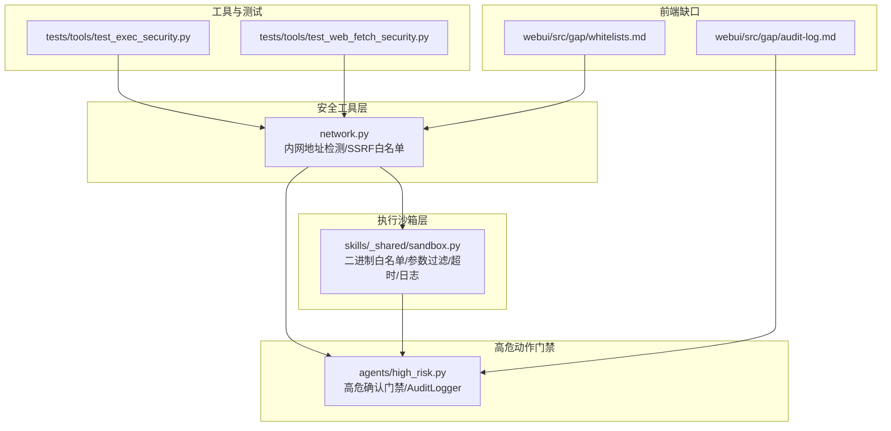
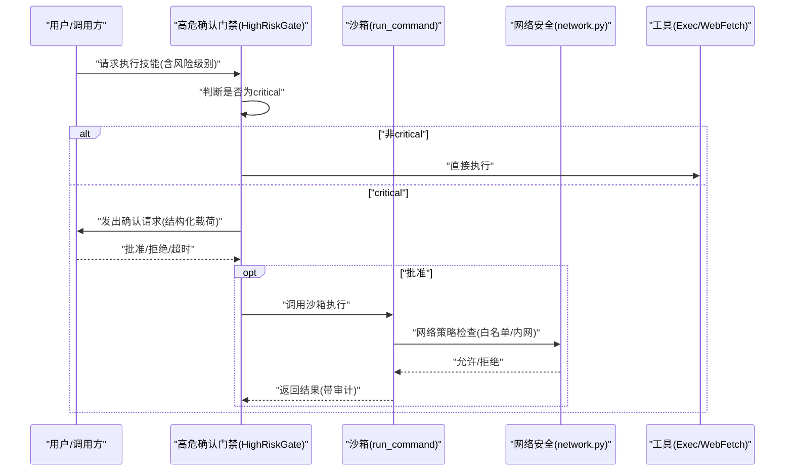
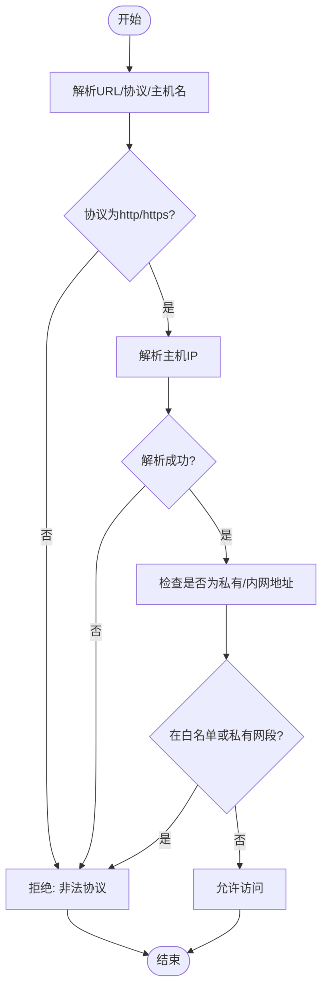
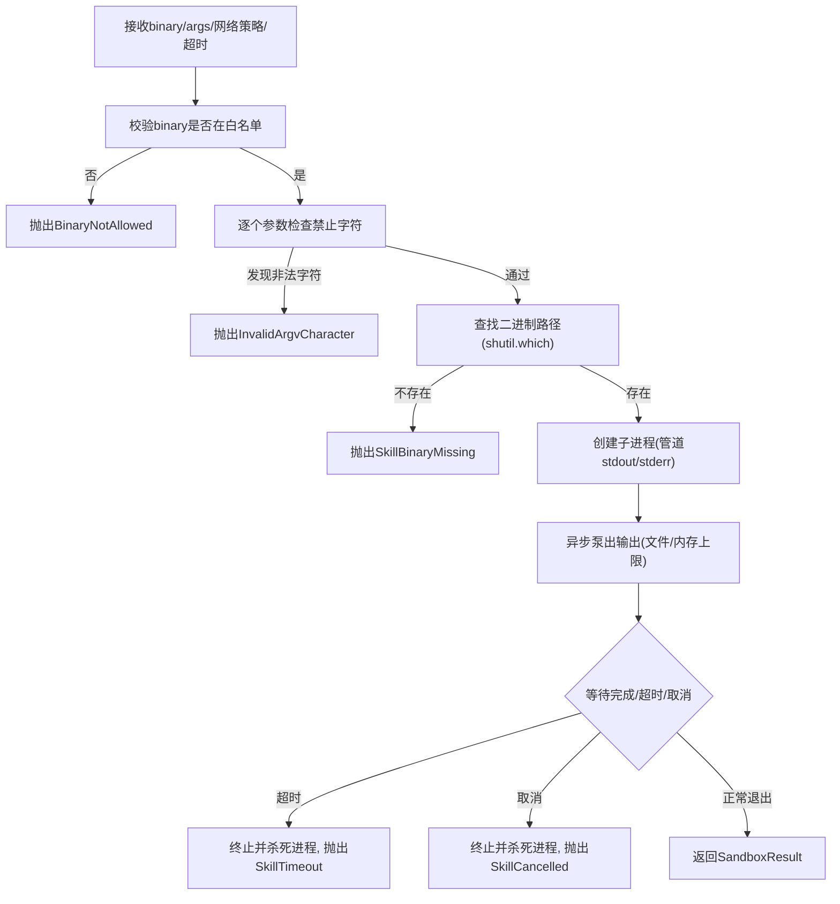
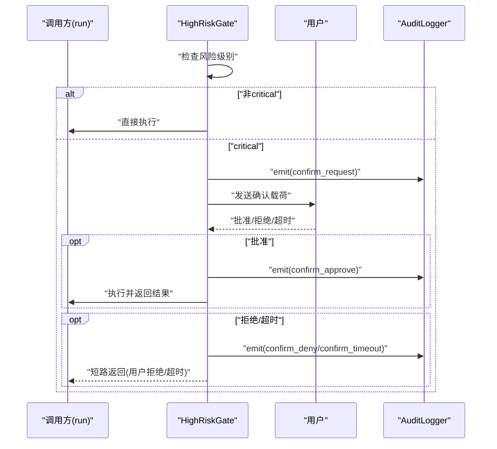
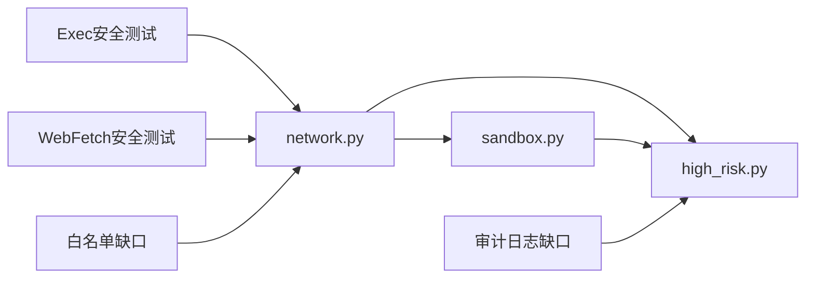

# 安全与合规

<cite>
**本文引用的文件**
- [secbot/security/network.py](file://secbot/security/network.py)
- [secbot/skills/_shared/sandbox.py](file://secbot/skills/_shared/sandbox.py)
- [secbot/agents/high_risk.py](file://secbot/agents/high_risk.py)
- [tests/security/test_sandbox.py](file://tests/security/test_sandbox.py)
- [tests/agent/test_high_risk_gate.py](file://tests/agent/test_high_risk_gate.py)
- [tests/tools/test_exec_security.py](file://tests/tools/test_exec_security.py)
- [tests/tools/test_web_fetch_security.py](file://tests/tools/test_web_fetch_security.py)
- [webui/src/gap/audit-log.md](file://webui/src/gap/audit-log.md)
- [webui/src/gap/whitelists.md](file://webui/src/gap/whitelists.md)
- [tests/config/test_config_migration.py](file://tests/config/test_config_migration.py)
- [secbot/templates/agent/platform_policy.md](file://secbot/templates/agent/platform_policy.md)
- [secbot/templates/agent/skills_section.md](file://secbot/templates/agent/skills_section.md)
</cite>

## 目录
1. [引言](#引言)
2. [项目结构](#项目结构)
3. [核心组件](#核心组件)
4. [架构总览](#架构总览)
5. [详细组件分析](#详细组件分析)
6. [依赖分析](#依赖分析)
7. [性能考虑](#性能考虑)
8. [故障排查指南](#故障排查指南)
9. [结论](#结论)
10. [附录](#附录)

## 引言
本文件面向VAPT3/secbot项目使用者与运维人员，系统性阐述项目在安全与合规方面的设计与实现，重点覆盖以下方面：
- 授权前置的合规要求：通过“高危动作护栏”的人工确认流程，确保关键操作必须经由明确的用户授权。
- 权限沙箱的命令注入防护：基于二进制白名单、参数字符过滤、超时与资源限制等手段，阻断命令注入与越权执行。
- 网络访问控制：通过SSRF白名单与内网地址检测，阻止对内网/元数据服务的访问。
- 审计日志的全流程记录：以结构化事件形式记录确认请求、批准/拒绝/超时等关键动作，支撑可追溯与合规审计。
- 法律合规与使用前提：强调项目使用需遵循的法律与组织政策，帮助建立正确的安全使用意识。

## 项目结构
围绕安全与合规的关键目录与文件如下：
- 安全工具层：网络访问控制与URL解析校验
- 执行沙箱层：命令执行的白名单与参数校验
- 高危动作门禁：人工确认与审计
- 工具与测试：针对Exec/WebFetch的SSRF与工作区保护
- 前端缺口：审计日志与白名单管理的API规划
- 平台策略与技能说明：平台差异与技能可用性提示

图表来源
- [secbot/security/network.py:1-120](file://secbot/security/network.py#L1-L120)
- [secbot/skills/_shared/sandbox.py:1-192](file://secbot/skills/_shared/sandbox.py#L1-L192)
- [secbot/agents/high_risk.py:1-139](file://secbot/agents/high_risk.py#L1-L139)
- [tests/tools/test_exec_security.py:1-246](file://tests/tools/test_exec_security.py#L1-L246)
- [tests/tools/test_web_fetch_security.py:1-176](file://tests/tools/test_web_fetch_security.py#L1-L176)
- [webui/src/gap/audit-log.md:1-29](file://webui/src/gap/audit-log.md#L1-L29)
- [webui/src/gap/whitelists.md:1-28](file://webui/src/gap/whitelists.md#L1-L28)

章节来源
- [secbot/security/network.py:1-120](file://secbot/security/network.py#L1-L120)
- [secbot/skills/_shared/sandbox.py:1-192](file://secbot/skills/_shared/sandbox.py#L1-L192)
- [secbot/agents/high_risk.py:1-139](file://secbot/agents/high_risk.py#L1-L139)
- [tests/tools/test_exec_security.py:1-246](file://tests/tools/test_exec_security.py#L1-L246)
- [tests/tools/test_web_fetch_security.py:1-176](file://tests/tools/test_web_fetch_security.py#L1-L176)
- [webui/src/gap/audit-log.md:1-29](file://webui/src/gap/audit-log.md#L1-L29)
- [webui/src/gap/whitelists.md:1-28](file://webui/src/gap/whitelists.md#L1-L28)

## 核心组件
- 网络安全模块：负责URL目标校验、内网地址拦截与SSRF白名单配置，避免对私有/元数据地址的访问。
- 执行沙箱：统一的命令执行入口，强制二进制白名单、禁止危险字符、超时与内存限制、输出捕获与日志落盘。
- 高危确认门禁：对风险等级为“critical”的技能调用进行前置人工确认，并记录结构化审计事件。
- 工具安全测试：验证Exec/WebFetch对内网地址、工作区越界、历史文件写入等场景的防护。
- 前端缺口：规划审计日志查询与白名单管理的后端接口与前端页面。

章节来源
- [secbot/security/network.py:1-120](file://secbot/security/network.py#L1-L120)
- [secbot/skills/_shared/sandbox.py:1-192](file://secbot/skills/_shared/sandbox.py#L1-L192)
- [secbot/agents/high_risk.py:1-139](file://secbot/agents/high_risk.py#L1-L139)
- [tests/tools/test_exec_security.py:1-246](file://tests/tools/test_exec_security.py#L1-L246)
- [tests/tools/test_web_fetch_security.py:1-176](file://tests/tools/test_web_fetch_security.py#L1-L176)
- [webui/src/gap/audit-log.md:1-29](file://webui/src/gap/audit-log.md#L1-L29)
- [webui/src/gap/whitelists.md:1-28](file://webui/src/gap/whitelists.md#L1-L28)

## 架构总览
下图展示从用户输入到最终执行的关键路径，以及各安全组件的协作关系：

图表来源
- [secbot/agents/high_risk.py:93-139](file://secbot/agents/high_risk.py#L93-L139)
- [secbot/skills/_shared/sandbox.py:70-192](file://secbot/skills/_shared/sandbox.py#L70-L192)
- [secbot/security/network.py:45-120](file://secbot/security/network.py#L45-L120)
- [tests/agent/test_high_risk_gate.py:61-97](file://tests/agent/test_high_risk_gate.py#L61-L97)
- [tests/tools/test_exec_security.py:26-71](file://tests/tools/test_exec_security.py#L26-L71)
- [tests/tools/test_web_fetch_security.py:23-42](file://tests/tools/test_web_fetch_security.py#L23-L42)

## 详细组件分析

### 组件A：网络安全与SSRF防护
- 技术原理
  - URL目标校验：限定协议为http/https，解析主机名并解析IP，若解析到私有/内网地址则拒绝；支持通过SSRF白名单CIDR绕过特定可信网段。
  - 内部URL检测：在命令字符串中提取URL并逐一校验，防止链式命令中的内联内网地址。
  - 白名单配置：运行时可动态加载CIDR白名单，用于允许如Tailscale等特定内网网段。
- 关键实现位置
  - URL解析与IP判定：[validate_url_target:45-77](file://secbot/security/network.py#L45-L77)、[validate_resolved_url:80-109](file://secbot/security/network.py#L80-L109)
  - 私有地址判定与白名单：[configure_ssrf_whitelist:29-36](file://secbot/security/network.py#L29-L36)、[contains_internal_url:112-119](file://secbot/security/network.py#L112-L119)
- 配置方法
  - 在配置加载后调用白名单配置函数，传入允许的CIDR列表。
  - 配置迁移测试表明：当新配置为空时会重置白名单，确保安全基线一致。
- 测试验证
  - 对内网地址、localhost、元数据服务的访问被阻断；对公网地址放行；链式命令中的内网地址同样被拦截。
  - 配置迁移测试覆盖白名单重置逻辑。

图表来源
- [secbot/security/network.py:45-109](file://secbot/security/network.py#L45-L109)
- [tests/tools/test_web_fetch_security.py:23-42](file://tests/tools/test_web_fetch_security.py#L23-L42)
- [tests/tools/test_exec_security.py:26-71](file://tests/tools/test_exec_security.py#L26-L71)
- [tests/config/test_config_migration.py:208-225](file://tests/config/test_config_migration.py#L208-L225)

章节来源
- [secbot/security/network.py:1-120](file://secbot/security/network.py#L1-L120)
- [tests/tools/test_web_fetch_security.py:1-176](file://tests/tools/test_web_fetch_security.py#L1-L176)
- [tests/tools/test_exec_security.py:1-246](file://tests/tools/test_exec_security.py#L1-L246)
- [tests/config/test_config_migration.py:208-225](file://tests/config/test_config_migration.py#L208-L225)

### 组件B：权限沙箱与命令注入防护
- 技术原理
  - 二进制白名单：仅允许预置的工具二进制执行，其他二进制一律拒绝。
  - 参数字符过滤：严格禁止包含危险字符的参数，阻断命令注入。
  - 超时与取消：统一的超时与取消令牌机制，避免长时间占用与僵尸进程。
  - 输出捕获与日志：可选文件落盘或内存上限捕获，便于审计与问题定位。
- 关键实现位置
  - 白名单与禁止字符定义：[BINARY_WHITELIST:23-32](file://secbot/skills/_shared/sandbox.py#L23-L32)、[FORBIDDEN_CHARS](file://secbot/skills/_shared/sandbox.py#L35)
  - 参数校验与执行流程：[_check_argv:59-67](file://secbot/skills/_shared/sandbox.py#L59-L67)、[run_command:70-192](file://secbot/skills/_shared/sandbox.py#L70-L192)
- 配置方法
  - 在调用前确保所需二进制存在于PATH且在白名单中；根据需要设置超时、捕获模式与日志路径。
- 测试验证
  - 非白名单二进制、包含危险字符的参数、缺失二进制、零/负超时、未提供日志路径等均触发相应异常。
  - 进程超时与取消令牌能正确终止子进程。

图表来源
- [secbot/skills/_shared/sandbox.py:59-192](file://secbot/skills/_shared/sandbox.py#L59-L192)
- [tests/security/test_sandbox.py:26-153](file://tests/security/test_sandbox.py#L26-L153)

章节来源
- [secbot/skills/_shared/sandbox.py:1-192](file://secbot/skills/_shared/sandbox.py#L1-L192)
- [tests/security/test_sandbox.py:1-153](file://tests/security/test_sandbox.py#L1-L153)

### 组件C：高危动作护栏与人工确认流程
- 技术原理
  - 风险识别：依据技能元数据的风险级别，对critical级别的技能执行前置确认。
  - 结构化确认载荷：构建包含技能名、风险级别、参数、估计时长等信息的确认消息。
  - 审计记录：记录“请求/批准/拒绝/超时”四类动作，形成可审计的事件序列。
  - 超时控制：默认超时窗口保障交互及时性，超时即视为拒绝。
- 关键实现位置
  - 确认载荷构建：[build_confirmation_payload:65-86](file://secbot/agents/high_risk.py#L65-L86)
  - 门禁逻辑与审计：[HighRiskGate.guard:103-139](file://secbot/agents/high_risk.py#L103-L139)、[AuditLogger.emit:40-62](file://secbot/agents/high_risk.py#L40-L62)
- 配置方法
  - 设置确认超时秒数；提供摘要生成函数以增强用户理解。
- 测试验证
  - 低风险技能直接通过；critical技能在批准后才执行，并记录审计事件；拒绝与超时路径均有明确行为与审计记录。

图表来源
- [secbot/agents/high_risk.py:65-139](file://secbot/agents/high_risk.py#L65-L139)
- [tests/agent/test_high_risk_gate.py:61-117](file://tests/agent/test_high_risk_gate.py#L61-L117)

章节来源
- [secbot/agents/high_risk.py:1-139](file://secbot/agents/high_risk.py#L1-L139)
- [tests/agent/test_high_risk_gate.py:1-141](file://tests/agent/test_high_risk_gate.py#L1-L141)

### 组件D：工具安全与工作区保护
- 技术原理
  - Exec工具：对包含内网地址的URL命令进行拦截；对history.jsonl等内部状态文件的写入进行阻断；限制工作区目录不得越界。
  - WebFetch工具：对私有IP与本地回环地址访问进行阻断；对重定向至私有地址的响应进行拦截；结果中标注外部内容属性。
- 关键实现位置
  - Exec安全测试：[test_exec_security.py:26-246](file://tests/tools/test_exec_security.py#L26-L246)
  - WebFetch安全测试：[test_web_fetch_security.py:23-176](file://tests/tools/test_web_fetch_security.py#L23-L176)
- 配置方法
  - 在工具初始化时启用工作区限制；必要时调整超时与用户代理。
- 测试验证
  - 内部URL、工作区越界、历史文件写入等场景均被阻断；公网访问与合法读取不受影响。

章节来源
- [tests/tools/test_exec_security.py:1-246](file://tests/tools/test_exec_security.py#L1-L246)
- [tests/tools/test_web_fetch_security.py:1-176](file://tests/tools/test_web_fetch_security.py#L1-L176)

### 组件E：审计日志与白名单管理（前端缺口）
- 审计日志
  - 后端缺口：计划提供审计日志查询端点与数据模型，前端规划表格布局与筛选功能。
  - 当前实现：审计记录在内存中维护，生产环境应接入持久化存储。
- 白名单管理
  - 后端缺口：计划提供白名单的增删查改端点与鉴权控制。
- 前端缺口文档
  - 审计日志：[audit-log.md:1-29](file://webui/src/gap/audit-log.md#L1-L29)
  - 白名单：[whitelists.md:1-28](file://webui/src/gap/whitelists.md#L1-L28)

章节来源
- [webui/src/gap/audit-log.md:1-29](file://webui/src/gap/audit-log.md#L1-L29)
- [webui/src/gap/whitelists.md:1-28](file://webui/src/gap/whitelists.md#L1-L28)

## 依赖分析
- 组件耦合
  - 网络安全模块独立于执行沙箱与高危门禁，但被两者共同依赖；工具层通过网络模块实现SSRF防护。
  - 高危门禁依赖审计日志模块，形成闭环的可审计性。
- 外部依赖
  - Python标准库（socket、ipaddress、shutil、asyncio等）。
  - 第三方HTTP客户端（WebFetch工具中使用）。
- 循环依赖
  - 未发现循环导入或循环依赖。

图表来源
- [secbot/security/network.py:1-120](file://secbot/security/network.py#L1-L120)
- [secbot/skills/_shared/sandbox.py:1-192](file://secbot/skills/_shared/sandbox.py#L1-L192)
- [secbot/agents/high_risk.py:1-139](file://secbot/agents/high_risk.py#L1-L139)
- [tests/tools/test_exec_security.py:1-246](file://tests/tools/test_exec_security.py#L1-L246)
- [tests/tools/test_web_fetch_security.py:1-176](file://tests/tools/test_web_fetch_security.py#L1-L176)
- [webui/src/gap/audit-log.md:1-29](file://webui/src/gap/audit-log.md#L1-L29)
- [webui/src/gap/whitelists.md:1-28](file://webui/src/gap/whitelists.md#L1-L28)

章节来源
- [secbot/security/network.py:1-120](file://secbot/security/network.py#L1-L120)
- [secbot/skills/_shared/sandbox.py:1-192](file://secbot/skills/_shared/sandbox.py#L1-L192)
- [secbot/agents/high_risk.py:1-139](file://secbot/agents/high_risk.py#L1-L139)
- [tests/tools/test_exec_security.py:1-246](file://tests/tools/test_exec_security.py#L1-L246)
- [tests/tools/test_web_fetch_security.py:1-176](file://tests/tools/test_web_fetch_security.py#L1-L176)
- [webui/src/gap/audit-log.md:1-29](file://webui/src/gap/audit-log.md#L1-L29)
- [webui/src/gap/whitelists.md:1-28](file://webui/src/gap/whitelists.md#L1-L28)

## 性能考虑
- 沙箱执行
  - 超时与取消：合理设置超时阈值，避免长时间占用；取消令牌用于主动中断长耗时任务。
  - 输出捕获：内存上限捕获适用于小量输出；大体量输出建议使用文件落盘，减少内存压力。
- 网络访问
  - DNS解析与IP判定为轻量级操作；在高并发场景下注意DNS缓存与连接池复用。
- 审计日志
  - 内存审计在单元测试中可用；生产建议采用持久化存储与异步写入，避免阻塞主流程。

## 故障排查指南
- 命令被拒绝（二进制不在白名单）
  - 现象：抛出“二进制未在白名单”错误。
  - 处理：将所需二进制加入白名单或使用允许的替代工具。
  - 参考：[BinaryNotAllowed:38-39](file://secbot/skills/_shared/sandbox.py#L38-L39)
- 参数包含非法字符
  - 现象：抛出“参数包含禁止字符”错误。
  - 处理：避免使用分号、管道、重定向等危险字符；改用安全的参数传递方式。
  - 参考：[InvalidArgvCharacter:42-43](file://secbot/skills/_shared/sandbox.py#L42-L43)
- 超时或取消
  - 现象：抛出“超时/取消”错误。
  - 处理：适当提高超时阈值；检查任务是否被外部取消。
  - 参考：[run_command:150-177](file://secbot/skills/_shared/sandbox.py#L150-L177)
- 访问被阻断（内网/私有地址）
  - 现象：返回“私有/内部地址被阻止”或“路径越界”。
  - 处理：确认目标地址合法性；如确需访问特定内网，请按白名单配置流程申请。
  - 参考：[validate_url_target:45-77](file://secbot/security/network.py#L45-L77)、[contains_internal_url:112-119](file://secbot/security/network.py#L112-L119)
- 高危确认未响应或超时
  - 现象：返回“用户拒绝/确认超时”。
  - 处理：检查确认通道与超时设置；必要时延长超时时间。
  - 参考：[HighRiskGate.guard:122-131](file://secbot/agents/high_risk.py#L122-L131)

章节来源
- [secbot/skills/_shared/sandbox.py:38-192](file://secbot/skills/_shared/sandbox.py#L38-L192)
- [secbot/security/network.py:45-120](file://secbot/security/network.py#L45-L120)
- [secbot/agents/high_risk.py:93-139](file://secbot/agents/high_risk.py#L93-L139)

## 结论
VAPT3/secbot通过“高危确认门禁+权限沙箱+网络安全防护+审计日志”的组合拳，构建了从授权前置、执行隔离到网络边界与全流程审计的完整安全闭环。建议在生产环境中：
- 明确白名单与风险策略，定期审查与更新；
- 将审计日志与白名单管理纳入后端能力，实现可追溯与可治理；
- 加强平台差异与技能可用性的提示，提升用户安全意识与合规使用水平。

## 附录
- 平台策略与技能说明
  - 平台差异提示：不同平台的工具可用性与输出格式存在差异，应优先使用原生或更可靠的工具。
  - 技能可用性：部分技能需要安装系统依赖，可通过包管理器安装后再使用。
- 法律合规与使用前提
  - 使用者须遵守所在国家/地区的法律法规与组织内部政策，仅在授权范围内开展测试与评估。
  - 严禁对未授权系统进行扫描、探测或攻击；严格遵循最小权限原则与最小暴露面原则。

章节来源
- [secbot/templates/agent/platform_policy.md:1-11](file://secbot/templates/agent/platform_policy.md#L1-L11)
- [secbot/templates/agent/skills_section.md:1-7](file://secbot/templates/agent/skills_section.md#L1-L7)