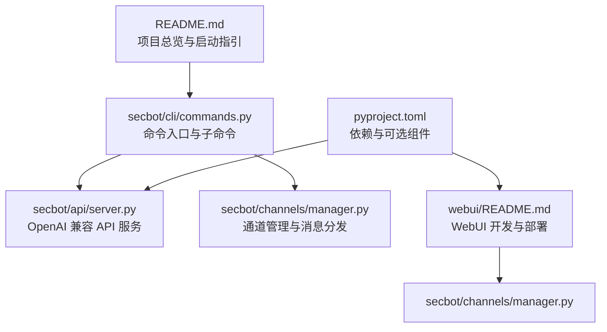
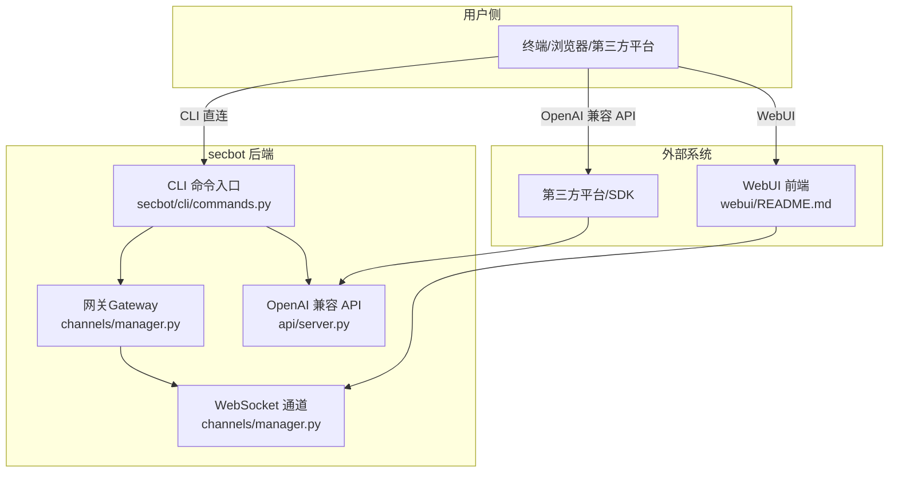
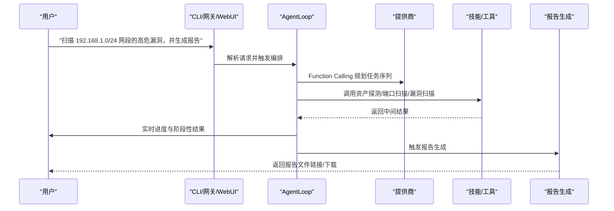
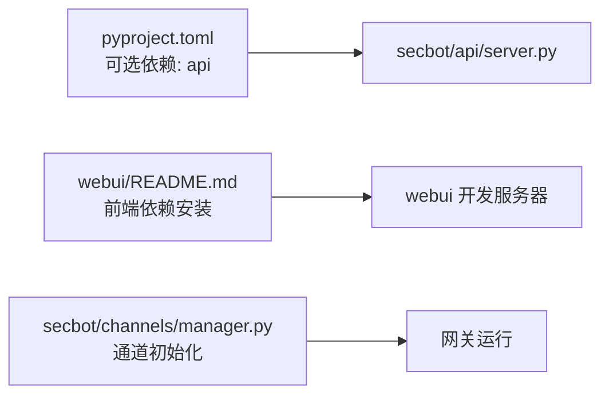

# 快速开始

<cite>
**本文引用的文件列表**
- [README.md](file://README.md)
- [docs/quick-start.md](file://docs/quick-start.md)
- [docs/configuration.md](file://docs/configuration.md)
- [docs/openai-api.md](file://docs/openai-api.md)
- [docs/cli-reference.md](file://docs/cli-reference.md)
- [webui/README.md](file://webui/README.md)
- [pyproject.toml](file://pyproject.toml)
- [secbot/__main__.py](file://secbot/__main__.py)
- [secbot/cli/commands.py](file://secbot/cli/commands.py)
- [secbot/api/server.py](file://secbot/api/server.py)
- [secbot/channels/manager.py](file://secbot/channels/manager.py)
</cite>

## 目录
1. [简介](#简介)
2. [项目结构](#项目结构)
3. [核心组件](#核心组件)
4. [架构总览](#架构总览)
5. [详细组件分析](#详细组件分析)
6. [依赖关系分析](#依赖关系分析)
7. [性能与可用性建议](#性能与可用性建议)
8. [常见问题排查](#常见问题排查)
9. [结论](#结论)
10. [附录](#附录)

## 简介
本指南面向首次接触 VAPT3/secbot 的用户，帮助你在最短时间内完成安装、配置与启动，并体验三种启动方式（CLI 直连、OpenAI 兼容 API、WebUI 网关）。文档同时提供一次典型对话示例，让你从“用户输入”到“结果输出”全流程清晰可见。

## 项目结构
- secbot：核心业务代码，包含 Agent 编排、工具封装、通道管理、API 服务、WebUI 静态资源等。
- webui：React 前端工程，通过 WebSocket 与网关通信，提供聊天界面与仪表盘。
- docs：官方文档，涵盖快速开始、配置、API、CLI 等。
- pyproject.toml：项目元信息与依赖声明，包含可选依赖（如 API 服务）。

图表来源
- [README.md:76-191](file://README.md#L76-L191)
- [secbot/cli/commands.py:514-601](file://secbot/cli/commands.py#L514-L601)
- [secbot/api/server.py:381-401](file://secbot/api/server.py#L381-L401)
- [secbot/channels/manager.py:43-127](file://secbot/channels/manager.py#L43-L127)
- [webui/README.md:28-89](file://webui/README.md#L28-L89)
- [pyproject.toml:70-73](file://pyproject.toml#L70-L73)

章节来源
- [README.md:29-75](file://README.md#L29-L75)
- [pyproject.toml:1-169](file://pyproject.toml#L1-L169)

## 核心组件
- CLI 命令入口：通过 secbot 命令提供 onboard、agent、serve、gateway 等子命令。
- OpenAI 兼容 API：提供 /v1/chat/completions 等端点，便于嵌入第三方平台。
- 网关（Gateway）：承载通道（如 WebSocket）、会话、定时任务、心跳等，为 WebUI 和外部集成提供统一接入。
- 通道（Channels）：负责消息路由与投递，当前 WebUI 依赖 WebSocket 通道。
- 配置系统：集中管理提供商、模型、通道、工具等配置项。

章节来源
- [secbot/__main__.py:1-9](file://secbot/__main__.py#L1-L9)
- [secbot/cli/commands.py:74-82](file://secbot/cli/commands.py#L74-L82)
- [docs/configuration.md:45-88](file://docs/configuration.md#L45-L88)

## 架构总览
下图展示了三种启动方式的总体路径与交互关系。

图表来源
- [secbot/cli/commands.py:514-601](file://secbot/cli/commands.py#L514-L601)
- [secbot/api/server.py:381-401](file://secbot/api/server.py#L381-L401)
- [secbot/channels/manager.py:43-127](file://secbot/channels/manager.py#L43-L127)
- [webui/README.md:28-89](file://webui/README.md#L28-L89)

## 详细组件分析

### 1. 安装与初始化
- 安装：推荐从源码安装以获取最新特性；也可通过 uv 或 PyPI 安装稳定版本。
- 初始化：运行 onboard 创建默认配置与工作空间；可选交互式向导。
- 配置：至少设置提供商 API Key 与默认模型；其他选项可保持默认。

章节来源
- [README.md:76-92](file://README.md#L76-L92)
- [docs/quick-start.md:10-28](file://docs/quick-start.md#L10-L28)
- [docs/quick-start.md:63-102](file://docs/quick-start.md#L63-L102)

### 2. 配置文件设置
- 配置位置：用户目录下的配置文件（不同项目使用不同路径，需按实际项目文档确认）。
- 关键字段：
  - providers：提供商配置（如 openrouter、openai 等）。
  - agents.defaults：默认模型、工作区、上下文窗口等。
  - channels：通道开关与参数（如 WebSocket 的 host/port/token 等）。
- 环境变量：敏感信息可通过环境变量注入，避免直接写入配置文件。

章节来源
- [docs/configuration.md:3-8](file://docs/configuration.md#L3-L8)
- [docs/configuration.md:10-44](file://docs/configuration.md#L10-L44)
- [README.md:94-109](file://README.md#L94-L109)

### 3. 三种启动方式

#### 3.1 CLI 直连（终端交互）
- 适用场景：快速冒烟测试、本地调试、无需 WebUI。
- 启动命令：secbot agent。
- 注意事项：
  - 需先完成 onboard 与配置。
  - 若需要查看运行日志，可在命令中加入相应参数（参考 CLI 参考）。
- 常见问题：
  - 未配置 API Key：启动时报错提示未配置提供商密钥。
  - 模型不可用：确保 agents.defaults 中的模型已在提供商处可用。

章节来源
- [README.md:117-125](file://README.md#L117-L125)
- [docs/cli-reference.md:8-11](file://docs/cli-reference.md#L8-L11)

#### 3.2 OpenAI 兼容 API（嵌入第三方平台）
- 适用场景：将 secbot 作为后端服务嵌入现有平台或 SDK。
- 启动命令：secbot serve [-p 端口] [-H 主机] [--timeout 超时]。
- 端点：
  - GET /health：健康检查。
  - GET /v1/models：列出可用模型。
  - POST /v1/chat/completions：聊天补全。
- 注意事项：
  - 需配置默认提供商的 API Key，否则启动失败。
  - 仅支持单条用户消息；支持流式与非流式响应。
  - 文件上传支持 JSON base64 与 multipart/form-data。
- 常见问题：
  - 绑定地址为 0.0.0.0 且未设置访问令牌：启动前需配置 token 或 tokenIssueSecret。
  - 请求超时：根据任务复杂度调整 --timeout。

章节来源
- [README.md:118-178](file://README.md#L118-L178)
- [docs/openai-api.md:33-82](file://docs/openai-api.md#L33-L82)
- [docs/openai-api.md:88-122](file://docs/openai-api.md#L88-L122)
- [secbot/api/server.py:381-401](file://secbot/api/server.py#L381-L401)

#### 3.3 WebUI 网关（浏览器图形界面）
- 适用场景：需要可视化界面与实时交互体验。
- 启动顺序：
  - 后端：secbot gateway [-v]，确保启用 WebSocket 通道。
  - 前端：进入 webui 目录，安装依赖并启动开发服务器。
- 端口与验证：
  - 网关默认监听端口（健康检查与 WebSocket 端口）。
  - 使用 curl 验证 /webui/bootstrap 是否返回 token。
- 常见问题：
  - 浏览器提示无法连接：检查 channels.websocket.enabled 是否开启，或确认启动的是 gateway 而非 serve。
  - 前端无法加载：确认 NANOBOT_API_URL 指向正确的后端地址。

章节来源
- [README.md:127-170](file://README.md#L127-L170)
- [webui/README.md:55-111](file://webui/README.md#L55-L111)
- [secbot/channels/manager.py:43-127](file://secbot/channels/manager.py#L43-L127)

### 4. 一次典型对话（从用户输入到结果输出）
以下示例展示从“扫描网段并生成报告”的用户输入，到最终报告生成的全过程。

图表来源
- [README.md:180-191](file://README.md#L180-L191)

章节来源
- [README.md:180-191](file://README.md#L180-L191)

## 依赖关系分析
- 可选依赖：API 服务依赖 aiohttp，需单独安装。
- 前端开发：webui 依赖 Node 生态（bun/npm），需先安装依赖再启动。
- 通道与网关：WebSocket 通道为 WebUI 提供基础，需在配置中启用。

图表来源
- [pyproject.toml:70-73](file://pyproject.toml#L70-L73)
- [webui/README.md:38-54](file://webui/README.md#L38-L54)
- [secbot/channels/manager.py:73-127](file://secbot/channels/manager.py#L73-L127)

章节来源
- [pyproject.toml:70-73](file://pyproject.toml#L70-L73)
- [webui/README.md:38-54](file://webui/README.md#L38-L54)
- [secbot/channels/manager.py:73-127](file://secbot/channels/manager.py#L73-L127)

## 性能与可用性建议
- 合理设置超时：OpenAI 兼容 API 的 --timeout 参数可根据任务复杂度调整。
- 并发与锁：API 服务对每个会话使用独立锁，避免并发冲突。
- 通道重试：通道层采用指数退避重试策略，提升网络波动下的稳定性。
- 日志级别：CLI 与网关均支持详细日志输出，便于定位问题。

章节来源
- [docs/openai-api.md:10-18](file://docs/openai-api.md#L10-L18)
- [secbot/api/server.py:228-235](file://secbot/api/server.py#L228-L235)
- [secbot/channels/manager.py:395-424](file://secbot/channels/manager.py#L395-L424)

## 常见问题排查
- 启动报错“未配置提供商 API Key”：检查 agents.defaults.provider 与 providers.*.apiKey 的配置。
- WebUI 无法连接：确认 channels.websocket.enabled=true，且启动的是 gateway。
- OpenAI 兼容 API 绑定 0.0.0.0：需配置 token 或 tokenIssueSecret。
- 前端开发环境报模块缺失：先在 webui 目录执行依赖安装后再启动。
- 通道发送失败：查看日志中的重试记录，确认网络与凭据状态。

章节来源
- [README.md:169-170](file://README.md#L169-L170)
- [webui/README.md:40-54](file://webui/README.md#L40-L54)
- [docs/openai-api.md:10-18](file://docs/openai-api.md#L10-L18)
- [secbot/channels/manager.py:416-424](file://secbot/channels/manager.py#L416-L424)

## 结论
通过本指南，你可以快速完成 secbot 的安装、配置与三种启动方式的实践。建议优先使用 CLI 直连进行快速验证，随后在需要可视化界面时启动 WebUI 网关；若要嵌入第三方平台，则使用 OpenAI 兼容 API。遇到问题时，结合日志与本指南的排查要点可快速定位原因。

## 附录
- CLI 参考：常用命令与参数说明。
- 配置参考：提供商、通道、工具等配置项详解。
- API 参考：OpenAI 兼容 API 的端点与行为说明。

章节来源
- [docs/cli-reference.md:1-22](file://docs/cli-reference.md#L1-L22)
- [docs/configuration.md:45-88](file://docs/configuration.md#L45-L88)
- [docs/openai-api.md:1-122](file://docs/openai-api.md#L1-L122)