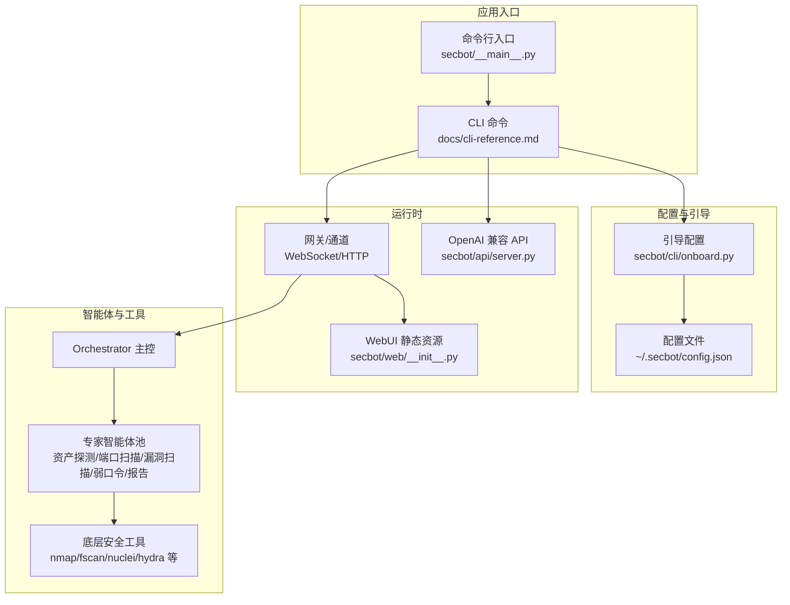
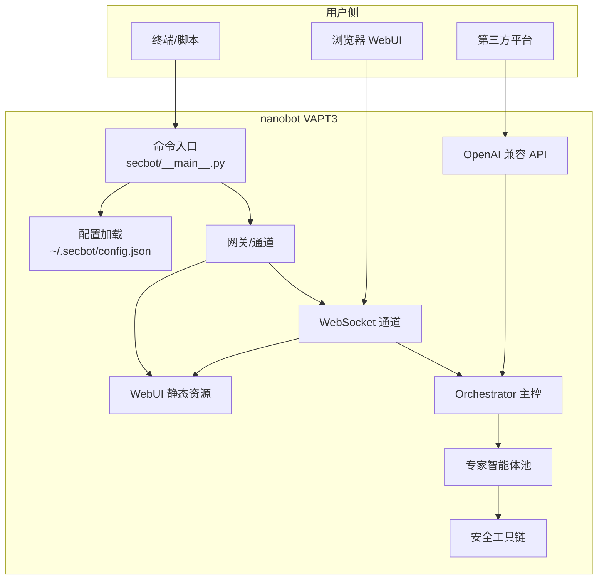
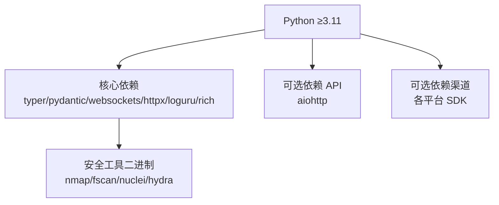

# 快速开始

<cite>
**本文引用的文件**
- [README.md](file://README.md)
- [docs/quick-start.md](file://docs/quick-start.md)
- [docs/configuration.md](file://docs/configuration.md)
- [docs/openai-api.md](file://docs/openai-api.md)
- [docs/websocket.md](file://docs/websocket.md)
- [docs/cli-reference.md](file://docs/cli-reference.md)
- [docs/deployment.md](file://docs/deployment.md)
- [pyproject.toml](file://pyproject.toml)
- [secbot/__main__.py](file://secbot/__main__.py)
- [secbot/cli/onboard.py](file://secbot/cli/onboard.py)
- [secbot/api/server.py](file://secbot/api/server.py)
- [secbot/web/__init__.py](file://secbot/web/__init__.py)
</cite>

## 目录
1. [简介](#简介)
2. [项目结构](#项目结构)
3. [核心组件](#核心组件)
4. [架构总览](#架构总览)
5. [详细组件分析](#详细组件分析)
6. [依赖分析](#依赖分析)
7. [性能考虑](#性能考虑)
8. [故障排除指南](#故障排除指南)
9. [结论](#结论)
10. [附录](#附录)

## 简介
本指南面向首次接触 nanobot VAPT3 的用户，提供从零到一的完整快速开始路径。内容涵盖：
- 安装与依赖准备
- secbot onboard 初始化配置
- 三种启动方式（CLI 直连、OpenAI 兼容 API、WebUI 网关）
- 健康检查与连接验证
- 常见问题与解决方案
- 一次典型对话全流程示例
- 故障排除与调试技巧

## 项目结构
VAPT3 基于 nanobot 的轻量 Agent Loop，围绕“主控 Orchestrator + 可插拔专家智能体池”构建，支持 CLI、OpenAI 兼容 API、WebSocket/WebUI 等多种接入方式。

图表来源
- [secbot/__main__.py:1-9](file://secbot/__main__.py#L1-L9)
- [docs/cli-reference.md:1-22](file://docs/cli-reference.md#L1-L22)
- [secbot/cli/onboard.py:1-120](file://secbot/cli/onboard.py#L1-L120)
- [secbot/api/server.py:1-120](file://secbot/api/server.py#L1-L120)
- [secbot/web/__init__.py:1-7](file://secbot/web/__init__.py#L1-L7)

章节来源
- [README.md:76-120](file://README.md#L76-L120)
- [docs/cli-reference.md:1-22](file://docs/cli-reference.md#L1-L22)

## 核心组件
- secbot 命令入口与 CLI：通过命令行启动不同运行模式（agent、serve、gateway）。
- 引导配置（onboard）：生成或刷新配置与工作区，支持交互式向导。
- OpenAI 兼容 API：提供 /v1/chat/completions 等端点，便于嵌入第三方平台。
- WebSocket/WebUI 网关：提供实时双向通信、流式传输、令牌鉴权与多聊天会话复用。
- 专家智能体与工具：资产探测、端口扫描、漏洞扫描、弱口令检测、报告生成，底层依赖 nmap/fscan/nuclei/hydra 等二进制工具。

章节来源
- [README.md:64-74](file://README.md#L64-L74)
- [docs/openai-api.md:1-122](file://docs/openai-api.md#L1-L122)
- [docs/websocket.md:1-120](file://docs/websocket.md#L1-L120)

## 架构总览

图表来源
- [README.md:29-53](file://README.md#L29-L53)
- [docs/openai-api.md:1-122](file://docs/openai-api.md#L1-L122)
- [docs/websocket.md:1-120](file://docs/websocket.md#L1-L120)
- [secbot/api/server.py:1-120](file://secbot/api/server.py#L1-L120)
- [secbot/web/__init__.py:1-7](file://secbot/web/__init__.py#L1-L7)

## 详细组件分析

### 安装与依赖
- 安装方式（任选其一）
  - 从源码安装（推荐开发/最新特性）：克隆仓库后执行可编辑安装。
  - 从 PyPI 安装（稳定版本）。
  - 使用 uv 工具安装（更快）。
- 依赖与运行时要求
  - Python 版本要求：≥3.11
  - 可选依赖：OpenAI 兼容 API 服务端依赖 aiohttp
  - 底层安全工具（nmap/fscan/nuclei/hydra 等）需自行安装，secbot 通过子进程调用

章节来源
- [docs/quick-start.md:3-29](file://docs/quick-start.md#L3-L29)
- [pyproject.toml:6-68](file://pyproject.toml#L6-L68)
- [README.md:80-87](file://README.md#L80-L87)

### 初始化配置（secbot onboard）
- 生成或刷新配置与工作区
- 支持交互式向导（需要额外依赖）
- 常用配置要点
  - providers：配置 LLM 提供商与 apiKey
  - agents.defaults：设置默认 provider 与 model
  - channels.websocket：启用并配置 WebSocket 通道（WebUI 必需）

章节来源
- [docs/quick-start.md:63-105](file://docs/quick-start.md#L63-L105)
- [README.md:88-110](file://README.md#L88-L110)
- [docs/configuration.md:45-99](file://docs/configuration.md#L45-L99)

### 三种启动方式与适用场景

#### 1) CLI 直连（secbot agent）
- 适合快速冒烟与本地交互
- 命令示例：secbot agent
- 退出方式：exit、quit、/exit、/quit、:q 或 Ctrl+D

章节来源
- [docs/cli-reference.md:8-14](file://docs/cli-reference.md#L8-L14)
- [README.md:117-126](file://README.md#L117-L126)

#### 2) OpenAI 兼容 API（secbot serve）
- 适合嵌入第三方平台
- 默认绑定地址与端口可在配置中调整
- 端点：/v1/chat/completions、/v1/models、/health
- 健康检查：curl http://127.0.0.1:8000/health

章节来源
- [docs/openai-api.md:1-122](file://docs/openai-api.md#L1-L122)
- [README.md:118-178](file://README.md#L118-L178)

#### 3) WebUI 网关（secbot gateway）
- WebUI 通过 /webui/bootstrap 获取会话 token，依赖 WebSocket 通道
- 默认端口：健康检查 18790；WebSocket 通道 8765
- 启动后可通过 curl 验证：curl http://127.0.0.1:8765/webui/bootstrap
- 前端开发：webui 目录下使用 bun/npm 启动，开发代理默认转发到 8765

章节来源
- [README.md:127-170](file://README.md#L127-L170)
- [docs/websocket.md:15-48](file://docs/websocket.md#L15-L48)
- [docs/deployment.md:13-45](file://docs/deployment.md#L13-L45)

### 健康检查与连接验证
- OpenAI 兼容 API：访问 /health
- WebUI 网关：访问 /webui/bootstrap
- WebSocket：连接 ws://127.0.0.1:8765 并等待 ready 事件

章节来源
- [docs/openai-api.md:35-48](file://docs/openai-api.md#L35-L48)
- [README.md:152-158](file://README.md#L152-L158)
- [docs/websocket.md:80-95](file://docs/websocket.md#L80-L95)

### 一次典型对话（从提问到报告）
- 用户：扫描 192.168.1.0/24 网段的高危漏洞，并生成报告
- 主控 Orchestrator 规划：asset_discovery → port_scan → vuln_scan → report
- 高危动作确认：对 3 台主机运行 nuclei CVE 扫描
- 输出：报告生成并给出报告路径

章节来源
- [README.md:180-192](file://README.md#L180-L192)

## 依赖分析
- Python 运行时与核心库：typer、pydantic、websockets、httpx、loguru、rich 等
- 可选依赖：aiohttp（OpenAI 兼容 API）、各渠道适配器（Telegram、Slack、Discord 等）
- 安全工具二进制：nmap、fscan、nuclei、hydra、masscan 等，需在 PATH 中并受白名单限制

图表来源
- [pyproject.toml:25-68](file://pyproject.toml#L25-L68)
- [README.md:225-338](file://README.md#L225-L338)

章节来源
- [pyproject.toml:1-169](file://pyproject.toml#L1-L169)
- [README.md:225-338](file://README.md#L225-L338)

## 性能考虑
- 流式传输：WebSocket 与 OpenAI 兼容 API 均支持流式响应，提升交互体验
- 会话隔离：API 会话通过 session_id 隔离，避免并发冲突
- 请求超时：OpenAI 兼容 API 默认请求超时可配置
- 并发控制：API 端使用 per-session 锁，保证请求串行化处理

章节来源
- [docs/websocket.md:1-120](file://docs/websocket.md#L1-L120)
- [docs/openai-api.md:12-32](file://docs/openai-api.md#L12-L32)
- [secbot/api/server.py:225-351](file://secbot/api/server.py#L225-L351)

## 故障排除指南

### 常见问题与解决方案
- 端口冲突
  - 现象：启动失败或提示端口已被占用
  - 处理：修改配置中的端口或停止占用进程
- 依赖缺失
  - 现象：导入错误或功能不可用
  - 处理：安装可选依赖（如 aiohttp、各渠道 SDK）
- 权限问题（Docker）
  - 现象：容器内权限不足导致写入失败
  - 处理：正确映射宿主机目录并修正权限
- WebUI 无法连接
  - 现象：浏览器提示无法连接或 ECONNREFUSED
  - 处理：确认 channels.websocket.enabled=true，且启动的是 gateway 而非 serve

章节来源
- [docs/deployment.md:10-12](file://docs/deployment.md#L10-L12)
- [README.md:169-170](file://README.md#L169-L170)

### 调试技巧
- 使用 -v 参数开启详细日志
- 通过 /health 与 /v1/models 验证服务状态
- 在 WebSocket 连接后等待 ready 事件，再发送消息
- 检查配置文件中的 providers 与 agents.defaults 是否正确

章节来源
- [README.md:143-150](file://README.md#L143-L150)
- [docs/openai-api.md:35-48](file://docs/openai-api.md#L35-L48)
- [docs/websocket.md:80-95](file://docs/websocket.md#L80-L95)

## 结论
通过本快速开始指南，您已完成：
- 安装与依赖准备
- 初始化配置与 secbot onboard
- 三种启动方式的部署与验证
- 健康检查与连接测试
- 常见问题排查与调试

现在您可以基于 CLI、OpenAI 兼容 API 或 WebUI 网关开展 VAPT3 的日常安全运营与自动化任务编排。

## 附录

### 命令参考（摘要）
- secbot onboard：初始化配置与工作区
- secbot agent：CLI 交互模式
- secbot serve：OpenAI 兼容 API
- secbot gateway：WebUI 网关
- secbot status：查看状态

章节来源
- [docs/cli-reference.md:1-22](file://docs/cli-reference.md#L1-L22)