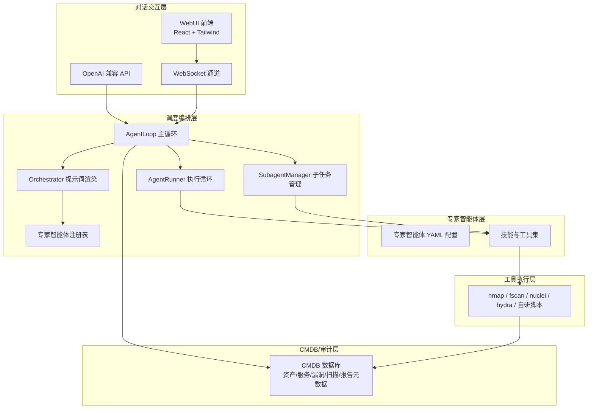
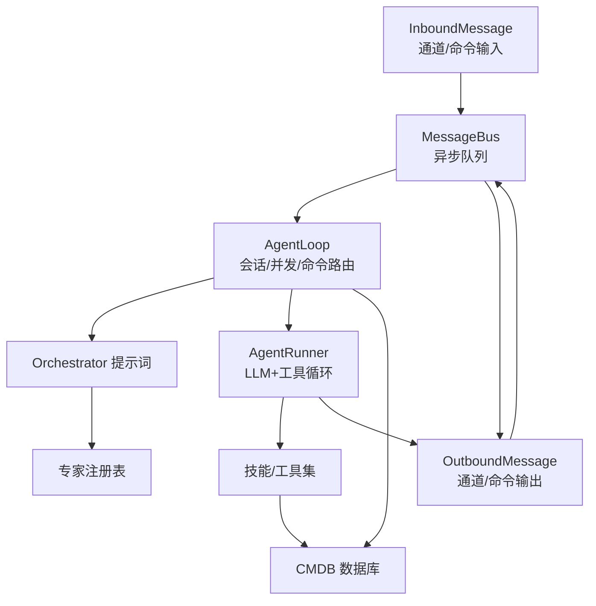
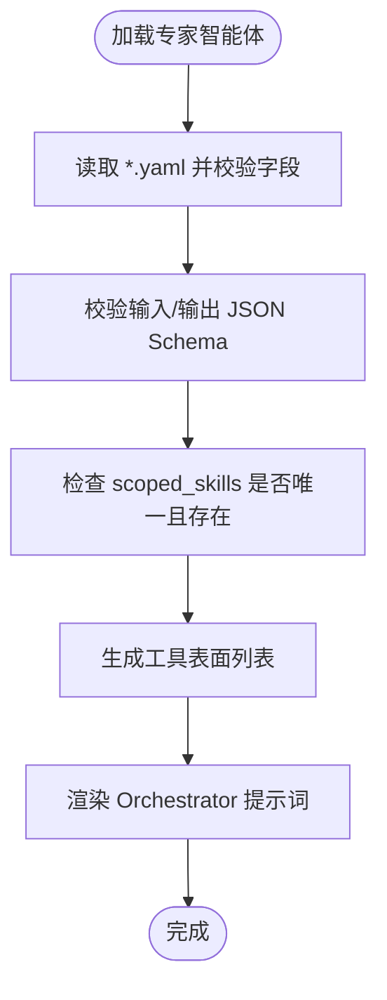
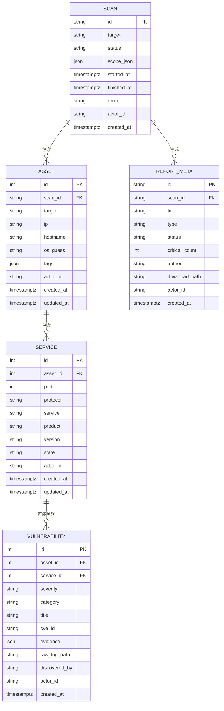
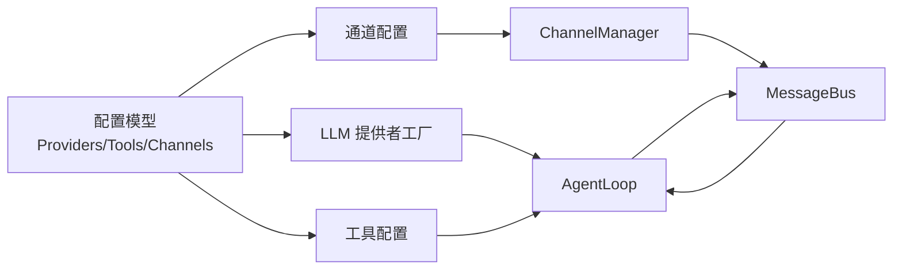

# 总体架构

<cite>
**本文引用的文件**
- [README.md](file://README.md)
- [secbot/agents/orchestrator.py](file://secbot/agents/orchestrator.py)
- [secbot/agents/registry.py](file://secbot/agents/registry.py)
- [secbot/agent/loop.py](file://secbot/agent/loop.py)
- [secbot/agent/runner.py](file://secbot/agent/runner.py)
- [secbot/agent/subagent.py](file://secbot/agent/subagent.py)
- [secbot/bus/queue.py](file://secbot/bus/queue.py)
- [secbot/bus/events.py](file://secbot/bus/events.py)
- [secbot/channels/manager.py](file://secbot/channels/manager.py)
- [secbot/command/router.py](file://secbot/command/router.py)
- [secbot/cli/commands.py](file://secbot/cli/commands.py)
- [secbot/config/schema.py](file://secbot/config/schema.py)
- [secbot/cmdb/models.py](file://secbot/cmdb/models.py)
- [secbot/secbot.py](file://secbot/secbot.py)
- [secbot/__main__.py](file://secbot/__main__.py)
</cite>

## 目录
1. [引言](#引言)
2. [项目结构](#项目结构)
3. [核心组件](#核心组件)
4. [架构总览](#架构总览)
5. [详细组件分析](#详细组件分析)
6. [依赖分析](#依赖分析)
7. [性能考虑](#性能考虑)
8. [故障排查指南](#故障排查指南)
9. [结论](#结论)
10. [附录](#附录)

## 引言
本文件面向不同技术背景的读者，系统化阐述 VAPT3/secbot 的四层架构：对话交互层、调度编排层、专家智能体层、工具执行层。重点解释主控智能体（Orchestrator）的动态规划机制、专家智能体的解耦设计、CMDB 数据库的统一建模，以及消息总线与通道管理的解耦通信方式。文档同时给出架构图与数据流说明，解释技术选型的原因与优势，并提供循序渐进的理解路径。

## 项目结构
secbot 基于 nanobot 的轻量 Agent Loop，围绕“主控 Orchestrator + 可插拔专家智能体池”构建，形成从对话到执行的完整闭环。项目采用模块化分层组织，核心目录与职责如下：
- secbot/agents：专家智能体配置与 Orchestrator 提示词渲染
- secbot/agent：Agent Loop、Runner、Subagent 管理器、钩子与内存/会话
- secbot/bus：消息总线（Inbound/Outbound 队列）
- secbot/channels：通道管理（WebSocket、REST 等）
- secbot/command：命令路由（优先级/精确匹配/前缀/拦截器）
- secbot/cli：命令行入口与网关/API 服务
- secbot/config：Pydantic 配置模型（提供者、工具、通道等）
- secbot/cmdb：CMDB 数据库（资产/服务/漏洞/扫描/报告元数据）
- secbot/skills：底层工具封装（nmap/fscan/nuclei/hydra 等）
- secbot/report：报告生成与渲染
- secbot/security：网络白名单与命令注入防护
- webui：前端（React + Tailwind + assistant-ui）



图表来源
- [README.md:29-63](file://README.md#L29-L63)
- [secbot/agents/orchestrator.py:52-69](file://secbot/agents/orchestrator.py#L52-L69)
- [secbot/agents/registry.py:66-91](file://secbot/agents/registry.py#L66-L91)
- [secbot/agent/loop.py:276-425](file://secbot/agent/loop.py#L276-L425)
- [secbot/agent/runner.py:234-567](file://secbot/agent/runner.py#L234-L567)
- [secbot/agent/subagent.py:70-153](file://secbot/agent/subagent.py#L70-L153)
- [secbot/cmdb/models.py:38-263](file://secbot/cmdb/models.py#L38-L263)

章节来源
- [README.md:29-63](file://README.md#L29-L63)

## 核心组件
- 对话交互层：负责接收用户指令、展示过程与结果，包含 WebSocket 通道、REST API 与 WebUI 前端。
- 调度编排层：核心是 AgentLoop 与 AgentRunner，前者负责消息分发、会话管理、并发控制与命令路由；后者负责 LLM 请求、工具调用、上下文治理与错误恢复。
- 专家智能体层：通过 YAML 描述每个专家的系统提示词、工具集与输入输出 Schema，注册表统一生成 Orchestrator 的工具表面。
- 工具执行层：封装 nmap/fscan/nuclei/hydra 等底层工具，结合沙箱与网络白名单策略保障安全。
- CMDB/审计层：统一建模资产、服务、漏洞、扫描任务与报告元数据，支持查询与迁移。

章节来源
- [README.md:29-63](file://README.md#L29-L63)
- [secbot/agent/loop.py:276-425](file://secbot/agent/loop.py#L276-L425)
- [secbot/agent/runner.py:234-567](file://secbot/agent/runner.py#L234-L567)
- [secbot/agents/orchestrator.py:52-69](file://secbot/agents/orchestrator.py#L52-L69)
- [secbot/agents/registry.py:66-91](file://secbot/agents/registry.py#L66-L91)
- [secbot/cmdb/models.py:38-263](file://secbot/cmdb/models.py#L38-L263)

## 架构总览
四层架构的职责与边界清晰：
- 对话交互层：通过通道与 API 将用户消息送入消息总线，再由 AgentLoop 消费并处理。
- 调度编排层：AgentLoop 与 AgentRunner 实现“意图解析 + 动态规划 + 工具调度 + 上下文接力”，并通过 SubagentManager 支持后台子任务。
- 专家智能体层：专家智能体以“提示词 + 工具 + Schema”的形式解耦，注册表统一生成 Orchestrator 的工具表面，实现动态选择与规划。
- 工具执行层：通过技能封装与安全策略（沙箱、白名单、注入防护）执行真实安全操作，并回写 CMDB。
- CMDB/审计层：统一存储业务实体与审计元数据，支撑查询、聚合与报告生成。



图表来源
- [secbot/bus/queue.py:8-45](file://secbot/bus/queue.py#L8-L45)
- [secbot/bus/events.py:8-39](file://secbot/bus/events.py#L8-L39)
- [secbot/agent/loop.py:276-425](file://secbot/agent/loop.py#L276-L425)
- [secbot/agent/runner.py:234-567](file://secbot/agent/runner.py#L234-L567)
- [secbot/agents/orchestrator.py:52-69](file://secbot/agents/orchestrator.py#L52-L69)
- [secbot/agents/registry.py:66-91](file://secbot/agents/registry.py#L66-L91)
- [secbot/cmdb/models.py:38-263](file://secbot/cmdb/models.py#L38-L263)

## 详细组件分析

### 对话交互层
- 通道管理：ChannelManager 负责初始化与启动各通道（如 WebSocket），并统一出站消息派发，具备重试、去重与流合并能力。
- 命令路由：CommandRouter 支持优先级、精确匹配、前缀匹配与拦截器，保证关键命令（如 /stop）的即时响应。
- CLI/Gateway/API：CLI commands 提供 onboard、serve（OpenAI 兼容 API）、gateway（WebUI/通道）等入口；Secbot 提供程序化接口。

```mermaid
sequenceDiagram
participant User as "用户"
participant WS as "WebSocket 通道"
participant Manager as "ChannelManager"
participant Bus as "MessageBus"
participant Loop as "AgentLoop"
User->>WS : 发送消息
WS->>Manager : 转发消息
Manager->>Bus : publish_outbound(OutboundMessage)
Bus-->>Loop : consume_inbound(InboundMessage)
Loop->>Loop : 解析会话/并发/命令
Loop-->>Bus : publish_outbound(响应)
Bus-->>Manager : consume_outbound
Manager-->>WS : 发送响应
WS-->>User : 展示结果
```

图表来源
- [secbot/channels/manager.py:278-443](file://secbot/channels/manager.py#L278-L443)
- [secbot/bus/queue.py:8-45](file://secbot/bus/queue.py#L8-L45)
- [secbot/agent/loop.py:788-800](file://secbot/agent/loop.py#L788-L800)
- [secbot/command/router.py:27-99](file://secbot/command/router.py#L27-L99)

章节来源
- [secbot/channels/manager.py:43-127](file://secbot/channels/manager.py#L43-L127)
- [secbot/command/router.py:27-99](file://secbot/command/router.py#L27-L99)
- [secbot/cli/commands.py:514-601](file://secbot/cli/commands.py#L514-L601)
- [secbot/secbot.py:36-91](file://secbot/secbot.py#L36-L91)
- [secbot/__main__.py:5-8](file://secbot/__main__.py#L5-L8)

### 调度编排层
- AgentLoop：核心调度引擎，负责消息消费、会话管理、并发门控、命令路由、MCP 连接、子任务派生与注入、进度回调与活动事件广播。
- AgentRunner：LLM 请求与工具调用的共享执行循环，内置上下文治理、空响应/截断恢复、工具批处理与并发、错误分类与注入恢复。
- SubagentManager：后台子任务管理，隔离文件状态缓存，构建子任务系统提示词，通过消息总线注入结果回到主循环。

```mermaid
sequenceDiagram
participant Bus as "MessageBus"
participant Loop as "AgentLoop"
participant Runner as "AgentRunner"
participant Tools as "工具注册表"
participant Sub as "SubagentManager"
Bus-->>Loop : consume_inbound
Loop->>Loop : 构建会话/上下文/命令
Loop->>Runner : run(AgentRunSpec)
Runner->>Runner : 上下文治理/截断/压缩
Runner->>Tools : 选择工具/准备参数
Tools-->>Runner : 工具结果
Runner-->>Loop : AgentRunResult
Loop->>Sub : spawn(后台任务)
Sub-->>Bus : 注入子任务结果(InboundMessage)
Bus-->>Loop : consume_inbound(注入)
Loop->>Runner : 继续迭代
```

图表来源
- [secbot/agent/loop.py:644-787](file://secbot/agent/loop.py#L644-L787)
- [secbot/agent/runner.py:234-567](file://secbot/agent/runner.py#L234-L567)
- [secbot/agent/subagent.py:154-300](file://secbot/agent/subagent.py#L154-L300)

章节来源
- [secbot/agent/loop.py:276-425](file://secbot/agent/loop.py#L276-L425)
- [secbot/agent/runner.py:100-233](file://secbot/agent/runner.py#L100-L233)
- [secbot/agent/subagent.py:70-153](file://secbot/agent/subagent.py#L70-L153)

### 专家智能体层
- Orchestrator 提示词：固定“角色/硬规则/工作风格”，动态“可用专家智能体表”。表由注册表生成，确保 Orchestrator 的工具表面随专家配置变化而更新。
- 注册表：加载并校验每个专家智能体的 YAML，确保技能不重复、Schema 合法、名称与文件名一致等约束。



图表来源
- [secbot/agents/registry.py:99-144](file://secbot/agents/registry.py#L99-L144)
- [secbot/agents/orchestrator.py:52-69](file://secbot/agents/orchestrator.py#L52-L69)

章节来源
- [secbot/agents/orchestrator.py:52-69](file://secbot/agents/orchestrator.py#L52-L69)
- [secbot/agents/registry.py:66-91](file://secbot/agents/registry.py#L66-L91)
- [secbot/agents/registry.py:147-236](file://secbot/agents/registry.py#L147-L236)

### 工具执行层
- 工具注册与准备：AgentLoop 在运行前注册默认工具（文件/搜索/执行/Web/消息/Spawn/Cron 等），并根据配置启用/禁用。
- 安全策略：通过安全模块对网络访问与命令注入进行白名单与防护，避免越权或危险操作。
- 技能封装：skills 目录下封装具体工具（如 nmap/fscan/nuclei/hydra），提供输入/输出模式与错误处理。

章节来源
- [secbot/agent/loop.py:460-513](file://secbot/agent/loop.py#L460-L513)
- [secbot/security/network.py](file://secbot/security/network.py)

### CMDB/审计层
- 统一建模：Scan/Asset/Service/Vulnerability/ReportMeta 等表统一建模，支持索引、外键与多租户 actor_id 字段。
- 状态与枚举：严格的枚举值与状态转换（如扫描状态、漏洞严重级别、报告状态）保证数据一致性。
- 迁移与版本：Alembic 迁移脚本支持演进，便于在不破坏生产的情况下平滑升级。



图表来源
- [secbot/cmdb/models.py:38-263](file://secbot/cmdb/models.py#L38-L263)

章节来源
- [secbot/cmdb/models.py:38-263](file://secbot/cmdb/models.py#L38-L263)

## 依赖分析
- 松耦合通信：消息总线通过异步队列解耦通道与 AgentLoop，支持多通道并行接入与统一出站派发。
- 配置驱动：Pydantic 配置模型集中管理提供者、工具、通道与网关参数，支持环境变量覆盖与动态切换。
- 扩展性：专家智能体通过 YAML 注册，Orchestrator 动态生成工具表面；工具通过技能封装与安全策略统一接入。



图表来源
- [secbot/config/schema.py:267-376](file://secbot/config/schema.py#L267-L376)
- [secbot/providers/factory.py](file://secbot/providers/factory.py)
- [secbot/channels/manager.py:53-127](file://secbot/channels/manager.py#L53-L127)
- [secbot/bus/queue.py:8-45](file://secbot/bus/queue.py#L8-L45)

章节来源
- [secbot/config/schema.py:267-376](file://secbot/config/schema.py#L267-L376)
- [secbot/channels/manager.py:53-127](file://secbot/channels/manager.py#L53-L127)

## 性能考虑
- 上下文治理：Runner 在每次迭代前进行历史消息压缩、孤儿工具结果清理与长度截断，降低 Token 使用与延迟。
- 并发控制：AgentLoop 通过信号量限制并发请求，SubagentManager 控制后台任务数量，避免资源争用。
- 流式传输与去重：ChannelManager 合并连续流增量、抑制重复消息，减少 API 调用与带宽占用。
- 迁移与索引：CMDB 表建立关键索引（如 actor/status/created_at、资产 IP/主机名、漏洞资产/严重级别等），提升查询效率。

## 故障排查指南
- 通道不可用：检查通道配置与允许来源，确认通道已启用且未被空 allowFrom 禁止。
- 出站消息丢失：关注 ChannelManager 的重试策略与去重指纹，确认消息元数据中的标识字段。
- LLM 超时/空响应：调整 AgentLoop 的超时与最大迭代次数，查看 Runner 的空响应重试与截断恢复逻辑。
- 工具调用失败：检查工具准备阶段的违规（如重复外部查找、工作区越界），必要时开启 fail-on-tool-error 获取明确错误信息。
- CMDB 异常：核对迁移脚本与状态枚举，确认状态转换是否符合约束。

章节来源
- [secbot/channels/manager.py:147-162](file://secbot/channels/manager.py#L147-L162)
- [secbot/channels/manager.py:256-277](file://secbot/channels/manager.py#L256-L277)
- [secbot/agent/runner.py:391-510](file://secbot/agent/runner.py#L391-L510)
- [secbot/agent/runner.py:742-800](file://secbot/agent/runner.py#L742-L800)
- [secbot/cmdb/models.py:221-263](file://secbot/cmdb/models.py#L221-L263)

## 结论
secbot 通过四层架构实现了“对话即调度”的安全作业闭环：对话交互层提供统一入口，调度编排层以 AgentLoop/Runner 为核心实现动态规划与工具调度，专家智能体层以 YAML 驱动的解耦设计支持灵活扩展，工具执行层在安全策略下对接真实安全能力，CMDB/审计层提供统一的数据建模与可观测性。该架构兼顾易用性、可扩展性与安全性，适合在受控环境中开展自动化 VAPT 作业。

## 附录
- 技术选型说明
  - LLM 提供者：通过配置模型与工厂模式支持多 Provider，便于替换与迁移。
  - 工具与技能：以技能封装与安全策略统一接入，降低工具调用风险。
  - 数据建模：SQLAlchemy + Alembic 提供强类型与迁移能力，适配多租户与审计需求。
  - 通道与 API：WebSocket 与 OpenAI 兼容 API 并存，满足 WebUI 与平台集成需求。