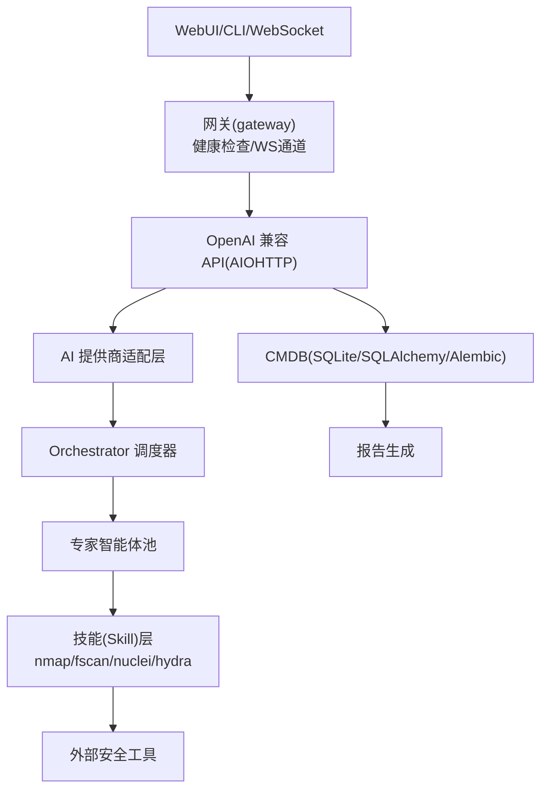
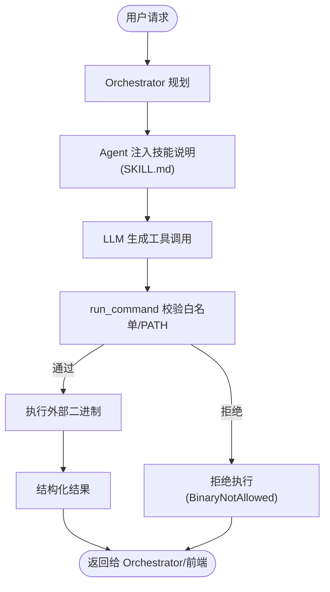
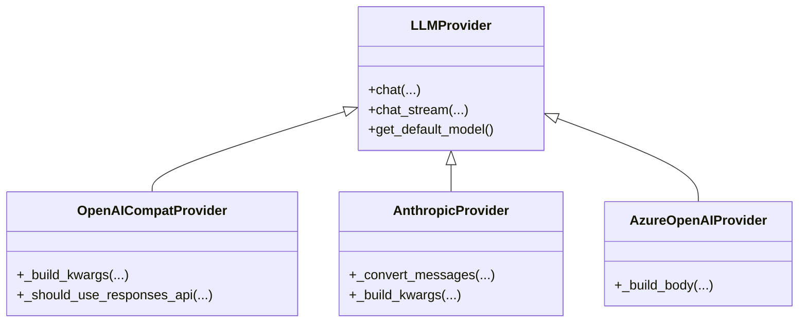
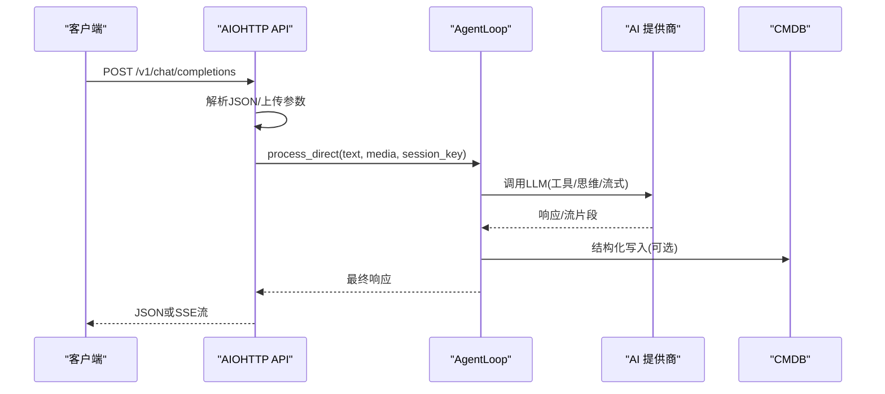
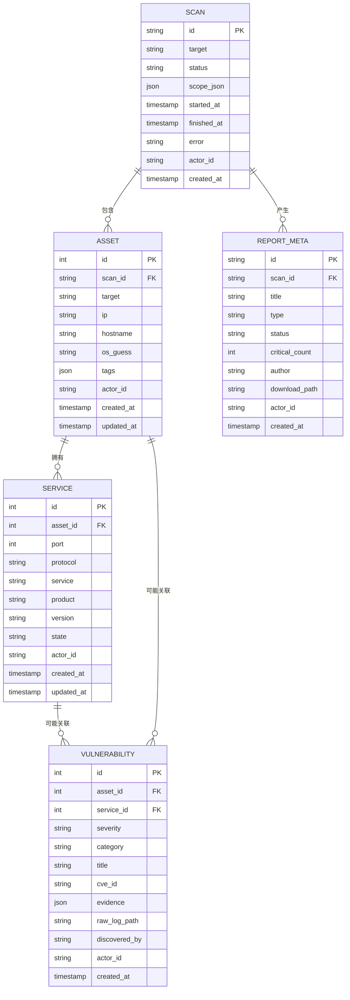
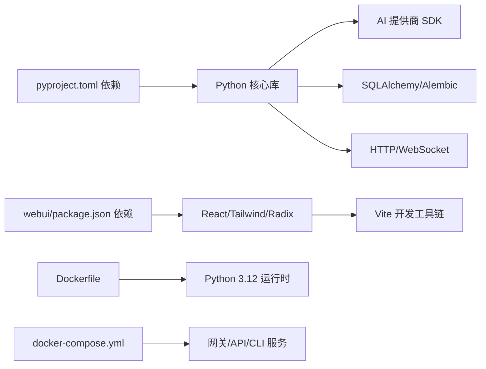

# 技术栈

<cite>
**本文引用的文件**
- [README.md](file://README.md)
- [pyproject.toml](file://pyproject.toml)
- [Dockerfile](file://Dockerfile)
- [docker-compose.yml](file://docker-compose.yml)
- [webui/package.json](file://webui/package.json)
- [webui/vite.config.ts](file://webui/vite.config.ts)
- [webui/tailwind.config.js](file://webui/tailwind.config.js)
- [secbot/api/server.py](file://secbot/api/server.py)
- [secbot/providers/openai_compat_provider.py](file://secbot/providers/openai_compat_provider.py)
- [secbot/providers/anthropic_provider.py](file://secbot/providers/anthropic_provider.py)
- [secbot/providers/azure_openai_provider.py](file://secbot/providers/azure_openai_provider.py)
- [secbot/skills/nmap-host-discovery/SKILL.md](file://secbot/skills/nmap-host-discovery/SKILL.md)
- [secbot/skills/nuclei-template-scan/SKILL.md](file://secbot/skills/nuclei-template-scan/SKILL.md)
- [secbot/skills/fscan-asset-discovery/SKILL.md](file://secbot/skills/fscan-asset-discovery/SKILL.md)
- [secbot/cmdb/models.py](file://secbot/cmdb/models.py)
</cite>

## 目录
1. [简介](#简介)
2. [项目结构](#项目结构)
3. [核心组件](#核心组件)
4. [架构总览](#架构总览)
5. [详细组件分析](#详细组件分析)
6. [依赖关系分析](#依赖关系分析)
7. [性能考量](#性能考量)
8. [故障排查指南](#故障排查指南)
9. [结论](#结论)
10. [附录](#附录)

## 简介
本文件系统化梳理 nanobot VAPT3 的技术栈与实现基础，覆盖后端技术栈（Python 3.11+、FastAPI/AIOHTTP、WebSocket、Pydantic、SQLAlchemy、Alembic）、前端技术栈（React 18、Vite、Tailwind CSS、Radix UI）、安全工具集成（nmap、nuclei、hydra、fscan 等）、容器化（Docker 与 docker-compose）、AI 提供商集成（OpenAI、Anthropic、Azure OpenAI 等），并给出版本要求、依赖关系、选型理由、最佳实践与性能考量，帮助开发者快速理解与高效落地。

## 项目结构
- 后端主体位于 secbot/，包含 API 服务器、WebSocket 通道、AI 提供商适配、CMDB 数据库、专家智能体与技能（skills）等。
- 前端位于 webui/，采用 React 18 + Vite 构建，Tailwind CSS 与 Radix UI 组件体系。
- 容器化通过 Dockerfile 与 docker-compose.yml 实现，提供网关、API、CLI 三种服务形态。
- README.md 提供总体架构、特性与使用说明，是理解项目技术路线的起点。

```mermaid
graph TB
subgraph "前端(WebUI)"
Vite["Vite 开发服务器<br/>代理到后端"]
React["React 18 + Radix UI"]
Tailwind["Tailwind CSS"]
end
subgraph "后端(Secbot)"
API["AIOHTTP API 服务器<br/>/v1/chat/completions"]
WS["WebSocket 通道"]
Prov["AI 提供商适配层<br/>OpenAI/Anthropic/Azure"]
CMDB["CMDB 数据库<br/>SQLite + SQLAlchemy + Alembic"]
Skills["安全技能(Skills)<br/>nmap/fscan/nuclei/hydra"]
end
subgraph "容器"
Docker["Docker 镜像"]
Compose["docker-compose 服务编排"]
end
Vite --> |"代理"/webui,/api,/auth"| API
Vite --> |"WebSocket 升级"| WS
API --> Prov
API --> CMDB
Prov --> Skills
Docker --> Compose
```

图表来源
- [README.md](file://README.md)
- [webui/vite.config.ts](file://webui/vite.config.ts)
- [secbot/api/server.py](file://secbot/api/server.py)
- [Dockerfile](file://Dockerfile)
- [docker-compose.yml](file://docker-compose.yml)

章节来源
- [README.md](file://README.md)
- [webui/vite.config.ts](file://webui/vite.config.ts)
- [secbot/api/server.py](file://secbot/api/server.py)
- [Dockerfile](file://Dockerfile)
- [docker-compose.yml](file://docker-compose.yml)

## 核心组件
- 后端运行时与入口
  - 网关入口：提供健康检查与 WebSocket 通道，作为 WebUI 与后端交互的统一网关。
  - OpenAI 兼容 API：提供 /v1/chat/completions 与 /v1/models，便于嵌入第三方平台。
  - CLI 交互：面向终端的直连入口，适合快速验证。
- AI 提供商适配
  - OpenAI 兼容：统一处理多种 OpenAI 兼容网关，内置响应式 API 降级与错误处理。
  - Anthropic：原生 SDK 集成，支持 Claude 思维块、工具调用与流式传输。
  - Azure OpenAI：通过 Responses API 调用，复用共享转换逻辑。
- 数据与持久化
  - CMDB：SQLite + SQLAlchemy + Alembic，统一建模资产、端口、漏洞、报告元数据。
- 安全工具集成
  - 通过“技能”（Skill）注册外部二进制工具，白名单与 PATH 校验保障安全。
- 前端与交互
  - React 18 + Vite + Tailwind CSS + Radix UI，提供海洋蓝主题与实时交互体验。

章节来源
- [README.md](file://README.md)
- [pyproject.toml](file://pyproject.toml)
- [secbot/api/server.py](file://secbot/api/server.py)
- [secbot/providers/openai_compat_provider.py](file://secbot/providers/openai_compat_provider.py)
- [secbot/providers/anthropic_provider.py](file://secbot/providers/anthropic_provider.py)
- [secbot/providers/azure_openai_provider.py](file://secbot/providers/azure_openai_provider.py)
- [secbot/cmdb/models.py](file://secbot/cmdb/models.py)

## 架构总览
整体采用“对话交互层—调度编排层—专家智能体层—工具执行层”的四层架构，AI 提供商适配层统一对接不同 LLM，CMDB 作为资产与任务的统一数据中枢，技能层封装 nmap/fscan/nuclei/hydra 等安全工具，形成从意图到执行再到报告的闭环。



图表来源
- [README.md](file://README.md)
- [secbot/api/server.py](file://secbot/api/server.py)
- [secbot/providers/openai_compat_provider.py](file://secbot/providers/openai_compat_provider.py)
- [secbot/cmdb/models.py](file://secbot/cmdb/models.py)

## 详细组件分析

### 后端技术栈与版本要求
- Python 3.11+
  - 项目要求与 CI/打包均指向 Python 3.11+，保证与 uv、现代依赖生态兼容。
- FastAPI/AIOHTTP
  - 项目提供 OpenAI 兼容 API 的 AIOHTTP 实现，路由清晰、支持 SSE 流式输出与文件上传。
- WebSocket
  - 通过通道模块提供 WebSocket 通道，WebUI 通过该通道建立长连接，实现消息与媒体的实时传输。
- Pydantic
  - 作为核心依赖之一，用于配置与数据模型的强类型校验与序列化。
- SQLAlchemy 2.x + Alembic
  - CMDB 使用 SQLAlchemy ORM + Alembic 迁移，统一建模资产、服务、漏洞与报告元数据。
- 依赖与版本约束
  - 详见 pyproject.toml 中 dependencies 与 optional-dependencies，涵盖网络、渠道、报告、PDF、矩阵、Slack 等生态集成。

章节来源
- [pyproject.toml](file://pyproject.toml)
- [secbot/api/server.py](file://secbot/api/server.py)
- [secbot/cmdb/models.py](file://secbot/cmdb/models.py)

### 前端技术栈与构建
- React 18
  - 使用函数组件与 Hooks，结合 Assistant UI 组件库实现对话式交互。
- Vite
  - 开发服务器支持 HMR、代理与 WebSocket 升级分离，生产构建输出至后端静态目录。
- Tailwind CSS
  - 通过主题变量与动画扩展，实现海洋蓝主题与响应式布局。
- Radix UI
  - 提供无障碍、可组合的基础 UI 组件，如 Dialog、Dropdown、Tooltip 等。
- 构建与开发
  - Vite 配置将 /webui、/api、/auth 与根路径 WebSocket 代理到后端；开发端口 5173，HMR 独立端口避免冲突。

章节来源
- [webui/package.json](file://webui/package.json)
- [webui/vite.config.ts](file://webui/vite.config.ts)
- [webui/tailwind.config.js](file://webui/tailwind.config.js)

### 安全工具集成与技能体系
- 工具注册与白名单
  - 通过 Skill 目录下的 SKILL.md 声明工具名称、外部二进制、风险等级、类别等元数据；运行时通过 PATH 与白名单校验决定可用性。
- 典型技能
  - nmap 主机发现：外部二进制 nmap，中等风险，适用于存活扫描与主机发现。
  - fscan 资产发现：外部二进制 fscan，中等风险，适合快速多协议资产发现。
  - nuclei 模板扫描：外部二进制 nuclei，高风险，用于结构化漏洞命中与 CMDB 写入。
- 调用链路
  - Orchestrator 规划 → Agent 注入技能说明 → LLM 生成工具调用 → run_command 校验白名单与 PATH → 执行外部二进制 → 返回结构化结果。



图表来源
- [README.md](file://README.md)
- [secbot/skills/nmap-host-discovery/SKILL.md](file://secbot/skills/nmap-host-discovery/SKILL.md)
- [secbot/skills/nuclei-template-scan/SKILL.md](file://secbot/skills/nuclei-template-scan/SKILL.md)
- [secbot/skills/fscan-asset-discovery/SKILL.md](file://secbot/skills/fscan-asset-discovery/SKILL.md)

章节来源
- [README.md](file://README.md)
- [secbot/skills/nmap-host-discovery/SKILL.md](file://secbot/skills/nmap-host-discovery/SKILL.md)
- [secbot/skills/nuclei-template-scan/SKILL.md](file://secbot/skills/nuclei-template-scan/SKILL.md)
- [secbot/skills/fscan-asset-discovery/SKILL.md](file://secbot/skills/fscan-asset-discovery/SKILL.md)

### AI 提供商集成
- OpenAI 兼容提供程序
  - 统一处理多种网关（含 OpenRouter），内置响应式 API（Responses API）降级、超时控制、错误提取与重试策略。
- Anthropic 提供程序
  - 原生 SDK 集成，支持 Claude 思维块、工具调用、流式传输与消息合并规则。
- Azure OpenAI 提供程序
  - 通过 Responses API 调用，复用共享转换逻辑，支持温度参数与推理努力级别控制。



图表来源
- [secbot/providers/openai_compat_provider.py](file://secbot/providers/openai_compat_provider.py)
- [secbot/providers/anthropic_provider.py](file://secbot/providers/anthropic_provider.py)
- [secbot/providers/azure_openai_provider.py](file://secbot/providers/azure_openai_provider.py)

章节来源
- [secbot/providers/openai_compat_provider.py](file://secbot/providers/openai_compat_provider.py)
- [secbot/providers/anthropic_provider.py](file://secbot/providers/anthropic_provider.py)
- [secbot/providers/azure_openai_provider.py](file://secbot/providers/azure_openai_provider.py)

### 容器化与部署
- Dockerfile
  - 基于 uv + Python 3.12 slim 镜像，先安装 Python 依赖再复制源码，构建 WhatsApp bridge，创建非 root 用户与配置目录，暴露网关端口。
- docker-compose.yml
  - 定义 secbot-gateway、secbot-api、secbot-cli 三类服务，分别映射健康检查端口与 API 端口，限制 CPU/内存资源，设置 Capabilities 与安全选项。
- 运行建议
  - 使用 compose 启动网关与 API 服务，前端通过 Vite 代理访问后端；CLI 服务可按需启用。

章节来源
- [Dockerfile](file://Dockerfile)
- [docker-compose.yml](file://docker-compose.yml)

### OpenAI 兼容 API（AIOHTTP）工作流
- 请求处理
  - 支持 JSON 与 multipart/form-data；解析文本与媒体路径；单用户会话锁保证并发安全；支持 SSE 流式输出。
- 错误处理
  - 参数校验失败、文件过大、超时、内部错误均有明确响应与日志记录。
- 模型与健康
  - /v1/models 返回固定模型名；/health 提供健康检查。



图表来源
- [secbot/api/server.py](file://secbot/api/server.py)

章节来源
- [secbot/api/server.py](file://secbot/api/server.py)

### CMDB 数据模型与迁移
- 核心实体
  - Scan：扫描任务生命周期与范围。
  - Asset：资产（IP/主机名/操作系统猜测/标签）。
  - Service：端口、协议、服务识别与版本。
  - Vulnerability：漏洞条目（严重性、类别、标题、证据、原始日志路径、发现来源）。
  - ReportMeta：报告元数据（标题、类型、状态、下载路径等）。
- 约束与索引
  - 多表具备 actor_id、时间戳与复合索引，满足查询与聚合需求。
- 迁移
  - 通过 Alembic 管理数据库演进，配合 models.py 定义表结构。



图表来源
- [secbot/cmdb/models.py](file://secbot/cmdb/models.py)

章节来源
- [secbot/cmdb/models.py](file://secbot/cmdb/models.py)

## 依赖关系分析
- 后端依赖
  - 核心：typer、pydantic、anthropic、openai、httpx、websockets、sqlalchemy[asyncio]、aiosqlite、alembic 等。
  - 可选：多渠道 SDK（Slack、Telegram、Matrix、Discord 等）、PDF/报告相关库、LangSmith 等。
- 前端依赖
  - React 生态、@assistant-ui、Radix UI、Tailwind、Recharts/ECharts、i18n、路由与测试工具等。
- 容器镜像
  - 基于 uv + Python 3.12 slim，安装 Node.js 20 以支持 WhatsApp bridge，非 root 用户运行，暴露网关端口。



图表来源
- [pyproject.toml](file://pyproject.toml)
- [webui/package.json](file://webui/package.json)
- [Dockerfile](file://Dockerfile)
- [docker-compose.yml](file://docker-compose.yml)

章节来源
- [pyproject.toml](file://pyproject.toml)
- [webui/package.json](file://webui/package.json)
- [Dockerfile](file://Dockerfile)
- [docker-compose.yml](file://docker-compose.yml)

## 性能考量
- 并发与锁
  - API 层对会话键加锁，避免并发竞争；合理设置请求超时，防止长时间占用。
- 流式传输
  - SSE 流式输出降低首字节延迟，提升用户体验；对长会话设置空闲超时，避免资源泄漏。
- 依赖与缓存
  - Pydantic 与消息格式标准化减少解析成本；部分提供商支持提示缓存与响应式 API，可显著降低重复请求成本。
- 数据库
  - 合理索引与 actor_id 设计，有助于多租户与查询优化；批量写入与事务控制减少 IO 放大。
- 前端
  - Vite 预构建与按需加载组件，Tailwind 原子类减少样式体积；Radix UI 无副作用组件利于 SSR 与可访问性。

## 故障排查指南
- WebUI 无法连接后端
  - 确认已启用 WebSocket 通道并在配置中开启；验证网关健康端口与 WS 端口可达；检查 Vite 代理目标地址。
- OpenAI 兼容 API 报错
  - 检查模型名是否匹配后端配置；关注超时与空响应回退；查看错误响应中的类型与代码。
- 容器运行异常
  - 检查 capabilities 与安全选项；确认卷挂载 ~/.secbot 权限；核对资源限制与端口占用。
- 报告与 CMDB
  - 使用 secbot cmdb 子命令查看路径与迁移状态；核对严重性与类别枚举是否符合预期。

章节来源
- [README.md](file://README.md)
- [secbot/api/server.py](file://secbot/api/server.py)
- [Dockerfile](file://Dockerfile)
- [docker-compose.yml](file://docker-compose.yml)

## 结论
本项目以“对话即调度”为核心，通过多提供商 AI 适配、严格的技能与工具白名单机制、SQLite/SQLAlchemy 的 CMDB 与 Alembic 迁移、React 18 + Vite + Tailwind + Radix UI 的前端体系，以及 Docker 与 docker-compose 的容器化部署，构建了可扩展、可观测、可审计的 VAPT 协作平台。技术选型兼顾易用性与安全性，适合在受控网络环境中开展自动化安全评估与渗透测试。

## 附录
- 版本与依赖要点
  - Python ≥ 3.11；AIOHTTP 提供 OpenAI 兼容 API；SQLAlchemy 2.x + Alembic；React 18 + Vite；Tailwind CSS + Radix UI。
- 安全护栏
  - 高危动作（扫描/爆破/PoC）需人工确认；命令注入防护与网段白名单；审计日志全程留痕。
- 扩展建议
  - 新增 AI 提供商：遵循 LLMProvider 抽象，复用消息/工具转换与错误处理；新增技能：按 SKILL.md 元数据与 handler.py 规范注册。