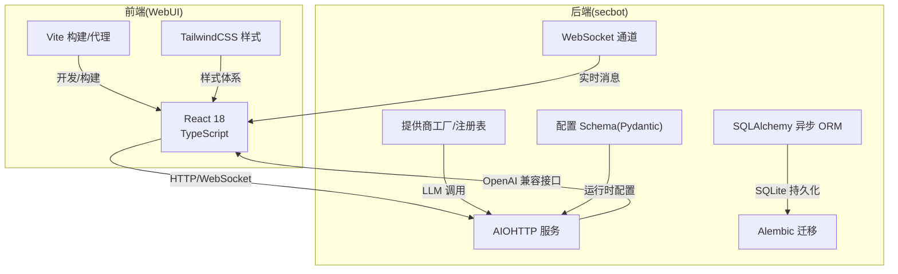
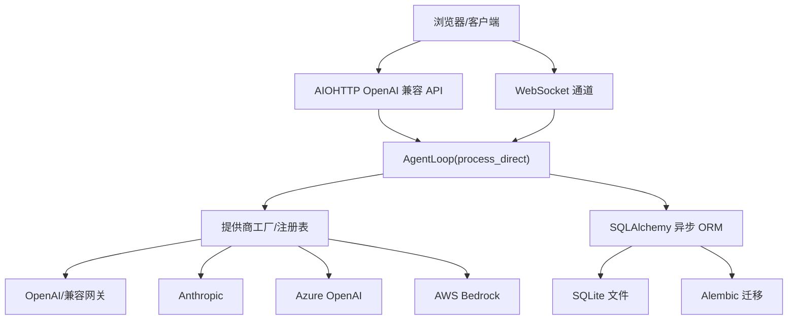
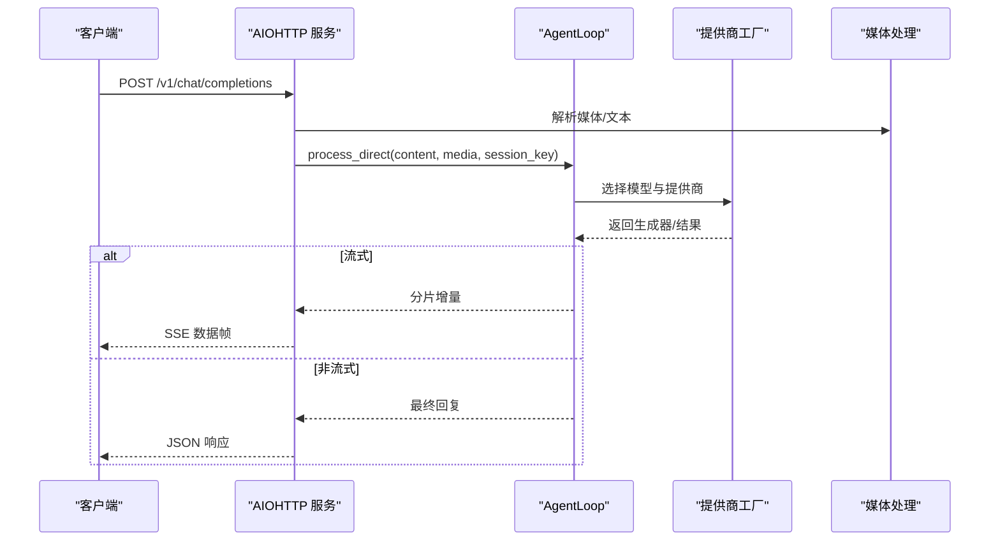
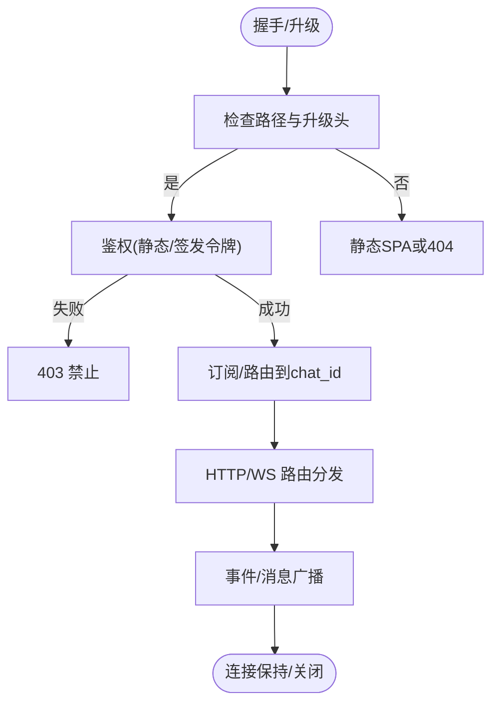
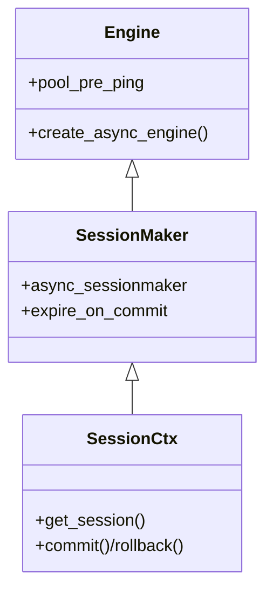
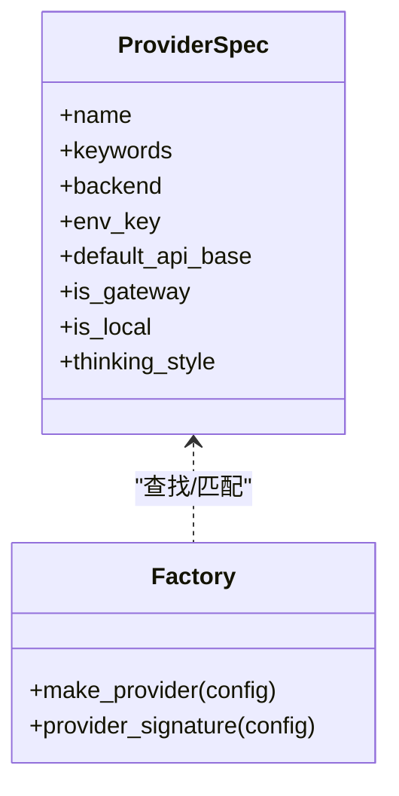
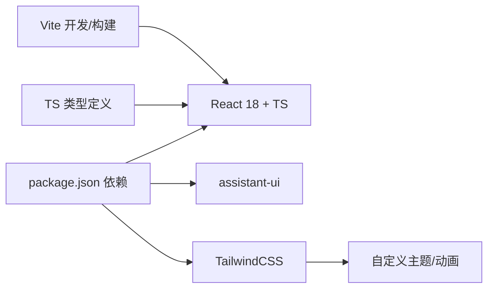
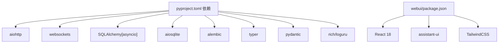

# 技术栈概览

<cite>
**本文档引用的文件**
- [pyproject.toml](file://pyproject.toml)
- [secbot/__init__.py](file://secbot/__init__.py)
- [webui/package.json](file://webui/package.json)
- [webui/tailwind.config.js](file://webui/tailwind.config.js)
- [webui/vite.config.ts](file://webui/vite.config.ts)
- [webui/src/lib/types.ts](file://webui/src/lib/types.ts)
- [secbot/api/server.py](file://secbot/api/server.py)
- [secbot/channels/websocket.py](file://secbot/channels/websocket.py)
- [secbot/cmdb/db.py](file://secbot/cmdb/db.py)
- [secbot/cmdb/models.py](file://secbot/cmdb/models.py)
- [secbot/providers/factory.py](file://secbot/providers/factory.py)
- [secbot/providers/registry.py](file://secbot/providers/registry.py)
- [secbot/config/schema.py](file://secbot/config/schema.py)
</cite>

## 目录
1. [简介](#简介)
2. [项目结构](#项目结构)
3. [核心组件](#核心组件)
4. [架构总览](#架构总览)
5. [详细组件分析](#详细组件分析)
6. [依赖关系分析](#依赖关系分析)
7. [性能考量](#性能考量)
8. [故障排查指南](#故障排查指南)
9. [结论](#结论)
10. [附录](#附录)

## 简介
本技术栈概览面向VAPT3/secbot项目，系统性梳理后端Python与前端React两大技术栈、AI集成方案、数据库与迁移工具、Web服务与WebSocket通信协议，并给出版本要求、功能特性与选型理由，帮助开发者快速理解与上手。

## 项目结构
项目采用“多模块分层 + 功能域划分”的组织方式：
- 后端核心：Python包结构清晰，按领域拆分模块（API、通道、配置、CMDB、提供商工厂、工具等）
- 前端界面：React 18 + TypeScript + Vite构建，TailwindCSS样式体系
- 数据层：SQLite + SQLAlchemy异步ORM + Alembic迁移
- 通信层：AIOHTTP提供OpenAI兼容HTTP API；WebSockets提供实时消息通道
- AI集成：统一通过提供商工厂对接OpenAI、Anthropic、Azure OpenAI、Bedrock、多种网关与本地推理

图表来源
- [webui/package.json:1-67](file://webui/package.json#L1-L67)
- [webui/vite.config.ts:1-66](file://webui/vite.config.ts#L1-L66)
- [webui/tailwind.config.js:1-166](file://webui/tailwind.config.js#L1-L166)
- [secbot/api/server.py:1-401](file://secbot/api/server.py#L1-L401)
- [secbot/channels/websocket.py:1-800](file://secbot/channels/websocket.py#L1-L800)
- [secbot/cmdb/db.py:1-133](file://secbot/cmdb/db.py#L1-L133)
- [secbot/providers/factory.py:1-130](file://secbot/providers/factory.py#L1-L130)
- [secbot/config/schema.py:1-376](file://secbot/config/schema.py#L1-L376)

章节来源
- [pyproject.toml:1-169](file://pyproject.toml#L1-L169)
- [secbot/__init__.py:1-33](file://secbot/__init__.py#L1-L33)

## 核心组件
- Python后端技术栈
  - Typer：命令行入口与CLI子命令
  - FastAPI：未直接使用，但整体架构与FastAPI生态一致（本项目以AIOHTTP为主）
  - Pydantic：配置与数据模型校验
  - SQLAlchemy[asyncio] + aiosqlite：异步ORM与SQLite驱动
  - Alembic：数据库迁移
  - WebSockets + websocket-client：WebSocket服务与客户端
  - aiohttp：OpenAI兼容HTTP API服务
  - 其他：loguru、httpx、rich、croniter、oauth-cli-kit、tiktoken、pyyaml、pypdf等
- React前端技术栈
  - React 18 + TypeScript
  - assistant-ui：对话UI组件库
  - TailwindCSS + 自定义主题
  - Vite：开发与构建工具
  - Radix UI、React Router、i18n、图表库等
- AI集成方案
  - OpenAI、Anthropic、Azure OpenAI、AWS Bedrock、OpenRouter、HuggingFace、DashScope、Gemini、Mistral、StepFun、Minimax、Groq等
  - 统一通过提供商工厂与注册表解析模型名、匹配提供商、注入凭据与参数
- 数据库方案
  - SQLite（默认）+ SQLAlchemy异步引擎 + Alembic迁移
- Web服务与通信
  - AIOHTTP提供/v1/chat/completions与/v1/models
  - WebSockets提供实时消息广播与控制事件

章节来源
- [pyproject.toml:25-68](file://pyproject.toml#L25-L68)
- [webui/package.json:14-45](file://webui/package.json#L14-L45)
- [secbot/providers/factory.py:21-92](file://secbot/providers/factory.py#L21-L92)
- [secbot/providers/registry.py:88-450](file://secbot/providers/registry.py#L88-L450)
- [secbot/cmdb/db.py:64-93](file://secbot/cmdb/db.py#L64-L93)
- [secbot/api/server.py:381-401](file://secbot/api/server.py#L381-L401)
- [secbot/channels/websocket.py:474-548](file://secbot/channels/websocket.py#L474-L548)

## 架构总览
后端通过AIOHTTP提供OpenAI兼容接口，同时WebSocket通道承载实时消息与控制事件；提供商工厂根据配置解析模型与提供商，统一调用不同LLM后端；SQLite配合SQLAlchemy与Alembic实现本地CMDB持久化。

图表来源
- [secbot/api/server.py:194-351](file://secbot/api/server.py#L194-L351)
- [secbot/channels/websocket.py:657-795](file://secbot/channels/websocket.py#L657-L795)
- [secbot/providers/factory.py:21-92](file://secbot/providers/factory.py#L21-L92)
- [secbot/providers/registry.py:88-450](file://secbot/providers/registry.py#L88-L450)
- [secbot/cmdb/db.py:64-123](file://secbot/cmdb/db.py#L64-L123)

## 详细组件分析

### 后端API服务（AIOHTTP）
- 提供/v1/chat/completions与/v1/models，支持JSON与multipart/form-data两种请求体格式
- 支持流式SSE响应与非流式响应
- 请求超时控制、媒体文件解析与保存、会话锁保证并发安全
- 错误处理完善，返回标准OpenAI错误结构

图表来源
- [secbot/api/server.py:194-351](file://secbot/api/server.py#L194-L351)

章节来源
- [secbot/api/server.py:1-401](file://secbot/api/server.py#L1-L401)

### WebSocket通道
- 作为WebSocket服务器，支持令牌签发、鉴权、订阅管理与广播节流
- 提供WebUI引导、会话列表、设置、命令、通知中心、活动事件流等REST接口
- 支持媒体签名URL、静态资源托管、SSL/TLS
- 内置配置校验与安全限制（最大消息大小、允许的MIME类型）

图表来源
- [secbot/channels/websocket.py:657-795](file://secbot/channels/websocket.py#L657-L795)

章节来源
- [secbot/channels/websocket.py:1-800](file://secbot/channels/websocket.py#L1-L800)

### 数据库与迁移（SQLite + SQLAlchemy + Alembic）
- 默认SQLite文件位于用户目录下，支持自定义URL
- 初始化时启用WAL模式、外键约束、连接池预检测
- 提供进程级异步引擎与会话上下文管理
- 使用Alembic进行迁移版本管理

图表来源
- [secbot/cmdb/db.py:64-123](file://secbot/cmdb/db.py#L64-L123)

章节来源
- [secbot/cmdb/db.py:1-133](file://secbot/cmdb/db.py#L1-L133)
- [secbot/cmdb/models.py:1-263](file://secbot/cmdb/models.py#L1-L263)

### AI提供商工厂与注册表
- 工厂根据配置解析模型名，匹配提供商（OpenAI兼容、Anthropic、Azure OpenAI、Bedrock等）
- 注册表集中维护提供商元数据（关键词、环境变量、默认API Base、思考模式注入方式等）
- 支持网关类提供商（如OpenRouter、HuggingFace）与本地部署（Ollama、vLLM、LM Studio等）

图表来源
- [secbot/providers/registry.py:21-82](file://secbot/providers/registry.py#L21-L82)
- [secbot/providers/factory.py:21-92](file://secbot/providers/factory.py#L21-L92)

章节来源
- [secbot/providers/factory.py:1-130](file://secbot/providers/factory.py#L1-L130)
- [secbot/providers/registry.py:1-465](file://secbot/providers/registry.py#L1-L465)
- [secbot/config/schema.py:267-376](file://secbot/config/schema.py#L267-L376)

### 前端技术栈（React 18 + assistant-ui + TailwindCSS）
- 依赖管理：React 18、assistant-ui、Radix UI、i18n、图表库、TailwindCSS等
- 构建与开发：Vite + React插件，开发服务器与WebSocket代理
- 样式体系：TailwindCSS扩展、动画插件、排版插件、自定义主题变量
- 类型定义：统一的消息、事件、通知、活动流等TS类型

图表来源
- [webui/package.json:14-45](file://webui/package.json#L14-L45)
- [webui/vite.config.ts:1-66](file://webui/vite.config.ts#L1-L66)
- [webui/tailwind.config.js:1-166](file://webui/tailwind.config.js#L1-L166)
- [webui/src/lib/types.ts:1-306](file://webui/src/lib/types.ts#L1-L306)

章节来源
- [webui/package.json:1-67](file://webui/package.json#L1-L67)
- [webui/vite.config.ts:1-66](file://webui/vite.config.ts#L1-L66)
- [webui/tailwind.config.js:1-166](file://webui/tailwind.config.js#L1-L166)
- [webui/src/lib/types.ts:1-306](file://webui/src/lib/types.ts#L1-L306)

## 依赖关系分析
- 版本与兼容性
  - Python：>=3.11（项目声明）
  - aiohttp：>=3.9,<4.0（API服务）
  - websockets：>=16,<17（WebSocket服务）
  - SQLAlchemy[asyncio]：>=2.0.30,<3.0（异步ORM）
  - aiosqlite：>=0.20,<1.0（SQLite驱动）
  - alembic：>=1.13,<2.0（迁移）
  - React 18：^18.3.1（前端）
  - assistant-ui：^0.10.0（前端UI）
  - TailwindCSS：^3.4.17（样式）
- 关键依赖耦合
  - API服务与WebSocket服务共享AgentLoop与消息总线
  - 提供商工厂依赖配置Schema与注册表
  - 数据层通过异步会话与迁移工具解耦业务逻辑

图表来源
- [pyproject.toml:25-68](file://pyproject.toml#L25-L68)
- [webui/package.json:14-45](file://webui/package.json#L14-L45)

章节来源
- [pyproject.toml:1-169](file://pyproject.toml#L1-L169)
- [webui/package.json:1-67](file://webui/package.json#L1-L67)

## 性能考量
- 异步优先：后端采用AIOHTTP与SQLAlchemy异步引擎，降低阻塞，提升并发
- 连接优化：SQLite启用WAL与连接池预检测，减少锁竞争
- 广播节流：WebSocket通道对仪表盘聚合事件进行节流，避免频繁更新
- 流式输出：API服务支持SSE流式传输，改善用户体验
- 媒体处理：对上传媒体进行大小限制与MIME白名单校验，兼顾安全性与性能

## 故障排查指南
- API服务常见问题
  - 超时：检查请求超时配置与模型生成耗时
  - 媒体过大：确认文件大小限制与Base64数据URL规范
  - 401/403：核对令牌签发与鉴权策略
- WebSocket通道常见问题
  - 握手失败：确认路径、升级头与鉴权参数
  - 广播异常：检查事件节流与订阅状态
  - 媒体签名URL失效：确认媒体密钥与签名算法
- 数据库问题
  - WAL模式：确保SQLite文件可写且磁盘空间充足
  - 迁移失败：核对Alembic版本与目标数据库兼容性
- 前端问题
  - 代理冲突：确认Vite代理与WebSocket升级路径不冲突
  - 主题样式：检查Tailwind配置与自定义变量是否正确加载

章节来源
- [secbot/api/server.py:200-351](file://secbot/api/server.py#L200-L351)
- [secbot/channels/websocket.py:631-795](file://secbot/channels/websocket.py#L631-L795)
- [secbot/cmdb/db.py:51-93](file://secbot/cmdb/db.py#L51-L93)
- [webui/vite.config.ts:41-58](file://webui/vite.config.ts#L41-L58)

## 结论
本项目在Python后端采用AIOHTTP与异步ORM构建高性能服务，在前端采用React 18与assistant-ui实现现代化交互体验。AI集成通过统一的提供商工厂与注册表实现多源适配，数据库采用SQLite与Alembic保障易用性与可演进性。整体技术栈选型注重一致性、可扩展性与开发效率。

## 附录

### 技术选型与版本要求对照
- Python：>=3.11
- aiohttp：>=3.9,<4.0
- websockets：>=16,<17
- SQLAlchemy[asyncio]：>=2.0.30,<3.0
- aiosqlite：>=0.20,<1.0
- alembic：>=1.13,<2.0
- React 18：^18.3.1
- assistant-ui：^0.10.0
- TailwindCSS：^3.4.17

章节来源
- [pyproject.toml:6-68](file://pyproject.toml#L6-L68)
- [webui/package.json:33-44](file://webui/package.json#L33-L44)