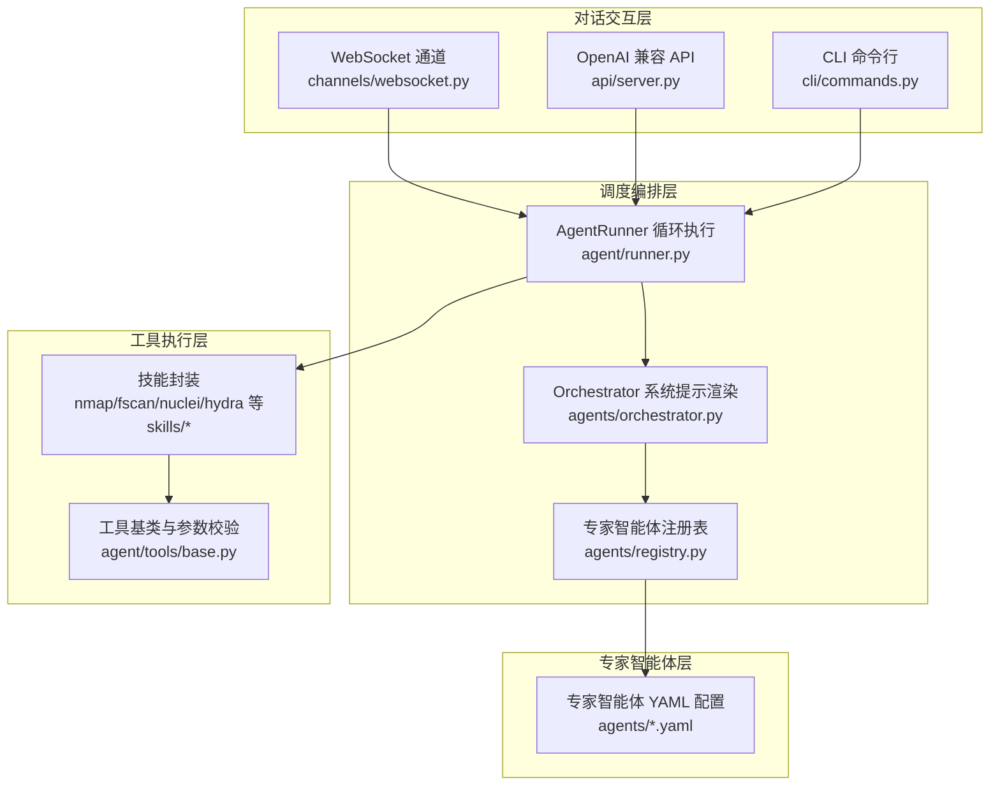
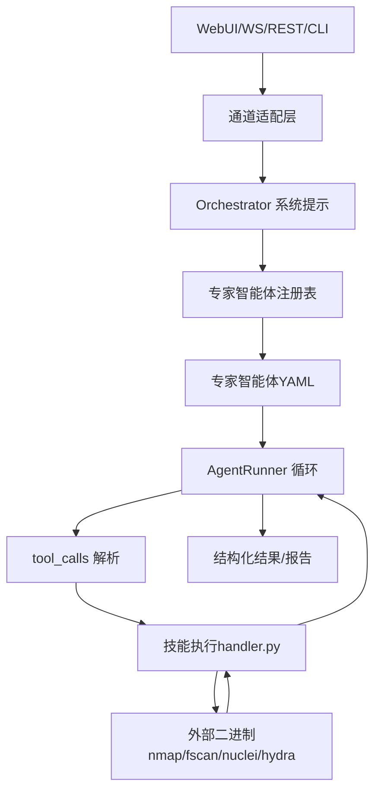
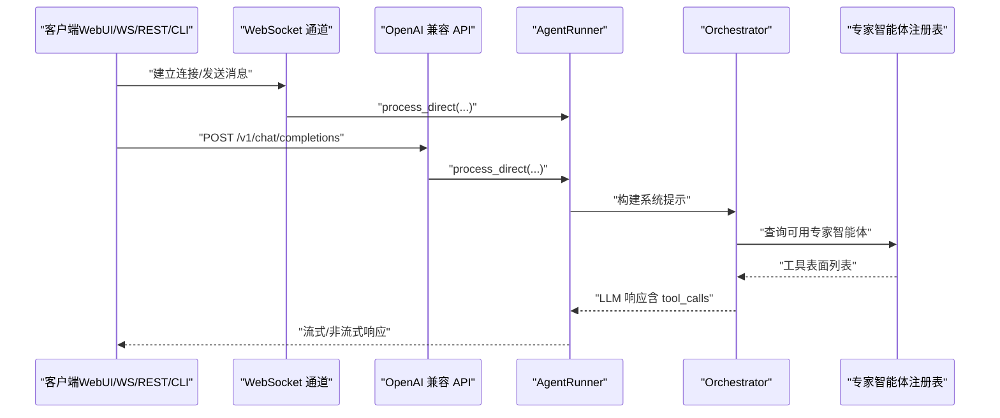
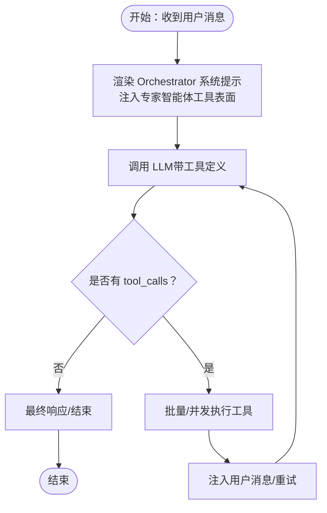
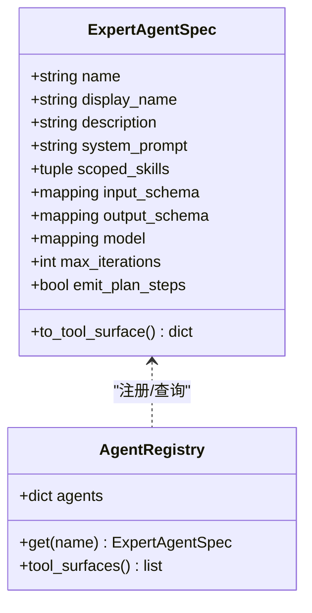
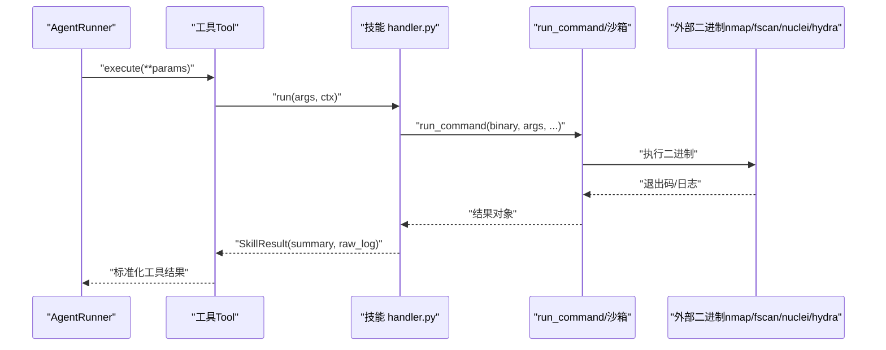
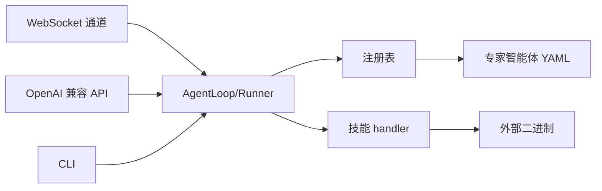

# 架构设计

<cite>
**本文引用的文件**
- [README.md](file://README.md)
- [secbot.py](file://secbot/secbot.py)
- [orchestrator.py](file://secbot/agents/orchestrator.py)
- [registry.py](file://secbot/agents/registry.py)
- [runner.py](file://secbot/agent/runner.py)
- [websocket.py](file://secbot/channels/websocket.py)
- [server.py](file://secbot/api/server.py)
- [commands.py](file://secbot/cli/commands.py)
- [SKILL.md（nmap-host-discovery）](file://secbot/skills/nmap-host-discovery/SKILL.md)
- [handler.py（nmap-host-discovery）](file://secbot/skills/nmap-host-discovery/handler.py)
- [SKILL.md（fscan-port-scan）](file://secbot/skills/fscan-port-scan/SKILL.md)
- [handler.py（fscan-port-scan）](file://secbot/skills/fscan-port-scan/handler.py)
- [base.py（工具基类）](file://secbot/agent/tools/base.py)
</cite>

## 目录
1. [引言](#引言)
2. [项目结构](#项目结构)
3. [核心组件](#核心组件)
4. [架构总览](#架构总览)
5. [详细组件分析](#详细组件分析)
6. [依赖分析](#依赖分析)
7. [性能考量](#性能考量)
8. [故障排查指南](#故障排查指南)
9. [结论](#结论)
10. [附录](#附录)

## 引言
本文件面向 nanobot VAPT3 的“对话交互层-调度编排层-专家智能体层-工具执行层”四层架构，系统化阐述各层职责边界、关键实现与技术选型，解释组件间交互关系与数据流向（尤其是 tool_calls 机制与上下文接力），并总结架构优势与权衡，辅以架构图与代码示例路径，帮助开发者快速理解与落地。

## 项目结构
- 顶层 README 提供总体架构图与四层职责说明，明确对话交互层（WebUI、WebSocket、REST API）、调度编排层（Orchestrator LLM Function Calling）、专家智能体层（可插拔专家智能体池）、工具执行层（安全工具调用）。
- secbot 子模块按层组织：
  - 交互层：channels（WebSocket）、api（OpenAI兼容REST）、cli（终端）、web（静态资源）
  - 编排层：agents/orchestrator、agents/registry、agent/runner
  - 智能体层：agents/*.yaml（专家智能体配置）
  - 工具层：skills/*（技能封装）、agent/tools/*（工具基类与注册）

**图表来源**
- [websocket.py](file://secbot/channels/websocket.py)
- [server.py](file://secbot/api/server.py)
- [commands.py](file://secbot/cli/commands.py)
- [registry.py](file://secbot/agents/registry.py)
- [orchestrator.py](file://secbot/agents/orchestrator.py)
- [runner.py](file://secbot/agent/runner.py)
- [base.py（工具基类）](file://secbot/agent/tools/base.py)

**章节来源**
- [README.md](file://README.md)
- [websocket.py](file://secbot/channels/websocket.py)
- [server.py](file://secbot/api/server.py)
- [commands.py](file://secbot/cli/commands.py)
- [registry.py](file://secbot/agents/registry.py)
- [orchestrator.py](file://secbot/agents/orchestrator.py)
- [runner.py](file://secbot/agent/runner.py)
- [base.py（工具基类）](file://secbot/agent/tools/base.py)

## 核心组件
- 对话交互层
  - WebSocket 通道：提供 WebUI 与后端的双向实时通信，支持令牌签发、媒体文件签名下载、REST 辅助接口。
  - OpenAI 兼容 API：提供 /v1/chat/completions 与 /v1/models，支持 JSON 与 multipart/form-data，内置 SSE 流式输出。
  - CLI：终端交互入口，支持历史、Markdown 渲染、进度提示。
- 调度编排层
  - Orchestrator 系统提示渲染：锁定角色、规则、工作风格，动态注入可用专家智能体表格。
  - 专家智能体注册表：加载 YAML，校验字段与 JSON Schema，生成工具表面（tool surface）。
  - AgentRunner：统一的 LLM 循环执行器，负责消息上下文治理、tool_calls 解析、工具执行、流式回调、重试与注入。
- 专家智能体层
  - 专家智能体 YAML：定义名称、显示名、描述、system_prompt_file、scoped_skills、输入输出 Schema、迭代次数等。
- 工具执行层
  - 技能封装：每个技能包含 SKILL.md（元信息与输入输出说明）与 handler.py（异步执行逻辑），通过 run_command 执行外部二进制，遵循白名单与网络策略。
  - 工具基类：提供参数 Schema 校验、类型转换、只读/并发安全属性等。

**章节来源**
- [README.md](file://README.md)
- [websocket.py](file://secbot/channels/websocket.py)
- [server.py](file://secbot/api/server.py)
- [commands.py](file://secbot/cli/commands.py)
- [orchestrator.py](file://secbot/agents/orchestrator.py)
- [registry.py](file://secbot/agents/registry.py)
- [runner.py](file://secbot/agent/runner.py)
- [SKILL.md（nmap-host-discovery）](file://secbot/skills/nmap-host-discovery/SKILL.md)
- [handler.py（nmap-host-discovery）](file://secbot/skills/nmap-host-discovery/handler.py)
- [SKILL.md（fscan-port-scan）](file://secbot/skills/fscan-port-scan/SKILL.md)
- [handler.py（fscan-port-scan）](file://secbot/skills/fscan-port-scan/handler.py)
- [base.py（工具基类）](file://secbot/agent/tools/base.py)

## 架构总览
四层架构职责清晰、边界明确：
- 对话交互层：负责接入与展示，屏蔽协议差异（WebSocket/REST/CLI）。
- 调度编排层：以 Orchestrator 为核心，结合注册表与 Runner，完成意图解析、DAG 规划、tool_calls 调度与上下文接力。
- 专家智能体层：以 YAML 描述专家能力，解耦提示词、工具集合与 I/O Schema。
- 工具执行层：以技能为单位封装外部二进制调用，统一安全策略与结果解析。

**图表来源**
- [README.md](file://README.md)
- [orchestrator.py](file://secbot/agents/orchestrator.py)
- [registry.py](file://secbot/agents/registry.py)
- [runner.py](file://secbot/agent/runner.py)
- [handler.py（nmap-host-discovery）](file://secbot/skills/nmap-host-discovery/handler.py)
- [handler.py（fscan-port-scan）](file://secbot/skills/fscan-port-scan/handler.py)

## 详细组件分析

### 对话交互层（WebUI/WS/REST/CLI）
- WebSocket 通道
  - 功能要点：握手鉴权、令牌签发（单次/多用）、订阅管理、广播节流、媒体签名下载、REST 辅助端点（会话、设置、报告、仪表盘等）。
  - 关键实现路径：[websocket.py](file://secbot/channels/websocket.py)
- OpenAI 兼容 API
  - 功能要点：/v1/chat/completions 支持 JSON 与 multipart；SSE 流式输出；/v1/models；/health 健康检查。
  - 关键实现路径：[server.py](file://secbot/api/server.py)
- CLI
  - 功能要点：交互式输入、历史记录、Markdown 渲染、进度提示、版本与引导命令。
  - 关键实现路径：[commands.py](file://secbot/cli/commands.py)

**图表来源**
- [websocket.py](file://secbot/channels/websocket.py)
- [server.py](file://secbot/api/server.py)
- [runner.py](file://secbot/agent/runner.py)
- [orchestrator.py](file://secbot/agents/orchestrator.py)
- [registry.py](file://secbot/agents/registry.py)

**章节来源**
- [websocket.py](file://secbot/channels/websocket.py)
- [server.py](file://secbot/api/server.py)
- [commands.py](file://secbot/cli/commands.py)

### 调度编排层（Orchestrator LLM Function Calling）
- Orchestrator 系统提示渲染
  - 锁定角色、硬规则、工作风格，动态注入“可用专家智能体”表格（来自注册表）。
  - 关键实现路径：[orchestrator.py](file://secbot/agents/orchestrator.py)
- 专家智能体注册表
  - 加载 agents/*.yaml，校验必填字段、名称格式、scoped_skills 唯一性、JSON Schema 合法性，生成工具表面（OpenAI function schema）。
  - 关键实现路径：[registry.py](file://secbot/agents/registry.py)
- AgentRunner 循环执行
  - 负责上下文治理（截断、压缩、孤儿 tool 结果清理）、tool_calls 解析、工具执行、流式回调、重试与注入、最大迭代限制、空响应兜底。
  - 关键实现路径：[runner.py](file://secbot/agent/runner.py)

**图表来源**
- [runner.py](file://secbot/agent/runner.py)
- [orchestrator.py](file://secbot/agents/orchestrator.py)
- [registry.py](file://secbot/agents/registry.py)

**章节来源**
- [orchestrator.py](file://secbot/agents/orchestrator.py)
- [registry.py](file://secbot/agents/registry.py)
- [runner.py](file://secbot/agent/runner.py)

### 专家智能体层（可插拔专家智能体池）
- 专家智能体 YAML
  - 字段：name/display_name/description/system_prompt_file/scoped_skills/input_schema/output_schema/model/max_iterations/emit_plan_steps 等。
  - 关键实现路径：[registry.py](file://secbot/agents/registry.py)
- 工具表面生成
  - 将专家智能体规格转换为 LLM 工具定义（OpenAI function schema），供 Orchestrator 注入系统提示。
  - 关键实现路径：[registry.py](file://secbot/agents/registry.py)

**图表来源**
- [registry.py](file://secbot/agents/registry.py)

**章节来源**
- [registry.py](file://secbot/agents/registry.py)

### 工具执行层（安全工具调用）
- 技能封装（以 nmap-host-discovery 为例）
  - SKILL.md：声明 name、display_name、risk_level、category、external_binary、network_egress、expected_runtime_sec 等元信息。
  - handler.py：参数校验、run_command 调用外部二进制、解析原始日志、返回 SkillResult（summary/raw_log_path）。
  - 关键实现路径：
    - [SKILL.md（nmap-host-discovery）](file://secbot/skills/nmap-host-discovery/SKILL.md)
    - [handler.py（nmap-host-discovery）](file://secbot/skills/nmap-host-discovery/handler.py)
- 技能封装（以 fscan-port-scan 为例）
  - handler.py：参数校验、execute 封装、正则解析输出、返回 SkillResult。
  - 关键实现路径：
    - [SKILL.md（fscan-port-scan）](file://secbot/skills/fscan-port-scan/SKILL.md)
    - [handler.py（fscan-port-scan）](file://secbot/skills/fscan-port-scan/handler.py)
- 工具基类与参数校验
  - 提供 JSON Schema 校验、类型转换、只读/并发安全属性等。
  - 关键实现路径：[base.py（工具基类）](file://secbot/agent/tools/base.py)

**图表来源**
- [runner.py](file://secbot/agent/runner.py)
- [handler.py（nmap-host-discovery）](file://secbot/skills/nmap-host-discovery/handler.py)
- [handler.py（fscan-port-scan）](file://secbot/skills/fscan-port-scan/handler.py)
- [base.py（工具基类）](file://secbot/agent/tools/base.py)

**章节来源**
- [SKILL.md（nmap-host-discovery）](file://secbot/skills/nmap-host-discovery/SKILL.md)
- [handler.py（nmap-host-discovery）](file://secbot/skills/nmap-host-discovery/handler.py)
- [SKILL.md（fscan-port-scan）](file://secbot/skills/fscan-port-scan/SKILL.md)
- [handler.py（fscan-port-scan）](file://secbot/skills/fscan-port-scan/handler.py)
- [base.py（工具基类）](file://secbot/agent/tools/base.py)

## 依赖分析
- 组件耦合与内聚
  - 交互层与编排层通过 AgentLoop/Runner 解耦：交互层只负责消息路由，编排层专注 LLM 与工具调度。
  - 编排层与智能体层通过注册表解耦：注册表统一生成工具表面，Orchestrator 仅消费。
  - 智能体层与工具层通过技能 handler 解耦：技能封装外部二进制，工具基类提供参数校验与类型转换。
- 外部依赖与集成点
  - LLM 提供商工厂：根据配置选择具体提供商与模型。
  - WebSocket/aiohttp：分别提供实时通道与 REST API。
  - 外部二进制：nmap/fscan/nuclei/hydra 等，经白名单与网络策略约束。
- 潜在循环依赖
  - 当前结构以“注册表→智能体→Runner→工具”单向流动为主，未见明显循环依赖。

**图表来源**
- [websocket.py](file://secbot/channels/websocket.py)
- [server.py](file://secbot/api/server.py)
- [commands.py](file://secbot/cli/commands.py)
- [runner.py](file://secbot/agent/runner.py)
- [registry.py](file://secbot/agents/registry.py)
- [handler.py（nmap-host-discovery）](file://secbot/skills/nmap-host-discovery/handler.py)

**章节来源**
- [websocket.py](file://secbot/channels/websocket.py)
- [server.py](file://secbot/api/server.py)
- [commands.py](file://secbot/cli/commands.py)
- [runner.py](file://secbot/agent/runner.py)
- [registry.py](file://secbot/agents/registry.py)
- [handler.py（nmap-host-discovery）](file://secbot/skills/nmap-host-discovery/handler.py)

## 性能考量
- 并发与批处理
  - Runner 支持并发工具执行（concurrent_tools），在 batch 内并行，减少端到端时延。
- 上下文治理
  - 截断、压缩、孤儿结果清理与长度恢复，避免历史膨胀导致的延迟与超限。
- 流式输出
  - WebSocket 与 API 均支持流式增量输出，改善用户体验。
- 工具执行优化
  - 技能 handler 内部解析与超时控制，避免长时间阻塞。
- 可扩展性
  - 新增专家智能体仅需 YAML 与可选 handler，注册表自动校验与注入；新增工具需满足白名单与 PATH 要求。

[本节为通用指导，不直接分析具体文件]

## 故障排查指南
- WebSocket/REST 无法连接
  - 检查通道配置（host/port/token_requirement）、端口占用与防火墙。
  - 参考路径：[websocket.py](file://secbot/channels/websocket.py)
- API 请求超时或空响应
  - 调整 request_timeout，检查 LLM 提供商可用性与模型名称一致性。
  - 参考路径：[server.py](file://secbot/api/server.py)
- 工具执行失败
  - 确认 external_binary 在 PATH，且在白名单中；检查 risk_level 与网络策略；查看 raw_log 定位问题。
  - 参考路径：
    - [SKILL.md（nmap-host-discovery）](file://secbot/skills/nmap-host-discovery/SKILL.md)
    - [handler.py（nmap-host-discovery）](file://secbot/skills/nmap-host-discovery/handler.py)
    - [SKILL.md（fscan-port-scan）](file://secbot/skills/fscan-port-scan/SKILL.md)
    - [handler.py（fscan-port-scan）](file://secbot/skills/fscan-port-scan/handler.py)
- 参数校验失败
  - 检查 JSON Schema 与类型转换，必要时使用工具基类提供的 cast/validate。
  - 参考路径：[base.py（工具基类）](file://secbot/agent/tools/base.py)

**章节来源**
- [websocket.py](file://secbot/channels/websocket.py)
- [server.py](file://secbot/api/server.py)
- [SKILL.md（nmap-host-discovery）](file://secbot/skills/nmap-host-discovery/SKILL.md)
- [handler.py（nmap-host-discovery）](file://secbot/skills/nmap-host-discovery/handler.py)
- [SKILL.md（fscan-port-scan）](file://secbot/skills/fscan-port-scan/SKILL.md)
- [handler.py（fscan-port-scan）](file://secbot/skills/fscan-port-scan/handler.py)
- [base.py（工具基类）](file://secbot/agent/tools/base.py)

## 结论
nanobot VAPT3 的四层架构以“对话交互层-调度编排层-专家智能体层-工具执行层”为主线，实现了从意图到行动的闭环：交互层统一接入，编排层以 Orchestrator 与 Runner 为核心完成规划与执行，智能体层通过 YAML 与注册表实现可插拔扩展，工具层通过技能封装与沙箱策略保障安全与可控。整体设计具备良好的模块化、可扩展性与安全性，适合在受控环境下开展自动化安全评估与报告生成。

[本节为总结性内容，不直接分析具体文件]

## 附录
- 快速开始与入口
  - CLI：secbot agent
  - OpenAI 兼容 API：secbot serve
  - WebUI/网关：secbot gateway
  - 参考路径：[README.md](file://README.md)
- 程序化入口
  - Secbot Facade：从配置创建 AgentLoop，提供 run 方法。
  - 参考路径：[secbot.py](file://secbot/secbot.py)

**章节来源**
- [README.md](file://README.md)
- [secbot.py](file://secbot/secbot.py)