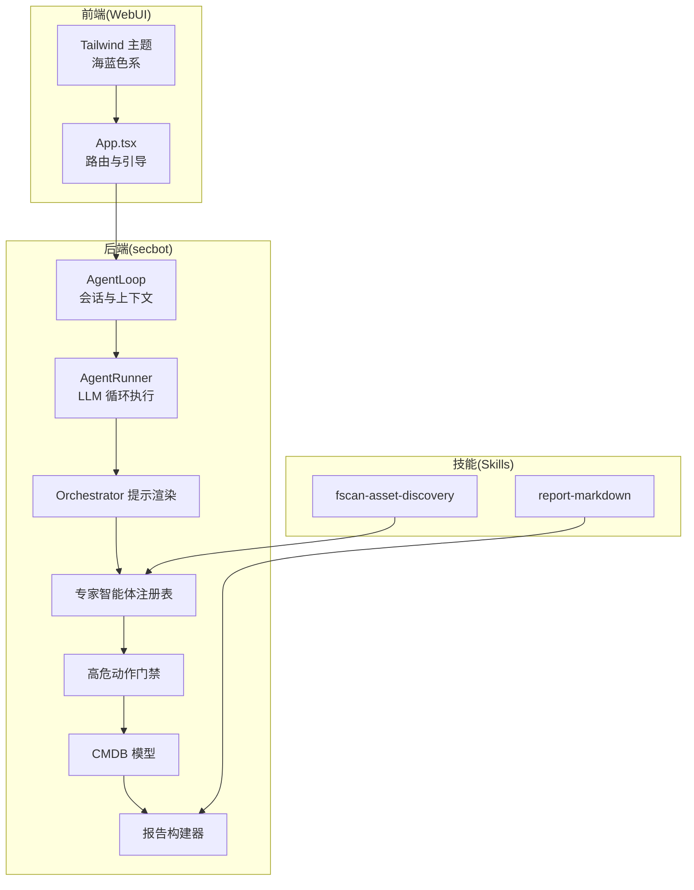
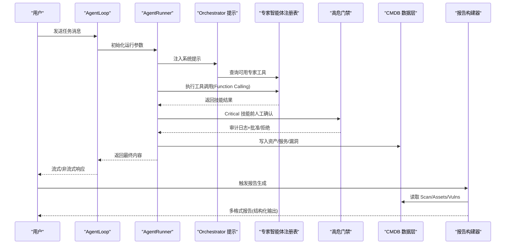
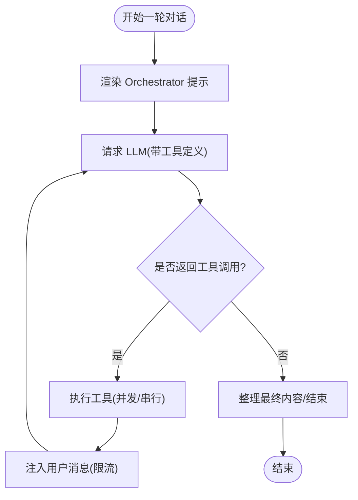
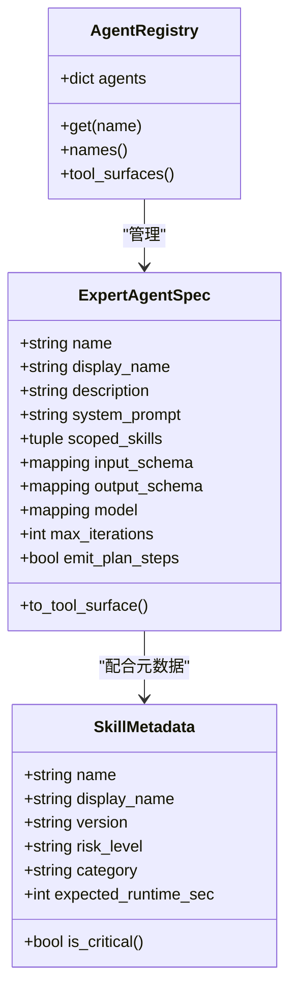
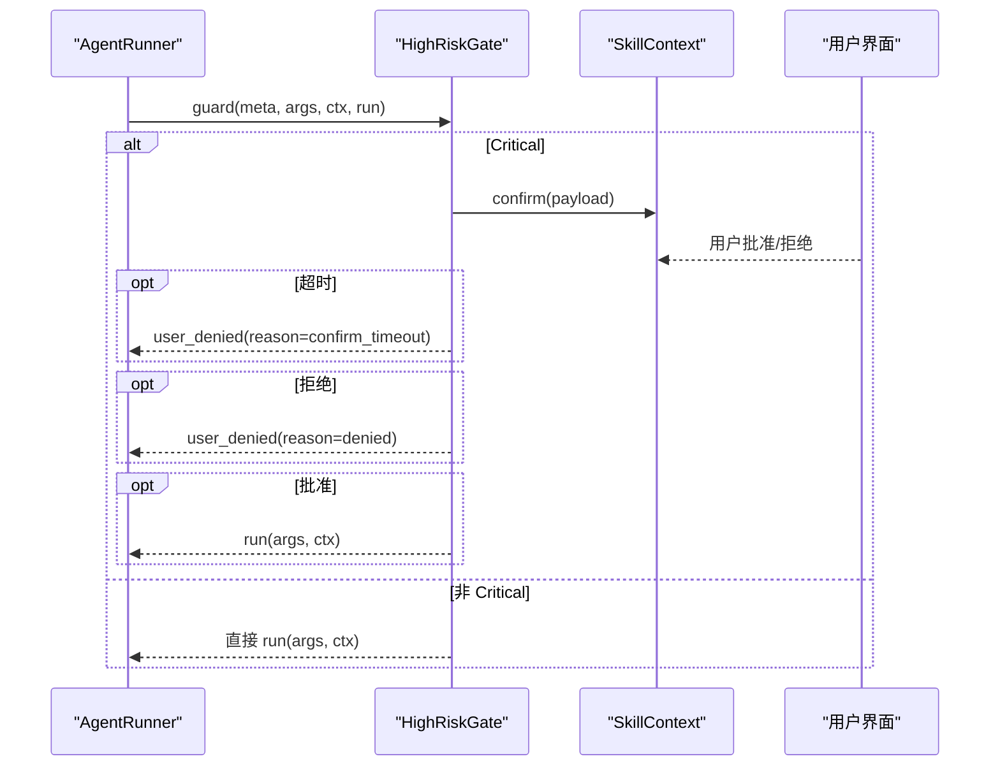
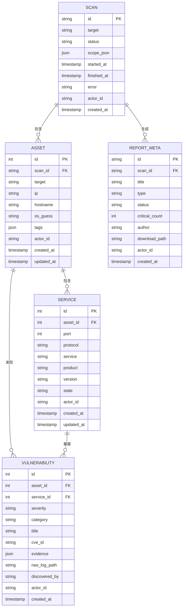
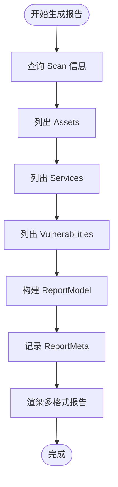
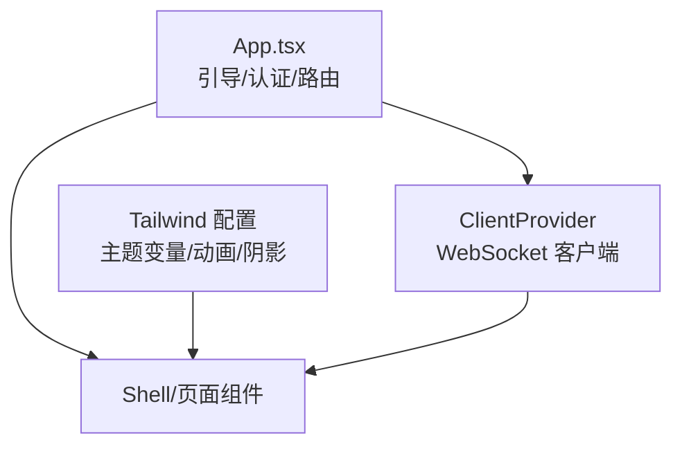
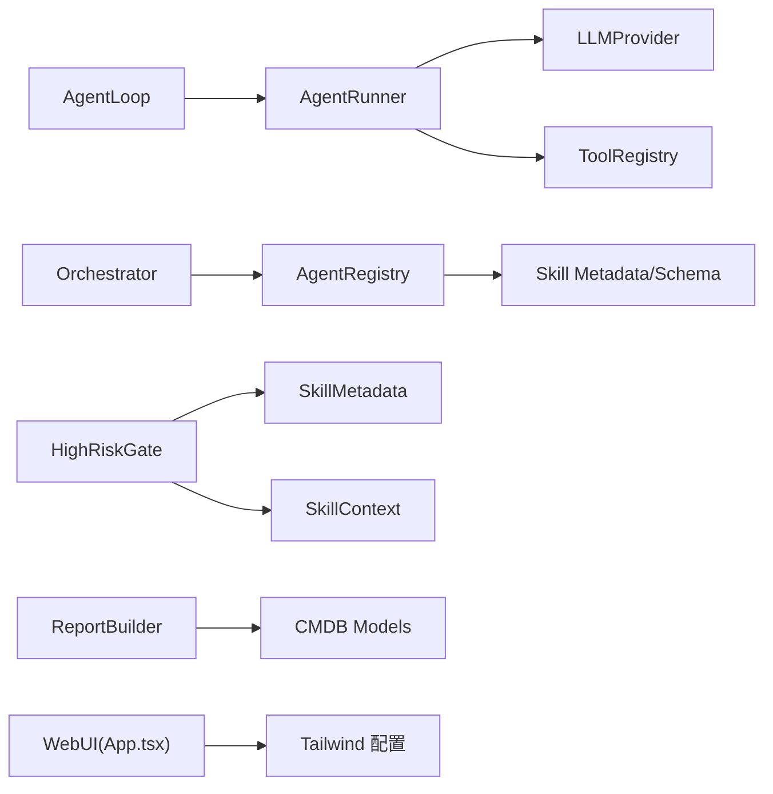

# 核心特性

<cite>
**本文引用的文件**
- [secbot/secbot.py](file://secbot/secbot.py)
- [secbot/agents/orchestrator.py](file://secbot/agents/orchestrator.py)
- [secbot/agents/registry.py](file://secbot/agents/registry.py)
- [secbot/agent/runner.py](file://secbot/agent/runner.py)
- [secbot/agents/high_risk.py](file://secbot/agents/high_risk.py)
- [secbot/skills/metadata.py](file://secbot/skills/metadata.py)
- [secbot/skills/types.py](file://secbot/skills/types.py)
- [secbot/cmdb/models.py](file://secbot/cmdb/models.py)
- [secbot/report/builder.py](file://secbot/report/builder.py)
- [secbot/skills/fscan-asset-discovery/SKILL.md](file://secbot/skills/fscan-asset-discovery/SKILL.md)
- [secbot/skills/fscan-asset-discovery/input.schema.json](file://secbot/skills/fscan-asset-discovery/input.schema.json)
- [secbot/skills/fscan-asset-discovery/output.schema.json](file://secbot/skills/fscan-asset-discovery/output.schema.json)
- [secbot/skills/report-markdown/SKILL.md](file://secbot/skills/report-markdown/SKILL.md)
- [webui/src/App.tsx](file://webui/src/App.tsx)
- [webui/tailwind.config.js](file://webui/tailwind.config.js)
</cite>

## 目录
1. [引言](#引言)
2. [项目结构](#项目结构)
3. [核心组件](#核心组件)
4. [架构总览](#架构总览)
5. [详细组件分析](#详细组件分析)
6. [依赖分析](#依赖分析)
7. [性能考虑](#性能考虑)
8. [故障排查指南](#故障排查指南)
9. [结论](#结论)
10. [附录](#附录)

## 引言
本文件聚焦 nanobot VAPT3 的核心特性与实现原理，围绕以下主题展开：对话即调度（Orchestrator 动态规划与 LLM Function Calling）、专家智能体池（提示词/工具集/输入输出 Schema 解耦）、高危动作护栏（人工确认节点与全链路审计）、CMDB 资产库统一建模、一键 VAPT 报告生成（多格式与结构化输出）、以及海蓝主题 WebUI 的 AI 原生交互体验。文档以代码级分析为基础，辅以图示与来源标注，帮助开发者快速理解并扩展系统。

## 项目结构
- 后端核心位于 secbot 包，包含代理运行时、专家智能体注册表、Orchestrator 提示渲染、高危动作门禁、CMDB 模型与报告构建器等。
- 技能（Skills）位于 secbot/skills 下，每个技能以 YAML Front Matter 描述元数据，配合输入/输出 JSON Schema 实现强约束解耦。
- WebUI 位于 webui，采用 React + TailwindCSS，提供海蓝色主题与 AI 原生交互体验。

**图表来源**
- [secbot/secbot.py:33-91](file://secbot/secbot.py#L33-L91)
- [secbot/agent/runner.py:234-567](file://secbot/agent/runner.py#L234-L567)
- [secbot/agents/orchestrator.py:52-69](file://secbot/agents/orchestrator.py#L52-L69)
- [secbot/agents/registry.py:65-92](file://secbot/agents/registry.py#L65-L92)
- [secbot/agents/high_risk.py:94-139](file://secbot/agents/high_risk.py#L94-L139)
- [secbot/cmdb/models.py:38-263](file://secbot/cmdb/models.py#L38-L263)
- [secbot/report/builder.py:90-230](file://secbot/report/builder.py#L90-L230)
- [webui/src/App.tsx:54-232](file://webui/src/App.tsx#L54-L232)
- [webui/tailwind.config.js:51-121](file://webui/tailwind.config.js#L51-L121)

**章节来源**
- [secbot/secbot.py:33-91](file://secbot/secbot.py#L33-L91)
- [webui/src/App.tsx:54-232](file://webui/src/App.tsx#L54-L232)

## 核心组件
- 对话即调度：由 AgentLoop 将用户消息交由 AgentRunner 驱动 LLM，结合 Orchestrator 系统提示与专家智能体注册表，通过 Function Calling 动态规划任务流。
- 专家智能体池：每个专家智能体以 YAML 定义，含系统提示、输入/输出 JSON Schema、限定技能集合，注册表校验并生成工具表面，实现完全解耦。
- 高危动作护栏：Critical 级技能在执行前触发人工确认，记录审计日志，超时或拒绝均受控处理。
- CMDB 统一建模：以 SQLAlchemy ORM 定义 Scan/Asset/Service/Vulnerability/ReportMeta 等表，统一资产、服务、漏洞与报告元数据。
- 一键 VAPT 报告：从 CMDB 构建结构化 ReportModel，支持多种格式渲染与持久化。
- 海蓝主题 WebUI：基于 TailwindCSS 的海洋蓝配色体系与动画，提供流畅的 AI 原生交互体验。

**章节来源**
- [secbot/agent/runner.py:234-567](file://secbot/agent/runner.py#L234-L567)
- [secbot/agents/orchestrator.py:52-69](file://secbot/agents/orchestrator.py#L52-L69)
- [secbot/agents/registry.py:65-92](file://secbot/agents/registry.py#L65-L92)
- [secbot/agents/high_risk.py:94-139](file://secbot/agents/high_risk.py#L94-L139)
- [secbot/cmdb/models.py:38-263](file://secbot/cmdb/models.py#L38-L263)
- [secbot/report/builder.py:90-230](file://secbot/report/builder.py#L90-L230)
- [webui/tailwind.config.js:51-121](file://webui/tailwind.config.js#L51-L121)

## 架构总览
下图展示从用户请求到最终报告的关键路径：AgentLoop 接入消息，AgentRunner 驱动 LLM 并按需调用工具；Orchestrator 渲染系统提示并选择专家智能体；专家智能体执行后写入 CMDB；报告构建器聚合数据并生成报告。

**图表来源**
- [secbot/secbot.py:93-124](file://secbot/secbot.py#L93-L124)
- [secbot/agent/runner.py:234-567](file://secbot/agent/runner.py#L234-L567)
- [secbot/agents/orchestrator.py:52-69](file://secbot/agents/orchestrator.py#L52-L69)
- [secbot/agents/registry.py:65-92](file://secbot/agents/registry.py#L65-L92)
- [secbot/agents/high_risk.py:103-139](file://secbot/agents/high_risk.py#L103-L139)
- [secbot/cmdb/models.py:38-263](file://secbot/cmdb/models.py#L38-L263)
- [secbot/report/builder.py:90-230](file://secbot/report/builder.py#L90-L230)

## 详细组件分析

### 对话即调度：Orchestrator 与 LLM Function Calling
- Orchestrator 提示由“角色/硬规则/可用专家/工作风格”四段锁定组成，其中“可用专家”表格由注册表动态生成，确保提示稳定可复现。
- AgentRunner 在每轮迭代中根据 LLM 的工具调用列表执行工具，支持并发批处理、注入消息、长度恢复与最大迭代保护。
- AgentLoop 将配置注入 Runner，统一上下文窗口、工具限制、重试策略与会话管理。

**图表来源**
- [secbot/agents/orchestrator.py:52-69](file://secbot/agents/orchestrator.py#L52-L69)
- [secbot/agent/runner.py:234-567](file://secbot/agent/runner.py#L234-L567)

**章节来源**
- [secbot/agents/orchestrator.py:52-69](file://secbot/agents/orchestrator.py#L52-L69)
- [secbot/agent/runner.py:234-567](file://secbot/agent/runner.py#L234-L567)
- [secbot/secbot.py:93-124](file://secbot/secbot.py#L93-L124)

### 专家智能体池：提示词/工具集/输入输出 Schema 解耦
- 专家智能体以 YAML 定义，字段包括 name/display_name/description/system_prompt_file/scoped_skills/input_schema/output_schema 等，注册表负责加载、校验与生成工具表面。
- 每个专家智能体的输入/输出通过 JSON Schema 约束，确保调用方与执行方契约一致，避免类型与范围错误。
- 元数据解析来自 SKILL.md Front Matter，包含风险等级、网络策略、预期耗时等，用于门禁与 UI 展示。

**图表来源**
- [secbot/agents/registry.py:37-92](file://secbot/agents/registry.py#L37-L92)
- [secbot/skills/metadata.py:23-38](file://secbot/skills/metadata.py#L23-L38)

**章节来源**
- [secbot/agents/registry.py:99-248](file://secbot/agents/registry.py#L99-L248)
- [secbot/skills/metadata.py:56-147](file://secbot/skills/metadata.py#L56-L147)
- [secbot/skills/fscan-asset-discovery/SKILL.md:1-15](file://secbot/skills/fscan-asset-discovery/SKILL.md#L1-L15)
- [secbot/skills/fscan-asset-discovery/input.schema.json:1-10](file://secbot/skills/fscan-asset-discovery/input.schema.json#L1-L10)
- [secbot/skills/fscan-asset-discovery/output.schema.json:1-11](file://secbot/skills/fscan-asset-discovery/output.schema.json#L1-L11)

### 高危动作护栏：人工确认节点与全链路审计
- Critical 级技能在执行前由高危门禁拦截，构造结构化确认载荷并通过上下文 confirm 接口阻塞等待用户决策。
- 审计日志记录 confirm_request/confirm_approve/confirm_deny/confirm_timeout 等事件，支持超时自动拒绝与失败安全。
- 门禁与注册表/元数据协同，确保所有技能的风险级别与行为受控。

**图表来源**
- [secbot/agents/high_risk.py:103-139](file://secbot/agents/high_risk.py#L103-L139)
- [secbot/skills/types.py:57-87](file://secbot/skills/types.py#L57-L87)

**章节来源**
- [secbot/agents/high_risk.py:94-139](file://secbot/agents/high_risk.py#L94-L139)
- [secbot/skills/types.py:57-87](file://secbot/skills/types.py#L57-L87)

### CMDB 资产库：统一建模与状态机
- 表结构覆盖 Scan/Asset/Service/Vulnerability/ReportMeta，支持多租户 actor_id、索引优化与外键约束。
- 资产标签保留 reserved 字段（如 system/type），同时允许自由扩展；漏洞分类与严重性枚举集中定义，便于聚合与仪表盘展示。
- 报告元数据独立存储，支持状态流转与下载路径记录。

**图表来源**
- [secbot/cmdb/models.py:38-263](file://secbot/cmdb/models.py#L38-L263)

**章节来源**
- [secbot/cmdb/models.py:38-263](file://secbot/cmdb/models.py#L38-L263)

### 一键 VAPT 报告生成：多格式与结构化输出
- 报告模型 ReportModel 由扫描 ID 聚合资产、服务与漏洞，计算严重性计数与摘要信息。
- 报告构建器从 CMDB 一次性查询并组装结构化数据，随后记录 ReportMeta 到数据库，保证渲染成功后再落库。
- 报告技能（如 Markdown/Docx/PDF）仅负责渲染与落盘，不参与模型构建，职责清晰。

**图表来源**
- [secbot/report/builder.py:90-230](file://secbot/report/builder.py#L90-L230)
- [secbot/cmdb/models.py:177-219](file://secbot/cmdb/models.py#L177-L219)

**章节来源**
- [secbot/report/builder.py:90-230](file://secbot/report/builder.py#L90-L230)
- [secbot/skills/report-markdown/SKILL.md:1-15](file://secbot/skills/report-markdown/SKILL.md#L1-L15)

### 海蓝主题 WebUI：AI 原生交互体验
- App.tsx 负责引导流程、认证与客户端连接，支持模板模式路由与登录页分离。
- Tailwind 配置定义了海洋蓝(ocean)、警示色(alert)、严重性色(severity)等主题变量，提供动画与阴影增强的视觉反馈。
- UI 支持国际化、暗色模式与无障碍字体栈，强调在安全场景下的可读性与一致性。

**图表来源**
- [webui/src/App.tsx:54-232](file://webui/src/App.tsx#L54-L232)
- [webui/tailwind.config.js:51-121](file://webui/tailwind.config.js#L51-L121)

**章节来源**
- [webui/src/App.tsx:54-232](file://webui/src/App.tsx#L54-L232)
- [webui/tailwind.config.js:51-121](file://webui/tailwind.config.js#L51-L121)

## 依赖分析
- AgentLoop 依赖 MessageBus、LLM Provider 与工具配置，统一会话与上下文。
- AgentRunner 依赖 LLMProvider 与 ToolRegistry，负责循环执行、工具批处理与注入消息。
- Orchestrator 依赖 AgentRegistry 生成工具表面，提示稳定且可快照。
- 高危门禁依赖 SkillMetadata 与 SkillContext，确保 Critical 技能受控。
- 报告构建器依赖 CMDB 仓库方法，聚合数据并记录元数据。
- WebUI 依赖 Tailwind 变量与路由，提供一致的主题与导航。

**图表来源**
- [secbot/secbot.py:65-91](file://secbot/secbot.py#L65-L91)
- [secbot/agent/runner.py:103-105](file://secbot/agent/runner.py#L103-L105)
- [secbot/agents/orchestrator.py:52-69](file://secbot/agents/orchestrator.py#L52-L69)
- [secbot/agents/registry.py:65-92](file://secbot/agents/registry.py#L65-L92)
- [secbot/agents/high_risk.py:103-139](file://secbot/agents/high_risk.py#L103-L139)
- [secbot/report/builder.py:90-230](file://secbot/report/builder.py#L90-L230)
- [webui/src/App.tsx:54-232](file://webui/src/App.tsx#L54-L232)
- [webui/tailwind.config.js:51-121](file://webui/tailwind.config.js#L51-L121)

**章节来源**
- [secbot/secbot.py:65-91](file://secbot/secbot.py#L65-L91)
- [secbot/agent/runner.py:103-105](file://secbot/agent/runner.py#L103-L105)

## 性能考虑
- 上下文治理：Runner 在每轮迭代中进行微紧凑、预算裁剪与历史截断，避免越界与重复外部查找。
- 工具批处理：支持并发执行工具批次，减少往返延迟；遇到 AskUserInterrupt 时提前短路。
- LLM 超时与重试：默认有限超时，防止会话阻塞；提供进度增量流与最终化重试，提升鲁棒性。
- CMDB 查询：报告构建器分步查询并聚合，设置上限避免大扫描导致内存压力。

**章节来源**
- [secbot/agent/runner.py:251-567](file://secbot/agent/runner.py#L251-L567)
- [secbot/report/builder.py:90-181](file://secbot/report/builder.py#L90-L181)

## 故障排查指南
- 无响应/空回复：检查最大迭代限制与空回复重试次数；必要时启用最终化重试。
- 工具错误/权限问题：查看工具事件详情与违规计数；关注工作区越界与重复外部查找防护。
- 高危确认超时：确认 UI 是否正确显示确认弹窗；检查超时阈值与审计日志。
- 报告生成失败：确认 CMDB 中 Scan/Assets/Vulns 是否存在；检查 ReportMeta 记录是否写入。

**章节来源**
- [secbot/agent/runner.py:477-567](file://secbot/agent/runner.py#L477-L567)
- [secbot/agents/high_risk.py:122-139](file://secbot/agents/high_risk.py#L122-L139)
- [secbot/report/builder.py:183-230](file://secbot/report/builder.py#L183-L230)

## 结论
nanobot VAPT3 通过“对话即调度 + 专家智能体池 + 高危护栏 + CMDB 统建模 + 一键报告 + 海蓝 WebUI”的组合，实现了从资产发现、端口扫描、漏洞检测到报告生成的全链路自动化与可控化。其强约束的输入输出 Schema 与稳定的 Orchestrator 提示，确保了系统在复杂任务中的可维护性与可扩展性；而高危护栏与全链路审计则提供了安全运营所需的人机协作与合规保障。

## 附录
- 使用场景建议
  - 资产发现：使用 fscan-asset-discovery 技能，目标为网段或域名，输入遵循 JSON Schema。
  - 报告生成：在扫描完成后，调用报告技能渲染 Markdown/Docx/PDF，输出结构化摘要与原始日志路径。
  - 专家扩展：新增专家智能体时，严格编写 SKILL.md 与输入/输出 Schema，确保注册表校验通过。

**章节来源**
- [secbot/skills/fscan-asset-discovery/SKILL.md:1-15](file://secbot/skills/fscan-asset-discovery/SKILL.md#L1-L15)
- [secbot/skills/fscan-asset-discovery/input.schema.json:1-10](file://secbot/skills/fscan-asset-discovery/input.schema.json#L1-L10)
- [secbot/skills/fscan-asset-discovery/output.schema.json:1-11](file://secbot/skills/fscan-asset-discovery/output.schema.json#L1-L11)
- [secbot/skills/report-markdown/SKILL.md:1-15](file://secbot/skills/report-markdown/SKILL.md#L1-L15)