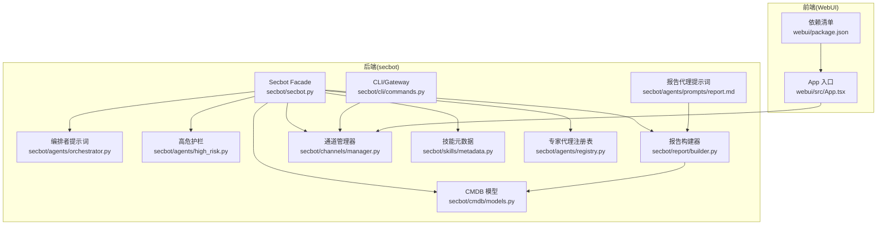
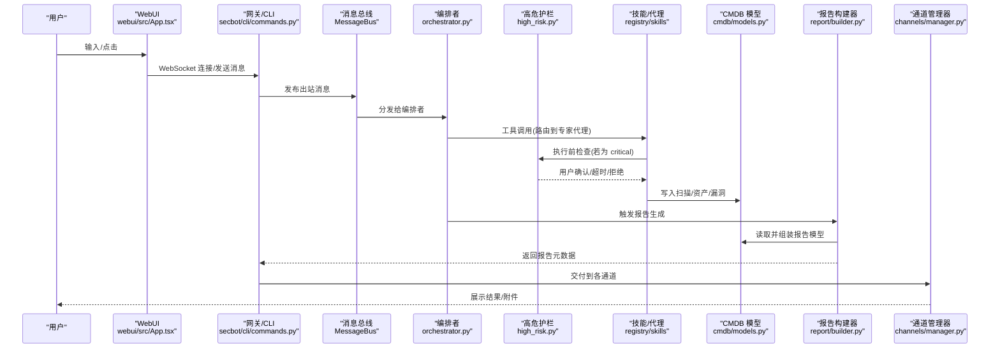
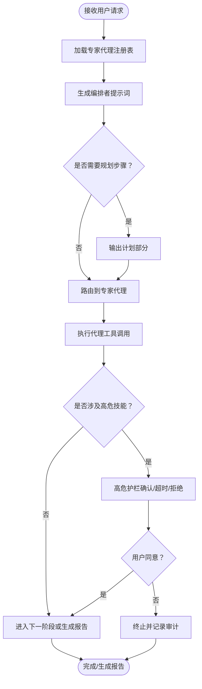
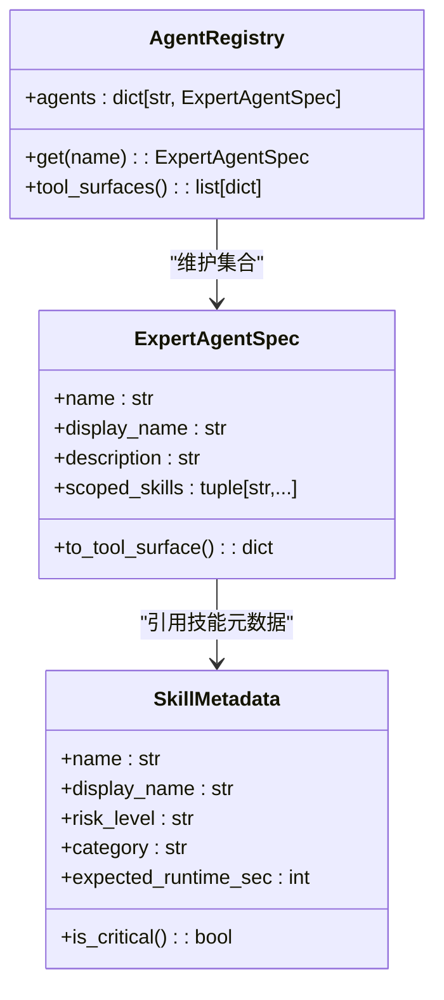
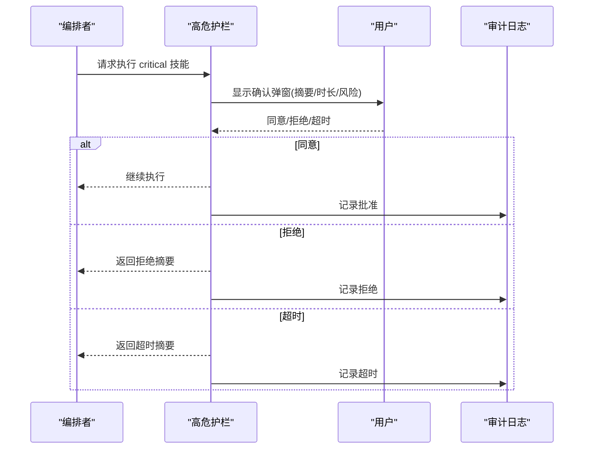
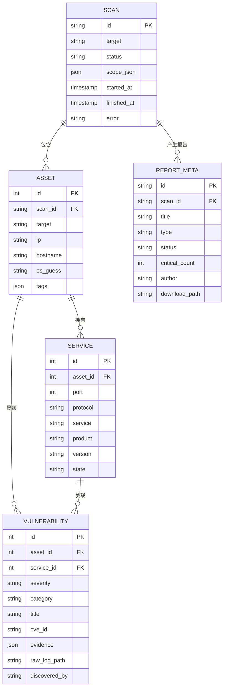
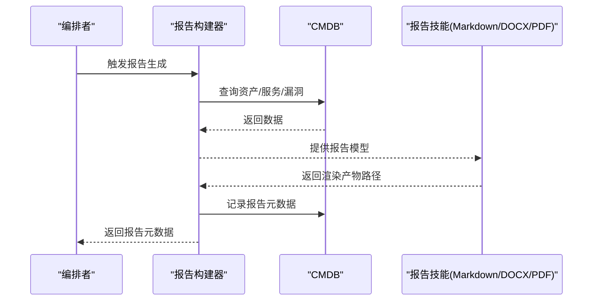
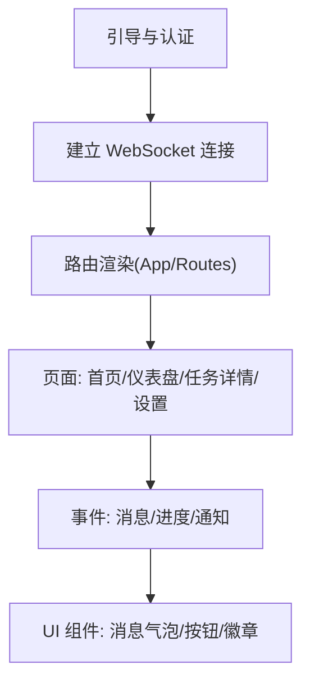
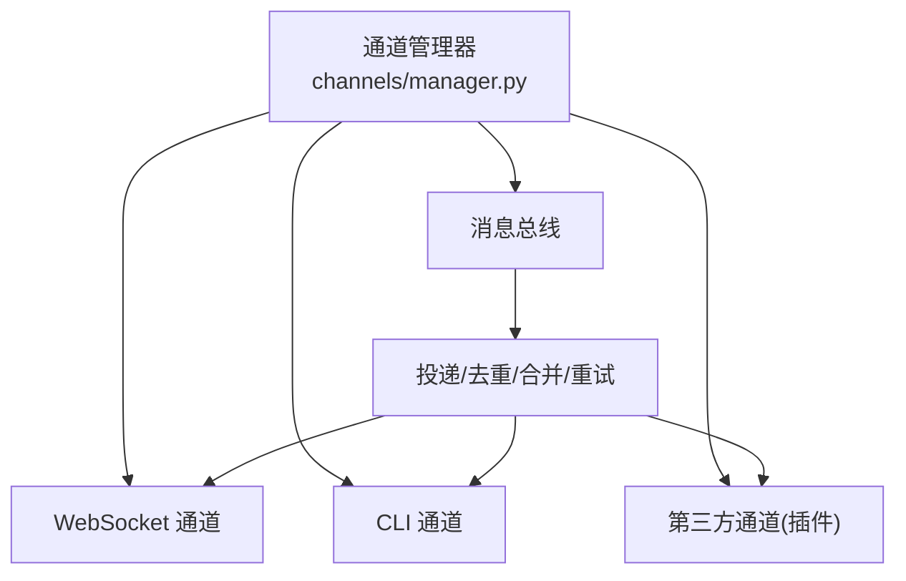
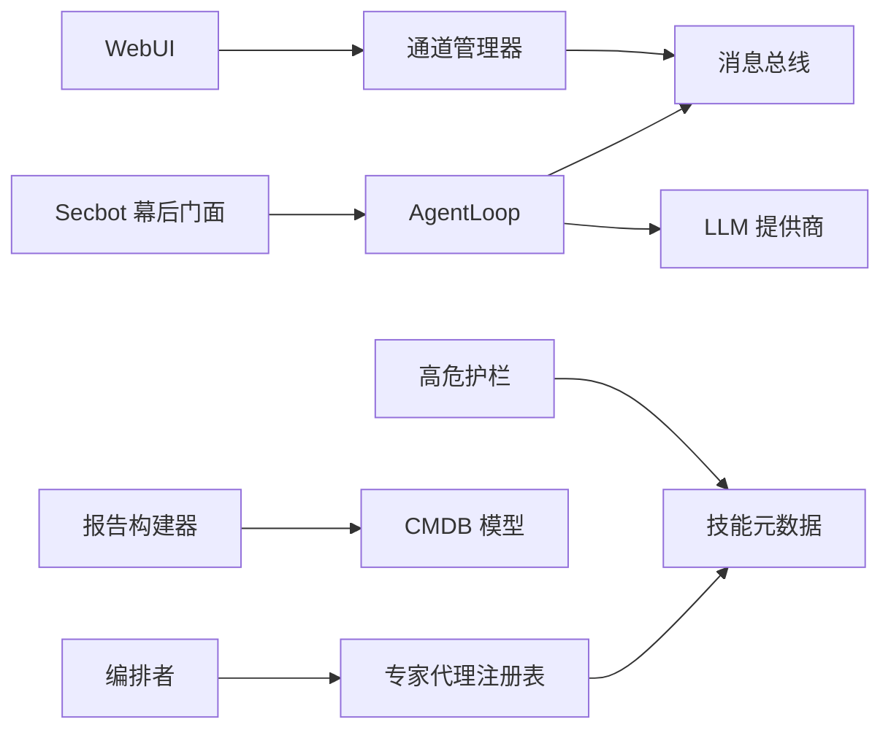

# 核心特性

<cite>
**本文引用的文件**
- [secbot/secbot.py](file://secbot/secbot.py)
- [secbot/agents/orchestrator.py](file://secbot/agents/orchestrator.py)
- [secbot/agents/high_risk.py](file://secbot/agents/high_risk.py)
- [secbot/cmdb/models.py](file://secbot/cmdb/models.py)
- [secbot/report/builder.py](file://secbot/report/builder.py)
- [secbot/channels/manager.py](file://secbot/channels/manager.py)
- [secbot/web/__init__.py](file://secbot/web/__init__.py)
- [webui/src/App.tsx](file://webui/src/App.tsx)
- [webui/package.json](file://webui/package.json)
- [secbot/skills/metadata.py](file://secbot/skills/metadata.py)
- [secbot/agents/registry.py](file://secbot/agents/registry.py)
- [secbot/agents/prompts/report.md](file://secbot/agents/prompts/report.md)
- [secbot/cli/commands.py](file://secbot/cli/commands.py)
</cite>

## 目录
1. [引言](#引言)
2. [项目结构](#项目结构)
3. [核心组件](#核心组件)
4. [架构总览](#架构总览)
5. [详细组件分析](#详细组件分析)
6. [依赖分析](#依赖分析)
7. [性能考虑](#性能考虑)
8. [故障排查指南](#故障排查指南)
9. [结论](#结论)
10. [附录](#附录)

## 引言
本文件聚焦于 VAPT3/secbot 的核心特性，面向初学者与开发者分别提供易懂的概念解释与技术细节说明。重点覆盖以下能力：
- 对话即调度的智能规划：通过“编排者”系统提示词与硬规则，实现任务阶段化、可解释的自动规划与路由。
- 专家智能体池的可插拔架构：基于 YAML 注册表与技能元数据，动态构建工具面，支持扩展与隔离。
- 高危动作护栏机制：对“critical”风险技能进行用户确认与审计记录，保障安全可控。
- CMDB 资产库管理：以 SQLAlchemy 模型定义资产、服务、漏洞与报告元数据，支撑可视化与报表。
- 一键 VAPT 报告生成：从 CMDB 构建报告模型，再由多种格式技能渲染输出。
- 海蓝主题 WebUI 界面：基于 React 的模板化前端，提供仪表盘、任务详情与设置页。
- 沿用 nanobot 通道的多平台集成：通过通道管理器统一接入 CLI、WebSocket、第三方聊天应用等。

## 项目结构
项目采用“后端 Python + 前端 React”的双栈架构，核心运行时由 secbot 包提供；WebUI 作为嵌入资源随包分发；通道层负责多平台消息路由；CMDB 提供本地数据库模型与迁移；报告模块负责从 CMDB 产出报告模型并持久化元数据。

**图表来源**
- [secbot/secbot.py:23-132](file://secbot/secbot.py#L23-L132)
- [secbot/agents/orchestrator.py:52-70](file://secbot/agents/orchestrator.py#L52-L70)
- [secbot/agents/high_risk.py:94-139](file://secbot/agents/high_risk.py#L94-L139)
- [secbot/cmdb/models.py:38-263](file://secbot/cmdb/models.py#L38-L263)
- [secbot/report/builder.py:90-230](file://secbot/report/builder.py#L90-L230)
- [secbot/channels/manager.py:43-443](file://secbot/channels/manager.py#L43-L443)
- [secbot/skills/metadata.py:56-147](file://secbot/skills/metadata.py#L56-L147)
- [secbot/agents/registry.py:99-248](file://secbot/agents/registry.py#L99-L248)
- [secbot/agents/prompts/report.md:1-19](file://secbot/agents/prompts/report.md#L1-L19)
- [secbot/cli/commands.py:634-801](file://secbot/cli/commands.py#L634-L801)
- [webui/src/App.tsx:54-233](file://webui/src/App.tsx#L54-L233)
- [webui/package.json:1-67](file://webui/package.json#L1-L67)

**章节来源**
- [secbot/secbot.py:23-132](file://secbot/secbot.py#L23-L132)
- [secbot/channels/manager.py:43-127](file://secbot/channels/manager.py#L43-L127)
- [webui/src/App.tsx:54-233](file://webui/src/App.tsx#L54-L233)

## 核心组件
- Secbot 幕后门面：封装配置加载、LLM 提供商、消息总线与 AgentLoop，提供程序化运行入口。
- 编排者系统提示词：锁定角色、硬规则、可用专家代理与工作风格，确保任务按序执行与可解释性。
- 高危护栏：对 critical 风险技能拦截，要求用户确认，并记录审计日志，支持超时与拒绝处理。
- CMDB 数据模型：定义扫描、资产、服务、漏洞与报告元数据，含校验集与索引，支撑查询与聚合。
- 报告构建器：从 CMDB 查询并组装报告模型，提供记录元数据能力，保证渲染后持久化。
- 通道管理器：发现并初始化各聊天通道（CLI、WebSocket、第三方），统一流式与重试策略。
- 技能元数据与专家代理注册表：解析 SKILL.md 与专家代理 YAML，生成工具表面，约束技能归属与冲突。
- WebUI：React 应用，模板化路由与状态，连接 WebSocket，提供仪表盘与任务详情页。
- CLI/Gateway：启动 OpenAI 兼容 API、网关与通道，支持会话记录与媒体归档。

**章节来源**
- [secbot/secbot.py:23-132](file://secbot/secbot.py#L23-L132)
- [secbot/agents/orchestrator.py:17-70](file://secbot/agents/orchestrator.py#L17-L70)
- [secbot/agents/high_risk.py:94-139](file://secbot/agents/high_risk.py#L94-L139)
- [secbot/cmdb/models.py:38-263](file://secbot/cmdb/models.py#L38-L263)
- [secbot/report/builder.py:90-230](file://secbot/report/builder.py#L90-L230)
- [secbot/channels/manager.py:43-443](file://secbot/channels/manager.py#L43-L443)
- [secbot/skills/metadata.py:56-147](file://secbot/skills/metadata.py#L56-L147)
- [secbot/agents/registry.py:99-248](file://secbot/agents/registry.py#L99-L248)
- [webui/src/App.tsx:54-233](file://webui/src/App.tsx#L54-L233)
- [secbot/cli/commands.py:514-801](file://secbot/cli/commands.py#L514-L801)

## 架构总览
下图展示了从用户输入到多通道交付与报告生成的关键路径，体现“对话即调度”的编排思想与护栏机制。

**图表来源**
- [secbot/agents/orchestrator.py:52-70](file://secbot/agents/orchestrator.py#L52-L70)
- [secbot/agents/high_risk.py:103-139](file://secbot/agents/high_risk.py#L103-L139)
- [secbot/report/builder.py:90-230](file://secbot/report/builder.py#L90-L230)
- [secbot/channels/manager.py:278-424](file://secbot/channels/manager.py#L278-L424)
- [secbot/cli/commands.py:713-799](file://secbot/cli/commands.py#L713-L799)
- [webui/src/App.tsx:54-233](file://webui/src/App.tsx#L54-L233)

## 详细组件分析

### 对话即调度的智能规划能力
- 技术实现
  - 编排者系统提示词由固定角色、硬规则、可用专家代理表格与工作风格组成，确保任务顺序与可解释性。
  - 专家代理注册表将 YAML 规范转换为工具表面，供 LLM 选择调用。
  - CLI/Gateway 启动 AgentLoop，承载上下文窗口、迭代次数、工具限制等参数。
- 业务价值
  - 将复杂安全任务分解为资产发现、端口扫描、漏洞扫描、弱口令检测、报告生成等有序阶段，降低误操作风险。
  - 通过工具调用与计划输出，提升任务透明度与可审计性。
- 使用场景
  - 一键启动 VAPT 流程，无需手动切换工具；在 WebUI 中查看阶段进度与摘要链接。
- 效果展示
  - WebUI 仪表盘显示任务状态与严重级别分布；报告页提供可下载的 Markdown/DOCX/PDF 文件。

**图表来源**
- [secbot/agents/orchestrator.py:17-70](file://secbot/agents/orchestrator.py#L17-L70)
- [secbot/agents/registry.py:99-248](file://secbot/agents/registry.py#L99-L248)
- [secbot/cli/commands.py:634-801](file://secbot/cli/commands.py#L634-L801)

**章节来源**
- [secbot/agents/orchestrator.py:17-70](file://secbot/agents/orchestrator.py#L17-L70)
- [secbot/agents/registry.py:99-248](file://secbot/agents/registry.py#L99-L248)
- [secbot/cli/commands.py:634-801](file://secbot/cli/commands.py#L634-L801)

### 专家智能体池的可插拔架构
- 技术实现
  - 技能元数据解析 SKILL.md，提取名称、风险等级、网络策略、预期时长等字段，用于护栏与路由决策。
  - 专家代理注册表加载 YAML，校验必填字段、JSON Schema、技能归属唯一性，生成工具表面。
  - 编排者根据注册表动态注入“可用专家代理”表格，保持提示词稳定与工具面可变。
- 业务价值
  - 支持快速扩展新代理与技能，避免侵入式修改；通过冲突检测与唯一性约束，保障职责边界清晰。
- 使用场景
  - 新增资产发现/端口扫描/漏洞扫描代理，或引入新的弱口令检测技能，无需改动核心逻辑。
- 效果展示
  - WebUI 专家面板展示可用代理与技能列表；编排者提示词表格随新增条目自动更新。

**图表来源**
- [secbot/skills/metadata.py:24-114](file://secbot/skills/metadata.py#L24-L114)
- [secbot/agents/registry.py#L37-L92)

**章节来源**
- [secbot/skills/metadata.py:56-147](file://secbot/skills/metadata.py#L56-L147)
- [secbot/agents/registry.py:99-248](file://secbot/agents/registry.py#L99-L248)

### 高危动作护栏机制
- 技术实现
  - 针对“critical”风险技能，在执行前构造结构化确认载荷，交由 Surface 渲染（WebUI/CLI）。
  - 支持超时、拒绝与审计日志记录；默认超时时间可配置。
- 业务价值
  - 在关键操作前强制人工确认，防止误执行；审计日志可追溯。
- 使用场景
  - 执行可能破坏性或高影响的操作（如大规模扫描、弱口令爆破）。
- 效果展示
  - WebUI 弹窗提示操作摘要、预估时长与风险等级；用户可在时限内确认或取消。

**图表来源**
- [secbot/agents/high_risk.py:103-139](file://secbot/agents/high_risk.py#L103-L139)

**章节来源**
- [secbot/agents/high_risk.py:94-139](file://secbot/agents/high_risk.py#L94-L139)

### CMDB 资产库管理
- 技术实现
  - 定义 Scan、Asset、Service、Vulnerability、ReportMeta 等模型，含主键、外键、索引与校验集。
  - 提供查询接口（如 list_assets/list_services/list_vulnerabilities）与报告模型组装。
- 业务价值
  - 统一存储扫描目标、资产信息、开放服务与漏洞详情；支持聚合统计与报告元数据持久化。
- 使用场景
  - 作为报告生成的数据源；在仪表盘中按严重级别、资产类型、系统分类进行聚合。
- 效果展示
  - WebUI 仪表盘展示关键指标；报告页列出资产、服务与漏洞摘要及原始日志路径。

**图表来源**
- [secbot/cmdb/models.py:38-263](file://secbot/cmdb/models.py#L38-L263)

**章节来源**
- [secbot/cmdb/models.py:38-263](file://secbot/cmdb/models.py#L38-L263)
- [secbot/report/builder.py:90-181](file://secbot/report/builder.py#L90-L181)

### 一键 VAPT 报告生成
- 技术实现
  - 报告构建器按扫描 ID 查询资产、服务与漏洞，组装报告模型；随后由不同格式技能（Markdown/DOCX/PDF）渲染。
  - 渲染完成后记录报告元数据（标题、类型、作者、状态、关键数、下载路径）。
- 业务价值
  - 从本地 CMDB 自动生成标准化报告，减少手工整理成本；支持多种格式满足不同交付需求。
- 使用场景
  - 完成扫描后一键导出报告；在 WebUI 中查看与下载。
- 效果展示
  - WebUI 报告页显示报告摘要与下载按钮；报告元数据写入数据库便于后续检索与归档。

**图表来源**
- [secbot/report/builder.py:90-230](file://secbot/report/builder.py#L90-L230)
- [secbot/agents/prompts/report.md:1-19](file://secbot/agents/prompts/report.md#L1-L19)

**章节来源**
- [secbot/report/builder.py:90-230](file://secbot/report/builder.py#L90-L230)
- [secbot/agents/prompts/report.md:1-19](file://secbot/agents/prompts/report.md#L1-L19)

### 海蓝主题 WebUI 界面
- 技术实现
  - React 应用，模板化路由与状态管理；通过 WebSocket 与后端交互；支持国际化与主题。
  - 嵌入静态资源（dist）随包分发；登录态与令牌刷新流程由前端控制。
- 业务价值
  - 提供直观的仪表盘、任务详情与设置页面；支持多语言与无障碍体验。
- 使用场景
  - 日常监控与任务管理；查看报告与附件；调整模型与会话。
- 效果展示
  - 登录页、首页、仪表盘、任务详情与设置页；消息流与进度提示。

**图表来源**
- [webui/src/App.tsx:54-233](file://webui/src/App.tsx#L54-L233)
- [webui/package.json:1-67](file://webui/package.json#L1-L67)

**章节来源**
- [webui/src/App.tsx:54-233](file://webui/src/App.tsx#L54-L233)
- [secbot/web/__init__.py:1-7](file://secbot/web/__init__.py#L1-L7)

### 沿用 nanobot 通道的多平台集成能力
- 技术实现
  - 通道管理器通过插件发现机制加载内置与第三方通道；统一消息投递、去重、流式合并与指数退避重试。
  - CLI/Gateway 启动时构建 AgentLoop 并注入通道配置，支持媒体归档与会话记录。
- 业务价值
  - 一套后端逻辑适配多种前端与第三方平台；降低集成成本与维护复杂度。
- 使用场景
  - 同时在 WebUI、CLI 与第三方聊天应用中进行交互；跨平台一致性体验。
- 效果展示
  - WebSocket 通道承载实时消息与仪表盘状态；CLI 通道提供命令行交互；第三方通道按配置启用。

**图表来源**
- [secbot/channels/manager.py:43-443](file://secbot/channels/manager.py#L43-L443)
- [secbot/cli/commands.py:634-801](file://secbot/cli/commands.py#L634-L801)

**章节来源**
- [secbot/channels/manager.py:43-443](file://secbot/channels/manager.py#L43-L443)
- [secbot/cli/commands.py:634-801](file://secbot/cli/commands.py#L634-L801)

## 依赖分析
- 组件耦合
  - Secbot 幕后门面依赖配置、提供商工厂与 AgentLoop；AgentLoop 依赖消息总线与通道配置。
  - 编排者依赖专家代理注册表生成工具表面；高危护栏依赖技能元数据与确认上下文。
  - 报告构建器依赖 CMDB 查询接口与报告元数据写入；WebUI 依赖通道管理器提供的 WebSocket 通道。
- 外部依赖
  - 前端使用 React 生态与 TailwindCSS；后端使用 SQLAlchemy、aiohttp、loguru 等。
- 循环依赖
  - 当前结构通过模块导入与延迟调用避免循环；建议保持“后端服务 → 前端 UI → 通道管理器”的单向依赖。

**图表来源**
- [secbot/secbot.py:65-91](file://secbot/secbot.py#L65-L91)
- [secbot/agents/orchestrator.py:52-70](file://secbot/agents/orchestrator.py#L52-L70)
- [secbot/agents/registry.py:99-248](file://secbot/agents/registry.py#L99-L248)
- [secbot/agents/high_risk.py:94-139](file://secbot/agents/high_risk.py#L94-L139)
- [secbot/report/builder.py:90-230](file://secbot/report/builder.py#L90-L230)
- [secbot/channels/manager.py:43-443](file://secbot/channels/manager.py#L43-L443)

**章节来源**
- [secbot/secbot.py:65-91](file://secbot/secbot.py#L65-L91)
- [secbot/agents/registry.py:99-248](file://secbot/agents/registry.py#L99-L248)
- [secbot/report/builder.py:90-230](file://secbot/report/builder.py#L90-L230)
- [secbot/channels/manager.py:43-443](file://secbot/channels/manager.py#L43-L443)

## 性能考虑
- 流式与去重
  - 通道管理器对连续流式增量进行合并，减少 API 调用频率；同时基于指纹抑制重复消息，降低带宽与抖动。
- 重试策略
  - 发送失败采用指数退避重试，结合最大尝试次数，平衡可靠性与延迟。
- 查询优化
  - CMDB 模型定义索引与分页参数，报告构建器按需限制数量，避免大结果集导致内存压力。
- 上下文与迭代
  - AgentLoop 的上下文窗口、迭代次数与工具结果长度限制，有助于控制成本与稳定性。

[本节为通用指导，不直接分析具体文件]

## 故障排查指南
- 通道未启用或不可用
  - 检查通道配置与允许来源；空的 allowFrom 会导致全部拒绝。
- 发送失败与重试
  - 查看通道管理器的日志与重试延迟；确认第三方服务可用性与配额。
- 高危护栏超时或拒绝
  - 确认用户确认弹窗是否被忽略；检查护栏超时阈值与审计日志。
- 报告生成异常
  - 确认扫描 ID 存在且状态正确；检查报告技能是否成功渲染并记录元数据。
- WebUI 无法连接
  - 检查 WebSocket 地址与令牌；确认前端引导流程与保存的密钥。

**章节来源**
- [secbot/channels/manager.py:147-161](file://secbot/channels/manager.py#L147-L161)
- [secbot/channels/manager.py:395-424](file://secbot/channels/manager.py#L395-L424)
- [secbot/agents/high_risk.py:123-139](file://secbot/agents/high_risk.py#L123-L139)
- [secbot/report/builder.py:194-230](file://secbot/report/builder.py#L194-L230)
- [webui/src/App.tsx:54-102](file://webui/src/App.tsx#L54-L102)

## 结论
VAPT3/secbot 通过“对话即调度”的编排思想、可插拔的专家代理与技能体系、高危护栏与 CMDB 数据治理，实现了从资产发现到报告生成的一体化自动化流程。配合海蓝主题 WebUI 与多平台通道集成，既满足初学者的易用性，也为开发者提供了清晰的扩展点与可观测性。建议在生产环境中结合审计日志、限流与监控，持续优化性能与稳定性。

[本节为总结性内容，不直接分析具体文件]

## 附录
- 快速开始
  - 使用 CLI 初始化配置与工作区；启动网关或 OpenAI 兼容 API；在 WebUI 中登录并发起任务。
- 常见问题
  - 若首次运行遇到权限或网络问题，优先检查通道配置与提供商密钥；必要时启用详细日志定位。

**章节来源**
- [secbot/cli/commands.py:304-400](file://secbot/cli/commands.py#L304-L400)
- [secbot/cli/commands.py:514-601](file://secbot/cli/commands.py#L514-L601)