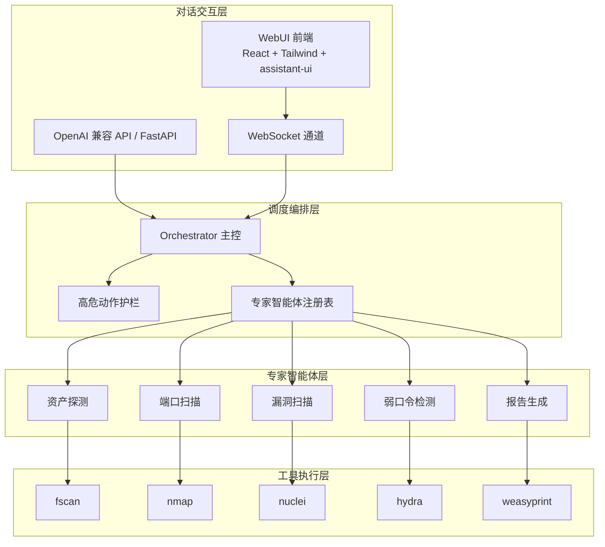
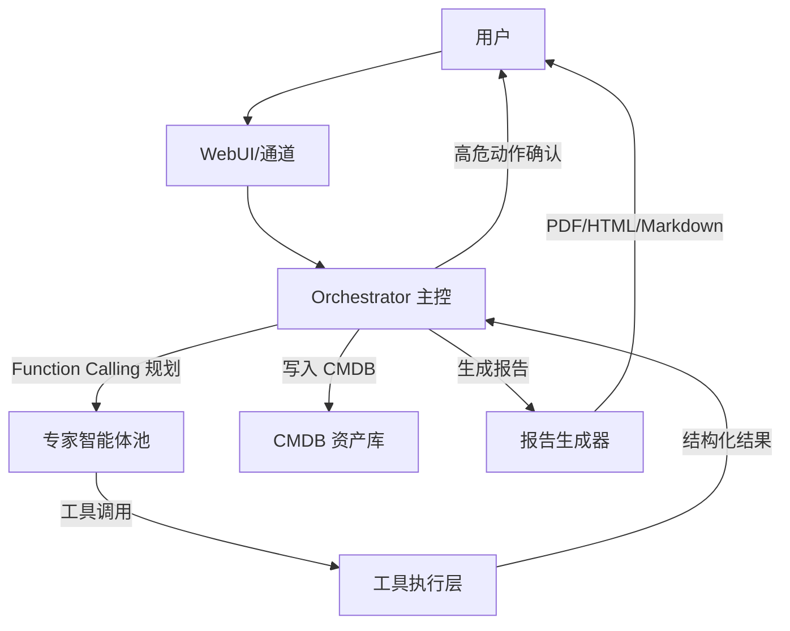
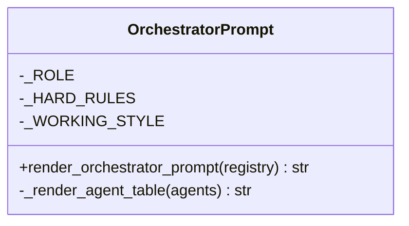
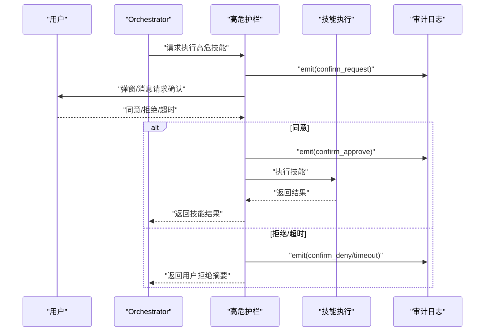
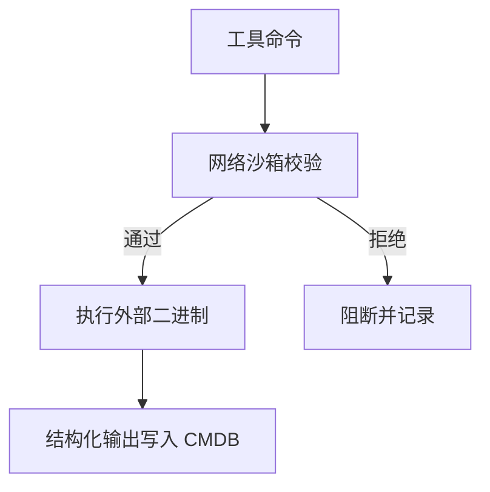
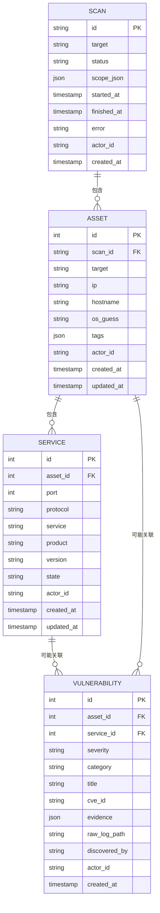
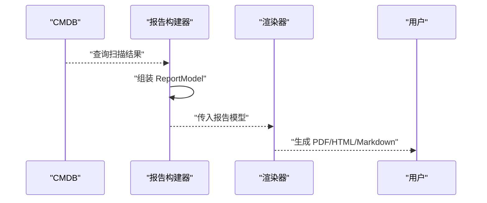
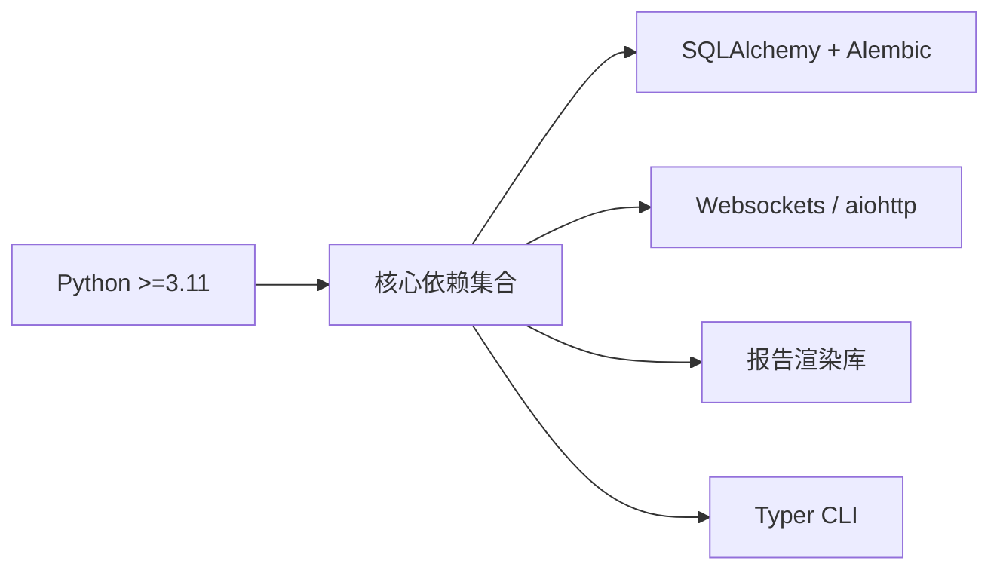

# 项目概述

<cite>
**本文引用的文件**
- [README.md](file://README.md)
- [docs/quick-start.md](file://docs/quick-start.md)
- [docs/configuration.md](file://docs/configuration.md)
- [pyproject.toml](file://pyproject.toml)
- [secbot/__init__.py](file://secbot/__init__.py)
- [secbot/agents/orchestrator.py](file://secbot/agents/orchestrator.py)
- [secbot/agents/high_risk.py](file://secbot/agents/high_risk.py)
- [secbot/cmdb/models.py](file://secbot/cmdb/models.py)
- [secbot/report/builder.py](file://secbot/report/builder.py)
- [secbot/security/network.py](file://secbot/security/network.py)
- [webui/README.md](file://webui/README.md)
</cite>

## 目录
1. [引言](#引言)
2. [项目结构](#项目结构)
3. [核心组件](#核心组件)
4. [架构总览](#架构总览)
5. [详细组件分析](#详细组件分析)
6. [依赖分析](#依赖分析)
7. [性能考虑](#性能考虑)
8. [故障排查指南](#故障排查指南)
9. [结论](#结论)
10. [附录](#附录)

## 引言
VAPT3 / secbot 是一个基于大模型的“对话式多智能体网络安全协作系统”。其使命是以自然语言为入口，将安全运营从“手工流程”转变为“可编排的智能体流水线”，实现资产发现、端口扫描、漏洞扫描、弱口令检测与报告生成的端到端自动化。项目愿景是让非专业人员也能通过简单对话完成复杂的渗透测试与漏洞评估工作；同时为安全工程师提供可审计、可扩展、可治理的自动化平台。

项目核心价值体现在：
- 以对话即调度为核心体验，无需预设流程图，LLM 动态规划与编排
- 专家智能体池解耦可插拔，新增智能体只需注册元数据
- 高危动作护栏与审计留痕，确保安全可控
- CMDB 资产库统一建模与检索，支撑全生命周期管理
- 一键 VAPT 报告，多格式导出，覆盖表格、拓扑与修复建议
- 海蓝主题 WebUI，原生 AI 交互体验，实时呈现思考与执行过程

项目继承自 nanobot 的轻量 Agent Loop 基座，沿用其通道体系与工具抽象，结合 VAPT3 的安全域需求，形成四层架构：对话交互层、调度编排层、专家智能体层、工具执行层。

章节来源
- [README.md:13-298](file://README.md#L13-L298)

## 项目结构
仓库采用“功能域 + 层次化”的组织方式：
- secbot/：后端核心，包含 Agent 编排、专家智能体、工具封装、CMDB、报告、安全沙箱、通道与 API 等
- webui/：前端 WebUI，React + Tailwind + assistant-ui，提供会话、资产、任务、报告等页面
- docs/：通用文档，包含快速开始、配置、部署、CLI 参考等
- tests/：单测与集成测试
- 根目录配置：README、pyproject.toml、Dockerfile、docker-compose.yml 等

图表来源
- [README.md:29-53](file://README.md#L29-L53)
- [secbot/agents/orchestrator.py:17-70](file://secbot/agents/orchestrator.py#L17-L70)
- [secbot/agents/high_risk.py:94-139](file://secbot/agents/high_risk.py#L94-L139)
- [secbot/cmdb/models.py:38-178](file://secbot/cmdb/models.py#L38-L178)
- [secbot/report/builder.py:74-178](file://secbot/report/builder.py#L74-L178)
- [secbot/security/network.py:1-120](file://secbot/security/network.py#L1-L120)

章节来源
- [README.md:259-275](file://README.md#L259-L275)

## 核心组件
- 对话交互层：WebUI（React + Tailwind + assistant-ui）、WebSocket 通道、OpenAI 兼容 API（FastAPI）。负责接收用户指令、展示执行过程与结果。
- 调度编排层：Orchestrator 主控（基于 LLM Function Calling 的动态规划）、高危动作护栏（人工确认与审计）、专家智能体注册表（动态发现可用专家）。
- 专家智能体层：资产探测、端口扫描、漏洞扫描、弱口令检测、报告生成等专家智能体，每个智能体由“提示词 + 工具集 + 输入输出 Schema”组成。
- 工具执行层：nmap、fscan、nuclei、hydra、weasyprint 等外部工具，以及内部沙箱与安全校验。

章节来源
- [README.md:19-27](file://README.md#L19-L27)
- [README.md:29-63](file://README.md#L29-L63)

## 架构总览
四层职责与关键实现：
- 对话交互层：WebUI、WebSocket、REST（FastAPI）
- 调度编排层：Orchestrator LLM（Function Calling）、高危护栏、注册表
- 专家智能体层：专家智能体配置（YAML）
- 工具执行层：nmap / fscan / nuclei / hydra / 自研脚本

图表来源
- [README.md:29-63](file://README.md#L29-L63)
- [secbot/agents/orchestrator.py:52-70](file://secbot/agents/orchestrator.py#L52-L70)
- [secbot/agents/high_risk.py:103-139](file://secbot/agents/high_risk.py#L103-L139)
- [secbot/cmdb/models.py:38-178](file://secbot/cmdb/models.py#L38-L178)
- [secbot/report/builder.py:87-178](file://secbot/report/builder.py#L87-L178)

## 详细组件分析

### 调度编排层：Orchestrator 主控
- 角色与规则：锁定的系统提示由“角色、硬性规则、可用专家列表、工作风格”四部分组成，保证规划稳定性与合规性。
- 动态规划：基于 Function Calling 生成规划步骤，按阶段顺序推进（资产发现 → 端口扫描 → 漏洞扫描 → 报告生成），必要时请求高危动作确认。
- 专家列表渲染：根据注册表动态生成可用专家表格，便于 LLM 选择合适工具。

图表来源
- [secbot/agents/orchestrator.py:17-70](file://secbot/agents/orchestrator.py#L17-L70)

章节来源
- [secbot/agents/orchestrator.py:1-70](file://secbot/agents/orchestrator.py#L1-L70)

### 调度编排层：高危动作护栏
- 设计目标：对“高危技能”（如扫描/爆破/PoC）在执行前插入人工确认节点，全链路审计留痕，超时或拒绝则阻断。
- 实现要点：构造结构化确认载荷，委托上下文确认接口；记录“请求/批准/拒绝/超时”事件；默认超时 120 秒。

图表来源
- [secbot/agents/high_risk.py:103-139](file://secbot/agents/high_risk.py#L103-L139)

章节来源
- [secbot/agents/high_risk.py:1-139](file://secbot/agents/high_risk.py#L1-L139)

### 专家智能体层：内置专家与扩展机制
- 内置专家：资产探测、端口扫描、漏洞扫描、弱口令检测、报告生成，分别对应不同底层工具与风险等级。
- 扩展机制：新增专家只需编写 YAML 配置（含触发词、输入输出 Schema、系统提示与工具清单），重启后自动纳入规划候选池。

章节来源
- [README.md:64-74](file://README.md#L64-L74)
- [README.md:193-222](file://README.md#L193-L222)

### 工具执行层：安全工具与沙箱
- 工具清单：nmap、fscan、nuclei、hydra、weasyprint 等，均以外部二进制形式调用。
- 安全保障：网络沙箱对私网地址与内部 URL 进行拦截，防止内网探测与 SSRF；命令注入防护贯穿工具调用链。

图表来源
- [secbot/security/network.py:45-120](file://secbot/security/network.py#L45-L120)

章节来源
- [secbot/security/network.py:1-120](file://secbot/security/network.py#L1-L120)

### CMDB 资产库：统一建模与检索
- 数据模型：Scan（扫描任务）、Asset（资产）、Service（服务）、Vulnerability（漏洞）四大核心表，支持多租户预留字段。
- 查询与统计：提供按严重级别、状态、资产等维度的查询接口，支撑报告生成与审计。

图表来源
- [secbot/cmdb/models.py:38-178](file://secbot/cmdb/models.py#L38-L178)

章节来源
- [secbot/cmdb/models.py:1-178](file://secbot/cmdb/models.py#L1-L178)

### 报告生成器：一键 VAPT 报告
- 数据来源：从 CMDB 读取扫描任务、资产、服务与漏洞，构建报告模型。
- 输出格式：Markdown / HTML / PDF（通过 weasyprint），包含汇总统计、资产清单、服务与漏洞明细、原始日志路径等。

图表来源
- [secbot/report/builder.py:87-178](file://secbot/report/builder.py#L87-L178)

章节来源
- [secbot/report/builder.py:1-178](file://secbot/report/builder.py#L1-L178)

### WebUI：海蓝主题与实时交互
- 技术栈：React + Vite + Tailwind + assistant-ui，支持多语言与主题切换。
- 交互特性：会话流式输出、思考过程可视化、实时状态更新；后端通过 WebSocket 通道提供会话令牌与升级。
- 开发与打包：支持本地开发代理、跨设备访问、生产构建产物由后端网关提供。

章节来源
- [webui/README.md:1-136](file://webui/README.md#L1-L136)
- [README.md:248-258](file://README.md#L248-L258)

## 依赖分析
- Python 版本与许可证：要求 Python ≥3.11，MIT 许可。
- 核心依赖：Typer、Pydantic、Websockets、HTTPX、SQLAlchemy + Alembic、FastAPI（可选）、报告渲染相关库等。
- 可选依赖：API 服务、企业微信/钉钉/Slack/Discord 等渠道适配包。
- 版本解析：当包元数据不可用时回退到 pyproject.toml 中的版本号。

图表来源
- [pyproject.toml:25-68](file://pyproject.toml#L25-L68)
- [pyproject.toml:112-113](file://pyproject.toml#L112-L113)

章节来源
- [pyproject.toml:1-169](file://pyproject.toml#L1-L169)
- [secbot/__init__.py:10-33](file://secbot/__init__.py#L10-L33)

## 性能考虑
- 并行与串行：专家智能体遵循固定顺序，但同一阶段内的任务可并行执行；高危动作确认引入阻塞，需合理设置超时。
- 工具耗时：不同工具的预期运行时长差异较大（如 nuclei 高于 nmap），应结合并发策略与队列限流。
- 数据库负载：报告生成一次性查询 CMDB，建议对高频查询建立索引（如资产 IP、漏洞严重级别、扫描状态）。
- 网络安全：URL 解析与 IP 白名单校验在工具调用前执行，避免内网泄露与 SSRF。

## 故障排查指南
- WebUI 无法连接：确认 WebSocket 通道已启用且端口正确；后端通过健康检查端点暴露通道状态。
- OpenAI 兼容 API 启动失败：默认模型对应的 Provider 未配置 apiKey，启动时报错；请在配置中添加密钥。
- 高危动作未确认导致阻断：检查确认弹窗是否被忽略或超时；可在护栏配置中调整超时时间。
- 工具执行失败：核对工具二进制是否存在、版本是否满足最低要求；查看技能元数据中的 expected_runtime_sec 与 risk_level。
- 报告为空：确认扫描任务已完成且 CMDB 中存在资产/漏洞记录；检查报告构建器的查询条件与权限。

章节来源
- [README.md:111-179](file://README.md#L111-L179)
- [secbot/agents/high_risk.py:27-28](file://secbot/agents/high_risk.py#L27-L28)
- [secbot/security/network.py:45-120](file://secbot/security/network.py#L45-L120)
- [secbot/report/builder.py:87-178](file://secbot/report/builder.py#L87-L178)

## 结论
VAPT3 以 nanobot 的 Agent Loop 为基础，围绕 VAPT 场景构建了“对话即调度 + 专家智能体池 + 高危护栏 + CMDB + 一键报告 + 海蓝 WebUI”的完整闭环。通过明确的四层架构与可插拔的专家智能体，项目既降低了安全运营的门槛，又提供了强大的扩展性与治理能力。建议在生产环境中严格启用高危护栏与审计留痕，并结合 CMDB 做好资产与任务的全生命周期管理。

## 附录

### 快速开始
- 安装与初始化：克隆仓库、安装可编辑模式、执行 onboard 初始化配置。
- 启动方式：CLI 直连、OpenAI 兼容 API、WebUI/网关三种入口，按场景选择。
- 一次典型对话：用户输入目标网段，系统按顺序执行资产发现 → 端口扫描 → 漏洞扫描 → 报告生成，并在高危动作前请求确认。

章节来源
- [README.md:76-192](file://README.md#L76-L192)

### 系统要求
- Python：≥3.11
- 底层工具：nmap、nuclei、hydra 等（按需安装），由 secbot 以子进程方式调用
- 前端：bun/npm 可选，用于 WebUI 开发与构建

章节来源
- [README.md:5-86](file://README.md#L5-L86)
- [pyproject.toml:6-7](file://pyproject.toml#L6-L7)

### 技术选型理由
- LLM 与 Function Calling：用于动态规划与工具路由，降低流程图依赖，提升灵活性
- 专家智能体池：将“提示词 + 工具 + Schema”解耦，便于扩展与复用
- 高危护栏：以人工确认与审计留痕保障安全边界
- CMDB：统一建模资产/漏洞/任务，支撑报告与审计
- WebUI：原生 AI 交互体验，实时呈现思考与执行过程
- 继承 nanobot：复用成熟的 Agent Loop、通道与工具抽象，缩短开发周期

章节来源
- [README.md:13-298](file://README.md#L13-L298)