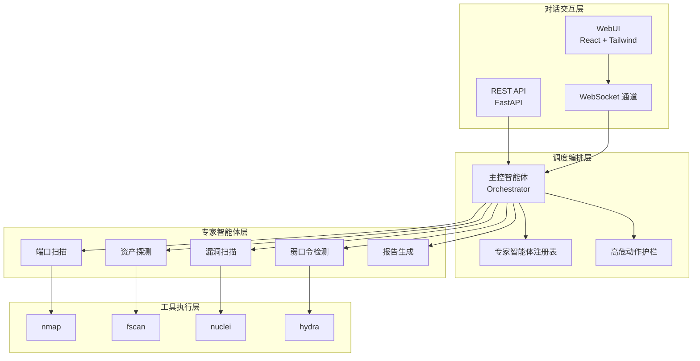
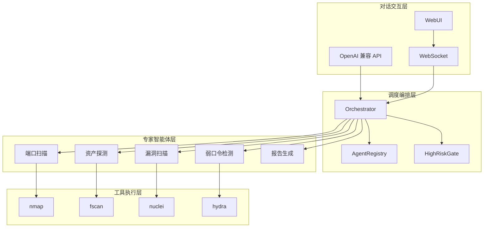
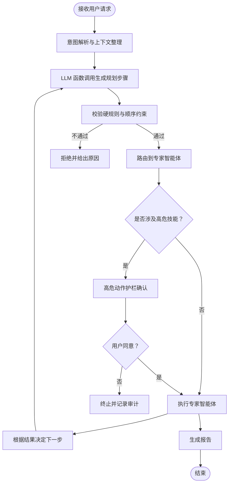
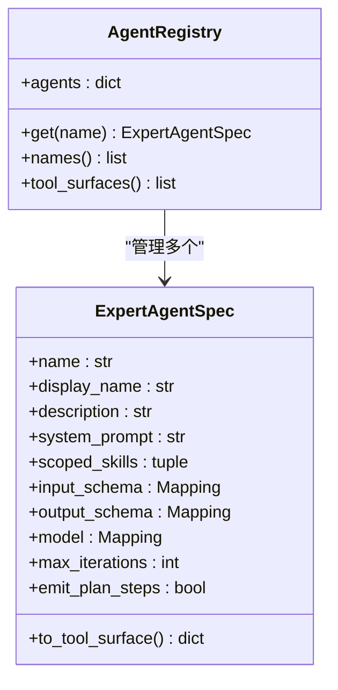
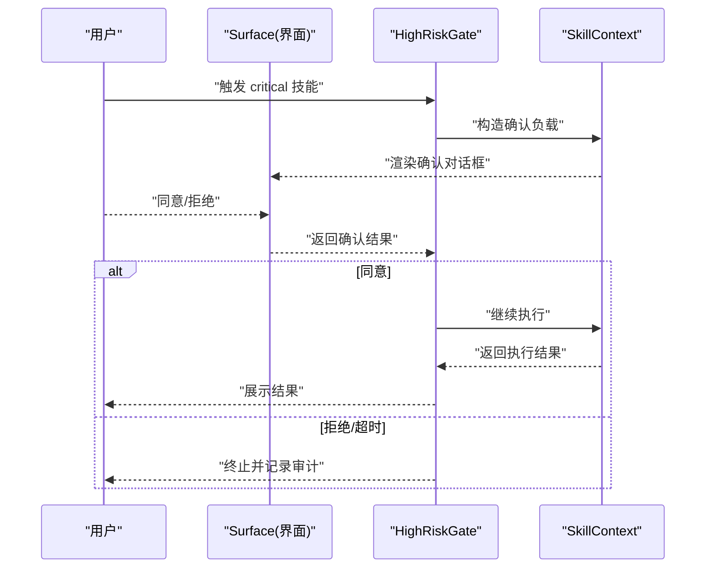
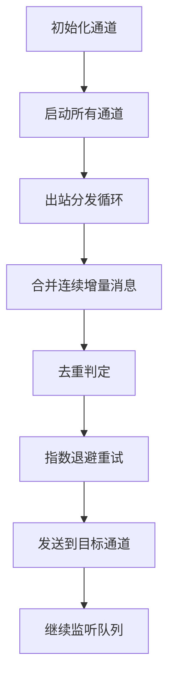
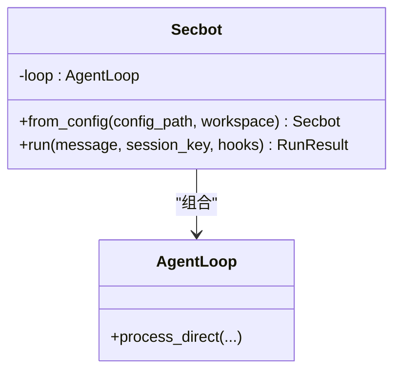
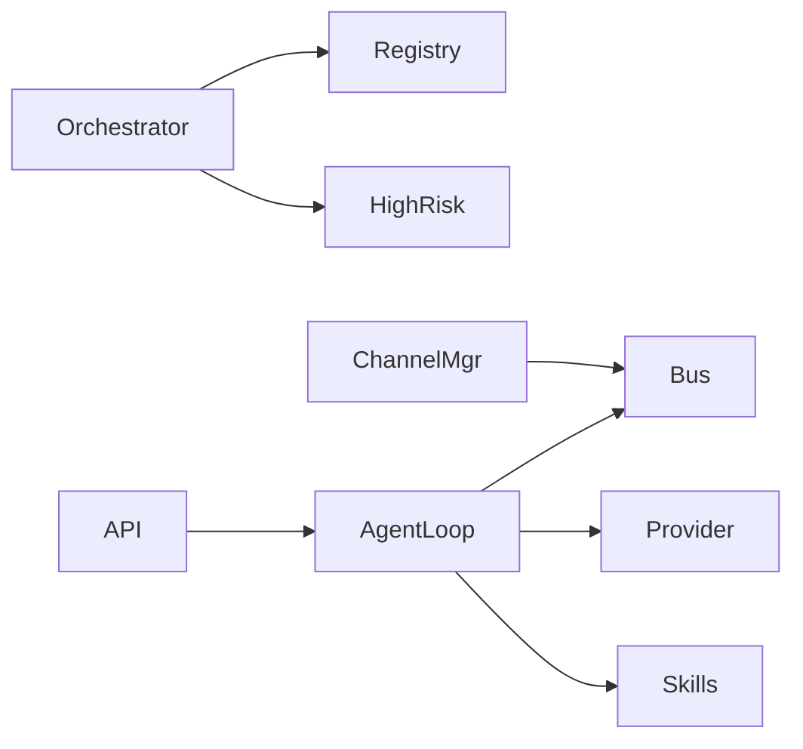

# 项目概述

<cite>
**本文引用的文件**
- [README.md](file://README.md)
- [secbot/secbot.py](file://secbot/secbot.py)
- [secbot/agents/orchestrator.py](file://secbot/agents/orchestrator.py)
- [secbot/agents/high_risk.py](file://secbot/agents/high_risk.py)
- [secbot/agents/registry.py](file://secbot/agents/registry.py)
- [secbot/api/server.py](file://secbot/api/server.py)
- [secbot/channels/manager.py](file://secbot/channels/manager.py)
- [secbot/cli/commands.py](file://secbot/cli/commands.py)
- [pyproject.toml](file://pyproject.toml)
- [webui/package.json](file://webui/package.json)
- [secbot/skills/fscan-asset-discovery/handler.py](file://secbot/skills/fscan-asset-discovery/handler.py)
- [secbot/skills/nmap-port-scan/handler.py](file://secbot/skills/nmap-port-scan/handler.py)
- [secbot/skills/nuclei-template-scan/handler.py](file://secbot/skills/nuclei-template-scan/handler.py)
</cite>

## 目录
1. [引言](#引言)
2. [项目结构](#项目结构)
3. [核心组件](#核心组件)
4. [架构总览](#架构总览)
5. [详细组件分析](#详细组件分析)
6. [依赖关系分析](#依赖关系分析)
7. [性能考量](#性能考量)
8. [故障排查指南](#故障排查指南)
9. [结论](#结论)
10. [附录](#附录)

## 引言
VAPT3/secbot 是一个基于大模型的“对话式多智能体网络安全协作系统”，专注于将自然语言安全诉求转化为可执行的 VAPT（漏洞评估与渗透测试）流水线。其核心价值在于：
- 以主控智能体（Orchestrator）为中心，利用函数调用（Function Calling）进行动态规划与任务编排；
- 专家智能体池采用“提示词 + 工具集 + 输入输出 Schema”的标准化封装，彼此解耦、可插拔、易扩展；
- 通过高危动作护栏与审计日志，确保高风险操作（如扫描、爆破、PoC）在人工确认后才执行；
- 提供一体化的 CMDB 资产库（SQLite + SQLAlchemy + Alembic）与多格式报告生成能力；
- 采用 OpenAI 兼容 API 与 React 前端，既便于嵌入第三方平台，也提供原生 Web 交互体验。

## 项目结构
项目采用“四层职责”分层设计，自上而下分别为：
- 对话交互层：WebUI（React + 海蓝主题）、WebSocket、REST（FastAPI）；
- 调度编排层：主控智能体（Orchestrator）、专家智能体注册表、高危动作确认；
- 专家智能体层：每个专家智能体由 YAML 配置 + 系统提示词 + 工具集合 + I/O Schema 组成；
- 工具执行层：nmap、fscan、nuclei、hydra 等底层安全工具与自研脚本。



图表来源
- [README.md](file://README.md)
- [secbot/agents/orchestrator.py](file://secbot/agents/orchestrator.py)
- [secbot/agents/registry.py](file://secbot/agents/registry.py)
- [secbot/agents/high_risk.py](file://secbot/agents/high_risk.py)
- [secbot/api/server.py](file://secbot/api/server.py)
- [secbot/channels/manager.py](file://secbot/channels/manager.py)

章节来源
- [README.md](file://README.md)
- [secbot/agents/orchestrator.py](file://secbot/agents/orchestrator.py)
- [secbot/agents/registry.py](file://secbot/agents/registry.py)
- [secbot/agents/high_risk.py](file://secbot/agents/high_risk.py)
- [secbot/api/server.py](file://secbot/api/server.py)
- [secbot/channels/manager.py](file://secbot/channels/manager.py)

## 核心组件
- 主控智能体（Orchestrator）：负责意图解析、DAG 规划、工具调用路由与上下文接力，系统提示词包含角色、硬规则、可用专家智能体清单与工作风格。
- 专家智能体注册表（AgentRegistry）：加载并校验专家智能体 YAML 配置，生成 LLM 可消费的工具表面（tool surface），保证技能不重叠、字段完整。
- 高危动作护栏（HighRiskGate）：对“critical”风险技能在执行前拦截，生成结构化确认事件并通过上下文等待用户确认，同时记录审计日志。
- OpenAI 兼容 API（FastAPI）：提供 /v1/chat/completions 与 /v1/models，支持 JSON 与 multipart/form-data，内置 SSE 流式响应与会话锁。
- 通道管理（ChannelManager）：统一管理多种消息通道（含 WebSocket），负责消息路由、去重、合并、重试与进度控制。
- 程序化接口（Secbot Facade）：提供 from_config()/run() 的高层封装，便于 SDK 集成与自动化调用。

章节来源
- [secbot/agents/orchestrator.py](file://secbot/agents/orchestrator.py)
- [secbot/agents/registry.py](file://secbot/agents/registry.py)
- [secbot/agents/high_risk.py](file://secbot/agents/high_risk.py)
- [secbot/api/server.py](file://secbot/api/server.py)
- [secbot/channels/manager.py](file://secbot/channels/manager.py)
- [secbot/secbot.py](file://secbot/secbot.py)

## 架构总览
下图展示了从对话交互到工具执行的四层职责分工与关键组件交互：



图表来源
- [README.md](file://README.md)
- [secbot/agents/orchestrator.py](file://secbot/agents/orchestrator.py)
- [secbot/agents/registry.py](file://secbot/agents/registry.py)
- [secbot/agents/high_risk.py](file://secbot/agents/high_risk.py)
- [secbot/api/server.py](file://secbot/api/server.py)
- [secbot/channels/manager.py](file://secbot/channels/manager.py)

## 详细组件分析

### 主控智能体（Orchestrator）
- 角色与规则：固定“角色”“硬规则”“工作风格”，动态注入“可用专家智能体”表格，确保规划稳定且可追溯。
- 动态规划：通过 LLM 的函数调用能力，将用户请求映射为一系列专家智能体的有序调用序列；严格遵循“资产探测 → 端口扫描 → 漏洞扫描 → 报告生成”的天然顺序，除非用户提供前置数据或显式跳过。
- 安全边界：禁止主控直接执行扫描，所有动作必须经专家智能体与护栏确认。



图表来源
- [secbot/agents/orchestrator.py](file://secbot/agents/orchestrator.py)
- [secbot/agents/high_risk.py](file://secbot/agents/high_risk.py)

章节来源
- [secbot/agents/orchestrator.py](file://secbot/agents/orchestrator.py)

### 专家智能体注册表（AgentRegistry）
- 加载与校验：遍历 agents 目录下的 YAML，校验必填字段、命名规范、Schema 合法性、技能唯一性与引用一致性。
- 工具表面生成：将专家智能体规格转换为 LLM 工具定义，供 Orchestrator 的系统提示词动态注入。
- 错误处理：任一校验失败即中止启动，避免部分注册导致的不可预期行为。



图表来源
- [secbot/agents/registry.py](file://secbot/agents/registry.py)

章节来源
- [secbot/agents/registry.py](file://secbot/agents/registry.py)

### 高危动作护栏（HighRiskGate）
- 结构化确认：针对“critical”风险技能，组装结构化 payload（含技能名、参数、预估耗时、扫描 ID 等），交由 Surface（WebUI/CLI）渲染确认对话框。
- 审计日志：记录“请求确认/批准/拒绝/超时”等事件，支持生产环境落库与离线导出。
- 超时与拒绝：默认超时时间内未确认则视为拒绝，避免长时间阻塞。



图表来源
- [secbot/agents/high_risk.py](file://secbot/agents/high_risk.py)

章节来源
- [secbot/agents/high_risk.py](file://secbot/agents/high_risk.py)

### OpenAI 兼容 API（FastAPI）
- 路由与格式：支持 JSON 与 multipart/form-data；单条消息模式；SSE 流式响应；会话隔离与并发锁。
- 文件与媒体：支持 base64 data URL 与 multipart 文件上传，保存至媒体目录并转为路径列表。
- 错误处理：统一错误响应结构；超时、文件过大、无效 JSON 等场景清晰反馈。

```mermaid
sequenceDiagram
participant Client as "客户端"
participant API as "OpenAI 兼容 API"
participant Loop as "AgentLoop"
participant Gate as "高危护栏"
Client->>API : "POST /v1/chat/completions"
API->>API : "解析请求/媒体/会话"
API->>Loop : "process_direct(..., on_stream)"
Loop->>Gate : "执行前检查"
Gate-->>Loop : "确认/拒绝"
Loop-->>API : "流式/非流式响应"
API-->>Client : "SSE/JSON 响应"
```

图表来源
- [secbot/api/server.py](file://secbot/api/server.py)

章节来源
- [secbot/api/server.py](file://secbot/api/server.py)

### 通道管理（ChannelManager）
- 通道初始化：扫描插件与入口点，按配置启用通道（如 WebSocket），注入会话管理器与子代理管理器。
- 消息分发：统一出站消息队列，支持去重、合并连续增量、指数退避重试、进度与工具提示开关。
- 生命周期：支持启动/停止所有通道，优雅处理取消与异常。



图表来源
- [secbot/channels/manager.py](file://secbot/channels/manager.py)

章节来源
- [secbot/channels/manager.py](file://secbot/channels/manager.py)

### 程序化接口（Secbot Facade）
- 配置驱动：from_config() 读取配置、创建 Provider、初始化 AgentLoop，注入消息总线与工具配置。
- 运行封装：run() 返回 RunResult（内容、工具使用列表、消息历史），支持钩子扩展。



图表来源
- [secbot/secbot.py](file://secbot/secbot.py)

章节来源
- [secbot/secbot.py](file://secbot/secbot.py)

### 技术栈概览
- 后端（Python）：FastAPI（API）、aiohttp（服务）、SQLAlchemy/Alembic（CMDB）、mcp、tiktoken、pydantic 等。
- 前端（React）：assistant-ui、Tailwind、Recharts、ECharts、i18n、React Router 等。
- 大模型：OpenAI 兼容 API，支持多 Provider（OpenRouter、Anthropic、Azure OpenAI 等）。
- 安全工具：nmap、fscan、nuclei、hydra 等，通过 subprocess 调用与沙箱策略保障安全。

章节来源
- [pyproject.toml](file://pyproject.toml)
- [webui/package.json](file://webui/package.json)

### 实际使用场景示例
- 网络安全运营中心（SOC）：通过 WebUI 或 OpenAI 兼容 API 提交“扫描 192.168.1.0/24 网段的高危漏洞并生成报告”，系统自动执行资产探测 → 端口扫描 → 漏洞扫描 → 报告生成，并在关键动作前弹窗确认。
- 平台集成：第三方平台通过 /v1/chat/completions 接入 secbot，实现“一键 VAPT”能力，支持流式输出与媒体文件上传。
- 自动化测试：SDK 使用 Secbot Facade 的 run() 方法批量执行任务，结合钩子捕获工具使用与消息历史，便于审计与回放。

章节来源
- [README.md](file://README.md)
- [secbot/api/server.py](file://secbot/api/server.py)
- [secbot/secbot.py](file://secbot/secbot.py)

## 依赖关系分析
- 组件内聚与耦合：
  - Orchestrator 与 AgentRegistry 强耦合（工具表面生成），但与具体技能解耦；
  - HighRiskGate 与 Surface 解耦，通过结构化 payload 适配不同入口；
  - API 与 AgentLoop 解耦，通过会话键隔离并发请求。
- 外部依赖：
  - LLM Provider（OpenAI/Anthropic/Azure/OpenRouter 等）；
  - 安全工具（nmap/fscan/nuclei/hydra）；
  - 数据库（SQLite + SQLAlchemy + Alembic）。



图表来源
- [secbot/agents/orchestrator.py](file://secbot/agents/orchestrator.py)
- [secbot/agents/registry.py](file://secbot/agents/registry.py)
- [secbot/agents/high_risk.py](file://secbot/agents/high_risk.py)
- [secbot/api/server.py](file://secbot/api/server.py)
- [secbot/channels/manager.py](file://secbot/channels/manager.py)

章节来源
- [secbot/agents/orchestrator.py](file://secbot/agents/orchestrator.py)
- [secbot/agents/registry.py](file://secbot/agents/registry.py)
- [secbot/agents/high_risk.py](file://secbot/agents/high_risk.py)
- [secbot/api/server.py](file://secbot/api/server.py)
- [secbot/channels/manager.py](file://secbot/channels/manager.py)

## 性能考量
- 流式输出：API 层支持 SSE 流式传输，降低首字节延迟，提升用户体验。
- 会话并发：每会话独立锁，避免竞态；通道层合并连续增量消息，减少 API 调用次数。
- 超时与重试：请求超时、工具执行超时与发送重试策略，平衡稳定性与吞吐。
- 工具调用优化：对 nmap/fscan/nuclei 等工具设置合理超时与输出限制，避免长尾任务影响整体性能。

## 故障排查指南
- WebUI 无法连接：确认 WebSocket 通道已启用且端口正确；验证 /health 与 /webui/bootstrap 是否可达。
- API 无响应：检查 /v1/chat/completions 请求体格式与模型名称；关注超时与空响应重试逻辑。
- 高危动作未确认：确认用户侧已完成确认；查看审计日志中的 confirm_request/confirm_approve/confirm_deny/confirm_timeout。
- 工具执行失败：检查工具二进制是否存在、网络策略与沙箱限制；查看 raw log 与 cmdb 写入状态。

章节来源
- [README.md](file://README.md)
- [secbot/api/server.py](file://secbot/api/server.py)
- [secbot/agents/high_risk.py](file://secbot/agents/high_risk.py)

## 结论
VAPT3/secbot 通过“对话即调度 + 专家智能体池 + 高危护栏 + OpenAI 兼容 API”的组合，实现了从自然语言到可执行 VAPT 流程的自动化闭环。其模块化与可插拔设计使其易于扩展新的专家智能体与底层工具，同时严格的审计与安全策略确保高风险操作可控可追溯。对于初学者，可从 WebUI 或 CLI 快速上手；对于开发者，可通过 SDK 与 API 进行深度集成与二次开发。

## 附录
- 内置专家智能体能力矩阵（节选）：
  - 资产探测：存活扫描、网段探测、资产发现（nmap ping）
  - 端口扫描：端口识别、服务指纹（nmap/qscan）
  - 漏洞扫描：CVE 匹配、PoC 验证（nuclei/fscan）
  - 弱口令检测：暴力破解、默认凭证（hydra）
  - 报告生成：结构化汇总、多格式导出（Markdown/HTML/PDF）

章节来源
- [README.md](file://README.md)