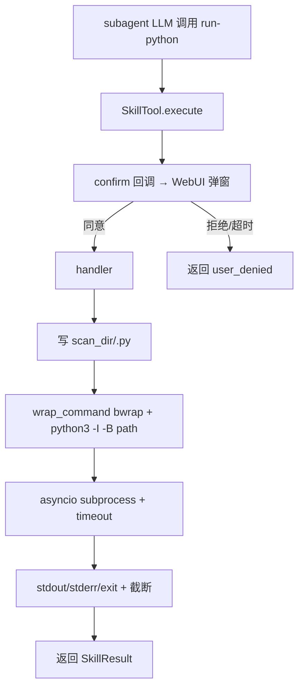

# 子智能体 run-python SkillTool

> **Status (2026-05-14)**: PR1 已完成并通过 10/10 测试。产物：
>
> - [`secbot/skills/run-python/`](file:///Users/shan/Downloads/nanobot/secbot/skills/run-python/) 三件套（SKILL.md + input.schema.json + output.schema.json + handler.py）
> - [`tests/skills/test_run_python_handler.py`](file:///Users/shan/Downloads/nanobot/tests/skills/test_run_python_handler.py) 10 个用例（metadata / 正常 / 截断 / 非零退出 / 超时 / 越界拒收 / 审批拒绝短路 / 审批后 sticky 免审）
> - `discover_skill_tools()` 发现数 14 → 15，run-python 正确识别为 critical + exclusive
> - `pytest tests/agent/ tests/skills/ --ignore=tests/agent/test_onboard_logic.py` 共 830 通过（onboard 失败为 pre-existing，与本改动无关）
>
> **意外发现**：[`HighRiskGate`](file:///Users/shan/Downloads/nanobot/secbot/agents/high_risk.py) 已原生实现 per-gate-instance sticky approve（`_approved_skills` 短路）。同一子代理任务内多次调用 run-python 自动免审。子任务 [`05-14-run-python-sticky-approve`](file:///Users/shan/Downloads/nanobot/.trellis/tasks/05-14-run-python-sticky-approve/prd.md) 已更新「现状评估」，建议启动前重新与 PM 对齐作用域。

## Goal

为子智能体（subagent）增加一个名为 `run-python` 的受沙箱 SkillTool，使其在遇到现有 SKILL 不覆盖的临时任务（PoC 调试、协议拼装、临时数据加工）时，能够**自行编写并执行 Python 脚本**，同时不破坏 `subagent.py §D4` 关于「subagent 必须经 SkillTool 才能触达 shell」的硬约束。

## What I already know

### 业务侧
- 子代理体系（[`SubagentManager`](file:///Users/shan/Downloads/nanobot/secbot/agent/subagent.py)）当前可用工具：read/write/edit_file、glob/grep、ask_user、blackboard 读写、web 搜索/抓取、以及 SkillTool 包装的安全工具集（nmap/fscan/nuclei/sqlmap 等）。
- **当前不存在通用脚本执行通道**：sqlmap 那类 `python3` 调用是绑定到具体 SKILL 的，并通过沙箱 + argv 校验 + 风险门拦截。

### 关键架构约束（必读 — 影响方向决策）

[`secbot/agent/subagent.py:447-453`](file:///Users/shan/Downloads/nanobot/secbot/agent/subagent.py#L447-L453) 明确写道：

> **Hard-disabled**: subagents must NEVER receive ExecTool. All shell access for security workflows MUST go through SkillTool (sandbox + argv parsing + risk gate). … operator misconfiguration kept leaking ``exec`` back to the LLM, so the registration is now removed unconditionally. **Do NOT re-enable without an explicit PRD update** — see `.trellis/tasks/archive/2026-05/05-11-security-tools-as-tools/prd.md §D4`.

也就是说：
- 子代理被设计为**不能直接调用 shell**；
- 一切外部命令必须通过 SkillTool（声明式 schema、沙箱、审批 gate）；
- "自由编写 python 并执行" 在能力面上 ≥ ExecTool（Python 可 import os/socket/任意 wheel），属于上面这条硬约束的**直接冲突项**。

### 已有的可重用基础设施
- [`ExecTool`](file:///Users/shan/Downloads/nanobot/secbot/agent/tools/shell.py) 已实现：deny_patterns、allow_patterns、`restrict_to_workspace`、`bwrap` 沙箱包装、超时、输出截断、env 隔离、内网 URL 拦截。
- [`secbot/agent/tools/sandbox.py`](file:///Users/shan/Downloads/nanobot/secbot/agent/tools/sandbox.py) 提供 bwrap 包装（仅工作区可写、tmpfs 隔离 config、media 只读）。
- SkillTool 框架已支持 `external_binary` 声明、参数 schema、风险审批回调。
- [`WriteFileTool`](file:///Users/shan/Downloads/nanobot/secbot/agent/tools/filesystem.py) 已能让子代理把脚本写到工作区 — 即"写入"能力已经具备，缺的是"执行"。

## Assumptions (temporary — 待用户确认)

- 用户的真实诉求是 **「让子代理在遇到现有 SKILL 不覆盖的临时任务时能即兴写代码处理」**，而不是无差别替代 SkillTool。
- 用户期望的运行环境是宿主 Python（即 secbot 本身的 venv），而非独立解释器。
- 用户接受**至少**等同于 ExecTool 的安全护栏（沙箱 + 超时 + 输出截断）。

## Open Questions

（Q1–Q5 已结案，记录在 *Decision (ADR-lite)* 节）

## Decision (ADR-lite)

**Context**：子代理被 §D4 硬约束禁用 ExecTool；同时业务侧需要在非预设场景下让子代理即兴写代码处理。

**Decisions**:
- **Q1 方向**：选 **A. SkillTool 化的 `run-python`** — 不破坏 §D4，自动接入审批/卡片/审计。
- **Q2 MVP 范围**：选 **M2. 受控出网，PoC 调试场景**（一次性脚本、无 persistent kernel、无 pip）。
- **Q3 沙箱强度**：选 **S1. 复用现有 ExecTool 护栏**，出网隔离交宿主网络层；文档明示「M2 出网不是安全边界」。
- **Q4 审批策略**：MVP 阶段沿用现有 critical 默认行为（**每次弹审批**）。**sticky approve per-session 拆出为独立子任务**（见 [`05-14-run-python-sticky-approve/prd.md`](file:///Users/shan/Downloads/nanobot/.trellis/tasks/05-14-run-python-sticky-approve/prd.md)），等 MVP 跑通后再做。
- **Q5 产物落点**：选 **O1. 仅返 stdout/stderr**（≤10k 截断）；脚本归档/blackboard 写入由 LLM 主动调 `write_file`/`write_blackboard` 完成。

**Consequences**:
- 不需要修订归档 PRD `§D4`，加一行注脚指向本任务即可。
- 当前任务**只复用** `bind_skill_context(confirm=...)` 现有审批回调（每次弹），无需引入会话级状态机。
- 内网/出网在 Python 层面绕过仍可能（`socket.connect(IP)`），文档需明确这是宿主网络层的责任，不在 MVP 范围。
- 与 sqlmap-detect 等现有 critical SKILL 风险等级、交互一致。

## Requirements

1. 新建 `secbot/skills/run-python/`（`SKILL.md` + `input.schema.json` + `handler.py`），元数据：`external_binary: python3`，`is_critical: true`。
2. Handler 接受单参 `code: str`（≤32 KB），写入 `<scan_dir>/run-python/<ts>.py`，通过 `python3 -I -B <path>` 启动（**不经 bash**）。
3. 复用 [`ExecTool`](file:///Users/shan/Downloads/nanobot/secbot/agent/tools/shell.py) 的：bwrap 沙箱包装（来自 `ExecToolConfig.sandbox`）、超时（默认 60s，最大 600s）、输出截断（10k chars）、env 隔离、`restrict_to_workspace` 路径校验、`contains_internal_url` 字符串拦截。
4. 审批沿用现有 SkillTool critical 通路（`bind_skill_context(confirm=...)`），每次调用弹一次审批；sticky approve 不在本任务范围。
5. 仅注册到 `SubagentManager`（不暴露给 CLI/API/orchestrator 直接调用）。允许通过 `agent.scoped_skills` 限定下发对象。
6. 输出固定格式：`STDOUT:\n...\nSTDERR:\n...\nExit code: N`；不写 blackboard、不返脚本内容。

## Acceptance Criteria

- [ ] 子代理可调用 `run-python(code=...)`，获得正常 stdout/stderr 与 exit code
- [ ] 默认未审批时返回 `summary.user_denied=true`，与现有 critical SKILL 失败路径一致
- [ ] 工作区越界写入（`open("/etc/passwd","w")`）在沙箱开启时被 bwrap 拦截
- [ ] 超时 / 输出超 10k 与 ExecTool 行为一致
- [ ] `discover_skill_tools()` 不破坏现有 SkillTool 排序与 tool_call 卡片渲染
- [ ] CLI 主代理（AgentLoop）默认**不**注册 run-python（防止运营误配）
- [ ] 单测覆盖：正常执行 / 超时 / sandbox 拦截 / 审批拒绝 / >32KB 拒收

## Definition of Done

- 测试 / lint / typecheck 全绿
- `docs/configuration.md` 增加 run-python 节，明确「M2 出网由宿主网络隔离」
- 在 `subagent.py §D4` 旁加一行注脚指向本任务的 PRD（说明 SkillTool 化路径仍合规）
- README/CHANGELOG 提示新工具与默认审批策略

## Technical Approach

### 文件结构
```
secbot/skills/run-python/
├── SKILL.md          # external_binary: python3, is_critical: true
├── input.schema.json # { code: string, timeout?: int }
└── handler.py        # 写临时 .py + 调 ExecTool 的 spawn/sandbox/截断逻辑
```

### 执行链路


### 关键复用点
- `ExecTool._spawn` / `wrap_command` / `_MAX_OUTPUT` / `_MAX_TIMEOUT`
- `_SubagentHook._classify_terminal` 已识别 `summary.user_denied`，无需改前端
- `bind_skill_context(confirm=...)` 现有 confirm 回调直接复用，每次调用弹一次审批

## Implementation Plan (small PRs)

### PR1 — Skill 骨架 + 执行核心（本任务核心）
- 新建 `secbot/skills/run-python/` 三件套
- handler 复用 ExecTool 的 spawn/sandbox/timeout/截断
- 测试：正常执行 / 超时 / 工作区越界 / >32KB 拒收 / 审批拒绝
- 审批走每次弹（现有 critical 默认行为）

### PR2 — 集成 + 文档 + §D4 注脚
- 验证 `discover_skill_tools()` 排序无回归
- 决定是否进入 `vuln_scan` 等 spec 的 `scoped_skills`（默认 **不进**，按需加）
- `docs/configuration.md` + README 风险段
- 给 `subagent.py §D4` 注释挂指向本任务 PRD 的链接

### 后续独立子任务（不在本任务范围）
- [`05-14-run-python-sticky-approve`](file:///Users/shan/Downloads/nanobot/.trellis/tasks/05-14-run-python-sticky-approve/prd.md) — sticky approve per-session 状态机；本 MVP 跑通后再启动。

## Out of Scope

- 暴露给 CLI/REST/orchestrator 父代理直接调用
- **Sticky approve per-session**（拆出为独立子任务）
- Persistent kernel（多轮共享变量）
- `pip install` 或装包能力
- netns / seccomp / import 黑名单（S2/S3 强化方向，留作后续 spec）
- 把 run-python 写入任何专家代理的默认 `scoped_skills`（避免默认放权）

## Technical Notes

- ExecTool 的 `contains_internal_url` 是字符串 grep，Python `socket.create_connection(("10.0.0.1", 80))` 仍可绕过 — 文档明示。
- macOS 开发态没 bwrap，`ExecToolConfig.sandbox=""` 时不沙箱（与 ExecTool 既有行为一致）；生产容器内 `sandbox=bwrap` 自动生效。
- 推荐用 `python3 -I -B <path>` 而非 `-c`：`-I` 隔离 site-packages 用户目录、`-B` 不写 `__pycache__`，参数走 argv 不经 shell，零注入面。
- 参考实现：[`secbot/skills/sqlmap-detect/handler.py`](file:///Users/shan/Downloads/nanobot/secbot/skills/sqlmap-detect/handler.py)。

## Research References

（无需额外 research — 决策完全基于本仓库现有约束与 ExecTool 实现）

