# secbot-ai 架构文档

> 本文档基于代码库分析生成，为后续功能开发提供架构参考。

---

## 1. 项目概述

**secbot-ai**（项目代号 nanobot）是一个面向网络安全运营的**对话式多智能体 VAPT 平台**（Vulnerability Assessment & Penetration Testing）。

通过 LLM 编排多个专家智能体（Expert Agent），自动化完成从资产发现、端口扫描、Web 爬取、漏洞检测、弱口令爆破到报告生成的完整安全测试流水线。用户通过对话界面下达任务，Orchestrator 智能体负责意图理解、任务分发和结果汇总。

### 1.1 技术栈

| 层级 | 技术选型 |
|---|---|
| 语言 | Python 3.11+、TypeScript（前端） |
| 包管理 | Hatch / uv |
| LLM 提供商 | Anthropic、OpenAI、Azure OpenAI、AWS Bedrock、GitHub Copilot、OpenAI Codex |
| Web 框架 | aiohttp（API 服务）、websockets（WebSocket 通道） |
| 前端 | React 18 + Vite + TypeScript + Tailwind CSS + shadcn/ui |
| 数据库 | SQLite + SQLAlchemy 2.x (async) + Alembic |
| CLI | Typer |
| 消息协议 | OpenAI-compatible `/v1/chat/completions` |

---

## 2. 系统架构总览

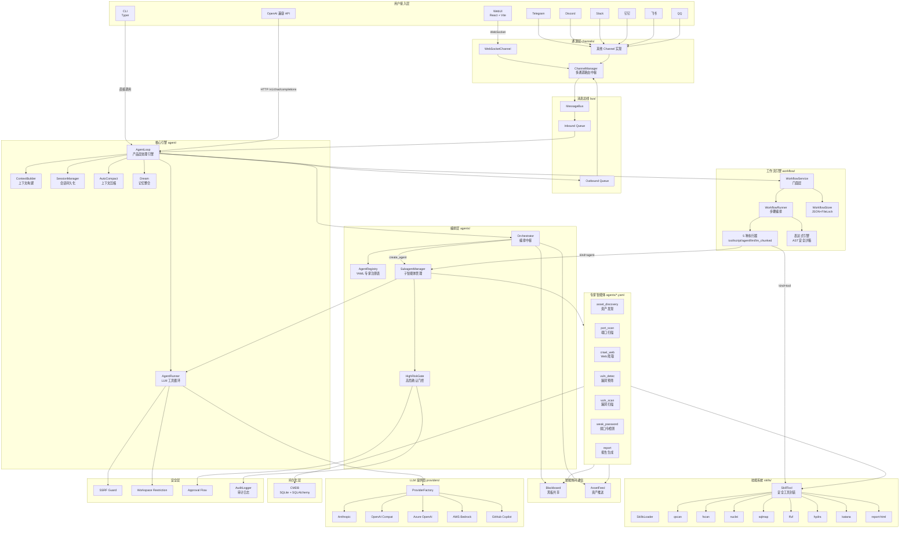

---

## 3. 数据流架构

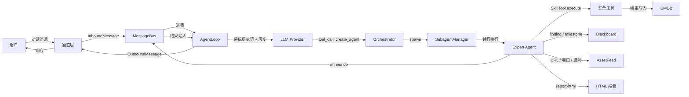

---

## 4. 核心模块详解

### 4.1 AgentRunner — LLM 工具循环引擎

**路径**: `secbot/agent/runner.py`

**定位**: 通用 LLM 工具循环，负责"LLM 调用 → 工具执行 → 结果注入"的核心循环，不关心产品层逻辑。

#### 核心数据结构

| 结构 | 职责 |
|---|---|
| `AgentRunSpec` | 单次执行的完整配置：消息、工具注册表、模型、迭代上限、上下文窗口、各种回调 |
| `AgentRunResult` | 执行结果：最终内容、消息历史、工具使用列表、token 用量、停止原因 |

#### 核心循环

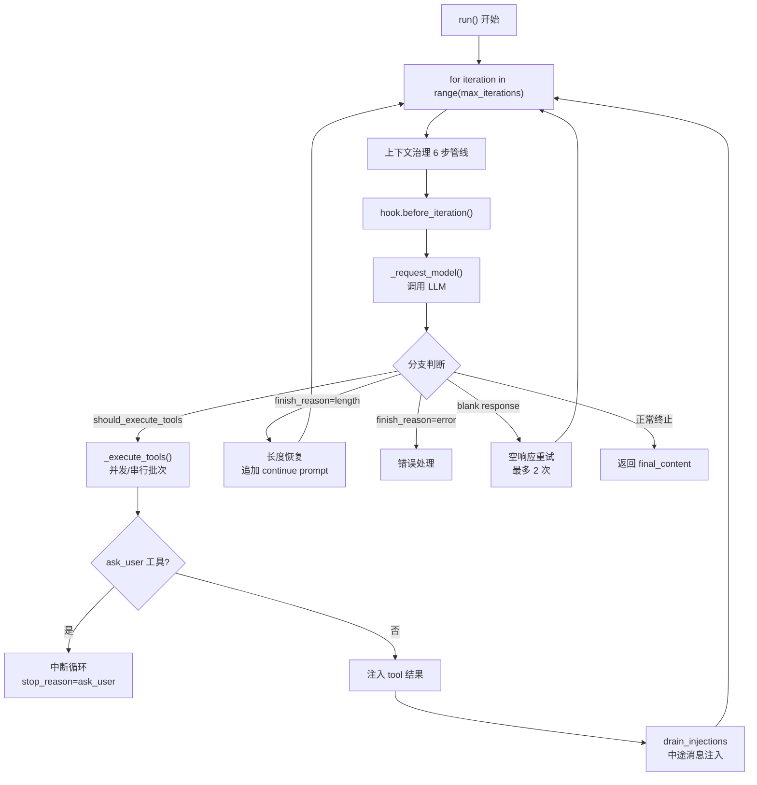

#### 上下文治理管线（6 步）

```
1. drop_orphan_tool_results     — 清除无主 tool 结果
2. backfill_missing_tool_results — 补缺失 tool 结果
3. microcompact                  — 旧工具结果摘要化（保留最近 10 条）
4. apply_tool_result_budget      — 截断超大结果
5. snip_history                  — token 预算裁剪
6. 再次清理 orphans + backfill
```

#### 安全机制

- **SSRF 边界**: 检测 `internal/private url detected` 标记，返回不可绕过的安全提示
- **工作区限制**: 检测路径遍历/越权操作，重复违规升级提示
- **注入机制**: 通过 `injection_callback` 从外部队列注入用户消息，最多 5 个周期、每周期 3 条

---

### 4.2 AgentLoop — 核心处理引擎

**路径**: `secbot/agent/loop.py`（~1737 行）

**定位**: 在 AgentRunner 之上构建的产品层，负责会话管理、工具注册、通道协调、子智能体编排。

#### 初始化组件

| 组件 | 职责 |
|---|---|
| `ContextBuilder` | 构建系统提示词 + 历史 + 技能描述 |
| `SessionManager` | 会话持久化（JSON 文件） |
| `ToolRegistry` | 工具注册表 |
| `AgentRunner` | LLM 循环引擎 |
| `SubagentManager` | 子智能体生命周期 |
| `BlackboardRegistry` | 聊天级黑板共享 |
| `AssetFeedRegistry` | 聊天级资产推送 |
| `HighRiskGate` | 高危操作审批门控 |
| `Consolidator` / `AutoCompact` / `Dream` | 记忆整合 / 自动压缩 / 梦境巩固 |
| `CommandRouter` | 斜杠命令路由 |

#### 消息处理流

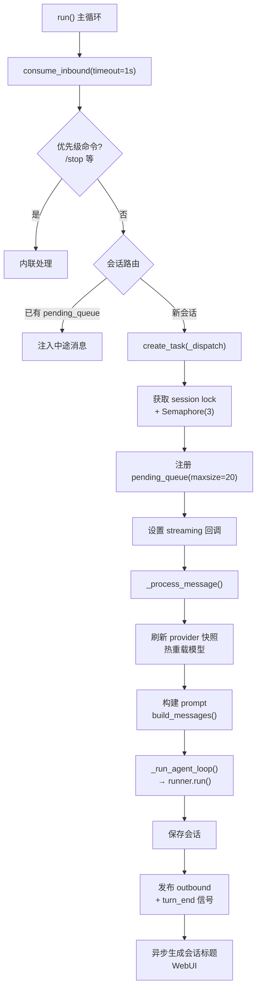

#### 工具注册策略

| Loop 类型 | 注册工具 |
|---|---|
| **Orchestrator Loop** | `SpawnTool`(create_agent) + `BlackboardReadTool` + `ReadAssetsTool` + `RequestApprovalTool` + `WritePlanTool` + `MessageTool` + `ReadFileTool`（只读 .secbot/） |
| **Operational Loop** | 完整文件操作（Read/Write/Edit/Glob/Grep） + `CurlTool` + `MessageTool` + `SpawnTool` + `BlackboardWrite/Read` + `AssetPush/Read` + **所有 SkillTool**（28+ 安全技能） |

#### 关键设计

- **中途注入**: `pending_queue` 接收子智能体结果/资产发现/用户追问，按优先级排序（user > subagent_result > asset_discovered）
- **Provider 热重载**: 运行时切换 model/provider，同步更新 runner/subagents/consolidator/dream
- **并发控制**: `SECBOT_MAX_CONCURRENT_REQUESTS` 环境变量（默认 3），通过 Semaphore 限制
- **MCP 集成**: 懒加载 MCP 服务器，注册为额外工具

---

### 4.3 ChannelManager — 多通道消息路由中枢

**路径**: `secbot/channels/manager.py`

**定位**: 协调通道初始化、消息分发、流式传输。

#### 架构层次

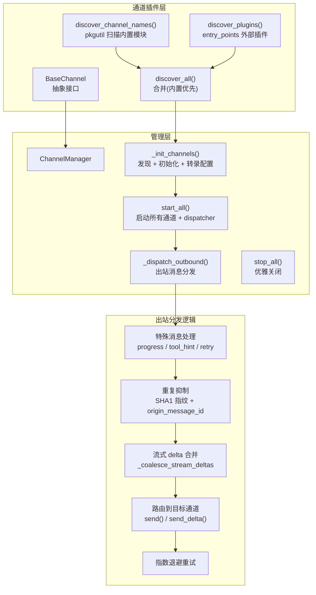

#### 通道配置

- 每个通道独立的 `allowFrom` 白名单
- `sendProgress` / `sendToolHints` 全局 + 通道级覆盖
- 语音转录：OpenAI / Groq Whisper

---

### 4.4 CMDB — 配置管理数据库

**路径**: `secbot/cmdb/`

**定位**: 持久化扫描结果（资产/服务/漏洞/报告），提供仪表盘聚合查询。

#### 数据模型

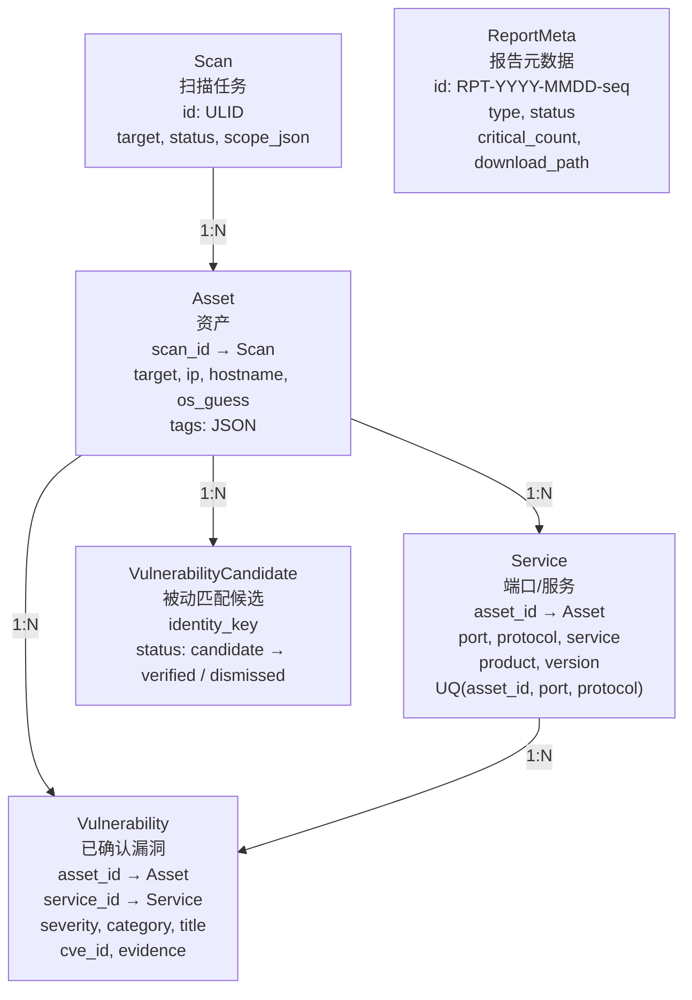

#### 层级结构

| 文件 | 职责 |
|---|---|
| `models.py` | SQLAlchemy ORM 模型定义 |
| `db.py` | 异步引擎（aiosqlite）、SQLite PRAGMAs（WAL + NORMAL + FK）、`get_session()` |
| `repo.py` | CRUD 操作 + 仪表盘聚合查询（~1567 行） |
| `writes.py` | 技能结果桥接（自动分类资产 + 批量写入） |

#### 仓库层核心 API

**CRUD 操作**:

| 函数 | 自然键 |
|---|---|
| `create_scan` / `update_scan_status` | ULID |
| `upsert_asset` | IP > hostname > target（归一化匹配） |
| `upsert_service` | (asset_id, port, protocol) |
| `upsert_vulnerability` | (asset_id, service_id, title, cve_id) |
| `upsert_vulnerability_candidate` | (actor_id, asset_id, service_id, identity_key) |
| `insert_report_meta` / `update_report_status` | RPT-YYYY-MMDD-seq |

**仪表盘聚合**:

| 函数 | 用途 |
|---|---|
| `summary_counts()` | 5 个 KPI 卡片 + 24h delta |
| `vuln_trend()` | 7/30/90 天漏洞趋势（按严重度） |
| `vuln_distribution()` | 漏洞分类分布 |
| `asset_type_distribution()` | 资产类型分布（中文标签） |
| `asset_cluster()` | 业务系统 × 严重度聚类 |
| `asset_risk_topology()` | 资产-服务-漏洞图谱（支持过滤） |

#### 写入桥接

- **自动分类** (`classify_asset()`): 根据 IP/端口/产品指纹自动推断 `tags.type`（智能体/中间件/OA/支撑/业务/内网/其他）
- **批量写入** (`apply_cmdb_writes()`): 解析技能生成的 `cmdb_writes` 指令，自动创建 资产 → 服务 → 漏洞
- **关键漏洞通知**: `upsert_vulnerability` 发现 severity=critical 时自动发布通知

---

### 4.5 SubagentManager — 子智能体生命周期管理

**路径**: `secbot/agent/subagent.py`（850 行）

**定位**: 管理专家智能体的创建、执行、状态追踪和结果回报，是 Orchestrator 与 Expert Agent 之间的桥梁层。

#### 核心数据结构

| 结构 | 职责 |
|---|---|
| `SubagentStatus` | 实时状态追踪：phase（initializing → awaiting_tools → tools_completed → final_response → done / error）、iteration、tool_events、usage、heartbeat |
| `_SubagentHook` | 执行钩子：镜像迭代/工具事件到 SubagentStatus + 通过 `broadcast_fn` 向前端推送 tool_call 事件帧（running/critical → ok/error） |

#### spawn() 流程

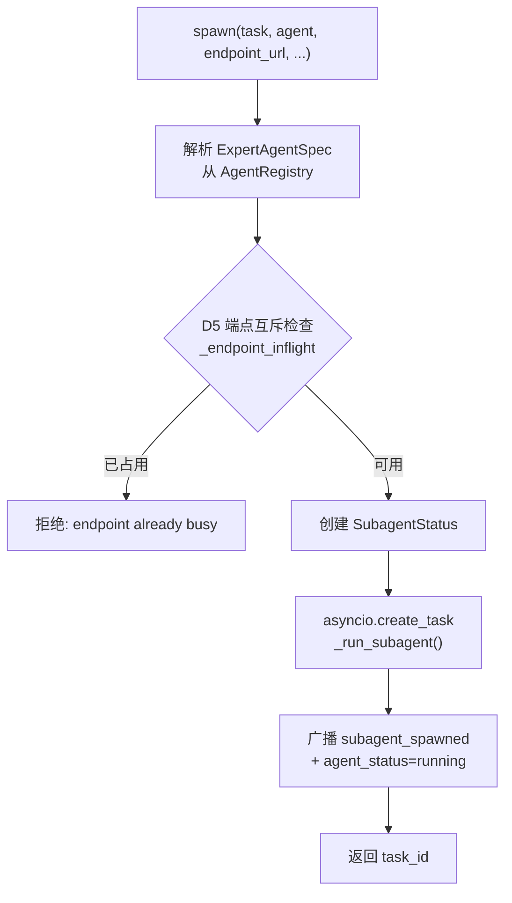

#### _run_subagent() 内部流程

```
1. 解析 chat-scoped Blackboard + AssetFeed（从 Registry）
2. 构建工具集:
   ├─ minimal_tools=True（如 report）→ 仅 Scoped SkillTool
   └─ minimal_tools=False → 文件操作 + curl + blackboard + ask_user
      + exec（仅当 exec_config.enable && spec.allow_exec）
      + asset_feed + 所有 scoped SkillTool
3. 继承父循环的 SkillContext（scan_id + confirm 回调 + asset_auto_management）
4. 构建 system_prompt（基础模板 + spec.system_prompt）
5. 调用 AgentRunner.run(AgentRunSpec(...))
6. 结果处理:
   ├─ stop_reason=tool_error → _announceResult(partial_progress) + status=error
   ├─ stop_reason=error → _announceResult(error) + status=error
   └─ 正常完成 → _announceResult(final_content) + status=ok
7. _cleanup: 释放 endpoint mutex + 延迟清除 status（60s 可见窗口）
```

#### 结果回报机制

- 通过 `_announceResult()` 将结果注入父 AgentLoop 的 `pending_queue`（优先直接回调 → 降级到 MessageBus）
- 使用 `InboundMessage(session_key_override=...)` 确保路由到正确的会话
- 结果模板渲染自 `agent/subagent_announce.md`

#### 端点互斥（D5）

- `_normalise_endpoint_key()`: URL 归一化（去默认端口、去尾斜杠、去 query/fragment）+ param 小写
- `_endpoint_inflight` 字典：`(normalised_url, param)` → task_id
- spawn 时检查、完成时释放，防止并发扫描同一端点

---

### 4.6 Orchestrator — 编排中枢

**路径**: `secbot/agents/orchestrator.py`

**定位**: 纯提示词模块，通过 `render_orchestrator_prompt()` 生成 Orchestrator Loop 的系统提示词，由五个锁定段组成。

#### 提示词结构

| 段落 | 内容 |
|---|---|
| `# Role` | 固定角色定义："security operations assistant" |
| `# Hard rules` | 通用规则（工具使用、`read_file` 限制、黑板复用、COMPLETENESS GATE、报告兜底、高危确认） |
| `# Planning` | 动态规划指引：根据用户请求与 agent 描述自主决定派发顺序，用 `write_plan` 输出计划 |
| `# Available expert agents` | 动态生成的专家智能体小节（从 AgentRegistry 渲染，含完整多行 description） |
| `# Working style` | 工作风格指南（计划、批量消费 asset feed、`report_path` 呈现、语言等） |

#### 关键编排规则

1. **动态规划**: Orchestrator 根据用户请求与各 agent 的完整描述动态决定派发哪些 agent 及顺序，不再遵循固定流水线
2. **路由知识下沉**: 各 agent 的业务路由规则（协议限制、sqlmap 门控、适用场景等）写在 YAML description 中，通过渲染完整描述传递给 Orchestrator
3. **完整性门控**: 所有已派发的子代理 completed/error 后才进入收尾
4. **报告兜底**: 任务涉及扫描时，无论成败都必须生成报告（除非用户明确不要）
5. **黑板复用**: 派发前 `read_blackboard` 检查已有发现，避免重复工作

---

### 4.7 AgentRegistry — YAML 专家注册表

**路径**: `secbot/agents/registry.py`（389 行）

**定位**: 从 `agents/*.yaml` 加载、验证、注册专家智能体定义，启动时任何验证错误都会中断启动（无部分注册）。

#### ExpertAgentSpec 字段

| 字段 | 类型 | 说明 |
|---|---|---|
| `name` | str | 唯一标识（`^[a-z][a-z0-9_]*$`，必须等于文件名） |
| `display_name` | str | 显示名称 |
| `description` | str | 描述（首行用于编排表） |
| `system_prompt` | str | 从 `system_prompt_file` 加载的完整提示词 |
| `scoped_skills` | tuple[str, ...] | 绑定的技能列表（不可跨智能体共享） |
| `endpoint_bound` | bool | 是否端点绑定（vuln_detec / weak_password） |
| `minimal_tools` | bool | 是否仅接收 SkillTool（如 report） |
| `allow_exec` | bool | 是否允许 ExecTool |
| `max_iterations` | int | 最大迭代次数（默认 10） |
| `required_binaries` | tuple | 需要的外部二进制文件 |
| `missing_binaries` | tuple | 缺失的二进制（`available` 属性判断依据） |

#### 加载验证流程

```
load_agent_registry(agents_dir, skill_names, skills_root, skill_binary_overrides)
  1. 扫描 agents_dir/*.yaml
  2. 逐个 _load_one():
     ├─ YAML 解析 → 必填字段检查
     ├─ name 正则验证 + 文件名一致性
     ├─ scoped_skills 非空 + 已知技能集校验
     ├─ system_prompt_file 存在性 + 内容加载
     ├─ legacy_input_schema / output_schema JSON Schema 2020-12 验证
     └─ model / max_iterations / allow_exec / endpoint_bound / minimal_tools 类型检查
  3. 技能互斥检查（§5: 一个 skill 不能被两个 agent 声明）
  4. 二进制可用性检查（skill_binaries 覆盖 > PATH 查找）
```

---

### 4.8 MessageBus — 异步消息总线

**路径**: `secbot/bus/queue.py` + `secbot/bus/events.py`

**定位**: 通过 `asyncio.Queue` 实现通道层与智能体层的完全解耦。

#### 事件类型

| 类型 | 字段 | 用途 |
|---|---|---|
| `InboundMessage` | channel, sender_id, chat_id, content, timestamp, media, metadata, session_key_override | 从通道到智能体 |
| `OutboundMessage` | channel, chat_id, content, reply_to, media, metadata, buttons | 从智能体到通道 |

#### 核心接口

| 方法 | 方向 | 说明 |
|---|---|---|
| `publish_inbound(msg)` | 通道 → Agent | 通道发布消息 |
| `consume_inbound()` | Agent 消费 | 阻塞等待下一条入站消息 |
| `publish_outbound(msg)` | Agent → 通道 | 智能体发布响应 |
| `consume_outbound()` | 通道消费 | ChannelManager 消费出站消息 |

#### 会话路由

- `session_key` = `session_key_override` 或 `"{channel}:{chat_id}"`
- SubagentManager 通过 `session_key_override` 确保子智能体结果路由到父会话的 `pending_queue`

---

### 4.9 Skills 系统 — 安全技能框架

**路径**: `secbot/agent/skills.py` + `secbot/skills/`

**定位**: 将安全工具（nuclei/sqlmap/fscan 等）封装为 LLM 可调用的工具，支持 Markdown 描述 + Python handler 的二层架构。

#### 技能目录结构

```
skills/<name>/
├── SKILL.md              # 描述文件（YAML frontmatter + Markdown body）
├── handler.py            # Python 处理器（async run(args, ctx) → SkillResult）
├── input.schema.json     # 输入 JSON Schema（可选，workflow UI 用）
└── output.schema.json    # 输出 JSON Schema（可选）
```

#### SkillsLoader 核心能力

| 方法 | 用途 |
|---|---|
| `list_skills(filter_unavailable)` | 列出所有可用技能（workspace 优先 > builtin，名称去重） |
| `load_skill(name)` | 加载单个 SKILL.md 内容 |
| `build_skills_summary()` | 构建技能摘要（渐进式加载） |
| `get_always_skills()` | 获取 always=true 的技能（始终注入上下文） |
| `get_skill_metadata(name)` | 解析 YAML frontmatter 元数据 |

#### SkillTool 执行链

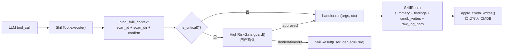

#### 17 个带 handler.py 的技能

| 技能 | 外部工具 | 能力 |
|---|---|---|
| qscan-host-discovery | qscan | 主机发现 |
| qscan-port-scan | qscan | 端口扫描 |
| fscan-asset-discovery | fscan | 资产发现 |
| fscan-port-scan | fscan | 端口扫描 |
| fscan-vuln-scan | fscan | 漏洞扫描 |
| nuclei-template-scan | nuclei | 模板化漏洞检测 |
| sqlmap-detect | sqlmap | SQL 注入检测 |
| sqlmap-dump | sqlmap | 数据库提取 |
| katana-crawl-web | katana | Web 爬取（567 行，最大 handler） |
| httpx-probe | httpx | HTTP 探测 |
| ffuf-dir-fuzz | ffuf | 目录模糊测试 |
| ffuf-vhost-fuzz | ffuf | 虚拟主机模糊测试 |
| hydra-bruteforce | hydra | 弱口令爆破 |
| vuln-detec-manual | - | 手动漏洞检测（540 行） |
| report-html | - | HTML 报告生成 |
| run-python | Python | Python 脚本执行 |
| detection-db-query | - | 检测结果数据库查询 |

---

### 4.10 Workflow 引擎 — 可视化工作流

**路径**: `secbot/workflow/`（9 个模块，~3300 行）

**定位**: 支持可视化编辑、定时触发、条件分支的多步骤工作流引擎，独立于智能体对话流程运行。

#### 架构分层

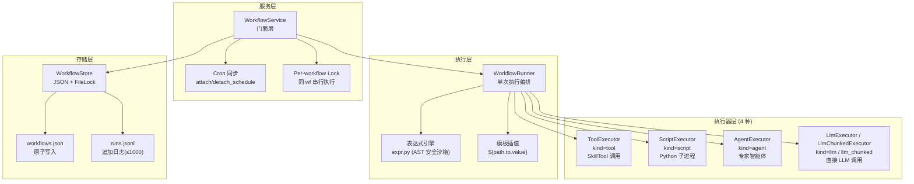

#### 数据模型

| 类型 | 关键字段 |
|---|---|
| `Workflow` | id, name, description, tags, inputs, steps, schedule_ref |
| `WorkflowInput` | name, label, type(string/cidr/int/bool/enum/file), required, default |
| `WorkflowStep` | id, name, kind(tool/script/agent/llm/llm_chunked), ref, args, condition, on_error(stop/continue/retry), retry |
| `WorkflowRun` | id, workflow_id, status(running/ok/error/cancelled), inputs, step_results, trigger(manual/cron/api) |
| `StepResult` | status(ok/error/skipped/retried), started_at_ms, finished_at_ms, duration_ms, output, error |

#### 执行流程

```
WorkflowRunner._execute_steps():
  1. emit("workflow.run.started")
  2. for step in workflow.steps:
     ├─ 取消检查（self._cancelled）
     ├─ 条件评估: eval_bool(step.condition, ctx) → AST 安全沙箱
     │   └─ Falsy → StepResult.skipped()
     ├─ 参数插值: interpolate(step.args, ctx) → ${path} 替换
     ├─ 分发到 executor（按 step.kind）
     ├─ 重试逻辑: retry 次 × 0.5s 固定退避
     ├─ on_error 处理: stop → abort / continue → 继续
     ├─ store.upsert_run()（每步持久化）
     └─ emit("workflow.step.finished")
  3. emit("workflow.run.finished")
```

#### 表达式引擎 (`expr.py`)

- **模板插值**: `${inputs.target}` / `${steps.step1.result.parsed.confidence}` — 支持 null-safe 遍历
- **条件求值**: `eval_bool()` — 基于 Python AST 白名单（无 Call / 无 dunder / 无 import），支持 BoolOp / Compare / BinOp / Subscript
- **安全保证**: `eval()` 永不执行，所有操作在编译时 AST 白名单检查

#### 内置模板

| 模板 | 步骤 | 说明 |
|---|---|---|
| `phishing-email-detect` | script → llm → script | 钓鱼邮件检测（特征提取 + LLM 判定 + 结果聚合 + rspamd add_score） |
| `log-analysis` | script → llm_chunked → script | 日志安全分析（文件读取 + 分块 LLM 分析 + 入库） |

---

### 4.11 WebUI — React 前端

**路径**: `webui/src/`（115+ TSX 文件）

**定位**: 基于 React 18 + Vite + TypeScript + Tailwind CSS + shadcn/ui 的单页应用，通过 WebSocket 与后端实时通信。

#### 路由结构

| 路径 | 页面 | 说明 |
|---|---|---|
| `/login` | LoginPage | 认证页（Shared Secret） |
| `/` | HomePage | 对话主页（Shell + ChatPane） |
| `/dashboard` | DashboardPage | CMDB 仪表盘（KPI + 趋势 + 分布） |
| `/dashboard/phishing` | PhishingDetailPage | 钓鱼检测详情 |
| `/dashboard/log-analysis` | LogAnalysisDetailPage | 日志分析详情（813 行，最大页面） |
| `/tasks/:id` | TaskDetailPage | 任务详情 |
| `/workflows` | WorkflowListPage | 工作流列表 |
| `/workflows/:id` | WorkflowDetailPage | 工作流编辑器 |
| `/settings` | SettingsPage | 设置（模型/Provider/通道） |

#### 核心架构

```mermaid
graph TB
    subgraph Bootstrap["启动层"]
        App["App.tsx<br/>路由 + Bootstrap"]
        FetchBootstrap["fetchBootstrap()<br/>获取 ws_path + token"]
        SecbotClient["SecbotClient<br/>WebSocket 客户端"]
        ClientProvider["ClientProvider<br/>React Context"]
    end

    subgraph Pages["页面层"]
        HomePage["HomePage<br/>对话"]
        DashboardPage["DashboardPage<br/>仪表盘"]
        WorkflowPages["WorkflowPages<br/>工作流编辑器"]
        SettingsPage["SettingsPage<br/>设置"]
    end

    subgraph Components["组件层 (70+)"]
        Shell["Shell<br/>主布局"]
        MessageBubble["MessageBubble<br/>消息渲染"]
        ToolCallCard["ToolCallCard<br/>工具调用卡片"]
        AgentEventCard["AgentEventCard<br/>智能体事件卡片"]
        ThreadShell["ThreadShell<br/>对话线程"]
        WorkflowEditor["StepEditor / RunDialog<br/>工作流编辑"]
    end

    subgraph Hooks["Hooks 层 (9 个)"]
        useNanobotStream["useNanobotStream<br/>WebSocket 消息流"]
        useSessions["useSessions<br/>会话管理"]
        useActivityStream["useActivityStream<br/>活动流"]
        useAgents["useAgents<br/>智能体状态"]
        useNotifications["useNotifications<br/>通知"]
    end

    subgraph Lib["工具库层 (14 个)"]
        Api["api.ts<br/>REST API 客户端"]
        BootstrapLib["bootstrap.ts<br/>启动辅助"]
        Types["types.ts<br/>TypeScript 类型"]
        WorkflowClient["workflow-client.ts<br/>工作流 API"]
    end

    App --> FetchBootstrap
    FetchBootstrap --> SecbotClient
    SecbotClient --> ClientProvider
    ClientProvider --> Pages
    Pages --> Components
    Components --> Hooks
    Hooks --> Lib
```

#### WebSocket 事件类型

前端通过 `useNanobotStream` hook 订阅以下事件：

| 事件 | 数据 | 渲染组件 |
|---|---|---|
| `message` | 文本/Markdown | MessageBubble |
| `stream_delta` / `stream_end` | 流式文本增量 | MessageBubble (streaming) |
| `tool_call` | 工具调用帧（running/ok/error） | ToolCallCard |
| `agent_event` | 智能体生命周期（spawn/status/done） | AgentEventCard |
| `_progress` | 进度信息 | Shell 进度条 |
| `_retry_wait` | LLM 重试等待 | ConnectionBadge |
| `high_risk_confirm` | 高危确认弹窗 | AlertDialog |
| `plan` | 计划步骤 | PlanEvents |
| `notification` | 通知 | NotificationPanel |

#### SecbotClient 连接管理

- 自动重连（指数退避）
- Token 刷新（`onReauth` 回调 → `fetchBootstrap` → 新 WebSocket URL）
- 认证：Shared Secret → Bootstrap API → JWT Token → WebSocket 鉴权

---

## 5. 专家智能体系统

### 5.1 专家智能体清单

| 智能体 | YAML 定义 | 职责 | 核心技能 |
|---|---|---|---|
| `asset_discovery` | `agents/asset_discovery.yaml` | 主机/子网发现 | qscan-host-discovery, fscan-asset-discovery |
| `port_scan` | `agents/port_scan.yaml` | 端口与服务扫描 | qscan-port-scan, fscan-port-scan |
| `crawl_web` | `agents/crawl_web.yaml` | Web 爬取与端点发现 | katana-crawl-web, httpx-probe |
| `vuln_detec` | `agents/vuln_detec.yaml` | HTTP 端点漏洞预筛 | nuclei-template-scan, vuln-detec-manual |
| `vuln_scan` | `agents/vuln_scan.yaml` | 综合漏洞扫描 | fscan-vuln-scan, sqlmap-detect, sqlmap-dump |
| `weak_password` | `agents/weak_password.yaml` | 弱口令检测 | hydra-bruteforce |
| `report` | `agents/report.yaml` | HTML 报告生成 | report-html |

### 5.2 VAPT 流水线

```
asset_discovery → port_scan → crawl_web → vuln_detec → vuln_scan → weak_password → report
```

### 5.3 编排机制

> 详细模块分析参见 [4.5 SubagentManager](#45-subagentmanager--子智能体生命周期管理)、[4.6 Orchestrator](#46-orchestrator--编排中枢)、[4.7 AgentRegistry](#47-agentregistry--yaml-专家注册表)

- **AgentRegistry**: YAML 驱动注册，启动时全量验证（无部分注册），技能互斥（§5: skill 不可跨 agent 共享），二进制可用性检查（skill_binary_overrides > PATH）
- **SubagentManager**: asyncio.Task 并行执行，`_SubagentHook` 实时广播 tool_call 事件帧到 WebSocket，endpoint_inflight 字典实现 D5 端点互斥，结果通过 pending_queue 注入父循环
- **HighRiskGate**: `critical` 级别技能执行前 `ctx.confirm(payload)` 阻塞等待用户确认（120s 超时），同会话同技能批准后免重复弹窗，AuditLogger 审计日志
- **Blackboard**: 聊天级（`BlackboardRegistry`），条目自动提取 kind 标签（`[finding]` / `[milestone]` / `[blocker]` / `[progress]`），Orchestrator 通过 `read_blackboard` 工具读取
- **AssetFeed**: 聊天级（`AssetFeedRegistry`），纯内存无持久化，6 种标准 kind（url/port/service/credential/vuln/tech），支持 `since_id` 游标分页

---

## 6. 工具系统

### 6.1 内置工具（`agent/tools/`）

| 工具文件 | 工具 | 用途 |
|---|---|---|
| `spawn.py` | SpawnTool | 创建专家智能体 (create_agent) |
| `skill.py` | SkillTool | 安全技能封装与执行 |
| `filesystem.py` | Read/Write/Edit/Glob/Grep | 文件操作 |
| `shell.py` | ShellTool | 命令执行 |
| `curl.py` | CurlTool | HTTP 请求 |
| `blackboard.py` | BlackboardRead/Write | 黑板通信 |
| `asset_feed.py` | AssetPush/Read | 资产推送 |
| `approval.py` | RequestApproval | 高危操作审批 |
| `message.py` | MessageTool | 消息发送 |
| `plan.py` | WritePlanTool | 计划编写 |
| `ask.py` | AskUserTool | 用户交互 |
| `search.py` | SearchTool | 代码搜索 |
| `web.py` | WebTool | Web 操作 |
| `mcp.py` | MCPTool | MCP 服务器集成 |
| `cron.py` | CronTool | 定时任务 |
| `notebook.py` | NotebookTool | 笔记本 |
| `teammate.py` | TeammateTool | 队友协作 |
| `self.py` | SelfTool | 自身操作 |

### 6.2 安全技能（`skills/`）

28+ 安全技能，每个技能包含 `SKILL.md` 描述文件和处理器：

| 技能 | 工具 | 能力 |
|---|---|---|
| qscan-host-discovery | qscan | 主机发现 |
| qscan-port-scan | qscan | 端口扫描 |
| fscan-asset-discovery | fscan | 资产发现 |
| fscan-port-scan | fscan | 端口扫描 |
| fscan-vuln-scan | fscan | 漏洞扫描 |
| nuclei-template-scan | nuclei | 模板化漏洞检测 |
| sqlmap-detect | sqlmap | SQL 注入检测 |
| sqlmap-dump | sqlmap | 数据库提取 |
| katana-crawl-web | katana | Web 爬取 |
| httpx-probe | httpx | HTTP 探测 |
| ffuf-dir-fuzz | ffuf | 目录模糊测试 |
| ffuf-vhost-fuzz | ffuf | 虚拟主机模糊测试 |
| hydra-bruteforce | hydra | 弱口令爆破 |
| vuln-detec-manual | 手动 | 手动漏洞检测 |
| report-html | 内置 | HTML 报告生成 |
| ctf-web | 内置 | CTF Web 挑战 |
| secknowledge-skill | 内置 | 安全知识库 |
| run-python | Python | Python 脚本执行 |

---

## 7. 工作流引擎

> 详细架构参见 [4.10 Workflow 引擎](#410-workflow-引擎--可视化工作流)

**路径**: `secbot/workflow/`（9 个模块，~3300 行）

| 文件 | 职责 |
|---|---|
| `types.py` | 数据模型：Workflow / WorkflowStep(4种kind) / WorkflowRun / StepResult / WorkflowInput(6种type) |
| `service.py` | WorkflowService 门面 — CRUD + Cron 同步 + Per-workflow 并发锁 + 异步执行 |
| `runner.py` | WorkflowRunner — 步骤编排（条件求值 → 参数插值 → 执行器分发 → 重试 → on_error） |
| `store.py` | WorkflowStore — JSON + FileLock 持久化（workflows.json 原子写入 + runs.jsonl ≤1000 条） |
| `expr.py` | AST 安全表达式引擎 — `${path}` 模板插值 + `eval_bool()` 条件求值（无 eval/Call/dunder） |
| `templates.py` | 内置模板：钓鱼邮件检测（script→llm→script）+ 日志安全分析（script→llm_chunked→script） |
| `scripts.py` | 内联 Python 脚本库（1104 行）：特征提取 + SQLite 缓存 + 结果聚合 + rspamd 评分 |
| `skill_adapter.py` | SkillToolRegistryAdapter — 将 skills/ 目录适配为 Workflow ToolRegistry |
| `executors/` | 5 种执行器：ToolExecutor / ScriptExecutor / AgentExecutor / LlmExecutor / LlmChunkedExecutor |

---

## 8. API 层

**路径**: `secbot/api/`

| 文件 | 职责 |
|---|---|
| `server.py` | aiohttp 应用、路由注册、OpenAI 兼容 API |
| `agents.py` | 智能体管理 REST API |
| `blackboard.py` | 黑板数据 REST API |
| `asset_feed.py` | 资产推送 REST API |
| `workflow_routes.py` | 工作流 REST API |
| `prompts.py` | 提示词管理 API |
| `log_analysis_dashboard.py` | 日志分析仪表盘 |
| `phishing_dashboard.py` | 钓鱼检测仪表盘 |

---

## 9. 关键设计模式

### 9.1 消息总线解耦

`MessageBus` 通过 async Queue 将通道层与智能体层完全解耦，支持多通道并行接入。入站消息和出站消息分别通过独立队列流转。

### 9.2 专家智能体模式

每个安全能力封装为独立的 Expert Agent（YAML 定义），通过 `create_agent` 工具统一调度。新增智能体只需添加 YAML 配置。

### 9.3 黑板通信

智能体间通过 `Blackboard` 共享发现（finding / blocker / milestone / progress），Orchestrator 在分发前读取黑板避免重复工作。

### 9.4 技能即工具

安全工具（nuclei / sqlmap / fscan 等）封装为 `SkillTool`，通过 Markdown SKILL.md 描述用法，运行时作为 LLM 一等工具暴露。

### 9.5 高危门控

`critical` 级别技能执行前必须经过 `HighRiskGate` 用户确认（WebUI 弹窗 / CLI 交互）。

### 9.6 SSRF 安全边界

`AgentRunner` 内置 SSRF 检测和工作区限制，防止智能体访问内网地址或越权操作文件。

### 9.7 上下文治理

microcompact（旧工具结果摘要化）+ snip_history（token 预算管理）+ orphan tool result 清理，确保长对话不超窗口。

### 9.8 端点互斥

endpoint-bound 智能体（如 vuln_detec）通过归一化 URL + 参数 key 实现端点级互斥，避免并发扫描同一目标。

---

## 10. 模块间协作关系

### 10.1 核心处理链路

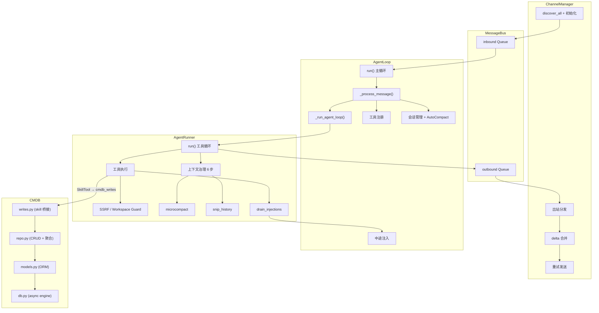

### 10.2 编排与子智能体协作

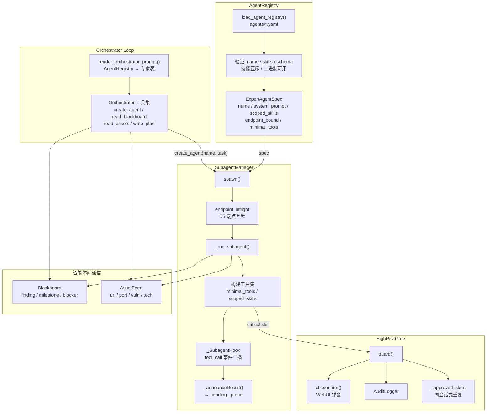

### 10.3 工作流引擎协作

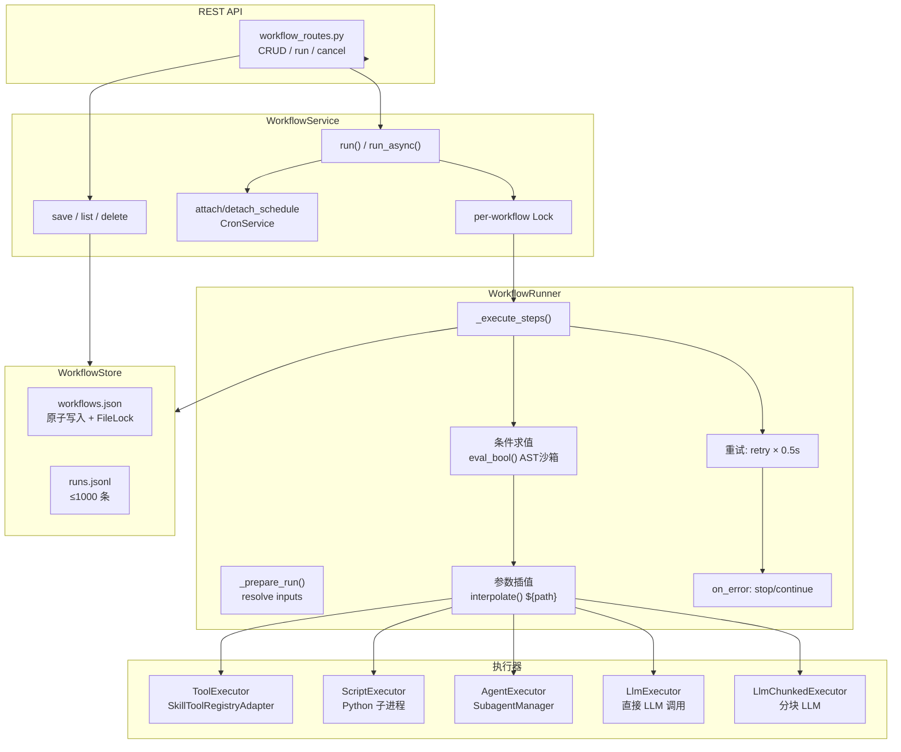

---

## 11. 扩展指南

### 新增通道

实现 `BaseChannel` 抽象接口（`start()` / `stop()` / `send()` / `send_delta()` / `is_allowed()`），放置于 `channels/` 目录下即可被 `discover_all()` 自动发现。配置 `allowFrom` 白名单控制访问权限。

### 新增专家智能体

1. 在 `agents/prompts/` 下创建系统提示词文件
2. 在 `agents/` 下添加 YAML（必填: name/display_name/description/system_prompt_file/scoped_skills/output_schema）
3. `AgentRegistry` 启动时自动加载验证（name 正则 `^[a-z][a-z0-9_]*$`、技能互斥、二进制可用性）
4. 如需端点互斥设 `endpoint_bound: true`；如仅需 SkillTool 设 `minimal_tools: true`
5. Orchestrator 提示词中的专家表自动更新

### 新增技能

1. 在 `skills/<name>/` 下创建 `SKILL.md`（YAML frontmatter: name/description/requires/risk_level）
2. 实现 `handler.py` 的 `async run(args: dict, ctx: SkillContext) -> SkillResult`
3. 可选: `input.schema.json` + `output.schema.json`（workflow UI 使用）
4. `SkillsLoader` 自动发现并注册为 LLM 工具（SkillTool）
5. 如需工作流可用，handler.py 会被 `SkillToolRegistryAdapter` 自动适配

### 新增数据表

1. `cmdb/models.py` 添加 SQLAlchemy ORM 模型
2. `cmdb/repo.py` 添加 CRUD helper（遵循 upsert + 自然键模式）
3. Alembic 迁移脚本
4. 如需仪表盘：添加聚合查询函数 → WebSocket / REST API 暴露

### 新增工作流步骤类型

1. 在 `workflow/executors/` 下创建新执行器，实现 `StepExecutor.execute(step, args, ctx) -> StepResult`
2. 在 `executors/__init__.py` 的 `build_default_executors()` 中注册
3. `workflow/types.py` 的 `StepKind` Literal 添加新类型
4. 前端 `workflow/kind-forms.tsx` 添加对应编辑表单

### 新增工作流模板

1. 在 `workflow/templates.py` 添加工厂函数（返回 `dict[str, Any]`）
2. 内联脚本放在 `workflow/scripts.py`（大字符串常量，stdin JSON → stdout JSON）
3. 在 `list_templates()` 注册到目录

### 新增前端页面

1. `webui/src/pages/` 创建页面组件
2. `webui/src/App.tsx` 的 `<Routes>` 中添加路由
3. `webui/src/lib/api.ts` 或新建 client 添加 API 调用
4. `webui/src/hooks/` 创建数据 hook
5. 使用 shadcn/ui 组件库（`webui/src/components/ui/`）

### 新增工具

继承工具基类 → `ToolRegistry.register()` → 在 `_register_operational_tools()`（子智能体）或 `_register_orchestrator_tools()`（编排器）中挂载。

---

## 12. 系统未来拓展功能

1.使用sodan、quark、fofa等每天定时扫描公网资产（可自定义扫描关键词），发现可能是属于指定企业或单位的加入扫描资产列表，可以对这些资产进行一键扫描。
2.自动化白盒测试、生成漏洞清单与复现路径。
3.漏洞拓扑图
4.增加一个人工智能专项检查（对智能进行专项渗透）
5.增加网络安全知识库

6.模型接入管控（智能体蜜罐、提示词过滤、工具调用监控）
