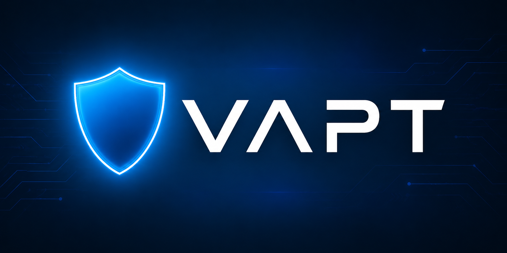

# 🛡️ VAPT3 · secbot

<div align="center">
  <p>
    
    
    
    
    
  </p>
</div>

**VAPT3 / secbot** 是一个基于大模型的**对话式多智能体网络安全协作系统**。它在 [nanobot](https://github.com/HKUDS/nanobot) 的轻量 Agent Loop 之上，构建了一层"主控 Orchestrator + 可插拔专家智能体池"的安全作业能力：用户用自然语言提出安全诉求，主控智能体理解意图、拆解任务，动态编排资产探测、端口扫描、漏洞扫描、弱口令检测、报告生成等专家智能体，驱动 `nmap` / `fscan` / `nuclei` / `hydra` 等底层工具，最终交付结构化的 VAPT 报告。

> VAPT = Vulnerability Assessment & Penetration Testing（漏洞评估与渗透测试）

---

## ✨ 核心特性

- **🧠 对话即调度** — 主控智能体（Orchestrator）用 LLM Function Calling 做动态规划，无需预先绘制流程图。
- **🧩 专家智能体池** — 每个专家 = 提示词 + 工具集 + 输入输出 Schema，彼此完全解耦，新增一个智能体只需注册一条元数据。
- **🔐 高危动作护栏** — 扫描/爆破/PoC 执行等高危操作前插入人工确认节点，全链路审计日志留痕。
- **🗄️ CMDB 资产库** — SQLite + SQLAlchemy + Alembic 迁移，资产、端口、漏洞、扫描任务统一建模与检索。
- **📝 一键 VAPT 报告** — 内置报告智能体，支持 Markdown / HTML / PDF 多格式导出，表格、拓扑、修复建议齐备。
- **🌊 海蓝主题 WebUI** — React + Tailwind + assistant-ui，面向 AI 原生交互，实时呈现思考与执行过程。
- **🔌 沿用 nanobot 通道** — WebSocket 通道保留，OpenAI 兼容 API + Python SDK 可嵌入现有平台。

## 🧭 总体架构

```
┌──────────────────────────── 对话交互层 ────────────────────────────┐
│      WebUI (React + 海蓝主题)  ·  WebSocket  ·  REST (FastAPI)      │
└──────────────────────┬───────────────────────────┬─────────────────┘
                       │                           │
            ┌──────────▼──────────┐     ┌──────────▼──────────┐
            │  调度编排层           │     │  CMDB / 审计层       │
            │  Orchestrator LLM    │◀────│  资产 · 漏洞 · 任务   │
            │  (Function Calling)  │     │  SQLite + Alembic    │
            └──────────┬──────────┘     └─────────────────────┘
                       │ tool_calls
      ┌────────────────┼────────────────┬────────────────┐
      ▼                ▼                ▼                ▼
┌──────────┐    ┌──────────┐    ┌──────────┐     ┌──────────┐
│ 资产探测  │    │ 端口扫描  │    │ 漏洞扫描  │ ... │ 报告生成  │
│ Agent    │    │ Agent    │    │ Agent    │     │ Agent    │
└─────┬────┘    └─────┬────┘    └─────┬────┘     └──────────┘
      │ Skills/Function Calling
      ▼
┌──────────────────────── 工具 / 执行层 ────────────────────────┐
│  nmap  ·  qscan  ·  fscan  ·  nuclei  ·  hydra  ·  自研脚本   │
└────────────────────────────────────────────────────────────────┘
```

四层职责：

| 层次 | 职责 | 关键实现 |
|------|------|----------|
| 对话交互层 | 接收指令、呈现过程与结果 | `secbot/web/`、`webui/src/secbot/` |
| 调度编排层 | 意图解析、DAG 规划、调度分发、上下文接力 | [orchestrator](secbot/agents/orchestrator.py)、[high_risk](secbot/agents/high_risk.py)、[registry](secbot/agents/registry.py) |
| 专家智能体层 | 封装角色提示词 + 工具 + I/O Schema | `secbot/agents/*.yaml` |
| 工具执行层 | 真正执行安全操作的原子能力 | `secbot/skills/`、`secbot/security/` |

## 🤖 内置专家智能体

| 智能体 | 能力关键词 | 输入 → 输出 | 底层工具 |
|--------|-----------|-------------|----------|
| `asset_discovery` 资产探测 | 存活扫描 · 网段探测 · 资产发现 | `target` → `ips[]` | nmap ping |
| `port_scan` 端口扫描 | 端口识别 · 服务指纹 | `ips[]` → `services[]` | nmap / qscan |
| `vuln_scan` 漏洞扫描 | CVE 匹配 · PoC 验证 | `services[]` → `vulnerabilities[]` | nuclei / fscan |
| `weak_password` 弱口令检测 | 暴力破解 · 默认凭证 | `services[]` → `weak_accounts[]` | hydra |
| `report` 报告生成 | 结构化汇总 · 多格式输出 | `findings[]` → `report.md/html/pdf` | 内置渲染器 |

> 所有智能体配置在 [secbot/agents/](secbot/agents/)，扩展新智能体参见下文 *扩展专家智能体*。

## 🚀 快速开始

### 1. 安装

```bash
git clone https://github.com/gongzeq/VAPT3.git
cd VAPT3
pip install -e .
```

> 底层安全工具（`nmap` / `nuclei` / `hydra` 等）请按需自行安装，secbot 以 subprocess 方式调用。

### 2. 初始化配置

```bash
secbot onboard
```

编辑 `~/.secbot/config.json`：

```json
{
  "providers": {
    "openrouter": { "apiKey": "sk-or-v1-xxx" }
  },
  "agents": {
    "defaults": {
      "provider": "openrouter",
      "model": "anthropic/claude-opus-4-6"
    }
  },
  "channels": { "websocket": { "enabled": true } }
}
```

### 3. 启动对话

secbot 有三个互不相同的入口，**启动前请确认选对了对应场景**：

| 场景 | 命令 | 默认端口 | 说明 |
|------|------|---------|------|
| CLI 直连 | `secbot agent` | — | 终端交互，适合快速冒烟 |
| OpenAI 兼容 API | `secbot serve` | `8000` | `/v1/chat/completions`，用于嵌入第三方平台，**不为 WebUI 服务** |
| WebUI / 网关 | `secbot gateway` | `18790`（健康检查）+ `8765`（WebSocket 通道） | WebUI 依赖此入口 |

#### 3.1 CLI 交互

```bash
secbot agent
```

#### 3.2 启动 WebUI（后端 + 前端）

**后端**：WebUI 通过 `/webui/bootstrap` 领取会话 token，该端点由 `websocket` 通道提供，所以 **必须** 在 `~/.secbot/config.json` 里启用：

```json
{
  "channels": {
    "websocket": {
      "enabled": true,
      "host": "127.0.0.1",
      "port": 8765
    }
  }
}
```

然后启动网关（`-v` 打开详细日志）：

```bash
secbot gateway -v
# ✓ Channels enabled: websocket
# ✓ WebSocket server listening on ws://127.0.0.1:8765/
# ✓ Health endpoint: http://127.0.0.1:18790/health
```

验证：

```bash
curl http://127.0.0.1:8765/webui/bootstrap
# {"token":"nbwt_...","ws_path":"/","expires_in":300,"model_name":"..."}
```

**前端**（默认 `bun`，也可用 `npm`）：

```bash
cd webui
bun install && bun run dev        # 或 npm install && npm run dev
# VITE ready → http://127.0.0.1:5173/
```

Vite 开发代理默认把 `/webui`、`/api`、`/auth`、`/`（WebSocket 升级）转发到 `http://127.0.0.1:8765`。如需换端口，设置环境变量 `NANOBOT_API_URL=http://host:port` 再启动 `bun run dev`。

> 常见故障：浏览器提示「无法连接到 nanobot」/ Vite 日志出现 `ECONNREFUSED 127.0.0.1:8765` → 十有八九是 `channels.websocket.enabled` 还是 `false`，或者启动的是 `secbot serve` 而不是 `secbot gateway`。

#### 3.3 OpenAI 兼容 API（可选）

```bash
secbot serve -v -p 8000
# Endpoint : http://127.0.0.1:8000/v1/chat/completions
```

该入口要求默认模型对应 Provider 已配置 `apiKey`，否则启动即报 `No API key configured for provider '...'`。

### 4. 一次典型对话

```
👤  扫描 192.168.1.0/24 网段的高危漏洞，并生成报告
🤖  [规划] asset_discovery → port_scan → vuln_scan → report
🤖  [asset_discovery] 发现 12 台存活主机
🤖  [port_scan] 36 个开放端口，识别出 HTTP/SSH/MySQL
⚠️  高危动作确认：即将对 3 台主机运行 nuclei CVE 扫描，是否继续？ [y/N]
👤  y
🤖  [vuln_scan] 命中 5 个高危漏洞
🤖  [report] 报告已生成 → reports/vapt-20260507-1423.pdf
```

## 🧱 扩展专家智能体

新增一个专家智能体只需三步：

**1. 新建 YAML 配置** `secbot/agents/new_agent.yaml`

```yaml
name: weak_password
display_name: 弱口令检测智能体
description: 针对指定服务进行常见弱口令爆破
triggers: ["弱口令", "暴力破解", "密码检测"]
input_schema:
  services: list
output_schema:
  weak_accounts: list
system_prompt: |
  你是一个弱口令检测专家。使用 hydra_brute_force 工具对输入 services 执行爆破，
  仅输出 JSON。
tools:
  - name: hydra_brute_force
    description: 调用 hydra 对指定服务执行口令爆破
    parameters:
      target: string
      service: string
```

**2. 如需新底层工具**，在 [secbot/skills/](secbot/skills/) 注册对应 Skill。

**3. 重启**，Orchestrator 会自动把该智能体纳入规划候选池。

## 🗄️ CMDB 资产库

```bash
# 查看数据库位置
secbot cmdb path

# 运行迁移
secbot cmdb migrate

# 查询资产 / 漏洞 / 任务
secbot cmdb list-assets
secbot cmdb list-findings --severity high
```

模型定义详见 [secbot/cmdb/models.py](secbot/cmdb/models.py)，迁移脚本位于 [secbot/cmdb/migrations/](secbot/cmdb/migrations/)。

## 🛡️ 安全与合规

- **授权前置** — 所有扫描任务必须带上授权凭据（目标范围 + 授权人），CMDB 记录留痕。
- **高危护栏** — 爆破、RCE PoC 等动作走 [high_risk](secbot/agents/high_risk.py) 确认 hook，默认阻断直到人工放行。
- **权限沙箱** — 工具调用走 [secbot/security/network.py](secbot/security/network.py) 做网段白名单校验与命令注入防护。
- **审计日志** — 每次 tool call 记录输入、输出、发起人、时间戳，支持离线导出。

> ⚠️ 请仅在获得授权的网络环境中使用 secbot。滥用后果由使用者自行承担。

## 🧪 WebUI（开发中）

<p align="center">
  
</p>

- 技术栈：React + Vite + Tailwind + assistant-ui
- 主题：海蓝 Ocean Blue（`#0E6BA8` 主强调 / `#7AB8FF` 辅助）
- 页面：Assets 资产看板 · Tasks 任务编排 · Reports 报告归档
- 开发：见 [webui/README.md](webui/README.md)

## 🗂️ 目录结构

```
secbot/
├── agents/          # 专家智能体配置 + Orchestrator + 高危 hook
├── agent/           # 继承自 nanobot 的 Agent Loop（runner/memory/hook）
├── api/             # FastAPI 服务器
├── channels/        # WebSocket 通道
├── cmdb/            # 资产/漏洞/任务数据库（SQLite + Alembic）
├── report/          # VAPT 报告 builder & 渲染器
├── skills/          # 底层工具封装（nmap / nuclei / hydra / ...）
├── security/        # 网段白名单、命令注入防护
└── web/             # WebUI 静态资源挂载
tests/               # 单测 + 集成测试
webui/               # 海蓝主题前端
prd.md               # 产品需求文档（本 README 的依据）
```

## 📚 文档

- 产品需求：[prd.md](prd.md)
- 开发规范与 Trellis 工作流：[.trellis/workflow.md](.trellis/workflow.md)
- Agent 编排契约：[.trellis/spec/](./.trellis/spec/)
- 继承自 nanobot 的通用文档：[docs/](docs/)

## 🤝 贡献

- 主分支 `main` 面向稳定迭代，重构和破坏性变更请另开分支 PR。
- 涉及新的专家智能体 / 底层工具时，请补充 `tests/agent/` 与 `tests/skills/` 下的测试。
- 上游 `HKUDS/nanobot` 已配置为 `upstream`，定期 `git fetch upstream && git rebase upstream/main` 同步 Agent Loop 改进。

## 📝 致谢

- 感谢 [HKUDS/nanobot](https://github.com/HKUDS/nanobot) 提供的轻量 Agent Loop 基座。
- 安全工具生态：nmap、nuclei、fscan、hydra 等开源项目。

## 📄 License

MIT — 详见 [LICENSE](LICENSE)。
