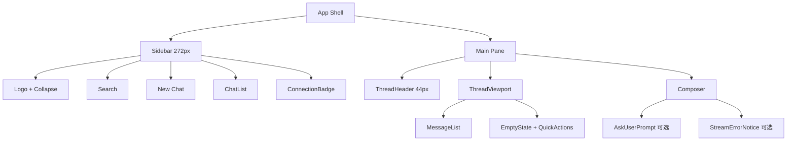

# UX 设计 · 风格设定

> 本文档基于 `webui/` 当前前端实现（React 18 + Vite + Tailwind + shadcn/ui + assistant-ui）汇总而成，目的是为 secbot WebUI 建立一份**可执行的视觉与交互契约**。
>
> 权威规范位于 `.trellis/spec/frontend/`；本文档是面向产品/设计/新成员的"总览 + 快速查阅"视图。所有硬性约束都可溯源到对应的 spec。

---

## 0. 设计定位

| 维度 | 定位 |
|------|------|
| 产品品类 | 安全运维 Agent 控制台（Security Operations Console） |
| 主要角色 | 渗透测试工程师、安全运维、应急响应 |
| 典型场景 | 长时间盯屏、多并发扫描、高危操作确认、报告生成 |
| 关键词 | 稳重 / 专业 / 可信 / 科技感 / 低视觉疲劳 |

视觉上**对齐国产安全产品心智**（奇安信 / 360 / 深信服），避开"创意型 LLM 工具"的紫/粉调；保留一流 AI 产品（Claude、ChatGPT）的**对话优先**布局体感。

---

## 1. 技术底座

| 类别 | 选型 | 说明 |
|------|------|------|
| 框架 | React 18.3 + TypeScript 5.7 | 严格模式、函数式组件 |
| 构建 | Vite 5.4 | HMR 独立端口 5174，避免与 `/` WebSocket 冲突 |
| 样式 | Tailwind CSS 3.4 + `tailwindcss-animate` + `@tailwindcss/typography` | 所有颜色走 CSS 变量 |
| 组件库 | shadcn/ui（New York 风格，neutral 基色）+ Radix UI primitives | 配置见 [`webui/components.json`](../webui/components.json) |
| 聊天内核 | `@assistant-ui/react` 0.10 + `@assistant-ui/react-markdown` | 通过 `useExternalStoreRuntime` 桥接自研 WebSocket |
| 图表白名单 | `recharts`（KPI）+ `react-flow`（拓扑） | 其余图表库需先改 spec |
| 图标 | `lucide-react` | 唯一图标库，禁止混用 |
| 国际化 | `i18next` + `react-i18next`，支持 9 种语言 | 见 [`src/i18n/config.ts`](../webui/src/i18n/config.ts) |
| 数据层 | `@tanstack/react-query` + 自研 `NanobotClient` WS 客户端 | - |

---

## 2. 色彩系统

### 2.1 主题策略

- **深色优先**：运维场景长时间盯屏，默认深色、中性护眼。
- **Token 驱动**：组件**禁止硬编码 hex/rgb**，所有色值通过 `hsl(var(--token))` 或 Tailwind 语义类（`bg-primary` / `text-severity-critical`）消费。token 由 [`src/globals.css`](../webui/src/globals.css) 在 `@layer base` 发布。
- **三套调色板共存**：
  1. `:root` — shadcn neutral 浅色（保留为备选，未正式启用）
  2. `.dark` — shadcn neutral 深色
  3. `:root[data-theme="secbot"]` — **secbot 安全运维主题**（海蓝 + 5 级严重度）

### 2.2 主强调色 — 海蓝

| Token | HEX | HSL | 用途 |
|-------|-----|-----|------|
| `--primary` | `#1E90FF` | `210 100% 56%` | 主按钮、激活态、focus ring |
| `--primary-hover` | `#4DA8FF` | `210 100% 65%` | hover |
| `--primary-foreground` | `#0A0B10` | `230 20% 5%` | 主色面上的文字/图标（白色在 #1E90FF 上 < 4.5:1，禁用） |

> **不得擅自切换**主色为霓虹青/紫/粉/绿。变更需通过 `.trellis/spec/frontend/theme-tokens.md` 修订。

**深色变体** `#0A74DA`（HSL `210 92% 45%`）仅在需与 `--sev-low` 同屏时启用（见 §2.4 碰撞规则）。

### 2.3 深色基础面板

| Token | HEX | HSL | 用途 |
|-------|-----|-----|------|
| `--background` | `#0A0B10` | `230 20% 5%` | 应用底 |
| `--card` | `#13141B` | `230 18% 9%` | 卡片（比背景 +3~4% 明度） |
| `--popover` | `#1A1C25` | `230 16% 12%` | Dialog / Popover 提升层 |
| `--border` | `#262833` | `230 12% 18%` | 标准分割线 |
| `--border-subtle` | `#1F2029` | `230 14% 14%` | 低存在感分割线 |
| `--foreground` | `#E6E8EE` | `220 10% 92%` | 主文本（**刻意避开纯白**，降低刺眼感） |
| `--muted-foreground` | `#9AA0AC` | `220 7% 64%` | 次级文本、时间戳 |
| `--placeholder` | `#5C6170` | `225 8% 40%` | 输入占位符 |

### 2.4 严重度 5 级（功能色，非品牌色）

对齐 OWASP / Burp 约定，且在 `#0A0B10` 背景上全部 ≥ 4.5:1 对比度（黄色 ≥ 7）。

| 级别 | Token | HEX | Tailwind 近邻 |
|------|-------|-----|----------------|
| Critical | `--sev-critical` | `#FF4D4F` | red-500 |
| High | `--sev-high` | `#FF8A3D` | orange-500 |
| Medium | `--sev-medium` | `#FACC15` | yellow-400 |
| Low | `--sev-low` | `#3FB6FF` | sky-400 |
| Info | `--sev-info` | `#9AA0AC` | slate-400 |

`--destructive` **别名**到 `--sev-critical`，所有销毁类操作走同一语义色。

**⚠ 主色 × Low 同屏碰撞规则**（`#1E90FF` 与 `#3FB6FF` 仅 7° 色相差）：同屏需二选一：
1. **推荐**：该实例 `--primary` 切换到 `#0A74DA`，`--sev-low` 保持天蓝。
2. 备选：`--primary` 保留 `#1E90FF`，将 `--sev-low` 降级到 `#9AA0AC`（牺牲"蓝 = info"直觉）。

### 2.5 明暗切换

通过 [`useTheme` Hook](../webui/src/hooks/useTheme.ts)：
- 首次加载读 `localStorage`，无记录则跟随系统 `prefers-color-scheme`。
- 切换时给 `<html>` 添加/移除 `.dark` class，CSS 变量自动切换。
- 顶栏图标 `Sun` ↔ `Moon` 切换反馈。

---

## 3. 排版

### 3.1 字体栈（[`tailwind.config.js`](../webui/tailwind.config.js)）

**Sans（UI 文本）**：`system-ui → -apple-system → BlinkMacSystemFont → "Segoe UI" → Roboto → "Helvetica Neue" → Arial → "Noto Sans" → "Noto Sans SC" → "PingFang SC" → "Hiragino Sans GB" → "Microsoft YaHei" → sans-serif → Emoji`

**Mono（代码/trace）**：`"JetBrains Mono" → "Fira Code" → "Cascadia Code" → "Source Code Pro" → Menlo → Consolas → monospace`

优先"系统原生 → 专业 sans → CJK 优化 sans → emoji"。

### 3.2 CJK 行高优化

普通 prose 默认 1.625 对中日韩偏紧，[`globals.css`](../webui/src/globals.css) 通过 `:lang()` 伪类把 `--cjk-line-height` 提升到 **1.8**，并在 `MessageBubble` 行内应用：

```tsx
<div style={{ lineHeight: "var(--cjk-line-height)" }}>
```

### 3.3 字号梯度

不强制 Token 化，沿用 Tailwind 类：
- 欢迎页标题 `text-[40px] / sm:text-[48px]`，`tracking-[-0.045em]`
- 段落正文 `text-sm` (14px)，用户气泡 `text-[18px]/[1.8]`
- 次级/标签 `text-xs` (12px) / `text-[11.5px]`
- Trace 行 `font-mono text-[11.5px]`

### 3.4 圆角系统

统一自 `--radius: 0.4375rem` (7px)：
- `rounded-sm` = 3px
- `rounded-md` = 5px
- `rounded-lg` = 7px
- 消息气泡 `rounded-[18px]`，媒体缩略图 `rounded-[14px]`，快速操作卡 `rounded-[20px]`（**显式使用任意值，突出亲和感**）
- 输入/按钮走 `rounded-full` 或 `rounded-md`

### 3.5 Markdown

使用 `@tailwindcss/typography`，并在 `.markdown-content` 里用 `--tw-prose-*` 覆盖为设计 token，确保 AI 回复和用户消息使用同一 `--foreground`。

---

## 4. 布局结构

### 4.1 应用 Shell（[`App.tsx`](../webui/src/App.tsx)）



### 4.2 侧栏行为

- 桌面端（≥ lg / 1024px）：宽 272px，常驻左侧，收起时 `transition-[width] duration-300 ease-out`。
- 移动端：使用 `<Sheet>` 抽屉覆盖式弹出，宽度保持 272px。
- 状态通过 `localStorage` 键 `nanobot-webui.sidebar` 持久化。
- 视觉：背景 `bg-sidebar`，右侧 `shadow-inner-right`（自定义 utility）。

### 4.3 ChatPane 视图层级（[`.trellis/spec/frontend/webui-design.md`](../.trellis/spec/frontend/webui-design.md)）

```
Main pane
├── ChatPane           ← assistant-ui Runtime
│   ├── PlanTimeline   ← Orchestrator 计划步骤
│   ├── MessageList
│   │   └── MessageBubble
│   │       ├── ToolCallCard    (单次 skill 调用)
│   │       ├── ScanResultTable (端口/漏洞/主机结果)
│   │       └── PlanTimeline    (内联回显)
│   ├── DestructiveAlertDialog  ← 全局挂载，WS 事件触发
│   └── Composer
├── AssetsView         ← CMDB 资产浏览器
├── ScanHistoryView    ← 扫描历史
└── ReportsView        ← 报告导出
```

### 4.4 响应式断点

仅以 `lg: 1024px` 作为**主切分**：
- `< lg`：侧栏抽屉化、快速操作 2 列
- `≥ lg`：侧栏常驻、快速操作 6 列、隐藏"打开侧栏"按钮

---

## 5. 组件系统

### 5.1 shadcn/ui 基础件（[`src/components/ui/`](../webui/src/components/ui/)）

| 组件 | variant / size | 主要场景 |
|------|----------------|----------|
| `Button` | default / destructive / outline / secondary / ghost / link × default / sm / lg / icon | 全站 |
| `Input` / `Textarea` | — | 表单、Composer |
| `Dialog` / `Sheet` | — | 设置弹层、移动端侧栏 |
| `AlertDialog` | destructive | **所有销毁/高危** |
| `DropdownMenu` | — | 模型下拉、语言切换 |
| `Avatar` / `Tooltip` / `Tabs` / `ScrollArea` / `Separator` | — | 通用 |

### 5.2 业务组件

| 组件 | 作用 | 关键文件 |
|------|------|----------|
| `ThreadShell` | 聊天主壳，统管 header/messages/composer/quickActions | [`thread/ThreadShell.tsx`](../webui/src/components/thread/ThreadShell.tsx) |
| `ThreadHeader` | 44px 顶栏：侧栏按钮 / 主题切换 / 设置 | [`thread/ThreadHeader.tsx`](../webui/src/components/thread/ThreadHeader.tsx) |
| `ThreadComposer` | 输入框 + 图片粘贴/拖拽 + 斜杠命令 + 模型徽章 | [`thread/ThreadComposer.tsx`](../webui/src/components/thread/ThreadComposer.tsx) |
| `AskUserPrompt` | 按钮式选择题（LLM 发起） | [`thread/AskUserPrompt.tsx`](../webui/src/components/thread/AskUserPrompt.tsx) |
| `MessageBubble` | 用户气泡 / 助手纯 Markdown / Trace 折叠组 三态 | [`MessageBubble.tsx`](../webui/src/components/MessageBubble.tsx) |
| `TraceGroup` + `AgentToolGroup` + `ToolCallItem` | Agent → Tool 两级层级的思维链展示 | 同上 |
| `ImageLightbox` | 图片放大查看器 | [`ImageLightbox.tsx`](../webui/src/components/ImageLightbox.tsx) |
| `CodeBlock` / `MarkdownTextRenderer` | 代码高亮 + Markdown AST 渲染 | [`CodeBlock.tsx`](../webui/src/components/CodeBlock.tsx) |
| `SettingsView` | Provider/Model/Base URL/API Key/语言/登出 | [`settings/SettingsView.tsx`](../webui/src/components/settings/SettingsView.tsx) |
| `Sidebar` / `ChatList` / `ConnectionBadge` / `LanguageSwitcher` / `DeleteConfirm` / `ErrorBoundary` | 外围支撑 | `src/components/*.tsx` |

### 5.3 图标规范

- **唯一来源** `lucide-react`，禁止自描 SVG / 引入新图标库。
- 常用语义映射：
  - 导航：`Menu` / `PanelLeftOpen` / `PanelLeftClose` / `ChevronRight`
  - 主题：`Sun` / `Moon`
  - 设置：`Settings` / `SquarePen`（新建）/ `Search`
  - 动作：`Copy` / `Check` / `Eye` / `EyeOff`
  - 状态：`Loader2`（旋转）/ `AlertCircle` / `Wrench`（tool trace）/ `Bot`（sub-agent）
  - 媒体：`ImageIcon` / `FileIcon` / `PlaySquare`
  - 快速操作：`LayoutGrid`(plan) / `BarChart3`(analyze) / `Lightbulb`(brainstorm) / `Code2`(code) / `BookOpen`(summarize) / `MoreHorizontal`(more)

---

## 6. 关键 UX 模式

### 6.1 消息气泡三态

| 态 | 渲染 | 设计取舍 |
|----|------|----------|
| **User** | 右对齐，`bg-secondary/70` 圆角 pill，`text-[18px]/[1.8]`，宽度 `max-w-[min(85%,36rem)]` | 参考 agent-chat-ui 的"对话药丸"，用户消息像贴纸而非长文 |
| **Assistant** | 全宽裸 Markdown（无气泡），让代码块/列表/标题像文档 | 降低助手消息的"聊天感"，强化阅读体验 |
| **Trace** | 折叠式灰度组，默认展开，`font-mono text-[11.5px]`，`Wrench` 图标 | 工具调用轨迹明显不同于对话，防止 breadcrumb 冒充回答 |

### 6.2 思维链（Agent 社交网络可视化）

当后端以结构化 `traceEntries` 推送时，`TraceGroup` 渲染**两级层级**：
```
🔧 12 tool calls                    [ChevronRight 可折叠]
│
├── 🤖 port_scan_expert (3 tools)   [ChevronDown 子级可折叠]
│   ● nmap          target=192.168...
│   ● masscan       target=192.168...
│   ✓ service_probe target=...
│
└── 🤖 vuln_scan_expert (5 tools)
    ● nuclei  template=cve-2023-...
    …
```

单个 tool 项通过 1.5×1.5px 圆点 + 颜色传递状态：
- 无状态 `bg-muted-foreground/40`
- 成功 `bg-green-500`
- 失败 `bg-red-500`
- 运行中（未来）`bg-primary`

### 6.3 高危确认（`AlertDialog destructive`）

**所有**远程写入 / 入侵扫描 / 删除服务端数据的动作 **必须**走 shadcn `<AlertDialog destructive>`，禁止自建 modal。结构：

1. Header：`⚠` + "确认执行高危操作"
2. 风险摘要卡：`skill_name` / `target` / `expected_impact` / `external_network` badge
3. 操作行：左取消（outline）/ 右确认（destructive 变体，**需 1 秒悬停才变全不透明**，防误点）

用户取消时，runtime **注入** synthetic `tool_result`：
```json
{ "status": "user_denied", "reason": "..." }
```
防止 Orchestrator 在未得到反馈时重复下发同一工具。

### 6.4 流式渲染合约

WebSocket 事件序列：`message → delta* → stream_end → turn_end`。UI 响应：
- 首 delta 抵达前：三点 `TypingDots`（`animate-bounce`，0/150/300ms 延迟）
- delta 中：末尾追加 `StreamCursor`（`animate-pulse` 竖条）
- `stream_end` 移除 cursor，显示复制按钮（`hover:bg-muted/55`）
- 长工具（nmap / nuclei / fuzz）必须符合 progress + summary_json + raw_log_path 契约（详见 [`component-patterns.md §1.2`](../.trellis/spec/frontend/component-patterns.md)）

### 6.5 空状态 & 快速操作

会话为空时居中展示：
- 大号问候语（40~48px，负字距）
- 六宫格快速操作卡（≥ lg，以下降级为 2/3 列）

六个快速操作（来自 i18n key `thread.empty.quickActions.*`），色彩**刻意打破主色垄断**，传递"创意工具箱"感（仅 ICON 上色，卡片整体仍然中性）：

| key | icon | 色值 |
|-----|------|------|
| plan | `LayoutGrid` | `#f25b8f` |
| analyze | `BarChart3` | `#4f9de8` |
| brainstorm | `Lightbulb` | `#53c59d` |
| code | `Code2` | `#eba45d` |
| summarize | `BookOpen` | `#a877e7` |
| more | `MoreHorizontal` | `text-muted-foreground/65` |

> ⚠ 这 6 色是**图标装饰色**，出于"丰富性"例外允许硬编码；业务色一律走 token。

### 6.6 错误处理

- **所有错误走 `alert()`，不切换到错误专页**（见 [`SettingsView.tsx:52-57`](../webui/src/components/settings/SettingsView.tsx#L52-L57)）。
- 但页内需同时渲染 Retry / Sign-out，避免"弹窗关了剩空白"。
- 使用 `<ErrorBoundary>` 兜底 React 渲染崩溃。

### 6.7 聊天设置：三合一 Provider / Model / Endpoint

- Provider 下拉切换时联动刷新 Base URL 与 API Key 占位符（上次保存值 → spec 默认值）。
- API Key 三态契约：字段省略=保持 / 空串=清除 / 值=替换（映射到后端 `X-Settings-Api-Key` header）。
- `Fetch Models` 按钮用已保存 key（`apiKeyDirty=false` 时）探测端点。

---

## 7. 动效与可访问性

### 7.1 通用动效规范

| 场景 | 类 | 时长 |
|------|-----|------|
| 消息入场 | `animate-in fade-in-0 slide-in-from-bottom-1 duration-300` | 300ms |
| Trace 展开 | `animate-in fade-in-0 slide-in-from-top-1 duration-200` | 200ms |
| 侧栏伸缩 | `transition-[width] duration-300 ease-out` | 300ms |
| 图片 hover | `hover:scale-[1.02] hover:ring-2 hover:ring-primary/30` | 150ms |
| 颜色 hover/focus | `transition-colors duration-150` | 150ms |
| 连接中 | `animate-ping`（外环）+ `animate-pulse`（cursor） | — |
| 思考中 | `animate-bounce` × 3 点 | — |

### 7.2 Motion Reduce

遵循 WCAG 2.1，所有过渡类需搭配：
```
motion-reduce:transition-none
```
给启用"减少动态效果"系统偏好的用户降级为即时过渡。

### 7.3 焦点态

统一使用：
```
focus-visible:outline-none
focus-visible:ring-2
focus-visible:ring-ring
```
销毁/高危按钮还会叠加 `focus-visible:ring-primary/50` 提示。

### 7.4 ARIA & 键盘

- 所有 icon-only 按钮强制 `aria-label`。
- 装饰性图标 `aria-hidden`。
- Composer 支持 `Ctrl/Cmd+Enter` 发送、`Esc` 关菜单、↑/↓ 导航斜杠命令、`Tab` 选中。
- 屏阅专用文本使用 `sr-only`。

---

## 8. 国际化

| 项 | 规则 |
|----|------|
| 初始化 | `resolveInitialLocale()`：`localStorage(nanobot.locale)` → 浏览器 `navigator.languages` → 默认 `en` |
| 支持语言 | en / zh-CN / zh-TW / fr / ja / ko / es / vi / id（9 种） |
| 文本来源 | 全部 UI 字符串走 `useTranslation().t(key)`；禁止组件内写死中文/英文 |
| HTML lang | 切换时 `document.documentElement.lang` 同步 |
| 模型/Provider 枚举 | 后端返回 label，前端不翻译（保留 `DeepSeek` / `OpenRouter` 原样） |

---

## 9. 硬性约束（违反即 PR 打回）

来自 [`.trellis/spec/frontend/index.md`](../.trellis/spec/frontend/index.md)：

1. **禁止组件代码里写 raw hex / rgb**。永远用 Tailwind 语义类或 `hsl(var(--token))`。新增 token 必须**先**改 `theme-tokens.md`，再动 `globals.css`。
2. **禁止新增图表/图谱库**。需求必须能被 `react-flow` 或 `recharts` 组合满足，否则先过 spec PR。
3. **工具调用 UI 走 `assistant-ui` `toolUI` 注册表**。按 skill 名注册专属 renderer，禁止在巨型组件里 switch/case。
4. **销毁动作使用 shadcn `<AlertDialog destructive>`**，按 [`component-patterns.md §3`](../.trellis/spec/frontend/component-patterns.md) 的结构。禁自建 modal。
5. **严重度是封闭集**（Critical / High / Medium / Low / Info），禁止新增级别。
6. **`--primary` 与 `--sev-low` 同屏需走碰撞规则**（§2.4）。
7. **错误用 `alert()`，不切换错误专页**，但页内必须提供可恢复操作。

---

## 10. 实施前自检清单

开始任何 UI 改动前：

- [ ] 阅读 `.trellis/spec/frontend/index.md` 的 Hard Rules。
- [ ] 确认配色只用 token 或 Tailwind 语义类。
- [ ] 主色 / 严重度 Low 同屏时已选定碰撞规则 1 或 2。
- [ ] 销毁/高危动作走 `<AlertDialog destructive>`，并注入 `user_denied` 反馈。
- [ ] 新 skill 渲染器通过 `toolUI` 注册，无 switch/case。
- [ ] 文案全部走 i18n，无硬编码中英文。
- [ ] 动效均配 `motion-reduce:`。
- [ ] icon-only 按钮有 `aria-label`。
- [ ] 错误走 `alert()` + 页内 Retry。

---

## 参考

- [`.trellis/spec/frontend/index.md`](../.trellis/spec/frontend/index.md) — 前端硬规则
- [`.trellis/spec/frontend/theme-tokens.md`](../.trellis/spec/frontend/theme-tokens.md) — 配色合同
- [`.trellis/spec/frontend/component-patterns.md`](../.trellis/spec/frontend/component-patterns.md) — 聊天/销毁组件规范
- [`.trellis/spec/frontend/visualization-libraries.md`](../.trellis/spec/frontend/visualization-libraries.md) — 图表库白名单
- [`.trellis/spec/frontend/webui-design.md`](../.trellis/spec/frontend/webui-design.md) — 视图层级总览
- [`webui/src/globals.css`](../webui/src/globals.css) — CSS 变量权威实现
- [`webui/tailwind.config.js`](../webui/tailwind.config.js) — 字体/颜色/圆角扩展
- [`webui/src/components/MessageBubble.tsx`](../webui/src/components/MessageBubble.tsx) — 消息 & Trace 三态参考
